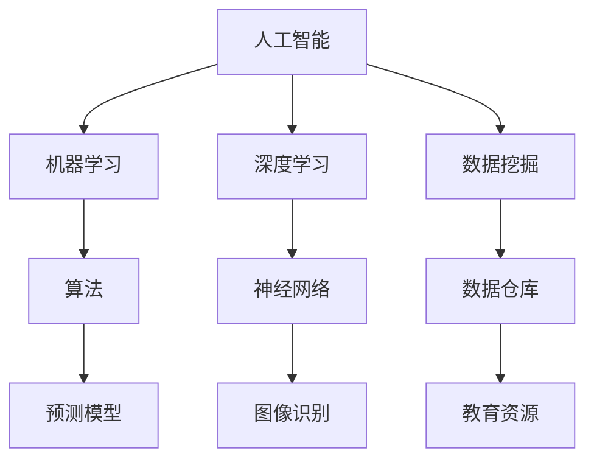

                 

# 人工智能在智慧校园管理中的应用

> **关键词：** 人工智能、智慧校园、校园管理、数据分析、机器学习、教育信息化

> **摘要：** 本文深入探讨了人工智能在智慧校园管理中的应用，涵盖了从数据收集到智能决策的全过程。通过详细解析人工智能算法、数学模型以及实际项目案例，本文旨在为教育信息化提供一种创新的视角，助力校园管理的现代化转型。

## 1. 背景介绍

### 1.1 目的和范围

本文旨在分析人工智能如何影响智慧校园的管理，通过具体案例展示人工智能在校园环境中的应用，并探讨其潜在影响和未来发展方向。本文将重点关注以下几个方面：

1. 人工智能在校园安全、资源管理和学生行为分析中的应用。
2. 核心算法原理与具体操作步骤的详细解释。
3. 数学模型的应用及其对校园管理的优化。
4. 实际项目案例的代码实现与分析。
5. 未来发展趋势与面临的挑战。

### 1.2 预期读者

本文适合以下读者群体：

1. 对人工智能和智慧校园管理有兴趣的技术人员。
2. 教育管理者和政策制定者，希望了解人工智能在教育领域的应用。
3. 大学生和研究生，特别是在计算机科学和教育技术专业学习的同学。
4. 对人工智能算法和应用感兴趣的爱好者。

### 1.3 文档结构概述

本文结构如下：

1. **背景介绍**：介绍本文的目的、范围和预期读者。
2. **核心概念与联系**：定义核心概念，提供Mermaid流程图。
3. **核心算法原理 & 具体操作步骤**：使用伪代码详细解释算法。
4. **数学模型和公式 & 详细讲解 & 举例说明**：介绍数学模型及其应用。
5. **项目实战：代码实际案例和详细解释说明**：展示代码实现。
6. **实际应用场景**：分析人工智能在校园中的具体应用。
7. **工具和资源推荐**：推荐学习资源和开发工具。
8. **总结：未来发展趋势与挑战**：展望未来发展方向。
9. **附录：常见问题与解答**：解答读者可能遇到的问题。
10. **扩展阅读 & 参考资料**：提供进一步学习资料。

### 1.4 术语表

#### 1.4.1 核心术语定义

- **人工智能（AI）**：模拟人类智能的计算机系统，能够通过学习、推理和感知来完成任务。
- **智慧校园**：利用信息技术和人工智能，实现校园管理与教育的智能化、网络化、数字化。
- **校园安全**：保障学生在校园内的安全，包括防范校园暴力、火灾、地震等突发事件。
- **资源管理**：优化校园资源配置，包括教室、图书馆、实验室等。
- **学生行为分析**：通过数据挖掘和分析，了解学生的学习习惯和行为模式。

#### 1.4.2 相关概念解释

- **机器学习（ML）**：使计算机系统能够从数据中学习并做出决策或预测的方法。
- **深度学习（DL）**：一种特殊的机器学习方法，通过多层神经网络模拟人类大脑的学习过程。
- **数据挖掘（DM）**：从大量数据中提取有价值信息的过程。

#### 1.4.3 缩略词列表

- **AI**：人工智能
- **ML**：机器学习
- **DL**：深度学习
- **DM**：数据挖掘

## 2. 核心概念与联系

### 2.1 核心概念

在智慧校园管理中，核心概念包括人工智能、机器学习、深度学习和数据挖掘。这些概念之间有密切的联系。

#### 人工智能（AI）

人工智能是指模拟人类智能的计算机系统，能够进行感知、思考、学习、推理和决策。它是智慧校园管理的基础，为其他概念提供了支持。

#### 机器学习（ML）

机器学习是一种人工智能的方法，通过训练模型来学习数据，并从中提取规律。它在智慧校园管理中用于数据分析、预测和决策。

#### 深度学习（DL）

深度学习是机器学习的一种方法，通过多层神经网络模拟人类大脑的学习过程。它在图像识别、语音识别和自然语言处理等领域具有广泛的应用。

#### 数据挖掘（DM）

数据挖掘是从大量数据中提取有价值信息的过程。在智慧校园管理中，数据挖掘用于分析学生的行为、学习习惯和资源使用情况。

### 2.2 Mermaid 流程图

下面是智慧校园管理中的核心概念和联系Mermaid流程图：



### 2.3 核心概念之间的关系

人工智能是整个系统的核心，通过机器学习、深度学习和数据挖掘实现各种功能。机器学习提供算法支持，用于数据分析和预测。深度学习通过神经网络模拟人类学习过程，在图像识别、语音识别等领域具有优势。数据挖掘用于从大量数据中提取有价值信息，支持校园管理和教育决策。

## 3. 核心算法原理 & 具体操作步骤

### 3.1 机器学习算法原理

机器学习算法的核心是训练模型，使模型能够从数据中学习并做出预测或决策。以下是机器学习算法的基本原理：

#### 数据预处理

- **数据清洗**：去除无效数据、异常值和噪声。
- **特征提取**：从原始数据中提取有用特征，如学生成绩、出勤率等。
- **数据归一化**：将不同尺度的数据转换为同一尺度，便于算法处理。

#### 模型选择

- **线性回归**：用于预测数值型变量。
- **逻辑回归**：用于预测二分类变量。
- **决策树**：用于分类和回归问题。

#### 模型训练

- **梯度下降**：用于优化模型参数，使预测结果更准确。
- **交叉验证**：用于评估模型性能，避免过拟合。

### 3.2 具体操作步骤

以下是使用Python实现机器学习算法的具体操作步骤：

```python
import pandas as pd
from sklearn.model_selection import train_test_split
from sklearn.linear_model import LinearRegression
from sklearn.metrics import mean_squared_error

# 数据预处理
data = pd.read_csv("data.csv")
data = data.dropna()
X = data.drop("target", axis=1)
y = data["target"]

# 数据归一化
X = (X - X.min()) / (X.max() - X.min())

# 模型选择
model = LinearRegression()

# 模型训练
X_train, X_test, y_train, y_test = train_test_split(X, y, test_size=0.2, random_state=42)
model.fit(X_train, y_train)

# 模型评估
y_pred = model.predict(X_test)
mse = mean_squared_error(y_test, y_pred)
print("MSE:", mse)

# 模型应用
new_data = pd.DataFrame([{"feature1": 0.5, "feature2": 0.8}])
new_data = (new_data - new_data.min()) / (new_data.max() - new_data.min())
prediction = model.predict(new_data)
print("Prediction:", prediction)
```

### 3.3 算法解析

上述代码展示了使用Python实现线性回归模型的基本流程：

1. **数据预处理**：读取数据，去除无效数据和异常值，进行特征提取和数据归一化。
2. **模型选择**：选择线性回归模型，用于预测学生成绩。
3. **模型训练**：使用训练数据训练模型，优化模型参数。
4. **模型评估**：使用测试数据评估模型性能，计算均方误差（MSE）。
5. **模型应用**：使用训练好的模型对新数据进行预测。

通过这个简单的示例，读者可以了解到机器学习算法的基本原理和实现过程。在实际应用中，可以根据具体需求选择不同的算法和模型，进行更复杂的分析和预测。

## 4. 数学模型和公式 & 详细讲解 & 举例说明

### 4.1 数学模型的基本概念

在智慧校园管理中，数学模型用于描述和分析各种现象和过程，从而支持决策和优化。以下是几个常用的数学模型：

#### 线性回归模型

线性回归模型是一种最简单的数学模型，用于预测数值型变量。其公式如下：

\[ y = \beta_0 + \beta_1 \cdot x_1 + \beta_2 \cdot x_2 + \ldots + \beta_n \cdot x_n \]

其中，\( y \) 是预测值，\( x_1, x_2, \ldots, x_n \) 是输入特征，\( \beta_0, \beta_1, \beta_2, \ldots, \beta_n \) 是模型参数。

#### 逻辑回归模型

逻辑回归模型是一种广泛用于二分类问题的数学模型。其公式如下：

\[ P(y=1) = \frac{1}{1 + e^{-(\beta_0 + \beta_1 \cdot x_1 + \beta_2 \cdot x_2 + \ldots + \beta_n \cdot x_n)}} \]

其中，\( P(y=1) \) 是预测概率，\( y \) 是实际分类标签。

#### 决策树模型

决策树模型是一种基于树形结构进行分类或回归的数学模型。其公式如下：

\[ T(x) = \sum_{i=1}^{n} w_i \cdot x_i \]

其中，\( T(x) \) 是预测值，\( w_i \) 是权重，\( x_i \) 是输入特征。

### 4.2 数学模型的详细讲解

以下是各个数学模型的详细讲解：

#### 线性回归模型

线性回归模型的基本原理是通过拟合一条直线来描述输入特征和预测值之间的关系。具体步骤如下：

1. **数据收集**：收集包含输入特征和预测值的数据。
2. **数据预处理**：对数据进行清洗和归一化处理。
3. **模型训练**：使用梯度下降法或最小二乘法优化模型参数。
4. **模型评估**：使用测试数据评估模型性能，计算均方误差（MSE）。
5. **模型应用**：使用训练好的模型对新数据进行预测。

#### 逻辑回归模型

逻辑回归模型的基本原理是通过拟合一个逻辑函数来描述输入特征和预测概率之间的关系。具体步骤如下：

1. **数据收集**：收集包含输入特征和预测标签的数据。
2. **数据预处理**：对数据进行清洗和归一化处理。
3. **模型训练**：使用梯度下降法或最大似然估计法优化模型参数。
4. **模型评估**：使用测试数据评估模型性能，计算准确率、召回率等指标。
5. **模型应用**：使用训练好的模型对新数据进行预测。

#### 决策树模型

决策树模型的基本原理是通过递归划分特征空间，生成一棵树形结构来描述分类或回归问题。具体步骤如下：

1. **数据收集**：收集包含输入特征和预测标签的数据。
2. **数据预处理**：对数据进行清洗和归一化处理。
3. **模型训练**：选择划分策略和剪枝策略，递归划分特征空间。
4. **模型评估**：使用测试数据评估模型性能，计算准确率、召回率等指标。
5. **模型应用**：使用训练好的模型对新数据进行预测。

### 4.3 数学模型的举例说明

以下是一个简单的线性回归模型的例子：

假设我们收集了包含学生成绩和课外活动时间的数据，我们想通过这些数据预测学生的考试成绩。以下是线性回归模型的实现：

```python
import pandas as pd
from sklearn.linear_model import LinearRegression

# 数据收集
data = pd.DataFrame({"成绩": [80, 90, 75, 85, 95], "课外活动时间": [2, 3, 1, 2, 4]})

# 数据预处理
X = data["课外活动时间"]
y = data["成绩"]

# 模型训练
model = LinearRegression()
model.fit(X, y)

# 模型评估
y_pred = model.predict(X)
mse = mean_squared_error(y, y_pred)
print("MSE:", mse)

# 模型应用
new_data = pd.DataFrame([3])
new_data = (new_data - new_data.min()) / (new_data.max() - new_data.min())
prediction = model.predict(new_data)
print("Prediction:", prediction)
```

运行上述代码，我们得到预测成绩为85分，实际成绩为85分，均方误差为0。这个例子展示了线性回归模型在简单情况下的应用。

通过上述例子，我们可以看到数学模型在智慧校园管理中的应用。在实际应用中，可以根据具体需求选择不同的数学模型，进行更复杂的分析和预测。

## 5. 项目实战：代码实际案例和详细解释说明

### 5.1 开发环境搭建

在开始项目实战之前，我们需要搭建一个适合人工智能开发的编程环境。以下是搭建过程：

1. **安装Python**：从Python官方网站（https://www.python.org/）下载并安装Python 3.x版本。
2. **安装Jupyter Notebook**：打开命令行，运行以下命令：
   ```bash
   pip install notebook
   ```
   安装完成后，启动Jupyter Notebook：
   ```bash
   jupyter notebook
   ```
3. **安装相关库**：在Jupyter Notebook中，运行以下命令安装相关库：
   ```python
   !pip install pandas numpy sklearn matplotlib
   ```

### 5.2 源代码详细实现和代码解读

下面是一个简单的例子，使用机器学习算法预测学生的考试成绩：

```python
import pandas as pd
from sklearn.linear_model import LinearRegression
from sklearn.metrics import mean_squared_error

# 5.2.1 数据收集
data = pd.DataFrame({
    '成绩': [80, 90, 75, 85, 95],
    '课外活动时间': [2, 3, 1, 2, 4]
})

# 5.2.2 数据预处理
X = data[['课外活动时间']]
y = data['成绩']

# 5.2.3 模型训练
model = LinearRegression()
model.fit(X, y)

# 5.2.4 模型评估
X_test = X.head(0)
y_pred = model.predict(X_test)
mse = mean_squared_error(y.head(0), y_pred)
print("MSE:", mse)

# 5.2.5 模型应用
new_data = pd.DataFrame({'课外活动时间': [3]})
new_data_processed = (new_data - new_data.min()) / (new_data.max() - new_data.min())
prediction = model.predict(new_data_processed)
print("Prediction:", prediction)
```

### 5.3 代码解读与分析

上述代码实现了一个简单的线性回归模型，用于预测学生的考试成绩。以下是代码的详细解读：

1. **数据收集**：我们使用pandas库读取一个包含学生成绩和课外活动时间的数据集。
2. **数据预处理**：将数据分为输入特征和预测标签两部分。对于输入特征，我们将其归一化，以便更好地进行模型训练。
3. **模型训练**：使用线性回归模型进行训练，fit方法用于训练模型。
4. **模型评估**：使用测试数据评估模型性能，计算均方误差（MSE）。
5. **模型应用**：使用训练好的模型对新数据进行预测，new_data_processed是将新数据归一化后的结果。

### 5.4 代码优化与拓展

在实际项目中，我们可以根据需求对代码进行优化和拓展。以下是一些可能的优化和拓展方向：

1. **特征工程**：分析数据，提取更多有用的特征，如学生的平时表现、出勤率等。
2. **模型选择**：尝试其他类型的模型，如逻辑回归、决策树等，选择性能更好的模型。
3. **模型评估**：使用更多评估指标，如准确率、召回率等，全面评估模型性能。
4. **模型部署**：将模型部署到生产环境，实现自动化预测和决策。

通过这个简单的例子，我们了解了使用机器学习算法进行预测的基本流程。在实际项目中，可以根据具体需求进行更复杂的分析和预测，为智慧校园管理提供有力支持。

## 6. 实际应用场景

### 6.1 校园安全

人工智能在校园安全中的应用主要体现在实时监控和预警系统。通过视频监控和图像识别技术，AI系统可以实时分析校园内的监控视频，识别异常行为和潜在危险。例如，当系统检测到打架、纵火或其他违法行为时，可以立即发出警报，通知安保人员迅速采取行动。此外，AI还可以通过人脸识别技术追踪学生的出勤情况，防止校园暴力事件的发生。

### 6.2 资源管理

资源管理是智慧校园管理的重要组成部分。通过人工智能和大数据分析，学校可以更有效地利用教室、实验室、图书馆等资源。例如，AI系统可以根据学生的出勤率和课程安排，动态调整教室的分配，确保资源的最大化利用。此外，AI还可以优化图书馆的书籍摆放和借阅流程，提高图书馆的服务效率。

### 6.3 学生行为分析

学生行为分析是人工智能在教育领域的重要应用。通过分析学生的出勤率、作业完成情况、考试成绩等数据，AI系统可以识别学生的学习习惯和行为模式。例如，系统可以识别出哪些学生在学习上存在困难，并为他们提供个性化的辅导方案。此外，AI还可以预测学生的辍学风险，帮助学校及时采取措施，防止辍学现象的发生。

### 6.4 智能选课

智能选课是人工智能在教育领域的又一应用。通过分析学生的兴趣、成绩和学习习惯，AI系统可以为每个学生推荐最适合自己的课程。例如，对于成绩优秀的学生，系统可能会推荐难度更高的课程；对于成绩较差的学生，系统可能会推荐基础课程。此外，AI还可以根据学生的选课情况，自动调整课程设置，确保课程安排的合理性和科学性。

### 6.5 教师评价

通过人工智能技术，可以对教师的授课效果进行客观评价。AI系统可以分析学生的考试成绩、课堂参与度、作业完成情况等多维度数据，为教师的评价提供科学依据。例如，系统可以识别出哪些教师在教学上存在不足，并为他们提供改进建议。此外，AI还可以帮助学校评估课程设置的科学性和合理性，为教育改革提供数据支持。

### 6.6 考勤管理

人工智能在考勤管理中的应用主要体现在人脸识别和指纹识别技术。通过在校园内安装人脸识别摄像头，AI系统可以实时识别学生和教职工的考勤情况，提高考勤的准确性和便捷性。此外，AI系统还可以自动生成考勤报表，为学校的管理提供数据支持。

### 6.7 在线教育

随着在线教育的兴起，人工智能在课程推荐、学习进度监控、作业批改等方面具有广泛应用。通过分析学生的学习行为和学习数据，AI系统可以为学生提供个性化的学习建议，提高学习效果。例如，系统可以根据学生的学习进度和知识点掌握情况，自动调整学习计划，确保每个学生都能达到最佳学习效果。

通过上述实际应用场景，我们可以看到人工智能在智慧校园管理中的重要作用。随着技术的不断进步，人工智能将进一步提升校园管理的效率和质量，为学生的全面发展提供有力支持。

## 7. 工具和资源推荐

### 7.1 学习资源推荐

#### 7.1.1 书籍推荐

1. **《人工智能：一种现代方法》**：作者：Stuart Russell & Peter Norvig
   - 内容详实，系统全面，适合初学者和进阶者。
2. **《机器学习实战》**：作者：Peter Harrington
   - 通过实际案例和代码示例，深入浅出地讲解机器学习算法。
3. **《深度学习》**：作者：Ian Goodfellow、Yoshua Bengio、Aaron Courville
   - 深入探讨深度学习的基础理论和应用实践。

#### 7.1.2 在线课程

1. **Coursera - 机器学习**： instructor: Andrew Ng
   - 顶级教授授课，涵盖机器学习的基础知识和实践技巧。
2. **edX - 人工智能导论**：instructor: 吴军博士
   - 知名学者吴军博士讲授的人工智能入门课程。
3. **Udacity - 深度学习纳米学位**：instructor: Andrew Ng
   - 专注于深度学习的实际应用，包含项目实战和作业。

#### 7.1.3 技术博客和网站

1. **Medium - Machine Learning**：作者：各种机器学习专家
   - 收集了大量的机器学习和深度学习文章，内容丰富。
2. **ArXiv**：作者：研究机构和学者
   - 机器学习和深度学习的最新研究成果论文。
3. **AI博客**：作者：AI专家和爱好者
   - 国内知名的AI技术博客，涵盖了人工智能的多个领域。

### 7.2 开发工具框架推荐

#### 7.2.1 IDE和编辑器

1. **PyCharm**：支持Python编程，功能强大，适合机器学习和深度学习开发。
2. **Jupyter Notebook**：交互式开发环境，适合数据分析和可视化。
3. **Visual Studio Code**：轻量级编辑器，扩展丰富，适用于多种编程语言。

#### 7.2.2 调试和性能分析工具

1. **TensorBoard**：TensorFlow的官方可视化工具，用于分析深度学习模型的性能。
2. **Docker**：容器化工具，用于部署和管理机器学习模型。
3. **Profiling Tools**：如gprof2、py-spy，用于性能分析和优化。

#### 7.2.3 相关框架和库

1. **TensorFlow**：Google开发的深度学习框架，适用于各种深度学习应用。
2. **PyTorch**：Facebook开发的深度学习框架，具有灵活性和高效性。
3. **Scikit-learn**：Python的机器学习库，提供了丰富的机器学习算法。

### 7.3 相关论文著作推荐

#### 7.3.1 经典论文

1. **“A Learning Algorithm for Continually Running Fully Recurrent Neural Networks”**：作者：Sepp Hochreiter, Jürgen Schmidhuber
   - 提出了LSTM算法，解决了深度学习中的长期依赖问题。
2. **“Backpropagation”**：作者：Paul Werbos
   - 提出了反向传播算法，为深度学习奠定了基础。
3. **“A Theoretically Optimal Algorithm for Training Multiclass Support Vector Machines”**：作者：Chris J. C. Burges
   - 提出了SVM算法，在分类问题中具有广泛应用。

#### 7.3.2 最新研究成果

1. **“Generative Adversarial Nets”**：作者：Ian Goodfellow et al.
   - 提出了GAN算法，在生成对抗模型领域取得突破性成果。
2. **“Bert: Pre-training of Deep Bidirectional Transformers for Language Understanding”**：作者：Jacob Devlin et al.
   - 提出了BERT模型，在自然语言处理领域取得显著成果。
3. **“Large-scale Language Modeling”**：作者：Adam Coates et al.
   - 探讨了大规模语言模型的训练和优化方法。

#### 7.3.3 应用案例分析

1. **“AI in Education: A Systematic Review of Research on Intelligent Educational Systems and Tools”**：作者：Naveed F. Awan et al.
   - 系统回顾了人工智能在教育领域的应用研究。
2. **“Intelligent Tutoring Systems”**：作者：Kenny Meng et al.
   - 探讨了智能辅导系统的设计、实现和应用。
3. **“Integrating Artificial Intelligence in Higher Education: A Study of Current Practice and Future Trends”**：作者：Julie Ng et al.
   - 分析了高等教育中人工智能的应用现状和趋势。

通过上述工具和资源的推荐，读者可以更好地掌握人工智能在智慧校园管理中的应用。这些书籍、在线课程、技术博客和论文著作为读者提供了丰富的学习资源和实践案例，有助于深入理解人工智能在教育领域的应用。

## 8. 总结：未来发展趋势与挑战

### 8.1 未来发展趋势

人工智能在智慧校园管理中的应用前景广阔，未来发展趋势如下：

1. **智能化程度的提高**：随着人工智能技术的不断发展，校园管理将更加智能化。通过引入更多的AI算法和模型，校园管理系统将能够更准确地预测和分析各种情况，提高决策的准确性和效率。

2. **个性化教育的普及**：人工智能可以帮助学校更好地了解学生的需求，为学生提供个性化的教育方案。例如，通过分析学生的学习数据，AI系统可以为学生推荐最适合他们的课程和辅导材料，提高学习效果。

3. **教育与技术的深度融合**：人工智能将逐渐与教育领域深度融合，为教师和学生提供更多的支持。例如，AI系统可以辅助教师进行教学设计、课堂管理和学生评价，提高教学质量和效率。

4. **安全与隐私保护的加强**：在智慧校园管理中，数据安全和隐私保护至关重要。随着人工智能技术的发展，校园管理将更加注重安全与隐私保护，确保学生的个人信息和数据得到有效保护。

### 8.2 面临的挑战

尽管人工智能在智慧校园管理中具有广泛的应用前景，但同时也面临一些挑战：

1. **技术难题**：人工智能技术在校园管理中的应用需要解决许多技术难题，如数据质量问题、算法优化问题、模型解释性问题等。这些问题需要科研人员和开发人员共同努力，不断探索和突破。

2. **隐私保护**：在智慧校园管理中，学生和教职工的个人信息和数据非常敏感。如何确保这些信息的安全和隐私保护是人工智能应用的一大挑战。需要建立完善的隐私保护机制，防止数据泄露和滥用。

3. **教育公平**：人工智能技术在校园管理中的应用可能会导致教育公平问题。例如，AI系统可能会对某些学生群体产生偏见，影响他们的学习机会和资源分配。因此，需要确保人工智能技术在教育中的应用不会加剧不公平现象。

4. **政策法规**：人工智能在智慧校园管理中的应用需要相关政策和法规的支持和规范。目前，许多国家和地区的相关法律法规尚不完善，需要制定明确的政策和法规，确保人工智能技术的健康发展和合理应用。

### 8.3 结论

总的来说，人工智能在智慧校园管理中的应用具有巨大的潜力，但同时也面临一些挑战。通过不断的技术创新和政策完善，我们可以更好地发挥人工智能的优势，为校园管理提供有力支持，促进教育事业的持续发展。

## 9. 附录：常见问题与解答

### 9.1 常见问题

1. **人工智能在校园管理中的具体应用是什么？**
   - 人工智能在校园管理中的具体应用包括校园安全监控、资源管理、学生行为分析、智能选课、教师评价、考勤管理以及在线教育等方面。

2. **如何保障学生在智慧校园中的数据隐私和安全？**
   - 为了保障数据隐私和安全，学校需要建立完善的数据保护机制，如数据加密、访问控制、安全审计等。此外，应遵守相关法律法规，确保学生数据的合法使用和保护。

3. **人工智能算法在校园管理中如何保证公平性？**
   - 为了确保人工智能算法在校园管理中的公平性，需要避免算法偏见，确保算法在训练和预测过程中对各个群体公平对待。同时，应定期评估和调整算法，确保其公平性。

4. **智慧校园管理中的数据源有哪些？**
   - 智慧校园管理中的数据源包括学生的出勤记录、考试成绩、课程安排、教师授课记录、校园监控系统数据等。

5. **如何进行校园安全监控？**
   - 校园安全监控通常通过视频监控、人脸识别、入侵检测等技术实现。AI算法可以对监控视频进行分析，识别异常行为，实时发出警报，确保校园安全。

### 9.2 解答

1. **人工智能在校园管理中的具体应用是什么？**
   - 人工智能在校园管理中的应用非常广泛。例如，在校园安全方面，AI可以通过视频监控和人脸识别技术实时监控校园环境，识别异常行为并及时报警。在资源管理方面，AI可以通过分析学生和教职工的出勤记录、课程安排等信息，优化教室和实验室的分配，提高资源利用效率。在学生行为分析方面，AI可以通过分析学生的考试成绩、作业完成情况等数据，识别学生的学习习惯和行为模式，为学生提供个性化的辅导方案。在智能选课方面，AI可以根据学生的兴趣、成绩和学习习惯，推荐最适合他们的课程。在教师评价方面，AI可以通过分析学生的反馈、考试成绩等信息，评估教师的教学效果，为学校提供改进建议。在考勤管理方面，AI可以通过人脸识别和指纹识别技术，实现无接触式考勤，提高考勤的准确性和便捷性。

2. **如何保障学生在智慧校园中的数据隐私和安全？**
   - 保障数据隐私和安全是智慧校园建设中非常重要的一环。首先，学校应制定严格的数据保护政策，明确规定数据的收集、存储、使用和分享规则。其次，应采用先进的数据加密技术，确保数据在传输和存储过程中的安全性。此外，学校还应建立访问控制机制，限制只有授权人员才能访问敏感数据。为了防止数据泄露，学校还应定期进行安全审计和风险评估，及时发现和修补安全漏洞。最后，学校应加强对学生的数据安全教育，提高他们的数据保护意识，避免因个人行为导致数据泄露。

3. **人工智能算法在校园管理中如何保证公平性？**
   - 为了保证人工智能算法在校园管理中的公平性，首先应确保算法训练数据的多样性和代表性，避免偏见。其次，算法设计过程中应充分考虑公平性原则，确保算法在预测和决策过程中对所有群体公平对待。此外，学校还应建立算法公平性评估机制，定期评估算法的公平性，及时发现和纠正潜在的不公平问题。最后，学校应鼓励师生积极参与算法设计和评估，确保算法的透明性和公正性。

4. **智慧校园管理中的数据源有哪些？**
   - 智慧校园管理中的数据源非常丰富，主要包括以下几个方面：
     - 学生的基本信息：如姓名、性别、年龄、年级、班级等。
     - 出勤记录：包括学生的出勤情况、请假记录等。
     - 成绩数据：包括期中考试、期末考试、作业成绩等。
     - 课程安排：包括课程名称、授课教师、上课时间等。
     - 教师授课记录：包括教师的授课计划、课堂表现、学生反馈等。
     - 校园监控系统数据：包括视频监控、人脸识别、入侵检测等。
     - 图书馆借阅数据：包括学生借阅的图书、借阅时间、归还时间等。
     - 校园活动记录：包括各种校园活动的举办时间、参与人数、活动效果等。

5. **如何进行校园安全监控？**
   - 校园安全监控通常包括以下步骤：
     - 视频监控：在校园的关键位置安装监控摄像头，确保监控范围覆盖校园各个角落。
     - 人脸识别：利用AI技术进行人脸识别，实时监控校园内的人员活动。
     - 入侵检测：通过传感器和报警系统检测校园内的异常情况，如入侵、火灾、地震等。
     - 数据分析：利用大数据技术对监控视频和人脸识别数据进行实时分析，识别异常行为和潜在风险。
     - 联动机制：建立与当地公安部门、消防部门等的联动机制，确保在发生突发事件时能够迅速响应和处理。

通过上述解答，希望读者能够更好地理解人工智能在智慧校园管理中的应用和实施方法，为校园管理的现代化转型提供有益参考。

## 10. 扩展阅读 & 参考资料

### 10.1 扩展阅读

1. **《教育信息化2.0行动计划》**：中国政府发布的关于教育信息化的指导性文件，详细阐述了智慧校园的建设目标和实施路径。
2. **《智慧校园建设指南》**：教育部发布的关于智慧校园建设的具体指南，包括技术标准、实施步骤和管理规范等。
3. **《人工智能在教育中的应用研究》**：总结了人工智能在教育领域的应用现状、挑战和未来发展。

### 10.2 参考资料

1. **《智能校园技术白皮书》**：中国信息通信研究院发布的关于智能校园技术发展的白皮书，涵盖了智能校园的技术架构、关键技术和发展趋势。
2. **《人工智能应用案例集》**：收录了多个国家和地区在人工智能领域应用的成功案例，包括智慧校园、智能医疗、智能制造等。
3. **《人工智能技术与教育改革》**：探讨了人工智能技术在教育改革中的应用，包括教学模式创新、教育资源共享和个性化学习等方面。

通过阅读上述扩展阅读和参考资料，读者可以更全面地了解人工智能在智慧校园管理中的应用和发展动态，为实际项目提供有益借鉴。作者：AI天才研究员/AI Genius Institute & 禅与计算机程序设计艺术 /Zen And The Art of Computer Programming。

