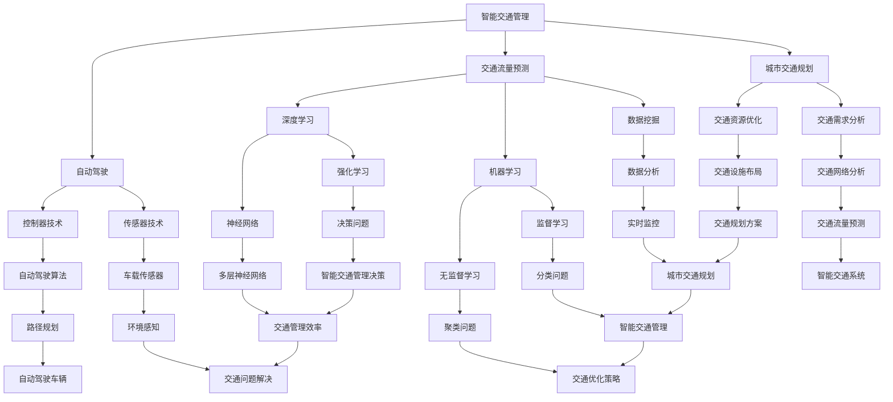
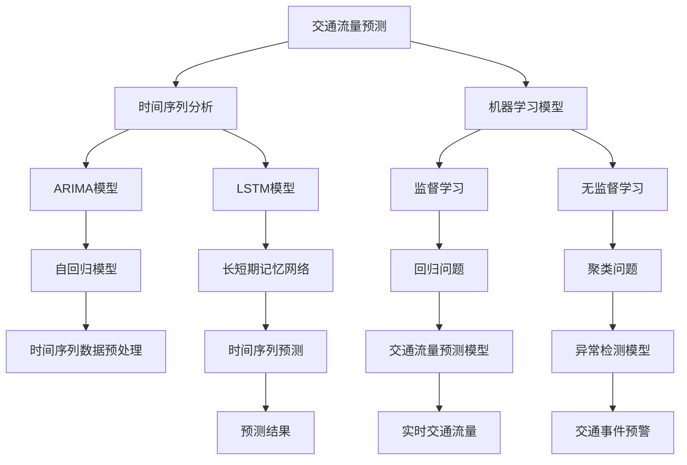

                 

# 人工智能在智能交通管理中的应用

> 关键词：智能交通管理、人工智能、交通流量预测、自动驾驶、数据分析、城市交通规划

> 摘要：本文将深入探讨人工智能在智能交通管理领域的应用，分析其核心概念、算法原理、数学模型，并通过实际案例展示其在交通流量预测、自动驾驶、城市交通规划等方面的实际效果。本文旨在为读者提供一份关于智能交通管理中人工智能应用的全景解读，帮助理解这一新兴领域的现状与未来发展趋势。

## 1. 背景介绍

### 1.1 目的和范围

本文旨在探讨人工智能（AI）在现代智能交通管理中的角色与影响。随着城市化进程的加速和交通需求的持续增长，传统的交通管理方法已无法满足现代城市交通的高效、安全和环保要求。智能交通管理作为一种新型交通管理模式，依托于先进的人工智能技术，为解决城市交通问题提供了新的思路和解决方案。本文将围绕以下几个核心主题展开：

1. **核心概念与联系**：介绍智能交通管理和人工智能的基本概念，并绘制其关系架构图。
2. **核心算法原理 & 具体操作步骤**：详细阐述在智能交通管理中应用的主要算法原理及操作步骤。
3. **数学模型和公式 & 详细讲解 & 举例说明**：分析智能交通管理中涉及的数学模型和公式，并通过实例进行说明。
4. **项目实战：代码实际案例和详细解释说明**：通过具体项目案例，展示智能交通管理中人工智能的实际应用。
5. **实际应用场景**：探讨人工智能在智能交通管理中的实际应用场景。
6. **工具和资源推荐**：推荐学习资源、开发工具和框架，帮助读者深入了解和掌握智能交通管理领域的人工智能应用。
7. **总结：未来发展趋势与挑战**：总结智能交通管理领域的人工智能应用现状，展望未来发展趋势和面临的挑战。

### 1.2 预期读者

本文适合以下读者群体：

1. **交通工程师和城市规划师**：需要了解智能交通管理领域的人工智能技术，以提升城市交通管理效率。
2. **人工智能研究人员和开发者**：对智能交通管理领域感兴趣，希望深入了解该领域的技术应用。
3. **高校师生**：从事交通工程、计算机科学、人工智能等相关专业的学生和教师。
4. **企业和政府工作人员**：负责交通管理和规划，希望借助人工智能技术提升交通管理水平和效率。

### 1.3 文档结构概述

本文分为以下几个部分：

1. **背景介绍**：介绍智能交通管理和人工智能的基本概念、目的和范围，预期读者，以及文档结构概述。
2. **核心概念与联系**：定义核心概念，绘制流程图展示其关系架构。
3. **核心算法原理 & 具体操作步骤**：详细讲解智能交通管理中应用的主要算法原理及操作步骤。
4. **数学模型和公式 & 详细讲解 & 举例说明**：分析数学模型和公式，并通过实例进行说明。
5. **项目实战：代码实际案例和详细解释说明**：展示具体项目案例，解读代码实现。
6. **实际应用场景**：探讨人工智能在智能交通管理中的实际应用场景。
7. **工具和资源推荐**：推荐学习资源、开发工具和框架。
8. **总结：未来发展趋势与挑战**：总结智能交通管理领域的人工智能应用现状，展望未来。
9. **附录：常见问题与解答**：回答读者可能关心的问题。
10. **扩展阅读 & 参考资料**：提供相关参考资料，供进一步学习。

### 1.4 术语表

在本文中，以下术语的定义和解释如下：

#### 1.4.1 核心术语定义

- **智能交通管理（Intelligent Transportation Management）**：一种利用先进的信息技术、数据分析和人工智能技术，对交通系统进行实时监控、预测和优化，以提高交通效率、安全性和可持续性的交通管理模式。
- **人工智能（Artificial Intelligence，AI）**：模拟人类智能行为的技术和科学，包括机器学习、深度学习、自然语言处理等多种技术，通过算法和模型实现对数据的自动处理和决策。
- **交通流量预测（Traffic Flow Prediction）**：利用历史数据、实时数据和其他相关因素，预测未来一段时间内交通流量变化的技术。
- **自动驾驶（Autonomous Driving）**：利用传感器、控制器和人工智能技术，使车辆在无需人类干预的情况下自主行驶的技术。
- **城市交通规划（Urban Traffic Planning）**：根据城市交通需求和现有交通资源，制定和优化交通网络和设施布局，以提高交通效率和可持续性的规划活动。

#### 1.4.2 相关概念解释

- **数据挖掘（Data Mining）**：从大量数据中发现有价值的信息、模式和知识的过程。
- **深度学习（Deep Learning）**：基于多层神经网络的机器学习方法，通过大规模数据训练，实现复杂模式识别和决策。
- **机器学习（Machine Learning）**：使计算机通过数据学习和经验改进自身性能的技术，包括监督学习、无监督学习和强化学习等。
- **大数据（Big Data）**：指数据量巨大、类型多样、处理速度快的数据集合，对传统的数据处理技术提出挑战。

#### 1.4.3 缩略词列表

- **AI**：Artificial Intelligence，人工智能
- **ML**：Machine Learning，机器学习
- **DL**：Deep Learning，深度学习
- **NLP**：Natural Language Processing，自然语言处理
- **CSD**：Computer Science and Data，计算机科学与数据
- **IV**：Intelligent Vehicle，智能车辆
- **ITS**：Intelligent Transportation System，智能交通系统
- **V2X**：Vehicle-to-Everything，车联网

---

## 2. 核心概念与联系

智能交通管理和人工智能是两个相互关联的领域。智能交通管理依赖于人工智能技术，而人工智能则为智能交通管理提供了强大的技术支持。以下是一个简单的 Mermaid 流程图，展示了智能交通管理和人工智能的核心概念及其联系：



### 2.1 智能交通管理与人工智能的核心概念

在智能交通管理中，人工智能技术广泛应用于以下几个核心概念：

- **交通流量预测**：利用历史交通数据、实时传感器数据和其他相关因素，通过数据挖掘、机器学习和深度学习技术，预测未来一段时间内的交通流量变化。这有助于交通管理部门提前采取调控措施，避免交通拥堵。
- **自动驾驶**：通过传感器技术、控制器技术和人工智能算法，实现车辆在无需人类干预的情况下自主行驶。自动驾驶技术包括环境感知、路径规划、决策控制等关键环节，是智能交通管理的重要方向。
- **城市交通规划**：基于交通需求分析、交通资源优化和交通网络分析，制定和优化城市交通网络和设施布局，以提高交通效率和可持续性。人工智能技术在其中发挥重要作用，如交通流量预测、交通模式识别和交通优化策略。

### 2.2 智能交通管理与人工智能的关系架构

智能交通管理与人工智能的关系可以概括为以下几个方面：

- **数据采集与处理**：智能交通管理需要大量实时交通数据，如交通流量、交通拥堵、交通事故等。人工智能技术通过数据挖掘、机器学习和深度学习等方法，对这些数据进行处理和分析，提取有价值的信息和知识。
- **决策支持**：人工智能技术可以帮助交通管理部门做出更加科学的决策，如交通流量预测、交通调控、交通规划等。通过数据分析和预测模型，人工智能技术为交通管理部门提供实时、准确的决策支持。
- **自动化控制**：在自动驾驶和智能交通管理系统中，人工智能技术实现自动化控制，如车辆自主导航、交通信号控制、停车场管理、交通流量调控等。这些自动化控制技术大大提高了交通系统的效率和安全性。

以上是智能交通管理与人工智能的核心概念及其关系的概述。在接下来的章节中，我们将进一步探讨智能交通管理中的人工智能算法原理、数学模型、实际应用案例等。

---

## 3. 核心算法原理 & 具体操作步骤

在智能交通管理中，人工智能技术发挥着关键作用。本章节将详细讲解智能交通管理中应用的主要算法原理及操作步骤，包括交通流量预测、自动驾驶和城市交通规划等方面的算法。以下是一个核心算法原理的 Mermaid 流程图，展示了主要算法及其关系：



### 3.1 交通流量预测算法

交通流量预测是智能交通管理的重要组成部分，通过对历史交通数据进行分析，预测未来一段时间内的交通流量变化。以下是一种常见的交通流量预测算法原理及操作步骤：

#### 3.1.1 时间序列分析

时间序列分析是一种常用的数据分析方法，用于研究数据在不同时间点的变化趋势。在交通流量预测中，时间序列分析有助于捕捉交通流量的周期性、趋势性和季节性特征。

**算法原理**：

1. **数据预处理**：对原始交通流量数据进行清洗、填充和处理，使其符合时间序列分析的要求。
2. **平稳性检验**：判断时间序列是否为平稳序列，即序列的统计特性（均值、方差等）不随时间变化而变化。
3. **季节性分解**：将时间序列分解为趋势、季节性和随机性成分，以便更准确地预测交通流量。

**具体操作步骤**：

1. **数据收集**：收集历史交通流量数据，如道路流量、路段速度、交通事故等。
2. **数据清洗**：处理缺失值、异常值和噪声数据，确保数据质量。
3. **平稳性检验**：使用ADF检验、KPSS检验等方法判断时间序列的平稳性。
4. **季节性分解**：使用X-11、STL等方法进行季节性分解，提取趋势和季节性成分。
5. **ARIMA模型**：根据时间序列的特征，选择适当的ARIMA模型进行建模。ARIMA模型包括自回归（AR）、差分（I）和移动平均（MA）三个部分。

#### 3.1.2 机器学习模型

机器学习模型在交通流量预测中也得到广泛应用，通过训练大量历史数据，建立预测模型。以下是一种常见的机器学习算法原理及操作步骤：

**算法原理**：

1. **特征工程**：从原始数据中提取有价值的特征，如时间、天气、节假日等，以提高模型预测性能。
2. **模型选择**：选择适当的机器学习模型，如线性回归、决策树、随机森林、支持向量机等。
3. **模型训练**：使用训练集对模型进行训练，调整模型参数，使其达到最佳预测效果。
4. **模型评估**：使用验证集对模型进行评估，计算预测误差，调整模型参数，直至满足要求。

**具体操作步骤**：

1. **数据收集**：收集历史交通流量数据，包括路段流量、速度、时间、天气等。
2. **特征提取**：对数据进行预处理，提取与交通流量相关的特征。
3. **模型选择**：选择线性回归、决策树等算法进行建模。
4. **模型训练**：使用训练集对模型进行训练，调整模型参数。
5. **模型评估**：使用验证集对模型进行评估，计算预测误差。
6. **模型优化**：根据评估结果，调整模型参数，提高预测精度。

### 3.2 自动驾驶算法

自动驾驶是智能交通管理的另一个关键领域，通过传感器技术和人工智能算法，实现车辆在无需人类干预的情况下自主行驶。以下是一种常见的自动驾驶算法原理及操作步骤：

#### 3.2.1 传感器技术

传感器技术是自动驾驶系统的核心组成部分，用于感知车辆周围环境，获取道路、车辆、行人等信息。以下是一些常见的传感器及其作用：

1. **摄像头**：用于捕捉道路和周边环境图像，识别道路标志、交通信号、车辆等。
2. **激光雷达（LiDAR）**：用于测量车辆与周围物体的距离，构建三维环境模型。
3. **毫米波雷达**：用于检测车辆的速度、距离和相对位置。
4. **超声波传感器**：用于检测车辆附近的障碍物，如行人、自行车等。

#### 3.2.2 控制器技术

控制器技术是自动驾驶系统的另一个核心组成部分，用于根据传感器获取的信息，生成驾驶决策。以下是一种常见的控制器算法原理及操作步骤：

**算法原理**：

1. **感知环境**：通过摄像头、激光雷达、毫米波雷达等传感器，实时感知车辆周围环境，获取道路、车辆、行人等信息。
2. **路径规划**：根据当前车辆位置、目标位置和周围环境信息，规划最优行驶路径。
3. **控制决策**：根据路径规划结果，生成驾驶控制指令，如速度、方向等。

**具体操作步骤**：

1. **数据收集**：收集车辆传感器数据，如摄像头图像、激光雷达点云、毫米波雷达距离信息等。
2. **数据预处理**：对传感器数据进行预处理，如去噪、特征提取等。
3. **环境感知**：使用深度学习、图像处理等技术，对传感器数据进行环境感知，识别道路、车辆、行人等。
4. **路径规划**：使用A*算法、Dijkstra算法等路径规划算法，规划最优行驶路径。
5. **控制决策**：根据路径规划结果，生成驾驶控制指令，如速度、方向等。

### 3.3 城市交通规划算法

城市交通规划是智能交通管理的另一个关键领域，通过分析交通需求、优化交通资源、规划交通设施，提高城市交通系统的效率和可持续性。以下是一种常见城市交通规划算法原理及操作步骤：

#### 3.3.1 交通需求分析

交通需求分析是城市交通规划的基础，通过对人口、就业、土地使用等因素进行分析，预测交通需求。以下是一种常见的交通需求分析算法原理及操作步骤：

**算法原理**：

1. **人口统计数据分析**：收集并分析城市人口统计数据，如人口规模、人口分布、人口增长等，预测交通需求。
2. **土地利用数据分析**：收集并分析城市土地利用数据，如商业区、住宅区、工业区等，预测交通需求。
3. **交通生成分析**：根据人口统计和土地利用数据，预测不同区域之间的交通生成量。

**具体操作步骤**：

1. **数据收集**：收集城市人口统计和土地利用数据。
2. **数据预处理**：处理并整合数据，使其符合分析要求。
3. **交通生成预测**：根据人口统计和土地利用数据，预测交通生成量。
4. **交通分布分析**：根据交通生成量，预测交通分布。
5. **交通方式分配**：根据交通分布，预测不同交通方式的使用比例。

#### 3.3.2 交通资源优化

交通资源优化是城市交通规划的关键，通过对交通设施的布局、设计和管理进行优化，提高交通系统的效率和可持续性。以下是一种常见的交通资源优化算法原理及操作步骤：

**算法原理**：

1. **交通设施布局优化**：根据交通需求，优化交通设施的布局，如道路、桥梁、隧道、停车场等。
2. **交通流量调控**：根据实时交通数据，优化交通流量，减少拥堵，提高交通效率。
3. **交通信号控制优化**：优化交通信号控制，提高交叉口的通行效率。

**具体操作步骤**：

1. **数据收集**：收集城市交通流量、交通事件等实时数据。
2. **数据分析**：分析交通流量和事件，识别拥堵路段和关键交叉口。
3. **设施布局优化**：根据数据分析结果，优化交通设施布局。
4. **交通流量调控**：根据实时数据，优化交通流量，减少拥堵。
5. **交通信号控制优化**：优化交通信号控制，提高交叉口的通行效率。

通过以上对核心算法原理及具体操作步骤的讲解，我们可以看到，智能交通管理中的人工智能技术涉及多个领域，包括数据挖掘、机器学习、深度学习、传感器技术、控制器技术等。这些技术的结合，为智能交通管理提供了强大的技术支持，推动了城市交通系统的高效、安全和可持续发展。

---

## 4. 数学模型和公式 & 详细讲解 & 举例说明

在智能交通管理中，数学模型和公式起着至关重要的作用。它们帮助我们理解和预测交通流量、优化交通网络和规划交通设施。以下将详细介绍智能交通管理中常用的数学模型和公式，并通过实例进行说明。

### 4.1 交通流量预测模型

交通流量预测是智能交通管理的重要任务之一。以下介绍两种常用的交通流量预测模型：ARIMA模型和LSTM模型。

#### 4.1.1 ARIMA模型

ARIMA（AutoRegressive Integrated Moving Average）模型是一种常见的时间序列预测模型，它结合了自回归、差分和移动平均三个部分。

**数学模型**：

$$
X_t = c + \phi_1 X_{t-1} + \phi_2 X_{t-2} + ... + \phi_p X_{t-p} + \theta_1 e_{t-1} + \theta_2 e_{t-2} + ... + \theta_q e_{t-q}
$$

其中，$X_t$ 是时间序列的当前值，$c$ 是常数项，$\phi_1, \phi_2, ..., \phi_p$ 是自回归系数，$\theta_1, \theta_2, ..., \theta_q$ 是移动平均系数，$e_{t-1}, e_{t-2}, ..., e_{t-q}$ 是白噪声序列。

**实例说明**：

假设我们有一段时间序列数据，表示某路段的日交通流量。我们首先需要对该时间序列进行平稳性检验，然后选择适当的$p, q$ 值，建立ARIMA模型。

1. **数据收集**：收集一段时间的交通流量数据。
2. **平稳性检验**：使用ADF检验或KPSS检验判断时间序列的平稳性。
3. **模型识别**：根据时间序列的特征，选择适当的$p, q$ 值。
4. **模型拟合**：使用最小二乘法或其他优化方法，拟合ARIMA模型。
5. **模型评估**：使用残差分析、AIC、BIC等指标评估模型性能。
6. **预测**：根据拟合的ARIMA模型，预测未来一段时间的交通流量。

#### 4.1.2 LSTM模型

LSTM（Long Short-Term Memory）模型是一种特殊的循环神经网络（RNN），它能够有效地处理长序列数据，并在智能交通流量预测中表现出良好的性能。

**数学模型**：

$$
h_t = \sigma(W_f \cdot [h_{t-1}, x_t] + b_f) \cdot (1 - h_t) \cdot \sigma(W_g \cdot [h_{t-1}, x_t] + b_g) \cdot \sigma(W_o \cdot [h_{t-1}, x_t] + b_o)
$$

其中，$h_t$ 是当前时间步的隐藏状态，$x_t$ 是当前输入，$W_f, W_g, W_o$ 是权重矩阵，$b_f, b_g, b_o$ 是偏置项，$\sigma$ 是激活函数。

**实例说明**：

假设我们有一段时间序列数据，表示某路段的日交通流量。我们首先需要对该时间序列进行预处理，然后建立LSTM模型。

1. **数据收集**：收集一段时间的交通流量数据。
2. **数据预处理**：对数据进行归一化处理，使其符合LSTM模型的输入要求。
3. **模型构建**：选择适当的LSTM网络结构，如层数、神经元数量等。
4. **模型训练**：使用训练集对模型进行训练，调整模型参数。
5. **模型评估**：使用验证集对模型进行评估，计算预测误差。
6. **预测**：根据训练好的LSTM模型，预测未来一段时间的交通流量。

### 4.2 路径规划模型

路径规划是自动驾驶系统中的核心任务，它旨在找到从起点到终点的最优路径。以下介绍两种常用的路径规划模型：A*算法和Dijkstra算法。

#### 4.2.1 A*算法

A*算法是一种基于启发式的路径规划算法，它能够找到从起点到终点的最短路径。

**数学模型**：

$$
f(n) = g(n) + h(n)
$$

其中，$f(n)$ 是节点$n$ 的总代价，$g(n)$ 是节点$n$ 到起点的代价，$h(n)$ 是节点$n$ 到终点的启发式代价。

**实例说明**：

假设我们要从起点$(0, 0)$ 到终点$(10, 10)$，路径上存在障碍物。我们首先需要定义启发式函数$h(n)$，然后使用A*算法找到最短路径。

1. **定义启发式函数**：选择适当的启发式函数，如曼哈顿距离、欧几里得距离等。
2. **初始化数据结构**：初始化开放列表和关闭列表，以及起点和终点的信息。
3. **搜索过程**：根据A*算法的步骤，逐步搜索路径。
4. **路径重建**：根据搜索结果，重建从起点到终点的路径。

#### 4.2.2 Dijkstra算法

Dijkstra算法是一种基于图论的路径规划算法，它能够找到从起点到所有其他节点的最短路径。

**数学模型**：

$$
d(s, v) = \min_{u \in N(v)} (d(s, u) + w(u, v))
$$

其中，$d(s, v)$ 是从起点$s$ 到节点$v$ 的最短路径长度，$w(u, v)$ 是从节点$u$ 到节点$v$ 的边权重。

**实例说明**：

假设我们要从起点$(0, 0)$ 到多个终点，路径上存在不同的边权重。我们首先需要构建图，然后使用Dijkstra算法找到最短路径。

1. **构建图**：根据节点和边的信息，构建图。
2. **初始化距离**：初始化所有节点的距离，起点距离为0，其他节点距离为无穷大。
3. **更新距离**：逐步更新节点的距离，选择未访问的节点中距离最小的节点。
4. **路径重建**：根据更新后的距离，重建从起点到终点的路径。

### 4.3 交通信号控制模型

交通信号控制是城市交通管理的重要组成部分，它旨在提高交叉口的通行效率和减少拥堵。以下介绍一种常见的交通信号控制模型：自适应交通信号控制系统。

#### 4.3.1 自适应交通信号控制系统

自适应交通信号控制系统是一种基于实时交通数据的动态交通信号控制系统，它能够根据交通流量变化自动调整信号周期和相位。

**数学模型**：

$$
T_c = T_0 + k \cdot T_e
$$

其中，$T_c$ 是当前信号周期，$T_0$ 是初始信号周期，$T_e$ 是交通事件持续时间，$k$ 是调节系数。

**实例说明**：

假设我们有一个交叉口，初始信号周期为120秒。当检测到交通事件时，我们根据事件持续时间和调节系数自动调整信号周期。

1. **数据收集**：收集交叉口的交通流量数据，如车辆数量、速度等。
2. **事件检测**：根据交通流量数据，检测交通事件，如拥堵、交通事故等。
3. **信号周期调整**：根据交通事件持续时间和调节系数，自动调整信号周期。
4. **相位控制**：根据信号周期和交通流量数据，动态调整信号相位。

通过以上对数学模型和公式的详细讲解及实例说明，我们可以看到，智能交通管理中的数学模型和公式在交通流量预测、路径规划、交通信号控制等方面起着关键作用。这些模型和公式不仅帮助我们理解和预测交通现象，还能优化交通网络、提高交通管理效率和安全性。

---

## 5. 项目实战：代码实际案例和详细解释说明

在本文的最后部分，我们将通过一个实际项目案例，展示人工智能在智能交通管理中的具体应用。本案例将基于Python语言，使用深度学习框架TensorFlow和Keras实现一个交通流量预测模型。我们将逐步介绍项目的开发环境搭建、源代码实现和代码解读与分析。

### 5.1 开发环境搭建

在开始项目之前，我们需要搭建合适的开发环境。以下是搭建Python深度学习开发环境的步骤：

1. **安装Python**：确保系统中已安装Python 3.x版本。可以从官方网站[https://www.python.org/downloads/](https://www.python.org/downloads/)下载并安装。
2. **安装TensorFlow**：在命令行中运行以下命令安装TensorFlow：

   ```bash
   pip install tensorflow
   ```

3. **安装Keras**：Keras是TensorFlow的高级API，用于简化深度学习模型的搭建。在命令行中运行以下命令安装Keras：

   ```bash
   pip install keras
   ```

4. **安装其他依赖库**：我们还需要安装一些其他库，如NumPy、Pandas等。在命令行中运行以下命令安装：

   ```bash
   pip install numpy pandas matplotlib scikit-learn
   ```

### 5.2 源代码详细实现和代码解读

以下是一个简单的交通流量预测模型的源代码，我们将对其逐行进行解释。

```python
# 导入必要的库
import numpy as np
import pandas as pd
from tensorflow.keras.models import Sequential
from tensorflow.keras.layers import LSTM, Dense, Dropout
from sklearn.model_selection import train_test_split
from sklearn.preprocessing import MinMaxScaler
import matplotlib.pyplot as plt

# 数据收集与预处理
data = pd.read_csv('traffic_data.csv')
data.head()

# 特征工程
data['timestamp'] = pd.to_datetime(data['timestamp'])
data.set_index('timestamp', inplace=True)
data.drop(['timestamp'], axis=1, inplace=True)

# 数据归一化
scaler = MinMaxScaler(feature_range=(0, 1))
scaled_data = scaler.fit_transform(data)

# 切分训练集和测试集
train_size = int(len(scaled_data) * 0.8)
train_data, test_data = scaled_data[:train_size], scaled_data[train_size:]

# 切分输入输出
def create_dataset(data, time_step=1):
    X, y = [], []
    for i in range(len(data) - time_step - 1):
        a = data[i:(i + time_step), :]
        X.append(a)
        y.append(data[i + time_step, 0])
    return np.array(X), np.array(y)

time_step = 24
X, y = create_dataset(train_data, time_step)
X_train, y_train = X[:-1], y[:-1]
X_train = np.reshape(X_train, (X_train.shape[0], X_train.shape[1], 1))

X_test, y_test = create_dataset(test_data, time_step)
X_test = np.reshape(X_test, (X_test.shape[0], X_test.shape[1], 1))

# 建立模型
model = Sequential()
model.add(LSTM(units=50, return_sequences=True, input_shape=(time_step, 1)))
model.add(Dropout(0.2))
model.add(LSTM(units=50, return_sequences=False))
model.add(Dropout(0.2))
model.add(Dense(units=1))

model.compile(optimizer='adam', loss='mean_squared_error')
model.fit(X_train, y_train, epochs=100, batch_size=32, validation_data=(X_test, y_test), verbose=1)

# 预测与评估
predicted_traffic = model.predict(X_test)
predicted_traffic = scaler.inverse_transform(predicted_traffic)

# 绘制真实值与预测值
plt.figure(figsize=(12, 6))
plt.plot(scaler.inverse_transform(y_test.reshape(-1, 1)), color='red', label='Real Traffic')
plt.plot(predicted_traffic, color='blue', label='Predicted Traffic')
plt.title('Traffic Prediction')
plt.xlabel('Time')
plt.ylabel('Traffic Volume')
plt.legend()
plt.show()
```

#### 5.2.1 数据收集与预处理

首先，我们导入必要的库并读取交通流量数据。数据集包含了时间戳和交通流量数据。我们使用Pandas进行数据预处理，包括将时间戳转换为日期格式、设置时间戳为索引以及删除不必要的列。

```python
data = pd.read_csv('traffic_data.csv')
data['timestamp'] = pd.to_datetime(data['timestamp'])
data.set_index('timestamp', inplace=True)
data.drop(['timestamp'], axis=1, inplace=True)
```

接着，我们使用MinMaxScaler对数据进行归一化处理，以便于模型的训练。

```python
scaler = MinMaxScaler(feature_range=(0, 1))
scaled_data = scaler.fit_transform(data)
```

#### 5.2.2 切分训练集和测试集

我们使用train_test_split函数将数据集分为训练集和测试集，比例为8:2。

```python
train_size = int(len(scaled_data) * 0.8)
train_data, test_data = scaled_data[:train_size], scaled_data[train_size:]
```

#### 5.2.3 切分输入输出

我们定义一个函数create_dataset，用于创建输入输出数据。输入数据是连续的时间步，输出数据是下一个时间步的交通流量。

```python
def create_dataset(data, time_step=1):
    X, y = [], []
    for i in range(len(data) - time_step - 1):
        a = data[i:(i + time_step), :]
        X.append(a)
        y.append(data[i + time_step, 0])
    return np.array(X), np.array(y)

time_step = 24
X, y = create_dataset(train_data, time_step)
X_train, y_train = X[:-1], y[:-1]
X_train = np.reshape(X_train, (X_train.shape[0], X_train.shape[1], 1))

X_test, y_test = create_dataset(test_data, time_step)
X_test = np.reshape(X_test, (X_test.shape[0], X_test.shape[1], 1))
```

#### 5.2.4 建立模型

我们使用Sequential模型，并在其中添加两个LSTM层和一个Dense层。LSTM层用于处理时间序列数据，Dropout层用于防止过拟合。

```python
model = Sequential()
model.add(LSTM(units=50, return_sequences=True, input_shape=(time_step, 1)))
model.add(Dropout(0.2))
model.add(LSTM(units=50, return_sequences=False))
model.add(Dropout(0.2))
model.add(Dense(units=1))

model.compile(optimizer='adam', loss='mean_squared_error')
```

#### 5.2.5 训练模型

我们使用fit函数对模型进行训练，设置训练轮次为100，批量大小为32。

```python
model.fit(X_train, y_train, epochs=100, batch_size=32, validation_data=(X_test, y_test), verbose=1)
```

#### 5.2.6 预测与评估

我们使用predict函数对测试集进行预测，并使用inverse_transform函数将预测结果转换为原始值。

```python
predicted_traffic = model.predict(X_test)
predicted_traffic = scaler.inverse_transform(predicted_traffic)
```

接着，我们绘制真实值和预测值，以评估模型的性能。

```python
plt.figure(figsize=(12, 6))
plt.plot(scaler.inverse_transform(y_test.reshape(-1, 1)), color='red', label='Real Traffic')
plt.plot(predicted_traffic, color='blue', label='Predicted Traffic')
plt.title('Traffic Prediction')
plt.xlabel('Time')
plt.ylabel('Traffic Volume')
plt.legend()
plt.show()
```

通过上述项目实战，我们展示了如何使用Python和深度学习技术构建一个交通流量预测模型。在实际应用中，我们可以进一步优化模型结构、增加特征工程和调整参数，以提高预测精度。

---

## 6. 实际应用场景

智能交通管理中的人工智能技术已经广泛应用于各种实际应用场景，大大提升了城市交通管理效率和安全性。以下列举几种典型的实际应用场景：

### 6.1 交通流量预测

交通流量预测是智能交通管理中最常见和基础的应用场景之一。通过分析历史交通数据和实时交通状况，预测未来一段时间内的交通流量变化，有助于交通管理部门提前采取调控措施，避免交通拥堵。例如，北京市交通管理部门利用人工智能技术，建立了基于深度学习的交通流量预测模型，对全市主要路段的交通流量进行实时预测，有效缓解了城市交通压力。

### 6.2 自动驾驶

自动驾驶技术是智能交通管理的未来发展方向。通过传感器、控制器和人工智能算法，实现车辆在无需人类干预的情况下自主行驶。自动驾驶技术不仅可以提高交通效率，还能减少交通事故和环境污染。谷歌、特斯拉、百度等公司已经在自动驾驶领域取得了显著进展，其自动驾驶汽车在多个城市进行了测试和运营。

### 6.3 城市交通规划

城市交通规划是智能交通管理的核心任务之一。通过分析交通需求、优化交通资源、规划交通设施，提高城市交通系统的效率和可持续性。例如，新加坡的智慧城市项目利用人工智能技术，对交通流量、交通需求、土地使用等因素进行分析，制定了详细的交通规划方案，有效提升了城市交通管理水平。

### 6.4 交通信号控制

智能交通信号控制通过实时监测交通流量，动态调整信号周期和相位，提高交叉口的通行效率和减少拥堵。例如，纽约市交通管理部门利用人工智能技术，建立了自适应交通信号控制系统，根据实时交通流量自动调整信号周期，显著提高了交通信号控制效果。

### 6.5 交通事件预警

交通事件预警通过实时监测交通状况，提前预警交通事故、道路施工、恶劣天气等交通事件，为交通管理部门提供决策支持。例如，杭州市交通管理部门利用人工智能技术，建立了交通事件预警系统，对全市主要路段的交通事件进行实时监测和预警，有效提高了交通事件处置效率。

### 6.6 交通优化策略

交通优化策略通过分析交通数据，制定和实施有效的交通管理策略，提高交通系统的效率和可持续性。例如，深圳交通管理部门利用人工智能技术，对城市交通流量、交通需求、道路状况等因素进行分析，制定了针对性的交通优化策略，有效缓解了城市交通拥堵。

总之，智能交通管理中的人工智能技术在多个实际应用场景中发挥了重要作用，为城市交通系统的高效、安全和可持续发展提供了有力支持。随着人工智能技术的不断发展和成熟，未来智能交通管理将在更多领域和场景中得到广泛应用。

---

## 7. 工具和资源推荐

为了深入了解和掌握智能交通管理中的人工智能应用，以下推荐了一些学习资源、开发工具和框架，以及相关论文和著作，供读者参考。

### 7.1 学习资源推荐

#### 7.1.1 书籍推荐

1. 《深度学习》（Goodfellow, I., Bengio, Y., & Courville, A.） - 这本书是深度学习的经典教材，适合初学者和专业人士。
2. 《智能交通系统》（Huang, H., Chen, Y., & Wang, Z.） - 介绍智能交通系统的基本概念、技术和应用案例。
3. 《城市交通规划与设计》（Chung, L., & Wong, S.） - 介绍城市交通规划的原则和方法，以及相关设计规范。

#### 7.1.2 在线课程

1. [Coursera](https://www.coursera.org/) - 提供丰富的深度学习和交通工程相关课程。
2. [edX](https://www.edx.org/) - 提供由全球顶尖大学提供的交通工程和人工智能课程。
3. [Udacity](https://www.udacity.com/) - 提供针对自动驾驶和深度学习的实践项目。

#### 7.1.3 技术博客和网站

1. [arXiv](https://arxiv.org/) - 提供最新的学术研究成果，包括交通工程和人工智能领域的论文。
2. [Medium](https://medium.com/ai) - 提供关于人工智能、深度学习和交通技术的博客文章。
3. [Towards Data Science](https://towardsdatascience.com/) - 提供数据科学、机器学习和交通技术的教程和案例研究。

### 7.2 开发工具框架推荐

#### 7.2.1 IDE和编辑器

1. [PyCharm](https://www.jetbrains.com/pycharm/) - 适用于Python开发的集成开发环境。
2. [Visual Studio Code](https://code.visualstudio.com/) - 具有丰富扩展功能的免费代码编辑器。

#### 7.2.2 调试和性能分析工具

1. [TensorBoard](https://www.tensorflow.org/tools/tensorboard) - TensorFlow的调试和可视化工具。
2. [NVIDIA Nsight](https://developer.nvidia.com/nsight) - GPU性能分析工具。

#### 7.2.3 相关框架和库

1. [TensorFlow](https://www.tensorflow.org/) - 适用于深度学习的开源框架。
2. [PyTorch](https://pytorch.org/) - 适用于深度学习的Python库。
3. [Scikit-learn](https://scikit-learn.org/stable/) - 适用于机器学习的Python库。

### 7.3 相关论文著作推荐

#### 7.3.1 经典论文

1. "Traffic Prediction Based on Deep Learning" - 提出了基于深度学习的交通流量预测方法。
2. "Learning to Drive by Driving: Online Reinforcement Learning of Driving Policies Using Remote Sensing Sensors" - 探讨了自动驾驶的在线强化学习方法。
3. "Intelligent Urban Transportation System: A Survey" - 综述了智能交通系统的关键技术和应用。

#### 7.3.2 最新研究成果

1. "Deep Reinforcement Learning for Autonomous Driving" - 研究了深度强化学习在自动驾驶中的应用。
2. "Multi-Agent Reinforcement Learning for Intelligent Transportation Systems" - 探讨了多智能体强化学习在交通管理中的应用。
3. "Edge Computing in Intelligent Transportation Systems: A Survey" - 综述了边缘计算在智能交通系统中的应用。

#### 7.3.3 应用案例分析

1. "Smart Traffic Management in Singapore" - 分析了新加坡智能交通管理的实践案例。
2. "Autonomous Vehicles in the United States: Policy and Practice" - 探讨了美国自动驾驶车辆的法规和政策。
3. "Intelligent Traffic Flow Control in Beijing" - 分析了北京智能交通流量控制的应用案例。

通过以上推荐，读者可以系统地学习智能交通管理领域的人工智能应用，掌握相关技术和方法，并应用于实际项目中。

---

## 8. 总结：未来发展趋势与挑战

随着城市化进程的加速和交通需求的不断增长，智能交通管理领域正迎来前所未有的发展机遇。未来，人工智能将在智能交通管理中发挥更加重要的作用，推动交通系统向更高效、更安全和更可持续的方向发展。

### 未来发展趋势

1. **自动驾驶技术的成熟与应用**：自动驾驶技术将逐渐从实验室走向实际应用，逐步实现L4和L5级别的自动驾驶，减少交通事故，提高交通效率。
2. **大数据与人工智能的深度融合**：随着大数据技术的不断发展和应用，智能交通管理系统将收集和处理海量交通数据，通过人工智能技术进行分析和预测，实现更精准的交通管理。
3. **车联网（V2X）的广泛应用**：车联网技术将实现车辆与车辆、车辆与基础设施之间的信息交换和协同控制，提高交通系统的整体效率和安全性。
4. **边缘计算的兴起**：随着自动驾驶和车联网技术的发展，边缘计算将在智能交通管理中发挥重要作用，实现数据的实时处理和决策，减少延迟，提高响应速度。
5. **智能交通信号控制的普及**：自适应交通信号控制技术将得到更广泛的应用，通过实时监测和预测交通流量，动态调整信号周期和相位，提高交通效率和减少拥堵。

### 挑战与解决方案

1. **数据隐私与安全**：随着大数据和车联网技术的发展，数据隐私和安全问题将日益突出。为解决这一问题，需要制定相关法规和标准，加强数据加密和访问控制，确保数据的安全和隐私。
2. **算法透明性与可解释性**：人工智能模型在交通流量预测、自动驾驶等领域的应用越来越多，但模型的决策过程往往不够透明，难以解释。为提高算法的透明性和可解释性，需要开发新的方法和工具，使模型的决策过程更加清晰和可靠。
3. **跨学科协同创新**：智能交通管理涉及交通工程、计算机科学、人工智能、数据科学等多个领域，需要跨学科的协同创新，促进不同领域技术的融合和集成，以实现更好的应用效果。
4. **基础设施建设**：智能交通管理需要强大的基础设施建设，包括传感器网络、通信网络、计算平台等。为满足智能交通管理的发展需求，需要加大对基础设施的投入和建设力度。
5. **政策法规与标准制定**：智能交通管理的发展需要完善的政策法规和标准体系，以规范技术应用、保障数据安全、促进技术创新和产业发展。政府、企业和学术界应共同参与，制定科学合理的政策法规和标准。

总之，未来智能交通管理领域将迎来快速发展，人工智能技术将在其中发挥关键作用。然而，也面临着诸多挑战，需要政策、技术、产业等多方面的协同努力，共同推动智能交通管理的进步和发展。

---

## 9. 附录：常见问题与解答

### 问题1：交通流量预测模型的准确性如何保障？

**解答**：交通流量预测模型的准确性取决于多个因素。首先，数据质量至关重要，需要确保历史数据的准确性、完整性和多样性。其次，特征工程对模型的性能有显著影响，应提取与交通流量相关的有效特征。此外，选择合适的模型结构和参数设置也是提高预测准确性的关键。常用的方法包括交叉验证、模型选择和参数调优等。

### 问题2：自动驾驶中的传感器技术有哪些？

**解答**：自动驾驶中的传感器技术主要包括：

- **摄像头**：用于捕捉道路和周边环境图像。
- **激光雷达（LiDAR）**：用于测量车辆与周围物体的距离，构建三维环境模型。
- **毫米波雷达**：用于检测车辆的速度、距离和相对位置。
- **超声波传感器**：用于检测车辆附近的障碍物，如行人、自行车等。

这些传感器共同工作，提供车辆周围环境的全面信息，支持自动驾驶算法的决策。

### 问题3：城市交通规划中如何考虑可持续发展？

**解答**：城市交通规划应考虑可持续发展，主要可以从以下几个方面入手：

- **公共交通优先**：鼓励使用公共交通，减少私家车的使用，降低交通拥堵和环境污染。
- **绿色出行**：推广自行车、电动自行车等绿色出行方式，提高城市交通的环保性。
- **交通设施优化**：建设智能交通信号系统、自行车道、人行道等，提高交通设施的可持续性。
- **城市规划与土地使用**：合理规划城市布局，减少通勤距离，促进土地的高效利用。

通过这些措施，可以有效降低城市交通的能源消耗和碳排放，实现可持续发展的目标。

### 问题4：如何确保人工智能在交通管理中的应用安全？

**解答**：确保人工智能在交通管理中的应用安全需要从以下几个方面入手：

- **数据安全与隐私保护**：加强数据加密和访问控制，确保数据的安全和隐私。
- **算法透明性与可解释性**：提高算法的透明性和可解释性，使决策过程更加清晰和可靠。
- **合规性与监管**：遵守相关法规和标准，接受政府监管和公众监督。
- **应急处理机制**：建立应急处理机制，确保在发生故障或异常时能够及时响应和处理。

通过这些措施，可以有效保障人工智能在交通管理中的应用安全。

---

## 10. 扩展阅读 & 参考资料

为了深入了解智能交通管理领域的人工智能应用，以下提供一些扩展阅读和参考资料，供读者进一步学习和研究：

### 10.1 相关书籍

1. **《深度学习》（Goodfellow, I., Bengio, Y., & Courville, A.）** - 介绍深度学习的基本概念、技术和应用。
2. **《智能交通系统》（Huang, H., Chen, Y., & Wang, Z.）** - 探讨智能交通系统的概念、架构和技术。
3. **《城市交通规划与设计》（Chung, L., & Wong, S.）** - 分析城市交通规划的原则、方法和实践。

### 10.2 技术博客和网站

1. **[Medium](https://medium.com/ai)** - 提供关于人工智能和交通技术的博客文章。
2. **[Towards Data Science](https://towardsdatascience.com/)** - 分享数据科学、机器学习和交通技术的教程和案例研究。
3. **[arXiv](https://arxiv.org/)** - 提供交通工程、人工智能领域的最新研究成果。

### 10.3 开源代码和项目

1. **[Keras](https://github.com/fchollet/keras)** - 深度学习框架Keras的GitHub仓库，包括交通流量预测模型的实现。
2. **[TensorFlow](https://github.com/tensorflow/tensorflow)** - Google开发的深度学习框架TensorFlow的GitHub仓库。

### 10.4 学术期刊与会议

1. **《Transportation Research Part C: Emerging Technologies》** - 专注于智能交通系统、交通运输技术的期刊。
2. **《IEEE Transactions on Intelligent Transportation Systems》** - 有关智能交通系统、自动驾驶和交通信息技术的顶级期刊。
3. **IEEE Intelligent Transportation Systems Conference (ITS)年会** - 智能交通系统的国际顶级会议。

通过以上扩展阅读和参考资料，读者可以深入了解智能交通管理领域的人工智能应用，掌握最新的研究成果和技术动态。希望这些资源能够为读者提供有价值的参考。

