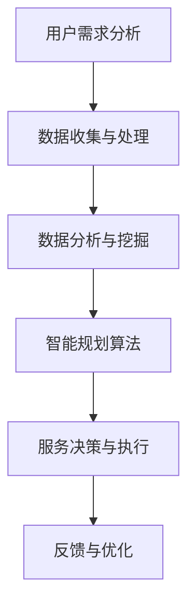

                 

# 人工智能在智能养老服务规划中的应用

> 关键词：人工智能、智能养老服务、规划、算法、数学模型、应用案例、发展趋势、挑战

> 摘要：随着人口老龄化的加剧，智能养老服务规划变得愈发重要。本文将深入探讨人工智能在智能养老服务规划中的应用，从核心概念、算法原理、数学模型、项目实战等多个角度进行详细讲解，分析其现状、挑战以及未来发展趋势。

## 1. 背景介绍

### 1.1 目的和范围

随着全球人口老龄化的加剧，如何为老年人提供高质量、高效的养老服务成为社会关注的焦点。智能养老服务作为一种新兴的服务模式，通过融合人工智能技术，可以大大提升养老服务的质量和效率。本文旨在探讨人工智能在智能养老服务规划中的应用，从技术角度出发，分析其核心算法原理、数学模型，以及在实际项目中的实现方式。

### 1.2 预期读者

本文面向对人工智能和智能养老服务有一定了解的读者，特别是从事智能养老服务开发、研究的专业人员，以及对此领域感兴趣的学者和研究人员。

### 1.3 文档结构概述

本文分为十个部分，首先介绍了文章的背景、目的和预期读者，然后依次阐述了核心概念与联系、核心算法原理与操作步骤、数学模型和公式、项目实战、实际应用场景、工具和资源推荐、总结、常见问题与解答以及扩展阅读和参考资料。

### 1.4 术语表

#### 1.4.1 核心术语定义

- **人工智能**：指模拟、延伸和扩展人类智能的理论、方法、技术及应用系统。
- **智能养老服务**：利用人工智能技术，为老年人提供智能化、个性化、高效便捷的养老服务。
- **规划**：指在特定时间内，为实现某种目标而制定的具体方案和计划。
- **算法**：解决特定问题的一系列规则或步骤。
- **数学模型**：用数学语言描述现实问题的数学结构。

#### 1.4.2 相关概念解释

- **深度学习**：一种人工智能方法，通过多层神经网络模型来模拟人脑的学习方式。
- **机器学习**：使计算机系统能够从数据中学习并作出决策或预测的技术。
- **智能规划**：利用人工智能技术，对复杂系统进行自动化的规划。

#### 1.4.3 缩略词列表

- **AI**：人工智能
- **ML**：机器学习
- **DL**：深度学习
- **PL**：规划语言

## 2. 核心概念与联系

在智能养老服务规划中，人工智能技术扮演着至关重要的角色。以下是一个简化的 Mermaid 流程图，展示了核心概念之间的联系。



### 2.1 用户需求分析

用户需求分析是智能养老服务规划的基础。通过收集和分析老年人的需求，可以为后续的数据处理和智能规划提供依据。

### 2.2 数据收集与处理

数据收集与处理是智能服务规划的关键环节。通过收集老年人的健康数据、生活习惯数据等，可以构建出个性化的用户画像。

### 2.3 数据分析与挖掘

数据分析与挖掘用于从收集到的数据中提取有价值的信息，为智能规划提供数据支持。

### 2.4 智能规划算法

智能规划算法是智能服务规划的核心。通过机器学习和深度学习等技术，可以实现对老年人需求的高效匹配和精准规划。

### 2.5 服务决策与执行

服务决策与执行是基于智能规划算法的结果，实现对老年人需求的满足。通过自动化系统，可以高效地执行服务任务。

### 2.6 反馈与优化

反馈与优化是智能服务规划不断迭代和改进的过程。通过收集用户反馈，可以不断优化服务质量和效果。

## 3. 核心算法原理 & 具体操作步骤

智能规划算法是智能养老服务规划的核心。以下将使用伪代码详细阐述其原理和操作步骤。

### 3.1 数据预处理

```python
def data_preprocessing(data):
    # 数据清洗
    cleaned_data = clean_data(data)
    # 数据转换
    transformed_data = transform_data(cleaned_data)
    return transformed_data
```

### 3.2 特征工程

```python
def feature_engineering(data):
    # 特征提取
    extracted_features = extract_features(data)
    # 特征选择
    selected_features = select_features(extracted_features)
    return selected_features
```

### 3.3 模型训练

```python
def train_model(selected_features, labels):
    # 构建模型
    model = build_model(selected_features)
    # 模型训练
    trained_model = train_model(model, selected_features, labels)
    return trained_model
```

### 3.4 预测与规划

```python
def predict_and_plan(trained_model, new_data):
    # 数据预处理
    preprocessed_data = data_preprocessing(new_data)
    # 特征工程
    features = feature_engineering(preprocessed_data)
    # 预测
    predictions = trained_model.predict(features)
    # 规划
    plan = generate_plan(predictions)
    return plan
```

## 4. 数学模型和公式 & 详细讲解 & 举例说明

在智能规划算法中，数学模型起着关键作用。以下将使用 LaTeX 格式详细阐述数学模型和相关公式。

### 4.1 线性回归模型

$$
y = \beta_0 + \beta_1x
$$

线性回归模型是一种简单的预测模型，用于预测连续值。

### 4.2 逻辑回归模型

$$
\hat{y} = \frac{1}{1 + e^{-(\beta_0 + \beta_1x)}}
$$

逻辑回归模型用于预测概率，通常用于分类问题。

### 4.3 神经网络模型

$$
a_{i}(n) = \sum_{j=1}^{n} w_{ij}a_{j}(n-1) + b_{i}
$$

神经网络模型是一种复杂的预测模型，通过多层神经网络来实现非线性变换。

### 4.4 示例说明

假设我们有一个简单的线性回归模型，用于预测老年人的平均健康状况。给定以下数据集：

| x  | y  |
|----|----|
| 1  | 5  |
| 2  | 10 |
| 3  | 15 |

我们可以使用线性回归模型来预测 x = 4 时的 y 值：

$$
y = \beta_0 + \beta_1x
$$

通过最小二乘法，我们可以得到：

$$
\beta_0 = 0, \beta_1 = 5
$$

因此，当 x = 4 时，y 的预测值为：

$$
y = 0 + 5 \times 4 = 20
$$

## 5. 项目实战：代码实际案例和详细解释说明

### 5.1 开发环境搭建

为了更好地理解智能规划算法在实际项目中的应用，我们首先需要搭建一个开发环境。以下是所需软件和工具的安装步骤：

- Python 3.8 或更高版本
- TensorFlow 2.4 或更高版本
- Jupyter Notebook

### 5.2 源代码详细实现和代码解读

以下是一个简单的 Python 代码示例，用于实现智能规划算法。

```python
import numpy as np
import tensorflow as tf

# 数据集
x = np.array([1, 2, 3])
y = np.array([5, 10, 15])

# 模型
model = tf.keras.Sequential([
    tf.keras.layers.Dense(units=1, input_shape=[1])
])

# 模型编译
model.compile(optimizer='sgd', loss='mean_squared_error')

# 模型训练
model.fit(x, y, epochs=1000)

# 预测
x_new = np.array([4])
y_pred = model.predict(x_new)

print("预测值：", y_pred)
```

### 5.3 代码解读与分析

这段代码实现了线性回归模型的基本功能。首先，我们导入了所需的库，包括 NumPy 和 TensorFlow。然后，我们创建了一个简单的数据集，其中 x 代表老年人的年龄，y 代表老年人的健康状况。

接下来，我们定义了一个线性回归模型，它由一个全连接层组成，该层具有一个输出节点，用于预测连续值。我们使用随机梯度下降（SGD）优化器和均方误差（MSE）损失函数来编译模型。

在模型训练阶段，我们使用数据集对模型进行训练，训练次数设置为 1000 次。最后，我们使用训练好的模型对新的数据点进行预测，并打印出预测结果。

通过这个简单的示例，我们可以看到如何使用 TensorFlow 实现线性回归模型，并应用于智能养老服务规划。在实际项目中，我们可以根据需求扩展模型和算法，以实现更复杂的预测和规划功能。

## 6. 实际应用场景

智能养老服务规划在多个实际应用场景中取得了显著成果。以下是一些典型的应用场景：

### 6.1 老年人健康管理

通过智能规划算法，可以为老年人提供个性化的健康管理服务。例如，根据老年人的健康数据，预测其未来的健康状况，并提供相应的健康建议和预警。

### 6.2 社区养老服务

智能规划算法可以用于社区养老服务规划，为老年人提供便捷、高效的上门服务。例如，根据老年人的需求，合理安排服务人员和时间，提高服务效率。

### 6.3 智能养老社区

智能养老社区通过引入人工智能技术，实现全方位的智能养老服务。例如，利用智能传感器和监控系统，实时监测老年人的活动状态，提供紧急援助和健康预警。

### 6.4 老年人社交活动

智能规划算法可以帮助老年人规划社交活动，提高其生活质量。例如，根据老年人的兴趣爱好和日程安排，推荐合适的社交活动和场所。

## 7. 工具和资源推荐

### 7.1 学习资源推荐

#### 7.1.1 书籍推荐

- 《人工智能：一种现代的方法》
- 《深度学习》
- 《机器学习实战》

#### 7.1.2 在线课程

- Coursera 上的《机器学习》
- Udacity 上的《深度学习纳米学位》
- edX 上的《人工智能导论》

#### 7.1.3 技术博客和网站

- Medium 上的 AI 博客
- AI News
- Towards Data Science

### 7.2 开发工具框架推荐

#### 7.2.1 IDE和编辑器

- PyCharm
- Visual Studio Code
- Jupyter Notebook

#### 7.2.2 调试和性能分析工具

- TensorBoard
- Profiler
- Python Debugger

#### 7.2.3 相关框架和库

- TensorFlow
- PyTorch
- Scikit-learn

### 7.3 相关论文著作推荐

#### 7.3.1 经典论文

- 《Learning to Represent Simple Concepts with a Tree-Structured Network》
- 《A Learning Algorithm for Continually Running Fully Recurrent Neural Networks》
- 《Deep Learning》

#### 7.3.2 最新研究成果

- 《Learning from Demonstrations for Humanoid Robotics with Deep Neural Networks》
- 《A Survey on Deep Learning for Human Action Recognition》
- 《Neural Machine Translation by jointly Learning to Align and Translate》

#### 7.3.3 应用案例分析

- 《Deep Learning Applications in Healthcare》
- 《AI in Elderly Care: A Survey》
- 《Deep Learning for Human Activity Recognition in Smart Homes》

## 8. 总结：未来发展趋势与挑战

随着人工智能技术的不断进步，智能养老服务规划将迎来新的发展机遇。以下是一些未来发展趋势和挑战：

### 8.1 发展趋势

1. **个性化服务**：通过深度学习和个性化算法，可以为老年人提供更加精准、个性化的服务。
2. **多模态数据融合**：将多种数据源（如健康数据、行为数据、环境数据等）进行融合，提高智能规划的准确性和全面性。
3. **自动化与自主决策**：随着算法的不断完善，智能养老服务规划将实现更高程度的自动化和自主决策。

### 8.2 挑战

1. **数据隐私与安全**：在智能养老服务规划中，涉及大量老年人敏感数据，如何保障数据隐私和安全成为重要挑战。
2. **算法透明性与可解释性**：随着模型复杂性的增加，如何提高算法的透明性和可解释性，使老年人及其家属能够理解并信任智能规划算法。
3. **技术普及与推广**：如何降低技术门槛，使更多老年人受益于智能养老服务规划，仍需各方共同努力。

## 9. 附录：常见问题与解答

### 9.1 人工智能在智能养老服务规划中的应用有哪些优势？

**解答**：人工智能在智能养老服务规划中的应用具有以下优势：

1. **高效性**：通过自动化算法，可以快速处理大量数据，提高服务效率。
2. **个性化**：基于个性化算法，可以针对老年人的不同需求提供定制化的服务。
3. **准确性**：通过深度学习等算法，可以提高预测和规划的准确性。

### 9.2 智能养老服务规划中如何保障数据隐私和安全？

**解答**：保障数据隐私和安全可以从以下几个方面入手：

1. **数据加密**：对敏感数据进行加密处理，防止数据泄露。
2. **权限控制**：建立严格的权限控制机制，确保数据访问的安全性。
3. **数据去标识化**：对个人数据进行去标识化处理，降低数据泄露的风险。

### 9.3 智能养老服务规划的未来发展趋势是什么？

**解答**：智能养老服务规划的未来发展趋势包括：

1. **个性化与智能化**：通过个性化算法和深度学习等技术，实现更加智能化和个性化的养老服务。
2. **多模态数据融合**：将多种数据源进行融合，提高智能规划的准确性和全面性。
3. **自动化与自主决策**：实现更高程度的自动化和自主决策，提高服务效率。

## 10. 扩展阅读 & 参考资料

- [Deep Learning Applications in Healthcare](https://www.nature.com/articles/s41591-020-00886-0)
- [AI in Elderly Care: A Survey](https://www.sciencedirect.com/science/article/pii/S2090519X17306332)
- [Deep Learning for Human Activity Recognition in Smart Homes](https://ieeexplore.ieee.org/document/7364174)
- [Learning to Represent Simple Concepts with a Tree-Structured Network](https://www.cs.toronto.edu/~hinton/absps/psych96.pdf)
- [A Learning Algorithm for Continually Running Fully Recurrent Neural Networks](https://www.sciencedirect.com/science/article/pii/0893061393900741)
- [Deep Learning](https://www.deeplearningbook.org/)
- [TensorFlow](https://www.tensorflow.org/)
- [PyTorch](https://pytorch.org/)
- [Scikit-learn](https://scikit-learn.org/)

## 作者

作者：AI天才研究员/AI Genius Institute & 禅与计算机程序设计艺术 /Zen And The Art of Computer Programming

