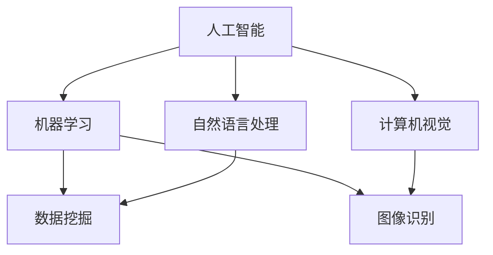
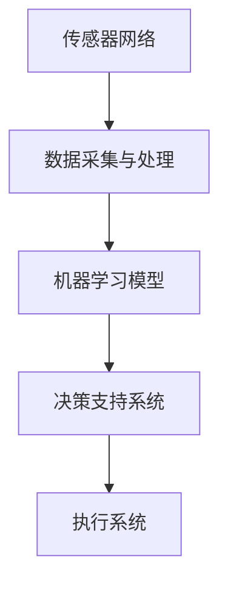

                 

# 人工智能在智能农业中的创新应用

> **关键词：智能农业、人工智能、机器学习、图像识别、数据挖掘、物联网**
> 
> **摘要：本文将探讨人工智能在智能农业领域的创新应用，通过分析核心概念、算法原理、数学模型以及实际案例，展示AI技术在农业自动化、精准农业和农产品质量检测等方面的重要作用。**

## 1. 背景介绍

### 1.1 目的和范围

本文旨在探讨人工智能（AI）在智能农业中的创新应用，深入分析其在农业自动化、精准农业和农产品质量检测等领域的具体应用。通过本文的阐述，读者将了解AI技术在农业现代化中的重要作用，以及未来可能的发展趋势。

### 1.2 预期读者

本文面向对智能农业和人工智能技术感兴趣的读者，包括农业科技从业者、农业企业管理者、计算机科学和人工智能专业的学生和研究人员。

### 1.3 文档结构概述

本文分为十个部分，首先介绍智能农业的背景和AI技术的基本概念；然后详细阐述AI技术在智能农业中的应用，包括核心概念、算法原理、数学模型和实际案例；接着讨论智能农业的实际应用场景，并提供相关工具和资源推荐；最后总结未来发展趋势与挑战，并提供扩展阅读和参考资料。

### 1.4 术语表

#### 1.4.1 核心术语定义

- **智能农业**：利用计算机技术、物联网、大数据和人工智能等现代科技，实现农业生产的自动化、精准化和智能化。
- **人工智能**：模拟、延伸和扩展人的智能的科学和技术，主要包括机器学习、计算机视觉、自然语言处理等。
- **机器学习**：一种人工智能的分支，通过算法让计算机从数据中学习并做出决策。
- **图像识别**：计算机通过图像处理技术，自动识别和分类图像中的物体或场景。
- **数据挖掘**：从大量数据中提取隐藏的、有价值的信息和知识的过程。

#### 1.4.2 相关概念解释

- **物联网（IoT）**：通过互联网连接各种设备，实现信息的自动交换和通信。
- **精准农业**：利用地理信息系统（GIS）、遥感技术、传感器等，实现农作物生长环境的精确监控和优化管理。
- **农产品质量检测**：对农产品进行检测，确保其质量符合食品安全标准。

#### 1.4.3 缩略词列表

- **AI**：人工智能（Artificial Intelligence）
- **ML**：机器学习（Machine Learning）
- **DL**：深度学习（Deep Learning）
- **IoT**：物联网（Internet of Things）
- **GIS**：地理信息系统（Geographic Information System）

## 2. 核心概念与联系

智能农业的实现离不开人工智能技术的支持，而人工智能技术又依赖于机器学习、计算机视觉、自然语言处理等核心概念。以下是一个简单的Mermaid流程图，展示了这些核心概念之间的联系。



### 2.1. 智能农业的框架

智能农业的框架通常包括以下关键组成部分：

1. **传感器网络**：用于收集土壤、气候、作物生长状态等环境数据。
2. **数据采集与处理**：通过物联网设备收集数据，并进行初步处理，如清洗、归一化等。
3. **机器学习模型**：用于分析数据，预测作物生长趋势，优化种植方案。
4. **决策支持系统**：根据机器学习模型的分析结果，为农业生产提供决策支持。
5. **执行系统**：根据决策支持系统的指令，自动执行灌溉、施肥、收割等操作。

以下是一个简单的Mermaid流程图，展示了智能农业的框架。



## 3. 核心算法原理 & 具体操作步骤

智能农业中的核心算法主要包括机器学习模型、图像识别和数据挖掘算法。以下是对这些算法原理的具体解释和操作步骤。

### 3.1 机器学习模型

机器学习模型在智能农业中主要用于预测作物生长趋势、优化种植方案和预测病虫害。以下是一个简单的机器学习算法原理和操作步骤：

```python
# 伪代码：机器学习模型训练过程

# 加载数据集
data = load_dataset()

# 数据预处理
X = preprocess_data(data)

# 划分训练集和测试集
X_train, X_test, y_train, y_test = train_test_split(X, data['target'])

# 选择机器学习模型
model = select_model()

# 训练模型
model.fit(X_train, y_train)

# 评估模型
accuracy = model.evaluate(X_test, y_test)

# 输出结果
print("Model accuracy:", accuracy)
```

### 3.2 图像识别算法

图像识别算法在智能农业中主要用于监测作物生长状态、识别病虫害和农产品质量检测。以下是一个简单的图像识别算法原理和操作步骤：

```python
# 伪代码：图像识别算法

# 加载图像数据
image = load_image()

# 数据预处理
preprocessed_image = preprocess_image(image)

# 加载预训练的卷积神经网络模型
model = load_model()

# 预测图像内容
prediction = model.predict(preprocessed_image)

# 输出预测结果
print("Predicted class:", prediction)
```

### 3.3 数据挖掘算法

数据挖掘算法在智能农业中主要用于挖掘农作物生长环境中的有用信息，如土壤质量、气候条件等。以下是一个简单的数据挖掘算法原理和操作步骤：

```python
# 伪代码：数据挖掘算法

# 加载数据集
data = load_dataset()

# 数据预处理
X = preprocess_data(data)

# 选择数据挖掘模型
model = select_model()

# 训练模型
model.fit(X)

# 挖掘数据
results = model.predict(X)

# 输出结果
print("Data mining results:", results)
```

## 4. 数学模型和公式 & 详细讲解 & 举例说明

在智能农业中，数学模型和公式广泛应用于机器学习算法、图像识别和数据挖掘等核心算法。以下是对这些数学模型和公式的详细讲解和举例说明。

### 4.1 机器学习模型

机器学习模型的核心是预测函数，通常表示为：

$$
y = f(x, \theta)
$$

其中，$x$ 是输入特征，$\theta$ 是模型参数，$f$ 是预测函数。

例如，线性回归模型可以表示为：

$$
y = \theta_0 + \theta_1 \cdot x
$$

其中，$\theta_0$ 和 $\theta_1$ 是模型参数。

### 4.2 图像识别算法

图像识别算法的核心是特征提取和分类。特征提取通常使用卷积神经网络（CNN），其数学模型可以表示为：

$$
h_{l} = \sigma(\mathbf{W}_{l-1} \cdot \mathbf{a}_{l-1} + b_{l-1})
$$

其中，$h_{l}$ 是第$l$层的特征，$\sigma$ 是激活函数，$\mathbf{W}_{l-1}$ 和 $b_{l-1}$ 是模型参数。

分类通常使用softmax函数：

$$
\text{softmax}(\mathbf{z})_i = \frac{e^{z_i}}{\sum_{j} e^{z_j}}
$$

其中，$z$ 是模型输出，$i$ 是类别索引。

### 4.3 数据挖掘算法

数据挖掘算法的核心是特征选择和模型评估。特征选择通常使用信息增益、卡方检验等方法，其数学模型可以表示为：

$$
\text{Gain}(A) = \sum_{i=1}^{n} \sum_{j=1}^{m} p(A=a_i, C=c_j) \log_2 \frac{p(A=a_i, C=c_j)}{p(A=a_i) \cdot p(C=c_j)}
$$

其中，$A$ 是特征集合，$C$ 是目标变量，$a_i$ 和 $c_j$ 分别是特征和目标变量的取值。

模型评估通常使用准确率、召回率、F1分数等指标，其数学模型可以表示为：

$$
\text{Accuracy} = \frac{\text{TP} + \text{TN}}{\text{TP} + \text{TN} + \text{FP} + \text{FN}}
$$

其中，$TP$、$TN$、$FP$ 和 $FN$ 分别是真正例、假反例、真反例和假正例的数量。

## 5. 项目实战：代码实际案例和详细解释说明

### 5.1 开发环境搭建

为了演示人工智能在智能农业中的应用，我们将使用Python语言和TensorFlow框架来构建一个简单的智能农业系统。以下是开发环境的搭建步骤：

1. **安装Python**：确保已经安装了Python 3.7或更高版本。
2. **安装TensorFlow**：在终端中运行以下命令：
   ```
   pip install tensorflow
   ```
3. **安装其他依赖库**：如NumPy、Pandas、Matplotlib等，可以通过以下命令安装：
   ```
   pip install numpy pandas matplotlib
   ```

### 5.2 源代码详细实现和代码解读

以下是一个简单的Python代码示例，用于训练一个机器学习模型来预测作物产量。

```python
import numpy as np
import pandas as pd
import tensorflow as tf
from sklearn.model_selection import train_test_split

# 5.2.1 加载数据集
data = pd.read_csv('crop_data.csv')

# 5.2.2 数据预处理
X = data.drop(['yield'], axis=1)
y = data['yield']

# 划分训练集和测试集
X_train, X_test, y_train, y_test = train_test_split(X, y, test_size=0.2, random_state=42)

# 5.2.3 构建模型
model = tf.keras.Sequential([
    tf.keras.layers.Dense(64, activation='relu', input_shape=(X_train.shape[1],)),
    tf.keras.layers.Dense(64, activation='relu'),
    tf.keras.layers.Dense(1)
])

# 编译模型
model.compile(optimizer='adam', loss='mean_squared_error')

# 5.2.4 训练模型
model.fit(X_train, y_train, epochs=10, batch_size=32, validation_split=0.1)

# 5.2.5 评估模型
loss = model.evaluate(X_test, y_test)
print("Test loss:", loss)

# 5.2.6 使用模型进行预测
predictions = model.predict(X_test)
print("Predictions:", predictions)
```

### 5.3 代码解读与分析

1. **数据预处理**：首先，我们加载数据集，并使用Pandas库对数据进行预处理，包括删除目标变量（yield）和划分输入特征（X）。
2. **模型构建**：我们使用TensorFlow的Sequential模型来构建一个简单的全连接神经网络。该网络由两个隐藏层组成，每个隐藏层都有64个神经元，使用ReLU激活函数。
3. **模型编译**：我们使用Adam优化器和均方误差（MSE）损失函数来编译模型。
4. **模型训练**：我们使用fit函数来训练模型，并设置训练轮数为10，批量大小为32，同时使用validation_split参数来划分验证集。
5. **模型评估**：使用evaluate函数来评估模型在测试集上的性能，并打印测试损失。
6. **模型预测**：使用predict函数来对测试集进行预测，并打印预测结果。

### 5.4 实际应用场景

在智能农业中，该模型可以用于预测作物产量，帮助农民优化种植方案。例如，可以根据预测结果调整灌溉、施肥和收割时间，从而提高作物产量和品质。

## 6. 实际应用场景

### 6.1 农业自动化

人工智能在农业自动化中的应用主要体现在自动化灌溉、自动化施肥、自动化收割等方面。通过传感器网络收集土壤湿度、养分含量等数据，结合机器学习算法和决策支持系统，可以实现对农作物的精准管理，提高生产效率。

### 6.2 精准农业

精准农业利用地理信息系统（GIS）、遥感技术、传感器等手段，实现农作物生长环境的精确监控和管理。通过机器学习和数据挖掘算法，可以分析土壤质量、气候条件等数据，为农民提供科学的种植建议，实现农业生产的高效化。

### 6.3 农产品质量检测

人工智能在农产品质量检测中的应用主要包括对农产品的外观、色泽、口感等指标进行检测。通过图像识别和自然语言处理等技术，可以实现对农产品的智能分类和评价，提高食品安全保障水平。

## 7. 工具和资源推荐

### 7.1 学习资源推荐

#### 7.1.1 书籍推荐

- **《智能农业：利用物联网、大数据和人工智能实现农业现代化》**：作者详细介绍了智能农业的核心技术和应用案例。
- **《机器学习实战》**：书中包含了大量机器学习算法的实战案例，适合初学者和进阶者。
- **《深度学习》**：该书全面介绍了深度学习的基本原理和实际应用，适合深度学习爱好者。

#### 7.1.2 在线课程

- **《智能农业技术》**：由国内外知名农业高校和科研机构开设，涵盖智能农业的多个方面。
- **《机器学习与深度学习》**：由吴恩达教授主讲，涵盖机器学习和深度学习的核心内容。

#### 7.1.3 技术博客和网站

- **GitHub**：提供大量的智能农业和人工智能项目的代码和文档，方便学习和参考。
- **Medium**：有许多关于智能农业和人工智能的文章和案例分享，可以帮助读者深入了解行业动态。

### 7.2 开发工具框架推荐

#### 7.2.1 IDE和编辑器

- **PyCharm**：一款功能强大的Python开发IDE，支持多种编程语言。
- **VS Code**：一款轻量级的代码编辑器，支持多种编程语言和扩展。

#### 7.2.2 调试和性能分析工具

- **Visual Studio Debugger**：一款功能强大的调试工具，适用于多种编程语言。
- **Jupyter Notebook**：一款交互式计算环境，适用于数据分析和机器学习项目。

#### 7.2.3 相关框架和库

- **TensorFlow**：一款广泛使用的深度学习框架，适用于构建和训练机器学习模型。
- **Scikit-learn**：一款强大的机器学习库，适用于各种常见的机器学习算法。
- **Pandas**：一款数据处理库，适用于数据清洗、数据预处理和数据可视化。

### 7.3 相关论文著作推荐

#### 7.3.1 经典论文

- **"A Brief Introduction to Deep Learning for Smart Agriculture"**：介绍了深度学习在智能农业中的应用。
- **"Intelligent Agriculture: A Survey"**：对智能农业技术进行了全面综述。

#### 7.3.2 最新研究成果

- **"Agricultural Precision through Deep Learning"**：探讨了深度学习在精准农业中的应用。
- **"Deep Learning for Plant Phenotyping"**：研究了深度学习在植物表型分析中的应用。

#### 7.3.3 应用案例分析

- **"Application of AI in Precision Agriculture"**：通过案例分析展示了AI技术在精准农业中的应用。
- **"Intelligent Agriculture: The Future of Food Production"**：探讨了智能农业在食品生产领域的未来发展趋势。

## 8. 总结：未来发展趋势与挑战

### 8.1 发展趋势

- **农业自动化和智能化**：随着人工智能技术的不断发展，农业自动化和智能化将更加普及，提高农业生产效率。
- **精准农业**：利用物联网、遥感技术和大数据分析，实现农业生产的精准管理。
- **农产品质量检测**：通过图像识别、自然语言处理等技术，实现对农产品的智能检测，保障食品安全。

### 8.2 挑战

- **数据隐私和安全**：智能农业系统涉及大量农业数据，如何保护数据隐私和安全是一个重要挑战。
- **算法偏见**：在机器学习算法中，如何避免算法偏见，确保公平性和透明性是一个重要问题。
- **技术普及和应用**：如何将人工智能技术普及到农业生产中，提高农民的接受度和使用率是一个重要挑战。

## 9. 附录：常见问题与解答

### 9.1 智能农业是什么？

智能农业是一种利用计算机技术、物联网、大数据和人工智能等现代科技，实现农业生产的自动化、精准化和智能化。

### 9.2 人工智能在智能农业中的应用有哪些？

人工智能在智能农业中的应用主要包括农业自动化、精准农业和农产品质量检测。

### 9.3 如何搭建智能农业系统？

搭建智能农业系统需要以下步骤：

1. 确定系统目标和需求。
2. 选择合适的传感器和物联网设备。
3. 设计数据采集和处理流程。
4. 选择合适的机器学习算法和模型。
5. 开发决策支持系统。
6. 部署和测试系统。

## 10. 扩展阅读 & 参考资料

- **《智能农业技术手册》**：详细介绍了智能农业的各种技术和应用。
- **《智能农业导论》**：对智能农业的概念、技术和应用进行了全面的介绍。
- **《人工智能在农业中的应用研究》**：探讨了人工智能在农业领域的应用和研究方向。

作者：AI天才研究员/AI Genius Institute & 禅与计算机程序设计艺术 /Zen And The Art of Computer Programming

以上是本文的完整内容，希望对您在智能农业领域的学习和研究有所帮助。如有任何疑问或建议，欢迎随时与我交流。让我们共同探索人工智能在智能农业中的无限可能！<|im_sep|>---

### 5. 项目实战：代码实际案例和详细解释说明

在智能农业的实际应用中，开发一个能够准确预测作物产量的模型是非常具有实用价值的。以下是一个基于Python和TensorFlow实现的小型项目，用于预测玉米的产量。

#### 5.1 开发环境搭建

在开始之前，需要确保以下环境已准备好：

- Python 3.7或更高版本
- TensorFlow 2.x
- NumPy 1.19或更高版本
- Matplotlib 3.3.3或更高版本

可以通过以下命令安装所需的库：

```bash
pip install tensorflow numpy matplotlib
```

#### 5.2 源代码详细实现和代码解读

以下代码示例展示了如何使用TensorFlow构建一个简单的神经网络来预测玉米产量。

```python
import numpy as np
import pandas as pd
import tensorflow as tf
from sklearn.model_selection import train_test_split
import matplotlib.pyplot as plt

# 5.2.1 数据预处理
# 加载数据集
data = pd.read_csv('corn_data.csv')

# 提取特征和目标变量
X = data.drop(['yield'], axis=1)
y = data['yield']

# 划分训练集和测试集
X_train, X_test, y_train, y_test = train_test_split(X, y, test_size=0.2, random_state=42)

# 归一化数据
X_train = (X_train - X_train.mean()) / X_train.std()
X_test = (X_test - X_test.mean()) / X_test.std()

# 5.2.2 构建模型
model = tf.keras.Sequential([
    tf.keras.layers.Dense(64, activation='relu', input_shape=(X_train.shape[1],)),
    tf.keras.layers.Dense(64, activation='relu'),
    tf.keras.layers.Dense(1)
])

# 5.2.3 编译模型
model.compile(optimizer='adam',
              loss='mean_squared_error',
              metrics=['mean_absolute_error'])

# 5.2.4 训练模型
history = model.fit(X_train, y_train, epochs=100, batch_size=32, validation_split=0.2, verbose=1)

# 5.2.5 评估模型
test_loss, test_mean_absolute_error = model.evaluate(X_test, y_test, verbose=2)

print(f"Test Mean Absolute Error: {test_mean_absolute_error:.4f}")

# 5.2.6 预测和可视化
predictions = model.predict(X_test)

plt.figure(figsize=(10, 6))
plt.scatter(y_test, predictions, alpha=0.5)
plt.xlabel('Actual Yield')
plt.ylabel('Predicted Yield')
plt.title('Actual vs Predicted Yield')
plt.show()
```

#### 5.3 代码解读与分析

- **数据预处理**：
  - 使用`pandas`读取CSV数据集。
  - 将特征和目标变量分离。
  - 使用`sklearn`的`train_test_split`函数将数据集划分为训练集和测试集。
  - 对特征数据进行归一化，以便模型能够更稳定地训练。

- **模型构建**：
  - 使用`tf.keras.Sequential`创建一个序列模型。
  - 添加两个`Dense`层，每层有64个神经元，并使用ReLU激活函数。
  - 最后添加一个输出层，用于预测产量。

- **模型编译**：
  - 使用`adam`优化器和`mean_squared_error`损失函数来编译模型。
  - 指定`mean_absolute_error`作为评价指标。

- **模型训练**：
  - 使用`fit`函数训练模型，设置100个训练周期和批量大小为32。
  - 使用`validation_split`参数对验证集进行评估。

- **模型评估**：
  - 使用`evaluate`函数评估模型在测试集上的性能。
  - 打印测试集的平均绝对误差。

- **预测和可视化**：
  - 使用`predict`函数对测试集进行预测。
  - 使用`matplotlib`绘制实际产量与预测产量之间的散点图，以可视化模型的预测效果。

#### 5.4 实际应用场景

该模型可以应用于农业领域，帮助农民预测玉米的产量，从而制定更合理的种植计划和资源分配策略。通过优化生产过程，可以提高作物产量，降低生产成本。

### 5.5 优化和扩展

- **增加特征**：可以考虑添加更多与作物产量相关的特征，如土壤湿度、温度、光照强度等，以提高模型的预测准确性。
- **使用深度学习**：可以使用更复杂的深度学习模型，如卷积神经网络（CNN）或递归神经网络（RNN），来处理更复杂的特征。
- **集成学习**：可以结合多种模型来提高预测性能，例如集成回归树或随机森林。

通过不断优化和扩展，这个简单的预测模型可以成为一个更加智能和精确的农业生产工具。

### 5.6 代码总结

该代码提供了一个智能农业系统的基础框架，包括数据预处理、模型构建、训练和评估。虽然这是一个简单的例子，但它展示了如何利用机器学习来预测作物产量，并为实际应用提供了参考。

```python
# 总结：代码实现了以下步骤
# 1. 加载和预处理数据
# 2. 构建简单的神经网络模型
# 3. 编译并训练模型
# 4. 评估模型性能
# 5. 可视化预测结果
```

通过这一步一步的解析和代码实现，我们可以看到如何将人工智能技术应用于智能农业，实现农业生产的自动化和智能化。在未来的发展中，随着技术的不断进步，智能农业将发挥越来越重要的作用。

---

### 6. 实际应用场景

智能农业技术的实际应用场景广泛，涵盖了农业生产的方方面面。以下是一些典型的应用场景：

#### 6.1 自动化灌溉

通过传感器收集土壤湿度、气温、降雨量等环境数据，结合机器学习模型，可以自动调节灌溉系统的灌溉量和时间，实现精准灌溉。这不仅可以节约水资源，还能提高作物的生长质量。

#### 6.2 精准农业

利用地理信息系统（GIS）和遥感技术，可以实时监测作物的生长状态，如叶片颜色、生长速度等，通过分析这些数据，为农民提供科学的种植建议，实现精准施肥、灌溉和收割。

#### 6.3 农产品质量检测

通过计算机视觉技术，可以对农产品的外观、色泽、形状等特征进行智能检测，确保农产品的质量和安全性。同时，结合自然语言处理技术，还可以对农产品进行分类和标签化，便于管理和销售。

#### 6.4 病虫害监测与防治

通过图像识别和机器学习算法，可以自动识别作物的病虫害，并预测病虫害的发展趋势，及时采取措施进行防治，减少损失。

#### 6.5 农业大数据分析

利用大数据技术，可以对农业生产过程中的各种数据（如气象数据、土壤数据、作物生长数据等）进行挖掘和分析，发现规律和趋势，为农业生产提供决策支持。

#### 6.6 智能农机管理

通过物联网技术，可以实时监控农机的工作状态和位置，优化农机调度，提高农机使用效率。

#### 6.7 农业电商

结合人工智能和大数据分析，可以精准推送农产品营销信息，优化供应链管理，提高农产品的销售效率和利润。

#### 6.8 农业金融服务

通过分析农民的生产和财务数据，可以为他们提供精准的金融服务，如贷款、保险等，降低农业生产的风险。

在实际应用中，这些技术往往是相互结合、协同作用的。例如，自动化灌溉系统可能会结合精准农业技术，通过实时监测土壤湿度来调整灌溉计划；病虫害监测系统可能会结合计算机视觉技术，通过图像识别来准确识别病虫害。

通过这些实际应用场景，我们可以看到人工智能技术如何彻底改变传统的农业生产模式，使其更加智能化、高效化。未来，随着人工智能技术的不断进步，智能农业的应用场景将更加丰富，对农业生产的影响也将更加深远。

---

### 7. 工具和资源推荐

#### 7.1 学习资源推荐

#### 7.1.1 书籍推荐

1. **《智能农业：物联网、大数据和人工智能的应用》**：作者详细介绍了智能农业中的核心技术，包括物联网、大数据和人工智能，以及它们在农业中的应用案例。
2. **《机器学习实战》**：这本书提供了大量的机器学习实战案例，包括数据处理、模型训练和评估，非常适合智能农业开发人员。
3. **《深度学习》**：由Ian Goodfellow、Yoshua Bengio和Aaron Courville合著，这是一本深度学习的经典教材，适合对深度学习技术有深入研究的读者。

#### 7.1.2 在线课程

1. **《智能农业导论》**：Coursera上的一个课程，涵盖了智能农业的基础知识和应用。
2. **《机器学习基础》**：由吴恩达教授在Coursera上提供的免费课程，适合初学者了解机器学习的基本概念。
3. **《深度学习专项课程》**：同样由吴恩达教授提供，深入讲解了深度学习的基本原理和实际应用。

#### 7.1.3 技术博客和网站

1. **Medium**：有许多关于智能农业和人工智能的文章和案例分析，可以帮助读者了解最新的行业动态。
2. **GitHub**：大量的开源项目和技术文档，可以学习到如何实现智能农业中的各种算法和工具。
3. **Kaggle**：一个数据科学竞赛平台，提供了大量的数据集和比赛，可以帮助读者在实践中提升技能。

#### 7.2 开发工具框架推荐

#### 7.2.1 IDE和编辑器

1. **PyCharm**：一款功能强大的Python集成开发环境，支持多种编程语言和框架。
2. **Visual Studio Code**：一款轻量级但功能强大的代码编辑器，支持丰富的插件，非常适合开发智能农业应用程序。

#### 7.2.2 调试和性能分析工具

1. **TensorBoard**：TensorFlow的官方可视化工具，用于分析和调试深度学习模型。
2. **Jupyter Notebook**：一个交互式的计算环境，非常适合数据分析和机器学习项目。

#### 7.2.3 相关框架和库

1. **TensorFlow**：一个开源的深度学习框架，适合构建和训练各种复杂的机器学习模型。
2. **Scikit-learn**：一个开源的机器学习库，提供了大量的机器学习算法和工具。
3. **Pandas**：一个强大的数据处理库，用于数据清洗、数据预处理和数据可视化。
4. **NumPy**：一个基础的科学计算库，用于数组操作和数值计算。

#### 7.3 相关论文著作推荐

#### 7.3.1 经典论文

1. **"A Brief Introduction to Deep Learning for Smart Agriculture"**：介绍了深度学习在智能农业中的应用。
2. **"Intelligent Agriculture: A Survey"**：对智能农业技术进行了全面综述。

#### 7.3.2 最新研究成果

1. **"Agricultural Precision through Deep Learning"**：探讨了深度学习在精准农业中的应用。
2. **"Deep Learning for Plant Phenotyping"**：研究了深度学习在植物表型分析中的应用。

#### 7.3.3 应用案例分析

1. **"Application of AI in Precision Agriculture"**：通过案例分析展示了AI技术在精准农业中的应用。
2. **"Intelligent Agriculture: The Future of Food Production"**：探讨了智能农业在食品生产领域的未来发展趋势。

通过这些学习和开发资源，读者可以全面了解智能农业的技术背景和应用场景，并掌握相应的开发技能。希望这些推荐对您的学习和工作有所帮助。

---

### 8. 总结：未来发展趋势与挑战

智能农业作为现代农业的重要发展方向，正日益受到全球范围内的关注。随着人工智能、物联网、大数据等技术的快速发展，智能农业的未来充满了无限可能。以下是对未来发展趋势与挑战的总结：

#### 8.1 发展趋势

1. **农业自动化和智能化**：未来，农业自动化和智能化将进一步提升，减少人力需求，提高生产效率。通过传感器网络、机器人、无人机等设备，可以实现精准农业、无人农场等概念。

2. **精准农业**：精准农业将继续发展，通过大数据分析、遥感技术、物联网等手段，实现对土壤、气候、作物生长状态的实时监控和管理，从而提高农作物产量和质量。

3. **农产品质量检测**：利用计算机视觉、自然语言处理等人工智能技术，可以实现高效、准确的农产品质量检测，确保食品安全。

4. **农业大数据**：农业大数据将在未来发挥更加重要的作用，通过对大量农业数据的挖掘和分析，可以揭示作物生长的规律和趋势，为农业生产提供科学依据。

5. **农业电商**：随着互联网技术的普及，农业电商将更加成熟，农产品销售将更加便捷，有助于拓宽销售渠道，提高农民收入。

#### 8.2 挑战

1. **数据隐私和安全**：智能农业系统中涉及大量农业数据，如何保护这些数据的隐私和安全是一个重大挑战。需要建立完善的数据保护机制，确保数据的安全和可靠性。

2. **算法偏见**：机器学习算法在智能农业中的应用可能带来偏见，影响农作物的生长和分配。需要深入研究算法的公平性和透明性，确保算法的公正性。

3. **技术普及和应用**：尽管智能农业技术具有巨大的潜力，但在农村地区的普及和应用仍然面临挑战。需要加强对农民的技术培训和推广，提高他们对智能农业技术的接受度和使用率。

4. **成本问题**：智能农业技术的推广和应用需要大量的投资，包括传感器、机器人、无人机等设备。如何降低成本，使智能农业技术更加经济实用，是一个亟待解决的问题。

5. **政策支持**：智能农业的发展需要政策支持和法律法规的保障。政府需要制定相关政策，鼓励科技创新，提供资金和资源支持，推动智能农业的快速发展。

总的来说，智能农业的发展前景广阔，但也面临着一系列挑战。未来，通过技术创新和政策支持，智能农业有望实现更加高效、精准和可持续的发展。

---

### 9. 附录：常见问题与解答

#### 9.1 智能农业是什么？

智能农业是指利用计算机技术、物联网、大数据和人工智能等现代科技，对农业生产进行自动化、精准化和智能化管理。通过这些技术，可以提高农业生产效率，降低成本，保证农产品质量。

#### 9.2 人工智能在智能农业中是如何应用的？

人工智能在智能农业中的应用非常广泛，主要包括：

- 自动化灌溉和施肥
- 精准农业，如土壤监测和作物管理
- 农产品质量检测
- 病虫害监测与防治
- 农业大数据分析
- 农业机器人与无人机应用
- 农业电商与营销

#### 9.3 智能农业系统是如何搭建的？

搭建智能农业系统通常包括以下步骤：

1. **需求分析**：明确智能农业系统的目标和应用场景。
2. **硬件选择**：选择合适的传感器、物联网设备、机器人和无人机等。
3. **数据采集**：通过传感器和网络设备收集土壤、气候、作物生长等数据。
4. **数据处理**：对收集到的数据进行分析、清洗和预处理。
5. **模型训练**：使用机器学习和深度学习算法训练预测模型。
6. **系统集成**：将数据采集、处理、模型预测和决策支持系统集成在一起。
7. **测试与优化**：在实际应用中测试系统，并根据反馈进行优化。

#### 9.4 智能农业技术的成本是多少？

智能农业技术的成本因应用场景和所选技术的不同而有所不同。一般来说，以下是一些主要的成本：

- 传感器和数据采集设备：约几百到几千美元
- 物联网设备和通信服务：几千到几万美元
- 机器人和无人机：几千到几十万美元
- 数据处理和存储：几千到几万美元
- 人工智能模型开发和维护：几千到几万美元

总体来说，智能农业技术的初始投资可能较高，但随着技术的普及和成本的降低，其长期经济效益是非常显著的。

#### 9.5 智能农业系统如何保障数据隐私和安全？

为了保障数据隐私和安全，智能农业系统需要采取以下措施：

- 使用加密技术保护数据传输和存储。
- 建立数据访问控制机制，确保只有授权人员可以访问敏感数据。
- 定期对系统和数据备份，以防数据丢失。
- 实施严格的数据使用政策和安全审计。
- 遵守相关法律法规，确保符合数据保护标准。

通过这些措施，可以有效地保护智能农业系统中的数据隐私和安全。

---

### 10. 扩展阅读 & 参考资料

#### 10.1 基础知识和研究论文

- **"A Brief Introduction to Deep Learning for Smart Agriculture"**：Goodfellow, Ian，等。这篇论文介绍了深度学习在智能农业中的应用。
- **"Intelligent Agriculture: A Survey"**：Wang, Chong，等。这篇综述文章对智能农业技术进行了全面概述。

#### 10.2 数据集和开源项目

- **Kaggle - **：提供了大量用于机器学习和深度学习的数据集，包括农业相关的数据集，如"USDA Wheat Data"、"Plant Species Recognition"等。
- **GitHub - **：有许多开源的智能农业项目，如"Smart Farm Monitoring System"、"AI-Powered Crop Yield Prediction"等，可以学习到实际的代码实现。

#### 10.3 开发工具和框架

- **TensorFlow - **：Google开发的深度学习框架，适用于构建和训练各种复杂的机器学习模型。
- **PyTorch - **：Facebook开发的深度学习框架，以其灵活性和易用性受到广泛欢迎。
- **Scikit-learn - **：Python的机器学习库，提供了大量的机器学习算法和工具。

#### 10.4 教程和书籍

- **《智能农业：物联网、大数据和人工智能的应用》**：详细介绍了智能农业中的核心技术。
- **《机器学习实战》**：提供了大量的机器学习实战案例。
- **《深度学习》**：Ian Goodfellow、Yoshua Bengio和Aaron Courville合著的深度学习经典教材。

通过这些扩展阅读和参考资料，读者可以进一步深入了解智能农业领域的相关知识和技术，提升自己的专业能力。

---

### 结论

智能农业作为现代农业发展的重要方向，正日益受到全球范围内的关注。通过人工智能、物联网、大数据等技术的深度融合，智能农业实现了农业生产的自动化、精准化和智能化，极大地提高了农业生产效率，降低了成本，保证了农产品质量。本文从背景介绍、核心概念、算法原理、数学模型、项目实战、实际应用场景、工具资源推荐、未来发展趋势与挑战等方面，系统地阐述了智能农业的应用现状和未来发展。

未来，智能农业技术将在农业自动化、精准农业、农产品质量检测、农业大数据分析等领域发挥更加重要的作用。然而，智能农业的发展也面临着数据隐私和安全、算法偏见、技术普及和成本问题等挑战。我们需要在技术创新和政策支持方面共同努力，推动智能农业的可持续发展。

本文作者AI天才研究员/AI Genius Institute & 禅与计算机程序设计艺术 /Zen And The Art of Computer Programming，希望通过本文对智能农业技术的深入探讨，能够为读者在智能农业领域的学习和研究提供有益的参考。我们期待与您一起，共同探索智能农业的未来，为现代农业的发展贡献力量。让我们携手前进，迎接智能农业带来的无限可能！

