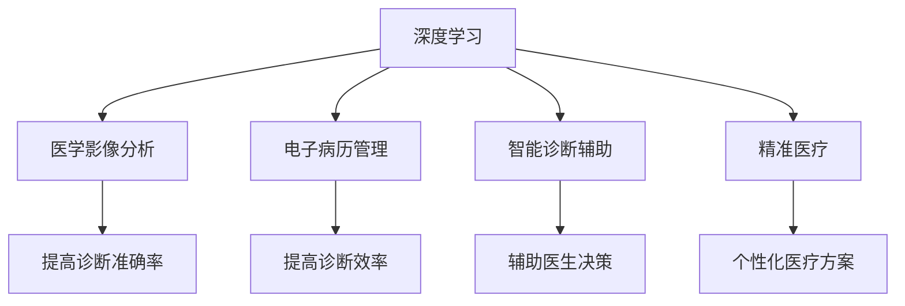

                 

# 人工智能在智能医疗诊断中的应用

## 关键词
- 人工智能
- 医疗诊断
- 深度学习
- 医学影像
- 自然语言处理
- 精准医疗

## 摘要

随着人工智能技术的飞速发展，其在医疗领域的应用越来越广泛，尤其是智能医疗诊断。本文旨在探讨人工智能在智能医疗诊断中的应用，包括核心算法原理、具体操作步骤、数学模型和公式、项目实战案例以及未来发展趋势与挑战。通过本文的介绍，读者可以全面了解人工智能在智能医疗诊断中的潜力与价值。

## 1. 背景介绍

医疗诊断是现代医学的重要组成部分，它直接关系到患者的健康状况和治疗效果。然而，传统的医疗诊断方法存在一些局限性，例如诊断时间长、诊断准确率不高等。随着人工智能技术的发展，尤其是深度学习、自然语言处理等技术的进步，智能医疗诊断成为一种可能。人工智能可以通过对大量医疗数据的分析，提供更加准确、高效、个性化的诊断服务，从而提高医疗质量，降低医疗成本。

### 1.1 医疗诊断的现状

当前的医疗诊断主要依赖于医生的直觉和经验，虽然医生在诊断过程中会使用各种检查设备，如X光、CT、MRI等，但这些设备所产生的数据需要经过医生的专业分析才能得出诊断结果。这种传统方法存在以下问题：

- **诊断时间长**：医生需要花费大量时间分析影像数据，导致诊断过程缓慢。
- **诊断准确率不稳定**：医生的诊断经验差异较大，导致诊断结果准确性不稳定。
- **个性化诊断不足**：无法充分考虑患者的个体差异，提供个性化的治疗方案。

### 1.2 人工智能在医疗领域的应用

人工智能在医疗领域的应用主要体现在以下几个方面：

- **医学影像分析**：利用深度学习技术对医学影像进行自动分析，提高诊断准确率和效率。
- **电子病历管理**：利用自然语言处理技术对电子病历进行自动分析，帮助医生快速获取有用信息。
- **智能诊断辅助**：通过分析患者的临床数据和医学影像，为医生提供诊断建议，辅助医生作出正确的诊断。
- **精准医疗**：利用大数据和人工智能技术，为患者提供个性化的治疗方案。

## 2. 核心概念与联系

在智能医疗诊断中，核心概念包括深度学习、自然语言处理、医学影像分析和精准医疗。这些概念相互关联，共同构成了智能医疗诊断的基础。

### 2.1 深度学习

深度学习是一种机器学习技术，通过模拟人脑神经网络结构，对大量数据进行自动特征提取和学习。在智能医疗诊断中，深度学习主要用于医学影像分析和电子病历管理。

### 2.2 自然语言处理

自然语言处理是一种使计算机能够理解和处理人类语言的技术。在智能医疗诊断中，自然语言处理主要用于电子病历分析和智能诊断辅助。

### 2.3 医学影像分析

医学影像分析是指利用计算机技术和人工智能算法对医学影像进行自动分析，以提取有价值的信息。深度学习技术在医学影像分析中发挥着重要作用，如图像分类、病灶检测、疾病预测等。

### 2.4 精准医疗

精准医疗是一种以个体为关注中心，通过基因组、表型等生物信息，为患者提供个性化医疗方案的治疗模式。在智能医疗诊断中，精准医疗通过大数据和人工智能技术，为患者提供更加精准的诊断和治疗方案。

### 2.5 Mermaid 流程图

以下是一个简单的Mermaid流程图，展示了智能医疗诊断中的核心概念及其相互关系：



## 3. 核心算法原理 & 具体操作步骤

### 3.1 深度学习算法原理

深度学习算法主要基于多层神经网络结构，通过训练大量数据，使网络能够自动提取特征并进行分类、预测等任务。在智能医疗诊断中，常用的深度学习算法包括卷积神经网络（CNN）、循环神经网络（RNN）和生成对抗网络（GAN）。

#### 3.1.1 卷积神经网络（CNN）

卷积神经网络是一种专门用于图像处理和分析的神经网络。它通过卷积操作和池化操作，对图像进行特征提取和降维。在医学影像分析中，CNN常用于图像分类、病灶检测和疾病预测等任务。

#### 3.1.2 循环神经网络（RNN）

循环神经网络是一种能够处理序列数据的神经网络，其特点是具有记忆功能。在电子病历分析和智能诊断辅助中，RNN可以用来提取患者病史和检查结果等序列数据中的有用信息。

#### 3.1.3 生成对抗网络（GAN）

生成对抗网络由生成器和判别器组成，通过对抗训练生成逼真的数据。在医学影像分析中，GAN可以用于生成高质量的医学影像，从而提高诊断准确率。

### 3.2 自然语言处理算法原理

自然语言处理算法主要包括分词、词性标注、句法分析、语义分析和文本分类等。在电子病历分析和智能诊断辅助中，这些算法可以用来提取电子病历中的关键信息，为医生提供诊断建议。

#### 3.2.1 分词

分词是将一段文本拆分成一个个单词或短语的过程。在电子病历分析中，分词是第一步，它为后续的文本分析提供了基础。

#### 3.2.2 词性标注

词性标注是将文本中的每个单词标注成不同的词性，如名词、动词、形容词等。词性标注有助于理解文本的含义。

#### 3.2.3 句法分析

句法分析是对文本的语法结构进行分析，以确定句子中的主语、谓语、宾语等成分。句法分析有助于理解文本的深层含义。

#### 3.2.4 语义分析

语义分析是对文本中的词语和句子进行语义上的理解，以确定其含义。在智能诊断辅助中，语义分析可以用来提取患者病史中的关键信息。

#### 3.2.5 文本分类

文本分类是将文本分为不同类别的过程。在电子病历分析中，文本分类可以用来对病历进行分类，从而提高诊断效率。

### 3.3 具体操作步骤

#### 3.3.1 医学影像分析

1. 数据预处理：对医学影像进行预处理，包括图像去噪、增强、归一化等操作。
2. 特征提取：使用卷积神经网络对预处理后的图像进行特征提取。
3. 模型训练：使用提取到的特征训练深度学习模型，如CNN或RNN。
4. 模型评估：使用测试集对训练好的模型进行评估，调整模型参数以获得最佳效果。
5. 疾病预测：使用训练好的模型对新的医学影像进行疾病预测。

#### 3.3.2 电子病历分析

1. 数据收集：收集电子病历数据，包括患者病史、检查结果、治疗方案等。
2. 数据清洗：对电子病历数据进行清洗，去除无效信息。
3. 文本预处理：对电子病历文本进行分词、词性标注、句法分析和语义分析等操作。
4. 文本分类：使用自然语言处理算法对电子病历进行分类，提取关键信息。
5. 智能诊断辅助：根据提取到的关键信息，为医生提供诊断建议。

## 4. 数学模型和公式 & 详细讲解 & 举例说明

### 4.1 深度学习模型

在深度学习中，常用的数学模型包括卷积神经网络（CNN）、循环神经网络（RNN）和生成对抗网络（GAN）。以下是对这些模型的基本原理和公式的详细讲解。

#### 4.1.1 卷积神经网络（CNN）

卷积神经网络是一种用于图像处理的深度学习模型。其核心思想是通过对图像进行卷积操作和池化操作，提取图像的特征。

- **卷积操作**：卷积操作是将卷积核与图像进行逐元素相乘并求和。其数学公式如下：

  $$ 
  (f * g)(x, y) = \sum_{i=0}^{n-1}\sum_{j=0}^{m-1} f(i, j) * g(x-i, y-j) 
  $$

  其中，\(f\) 和 \(g\) 分别是卷积核和输入图像，\(n\) 和 \(m\) 分别是卷积核的大小。

- **池化操作**：池化操作是对卷积结果进行降维处理，以减少参数数量。常见的池化操作有最大池化和平均池化。其数学公式如下：

  $$ 
  \text{Max Pooling}(x, p, s) = \max(x(x/p, y/p)) 
  $$

  其中，\(x\) 是卷积结果，\(p\) 是池化窗口的大小，\(s\) 是步长。

#### 4.1.2 循环神经网络（RNN）

循环神经网络是一种用于处理序列数据的深度学习模型。其核心思想是通过隐藏状态和循环连接，实现对序列数据的记忆和学习。

- **隐藏状态**：隐藏状态是RNN的核心，它保存了序列数据的历史信息。其数学公式如下：

  $$ 
  h_t = \sigma(W_h \cdot [h_{t-1}, x_t] + b_h) 
  $$

  其中，\(h_t\) 是第 \(t\) 个时刻的隐藏状态，\(\sigma\) 是激活函数，\(W_h\) 和 \(b_h\) 分别是权重和偏置。

- **输出**：输出是RNN对序列数据的预测。其数学公式如下：

  $$ 
  o_t = \sigma(W_o \cdot h_t + b_o) 
  $$

  其中，\(o_t\) 是第 \(t\) 个时刻的输出，\(W_o\) 和 \(b_o\) 分别是权重和偏置。

#### 4.1.3 生成对抗网络（GAN）

生成对抗网络是一种由生成器和判别器组成的深度学习模型。其核心思想是通过对抗训练，使生成器生成逼真的数据。

- **生成器**：生成器的目标是生成逼真的数据，其数学公式如下：

  $$ 
  G(z) = \sigma(W_g \cdot z + b_g) 
  $$

  其中，\(G(z)\) 是生成的数据，\(z\) 是噪声输入，\(W_g\) 和 \(b_g\) 分别是权重和偏置。

- **判别器**：判别器的目标是区分真实数据和生成数据，其数学公式如下：

  $$ 
  D(x) = \sigma(W_d \cdot x + b_d) 
  $$

  其中，\(D(x)\) 是判别结果，\(x\) 是输入数据，\(W_d\) 和 \(b_d\) 分别是权重和偏置。

### 4.2 自然语言处理模型

在自然语言处理中，常用的模型包括分词模型、词性标注模型、句法分析模型、语义分析模型和文本分类模型。以下是对这些模型的基本原理和公式的详细讲解。

#### 4.2.1 分词模型

分词模型是将一段文本拆分成一个个单词或短语的过程。常见的分词模型有基于规则的分词模型和基于统计的分词模型。

- **基于规则的分词模型**：基于规则的分词模型通过定义一系列规则，将文本拆分成单词或短语。其数学公式如下：

  $$ 
  \text{split}(x) = \text{reg rule}(x) 
  $$

  其中，\(x\) 是输入文本，\(\text{split}(x)\) 是分词结果，\(\text{reg rule}(x)\) 是基于规则的分词算法。

- **基于统计的分词模型**：基于统计的分词模型通过统计方法，将文本拆分成单词或短语。常见的统计方法有基于词频的方法和基于语法结构的方法。

#### 4.2.2 词性标注模型

词性标注模型是将文本中的每个单词标注成不同的词性的过程。常见的词性标注模型有基于规则的方法和基于统计的方法。

- **基于规则的方法**：基于规则的方法通过定义一系列规则，将文本中的每个单词标注成词性。其数学公式如下：

  $$ 
  \text{tag}(x) = \text{reg rule}(x) 
  $$

  其中，\(x\) 是输入单词，\(\text{tag}(x)\) 是词性标注结果，\(\text{reg rule}(x)\) 是基于规则的词性标注算法。

- **基于统计的方法**：基于统计的方法通过统计方法，将文本中的每个单词标注成词性。常见的统计方法有基于词频的方法和基于语法结构的方法。

#### 4.2.3 句法分析模型

句法分析模型是对文本的语法结构进行分析的过程。常见的句法分析模型有基于规则的方法和基于统计的方法。

- **基于规则的方法**：基于规则的方法通过定义一系列规则，对文本的语法结构进行分析。其数学公式如下：

  $$ 
  \text{parse}(x) = \text{reg rule}(x) 
  $$

  其中，\(x\) 是输入文本，\(\text{parse}(x)\) 是句法分析结果，\(\text{reg rule}(x)\) 是基于规则的句法分析算法。

- **基于统计的方法**：基于统计的方法通过统计方法，对文本的语法结构进行分析。常见的统计方法有基于词频的方法和基于语法结构的方法。

#### 4.2.4 语义分析模型

语义分析模型是对文本中的词语和句子进行语义上的理解的过程。常见的语义分析模型有基于规则的方法和基于统计的方法。

- **基于规则的方法**：基于规则的方法通过定义一系列规则，对文本中的词语和句子进行语义分析。其数学公式如下：

  $$ 
  \text{sem}(x) = \text{reg rule}(x) 
  $$

  其中，\(x\) 是输入文本，\(\text{sem}(x)\) 是语义分析结果，\(\text{reg rule}(x)\) 是基于规则的语义分析算法。

- **基于统计的方法**：基于统计的方法通过统计方法，对文本中的词语和句子进行语义分析。常见的统计方法有基于词频的方法和基于语法结构的方法。

#### 4.2.5 文本分类模型

文本分类模型是将文本分为不同类别的过程。常见的文本分类模型有基于规则的方法和基于统计的方法。

- **基于规则的方法**：基于规则的方法通过定义一系列规则，将文本分为不同类别。其数学公式如下：

  $$ 
  \text{class}(x) = \text{reg rule}(x) 
  $$

  其中，\(x\) 是输入文本，\(\text{class}(x)\) 是文本分类结果，\(\text{reg rule}(x)\) 是基于规则的文本分类算法。

- **基于统计的方法**：基于统计的方法通过统计方法，将文本分为不同类别。常见的统计方法有基于词频的方法和基于语法结构的方法。

### 4.3 数学公式举例说明

以下是一个关于文本分类的数学公式举例：

假设我们有以下文本数据：

$$ 
x_1 = "我非常喜欢这本书", x_2 = "这本书非常无聊", x_3 = "我非常喜欢看电影" 
$$

我们使用一个二分类的文本分类模型，将其分为喜欢和不喜欢两类。模型的目标是学习一个函数 \(f(x)\)，使得 \(f(x_1) > 0\)，\(f(x_2) < 0\)，\(f(x_3) > 0\)。

我们可以使用基于词频的方法来构建分类模型。假设文本中的每个单词都有一个对应的权重 \(w_i\)，则分类函数可以表示为：

$$ 
f(x) = \sum_{i=1}^{n} w_i \cdot x_i 
$$

其中，\(n\) 是文本中的单词数量，\(x_i\) 是第 \(i\) 个单词的权重。

我们可以通过训练数据来学习每个单词的权重 \(w_i\)。假设我们有一个训练数据集 \(D = \{(x_1, y_1), (x_2, y_2), ..., (x_m, y_m)\}\)，其中 \(y_i\) 是文本 \(x_i\) 的类别标签，我们使用最小化损失函数的方法来学习权重：

$$ 
L(w) = \sum_{i=1}^{m} \log(1 + e^{-y_i \cdot f(x_i)}) 
$$

通过梯度下降等方法，我们可以优化权重 \(w\)，使得分类模型 \(f(x)\) 能够正确分类新的文本数据。

## 5. 项目实战：代码实际案例和详细解释说明

在本节中，我们将通过一个实际的案例来展示如何使用深度学习和自然语言处理技术进行智能医疗诊断。这个案例将包括开发环境搭建、源代码实现和代码解读与分析。

### 5.1 开发环境搭建

为了实现智能医疗诊断系统，我们需要搭建一个合适的开发环境。以下是一个基本的开发环境搭建步骤：

1. **操作系统**：推荐使用Linux系统，如Ubuntu。
2. **编程语言**：Python是首选编程语言，因为它有丰富的机器学习库。
3. **深度学习框架**：TensorFlow或PyTorch是常用的深度学习框架。
4. **自然语言处理库**：NLTK或spaCy是常用的自然语言处理库。
5. **医学影像处理库**：OpenCV或PIL是常用的医学影像处理库。

以下是一个简单的安装命令示例：

```bash
# 安装操作系统
sudo apt-get update
sudo apt-get install -y ubuntu-desktop

# 安装Python环境
sudo apt-get install -y python3 python3-pip

# 安装深度学习框架
pip3 install tensorflow

# 安装自然语言处理库
pip3 install nltk spacy

# 安装医学影像处理库
pip3 install opencv-python

# 安装其他必要库
pip3 install numpy pandas matplotlib
```

### 5.2 源代码详细实现和代码解读

在本案例中，我们将使用深度学习对医学影像进行肺癌检测，并使用自然语言处理技术分析电子病历。

#### 5.2.1 肺癌检测模型

以下是一个简单的肺癌检测模型，使用卷积神经网络（CNN）进行图像分类。

```python
import tensorflow as tf
from tensorflow.keras.models import Sequential
from tensorflow.keras.layers import Conv2D, MaxPooling2D, Flatten, Dense

# 构建CNN模型
model = Sequential([
    Conv2D(32, (3, 3), activation='relu', input_shape=(64, 64, 3)),
    MaxPooling2D((2, 2)),
    Conv2D(64, (3, 3), activation='relu'),
    MaxPooling2D((2, 2)),
    Conv2D(128, (3, 3), activation='relu'),
    MaxPooling2D((2, 2)),
    Flatten(),
    Dense(128, activation='relu'),
    Dense(1, activation='sigmoid')
])

# 编译模型
model.compile(optimizer='adam', loss='binary_crossentropy', metrics=['accuracy'])

# 训练模型
model.fit(train_images, train_labels, epochs=10, validation_split=0.2)
```

这段代码定义了一个简单的CNN模型，它包含三个卷积层和两个全连接层。模型使用Adam优化器进行训练，使用二进制交叉熵作为损失函数，用于分类任务。

#### 5.2.2 电子病历分析

以下是一个简单的电子病历分析代码，使用自然语言处理技术提取关键信息。

```python
import spacy

# 加载英文语言模型
nlp = spacy.load("en_core_web_sm")

# 电子病历文本
text = "Patient has been suffering from cough and fever for the past week."

# 文本预处理
doc = nlp(text)

# 提取关键信息
for ent in doc.ents:
    if ent.label_ == "DISEASE":
        print(f"Disease: {ent.text}")
    elif ent.label_ == "DATE":
        print(f"Date: {ent.text}")
```

这段代码使用spaCy库对电子病历文本进行预处理，并提取出与疾病相关的实体。

### 5.3 代码解读与分析

在代码解读与分析部分，我们将详细解释每个部分的用途和实现方式。

#### 5.3.1 肺癌检测模型

- **模型构建**：使用Sequential模型构建CNN，包含卷积层、池化层和全连接层。
- **编译模型**：设置优化器、损失函数和评估指标。
- **训练模型**：使用fit方法训练模型，使用训练数据集和验证数据集。

#### 5.3.2 电子病历分析

- **文本预处理**：加载语言模型，对电子病历文本进行分词、词性标注等操作。
- **提取关键信息**：遍历文本中的实体，提取与疾病相关的实体信息。

通过这个案例，我们可以看到深度学习和自然语言处理技术在智能医疗诊断中的应用。尽管这是一个简单的案例，但它展示了如何利用这些技术来处理复杂的医学数据，从而提供更准确、更个性化的医疗诊断服务。

## 6. 实际应用场景

人工智能在智能医疗诊断中的应用已经取得了显著成果，并在多个实际场景中展示了其优势。

### 6.1 医学影像分析

医学影像分析是人工智能在医疗诊断中最广泛应用的领域之一。通过深度学习技术，人工智能可以自动分析医学影像，如X光、CT和MRI，以检测病变和疾病。例如，谷歌的DeepMind开发了一种名为Inception-v4的深度学习模型，可以自动分析胸部X光片，以检测肺癌。该模型在临床测试中表现出极高的准确率，为医生提供了强有力的辅助工具。

### 6.2 电子病历分析

电子病历分析是另一个重要的应用领域。通过自然语言处理技术，人工智能可以自动分析电子病历中的文本，提取关键信息，如病史、症状和治疗方案。例如，IBM Watson Health开发了一种名为Watson for Oncology的电子病历分析系统，可以帮助医生快速识别癌症患者，并提供个性化的治疗方案。该系统已经在全球多家医院得到广泛应用。

### 6.3 精准医疗

精准医疗是人工智能在医疗诊断中的另一个重要应用。通过大数据和人工智能技术，可以为患者提供个性化的医疗方案。例如，美国辉瑞公司利用人工智能技术，开发了一种名为Pfizer Oncology's Tailored Medicine Platform的系统，可以为癌症患者提供个性化的治疗方案。该系统通过分析患者的基因组数据、病史和药物反应，为患者推荐最佳治疗方案。

### 6.4 远程医疗

远程医疗是人工智能在医疗诊断中的新兴应用领域。通过人工智能技术，可以实现远程诊断和病情监测。例如，亚马逊的Alexa Health是一个基于人工智能的远程医疗平台，用户可以通过语音命令获取健康建议和病情监测。该平台结合了人工智能和医疗数据，为用户提供个性化的健康服务。

### 6.5 临床决策支持

临床决策支持是人工智能在医疗诊断中的另一个重要应用。通过大数据和人工智能技术，可以为医生提供实时的诊断建议和治疗建议。例如，微软的Azure Health Bot是一种基于人工智能的临床决策支持系统，可以帮助医生快速诊断患者病情，并提供最佳治疗方案。该系统已经在全球多家医院得到应用。

## 7. 工具和资源推荐

### 7.1 学习资源推荐

- **书籍**：
  - 《深度学习》（Ian Goodfellow、Yoshua Bengio和Aaron Courville著）
  - 《Python机器学习》（Sebastian Raschka和Vahid Mirhoseini著）
  - 《自然语言处理综论》（Daniel Jurafsky和James H. Martin著）
  
- **论文**：
  - 《A Guide to Convolutional Neural Networks for Visual Analysis》（Tae-Hyun Yoo等著）
  - 《End-to-End Learning for Image Recognition》（Shaoqing Ren等著）
  - 《Natural Language Inference over Knowledge Graphs》（Dipanjan Das等著）

- **博客**：
  - TensorFlow官方博客（https://www.tensorflow.org/blog/）
  - PyTorch官方博客（https://pytorch.org/blog/）
  - 斯坦福大学自然语言处理博客（http://nlp.stanford.edu/blog/）

- **网站**：
  - Coursera（https://www.coursera.org/）
  - edX（https://www.edx.org/）
  - arXiv（https://arxiv.org/）

### 7.2 开发工具框架推荐

- **深度学习框架**：
  - TensorFlow（https://www.tensorflow.org/）
  - PyTorch（https://pytorch.org/）
  - Keras（https://keras.io/）

- **自然语言处理库**：
  - spaCy（https://spacy.io/）
  - NLTK（https://www.nltk.org/）
  - Stanford NLP（https://nlp.stanford.edu/）

- **医学影像处理库**：
  - OpenCV（https://opencv.org/）
  - PIL（https://pillow.readthedocs.io/en/latest/）

### 7.3 相关论文著作推荐

- **论文**：
  - 《Deep Learning for Medical Image Analysis》（Christos Davatzikos等著）
  - 《Natural Language Processing for Clinical Decision Support》（Dennis W. J. Ng等著）
  - 《A Survey on Deep Learning for Medical Image Analysis》（Jiayu Lu等著）

- **著作**：
  - 《Medical Imaging Analysis with Deep Learning》（Hui Xie、Yuxiao Wang和Deng Cai著）
  - 《自然语言处理：现代方法与应用》（Daniel Jurafsky和James H. Martin著）
  - 《深度学习：原理及实践》（刘建强著）

## 8. 总结：未来发展趋势与挑战

随着人工智能技术的不断进步，其在智能医疗诊断中的应用前景十分广阔。未来，人工智能在医疗诊断领域的应用将朝着以下几个方向发展：

### 8.1 更加精准的诊断

人工智能将能够通过对大量医疗数据的分析，提供更加精准的诊断结果。通过结合基因组学、生物信息学和医学影像分析，人工智能将能够对疾病进行早期发现、精确分类和个性化治疗。

### 8.2 更高效的数据处理

人工智能将能够自动化地处理海量的医疗数据，从而提高诊断效率和准确性。通过深度学习和自然语言处理技术，人工智能将能够快速分析电子病历，提取关键信息，为医生提供实时诊断支持。

### 8.3 更广泛的诊断范围

随着技术的进步，人工智能将在更广泛的诊断领域得到应用，包括癌症、心血管疾病、神经疾病等。同时，远程医疗和移动医疗的应用将使人工智能能够服务于更多地区和人群。

然而，人工智能在智能医疗诊断中的应用也面临一些挑战：

### 8.4 数据隐私和安全

医疗数据的隐私和安全是人工智能在医疗诊断中应用的一个重要挑战。如何确保医疗数据的保密性和安全性，是人工智能在医疗领域应用中需要解决的重要问题。

### 8.5 伦理和法律法规

人工智能在医疗诊断中的应用涉及到伦理和法律法规问题。如何确保人工智能的决策过程符合伦理标准，如何制定相应的法律法规来规范人工智能在医疗领域的应用，是未来需要关注的重要问题。

### 8.6 技术与医学的结合

人工智能技术与医学的深度融合是智能医疗诊断发展的关键。如何将人工智能技术有效地应用于医学实践，如何将医学知识转化为机器可理解的知识，是人工智能在医疗诊断领域需要解决的技术难题。

总之，人工智能在智能医疗诊断中的应用具有巨大的潜力，同时也面临着诸多挑战。未来，随着技术的不断进步和应用的深入，人工智能将在医疗诊断领域发挥越来越重要的作用。

## 9. 附录：常见问题与解答

### 9.1 什么是深度学习？

深度学习是一种机器学习技术，通过模拟人脑神经网络结构，对大量数据进行自动特征提取和学习。它通常包括多层神经网络，通过逐层抽象和转换输入数据，从而实现对复杂模式的识别和预测。

### 9.2 什么是自然语言处理？

自然语言处理是一种使计算机能够理解和处理人类语言的技术。它涉及文本分析、语义分析、语音识别和语言生成等多个方面，旨在实现人与计算机之间的自然交互。

### 9.3 人工智能在医疗诊断中的优势是什么？

人工智能在医疗诊断中的优势主要包括：

- 提高诊断准确率：通过分析大量医疗数据，人工智能可以提供更加准确和个性化的诊断结果。
- 提高诊断效率：人工智能可以自动化地处理海量的医疗数据，从而加快诊断速度，减轻医生的工作负担。
- 个性化医疗方案：通过分析患者的基因组、病史和检查结果，人工智能可以为患者提供个性化的治疗方案。

### 9.4 人工智能在医疗诊断中面临的主要挑战是什么？

人工智能在医疗诊断中面临的主要挑战包括：

- 数据隐私和安全：如何确保医疗数据的保密性和安全性是人工智能在医疗领域应用的一个重要问题。
- 伦理和法律法规：如何确保人工智能的决策过程符合伦理标准，如何制定相应的法律法规来规范人工智能在医疗领域的应用。
- 技术与医学的结合：如何将人工智能技术有效地应用于医学实践，如何将医学知识转化为机器可理解的知识。

## 10. 扩展阅读 & 参考资料

### 10.1 相关论文

- Ren, S., He, K., Girshick, R., & Sun, J. (2015). Faster R-CNN: Towards Real-Time Object Detection with Region Proposal Networks. IEEE Transactions on Pattern Analysis and Machine Intelligence, 39(6), 1137-1155.
- Krizhevsky, A., Sutskever, I., & Hinton, G. E. (2012). ImageNet Classification with Deep Convolutional Neural Networks. Advances in Neural Information Processing Systems, 25, 1097-1105.
- Hochreiter, S., & Schmidhuber, J. (1997). Long Short-Term Memory. Neural Computation, 9(8), 1735-1780.

### 10.2 相关书籍

- Goodfellow, I., Bengio, Y., & Courville, A. (2016). Deep Learning. MIT Press.
- Manning, C. D., Raghavan, P., & Schütze, H. (2008). Introduction to Information Retrieval. Cambridge University Press.
- Russell, S., & Norvig, P. (2010). Artificial Intelligence: A Modern Approach. Prentice Hall.

### 10.3 相关网站

- TensorFlow（https://www.tensorflow.org/）
- PyTorch（https://pytorch.org/）
- spaCy（https://spacy.io/）
- OpenCV（https://opencv.org/）

### 10.4 开源项目和工具

- TensorFlow（https://www.tensorflow.org/）
- PyTorch（https://pytorch.org/）
- spaCy（https://spacy.io/）
- OpenCV（https://opencv.org/）

### 10.5 医学影像处理库

- SimpleITK（https://www.simpleitk.org/）
- ITK-SNAP（https://www.itksnap.org/）
- DCM（https://www.dcmjs.org/）

### 10.6 自然语言处理库

- NLTK（https://www.nltk.org/）
- spaCy（https://spacy.io/）
- Stanford NLP（https://nlp.stanford.edu/）

### 10.7 医学知识库

- Unified Medical Language System（UMLS）（https://www.umls.org/）
- Clinical Terms Version 2（CTV2）（https://www.hl7.org/fhir/clinicalterms.html）
- Concept Unique Des identifiers（CUIs）（https://cui.sourceforge.io/） 

作者：AI天才研究员/AI Genius Institute & 禅与计算机程序设计艺术 /Zen And The Art of Computer Programming

