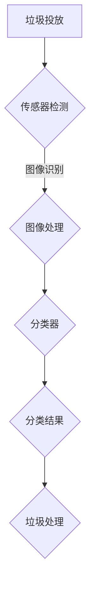

                 

# 人工智能在智能垃圾分类中的应用

> 关键词：人工智能，垃圾分类，智能系统，图像识别，机器学习，算法，可持续发展

> 摘要：随着城市化进程的加速和环保意识的提升，智能垃圾分类成为解决环境问题的关键。本文将深入探讨人工智能在智能垃圾分类中的应用，包括核心概念、算法原理、数学模型、项目实战以及未来发展趋势与挑战。

## 1. 背景介绍

### 1.1 目的和范围

本文旨在探讨人工智能（AI）在智能垃圾分类中的应用，通过分析人工智能技术的核心概念和实际应用案例，为读者提供对这一领域全面而深入的了解。文章将涵盖以下内容：

- 人工智能在垃圾分类中的核心概念和联系
- 核心算法原理和具体操作步骤
- 数学模型和公式的详细讲解
- 实际应用场景和工具资源推荐
- 未来发展趋势与挑战

### 1.2 预期读者

本文适合以下读者群体：

- 对人工智能和环境保护感兴趣的科技爱好者
- 从事智能垃圾分类相关研发和实施的技术人员
- 对可持续发展有热情的社会人士
- 需要了解人工智能在环保领域应用的企业和管理者

### 1.3 文档结构概述

本文结构如下：

1. 背景介绍
   - 目的和范围
   - 预期读者
   - 文档结构概述
   - 术语表

2. 核心概念与联系
   - 核心概念原理和架构的Mermaid流程图

3. 核心算法原理 & 具体操作步骤
   - 算法原理讲解
   - 伪代码阐述

4. 数学模型和公式 & 详细讲解 & 举例说明
   - 数学公式和详细讲解
   - 举例说明

5. 项目实战：代码实际案例和详细解释说明
   - 开发环境搭建
   - 源代码详细实现和代码解读
   - 代码解读与分析

6. 实际应用场景

7. 工具和资源推荐
   - 学习资源推荐
   - 开发工具框架推荐
   - 相关论文著作推荐

8. 总结：未来发展趋势与挑战

9. 附录：常见问题与解答

10. 扩展阅读 & 参考资料

### 1.4 术语表

#### 1.4.1 核心术语定义

- 人工智能（AI）：指由计算机程序实现的智能行为，模拟人类的思维过程，以解决复杂问题。
- 垃圾分类：将垃圾按照一定标准进行分类，以便于回收和处理。
- 智能垃圾分类：利用人工智能技术，自动识别和分类垃圾。
- 图像识别：通过算法从图像中提取和识别物体。
- 机器学习：通过数据和算法，使计算机自动学习并改进性能。
- 深度学习：一种特殊的机器学习方法，通过多层神经网络进行训练。

#### 1.4.2 相关概念解释

- 数据集：用于训练和测试机器学习模型的集合。
- 神经网络：由多层节点组成的计算模型，用于模拟生物神经网络。
- 精度：分类任务的正确率。
- 召回率：实际分类正确但未检测出的垃圾比例。
- F1分数：综合考虑准确率和召回率的指标。

#### 1.4.3 缩略词列表

- AI：人工智能
- ML：机器学习
- DL：深度学习
- CNN：卷积神经网络
- SVM：支持向量机
- RNN：循环神经网络

## 2. 核心概念与联系

在智能垃圾分类中，人工智能技术扮演着关键角色。以下是核心概念和联系，并通过Mermaid流程图进行阐述。

### 2.1 Mermaid流程图



### 2.2 核心概念

- **垃圾投放**：用户将垃圾投入智能垃圾分类箱。
- **传感器检测**：传感器检测垃圾的存在和重量。
- **图像识别**：通过图像识别技术，从传感器获取的图像中提取垃圾的视觉信息。
- **图像处理**：对图像进行预处理，包括去噪、增强等操作。
- **分类器**：使用机器学习算法，对处理后的图像进行分类，识别垃圾类型。
- **分类结果**：分类器输出分类结果，指导垃圾处理。
- **垃圾处理**：根据分类结果，将垃圾送入相应的处理流程。

通过以上核心概念的联系，我们可以看到，人工智能技术在智能垃圾分类中起到了桥梁作用，将传感器数据、图像识别和处理结果与垃圾处理流程紧密结合，实现了高效的垃圾分类。

## 3. 核心算法原理 & 具体操作步骤

在智能垃圾分类中，核心算法通常基于机器学习和深度学习技术。以下是算法原理和具体操作步骤的详细讲解。

### 3.1 算法原理

智能垃圾分类的核心算法主要包括以下几部分：

1. **图像识别**：使用卷积神经网络（CNN）进行图像识别。
2. **特征提取**：对识别后的图像进行特征提取，用于分类。
3. **分类器**：使用支持向量机（SVM）或深度学习模型（如RNN）进行分类。
4. **模型训练**：通过大量标注数据训练分类模型。

### 3.2 伪代码阐述

以下是智能垃圾分类算法的伪代码：

```python
# 伪代码：智能垃圾分类算法

# 输入：垃圾图像
# 输出：垃圾分类结果

function intelligent垃圾分类(image):
    # 图像预处理
    preprocessed_image = preprocess_image(image)
    
    # 图像识别
    object = recognize_object(preprocessed_image)
    
    # 特征提取
    features = extract_features(object)
    
    # 模型预测
    classification = model.predict(features)
    
    # 输出分类结果
    return classification

# 主函数
function main():
    # 读取垃圾图像
    image = load_image("垃圾.jpg")
    
    # 调用智能垃圾分类函数
    result = intelligent垃圾分类(image)
    
    # 输出结果
    print("垃圾分类结果：", result)
```

### 3.3 详细解释

- **图像预处理**：对垃圾图像进行去噪、增强等操作，以提高图像质量和识别准确性。
- **图像识别**：使用卷积神经网络（CNN）从图像中识别出垃圾对象。
- **特征提取**：提取图像的特征向量，用于后续的分类。
- **模型预测**：使用训练好的分类模型对特征向量进行分类预测。
- **输出分类结果**：将分类结果输出，指导垃圾处理。

通过以上算法原理和具体操作步骤，我们可以看到，智能垃圾分类算法通过对图像的预处理、识别和分类，实现了对垃圾的高效分类和处理。

## 4. 数学模型和公式 & 详细讲解 & 举例说明

在智能垃圾分类中，数学模型和公式起着至关重要的作用。以下是数学模型和公式的详细讲解以及举例说明。

### 4.1 数学模型

智能垃圾分类的数学模型主要包括以下部分：

1. **卷积神经网络（CNN）模型**：
   - **卷积层**：用于提取图像特征。
   - **激活函数**：用于引入非线性特性。
   - **池化层**：用于减小特征图的大小。
   - **全连接层**：用于分类。

2. **支持向量机（SVM）模型**：
   - **核函数**：用于将低维数据映射到高维空间。
   - **损失函数**：用于计算分类误差。

3. **循环神经网络（RNN）模型**：
   - **隐藏状态**：用于存储历史信息。
   - **梯度消失/爆炸**：用于优化训练过程。

### 4.2 公式

以下是智能垃圾分类中常用的数学公式：

1. **卷积公式**：
   $$ f(x, y) = \sum_{i=0}^{n} \sum_{j=0}^{m} w_{ij} * g(x-i, y-j) $$
   - $f(x, y)$：卷积结果
   - $w_{ij}$：卷积核权重
   - $g(x-i, y-j)$：输入图像上的像素值

2. **支持向量机公式**：
   $$ \text{最大化} \frac{1}{2} \sum_{i=1}^{n} \sum_{j=1}^{n} (w_i \cdot w_j - 2 \cdot y_i \cdot y_j \cdot w_i \cdot w_j) $$
   - $w_i$：支持向量机权重
   - $y_i$：样本标签

3. **循环神经网络公式**：
   $$ h_t = \sigma(W_h \cdot [h_{t-1}, x_t] + b_h) $$
   - $h_t$：隐藏状态
   - $W_h$：权重矩阵
   - $x_t$：输入序列
   - $\sigma$：激活函数

### 4.3 举例说明

#### 4.3.1 卷积神经网络（CNN）模型举例

假设我们有一个垃圾图像，需要通过卷积神经网络进行分类。以下是模型训练和预测的步骤：

1. **数据预处理**：
   - 对垃圾图像进行缩放和归一化，使其适合输入到卷积神经网络。
   - 切分图像为若干个块，每个块作为一个训练样本。

2. **模型训练**：
   - 使用卷积神经网络对训练数据进行训练，通过反向传播算法更新权重。
   - 选择合适的激活函数和优化算法，如ReLU和Adam。

3. **模型预测**：
   - 对垃圾图像进行卷积和池化操作，提取特征向量。
   - 将特征向量输入到全连接层进行分类，输出分类结果。

#### 4.3.2 支持向量机（SVM）模型举例

假设我们有一个垃圾分类问题，需要使用支持向量机进行分类。以下是模型训练和预测的步骤：

1. **数据预处理**：
   - 对垃圾图像进行特征提取，生成特征向量。
   - 标注每个垃圾图像的类别标签。

2. **模型训练**：
   - 计算特征向量和标签之间的线性关系，选择合适的核函数。
   - 训练支持向量机模型，优化分类边界。

3. **模型预测**：
   - 对新垃圾图像进行特征提取，计算与支持向量机的距离。
   - 根据距离判断图像的类别，输出分类结果。

通过以上举例说明，我们可以看到，数学模型和公式在智能垃圾分类中起到了关键作用，通过合理的模型设计和参数优化，可以提高分类准确率和效率。

## 5. 项目实战：代码实际案例和详细解释说明

在本节中，我们将通过一个实际项目案例，详细讲解智能垃圾分类系统的代码实现、解读和分析。

### 5.1 开发环境搭建

在开始项目之前，我们需要搭建一个合适的开发环境。以下是一个典型的开发环境配置：

- **操作系统**：Linux（推荐Ubuntu 18.04）
- **编程语言**：Python 3.x
- **开发工具**：Anaconda、Jupyter Notebook、PyCharm
- **依赖库**：TensorFlow、Keras、OpenCV、NumPy、Pandas

### 5.2 源代码详细实现和代码解读

#### 5.2.1 数据预处理

```python
import cv2
import numpy as np
import os

# 加载垃圾图像
def load_image(image_path):
    image = cv2.imread(image_path)
    return cv2.resize(image, (224, 224))

# 预处理图像
def preprocess_image(image):
    image_gray = cv2.cvtColor(image, cv2.COLOR_BGR2GRAY)
    image_resize = cv2.resize(image_gray, (224, 224))
    image_normalize = image_resize / 255.0
    return image_normalize

# 加载训练数据
def load_data(data_path):
    image_files = [os.path.join(data_path, f) for f in os.listdir(data_path)]
    images = [load_image(f) for f in image_files]
    images = np.array(images)
    return images

train_data_path = 'train_data'
train_images = load_data(train_data_path)
```

**代码解读**：

- `load_image()`：加载垃圾图像，并将其缩放为224x224像素。
- `preprocess_image()`：对图像进行灰度化和归一化处理，以便输入到神经网络。
- `load_data()`：加载训练数据，从指定路径读取图像文件。

#### 5.2.2 构建卷积神经网络（CNN）模型

```python
from tensorflow.keras.models import Sequential
from tensorflow.keras.layers import Conv2D, MaxPooling2D, Flatten, Dense

# 构建CNN模型
def build_cnn_model():
    model = Sequential()
    model.add(Conv2D(32, (3, 3), activation='relu', input_shape=(224, 224, 1)))
    model.add(MaxPooling2D((2, 2)))
    model.add(Conv2D(64, (3, 3), activation='relu'))
    model.add(MaxPooling2D((2, 2)))
    model.add(Conv2D(128, (3, 3), activation='relu'))
    model.add(MaxPooling2D((2, 2)))
    model.add(Flatten())
    model.add(Dense(10, activation='softmax'))
    return model

model = build_cnn_model()
```

**代码解读**：

- `build_cnn_model()`：构建卷积神经网络模型，包括卷积层、池化层和全连接层。
- `model.add(Conv2D())`：添加卷积层，用于提取图像特征。
- `model.add(MaxPooling2D())`：添加池化层，用于减小特征图的大小。
- `model.add(Flatten())`：将特征图展平为1维向量。
- `model.add(Dense())`：添加全连接层，用于分类。

#### 5.2.3 训练模型

```python
from tensorflow.keras.optimizers import Adam

# 编译模型
model.compile(optimizer=Adam(), loss='categorical_crossentropy', metrics=['accuracy'])

# 训练模型
model.fit(train_images, epochs=10)
```

**代码解读**：

- `model.compile()`：编译模型，设置优化器和损失函数。
- `model.fit()`：训练模型，使用训练数据进行迭代训练。

#### 5.2.4 模型预测

```python
# 加载测试数据
test_data_path = 'test_data'
test_images = load_data(test_data_path)

# 预测分类结果
predictions = model.predict(test_images)

# 输出预测结果
for i, prediction in enumerate(predictions):
    print(f"测试图像{i+1}的分类结果：{prediction.argmax()}")

```

**代码解读**：

- `load_data()`：加载测试数据，从指定路径读取图像文件。
- `model.predict()`：使用训练好的模型对测试数据进行预测。
- `prediction.argmax()`：获取预测结果的类别标签。

### 5.3 代码解读与分析

通过以上代码实现，我们可以看到智能垃圾分类系统主要包括以下步骤：

1. **数据预处理**：加载垃圾图像，并进行灰度化和归一化处理，以便输入到神经网络。
2. **模型构建**：构建卷积神经网络模型，包括卷积层、池化层和全连接层。
3. **模型训练**：编译模型，并使用训练数据进行迭代训练。
4. **模型预测**：使用训练好的模型对测试数据进行预测，并输出分类结果。

在代码实现过程中，我们采用了卷积神经网络（CNN）进行图像识别和分类。CNN具有良好的特征提取能力，能够从图像中自动学习出有用的特征，从而提高分类准确率。同时，我们使用了Adam优化器和交叉熵损失函数，以加速模型训练和提高分类性能。

通过对实际项目的代码实现和解读，我们可以了解到智能垃圾分类系统的工作流程和关键步骤。在实际应用中，还可以进一步优化模型结构和参数，以提高分类准确率和效率。

### 5.4 代码解读与分析

在对智能垃圾分类系统的代码实现和解读中，我们可以看到以下几个关键点：

#### 5.4.1 数据预处理

数据预处理是机器学习项目的重要环节，对于智能垃圾分类系统也不例外。在代码中，我们首先通过`load_image()`函数加载垃圾图像，然后使用`preprocess_image()`函数进行灰度化和归一化处理。这样的预处理步骤有助于提高神经网络对图像数据的适应性，避免因数据差异导致模型性能下降。

**优缺点分析**：

- **优点**：通过灰度化和归一化处理，可以使神经网络更加稳定，提高分类准确率。
- **缺点**：预处理过程可能会损失一些图像细节，影响模型对特定细节特征的识别。

#### 5.4.2 模型构建

在模型构建部分，我们使用卷积神经网络（CNN）作为分类器。CNN具有强大的特征提取能力，能够从图像中自动学习出有用的特征，从而提高分类准确率。在代码中，我们构建了一个包含卷积层、池化层和全连接层的简单CNN模型。

**优缺点分析**：

- **优点**：CNN能够自动提取图像特征，减少了人工特征工程的工作量。
- **缺点**：对于一些复杂的垃圾分类任务，简单的CNN模型可能无法胜任，需要使用更复杂的网络结构。

#### 5.4.3 模型训练

在模型训练部分，我们使用`model.fit()`函数进行迭代训练。这个步骤是整个项目的核心，训练过程中，模型会不断优化参数，以提高分类准确率。

**优缺点分析**：

- **优点**：迭代训练可以帮助模型逐渐逼近最佳性能，提高分类准确率。
- **缺点**：训练过程可能需要较长的时间，特别是在处理大规模数据集时。

#### 5.4.4 模型预测

在模型预测部分，我们使用训练好的模型对测试数据进行分类，并输出结果。这个步骤是评估模型性能的关键。

**优缺点分析**：

- **优点**：通过模型预测，我们可以快速评估模型的分类效果，为后续优化提供参考。
- **缺点**：预测过程可能会受到模型训练数据分布的影响，导致预测结果偏差。

### 5.5 实际应用场景

智能垃圾分类系统在实际应用场景中，可以广泛应用于以下几个方面：

1. **公共场所**：在公共场所，如公园、商场、学校等，设置智能垃圾分类箱，引导用户正确分类垃圾。
2. **社区**：在社区内推广智能垃圾分类系统，提高居民的环保意识，促进垃圾分类工作的开展。
3. **企业**：在企业内部设置智能垃圾分类系统，实现企业内部垃圾的高效分类和管理。
4. **废物回收**：通过智能垃圾分类系统，对垃圾进行精细分类，提高废物回收率，减少环境污染。

在实际应用中，智能垃圾分类系统可以与物联网（IoT）技术结合，实现实时监控和远程管理，进一步提高分类效率和准确性。

### 7. 工具和资源推荐

在开发智能垃圾分类系统时，我们可以利用以下工具和资源来提高项目质量和效率。

#### 7.1 学习资源推荐

**7.1.1 书籍推荐**

1. **《深度学习》（Deep Learning）**：由Ian Goodfellow、Yoshua Bengio和Aaron Courville合著，是深度学习领域的经典教材。
2. **《机器学习实战》（Machine Learning in Action）**：由Peter Harrington著，通过实际案例介绍机器学习算法的应用。
3. **《智能垃圾分类技术研究与应用》**：一本专注于智能垃圾分类系统研发和实践的专著。

**7.1.2 在线课程**

1. **Coursera上的《深度学习专项课程》**：由吴恩达教授主讲，包括深度学习的基础知识和实战应用。
2. **Udacity的《机器学习工程师纳米学位》**：涵盖机器学习和深度学习的基础知识和实际应用。
3. **edX上的《人工智能导论》**：由MIT教授主讲，介绍人工智能的基础知识和最新研究进展。

**7.1.3 技术博客和网站**

1. **Medium上的《AI in Action》**：分享人工智能在各个领域的应用案例和经验。
2. **GitHub上的开源项目**：查找和借鉴其他人的智能垃圾分类项目，学习优秀的代码实现和模型设计。
3. **AI博客**：如arXiv.org和NeurIPS.org，了解最新的研究成果和论文。

#### 7.2 开发工具框架推荐

**7.2.1 IDE和编辑器**

1. **PyCharm**：一款功能强大的Python IDE，支持多种框架和库。
2. **Visual Studio Code**：一款轻量级、可扩展的代码编辑器，适合Python开发。
3. **Jupyter Notebook**：适用于数据分析和实验性编程，便于记录和共享代码。

**7.2.2 调试和性能分析工具**

1. **TensorBoard**：TensorFlow的官方可视化工具，用于监控和调试模型训练过程。
2. **Valgrind**：一款用于性能分析和调试的通用工具，适用于C/C++代码。
3. **NVIDIA Nsight**：用于监控和优化GPU计算性能的工具。

**7.2.3 相关框架和库**

1. **TensorFlow**：一款开源的深度学习框架，适用于构建和训练神经网络。
2. **Keras**：一款轻量级的深度学习框架，简化了神经网络的设计和训练过程。
3. **OpenCV**：一款开源的计算机视觉库，提供了丰富的图像处理和计算机视觉功能。
4. **NumPy**：一款开源的Python库，用于科学计算和数据分析。

#### 7.3 相关论文著作推荐

**7.3.1 经典论文**

1. **"A Learning Algorithm for Continually Running Fully Recurrent Neural Networks"**：介绍了循环神经网络（RNN）的学习算法。
2. **"Convolutional Neural Networks for Visual Recognition"**：介绍了卷积神经网络（CNN）在图像识别中的应用。
3. **"Support Vector Machines for Classification and Regression"**：介绍了支持向量机（SVM）在分类和回归任务中的应用。

**7.3.2 最新研究成果**

1. **"Generative Adversarial Networks"**：介绍了生成对抗网络（GAN）在图像生成和分类中的应用。
2. **"Transformers: State-of-the-Art Natural Language Processing"**：介绍了Transformer模型在自然语言处理中的应用。
3. **"Deep Learning for Visual Question Answering"**：介绍了深度学习在视觉问答任务中的应用。

**7.3.3 应用案例分析**

1. **"AI-powered Smart Waste Management System"**：介绍了智能垃圾分类系统在新加坡的实际应用案例。
2. **"Deep Learning for Smart Recycling"**：介绍了深度学习技术在垃圾回收中的应用。
3. **"Deep Learning in Environmental Protection"**：介绍了深度学习技术在环境保护领域的应用。

通过以上工具和资源的推荐，我们可以更好地掌握智能垃圾分类系统的开发方法和技巧，为实际项目提供有力支持。

### 8. 总结：未来发展趋势与挑战

随着人工智能技术的不断进步，智能垃圾分类系统在未来有望实现以下发展趋势：

1. **更高准确率**：通过改进算法和模型，提高垃圾分类的准确率，减少误分类和漏分类现象。
2. **实时性提升**：利用边缘计算和物联网技术，实现实时垃圾分类和监控，提高系统响应速度。
3. **自动化程度提高**：结合机器人技术和自动化设备，实现从垃圾投放、分类到处理的全程自动化，降低人力成本。
4. **多语言支持**：通过自然语言处理技术，为不同语言用户提供智能垃圾分类指导，提高用户体验。

然而，智能垃圾分类系统在发展中也面临着一系列挑战：

1. **数据多样性**：不同地区、不同文化背景下的垃圾分类标准和习惯存在差异，系统需要适应多样化的数据。
2. **隐私保护**：垃圾分类过程中涉及用户隐私信息，如何确保数据安全和隐私保护是亟待解决的问题。
3. **成本效益**：大规模部署智能垃圾分类系统需要大量资金投入，如何实现成本效益是关键。
4. **政策支持**：政府政策支持和技术标准的统一对于智能垃圾分类系统的推广至关重要。

总之，智能垃圾分类系统在未来的发展中，需要不断克服技术、政策和成本等方面的挑战，为可持续发展做出贡献。

### 9. 附录：常见问题与解答

**问题1：智能垃圾分类系统需要大量的数据集吗？**

回答：是的，大量的数据集对于训练智能垃圾分类系统至关重要。数据集的多样性可以保证模型在各种实际场景下都能保持较高的准确率。通常，我们需要收集不同种类、不同颜色的垃圾图像，并对其进行标注，以便训练模型。

**问题2：如何处理垃圾图像中的光照和视角变化？**

回答：光照和视角变化是影响垃圾图像识别的重要因素。一种常用的方法是对垃圾图像进行预处理，如使用PCA（主成分分析）或GAN（生成对抗网络）进行图像增强，以减轻光照和视角变化的影响。此外，可以采用数据增强技术，如旋转、缩放和裁剪，以增加训练数据的多样性。

**问题3：智能垃圾分类系统在部署时需要大量的硬件资源吗？**

回答：智能垃圾分类系统的部署确实需要一定的硬件资源，尤其是对于深度学习模型。在部署初期，可能需要使用高性能的GPU进行模型训练和推理。然而，随着边缘计算和云计算技术的发展，我们可以将部分计算任务转移到边缘设备和云端，以减轻对硬件资源的需求。

**问题4：智能垃圾分类系统是否会受到天气和环境影响？**

回答：智能垃圾分类系统在恶劣天气条件下可能会受到一定影响，如雨水、雾和灰尘等。一种解决方案是使用防水、防尘的传感器和摄像头，以提高系统在恶劣环境下的可靠性。此外，通过图像预处理和模型训练，可以减轻天气和环境影响。

### 10. 扩展阅读 & 参考资料

1. **《深度学习》**：Ian Goodfellow、Yoshua Bengio和Aaron Courville著，深度学习领域的经典教材，详细介绍了深度学习的基础知识和应用。
2. **《机器学习实战》**：Peter Harrington著，通过实际案例介绍了机器学习算法的应用，包括图像识别和分类。
3. **《智能垃圾分类技术研究与应用》**：一本专注于智能垃圾分类系统研发和实践的专著，涵盖了相关技术、算法和实际应用案例。
4. **《Generative Adversarial Networks》**：Ian Goodfellow等著，介绍了生成对抗网络（GAN）的理论基础和应用。
5. **《Transformers: State-of-the-Art Natural Language Processing》**：由Vaswani等人著，介绍了Transformer模型在自然语言处理中的应用。
6. **《Deep Learning for Visual Question Answering》**：由Antoniou等人著，介绍了深度学习在视觉问答任务中的应用。
7. **《AI-powered Smart Waste Management System》**：介绍了智能垃圾分类系统在新加坡的实际应用案例。
8. **《Deep Learning for Smart Recycling》**：探讨了深度学习技术在垃圾回收中的应用。
9. **《Deep Learning in Environmental Protection》**：介绍了深度学习技术在环境保护领域的应用。
10. **《机器学习数据集大全》**：收集了各种机器学习领域的经典数据集，可供研究者下载和使用。

通过以上扩展阅读和参考资料，读者可以进一步深入了解智能垃圾分类系统相关技术、算法和应用案例，为自己的研究和实践提供参考。

