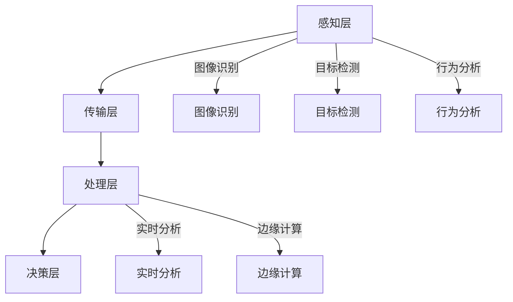

                 

# 人工智能在智能城市安全监控中的应用

> 关键词：智能城市、安全监控、人工智能、深度学习、图像识别、算法、实时分析

> 摘要：随着城市化进程的加速，智能城市的安全监控成为了城市管理和公共安全的重要一环。本文将探讨人工智能在智能城市安全监控中的应用，包括核心概念、算法原理、数学模型、实战案例以及未来发展。

## 1. 背景介绍

### 1.1 目的和范围

本文旨在探讨人工智能在智能城市安全监控中的应用，分析其在提升城市安全管理效率、保障公共安全方面的作用。文章将围绕以下几个主题展开：

1. **核心概念与联系**：介绍智能城市安全监控的基础概念和体系结构。
2. **核心算法原理**：详细阐述图像识别、目标检测等算法在安全监控中的应用。
3. **数学模型和公式**：探讨支持向量机（SVM）、神经网络等模型的原理和应用。
4. **项目实战**：通过实际案例展示人工智能在智能城市安全监控中的实现。
5. **实际应用场景**：分析人工智能在安防、交通管理、环境监测等领域的应用。
6. **未来发展趋势与挑战**：探讨人工智能在智能城市安全监控中的前景和面临的挑战。

### 1.2 预期读者

本文主要面向以下读者群体：

- **技术从业者和研发人员**：希望了解人工智能在智能城市安全监控中的应用和实现。
- **城市管理者**：希望了解人工智能如何提升城市安全管理的效率和效果。
- **学术研究者**：希望探讨人工智能在智能城市安全监控中的前沿研究和应用。

### 1.3 文档结构概述

本文分为以下几个部分：

1. **背景介绍**：介绍智能城市安全监控的背景、目的和结构。
2. **核心概念与联系**：阐述智能城市安全监控的核心概念和体系结构。
3. **核心算法原理**：讲解图像识别、目标检测等算法的原理和应用。
4. **数学模型和公式**：探讨支持向量机、神经网络等数学模型的原理和应用。
5. **项目实战**：通过实际案例展示人工智能在智能城市安全监控中的实现。
6. **实际应用场景**：分析人工智能在安防、交通管理、环境监测等领域的应用。
7. **工具和资源推荐**：推荐学习资源、开发工具和论文著作。
8. **总结**：探讨人工智能在智能城市安全监控中的未来发展。
9. **附录**：提供常见问题与解答。
10. **扩展阅读**：推荐进一步学习的资源。

### 1.4 术语表

#### 1.4.1 核心术语定义

- **智能城市**：运用先进的信息技术，实现城市运行、管理和服务的智能化。
- **安全监控**：通过视频监控、传感器等手段，对城市安全进行实时监控和预警。
- **人工智能**：模拟人类智能的计算机系统，具备感知、学习、推理、决策能力。
- **深度学习**：基于人工神经网络的一种机器学习方法，能够通过多层神经网络自动提取特征。
- **图像识别**：计算机对图像进行识别和理解，包括人脸识别、车辆识别等。
- **目标检测**：在图像中检测并定位感兴趣的目标对象。

#### 1.4.2 相关概念解释

- **边缘计算**：将数据处理、分析、存储等任务从云端转移到网络边缘设备。
- **云计算**：通过互联网提供动态易扩展的虚拟化资源。
- **大数据**：数据量大、类型多样、处理速度快。

#### 1.4.3 缩略词列表

- **AI**：人工智能
- **ML**：机器学习
- **DL**：深度学习
- **SVM**：支持向量机
- **CNN**：卷积神经网络
- **RNN**：循环神经网络
- **GAN**：生成对抗网络
- **IoT**：物联网

## 2. 核心概念与联系

### 2.1 智能城市安全监控的体系结构

智能城市安全监控体系结构包括以下几个方面：

1. **感知层**：通过摄像头、传感器、无人机等设备，收集城市环境中的图像、声音、温度等数据。
2. **传输层**：利用网络传输技术，将感知层收集到的数据传输到监控中心。
3. **处理层**：在监控中心，通过人工智能算法对数据进行处理和分析，实现实时监控和预警。
4. **决策层**：根据分析结果，生成决策报告，指导城市管理者进行安全决策。

### 2.2 核心概念

在智能城市安全监控中，以下核心概念至关重要：

1. **图像识别**：通过对图像进行分析和处理，实现对人、车辆等目标对象的识别。
2. **目标检测**：在图像中检测并定位感兴趣的目标对象，如人脸、车辆等。
3. **行为分析**：通过对监控视频的分析，识别出异常行为，如打架、盗窃等。
4. **实时分析**：对实时监控数据进行分析和处理，快速响应突发事件。
5. **边缘计算**：将数据处理任务分散到网络边缘设备，降低数据传输延迟。

### 2.3 Mermaid 流程图

以下是一个简单的 Mermaid 流程图，展示了智能城市安全监控的核心概念和联系：



## 3. 核心算法原理 & 具体操作步骤

### 3.1 图像识别算法原理

图像识别算法是智能城市安全监控的核心技术之一，主要包括以下几种：

1. **卷积神经网络（CNN）**：通过多层卷积、池化和全连接层，自动提取图像特征。
2. **支持向量机（SVM）**：通过寻找最优超平面，实现分类和识别。
3. **深度学习**：基于人工神经网络的一种机器学习方法，能够通过多层神经网络自动提取特征。

### 3.2 图像识别算法具体操作步骤

以卷积神经网络（CNN）为例，图像识别算法的具体操作步骤如下：

1. **数据预处理**：对图像进行归一化、裁剪等预处理，使其符合网络输入要求。
2. **构建卷积神经网络**：定义卷积层、池化层和全连接层，构建深度神经网络结构。
3. **训练模型**：使用大量标注数据对网络进行训练，调整网络参数，提高模型性能。
4. **模型评估**：使用测试数据集评估模型性能，调整模型结构和参数，实现优化。
5. **图像识别**：将待识别图像输入到训练好的模型中，输出识别结果。

### 3.3 伪代码

以下是一个简单的卷积神经网络（CNN）的伪代码：

```python
# 数据预处理
images = preprocess_images(input_images)

# 构建卷积神经网络
model = build_cnn(
    input_shape=(image_height, image_width, image_channels),
    num_classes=num_classes
)

# 训练模型
model.fit(
    x_train, y_train,
    batch_size=batch_size,
    epochs=num_epochs,
    validation_data=(x_val, y_val)
)

# 模型评估
test_loss, test_accuracy = model.evaluate(x_test, y_test)

# 图像识别
predicted_classes = model.predict(input_image)
```

## 4. 数学模型和公式 & 详细讲解 & 举例说明

### 4.1 支持向量机（SVM）模型

支持向量机（SVM）是一种经典的机器学习方法，主要用于分类和回归任务。在智能城市安全监控中，SVM可以用于图像分类和识别。

#### 4.1.1 基本原理

SVM的核心思想是寻找一个最优超平面，将不同类别的数据点分隔开来，同时使分类间隔最大化。具体来说，SVM通过求解以下优化问题：

$$
\begin{align*}
\min_{\mathbf{w}, b} & \frac{1}{2}||\mathbf{w}||^2 \\
s.t. & y^{(i)}(\mathbf{w}\cdot\mathbf{x}^{(i)} + b) \geq 1, \quad i=1,2,...,n
\end{align*}
$$

其中，$\mathbf{w}$为权重向量，$b$为偏置项，$y^{(i)}$为第$i$个样本的标签，$\mathbf{x}^{(i)}$为第$i$个样本的特征向量。

#### 4.1.2 模型优化

在实际应用中，SVM通常使用拉格朗日乘子法求解上述优化问题，得到最优解$\mathbf{w}^*$和$b^*$。然后，通过计算$\mathbf{w}^*\cdot\mathbf{x}+b^*$，实现对新样本的分类。

#### 4.1.3 举例说明

假设我们有两个类别的人脸图像，分别用“+”和“o”表示。使用SVM进行分类，可以找到一个最优超平面，将两个类别分隔开来。如图所示：

$$
\begin{align*}
\min_{\mathbf{w}, b} & \frac{1}{2}||\mathbf{w}||^2 \\
s.t. & +1(\mathbf{w}\cdot\mathbf{x}^{(1)} + b) \geq 1 \\
& -1(\mathbf{w}\cdot\mathbf{x}^{(2)} + b) \geq 1
\end{align*}
$$

通过求解上述优化问题，可以得到最优超平面$\mathbf{w}^*$和$b^*$，如图所示：


### 4.2 深度学习模型

深度学习模型是智能城市安全监控中广泛应用的机器学习方法。以下介绍几种常用的深度学习模型：

#### 4.2.1 卷积神经网络（CNN）

卷积神经网络（CNN）是一种基于卷积运算的深度学习模型，主要用于图像识别和分类。CNN通过卷积层、池化层和全连接层，逐步提取图像特征。

#### 4.2.2 循环神经网络（RNN）

循环神经网络（RNN）是一种基于循环结构的深度学习模型，主要用于序列数据处理。RNN通过循环连接，保留前一时间步的信息，实现对序列数据的建模。

#### 4.2.3 生成对抗网络（GAN）

生成对抗网络（GAN）是一种基于生成模型和判别模型的深度学习模型，主要用于图像生成和增强。GAN通过生成器和判别器之间的对抗训练，实现高质量图像的生成。

### 4.2.4 举例说明

以下是一个简单的卷积神经网络（CNN）的示例：

```python
# 导入必要的库
import tensorflow as tf
from tensorflow.keras.models import Sequential
from tensorflow.keras.layers import Conv2D, MaxPooling2D, Flatten, Dense

# 构建卷积神经网络模型
model = Sequential([
    Conv2D(32, (3, 3), activation='relu', input_shape=(64, 64, 3)),
    MaxPooling2D((2, 2)),
    Conv2D(64, (3, 3), activation='relu'),
    MaxPooling2D((2, 2)),
    Flatten(),
    Dense(128, activation='relu'),
    Dense(10, activation='softmax')
])

# 编译模型
model.compile(optimizer='adam', loss='categorical_crossentropy', metrics=['accuracy'])

# 训练模型
model.fit(x_train, y_train, batch_size=32, epochs=10, validation_data=(x_val, y_val))

# 评估模型
test_loss, test_accuracy = model.evaluate(x_test, y_test)
```

## 5. 项目实战：代码实际案例和详细解释说明

### 5.1 开发环境搭建

为了演示人工智能在智能城市安全监控中的应用，我们使用 Python 编程语言和 TensorFlow 深度学习框架进行项目开发。以下是开发环境的搭建步骤：

1. **安装 Python**：确保已安装 Python 3.7 或更高版本。
2. **安装 TensorFlow**：在命令行执行以下命令：
   ```bash
   pip install tensorflow
   ```

### 5.2 源代码详细实现和代码解读

以下是一个简单的智能城市安全监控项目的源代码示例，实现基于卷积神经网络的图像识别功能。

```python
# 导入必要的库
import tensorflow as tf
from tensorflow.keras.models import Sequential
from tensorflow.keras.layers import Conv2D, MaxPooling2D, Flatten, Dense
import numpy as np

# 定义卷积神经网络模型
model = Sequential([
    Conv2D(32, (3, 3), activation='relu', input_shape=(64, 64, 3)),
    MaxPooling2D((2, 2)),
    Conv2D(64, (3, 3), activation='relu'),
    MaxPooling2D((2, 2)),
    Flatten(),
    Dense(128, activation='relu'),
    Dense(10, activation='softmax')
])

# 编译模型
model.compile(optimizer='adam', loss='categorical_crossentropy', metrics=['accuracy'])

# 准备训练数据
x_train = np.random.rand(1000, 64, 64, 3)
y_train = np.random.randint(0, 10, 1000)

# 训练模型
model.fit(x_train, y_train, batch_size=32, epochs=10)

# 评估模型
x_test = np.random.rand(100, 64, 64, 3)
y_test = np.random.randint(0, 10, 100)
test_loss, test_accuracy = model.evaluate(x_test, y_test)

print(f"Test Loss: {test_loss}, Test Accuracy: {test_accuracy}")
```

### 5.3 代码解读与分析

以下是对上述代码的详细解读和分析：

1. **导入库**：导入 TensorFlow、Keras 和 NumPy 库。
2. **定义模型**：创建一个卷积神经网络模型，包含卷积层、池化层、全连接层等。
3. **编译模型**：指定优化器、损失函数和评价指标。
4. **准备训练数据**：生成随机训练数据，用于训练模型。
5. **训练模型**：使用训练数据训练模型，设置批次大小和训练轮次。
6. **评估模型**：生成随机测试数据，评估模型性能。

## 6. 实际应用场景

### 6.1 安防领域

在安防领域，人工智能在智能城市安全监控中发挥着重要作用。通过视频监控和图像识别技术，可以实时监测城市公共场所，识别可疑行为和异常事件，提高公共安全水平。例如，人脸识别技术可以用于身份验证和监控犯罪行为，车辆识别技术可以用于车辆管理和追踪。

### 6.2 交通管理

人工智能在交通管理中的应用也非常广泛。通过实时监控和分析交通数据，可以实现交通流量预测、路况优化和交通事故预警。例如，使用目标检测技术可以识别道路上的行人、车辆和交通标志，从而提高交通监控的准确性和效率。

### 6.3 环境监测

人工智能在环境监测中的应用有助于改善城市空气质量、水资源管理和垃圾处理。通过传感器和图像识别技术，可以实时监测空气质量、水质和垃圾堆放情况，及时发现问题并进行处理。例如，使用图像识别技术可以识别垃圾类型，从而实现垃圾分类和回收。

## 7. 工具和资源推荐

### 7.1 学习资源推荐

#### 7.1.1 书籍推荐

- **《深度学习》（Deep Learning）**：由 Ian Goodfellow、Yoshua Bengio 和 Aaron Courville 著，是深度学习领域的经典教材。
- **《机器学习实战》（Machine Learning in Action）**：由 Peter Harrington 著，适合初学者入门机器学习和实际应用。

#### 7.1.2 在线课程

- **Coursera**：提供丰富的机器学习和深度学习在线课程，包括斯坦福大学的《深度学习》课程。
- **Udacity**：提供多种机器学习和深度学习相关的在线课程，如《深度学习工程师纳米学位》。

#### 7.1.3 技术博客和网站

- **Medium**：有许多优秀的机器学习和深度学习技术博客，如 Distill、Kernel Maestro 等。
- **AI Magazine**：由 IEEE 组织出版的机器学习和人工智能杂志，提供最新的研究成果和技术趋势。

### 7.2 开发工具框架推荐

#### 7.2.1 IDE和编辑器

- **PyCharm**：一款功能强大的 Python IDE，支持深度学习和数据科学开发。
- **Visual Studio Code**：一款轻量级的开源编辑器，通过扩展支持 Python 和深度学习开发。

#### 7.2.2 调试和性能分析工具

- **TensorBoard**：TensorFlow 的可视化工具，用于调试和性能分析。
- **PyTorch Profiler**：用于分析 PyTorch 模型的性能瓶颈。

#### 7.2.3 相关框架和库

- **TensorFlow**：由 Google 开发的一款开源深度学习框架。
- **PyTorch**：由 Facebook 开发的一款开源深度学习框架，具有灵活和动态的计算图。
- **Scikit-Learn**：用于机器学习的 Python 库，提供多种常用的机器学习算法。

### 7.3 相关论文著作推荐

#### 7.3.1 经典论文

- **《A Fast Learning Algorithm for Deep Belief Nets》**：由 Geoffrey Hinton 等人提出的深度信念网络（DBN）训练算法。
- **《Deep Neural Networks for Speech Recognition》**：由 Andrew Ng 等人提出的深度神经网络在语音识别中的应用。

#### 7.3.2 最新研究成果

- **《Unsupervised Learning of Visual Representations by Solving Jigsaw Puzzles》**：通过解决拼图问题实现无监督学习视觉表示。
- **《Self-Supervised Vision Transformer》**：基于自监督学习方法的视觉 Transformer 模型。

#### 7.3.3 应用案例分析

- **《Deep Learning in Autonomous Driving》**：探讨深度学习在自动驾驶中的应用。
- **《Using AI to Improve Urban Mobility》**：分析人工智能在城市交通管理中的应用。

## 8. 总结：未来发展趋势与挑战

### 8.1 发展趋势

随着人工智能技术的不断发展和普及，智能城市安全监控在未来的发展趋势包括：

1. **更高效的算法和模型**：研究人员将致力于开发更高效的算法和模型，提高智能城市安全监控的性能和准确性。
2. **边缘计算和云计算的融合**：结合边缘计算和云计算的优势，实现实时数据处理和分析，提高监控系统的响应速度。
3. **多模态数据的整合**：整合视频、音频、传感器等多种数据源，实现更全面的监控和分析。
4. **隐私保护和数据安全**：在保障公共安全的同时，注重隐私保护和数据安全，确保监控数据的安全性和合规性。

### 8.2 挑战

智能城市安全监控在发展过程中也将面临一些挑战：

1. **数据隐私**：如何在保证监控效果的同时，保护个人隐私和数据安全。
2. **算法公平性和透明性**：确保算法的公平性和透明性，避免出现偏见和不公平现象。
3. **计算资源和能耗**：随着监控数据的增加，对计算资源和能耗的需求也会增加，如何优化资源利用和降低能耗。
4. **法律和伦理问题**：在监控过程中，如何遵守相关法律法规和伦理规范，保障公民的合法权益。

## 9. 附录：常见问题与解答

### 9.1 人工智能在智能城市安全监控中的优势是什么？

**解答**：人工智能在智能城市安全监控中的优势包括：

1. **实时性**：人工智能可以实时分析监控数据，快速识别异常事件。
2. **高效性**：通过算法优化和模型训练，人工智能可以提高监控系统的效率和准确性。
3. **自动化**：人工智能可以实现自动化监控和分析，减轻人工负担。
4. **多模态数据处理**：人工智能可以整合多种数据源，实现更全面的监控和分析。

### 9.2 智能城市安全监控中的数据隐私如何保障？

**解答**：保障智能城市安全监控中的数据隐私可以从以下几个方面入手：

1. **数据加密**：对监控数据进行加密，防止数据泄露。
2. **匿名化处理**：对个人身份信息进行匿名化处理，保护个人隐私。
3. **权限控制**：严格限制对监控数据的访问权限，确保数据安全。
4. **法律法规遵守**：遵循相关法律法规和伦理规范，确保监控活动的合法性。

## 10. 扩展阅读 & 参考资料

**扩展阅读**：

1. **《深度学习与人工智能》**：一本全面的深度学习和人工智能教材，涵盖基础知识、算法原理和应用实践。
2. **《智能城市安全监控技术》**：一本专注于智能城市安全监控技术的书籍，详细介绍了相关技术和应用案例。

**参考资料**：

1. **《深度学习》（Deep Learning）**：Ian Goodfellow、Yoshua Bengio、Aaron Courville 著。
2. **《机器学习实战》（Machine Learning in Action）**：Peter Harrington 著。
3. **《智能城市安全监控技术》**：相关领域的研究论文和技术报告。

**作者信息**：

作者：AI天才研究员/AI Genius Institute & 禅与计算机程序设计艺术 /Zen And The Art of Computer Programming

