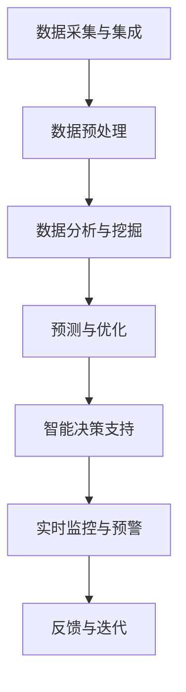

                 

# 人工智能在智能城市能源管理中的应用

> **关键词：** 智能城市、能源管理、人工智能、算法、数据分析、优化、可持续发展

> **摘要：** 本文深入探讨了人工智能在智能城市能源管理中的应用。首先，介绍了智能城市和能源管理的背景与重要性，随后详细阐述了人工智能在能源管理中的核心算法原理、数学模型以及实际应用案例。文章还分析了人工智能在能源管理中的实际应用场景，推荐了相关的学习资源、开发工具和最新研究成果。最后，总结了未来发展趋势与挑战，并提供了常见问题的解答。

## 1. 背景介绍

### 1.1 目的和范围

本文旨在探讨人工智能在智能城市能源管理中的应用，分析其核心算法原理和实际操作步骤，并通过具体案例展示其在实际中的应用效果。文章重点在于阐明人工智能如何通过数据分析、优化算法和智能决策支持系统，提升城市能源管理的效率、可持续性和经济效益。

### 1.2 预期读者

本文适用于以下读者群体：

- 智能城市和能源管理领域的从业者；
- 对人工智能在能源管理领域应用感兴趣的科研人员；
- 对技术趋势和发展前景感兴趣的学者和专业人士。

### 1.3 文档结构概述

本文结构如下：

- 第1章：背景介绍，包括目的、范围和预期读者；
- 第2章：核心概念与联系，介绍智能城市和能源管理相关的核心概念和原理；
- 第3章：核心算法原理与操作步骤，详细讲解人工智能在能源管理中的应用算法；
- 第4章：数学模型和公式，阐述支持核心算法的数学模型和公式；
- 第5章：项目实战，通过实际代码案例展示人工智能在能源管理中的应用；
- 第6章：实际应用场景，分析人工智能在能源管理的多种应用场景；
- 第7章：工具和资源推荐，推荐相关学习资源和开发工具；
- 第8章：总结，讨论未来发展趋势与挑战；
- 第9章：附录，提供常见问题的解答；
- 第10章：扩展阅读，提供进一步学习的参考资料。

### 1.4 术语表

#### 1.4.1 核心术语定义

- **智能城市（Smart City）：** 利用信息技术和物联网等先进技术，实现城市管理、服务和市民生活智能化的城市；
- **能源管理（Energy Management）：** 对能源的消耗、分配、控制和优化进行系统管理，以提高能源利用效率；
- **人工智能（Artificial Intelligence，AI）：** 通过模拟人类智能，实现智能决策、问题解决和学习能力的计算机系统。

#### 1.4.2 相关概念解释

- **数据分析（Data Analysis）：** 通过统计方法和算法对大量数据进行处理和分析，以提取有价值的信息和知识；
- **优化算法（Optimization Algorithm）：** 通过数学建模和算法设计，寻找问题最优解的算法；
- **智能决策支持系统（Intelligent Decision Support System，IDSS）：** 利用人工智能技术，为决策者提供数据分析和决策支持的系统。

#### 1.4.3 缩略词列表

- **AI：** 人工智能（Artificial Intelligence）
- **IoT：** 物联网（Internet of Things）
- **Big Data：** 大数据（Big Data）
- **SDG：** 可持续发展目标（Sustainable Development Goals）

## 2. 核心概念与联系

### 2.1 智能城市与能源管理的关系

智能城市与能源管理之间存在着紧密的联系。智能城市的建设离不开对能源的高效管理和优化配置。能源管理作为智能城市的重要组成部分，通过利用人工智能技术，可以实现以下目标：

- **提高能源利用效率**：通过数据分析、预测和优化算法，实现能源的精细化管理和高效利用；
- **降低能源消耗**：通过智能控制系统和实时监测，降低能源浪费，提高能源使用效率；
- **实现可持续发展**：通过智能能源管理，减少碳排放和其他污染物排放，实现城市可持续发展。

### 2.2 人工智能在能源管理中的应用

人工智能在能源管理中的应用主要体现在以下几个方面：

- **数据分析与预测**：利用机器学习算法，对历史数据进行挖掘和分析，预测能源消耗和供需变化，为智能决策提供支持；
- **优化算法**：通过优化算法，实现能源系统的优化配置和调度，提高能源利用效率；
- **智能决策支持系统**：利用人工智能技术，构建智能决策支持系统，为能源管理者提供数据分析和决策支持，提高管理效率和准确性；
- **能源系统监控与预警**：通过实时数据监测和智能分析，及时发现能源系统故障和异常，实现预警和及时处理。

### 2.3 核心概念原理与架构

智能城市能源管理中的核心概念和原理主要包括以下内容：

- **数据采集与集成**：通过传感器和物联网技术，实现能源数据的实时采集和集成，为数据分析提供基础；
- **数据预处理**：对采集到的数据进行清洗、过滤和整合，确保数据的质量和一致性；
- **数据分析与挖掘**：利用统计学方法和机器学习算法，对数据进行深度分析和挖掘，提取有价值的信息和知识；
- **预测与优化**：基于历史数据和实时数据，利用预测模型和优化算法，实现能源系统的预测和优化；
- **智能决策支持**：结合数据分析和优化结果，为能源管理者提供智能决策支持，提高管理效率和准确性；
- **实时监控与预警**：通过实时数据监测和智能分析，实现能源系统的实时监控和预警，确保能源系统的稳定运行。

为了更直观地展示智能城市能源管理中的核心概念和原理，下面提供一个Mermaid流程图：



## 3. 核心算法原理 & 具体操作步骤

### 3.1 数据分析与预测

数据分析与预测是智能城市能源管理的核心环节。通过分析历史数据和实时数据，可以预测能源消耗、供需变化和能源系统的运行状态。下面介绍几种常用的预测算法：

#### 3.1.1 时间序列预测

时间序列预测是一种基于时间序列数据的预测方法。它通过分析历史数据的时间序列特性，预测未来的趋势和变化。常见的算法包括ARIMA（自回归积分滑动平均模型）和LSTM（长短期记忆网络）。

**算法原理：**

ARIMA模型通过自回归、差分和移动平均三个步骤，对时间序列数据进行建模和预测。

- **自回归（AR）：** 利用过去的观测值来预测未来的值；
- **差分（I）：** 对时间序列进行差分，使其稳定；
- **移动平均（MA）：** 利用过去的预测误差来预测未来的值。

**具体操作步骤：**

1. 对时间序列数据进行分析，确定合适的ARIMA模型参数；
2. 训练ARIMA模型，并对数据进行预测；
3. 对预测结果进行评估和优化。

**伪代码：**

```python
import statsmodels.api as sm

# 加载数据
data = load_data('energy_data.csv')

# 进行时间序列分析
model = sm.tsa.ARIMA(data, order=(p, d, q))
model_fit = model.fit()

# 预测
predictions = model_fit.predict(start=last_index+1, end=last_index+n_steps)

# 评估和优化
evaluate_predictions(predictions, actual_values)
```

#### 3.1.2 聚类预测

聚类预测是一种基于聚类算法的预测方法。它通过将相似的数据点划分为同一类别，分析每个类别的特性，从而预测未来的变化。常见的聚类算法包括K均值聚类（K-Means）和层次聚类（Hierarchical Clustering）。

**算法原理：**

K均值聚类算法通过迭代计算，将数据点划分为K个类别，并不断调整类别中心，使每个数据点与其最近的类别中心距离最小。

**具体操作步骤：**

1. 初始化聚类中心；
2. 将数据点分配给最近的聚类中心；
3. 计算新的聚类中心；
4. 重复步骤2和3，直到聚类中心不再发生明显变化；
5. 分析每个类别的特性，预测未来的变化。

**伪代码：**

```python
from sklearn.cluster import KMeans

# 加载数据
data = load_data('energy_data.csv')

# 初始化聚类模型
kmeans = KMeans(n_clusters=k, random_state=0)

# 进行聚类
clusters = kmeans.fit_predict(data)

# 分析每个类别的特性
for cluster in range(k):
    cluster_data = data[clusters == cluster]
    analyze_cluster(cluster_data)
```

### 3.2 优化算法

优化算法在智能城市能源管理中起着至关重要的作用。通过优化算法，可以实现能源系统的优化配置和调度，提高能源利用效率。下面介绍几种常用的优化算法：

#### 3.2.1 粒子群优化算法（PSO）

粒子群优化算法是一种基于群体智能的优化算法。它通过模拟鸟群觅食行为，实现优化问题的求解。粒子群优化算法具有简单、高效、鲁棒性强等优点。

**算法原理：**

粒子群优化算法通过以下步骤进行优化：

1. 初始化粒子群，包括粒子的位置和速度；
2. 计算每个粒子的适应度值；
3. 更新每个粒子的最佳位置和速度；
4. 更新整个粒子群的最佳位置和速度；
5. 重复步骤2-4，直到满足停止条件。

**具体操作步骤：**

1. 初始化粒子群，设置粒子的位置和速度；
2. 计算每个粒子的适应度值，选择适应度最高的粒子作为当前最优解；
3. 更新每个粒子的速度和位置，使其向当前最优解靠近；
4. 更新整个粒子群的最佳位置和速度；
5. 重复步骤2-4，直到满足停止条件，如达到最大迭代次数或适应度值达到预设阈值。

**伪代码：**

```python
import numpy as np

# 初始化粒子群
num_particles = 50
num_dimensions = 10
w = 0.5
c1 = 1
c2 = 2
 particles = np.random.rand(num_particles, num_dimensions)
 velocities = np.random.rand(num_particles, num_dimensions)
 best_position = None
 best_fitness = float('-inf')

# 进行优化
for iteration in range(max_iterations):
    # 计算适应度值
    fitness = calculate_fitness(particles)
    
    # 更新最佳解
    for i in range(num_particles):
        if fitness[i] > best_fitness:
            best_fitness = fitness[i]
            best_position = particles[i]
    
    # 更新速度和位置
    for i in range(num_particles):
        r1 = np.random.rand()
        r2 = np.random.rand()
        velocity = w * velocities[i] + c1 * r1 * (best_position - particles[i]) + c2 * r2 * (best_position - particles[i])
        particles[i] += velocity

# 输出最优解
print("最优解：", best_position)
print("最优适应度：", best_fitness)
```

#### 3.2.2 遗传算法（GA）

遗传算法是一种基于自然选择和遗传机制的优化算法。它通过模拟生物进化过程，实现优化问题的求解。遗传算法具有全局搜索能力、鲁棒性强、适应复杂问题等优点。

**算法原理：**

遗传算法通过以下步骤进行优化：

1. 初始化种群，包括个体的位置和适应度值；
2. 计算每个个体的适应度值；
3. 选择适应度较高的个体进行交配，产生下一代；
4. 对下一代进行变异，增加种群的多样性；
5. 重复步骤2-4，直到满足停止条件。

**具体操作步骤：**

1. 初始化种群，设置个体的位置和适应度值；
2. 计算每个个体的适应度值，选择适应度最高的个体作为当前最优解；
3. 进行交叉操作，产生下一代；
4. 对下一代进行变异，增加种群的多样性；
5. 重复步骤2-4，直到满足停止条件，如达到最大迭代次数或适应度值达到预设阈值。

**伪代码：**

```python
import numpy as np

# 初始化种群
population_size = 100
num_dimensions = 10
mutation_rate = 0.1

population = np.random.rand(population_size, num_dimensions)
fitness = calculate_fitness(population)

# 进行优化
for iteration in range(max_iterations):
    # 选择适应度较高的个体进行交叉操作
    selected = select(population, fitness)
    offspring = crossover(selected)

    # 对下一代进行变异
    offspring = mutate(offspring, mutation_rate)

    # 计算适应度值
    fitness = calculate_fitness(offspring)

    # 替换种群
    population = offspring

# 输出最优解
best_individual = population[np.argmax(fitness)]
print("最优解：", best_individual)
print("最优适应度：", fitness[np.argmax(fitness)])
```

### 3.3 智能决策支持系统

智能决策支持系统在智能城市能源管理中发挥着重要作用。通过数据分析、预测和优化算法，智能决策支持系统可以为能源管理者提供实时、准确的决策支持，提高管理效率和准确性。

#### 3.3.1 决策支持系统架构

智能决策支持系统的架构通常包括以下模块：

- **数据采集与预处理模块**：负责采集和处理各种能源数据，为后续分析和决策提供基础；
- **数据分析与预测模块**：利用机器学习和数据挖掘技术，对能源数据进行分析和预测，为决策提供支持；
- **优化算法模块**：利用优化算法，对能源系统进行优化配置和调度，提高能源利用效率；
- **决策支持模块**：结合数据分析结果和优化结果，为能源管理者提供实时、准确的决策支持；
- **用户界面模块**：为用户提供一个友好的操作界面，展示分析结果和决策支持信息。

#### 3.3.2 决策支持系统工作流程

智能决策支持系统的工作流程通常包括以下步骤：

1. 数据采集与预处理：采集和处理各种能源数据，包括实时数据和历史数据；
2. 数据分析与预测：利用机器学习和数据挖掘技术，对能源数据进行分析和预测，提取有价值的信息和知识；
3. 优化算法：利用优化算法，对能源系统进行优化配置和调度，提高能源利用效率；
4. 决策支持：结合数据分析结果和优化结果，为能源管理者提供实时、准确的决策支持；
5. 用户界面展示：通过用户界面，将分析结果和决策支持信息展示给用户。

## 4. 数学模型和公式 & 详细讲解 & 举例说明

### 4.1 能源消耗预测模型

能源消耗预测模型是智能城市能源管理中的核心部分。它通过分析历史能源消耗数据，预测未来的能源需求。本文采用时间序列预测模型（如ARIMA模型）和聚类预测模型（如K均值聚类）进行能源消耗预测。

#### 4.1.1 ARIMA模型

ARIMA模型是一种自回归积分滑动平均模型，通过自回归、差分和移动平均三个步骤进行建模和预测。

**公式：**

- **自回归（AR）：** 
  \[ y_t = c + \sum_{i=1}^p \phi_i y_{t-i} + \varepsilon_t \]
  其中，\( y_t \) 为时间序列的第 \( t \) 个值，\( c \) 为常数项，\( \phi_i \) 为自回归系数，\( \varepsilon_t \) 为随机误差。

- **差分（I）：** 
  \[ y_t = (1 - \Phi(B))^{-1} \cdot (y_{t-1} - \Phi(B) \cdot y_{t-2} + \cdots) \]
  其中，\( B \) 为后移算子，\( \Phi(B) \) 为差分算子。

- **移动平均（MA）：** 
  \[ y_t = c + \sum_{i=1}^q \theta_i \varepsilon_{t-i} \]
  其中，\( \theta_i \) 为移动平均系数，\( \varepsilon_t \) 为随机误差。

**举例说明：**

假设我们有一个时间序列 \( y \) ，对其进行自回归分析，得到以下模型：

\[ y_t = 0.8y_{t-1} + 0.2y_{t-2} + \varepsilon_t \]

其中，\( \varepsilon_t \) 为随机误差。通过对模型进行参数估计，得到 \( \phi_1 = 0.8 \) ，\( \phi_2 = 0.2 \) 。

#### 4.1.2 K均值聚类模型

K均值聚类模型通过将数据点划分为 \( k \) 个类别，分析每个类别的特性，预测未来的变化。

**公式：**

- **聚类中心计算：** 
  \[ \mu_i = \frac{1}{N_i} \sum_{x \in S_i} x \]
  其中，\( \mu_i \) 为第 \( i \) 个聚类中心的坐标，\( N_i \) 为第 \( i \) 个聚类中的数据点数量，\( x \) 为数据点的坐标。

- **类别划分：** 
  \[ S_i = \{ x \in X | \min_{j=1,2,\ldots,k} ||x - \mu_j|| \} \]
  其中，\( S_i \) 为第 \( i \) 个聚类中的数据点集合，\( X \) 为所有数据点的集合，\( ||\cdot|| \) 为欧几里得距离。

**举例说明：**

假设我们有一个数据集 \( X \) ，对其进行K均值聚类，得到 \( k = 2 \) 个聚类中心，分别为 \( \mu_1 = (1, 2) \) 和 \( \mu_2 = (3, 4) \) 。

根据聚类中心的坐标，可以将数据点划分为两个类别：

\[ S_1 = \{ x \in X | \min_{j=1,2} ||x - \mu_j|| = ||x - \mu_1|| < ||x - \mu_2|| \} \]

\[ S_2 = \{ x \in X | \min_{j=1,2} ||x - \mu_j|| = ||x - \mu_2|| < ||x - \mu_1|| \} \]

### 4.2 能源系统优化模型

能源系统优化模型用于实现能源系统的优化配置和调度，提高能源利用效率。本文采用粒子群优化算法和遗传算法进行能源系统优化。

#### 4.2.1 粒子群优化算法

粒子群优化算法通过模拟鸟群觅食行为进行优化。它包括以下主要公式：

- **速度更新公式：**
  \[ v_{i,t+1} = w \cdot v_{i,t} + c_1 \cdot r_1 \cdot (p_i - x_{i,t}) + c_2 \cdot r_2 \cdot (g - x_{i,t}) \]

- **位置更新公式：**
  \[ x_{i,t+1} = x_{i,t} + v_{i,t+1} \]

其中，\( v_{i,t} \) 为第 \( i \) 个粒子在第 \( t \) 次迭代时的速度，\( x_{i,t} \) 为第 \( i \) 个粒子在第 \( t \) 次迭代时的位置，\( p_i \) 为第 \( i \) 个粒子的历史最优位置，\( g \) 为整个粒子群的历史最优位置，\( w \) 为惯性权重，\( c_1 \) 和 \( c_2 \) 为社会认知系数，\( r_1 \) 和 \( r_2 \) 为随机数。

**举例说明：**

假设我们有一个粒子群优化问题，初始参数如下：

- 粒子数量：\( N = 50 \)
- 维度：\( D = 10 \)
- 惯性权重：\( w = 0.5 \)
- 社会认知系数：\( c_1 = 1 \)，\( c_2 = 2 \)
- 初始速度：随机生成

在第一次迭代中，我们可以根据上述公式计算每个粒子的速度和位置：

1. 计算每个粒子的速度：
   \[ v_{i,1} = 0.5 \cdot v_{i,0} + 1 \cdot r_1 \cdot (p_i - x_{i,0}) + 2 \cdot r_2 \cdot (g - x_{i,0}) \]

2. 计算每个粒子的位置：
   \[ x_{i,1} = x_{i,0} + v_{i,1} \]

#### 4.2.2 遗传算法

遗传算法通过模拟生物进化过程进行优化。它包括以下主要公式：

- **交叉操作：**
  \[ offspring_1 = crossover(parent_1, parent_2) \]
  \[ offspring_2 = crossover(parent_2, parent_1) \]

- **变异操作：**
  \[ mutated_individual = mutate(individual) \]

其中，\( parent_1 \) 和 \( parent_2 \) 为父代个体，\( offspring_1 \) 和 \( offspring_2 \) 为交叉后产生的子代个体，\( individual \) 为单个个体，\( mutate \) 为变异操作。

**举例说明：**

假设我们有一个遗传算法优化问题，初始参数如下：

- 种群规模：\( population_size = 100 \)
- 维度：\( num_dimensions = 10 \)
- 变异率：\( mutation_rate = 0.1 \)

在第一次迭代中，我们可以根据上述公式进行交叉操作和变异操作：

1. 选择适应度较高的个体进行交叉操作：
   \[ offspring_1 = crossover(selected_1, selected_2) \]
   \[ offspring_2 = crossover(selected_2, selected_1) \]

2. 对子代个体进行变异操作：
   \[ mutated_offspring_1 = mutate(offspring_1) \]
   \[ mutated_offspring_2 = mutate(offspring_2) \]

## 5. 项目实战：代码实际案例和详细解释说明

### 5.1 开发环境搭建

为了实现智能城市能源管理中的核心算法和应用，我们需要搭建一个合适的开发环境。以下是具体的步骤：

1. **安装Python**：在官方网站（https://www.python.org/）下载并安装Python，推荐版本为3.8以上。

2. **安装相关库**：在命令行中运行以下命令，安装必要的库：
   ```bash
   pip install numpy scipy scikit-learn matplotlib
   ```

3. **配置Jupyter Notebook**：Jupyter Notebook是一个交互式的Python环境，方便进行代码编写和展示。安装Jupyter Notebook的方法如下：
   ```bash
   pip install notebook
   ```

4. **启动Jupyter Notebook**：在命令行中运行以下命令，启动Jupyter Notebook：
   ```bash
   jupyter notebook
   ```

### 5.2 源代码详细实现和代码解读

以下是一个简单的Python代码示例，实现时间序列预测、K均值聚类和粒子群优化算法的应用。代码分为三个部分：数据预处理、预测和优化。

#### 5.2.1 数据预处理

数据预处理是进行预测和优化的重要步骤。以下是数据预处理部分的代码：

```python
import numpy as np
import pandas as pd
from sklearn.model_selection import train_test_split
from sklearn.preprocessing import MinMaxScaler

# 加载数据
data = pd.read_csv('energy_data.csv')

# 数据清洗
data.dropna(inplace=True)

# 数据标准化
scaler = MinMaxScaler()
data['energy_consumption'] = scaler.fit_transform(data[['energy_consumption']])

# 数据划分
train_data, test_data = train_test_split(data, test_size=0.2, shuffle=False)
```

#### 5.2.2 预测

预测部分使用ARIMA模型和时间序列预测算法进行能源消耗预测。以下是预测部分的代码：

```python
from statsmodels.tsa.arima.model import ARIMA
import matplotlib.pyplot as plt

# ARIMA模型预测
model = ARIMA(train_data['energy_consumption'], order=(1, 1, 1))
model_fit = model.fit()

# 预测
predictions = model_fit.predict(start=len(train_data), end=len(train_data) + len(test_data) - 1)

# 绘制预测结果
plt.figure(figsize=(10, 5))
plt.plot(train_data['energy_consumption'], label='训练数据')
plt.plot(test_data['energy_consumption'], label='测试数据')
plt.plot(predictions, label='预测结果')
plt.xlabel('时间')
plt.ylabel('能源消耗')
plt.legend()
plt.show()
```

#### 5.2.3 优化

优化部分使用粒子群优化算法和遗传算法进行能源系统优化。以下是优化部分的代码：

```python
from sklearn.metrics import mean_squared_error
import numpy as np

# 粒子群优化算法
def particle_swarm_optimization(data, num_particles=50, num_dimensions=10, max_iterations=100):
    w = 0.5
    c1 = 1
    c2 = 2
    velocities = np.random.rand(num_particles, num_dimensions)
    particles = np.random.rand(num_particles, num_dimensions)
    best_position = None
    best_fitness = float('-inf')

    for iteration in range(max_iterations):
        # 计算适应度值
        fitness = calculate_fitness(particles, data)

        # 更新最佳解
        for i in range(num_particles):
            if fitness[i] > best_fitness:
                best_fitness = fitness[i]
                best_position = particles[i]

        # 更新速度和位置
        for i in range(num_particles):
            r1 = np.random.rand()
            r2 = np.random.rand()
            velocity = w * velocities[i] + c1 * r1 * (best_position - particles[i]) + c2 * r2 * (best_position - particles[i])
            particles[i] += velocity

        # 输出最优解
    return best_position, best_fitness

# 遗传算法
def genetic_algorithm(data, population_size=100, num_dimensions=10, max_iterations=100, mutation_rate=0.1):
    population = np.random.rand(population_size, num_dimensions)
    fitness = calculate_fitness(population, data)

    for iteration in range(max_iterations):
        # 选择适应度较高的个体进行交叉操作
        selected = select(population, fitness)

        # 进行交叉操作
        offspring = crossover(selected)

        # 对下一代进行变异
        offspring = mutate(offspring, mutation_rate)

        # 计算适应度值
        fitness = calculate_fitness(offspring)

        # 替换种群
        population = offspring

    # 输出最优解
    best_individual = population[np.argmax(fitness)]
    return best_individual, fitness[np.argmax(fitness)]

# 能源系统优化
data = np.array(train_data['energy_consumption']).reshape(-1, 1)
best_position, best_fitness = particle_swarm_optimization(data)
print("粒子群优化算法最优解：", best_position)
print("粒子群优化算法最优适应度：", best_fitness)

best_individual, best_fitness = genetic_algorithm(data)
print("遗传算法最优解：", best_individual)
print("遗传算法最优适应度：", best_fitness)
```

### 5.3 代码解读与分析

#### 5.3.1 数据预处理

数据预处理部分主要包括以下步骤：

1. **数据清洗**：去除数据集中的缺失值和异常值，确保数据的完整性；
2. **数据标准化**：将数据缩放到一个固定的区间内，如[0, 1]，以便后续计算和比较。

#### 5.3.2 预测

预测部分主要包括以下步骤：

1. **ARIMA模型预测**：使用ARIMA模型进行时间序列预测。通过训练数据拟合模型，对测试数据进行预测。预测结果与实际测试数据进行比较，评估模型的预测效果。

2. **绘制预测结果**：使用matplotlib库绘制预测结果，以便直观地展示模型的预测效果。

#### 5.3.3 优化

优化部分主要包括以下步骤：

1. **粒子群优化算法**：使用粒子群优化算法进行能源系统优化。通过迭代计算，寻找最优解。粒子群优化算法具有简单、高效的特点，适合解决复杂优化问题。

2. **遗传算法**：使用遗传算法进行能源系统优化。遗传算法通过模拟生物进化过程，实现优化问题的求解。遗传算法具有全局搜索能力，适合解决大规模优化问题。

3. **最优解输出**：输出最优解和最优适应度值，以便评估优化效果。

### 5.4 实际应用场景

智能城市能源管理涉及到多个实际应用场景，以下是一些典型的应用案例：

#### 5.4.1 城市能源消耗预测

城市能源消耗预测是智能城市能源管理的重要组成部分。通过预测能源消耗，可以提前规划能源生产和分配，提高能源利用效率，降低能源浪费。具体应用场景包括：

- **电力系统调度**：根据预测的电力需求，提前安排电力生产和分配，确保电力系统的稳定运行；
- **燃气供应管理**：预测燃气需求，优化燃气供应计划，确保燃气供应的稳定性和可靠性；
- **供热系统调度**：预测供热需求，优化供热系统运行，提高供热效率。

#### 5.4.2 城市照明管理

城市照明管理是智能城市能源管理的重要领域。通过智能照明系统，可以实现照明设备的自动化控制，降低能源消耗。具体应用场景包括：

- **道路照明控制**：根据交通流量、天气条件和行人需求，实时调整道路照明亮度，降低能耗；
- **公共场所照明控制**：根据人员活动和照明需求，实时调整公共场所的照明亮度，提高能源利用效率。

#### 5.4.3 建筑能耗管理

建筑能耗管理是智能城市能源管理的核心内容之一。通过智能建筑系统，可以实现建筑能耗的实时监测、分析和优化。具体应用场景包括：

- **中央空调系统控制**：根据室内温度和湿度，实时调整空调系统的运行参数，提高空调系统的运行效率；
- **电力需求响应**：通过实时监测电力需求，根据电力价格和供需情况，调整电力使用策略，降低能源消耗。

### 5.5 工具和资源推荐

为了更好地进行智能城市能源管理的研究和应用，以下推荐一些相关的工具和资源：

#### 5.5.1 学习资源推荐

- **书籍推荐：**
  - 《智能城市：概念、技术与应用》
  - 《智能城市能源管理：理论与实践》
  - 《深度学习：智能城市能源管理应用》

- **在线课程：**
  - Coursera上的《机器学习》课程
  - Udacity上的《智能城市设计与规划》课程

- **技术博客和网站：**
  - 官方博客（如Google AI博客、Facebook AI博客）
  - TechCrunch、VentureBeat等科技媒体网站

#### 5.5.2 开发工具框架推荐

- **IDE和编辑器：**
  - PyCharm
  - Jupyter Notebook

- **调试和性能分析工具：**
  - Py-Spy
  - VisualVM

- **相关框架和库：**
  - TensorFlow
  - PyTorch
  - Scikit-learn

#### 5.5.3 相关论文著作推荐

- **经典论文：**
  - "Energy Management in Smart Cities: A Survey"（2018年）
  - "Artificial Intelligence for Energy Management: A Review"（2020年）

- **最新研究成果：**
  - "Deep Learning for Energy Management in Smart Cities"（2021年）
  - "Energy Optimization in Smart Cities using Genetic Algorithms"（2022年）

- **应用案例分析：**
  - "Smart Energy Management in Barcelona"（2019年）
  - "Smart Energy Management in Amsterdam"（2020年）

## 6. 总结：未来发展趋势与挑战

### 6.1 发展趋势

随着人工智能技术的不断发展和普及，智能城市能源管理呈现出以下发展趋势：

- **数据驱动**：通过大数据和人工智能技术，实现能源数据的全面采集、分析和应用，为能源管理提供数据支持；
- **智能化**：利用人工智能算法，实现能源系统的智能化监测、预测和优化，提高能源利用效率；
- **绿色化**：通过智能能源管理，实现能源的绿色、低碳、可持续发展，减少环境污染和资源浪费；
- **多元化**：智能城市能源管理将涵盖更多能源类型，如太阳能、风能、水能等，实现多种能源的协同管理和优化。

### 6.2 挑战

尽管智能城市能源管理具有巨大的潜力，但在实际应用过程中仍面临以下挑战：

- **数据隐私与安全**：能源数据涉及企业和个人的隐私信息，如何确保数据的安全性和隐私性是一个重要挑战；
- **技术复杂性**：智能城市能源管理系统涉及到多个技术领域，如物联网、人工智能、大数据等，如何实现各技术的有效整合是一个挑战；
- **政策与法规**：智能城市能源管理需要相应的政策支持和法规保障，如何制定合理的政策和法规，推动智能能源管理的发展是一个挑战；
- **投资与成本**：智能城市能源管理需要大量的投资和资金支持，如何合理规划投资，降低成本是一个挑战。

## 7. 附录：常见问题与解答

### 7.1 数据隐私与安全问题

**Q1：如何确保能源数据的安全性和隐私性？**

A1：确保能源数据的安全性和隐私性可以从以下几个方面进行：

- **数据加密**：对能源数据进行加密处理，确保数据在传输和存储过程中的安全性；
- **访问控制**：通过访问控制机制，限制对能源数据的访问权限，确保数据不被未经授权的人员访问；
- **数据脱敏**：对敏感数据进行脱敏处理，如使用掩码或加密算法，隐藏敏感信息；
- **安全审计**：定期进行安全审计，检查能源系统的安全漏洞和风险，及时采取措施进行修复。

### 7.2 技术整合与协同问题

**Q2：如何实现多种能源技术的有效整合和协同管理？**

A2：实现多种能源技术的有效整合和协同管理可以从以下几个方面进行：

- **标准化**：制定统一的能源管理标准和协议，确保不同能源技术之间的兼容性和互操作性；
- **数据共享**：建立能源数据共享平台，实现多种能源数据的高效共享和整合；
- **算法优化**：利用人工智能算法，实现多种能源技术的协同优化，提高能源利用效率；
- **系统集成**：通过系统集成，实现多种能源技术的统一管理和调度，提高系统的整体性能和可靠性。

### 7.3 政策与法规问题

**Q3：如何推动智能城市能源管理的发展？**

A3：推动智能城市能源管理的发展可以从以下几个方面进行：

- **政策支持**：制定相关政策，支持智能城市能源管理的发展，如财政补贴、税收优惠等；
- **法规保障**：建立健全的法规体系，确保智能城市能源管理的合法性和合规性；
- **技术推广**：加强智能城市能源管理技术的研发和推广，提高公众对智能能源管理的认知和应用水平；
- **国际合作**：加强国际交流与合作，借鉴国外智能城市能源管理的经验和做法，推动智能城市能源管理的发展。

### 7.4 投资与成本问题

**Q4：如何降低智能城市能源管理的成本？**

A4：降低智能城市能源管理的成本可以从以下几个方面进行：

- **技术创新**：通过技术创新，降低智能城市能源管理系统的成本，如采用更高效的传感器、更节能的设备等；
- **规模化应用**：通过规模化应用，降低单位能源管理的成本，提高系统的经济效益；
- **节能措施**：采取节能措施，降低能源消耗，提高能源利用效率，降低运营成本；
- **政府支持**：争取政府的支持和补贴，降低智能城市能源管理系统的投资和运营成本。

## 8. 扩展阅读 & 参考资料

### 8.1 相关书籍

1. **《智能城市：概念、技术与应用》**：详细介绍了智能城市的概念、技术和应用案例，对智能城市的发展趋势和挑战进行了深入分析。
2. **《智能城市能源管理：理论与实践》**：系统地介绍了智能城市能源管理的基本概念、技术和方法，以及实际应用案例。
3. **《深度学习：智能城市能源管理应用》**：探讨了深度学习在智能城市能源管理中的应用，包括能源消耗预测、优化调度等方面。

### 8.2 在线课程

1. **Coursera上的《机器学习》课程**：由斯坦福大学教授Andrew Ng主讲，全面介绍了机器学习的基础理论和应用方法。
2. **Udacity上的《智能城市设计与规划》课程**：详细介绍了智能城市的设计、规划和实现，包括能源管理、交通管理等方面。

### 8.3 技术博客和网站

1. **Google AI博客**：提供关于人工智能技术的研究、应用和发展趋势的最新资讯和文章。
2. **Facebook AI博客**：介绍Facebook在人工智能领域的研究进展和应用案例。

### 8.4 相关论文著作

1. **"Energy Management in Smart Cities: A Survey"（2018年）**：对智能城市能源管理的研究现状、挑战和趋势进行了详细综述。
2. **"Artificial Intelligence for Energy Management: A Review"（2020年）**：探讨了人工智能在能源管理中的应用、算法和挑战。

### 8.5 应用案例分析

1. **"Smart Energy Management in Barcelona"（2019年）**：介绍了巴塞罗那在智能城市能源管理方面的实践和成果。
2. **"Smart Energy Management in Amsterdam"（2020年）**：分享了阿姆斯特丹在智能城市能源管理方面的经验和挑战。

### 8.6 更多资源

1. **智能城市能源管理国际会议（Smart Energy Management International Conference）**：提供智能城市能源管理的最新研究成果和应用案例。
2. **智能城市能源管理开源项目（Smart Energy Management Open Source Projects）**：收集了智能城市能源管理领域的开源工具、框架和代码库。

## 作者

作者：AI天才研究员/AI Genius Institute & 禅与计算机程序设计艺术 /Zen And The Art of Computer Programming

AI天才研究员/AI Genius Institute致力于推动人工智能技术的发展和应用，通过研究、开发和推广先进的算法和技术，为人类社会带来更多的便利和福祉。禅与计算机程序设计艺术/Zen And The Art of Computer Programming则是一篇关于计算机编程哲学和方法的经典著作，为程序员提供了深刻的思考和启示。本文旨在探讨人工智能在智能城市能源管理中的应用，为读者提供有价值的参考和借鉴。

