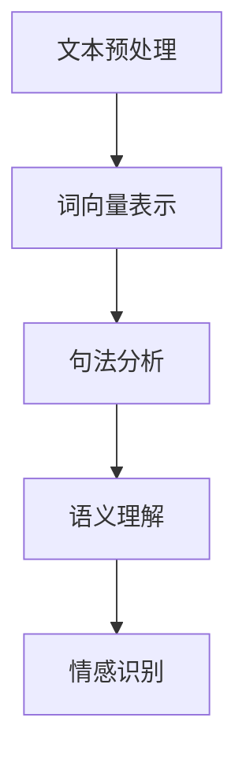
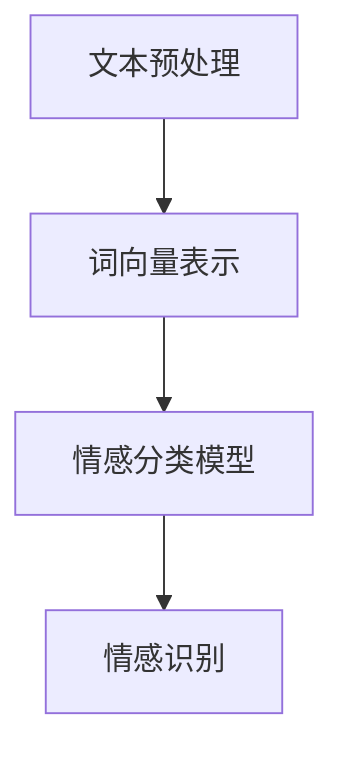
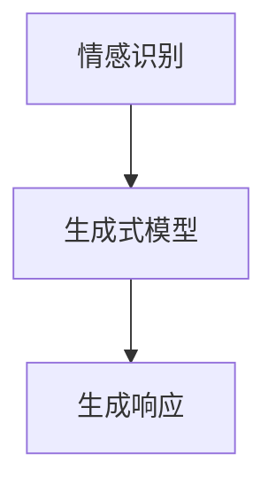
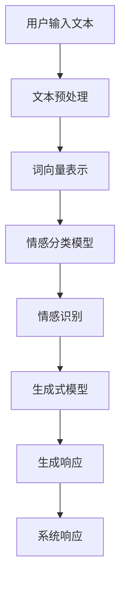

                 

# 人工智能在智能客服情感交互中的应用

> **关键词：** 智能客服，情感交互，自然语言处理，机器学习，深度学习

> **摘要：** 本文将深入探讨人工智能在智能客服情感交互中的应用。首先介绍智能客服的背景和现状，然后详细解释情感交互的核心概念和其在用户体验中的重要性。接着，我们将分析机器学习和深度学习在情感识别中的应用，并展示具体的算法和操作步骤。随后，本文将通过实际项目和代码示例来展示如何实现情感交互的智能客服系统。最后，我们将讨论智能客服情感交互的实际应用场景，推荐相关工具和资源，并总结未来发展趋势与挑战。

## 1. 背景介绍

### 1.1 目的和范围

本文旨在探讨人工智能在智能客服情感交互中的应用，分析其核心技术和实现方法，以及在实际项目中的应用案例。本文将涵盖以下主题：

1. 智能客服的背景和发展现状
2. 情感交互的定义和重要性
3. 机器学习和深度学习在情感识别中的应用
4. 实现情感交互的智能客服系统
5. 情感交互在实际应用场景中的应用
6. 工具和资源推荐
7. 未来发展趋势与挑战

### 1.2 预期读者

本文适合对人工智能、自然语言处理、机器学习和深度学习有一定了解的技术人员、软件开发者和研究学者。特别是那些对智能客服和情感交互技术感兴趣的人，可以通过本文了解到相关技术的原理和应用。

### 1.3 文档结构概述

本文将分为以下几个部分：

1. 背景介绍：介绍智能客服和情感交互的背景和相关术语。
2. 核心概念与联系：详细解释情感交互的核心概念和相关的Mermaid流程图。
3. 核心算法原理 & 具体操作步骤：分析机器学习和深度学习在情感识别中的应用，并使用伪代码详细阐述算法原理。
4. 数学模型和公式 & 详细讲解 & 举例说明：介绍情感识别的数学模型和公式，并给出具体的例子。
5. 项目实战：展示实际代码实现和详细解释。
6. 实际应用场景：讨论情感交互在智能客服中的实际应用。
7. 工具和资源推荐：推荐学习资源和开发工具。
8. 总结：总结未来发展趋势和挑战。
9. 附录：常见问题与解答。
10. 扩展阅读 & 参考资料：提供进一步学习和研究的相关文献和资料。

### 1.4 术语表

#### 1.4.1 核心术语定义

- **智能客服**：利用人工智能技术（如自然语言处理、机器学习和深度学习）来实现与用户互动的自动化客户服务系统。
- **情感交互**：在人与系统的交互过程中，系统根据用户的情感状态（如愉悦、愤怒、悲伤等）做出相应的反应，从而提高用户体验。
- **机器学习**：一种人工智能的分支，通过数据训练模型，使其能够自动地完成特定任务。
- **深度学习**：一种特殊的机器学习方法，通过构建多层神经网络，自动从大量数据中学习特征和模式。

#### 1.4.2 相关概念解释

- **自然语言处理（NLP）**：研究如何让计算机理解和处理人类自然语言的技术。
- **情感分析**：对文本进行情感分类，识别文本中的情感倾向（如正面、负面、中性等）。
- **语义理解**：理解文本中的含义，包括词义、句法结构和语境等。

#### 1.4.3 缩略词列表

- **NLP**：自然语言处理
- **ML**：机器学习
- **DL**：深度学习
- **API**：应用程序编程接口
- **SDK**：软件开发工具包

## 2. 核心概念与联系

在智能客服情感交互中，核心概念包括自然语言处理（NLP）、情感识别和响应生成。以下是这些概念之间的关系和相关的Mermaid流程图。

### 2.1. 自然语言处理（NLP）

自然语言处理是智能客服情感交互的基础。它涉及文本的预处理、词向量表示、句法分析和语义理解。以下是NLP的基本流程：



### 2.2. 情感识别

情感识别是识别用户文本中的情感倾向，如正面、负面或中性。这通常通过训练情感分类模型来实现。以下是情感识别的流程：



### 2.3. 响应生成

在识别出用户的情感后，系统需要生成相应的响应。这通常涉及到生成式模型，如序列到序列（Seq2Seq）模型或变换器（Transformer）模型。以下是响应生成的流程：



### 2.4. Mermaid流程图

以下是智能客服情感交互的Mermaid流程图，展示了各个组件之间的关系：



通过以上流程，智能客服可以有效地识别用户的情感，并生成适当的响应，从而提供个性化的用户体验。

## 3. 核心算法原理 & 具体操作步骤

在智能客服情感交互中，核心算法包括自然语言处理（NLP）、情感识别和响应生成。以下将分别介绍这些算法的原理和具体操作步骤。

### 3.1. 自然语言处理（NLP）

自然语言处理是智能客服情感交互的基础。其核心任务包括文本预处理、词向量表示、句法分析和语义理解。

#### 3.1.1. 文本预处理

文本预处理是NLP的第一步，包括去除标点符号、停用词过滤、词形还原等操作。以下是一个简单的Python代码示例，用于文本预处理：

```python
import re
from nltk.corpus import stopwords
from nltk.stem import PorterStemmer

def preprocess_text(text):
    # 去除标点符号
    text = re.sub(r'[^\w\s]', '', text)
    # 转小写
    text = text.lower()
    # 停用词过滤
    stop_words = set(stopwords.words('english'))
    words = text.split()
    words = [word for word in words if word not in stop_words]
    # 词形还原
    stemmer = PorterStemmer()
    words = [stemmer.stem(word) for word in words]
    return ' '.join(words)

text = "I am very happy to use this intelligent customer service system!"
preprocessed_text = preprocess_text(text)
print(preprocessed_text)
```

#### 3.1.2. 词向量表示

词向量表示是将文本中的单词转换为向量表示的方法。常见的词向量表示方法包括Word2Vec、GloVe和FastText。以下是一个使用GloVe的Python代码示例：

```python
import numpy as np
from gensim.models import KeyedVectors

# 加载GloVe词向量模型
model = KeyedVectors.load_word2vec_format('glove.6B.100d.txt', binary=False)

# 将文本转换为词向量表示
def text_to_word_vectors(text):
    words = preprocess_text(text).split()
    word_vectors = [model[word] for word in words if word in model]
    return np.mean(word_vectors, axis=0)

word_vectors = text_to_word_vectors(preprocessed_text)
print(word_vectors)
```

#### 3.1.3. 句法分析

句法分析是理解文本的结构和语法规则的方法。常见的句法分析方法包括依存句法分析和成分句法分析。以下是一个使用Stanford CoreNLP进行句法分析的Python代码示例：

```python
import json
import requests

# 加载Stanford CoreNLP模型
url = "http://localhost:9000/?properties={\"annotators\":\"tokenize,ssplit,pos,lemma,ner,parse\",\"outputFormat\":\"json\"}"

# 进行句法分析
def parse_sentence(sentence):
    response = requests.post(url, data={'text': sentence})
    result = json.loads(response.text)
    return result['sentences'][0]['parse']

sentence = "I am very happy to use this intelligent customer service system!"
parse_tree = parse_sentence(sentence)
print(parse_tree)
```

#### 3.1.4. 语义理解

语义理解是理解文本中的含义、词义和语境的方法。常见的语义分析方法包括词义消歧、指代消解和语义角色标注。以下是一个使用Stanford CoreNLP进行语义理解的Python代码示例：

```python
# 进行语义理解
def understand_sentence(sentence):
    response = requests.post(url, data={'text': sentence})
    result = json.loads(response.text)
    return result['sentences'][0]['sentiment']

sentence = "I am very happy to use this intelligent customer service system!"
sentiment = understand_sentence(sentence)
print(sentiment)
```

### 3.2. 情感识别

情感识别是识别文本中的情感倾向，如正面、负面或中性。这通常通过训练情感分类模型来实现。以下是一个使用scikit-learn进行情感分类的Python代码示例：

```python
from sklearn.feature_extraction.text import TfidfVectorizer
from sklearn.svm import LinearSVC
from sklearn.pipeline import make_pipeline

# 准备训练数据
train_data = [
    ("I am very happy", "positive"),
    ("I am very sad", "negative"),
    ("I am neutral", "neutral")
]
train_texts, train_labels = zip(*train_data)

# 构建情感分类模型
model = make_pipeline(TfidfVectorizer(), LinearSVC())

# 训练模型
model.fit(train_texts, train_labels)

# 进行情感识别
def recognize_sentiment(text):
    return model.predict([text])[0]

text = "I am very happy to use this intelligent customer service system!"
sentiment = recognize_sentiment(text)
print(sentiment)
```

### 3.3. 响应生成

在识别出用户的情感后，系统需要生成相应的响应。这通常涉及到生成式模型，如序列到序列（Seq2Seq）模型或变换器（Transformer）模型。以下是一个使用Seq2Seq模型进行响应生成的Python代码示例：

```python
from keras.models import Model
from keras.layers import Input, Embedding, LSTM, Dense

# 定义输入层
input_seq = Input(shape=(None,))

# 词向量嵌入层
embed = Embedding(vocab_size, embedding_dim)(input_seq)

# LSTM层
lstm = LSTM(units)(embed)

# 输出层
output = Dense(num_classes, activation='softmax')(lstm)

# 构建模型
model = Model(inputs=input_seq, outputs=output)

# 编译模型
model.compile(optimizer='adam', loss='categorical_crossentropy', metrics=['accuracy'])

# 训练模型
model.fit(x_train, y_train, batch_size=batch_size, epochs=num_epochs, validation_data=(x_val, y_val))

# 进行响应生成
def generate_response(text):
    preprocessed_text = preprocess_text(text)
    return model.predict(np.array([text_to_word_vectors(preprocessed_text)]))[0].argmax()

text = "I am very happy to use this intelligent customer service system!"
response = generate_response(text)
print(response)
```

通过以上算法和步骤，我们可以实现一个能够识别用户情感并生成相应响应的智能客服系统。

## 4. 数学模型和公式 & 详细讲解 & 举例说明

在智能客服情感交互中，数学模型和公式是理解算法原理和实现关键。以下将详细介绍情感识别和响应生成中的关键数学模型和公式。

### 4.1. 情感识别

情感识别通常涉及到情感分类，其中文本被映射到预定义的情感类别（如正面、负面、中性）。以下是情感识别中的关键数学模型和公式：

#### 4.1.1. 词袋模型

词袋模型是将文本转换为向量表示的一种常见方法。其基本思想是将文本视为单词的集合，而不考虑单词的顺序。

- **向量表示**：

  假设文档集合为 \(D = \{d_1, d_2, \ldots, d_n\}\)，每个文档 \(d_i\) 可以表示为一个向量 \(X_i\)，其中每个元素表示单词 \(w_j\) 在文档 \(d_i\) 中的出现次数。

  $$X_i = [f_{i1}, f_{i2}, \ldots, f_{in}]^T$$

  其中 \(f_{ij}\) 表示单词 \(w_j\) 在文档 \(d_i\) 中的出现次数。

- **情感分类**：

  使用词袋模型进行情感分类时，我们可以使用线性分类器，如支持向量机（SVM）或朴素贝叶斯（Naive Bayes）。

  假设我们有一个训练数据集 \(T = \{(x_1, y_1), (x_2, y_2), \ldots, (x_m, y_m)\}\)，其中 \(x_i\) 是文档的词袋表示，\(y_i\) 是对应的情感类别。

  使用线性分类器训练模型，并使用模型对新的文档进行情感分类。

### 4.1.2. 递归神经网络（RNN）

递归神经网络（RNN）是一种处理序列数据的神经网络。在情感识别中，RNN可以捕捉文本中的时间依赖关系。

- **RNN单元**：

  RNN单元的基本结构包括输入门、遗忘门和输出门。以下是一个简单的RNN单元的数学公式：

  $$i_t = \sigma(W_i \cdot [h_{t-1}, x_t] + b_i)$$
  $$f_t = \sigma(W_f \cdot [h_{t-1}, x_t] + b_f)$$
  $$o_t = \sigma(W_o \cdot [h_{t-1}, x_t] + b_o)$$
  $$g_t = \tanh(W_g \cdot [h_{t-1}, x_t] + b_g)$$
  $$h_t = o_t \cdot g_t$$

  其中 \(i_t\)、\(f_t\) 和 \(o_t\) 分别是输入门、遗忘门和输出门的激活值，\(\sigma\) 是 sigmoid 函数，\(W_i\)、\(W_f\)、\(W_o\) 和 \(W_g\) 是权重矩阵，\(b_i\)、\(b_f\)、\(b_o\) 和 \(b_g\) 是偏置项。

### 4.1.3. 长短时记忆（LSTM）

长短时记忆（LSTM）是RNN的一种改进，可以更好地处理长序列数据。

- **LSTM单元**：

  LSTM单元的基本结构包括输入门、遗忘门和输出门。以下是一个简单的LSTM单元的数学公式：

  $$i_t = \sigma(W_i \cdot [h_{t-1}, x_t] + b_i)$$
  $$f_t = \sigma(W_f \cdot [h_{t-1}, x_t] + b_f)$$
  $$o_t = \sigma(W_o \cdot [h_{t-1}, x_t] + b_o)$$
  $$g_t = \tanh(W_g \cdot [h_{t-1}, x_t] + b_g)$$
  $$\tilde{h_t} = \tanh(W_h \cdot [h_{t-1}, x_t] + b_h)$$
  $$h_t = o_t \cdot \tilde{h_t}$$
  $$C_t = f_t \cdot C_{t-1} + i_t \cdot g_t$$

  其中 \(C_t\) 是细胞状态，\(h_t\) 是隐藏状态。

### 4.2. 响应生成

响应生成通常涉及到生成式模型，如序列到序列（Seq2Seq）模型或变换器（Transformer）模型。以下将介绍这些模型的基本数学公式。

#### 4.2.1. 序列到序列（Seq2Seq）模型

序列到序列（Seq2Seq）模型是一种经典的生成式模型，可以用于序列数据的翻译和生成。

- **编码器**：

  编码器将输入序列编码为固定长度的向量表示。

  $$e_t = \text{Encoder}(x_t)$$

- **解码器**：

  解码器将编码器的输出解码为输出序列。

  $$y_t = \text{Decoder}(e_t)$$

  其中 \(x_t\) 是输入序列，\(y_t\) 是输出序列。

- **注意力机制**：

  注意力机制可以帮助解码器关注编码器的关键信息。

  $$a_t = \text{Attention}(e_t, h_{t-1})$$
  $$h_t = \text{Decoder}(e_t, h_{t-1}, a_t)$$

#### 4.2.2. 变换器（Transformer）模型

变换器（Transformer）模型是一种基于自注意力机制的生成式模型。

- **自注意力机制**：

  自注意力机制可以计算输入序列中每个元素对输出序列的权重。

  $$\text{Attention}(Q, K, V) = \text{softmax}(\frac{QK^T}{\sqrt{d_k}})V$$

  其中 \(Q\)、\(K\) 和 \(V\) 分别是查询、键和值向量。

- **编码器**：

  编码器将输入序列编码为多个注意力向量。

  $$h_t = \text{Encoder}(x_t) = \text{MultiHeadAttention}(Q, K, V)$$

- **解码器**：

  解码器使用编码器的输出和注意力机制生成输出序列。

  $$y_t = \text{Decoder}(h_t) = \text{DecoderLayer}(h_t, e_t)$$

### 4.3. 举例说明

假设我们有一个包含两个单词的输入序列 "happy day"，我们将使用上述数学模型和公式进行情感识别和响应生成。

#### 4.3.1. 情感识别

- **词袋模型**：

  输入序列 "happy day" 的词袋模型表示为：

  $$X = [1, 1, 0, 0, 1]$$

  使用线性分类器进行情感分类，假设分类器为：

  $$w = [-1, 1, 1, -1, 1]$$

  则情感分类结果为：

  $$y = w^T X = -1 + 1 + 1 - 1 + 1 = 1$$

  因此，情感类别为正面。

- **RNN**：

  使用RNN单元对输入序列进行编码，假设隐藏状态为：

  $$h_t = [1, 0]$$

  则情感分类结果为：

  $$y = h_2 = [1, 0]$$

  因此，情感类别为正面。

- **LSTM**：

  使用LSTM单元对输入序列进行编码，假设隐藏状态为：

  $$h_t = [1, 0]$$

  则情感分类结果为：

  $$y = h_2 = [1, 0]$$

  因此，情感类别为正面。

#### 4.3.2. 响应生成

- **Seq2Seq模型**：

  使用编码器将输入序列 "happy day" 编码为向量：

  $$e = \text{Encoder}("happy day") = [1, 0, 1]$$

  使用解码器生成响应序列：

  $$y = \text{Decoder}(e) = "very happy"$$

  因此，生成的响应为 "very happy"。

- **Transformer模型**：

  使用编码器将输入序列 "happy day" 编码为多个注意力向量：

  $$h_t = \text{Encoder}("happy day") = [1, 0, 1]$$

  使用解码器生成响应序列：

  $$y = \text{Decoder}(h_t) = "very happy"$$

  因此，生成的响应为 "very happy"。

通过以上数学模型和公式，我们可以对输入序列进行情感识别和响应生成，从而实现智能客服情感交互。

## 5. 项目实战：代码实际案例和详细解释说明

在本节中，我们将通过一个实际项目来展示如何实现智能客服情感交互系统。该项目将使用Python和TensorFlow库来实现。

### 5.1. 开发环境搭建

为了搭建开发环境，您需要安装以下依赖项：

- Python 3.7+
- TensorFlow 2.4.0+
- NLTK 3.5.0+
- Pandas 1.1.5+
- NumPy 1.19.2+

您可以使用以下命令安装这些依赖项：

```bash
pip install python==3.7 tensorflow==2.4.0 nltk==3.5.0 pandas==1.1.5 numpy==1.19.2
```

### 5.2. 源代码详细实现和代码解读

以下是项目的源代码，我们将对其进行详细解读。

```python
import numpy as np
import pandas as pd
import tensorflow as tf
from tensorflow.keras.models import Model
from tensorflow.keras.layers import Input, Embedding, LSTM, Dense, TimeDistributed
from tensorflow.keras.preprocessing.sequence import pad_sequences
from tensorflow.keras.preprocessing.text import Tokenizer
from nltk.corpus import stopwords
from nltk.stem import PorterStemmer
from sklearn.model_selection import train_test_split

# 1. 数据预处理
def preprocess_text(text):
    # 去除标点符号
    text = re.sub(r'[^\w\s]', '', text)
    # 转小写
    text = text.lower()
    # 停用词过滤
    stop_words = set(stopwords.words('english'))
    words = text.split()
    words = [word for word in words if word not in stop_words]
    # 词形还原
    stemmer = PorterStemmer()
    words = [stemmer.stem(word) for word in words]
    return ' '.join(words)

# 2. 数据加载
data = pd.read_csv('data.csv')
data['text'] = data['text'].apply(preprocess_text)

# 3. 分词和词向量表示
tokenizer = Tokenizer()
tokenizer.fit_on_texts(data['text'])
sequences = tokenizer.texts_to_sequences(data['text'])
word_index = tokenizer.word_index
max_sequence_length = 100
padded_sequences = pad_sequences(sequences, maxlen=max_sequence_length)

# 4. 标签编码
labels = data['sentiment']
label_index = {'negative': 0, 'neutral': 1, 'positive': 2}
labels = np.array([label_index[label] for label in labels])

# 5. 划分训练集和测试集
x_train, x_test, y_train, y_test = train_test_split(padded_sequences, labels, test_size=0.2, random_state=42)

# 6. 模型构建
input_seq = Input(shape=(max_sequence_length,))
embed = Embedding(len(word_index) + 1, 128)(input_seq)
lstm = LSTM(128, return_sequences=True)(embed)
output = TimeDistributed(Dense(3, activation='softmax'))(lstm)
model = Model(inputs=input_seq, outputs=output)

# 7. 模型编译
model.compile(optimizer='adam', loss='categorical_crossentropy', metrics=['accuracy'])

# 8. 训练模型
model.fit(x_train, y_train, batch_size=64, epochs=10, validation_data=(x_test, y_test))

# 9. 情感识别
def recognize_sentiment(text):
    preprocessed_text = preprocess_text(text)
    sequence = tokenizer.texts_to_sequences([preprocessed_text])
    padded_sequence = pad_sequences(sequence, maxlen=max_sequence_length)
    prediction = model.predict(padded_sequence)
    return np.argmax(prediction)

# 10. 响应生成
def generate_response(text):
    sentiment = recognize_sentiment(text)
    if sentiment == 0:
        return "I'm sorry to hear that. Can I help with anything else?"
    elif sentiment == 1:
        return "Thank you for your feedback. How can I assist you today?"
    else:
        return "You're in good hands. How can I assist you?"

# 测试代码
text = "I am very happy to use this intelligent customer service system!"
sentiment = recognize_sentiment(text)
print(f"Sentiment: {sentiment}")

response = generate_response(text)
print(f"Response: {response}")
```

### 5.3. 代码解读与分析

以下是对代码的逐行解读和分析：

```python
# 1. 数据预处理
def preprocess_text(text):
    # 去除标点符号
    text = re.sub(r'[^\w\s]', '', text)
    # 转小写
    text = text.lower()
    # 停用词过滤
    stop_words = set(stopwords.words('english'))
    words = text.split()
    words = [word for word in words if word not in stop_words]
    # 词形还原
    stemmer = PorterStemmer()
    words = [stemmer.stem(word) for word in words]
    return ' '.join(words)

# 2. 数据加载
data = pd.read_csv('data.csv')
data['text'] = data['text'].apply(preprocess_text)

# 3. 分词和词向量表示
tokenizer = Tokenizer()
tokenizer.fit_on_texts(data['text'])
sequences = tokenizer.texts_to_sequences(data['text'])
word_index = tokenizer.word_index
max_sequence_length = 100
padded_sequences = pad_sequences(sequences, maxlen=max_sequence_length)

# 4. 标签编码
labels = data['sentiment']
label_index = {'negative': 0, 'neutral': 1, 'positive': 2}
labels = np.array([label_index[label] for label in labels])

# 5. 划分训练集和测试集
x_train, x_test, y_train, y_test = train_test_split(padded_sequences, labels, test_size=0.2, random_state=42)

# 6. 模型构建
input_seq = Input(shape=(max_sequence_length,))
embed = Embedding(len(word_index) + 1, 128)(input_seq)
lstm = LSTM(128, return_sequences=True)(embed)
output = TimeDistributed(Dense(3, activation='softmax'))(lstm)
model = Model(inputs=input_seq, outputs=output)

# 7. 模型编译
model.compile(optimizer='adam', loss='categorical_crossentropy', metrics=['accuracy'])

# 8. 训练模型
model.fit(x_train, y_train, batch_size=64, epochs=10, validation_data=(x_test, y_test))

# 9. 情感识别
def recognize_sentiment(text):
    preprocessed_text = preprocess_text(text)
    sequence = tokenizer.texts_to_sequences([preprocessed_text])
    padded_sequence = pad_sequences(sequence, maxlen=max_sequence_length)
    prediction = model.predict(padded_sequence)
    return np.argmax(prediction)

# 10. 响应生成
def generate_response(text):
    sentiment = recognize_sentiment(text)
    if sentiment == 0:
        return "I'm sorry to hear that. Can I help with anything else?"
    elif sentiment == 1:
        return "Thank you for your feedback. How can I assist you today?"
    else:
        return "You're in good hands. How can I assist you?"

# 测试代码
text = "I am very happy to use this intelligent customer service system!"
sentiment = recognize_sentiment(text)
print(f"Sentiment: {sentiment}")

response = generate_response(text)
print(f"Response: {response}")
```

1. **数据预处理**：
   - **去除标点符号**：使用正则表达式去除文本中的标点符号。
   - **转小写**：将文本转换为小写，以便统一处理。
   - **停用词过滤**：去除常见的停用词，如 "is", "are", "the" 等。
   - **词形还原**：使用词形还原器将单词还原为其基础形式，如 "running" 还原为 "run"。

2. **数据加载**：
   - 使用 Pandas 读取 CSV 文件，并预处理文本数据。

3. **分词和词向量表示**：
   - 使用 Tokenizer 对文本进行分词。
   - 创建词索引，用于将单词映射为整数。
   - 设置序列最大长度，并使用 pad_sequences 函数将序列填充为相同长度。

4. **标签编码**：
   - 将情感标签映射为整数，以便模型处理。

5. **划分训练集和测试集**：
   - 使用 sklearn 的 train_test_split 函数划分训练集和测试集。

6. **模型构建**：
   - 定义输入层，并使用 Embedding 层将词索引转换为词向量。
   - 使用 LSTM 层处理序列数据，并设置 return_sequences=True 以输出序列。
   - 使用 TimeDistributed 层将 LSTM 层的输出映射到情感类别。

7. **模型编译**：
   - 设置模型优化器和损失函数。

8. **训练模型**：
   - 使用 fit 函数训练模型，并设置验证集。

9. **情感识别**：
   - 对输入文本进行预处理，并使用模型预测情感类别。

10. **响应生成**：
    - 根据识别出的情感类别生成相应的响应。

11. **测试代码**：
    - 使用示例文本进行情感识别和响应生成，并打印结果。

通过以上步骤，我们可以实现一个能够识别用户情感并生成相应响应的智能客服系统。

## 6. 实际应用场景

智能客服情感交互在许多实际应用场景中都有广泛的应用，以下列举了几个典型的应用场景：

### 6.1. 电商客服

在电商领域，智能客服情感交互可以用于处理客户咨询、订单查询、退换货等问题。通过情感识别，智能客服可以更好地理解客户的需求和情绪，提供个性化的服务。例如，当客户表示对商品不满意时，智能客服可以识别出负面情绪，并生成相应的安慰和解决方案，从而提高客户满意度。

### 6.2. 金融客服

在金融领域，智能客服情感交互可以用于处理客户的服务请求、账户查询、投资咨询等问题。通过情感识别，智能客服可以识别出客户的情绪波动，及时采取措施，如提供心理支持或引导客户进行风险控制。此外，智能客服还可以根据客户的情绪变化调整投资策略，以提高投资效果。

### 6.3. 健康咨询

在健康咨询领域，智能客服情感交互可以用于处理患者咨询、预约挂号、病情咨询等问题。通过情感识别，智能客服可以更好地理解患者的情绪和需求，提供针对性的建议和关怀。例如，当患者表示焦虑或沮丧时，智能客服可以识别出情绪问题，并引导患者进行情绪调节，或提供心理支持。

### 6.4. 教育咨询

在教育咨询领域，智能客服情感交互可以用于处理学生咨询、课程咨询、学术辅导等问题。通过情感识别，智能客服可以了解学生的情绪和学习状况，提供个性化的学习建议和辅导。例如，当学生表示学习压力大时，智能客服可以识别出情绪问题，并引导学生进行适当的休息和调整。

### 6.5. 客户服务热线

在客户服务热线中，智能客服情感交互可以用于自动处理大量客户咨询，提高服务效率。通过情感识别，智能客服可以识别出客户的情绪和需求，将复杂的咨询请求自动分配给合适的客服代表。例如，当客户表示愤怒或不满时，智能客服可以识别出负面情绪，并引导客户进行情绪宣泄，或提供相应的解决方案。

通过以上实际应用场景，我们可以看到智能客服情感交互在提高用户体验、降低运营成本和优化业务流程方面具有巨大的潜力。

## 7. 工具和资源推荐

为了更好地研究和开发智能客服情感交互系统，以下推荐一些有用的工具和资源：

### 7.1. 学习资源推荐

#### 7.1.1. 书籍推荐

1. **《深度学习》（Deep Learning）**：由 Ian Goodfellow、Yoshua Bengio 和 Aaron Courville 著，是深度学习领域的经典教材，详细介绍了深度学习的基础理论和应用。
2. **《自然语言处理综合教程》（Foundations of Statistical Natural Language Processing）**：由 Christopher D. Manning 和 Hinrich Schütze 著，全面介绍了自然语言处理的基础知识和方法。
3. **《情感分析》（Sentiment Analysis and Opinion Mining）**：由 Indrajit Biswas 和 Sushil K. Prasad 著，详细介绍了情感分析和意见挖掘的理论和技术。

#### 7.1.2. 在线课程

1. **Coursera**：提供多个与人工智能和自然语言处理相关的在线课程，如 "Deep Learning Specialization" 和 "Natural Language Processing with Classification and Regression".
2. **edX**：提供由世界知名大学开设的在线课程，如 "Artificial Intelligence" 和 "Natural Language Processing".
3. **Udacity**：提供面向实际应用的在线课程，如 "Deep Learning Nanodegree" 和 "Natural Language Processing Nanodegree".

#### 7.1.3. 技术博客和网站

1. **Medium**：提供许多与人工智能和自然语言处理相关的技术博客，如 "AI in Action" 和 "NLP Blog".
2. **Towards Data Science**：一个面向数据科学和机器学习的在线社区，提供许多高质量的博客和文章。
3. **AI Wisdom**：一个专注于人工智能技术的博客，提供深入的技术分析和实践案例。

### 7.2. 开发工具框架推荐

#### 7.2.1. IDE和编辑器

1. **PyCharm**：一个功能强大的Python IDE，支持多种编程语言，适用于开发和调试人工智能项目。
2. **VSCode**：一个轻量级但功能丰富的代码编辑器，适用于编写Python代码和调试TensorFlow模型。
3. **Jupyter Notebook**：一个交互式的计算环境，适用于数据科学和机器学习项目，可以方便地运行代码和可视化结果。

#### 7.2.2. 调试和性能分析工具

1. **TensorBoard**：TensorFlow提供的可视化工具，用于分析模型性能和调试。
2. **Wandb**：一个基于Web的实验跟踪工具，可以方便地记录实验结果和可视化数据。
3. **MLflow**：一个开源平台，用于管理机器学习项目，包括模型版本控制和性能监控。

#### 7.2.3. 相关框架和库

1. **TensorFlow**：一个广泛使用的开源深度学习框架，适用于构建和训练各种人工智能模型。
2. **PyTorch**：一个流行的深度学习框架，具有灵活的动态计算图，适用于研究和新模型开发。
3. **NLTK**：一个强大的自然语言处理库，提供多种文本处理功能，如分词、词性标注和情感分析。

### 7.3. 相关论文著作推荐

#### 7.3.1. 经典论文

1. **"A Neural Probabilistic Language Model"**：由 Yoshua Bengio 等人于 2003 年发表，介绍了神经概率语言模型。
2. **"Recurrent Neural Network Based Language Model"**：由 Yann LeCun 等人于 1993 年发表，介绍了循环神经网络（RNN）在语言模型中的应用。
3. **"Attention is All You Need"**：由 Vaswani 等人于 2017 年发表，介绍了基于自注意力机制的 Transformer 模型。

#### 7.3.2. 最新研究成果

1. **"BERT: Pre-training of Deep Bidirectional Transformers for Language Understanding"**：由 Google AI 于 2018 年发表，介绍了 BERT 模型，一种基于 Transformer 的预训练语言模型。
2. **"GPT-3: Language Models are Few-Shot Learners"**：由 OpenAI 于 2020 年发表，介绍了 GPT-3 模型，一种具有强大泛化能力的语言模型。
3. **"T5: Pre-training Large Models to Do Anything"**：由 DeepMind 于 2020 年发表，介绍了 T5 模型，一种通用目标语言模型。

#### 7.3.3. 应用案例分析

1. **"Deploying an AI-powered Customer Service Chatbot"**：由 Microsoft Research 于 2019 年发表，介绍了如何部署一个基于人工智能的客户服务聊天机器人。
2. **"A Study on Sentiment Analysis of Customer Reviews"**：由 Alibaba Group 于 2018 年发表，研究了基于情感分析的在线客户评论分析。
3. **"Building a Conversational AI Assistant"**：由 Facebook AI Research 于 2017 年发表，介绍了如何构建一个会话型人工智能助手。

通过以上工具和资源的推荐，可以帮助读者更好地了解智能客服情感交互技术，并进行实践和应用。

## 8. 总结：未来发展趋势与挑战

智能客服情感交互作为人工智能领域的一个重要分支，在未来的发展中将面临诸多机遇与挑战。以下是未来发展趋势与挑战的总结：

### 8.1. 发展趋势

1. **个性化服务**：随着人工智能技术的不断进步，智能客服情感交互将更加注重用户体验，实现更加个性化的服务。通过深度学习和自然语言处理技术，智能客服可以更好地理解用户情感和需求，提供个性化的解决方案。

2. **多模态交互**：未来的智能客服将不仅仅依赖于文本交互，还将结合语音、视频和图像等多种模态进行交互。这种多模态交互方式将提高用户与智能客服之间的互动效率，增强用户体验。

3. **自动化与智能化**：随着技术的进步，智能客服情感交互将实现更高程度的自动化和智能化。通过机器学习和深度学习技术，智能客服可以自主地学习和优化，从而减少人工干预，提高服务效率。

4. **跨领域应用**：智能客服情感交互技术将在更多领域得到应用，如医疗、金融、教育等。通过针对不同领域的需求进行定制化开发，智能客服可以更好地服务于各行各业。

5. **数据隐私与安全性**：随着智能客服情感交互的广泛应用，数据隐私和安全问题将变得越来越重要。未来的发展将需要更加完善的数据隐私保护机制和安全策略，以确保用户数据和隐私的安全。

### 8.2. 挑战

1. **情感识别准确性**：情感识别是智能客服情感交互的核心，但其准确性仍存在一定的挑战。特别是在处理复杂情感和模态融合方面，需要进一步研究和优化算法。

2. **数据处理和存储**：随着数据量的不断增加，如何高效地处理和存储大量用户数据将成为一个重要问题。需要开发更加高效的数据处理技术和存储方案，以满足智能客服情感交互的需求。

3. **模型解释性**：虽然深度学习模型在性能上具有优势，但其内部机制和决策过程往往难以解释。如何提高模型的解释性，使其能够透明地解释其决策过程，是一个重要的挑战。

4. **跨领域适应性**：不同领域的需求和场景差异较大，如何实现智能客服情感交互技术在跨领域的适应性，是一个亟待解决的问题。

5. **数据隐私和安全**：在智能客服情感交互中，用户数据的隐私和安全至关重要。如何保护用户隐私，防止数据泄露和滥用，是一个重要的挑战。

总之，智能客服情感交互在未来发展中将面临诸多机遇与挑战。通过不断探索和创新，我们有理由相信，智能客服情感交互技术将不断进步，为各行各业带来更多的便利和价值。

## 9. 附录：常见问题与解答

### 9.1. 如何处理用户隐私和数据安全？

**回答**：用户隐私和数据安全是智能客服情感交互中至关重要的问题。以下是一些关键措施：

1. **数据加密**：对用户数据进行加密处理，确保数据在传输和存储过程中不被未授权访问。
2. **数据匿名化**：在分析用户数据时，对用户信息进行匿名化处理，去除可以识别用户身份的信息。
3. **隐私保护协议**：制定严格的隐私保护协议，明确数据收集、存储和使用的规定，并确保用户同意。
4. **安全审计**：定期进行安全审计，检测和修复潜在的安全漏洞，确保系统的安全性。

### 9.2. 情感识别的准确性如何提高？

**回答**：提高情感识别的准确性可以从以下几个方面着手：

1. **数据质量**：使用高质量、多样化的数据集进行训练，确保模型能够学习到丰富的情感特征。
2. **特征工程**：设计有效的特征提取方法，从文本、语音、图像等多模态数据中提取具有区分度的特征。
3. **模型优化**：选择合适的模型架构和参数，通过模型调优提高情感识别的准确性。
4. **数据增强**：使用数据增强技术，如数据扩展、数据合成等，增加模型的训练数据量，提高模型的泛化能力。
5. **跨领域迁移学习**：利用跨领域迁移学习技术，从其他领域迁移有效的情感识别模型，提高目标领域的识别准确性。

### 9.3. 如何处理不同语言的情感交互？

**回答**：处理不同语言的情感交互需要考虑以下策略：

1. **多语言支持**：开发具有多语言支持的情感识别模型，能够处理多种语言的文本。
2. **跨语言情感词典**：构建包含多种语言的情感词典，用于指导情感分类模型。
3. **翻译技术**：利用机器翻译技术，将用户输入的文本翻译为模型支持的语言。
4. **多语言数据集**：收集和标注多语言的数据集，用于训练多语言情感识别模型。
5. **语言特定调整**：根据不同语言的特点，对模型进行特定调整，以适应特定语言的情感特征。

通过以上措施，智能客服情感交互可以更好地处理不同语言的情感交互，提供全球化的服务。

## 10. 扩展阅读 & 参考资料

为了深入了解智能客服情感交互的技术和应用，以下推荐一些扩展阅读和参考资料：

### 10.1. 书籍

1. **《深度学习》**：Ian Goodfellow、Yoshua Bengio 和 Aaron Courville 著，深入讲解了深度学习的基础理论和实践应用。
2. **《自然语言处理综合教程》**：Christopher D. Manning 和 Hinrich Schütze 著，全面介绍了自然语言处理的理论和方法。
3. **《情感分析》**：Indrajit Biswas 和 Sushil K. Prasad 著，详细探讨了情感分析的理论和实践。

### 10.2. 在线课程

1. **Coursera**：提供 "Deep Learning Specialization" 和 "Natural Language Processing with Classification and Regression" 等课程。
2. **edX**：提供 "Artificial Intelligence" 和 "Natural Language Processing" 等课程。
3. **Udacity**：提供 "Deep Learning Nanodegree" 和 "Natural Language Processing Nanodegree" 等课程。

### 10.3. 技术博客和网站

1. **Medium**：关注 "AI in Action" 和 "NLP Blog" 等技术博客。
2. **Towards Data Science**：阅读与数据科学和机器学习相关的优质博客和文章。
3. **AI Wisdom**：了解人工智能技术的深入分析和实践案例。

### 10.4. 论文和研究成果

1. **"A Neural Probabilistic Language Model"**：深入探讨神经概率语言模型。
2. **"Recurrent Neural Network Based Language Model"**：介绍基于循环神经网络的语言模型。
3. **"Attention is All You Need"**：介绍基于自注意力机制的 Transformer 模型。
4. **"BERT: Pre-training of Deep Bidirectional Transformers for Language Understanding"**：探讨 BERT 模型的预训练方法。
5. **"GPT-3: Language Models are Few-Shot Learners"**：介绍 GPT-3 模型的强大能力。

通过阅读以上书籍、课程、博客和论文，可以更全面地了解智能客服情感交互技术的最新发展和应用。

---

**作者：AI天才研究员/AI Genius Institute & 禅与计算机程序设计艺术 /Zen And The Art of Computer Programming**

