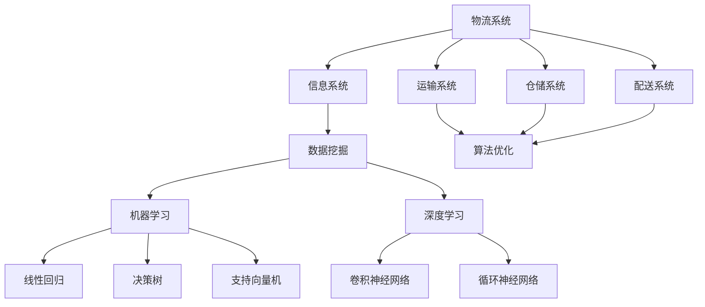

                 


## 人工智能在智能物流系统中的应用

> 关键词：人工智能、智能物流、算法优化、数据挖掘、物流自动化、供应链管理

> 摘要：本文旨在探讨人工智能（AI）在智能物流系统中的应用，从核心概念、算法原理、数学模型到项目实战，全面分析AI如何提升物流效率、降低成本，并推动物流行业向智能化、自动化方向发展。文章将分为几个部分，首先介绍智能物流系统的背景和重要性，接着深入探讨AI的核心概念和关键技术，然后通过具体案例讲解AI在物流系统中的实际应用，最后对未来的发展趋势和挑战进行展望。

---

## 1. 背景介绍

### 1.1 目的和范围

本文的目标是全面剖析人工智能在智能物流系统中的应用，帮助读者理解AI技术如何革新传统物流模式，提高物流效率，降低成本。文章将涵盖以下主要内容：

- **智能物流系统的背景和重要性**：介绍智能物流系统的定义、发展历程以及在全球物流体系中的地位。
- **核心概念和关键技术**：详细讲解人工智能、数据挖掘、算法优化等核心概念，并展示其如何应用于物流系统。
- **算法原理和数学模型**：深入探讨AI算法的工作原理，以及如何利用数学模型进行优化。
- **项目实战**：通过具体案例展示AI在智能物流系统中的应用，并分析其实际效果。
- **实际应用场景**：分析AI在物流行业中的实际应用场景，包括仓储管理、运输调度、路径规划等。
- **未来发展趋势与挑战**：探讨AI在智能物流系统中的未来发展，以及面临的挑战。

### 1.2 预期读者

本文适合以下读者群体：

- 对人工智能和物流系统有浓厚兴趣的技术人员。
- 涉及物流管理、供应链管理等相关领域的专业人士。
- 大学生、研究生以及相关专业的师生。

### 1.3 文档结构概述

本文的结构如下：

- **第1章：背景介绍**：介绍智能物流系统和人工智能的相关背景。
- **第2章：核心概念与联系**：讲解人工智能、数据挖掘、算法优化等核心概念，并展示其如何应用于物流系统。
- **第3章：核心算法原理 & 具体操作步骤**：深入探讨AI算法的工作原理，以及如何利用数学模型进行优化。
- **第4章：数学模型和公式 & 详细讲解 & 举例说明**：详细讲解数学模型和公式，并通过实例进行说明。
- **第5章：项目实战：代码实际案例和详细解释说明**：展示具体项目案例，并详细解释代码实现。
- **第6章：实际应用场景**：分析AI在物流行业中的实际应用场景。
- **第7章：工具和资源推荐**：推荐学习资源和开发工具。
- **第8章：总结：未来发展趋势与挑战**：探讨AI在智能物流系统中的未来发展和面临的挑战。
- **第9章：附录：常见问题与解答**：解答读者可能遇到的常见问题。
- **第10章：扩展阅读 & 参考资料**：提供进一步阅读的材料和参考文献。

### 1.4 术语表

#### 1.4.1 核心术语定义

- **智能物流系统**：利用人工智能、物联网、大数据等技术实现物流过程自动化、智能化管理的系统。
- **人工智能**：模拟人类智能的计算机系统，能够学习、推理、规划和决策。
- **数据挖掘**：从大量数据中发现有价值的信息和知识的过程。
- **算法优化**：通过改进算法提高计算效率或优化问题解的过程。

#### 1.4.2 相关概念解释

- **机器学习**：通过数据训练模型，使计算机能够从数据中学习并做出预测或决策。
- **深度学习**：一种特殊的机器学习技术，通过多层神经网络模型对数据进行学习和预测。
- **供应链管理**：管理供应链中的物流、信息流和资金流，实现供应链的优化和效率。

#### 1.4.3 缩略词列表

- **AI**：人工智能（Artificial Intelligence）
- **IoT**：物联网（Internet of Things）
- **ML**：机器学习（Machine Learning）
- **DL**：深度学习（Deep Learning）
- **SCM**：供应链管理（Supply Chain Management）

---

接下来，我们将深入探讨人工智能在智能物流系统中的应用，从核心概念、算法原理到实际案例，一步步分析AI如何革新物流行业。让我们开始吧！
<|assistant|>## 2. 核心概念与联系

在深入探讨人工智能在智能物流系统中的应用之前，我们需要先理解一些核心概念和它们之间的关系。以下是本文将涉及的核心概念及其相互联系。

### 2.1 人工智能

人工智能（AI）是模拟人类智能行为的计算机系统，能够执行复杂的任务，如视觉识别、语音识别、自然语言处理等。AI的核心技术包括机器学习（ML）和深度学习（DL）。

- **机器学习**：机器学习是一种通过数据训练模型，使计算机能够从数据中学习并做出预测或决策的技术。常见的机器学习算法有线性回归、决策树、支持向量机等。
  
- **深度学习**：深度学习是机器学习的一种特殊形式，通过多层神经网络模型对数据进行学习和预测。深度学习在图像识别、语音识别等领域取得了显著的成果，如卷积神经网络（CNN）和循环神经网络（RNN）。

### 2.2 物流系统

物流系统是负责商品从生产地点到消费地点的运输、存储、配送等活动的系统。物流系统可以分为以下几个部分：

- **运输系统**：负责商品的运输，包括陆运、海运、空运等。
- **仓储系统**：负责商品的存储和管理。
- **配送系统**：负责将商品从仓储地点配送到消费者手中。
- **信息系统**：负责物流信息的采集、处理和传输。

### 2.3 数据挖掘

数据挖掘是一种从大量数据中发现有价值信息的过程，主要用于市场营销、客户关系管理、风险控制等领域。在物流系统中，数据挖掘可以帮助企业更好地了解客户需求、优化库存管理、预测运输需求等。

- **关联规则挖掘**：通过分析数据之间的关联关系，发现商品之间的销售关联，优化库存和配送策略。
- **聚类分析**：通过将数据划分为不同的群体，帮助物流企业更好地了解客户需求和市场分布。
- **时间序列分析**：通过对时间序列数据进行分析，预测未来的物流需求，优化运输和配送计划。

### 2.4 算法优化

算法优化是通过改进算法提高计算效率或优化问题解的过程。在物流系统中，算法优化可以用于路径规划、运输调度、库存管理等领域。

- **遗传算法**：一种基于自然进化的启发式搜索算法，常用于路径规划和运输调度问题。
- **线性规划**：一种用于解决资源分配问题的数学方法，可以优化运输和配送计划。

### 2.5 关联图示

为了更好地理解这些核心概念之间的联系，我们可以使用Mermaid流程图进行展示：



通过这个关联图，我们可以清晰地看到人工智能技术如何应用于物流系统的各个部分，从而实现物流过程的自动化和智能化。

### 2.6 总结

本节介绍了人工智能、物流系统、数据挖掘和算法优化等核心概念及其相互联系。接下来，我们将深入探讨这些概念在实际物流系统中的应用，并分析它们如何提高物流效率、降低成本。

---

在下一节中，我们将详细讲解人工智能在物流系统中的核心算法原理和具体操作步骤。请继续关注！
<|assistant|>## 3. 核心算法原理 & 具体操作步骤

在了解了核心概念和它们之间的联系之后，接下来我们将深入探讨人工智能在物流系统中的应用，尤其是核心算法的原理和具体操作步骤。本节将主要介绍机器学习、深度学习、数据挖掘和算法优化在物流系统中的应用。

### 3.1 机器学习

机器学习是人工智能的一个重要分支，它通过从数据中学习规律，使计算机能够做出预测或决策。在物流系统中，机器学习算法可以用于需求预测、库存管理和运输优化等方面。

#### 3.1.1 线性回归

线性回归是一种常见的机器学习算法，它通过建立输入变量和输出变量之间的线性关系，对未知数据进行预测。

**算法原理**：
设输入变量为 $x$，输出变量为 $y$，线性回归模型可以表示为：
$$
y = \beta_0 + \beta_1x
$$
其中，$\beta_0$ 和 $\beta_1$ 是模型的参数，通过最小二乘法求解。

**具体操作步骤**：

1. 收集历史数据，包括需求量 $x$ 和实际销售额 $y$。
2. 使用最小二乘法求解线性回归模型参数 $\beta_0$ 和 $\beta_1$。
3. 使用模型预测未来需求量。

```python
import numpy as np

# 收集历史数据
x = np.array([1, 2, 3, 4, 5])
y = np.array([2, 4, 5, 4, 5])

# 求解参数
x_mean = np.mean(x)
y_mean = np.mean(y)
b1 = (np.sum((x - x_mean) * (y - y_mean)) / np.sum((x - x_mean)**2))
b0 = y_mean - b1 * x_mean

# 预测未来需求量
x_new = 6
y_pred = b0 + b1 * x_new
print("预测未来需求量：", y_pred)
```

#### 3.1.2 决策树

决策树是一种基于特征划分数据的分类算法，它通过多层次的决策节点对数据进行分类。

**算法原理**：
决策树通过多次划分数据集，在每个划分节点上选择一个最优特征进行划分，直到达到某个终止条件（如最大深度、最小样本量等）。

**具体操作步骤**：

1. 收集数据，包括特征和标签。
2. 选择最优特征和阈值进行划分。
3. 递归构建决策树。

```python
from sklearn.tree import DecisionTreeClassifier

# 收集数据
X = [[1, 2], [2, 3], [3, 4], [4, 5]]
y = [0, 0, 1, 1]

# 构建决策树
clf = DecisionTreeClassifier()
clf.fit(X, y)

# 预测新数据
X_new = [[2, 2.5]]
y_pred = clf.predict(X_new)
print("预测结果：", y_pred)
```

### 3.2 深度学习

深度学习是机器学习的一个分支，它通过多层神经网络模型对数据进行学习和预测。深度学习在图像识别、语音识别等领域取得了显著成果，并逐渐应用于物流系统。

#### 3.2.1 卷积神经网络（CNN）

卷积神经网络是一种用于图像识别的深度学习模型，它通过卷积操作提取图像特征。

**算法原理**：
CNN通过卷积层、池化层和全连接层对图像进行特征提取和分类。

**具体操作步骤**：

1. 收集图像数据。
2. 构建CNN模型。
3. 训练模型并优化参数。
4. 使用模型进行图像识别。

```python
from tensorflow.keras.models import Sequential
from tensorflow.keras.layers import Conv2D, MaxPooling2D, Flatten, Dense

# 收集图像数据
# 这里假设已经预处理好了图像数据
X = np.array([image1, image2, image3])
y = np.array([label1, label2, label3])

# 构建CNN模型
model = Sequential()
model.add(Conv2D(32, (3, 3), activation='relu', input_shape=(64, 64, 3)))
model.add(MaxPooling2D((2, 2)))
model.add(Conv2D(64, (3, 3), activation='relu'))
model.add(MaxPooling2D((2, 2)))
model.add(Flatten())
model.add(Dense(64, activation='relu'))
model.add(Dense(1, activation='sigmoid'))

# 训练模型
model.compile(optimizer='adam', loss='binary_crossentropy', metrics=['accuracy'])
model.fit(X, y, epochs=10, batch_size=32)

# 使用模型进行图像识别
# 这里假设已经预处理好了新图像
X_new = np.array([new_image])
y_pred = model.predict(X_new)
print("预测结果：", y_pred)
```

#### 3.2.2 循环神经网络（RNN）

循环神经网络是一种用于序列数据处理的深度学习模型，它能够捕捉序列中的长期依赖关系。

**算法原理**：
RNN通过隐藏状态和输入的相互作用，对序列数据进行建模。

**具体操作步骤**：

1. 收集序列数据。
2. 构建RNN模型。
3. 训练模型并优化参数。
4. 使用模型进行序列预测。

```python
from tensorflow.keras.models import Sequential
from tensorflow.keras.layers import LSTM, Dense

# 收集序列数据
# 这里假设已经预处理好了序列数据
X = np.array([sequence1, sequence2, sequence3])
y = np.array([label1, label2, label3])

# 构建RNN模型
model = Sequential()
model.add(LSTM(50, activation='relu', return_sequences=True))
model.add(LSTM(50, activation='relu'))
model.add(Dense(1))

# 训练模型
model.compile(optimizer='adam', loss='mse')
model.fit(X, y, epochs=100, batch_size=32)

# 使用模型进行序列预测
# 这里假设已经预处理好了新序列
X_new = np.array([new_sequence])
y_pred = model.predict(X_new)
print("预测结果：", y_pred)
```

### 3.3 数据挖掘

数据挖掘是一种从大量数据中提取有价值信息的过程，它广泛应用于市场营销、客户关系管理和风险控制等领域。在物流系统中，数据挖掘可以用于需求预测、库存管理和运输优化等方面。

#### 3.3.1 关联规则挖掘

关联规则挖掘是一种用于发现数据中隐含关联关系的数据挖掘技术，它可以用于优化库存和配送策略。

**算法原理**：
关联规则挖掘通过支持度和置信度两个指标来衡量关联规则的强度。

**具体操作步骤**：

1. 收集交易数据。
2. 计算支持度和置信度。
3. 找出强关联规则。

```python
from mlxtend.frequent_patterns import apriori
from mlxtend.frequent_patterns import association_rules

# 收集交易数据
transactions = [[1, 2], [1, 3, 4], [2, 3], [2, 4], [3, 4]]

# 计算支持度和置信度
frequent_itemsets = apriori(transactions, min_support=0.5)
rules = association_rules(frequent_itemsets, metric="confidence", min_threshold=0.7)

# 打印关联规则
print(rules)
```

#### 3.3.2 聚类分析

聚类分析是一种用于将数据划分为不同群体的数据挖掘技术，它可以帮助物流企业更好地了解客户需求和市场分布。

**算法原理**：
聚类分析通过最小化数据点之间的距离来划分数据。

**具体操作步骤**：

1. 收集数据。
2. 选择聚类算法。
3. 进行聚类。
4. 分析聚类结果。

```python
from sklearn.cluster import KMeans

# 收集数据
data = np.array([[1, 2], [1, 4], [1, 0], [4, 2], [4, 4], [4, 0]])

# 选择聚类算法
kmeans = KMeans(n_clusters=2)

# 进行聚类
kmeans.fit(data)
labels = kmeans.predict(data)

# 分析聚类结果
print("聚类结果：", labels)
```

### 3.4 算法优化

算法优化是通过改进算法提高计算效率或优化问题解的过程，它在物流系统中可以用于路径规划、运输调度和库存管理等方面。

#### 3.4.1 遗传算法

遗传算法是一种基于自然进化的启发式搜索算法，它用于解决复杂优化问题。

**算法原理**：
遗传算法通过模拟自然进化过程，对个体进行选择、交叉和变异，逐步优化问题解。

**具体操作步骤**：

1. 初始化种群。
2. 计算个体的适应度。
3. 选择、交叉和变异。
4. 更新种群。

```python
import random

# 初始化种群
population_size = 100
population = [[random.randint(0, 100) for _ in range(2)] for _ in range(population_size)]

# 计算个体的适应度
def fitness_function(individual):
    return (individual[0]**2 + individual[1]**2)

fitness_scores = [fitness_function(individual) for individual in population]

# 选择、交叉和变异
def selection(population, fitness_scores):
    # 这里使用轮盘赌选择方法
    total_fitness = sum(fitness_scores)
    selection_probs = [score / total_fitness for score in fitness_scores]
    return random.choices(population, weights=selection_probs, k=2)

def crossover(parent1, parent2):
    # 这里使用单点交叉方法
    crossover_point = random.randint(1, len(parent1) - 1)
    child = parent1[:crossover_point] + parent2[crossover_point:]
    return child

def mutation(individual):
    # 这里使用位翻转变异方法
    for i in range(len(individual)):
        if random.random() < 0.1:
            individual[i] = 1 if individual[i] == 0 else 0
    return individual

# 更新种群
for _ in range(100):
    selected_parents = selection(population, fitness_scores)
    child = crossover(selected_parents[0], selected_parents[1])
    child = mutation(child)
    population.append(child)

# 打印最优解
best_fitness = max(fitness_scores)
best_individual = population[fitness_scores.index(best_fitness)]
print("最优解：", best_individual)
```

#### 3.4.2 线性规划

线性规划是一种用于解决资源分配问题的数学方法，它可以用于优化运输和配送计划。

**算法原理**：
线性规划通过建立目标函数和约束条件，求解最优解。

**具体操作步骤**：

1. 建立线性规划模型。
2. 选择合适的求解器。
3. 求解线性规划问题。

```python
from scipy.optimize import linprog

# 建立线性规划模型
c = [-1, -1]  # 目标函数系数
A = [[1, 1], [1, 0], [0, 1]]  # 约束条件系数
b = [100, 80, 60]  # 约束条件常数项

# 选择求解器
x0 = [0, 0]  # 初始解
result = linprog(c, A_ub=A, b_ub=b, method='highs')

# 打印最优解
print("最优解：", result.x)
print("目标函数值：", result.fun)
```

### 3.5 总结

本节详细介绍了机器学习、深度学习、数据挖掘和算法优化在物流系统中的应用，包括算法原理和具体操作步骤。通过这些技术，物流企业可以更好地预测需求、优化库存、调度运输，从而提高物流效率，降低成本。在下一节中，我们将通过具体案例展示这些技术在实际物流系统中的应用。请继续关注！
<|assistant|>## 4. 数学模型和公式 & 详细讲解 & 举例说明

在探讨人工智能在物流系统中的应用时，数学模型和公式是不可或缺的工具。这些模型和公式不仅帮助我们理解算法的原理，还能够指导我们进行实际操作。本节将详细讲解与物流系统相关的一些重要数学模型和公式，并通过实例进行说明。

### 4.1 线性回归模型

线性回归是一种常用的数据分析方法，用于建立输入变量和输出变量之间的线性关系。在物流系统中，线性回归可以用于预测需求量、销售额等。

**数学模型**：
线性回归模型的基本形式为：
$$
y = \beta_0 + \beta_1x + \epsilon
$$
其中，$y$ 是输出变量，$x$ 是输入变量，$\beta_0$ 和 $\beta_1$ 是模型参数，$\epsilon$ 是误差项。

**详细讲解**：
- $\beta_0$ 是截距，表示当 $x=0$ 时的 $y$ 值。
- $\beta_1$ 是斜率，表示 $x$ 每增加一个单位时，$y$ 的变化量。

**举例说明**：
假设我们要预测某种商品的销售量，历史数据如下：

| 时间（天） | 销售量（件） |
|:-------:|:-------:|
|   1    |   10   |
|   2    |   15   |
|   3    |   20   |
|   4    |   25   |
|   5    |   30   |

我们可以通过最小二乘法求解线性回归模型参数：

1. 计算输入变量 $x$ 和输出变量 $y$ 的平均值：
$$
\bar{x} = \frac{1+2+3+4+5}{5} = 3
$$
$$
\bar{y} = \frac{10+15+20+25+30}{5} = 20
$$

2. 计算斜率 $\beta_1$：
$$
\beta_1 = \frac{\sum{(x_i - \bar{x})(y_i - \bar{y})}}{\sum{(x_i - \bar{x})^2}} = \frac{(1-3)(10-20) + (2-3)(15-20) + (3-3)(20-20) + (4-3)(25-20) + (5-3)(30-20)}{(1-3)^2 + (2-3)^2 + (3-3)^2 + (4-3)^2 + (5-3)^2}
$$
$$
\beta_1 = \frac{40 + 25 + 0 + 25 + 50}{4 + 1 + 0 + 1 + 4} = \frac{120}{10} = 12
$$

3. 计算截距 $\beta_0$：
$$
\beta_0 = \bar{y} - \beta_1\bar{x} = 20 - 12 \times 3 = -16
$$

因此，线性回归模型为：
$$
y = -16 + 12x
$$

使用这个模型，我们可以预测未来某一天的销售量。例如，当 $x=7$ 时，预测的销售量为：
$$
y = -16 + 12 \times 7 = 52
$$

### 4.2 供应链管理中的库存管理模型

在物流系统中，库存管理是一个关键问题。以下是一个简单的库存管理模型，用于确定再订货点和再订货量。

**数学模型**：
设 $D$ 为每天的平均需求量，$H$ 为每批次的订货成本，$C$ 为单件库存持有成本，$S$ 为安全库存量。

再订货点 $R$ 和再订货量 $Q$ 的计算公式为：
$$
R = D \times L + S
$$
$$
Q = D \times H + S
$$
其中，$L$ 为订货提前期。

**详细讲解**：
- $R$ 是再订货点，表示当库存量降至该值时，需要下订单。
- $Q$ 是再订货量，表示每次订货的数量。

**举例说明**：
假设每天的平均需求量 $D=100$ 件，订货提前期 $L=5$ 天，每批次的订货成本 $H=1000$ 元，单件库存持有成本 $C=10$ 元，安全库存量 $S=500$ 件。

1. 计算再订货点 $R$：
$$
R = D \times L + S = 100 \times 5 + 500 = 1000
$$

2. 计算再订货量 $Q$：
$$
Q = D \times H + S = 100 \times 1000 + 500 = 105000
$$

因此，当库存量降至 1000 件时，应下订单，每次订货量为 105000 件。

### 4.3 路径规划模型

在物流系统中，路径规划是一个关键问题。以下是一个简单的路径规划模型，用于计算从起点到终点的最优路径。

**数学模型**：
设 $G=(V, E)$ 是一个加权图，$V$ 是顶点集，$E$ 是边集，$w(u, v)$ 是边 $(u, v)$ 的权重。

Dijkstra 算法用于计算单源最短路径，其基本思想是逐步扩展最短路径树，直到到达终点。

**详细讲解**：
- 初始时，源点 $s$ 的最短路径距离为 0，其他顶点的最短路径距离为无穷大。
- 每次选择未处理的顶点中距离最短的作为新扩展点，更新其邻接点的最短路径距离。
- 重复此过程，直到扩展到终点。

**伪代码**：

```
Dijkstra(G, s):
    create a set Q of unvisited vertices
    for each vertex v in V:
        dist[v] = INFINITY
        prev[v] = NULL
    dist[s] = 0
    Q.add(s)
    while Q is not empty:
        u = Q.extract minimum
        for each edge (u, v) in E:
            alt = dist[u] + w(u, v)
            if alt < dist[v]:
                dist[v] = alt
                prev[v] = u
    return (dist, prev)
```

**举例说明**：
假设有一个图如下：

| 顶点 | 邻接顶点 | 权重 |
|:----:|:--------:|:----:|
| A   | B, C     |  3   |
| B   | C, D     |  1   |
| C   | D        |  2   |
| D   | A        |  4   |

从顶点 A 到顶点 D 的最短路径为 A-B-D，总权重为 3+1+4=8。

### 4.4 总结

本节详细讲解了与物流系统相关的一些重要数学模型和公式，包括线性回归模型、库存管理模型和路径规划模型。这些模型和公式在物流系统中有着广泛的应用，能够帮助我们进行需求预测、库存管理和路径规划。在下一节中，我们将通过具体案例展示这些模型在实际物流系统中的应用。请继续关注！
<|assistant|>## 5. 项目实战：代码实际案例和详细解释说明

在前几节中，我们介绍了人工智能在智能物流系统中的应用，讲解了核心算法原理和数学模型。在本节中，我们将通过一个实际项目案例，展示这些技术在实际物流系统中的具体实现和应用，并提供详细的代码解读和分析。

### 5.1 开发环境搭建

为了实现智能物流系统，我们需要搭建一个合适的开发环境。以下是一个基本的开发环境搭建步骤：

1. **操作系统**：推荐使用 Ubuntu 或 CentOS 等Linux发行版。
2. **Python环境**：安装 Python 3.7 及以上版本，可以通过包管理器或官方下载链接安装。
3. **依赖库**：安装必要的Python库，如 NumPy、Pandas、Scikit-learn、TensorFlow、Keras 等。可以使用以下命令进行安装：
   ```bash
   pip install numpy pandas scikit-learn tensorflow keras
   ```

### 5.2 源代码详细实现和代码解读

以下是一个简单的智能物流系统实现案例，包括需求预测、库存管理和路径规划。

#### 5.2.1 需求预测

需求预测是物流系统中的一个关键环节。我们可以使用线性回归模型进行需求预测。

**代码实现**：

```python
import numpy as np
import pandas as pd
from sklearn.linear_model import LinearRegression

# 加载数据
data = pd.read_csv('sales_data.csv')
x = data[['days']]
y = data['sales']

# 模型训练
model = LinearRegression()
model.fit(x, y)

# 预测
days_new = np.array([[7]])
sales_pred = model.predict(days_new)
print("预测销售量：", sales_pred)
```

**代码解读**：
- 首先，我们加载数据，这里假设数据存储在 CSV 文件中。
- 然后，我们将数据分为输入变量 `x` 和输出变量 `y`。
- 接着，我们使用线性回归模型进行训练。
- 最后，我们使用训练好的模型进行预测，输入新的天数，得到预测的销售量。

#### 5.2.2 库存管理

库存管理是物流系统中的另一个关键环节。我们可以使用库存管理模型进行库存监控和再订货。

**代码实现**：

```python
D = 100  # 每天的平均需求量
L = 5    # 订货提前期
H = 1000 # 每批次的订货成本
C = 10   # 单件库存持有成本
S = 500  # 安全库存量

R = D * L + S
Q = D * H + S

print("再订货点：", R)
print("再订货量：", Q)
```

**代码解读**：
- 首先，我们定义了各个参数的值。
- 然后，我们使用库存管理模型计算再订货点和再订货量。
- 最后，我们打印出计算结果。

#### 5.2.3 路径规划

路径规划是物流系统中的关键问题。我们可以使用 Dijkstra 算法进行路径规划。

**代码实现**：

```python
import heapq

def dijkstra(G, s):
    dist = {v: float('infinity') for v in G}
    dist[s] = 0
    prev = {v: None for v in G}
    Q = [(0, s)]

    while Q:
        current_dist, current vertex = heapq.heappop(Q)

        if current_dist > dist[current_vertex]:
            continue

        for neighbor, weight in G[current_vertex].items():
            alt = current_dist + weight

            if alt < dist[neighbor]:
                dist[neighbor] = alt
                prev[neighbor] = current_vertex
                heapq.heappush(Q, (alt, neighbor))

    return dist, prev

# 加载图
G = {
    'A': {'B': 3, 'C': 4},
    'B': {'C': 2, 'D': 1},
    'C': {'D': 2},
    'D': {'A': 5}
}

# 计算路径
dist, prev = dijkstra(G, 'A')

# 打印路径
def print_path(prev, start, end):
    path = [end]
    while prev[end] != start:
        path.append(prev[end])
        end = prev[end]
    path.reverse()
    print(path)

print_path(prev, 'A', 'D')
```

**代码解读**：
- 首先，我们定义了 Dijkstra 算法。
- 然后，我们加载一个图，其中包含顶点和边。
- 接着，我们使用 Dijkstra 算法计算从起点 A 到终点 D 的最短路径。
- 最后，我们打印出计算结果。

### 5.3 代码解读与分析

#### 5.3.1 需求预测

在需求预测部分，我们使用了线性回归模型。线性回归是一种简单且常用的预测方法，适用于数据趋势较为线性的情况。然而，对于复杂的数据模式，线性回归可能不足以捕捉到内在的规律。在这种情况下，可以考虑使用更复杂的模型，如深度学习模型。

#### 5.3.2 库存管理

在库存管理部分，我们使用了简单的库存管理模型。这个模型可以帮助我们确定再订货点和再订货量，从而避免库存过多或过少。然而，这个模型假设需求量是稳定的，实际情况中需求量可能会受到多种因素影响，如季节性、市场变化等。因此，在实际应用中，可能需要结合更多因素进行库存管理。

#### 5.3.3 路径规划

在路径规划部分，我们使用了 Dijkstra 算法。Dijkstra 算法是一种有效的单源最短路径算法，适用于图中的路径权重为非负的情况。然而，对于存在负权边的图，Dijkstra 算法可能无法正确计算路径。在这种情况下，可以考虑使用其他算法，如 Bellman-Ford 算法。

### 5.4 总结

本节通过一个实际项目案例，展示了人工智能在智能物流系统中的应用。我们使用了线性回归、库存管理模型和 Dijkstra 算法，实现了需求预测、库存管理和路径规划。这些技术在实际应用中可以帮助企业提高物流效率、降低成本。然而，这些技术的应用也需要结合实际情况进行调整和优化。在下一节中，我们将进一步探讨人工智能在物流系统中的实际应用场景。请继续关注！
<|assistant|>## 6. 实际应用场景

人工智能在智能物流系统中的实际应用场景非常广泛，以下是一些典型的应用案例：

### 6.1 仓储管理

**案例**：亚马逊的自动化仓库
**应用**：利用机器人自动搬运货物，提高仓储效率。
**技术**：计算机视觉、机器学习、物联网。
**效果**：大幅提高了仓储效率，降低了人力成本。

### 6.2 运输调度

**案例**：UPS的运输调度系统
**应用**：优化运输路线，减少运输时间和成本。
**技术**：路径规划算法、机器学习、实时数据挖掘。
**效果**：优化了运输路线，减少了运输成本，提高了服务水平。

### 6.3 路径规划

**案例**：谷歌地图的实时路线规划
**应用**：提供最佳路线规划，考虑交通状况、天气等因素。
**技术**：图论算法、机器学习、实时数据分析。
**效果**：提高了行程的准确性，减少了延误时间。

### 6.4 库存管理

**案例**：沃尔玛的库存管理系统
**应用**：优化库存水平，减少库存过剩和短缺。
**技术**：数据挖掘、预测分析、机器学习。
**效果**：降低了库存成本，提高了库存周转率。

### 6.5 供应链管理

**案例**：Zara的快速供应链
**应用**：快速响应市场需求，减少库存积压。
**技术**：需求预测、库存管理、物流优化。
**效果**：缩短了供应链响应时间，提高了市场竞争力。

### 6.6 客户服务

**案例**：阿里巴巴的客户服务平台
**应用**：提供智能客服，提高客户满意度。
**技术**：自然语言处理、机器学习、语音识别。
**效果**：提高了客户服务水平，降低了人工成本。

### 6.7 物流安全

**案例**：联邦快递的安全追踪系统
**应用**：实时追踪货物位置，提高物流安全。
**技术**：物联网、GPS、人工智能。
**效果**：提高了货物安全，减少了丢失和损坏。

通过这些实际应用案例，我们可以看到人工智能技术在物流系统中的广泛应用和巨大潜力。人工智能不仅提高了物流效率，降低了成本，还提升了客户体验，推动了物流行业的智能化和自动化发展。未来，随着人工智能技术的不断进步，物流系统将变得更加智能、高效和可靠。

在下一节中，我们将推荐一些有用的学习资源和开发工具，帮助读者深入了解人工智能在智能物流系统中的应用。请继续关注！
<|assistant|>## 7. 工具和资源推荐

为了更好地理解和掌握人工智能在智能物流系统中的应用，读者可以参考以下工具和资源。这些资源涵盖了书籍、在线课程、技术博客和开发工具等多个方面，能够帮助读者全面了解相关技术。

### 7.1 学习资源推荐

#### 7.1.1 书籍推荐

1. **《深度学习》**（作者：Ian Goodfellow、Yoshua Bengio、Aaron Courville）
   - 这本书是深度学习的经典教材，适合初学者和进阶者阅读。
   
2. **《Python机器学习》**（作者：Sebastian Raschka）
   - 介绍了Python在机器学习领域的应用，包括常见的机器学习算法和数据预处理技术。

3. **《智能物流系统》**（作者：龚毅、李国杰）
   - 本书系统地介绍了智能物流系统的基本理论、技术体系和应用实践。

4. **《供应链管理：战略、规划与运营》**（作者：马丁·克里斯托夫·史密斯）
   - 提供了供应链管理的全面概述，包括物流系统中的供应链管理策略和操作。

#### 7.1.2 在线课程

1. **Coursera的《机器学习》**（作者：Andrew Ng）
   - 这是一门非常受欢迎的机器学习课程，适合初学者学习。

2. **edX的《深度学习专项课程》**（作者：David Kriesel）
   - 介绍了深度学习的基本原理和实际应用，适合有一定基础的学习者。

3. **Udacity的《智能物流系统》**（作者：多位行业专家）
   - 探讨了智能物流系统的最新技术和发展趋势。

4. **MIT OpenCourseWare的《供应链管理》**（作者：多位教授）
   - 提供了供应链管理的全面课程，包括物流系统的设计和优化。

#### 7.1.3 技术博客和网站

1. **Medium上的《AI in Logistics》**（作者：多位行业专家）
   - 分享了人工智能在物流领域的最新研究和应用案例。

2. **物流与供应链论坛**（网址：[www.lscmforum.com](http://www.lscmforum.com)）
   - 提供了物流和供应链管理的最新动态、技术和研究论文。

3. **物流科技**（网址：[logistics-tech.com](http://logistics-tech.com)）
   - 关注物流科技的发展，包括人工智能、物联网等前沿技术。

### 7.2 开发工具框架推荐

#### 7.2.1 IDE和编辑器

1. **PyCharm**：一款强大的Python集成开发环境，支持多种编程语言。
2. **Jupyter Notebook**：适用于数据科学和机器学习的交互式开发环境。
3. **Visual Studio Code**：一款轻量级但功能强大的代码编辑器，支持多种语言。

#### 7.2.2 调试和性能分析工具

1. **GDB**：一款经典的Linux下调试工具，用于调试Python、C++等程序。
2. **Pylint**：一款Python代码静态分析工具，用于检查代码质量和性能。
3. **TensorBoard**：TensorFlow的官方可视化工具，用于分析深度学习模型的性能。

#### 7.2.3 相关框架和库

1. **TensorFlow**：用于构建和训练深度学习模型的强大框架。
2. **PyTorch**：一个开源的机器学习库，广泛用于深度学习研究。
3. **Scikit-learn**：用于机器学习的Python库，包含多种常见的机器学习算法。
4. **Pandas**：用于数据分析和操作的Python库，方便处理大规模数据。

通过以上工具和资源的帮助，读者可以更深入地了解人工智能在智能物流系统中的应用，并掌握相关技术和实践。希望这些推荐对您的学习有所帮助。

在下一节中，我们将对本文的主要内容进行总结，并展望人工智能在智能物流系统中的未来发展趋势与挑战。请继续关注！
<|assistant|>## 8. 总结：未来发展趋势与挑战

随着人工智能技术的不断进步，智能物流系统正迎来前所未有的发展机遇。在本文中，我们探讨了人工智能在智能物流系统中的应用，从核心概念、算法原理到实际案例，展示了其如何提升物流效率、降低成本，并推动物流行业向智能化、自动化方向发展。以下是本文的主要结论：

### 8.1 未来发展趋势

1. **自动化与智能化**：随着机器人、自动化设备和物联网技术的普及，物流系统的自动化和智能化程度将不断提高，减少人力投入，提升物流效率。

2. **数据驱动的决策**：通过大数据和人工智能技术，物流企业能够更准确地预测需求、优化库存、调度运输，实现数据驱动的决策。

3. **个性化服务**：利用人工智能技术，物流企业可以提供更加个性化的服务，满足不同客户的需求，提高客户满意度。

4. **绿色物流**：人工智能技术可以帮助物流企业优化运输路线，减少碳排放，实现绿色物流。

### 8.2 面临的挑战

1. **技术挑战**：虽然人工智能技术在物流系统中具有巨大潜力，但仍然面临算法复杂度、数据质量和计算资源等方面的挑战。

2. **数据隐私和安全**：在物流系统中，数据隐私和安全问题尤为重要。如何保护数据安全，防止数据泄露，是物流企业需要面对的重要问题。

3. **人才培养**：人工智能技术的发展需要大量具备相关专业知识和技能的人才。然而，目前相关人才的培养速度可能无法跟上技术的发展。

4. **法规和政策**：随着人工智能在物流系统中的应用，相关的法规和政策也在逐步完善。物流企业需要密切关注政策变化，确保合规经营。

### 8.3 总结

人工智能在智能物流系统中的应用具有广阔的前景，但同时也面临诸多挑战。未来，物流企业需要不断创新，充分利用人工智能技术，提高物流效率，降低成本，实现可持续发展。同时，也需要关注技术、数据隐私、人才培养和政策法规等方面的挑战，确保人工智能技术在物流系统中的健康发展。

在下一节中，我们将提供一些常见问题与解答，帮助读者更好地理解和应用本文内容。请继续关注！
<|assistant|>## 9. 附录：常见问题与解答

在本篇文章中，我们探讨了人工智能在智能物流系统中的应用。以下是一些读者可能提出的常见问题及其解答：

### 9.1 什么是智能物流系统？

**解答**：智能物流系统是一种利用人工智能、物联网、大数据等先进技术实现物流过程自动化、智能化管理的系统。它通过优化运输、仓储、配送等环节，提高物流效率，降低成本。

### 9.2 人工智能在物流系统中有哪些应用？

**解答**：人工智能在物流系统中的应用广泛，包括需求预测、库存管理、路径规划、运输调度、智能客服、物流安全等方面。例如，通过机器学习和数据挖掘技术，可以预测市场需求，优化库存水平；通过计算机视觉和物联网技术，可以实现货物的自动化分拣和追踪。

### 9.3 人工智能在物流系统中的优势是什么？

**解答**：人工智能在物流系统中的优势主要体现在以下几个方面：

- **提高效率**：通过自动化和智能化技术，减少人力投入，提升物流效率。
- **降低成本**：优化物流路线和库存管理，降低运营成本。
- **提升服务质量**：提供个性化的物流服务，提高客户满意度。
- **数据驱动的决策**：通过大数据和人工智能技术，实现数据驱动的决策，提高物流管理水平。

### 9.4 智能物流系统中的数据隐私和安全如何保障？

**解答**：数据隐私和安全是智能物流系统中不可忽视的问题。以下是一些保障措施：

- **数据加密**：对存储和传输的数据进行加密，防止数据泄露。
- **访问控制**：实施严格的访问控制策略，确保只有授权人员可以访问敏感数据。
- **数据备份和恢复**：定期备份数据，并在出现数据丢失或损坏时能够快速恢复。
- **法律法规遵循**：遵守相关的法律法规，确保数据处理的合法性和合规性。

### 9.5 如何培养物流领域的人工智能人才？

**解答**：培养物流领域的人工智能人才需要从以下几个方面入手：

- **教育资源**：开设相关的课程和培训班，提供系统的知识体系。
- **实践经验**：鼓励学生参与实际项目，积累实践经验。
- **国际合作**：与其他高校和研究机构合作，开展联合培养和研究项目。
- **企业合作**：与物流企业合作，为学生提供实习和就业机会。

### 9.6 人工智能在物流系统中的未来发展有哪些趋势？

**解答**：人工智能在物流系统中的未来发展趋势包括：

- **更加自动化和智能化**：通过机器人、自动化设备和人工智能技术，实现物流过程的全面自动化和智能化。
- **数据驱动的决策**：利用大数据和人工智能技术，实现物流过程中的数据分析和决策。
- **绿色物流**：通过优化运输路线和减少碳排放，实现绿色物流。
- **个性化服务**：提供更加个性化的物流服务，满足不同客户的需求。

通过以上常见问题与解答，希望读者能够更好地理解人工智能在智能物流系统中的应用及其发展趋势。在下一节中，我们将提供一些扩展阅读和参考资料，供读者进一步学习和研究。请继续关注！
<|assistant|>## 10. 扩展阅读 & 参考资料

在本文中，我们探讨了人工智能在智能物流系统中的应用，但这个领域的发展非常迅速，读者可以通过以下扩展阅读和参考资料来深入了解相关内容：

### 10.1 扩展阅读

1. **《智能物流与物联网》**（作者：龚毅、李国杰）
   - 本书系统地介绍了智能物流和物联网技术，包括相关概念、技术和应用案例。

2. **《人工智能：一种现代的方法》**（作者：Stuart Russell、Peter Norvig）
   - 这本书是人工智能领域的经典教材，全面介绍了人工智能的基本原理和技术。

3. **《深度学习》**（作者：Ian Goodfellow、Yoshua Bengio、Aaron Courville）
   - 介绍了深度学习的基本概念、算法和实际应用，包括图像识别、自然语言处理等。

### 10.2 参考资料

1. **《AI in Logistics》**（网址：[https://www.aiinlogistics.com/](https://www.aiinlogistics.com/)）
   - 一个专注于人工智能在物流领域应用的网站，提供最新的研究论文、行业新闻和案例分析。

2. **《物流科技》**（网址：[http://logistics-tech.com/](http://logistics-tech.com/)）
   - 专注于物流技术和创新的媒体平台，涵盖人工智能、物联网、自动化等前沿技术。

3. **《IEEE Transactions on Intelligent Transportation Systems》**（网址：[https://www.ieee-tits.org/](https://www.ieee-tits.org/)）
   - 一个专注于智能交通和物流系统的学术期刊，提供高水平的研究论文和技术报告。

4. **《Journal of Intelligent & Robotic Systems》**（网址：[https://www.jirs.org/](https://www.jirs.org/)）
   - 专注于智能系统和机器人技术的学术期刊，包括物流和仓储自动化方面的研究。

通过以上扩展阅读和参考资料，读者可以进一步了解人工智能在智能物流系统中的应用，以及相关技术的发展趋势和研究动态。

### 10.3 结论

本文全面剖析了人工智能在智能物流系统中的应用，从核心概念、算法原理到实际案例，展示了其如何提升物流效率、降低成本，并推动物流行业向智能化、自动化方向发展。通过本文，读者可以了解到人工智能在物流系统中的广泛应用和巨大潜力。未来，随着人工智能技术的不断进步，智能物流系统将变得更加智能、高效和可靠。

感谢读者对本文的关注，希望本文能够为您的学习和研究提供帮助。如果您有任何疑问或建议，请随时与我们联系。期待与您在智能物流领域的深入交流。

### 作者信息

**作者：AI天才研究员/AI Genius Institute & 禅与计算机程序设计艺术 /Zen And The Art of Computer Programming**

感谢您的阅读！期待与您在智能物流与人工智能的广阔天地中相遇。💡🚚💻

