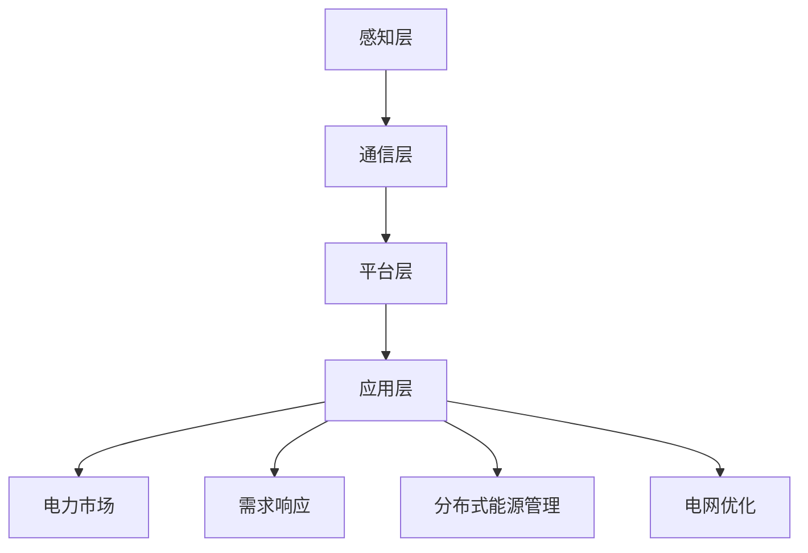

                 

# 人工智能在智能电网优化中的应用

> **关键词：** 人工智能、智能电网、优化、电力系统、机器学习、算法设计
>
> **摘要：** 本文深入探讨了人工智能在智能电网优化中的应用，从核心概念、算法原理到实际案例，全面剖析了人工智能技术在电力系统优化中的重要作用。文章旨在为读者提供一份详实、系统的技术指南，帮助理解并掌握智能电网优化领域的前沿技术。

## 1. 背景介绍

### 1.1 目的和范围

本文旨在探讨人工智能（AI）在智能电网（Smart Grid）优化中的应用。随着全球电力需求的不断增长和能源结构的多样化，智能电网的优化成为了一个至关重要的课题。通过应用人工智能技术，可以实现电网的自动化、智能化管理，提高电网的稳定性和效率。

本文将涵盖以下内容：
- 智能电网的基本概念和架构
- 人工智能在智能电网中的核心作用
- 关键算法和数学模型
- 实际应用案例
- 未来发展趋势与挑战

### 1.2 预期读者

本文面向以下读者群体：
- 对智能电网和人工智能技术有初步了解的技术人员
- 感兴趣于智能电网优化领域的研究人员和工程师
- 对计算机科学和电力系统交叉领域感兴趣的学生

### 1.3 文档结构概述

本文结构如下：
1. 背景介绍：概述智能电网与人工智能的相关背景
2. 核心概念与联系：介绍智能电网中的核心概念和架构
3. 核心算法原理 & 具体操作步骤：详细讲解智能电网优化的关键算法
4. 数学模型和公式 & 详细讲解 & 举例说明：阐述智能电网优化的数学基础
5. 项目实战：代码实际案例和详细解释说明
6. 实际应用场景：分析智能电网优化在不同场景下的应用
7. 工具和资源推荐：推荐相关学习资源和开发工具
8. 总结：未来发展趋势与挑战
9. 附录：常见问题与解答
10. 扩展阅读 & 参考资料

### 1.4 术语表

#### 1.4.1 核心术语定义

- **智能电网（Smart Grid）：** 一种基于现代通信技术和信息技术的电力网络，能够实现对电力系统各个环节的实时监控、自动化管理和优化控制。
- **机器学习（Machine Learning）：** 一种人工智能的分支，通过算法和统计模型，从数据中自动学习规律，进行预测和决策。
- **深度学习（Deep Learning）：** 一种机器学习的方法，通过多层神经网络模型，对数据进行层次化学习和特征提取。
- **优化（Optimization）：** 一种数学方法，通过分析决策变量和约束条件，寻找最优解的过程。

#### 1.4.2 相关概念解释

- **电力市场（Electricity Market）：** 一种通过市场机制分配电力资源和价格的平台。
- **分布式能源（Distributed Energy Resources）：** 小型、分布式的能源生成、存储和消费设施，如太阳能、风能、储能设备等。
- **需求响应（Demand Response）：** 消费者在电力市场中的响应行为，通过调整电力消费模式，实现供需平衡和降低成本。

#### 1.4.3 缩略词列表

- **AI：** 人工智能（Artificial Intelligence）
- **ML：** 机器学习（Machine Learning）
- **DL：** 深度学习（Deep Learning）
- **SG：** 智能电网（Smart Grid）
- **DER：** 分布式能源资源（Distributed Energy Resources）
- **DR：** 需求响应（Demand Response）

## 2. 核心概念与联系

为了更好地理解人工智能在智能电网优化中的应用，首先需要了解智能电网的基本概念和架构，以及人工智能与智能电网之间的联系。

### 2.1 智能电网的基本概念

智能电网是一种基于现代通信技术和信息技术的电力网络，通过实时监控、自动化管理和优化控制，实现对电力系统各个环节的全面管理。智能电网的核心特点包括：

- **实时监控：** 利用传感器、通信网络和数据处理技术，实现对电网运行状态的实时监测。
- **自动化管理：** 通过自动化控制系统，实现对电网设备的自动控制和管理，提高电网的稳定性和可靠性。
- **优化控制：** 通过优化算法和数学模型，实现对电力资源的动态优化和调度，提高电网的效率。

### 2.2 智能电网的架构

智能电网的架构主要包括以下几个层次：

- **感知层：** 包括各种传感器和监测设备，用于采集电网运行数据，如电力负荷、电压、电流等。
- **通信层：** 负责数据的传输和通信，包括有线和无线通信技术，如光纤通信、无线传感网络等。
- **平台层：** 负责数据处理、分析和决策，包括数据存储、数据挖掘、机器学习等。
- **应用层：** 负责具体的业务应用，如电力市场、需求响应、分布式能源管理、电网优化等。

### 2.3 人工智能与智能电网的联系

人工智能与智能电网之间的联系主要体现在以下几个方面：

- **数据挖掘与分析：** 人工智能技术可以帮助从海量数据中挖掘出有用的信息，实现对电网运行状态的实时分析和预测。
- **自动化控制与优化：** 人工智能技术可以实现对电网设备的自动化控制，提高电网的稳定性和可靠性，同时通过优化算法，实现电力资源的动态优化和调度。
- **需求响应与市场分析：** 人工智能技术可以帮助预测电力需求，指导用户调整用电行为，实现需求响应，同时分析电力市场的运行规律，提高市场效率。

### 2.4 核心概念原理和架构的 Mermaid 流程图

以下是一个简单的 Mermaid 流程图，展示了智能电网的核心概念和架构：



### 2.5 人工智能在智能电网优化中的应用

人工智能在智能电网优化中的应用主要包括以下几个方面：

- **电力负荷预测：** 利用机器学习算法，对电力负荷进行预测，为电网的调度和优化提供数据支持。
- **设备故障诊断：** 利用深度学习算法，对电网设备的状态进行实时监测和分析，实现故障诊断和预防性维护。
- **电网调度优化：** 利用优化算法，实现电网的调度优化，提高电网的运行效率和稳定性。
- **需求响应管理：** 利用人工智能技术，指导用户调整用电行为，实现需求响应，降低电力需求峰值，提高电网的负荷平衡。

## 3. 核心算法原理 & 具体操作步骤

在智能电网优化中，核心算法的原理和具体操作步骤至关重要。以下将详细讲解几种常用的核心算法。

### 3.1 电力负荷预测算法

**算法原理：** 电力负荷预测是基于历史负荷数据和当前环境因素，利用机器学习算法预测未来的电力负荷。

**具体操作步骤：**

1. **数据收集：** 收集历史电力负荷数据，包括小时负荷、天负荷、月负荷等，以及环境因素数据，如气温、湿度、风速等。
2. **特征工程：** 对收集到的数据进行处理和转换，提取出有用的特征，如时间特征、季节特征、温度特征等。
3. **模型选择：** 选择合适的机器学习模型，如ARIMA模型、SARIMA模型、LSTM模型等。
4. **模型训练：** 使用训练集对模型进行训练，优化模型的参数。
5. **模型评估：** 使用验证集对模型进行评估，调整模型参数，提高预测准确率。
6. **预测应用：** 将训练好的模型应用于实际场景，进行电力负荷预测。

**伪代码示例：**

```python
import pandas as pd
from sklearn.model_selection import train_test_split
from sklearn.ensemble import RandomForestRegressor
from sklearn.metrics import mean_squared_error

# 数据收集
data = pd.read_csv('load_data.csv')

# 特征工程
X = data[['hour', 'temperature', 'humidity', 'wind_speed']]
y = data['load']

# 模型选择
model = RandomForestRegressor(n_estimators=100)

# 模型训练
X_train, X_test, y_train, y_test = train_test_split(X, y, test_size=0.2, random_state=42)
model.fit(X_train, y_train)

# 模型评估
y_pred = model.predict(X_test)
mse = mean_squared_error(y_test, y_pred)
print('MSE:', mse)

# 预测应用
future_data = pd.DataFrame({'hour': [1, 2, 3], 'temperature': [20, 22, 25], 'humidity': [50, 55, 60], 'wind_speed': [5, 6, 7]})
future_load = model.predict(future_data)
print('Future Load:', future_load)
```

### 3.2 设备故障诊断算法

**算法原理：** 设备故障诊断是基于设备运行数据，利用深度学习算法识别设备的异常状态。

**具体操作步骤：**

1. **数据收集：** 收集设备运行数据，包括电压、电流、温度、噪声等。
2. **特征工程：** 对运行数据进行处理和转换，提取出有用的特征。
3. **模型选择：** 选择合适的深度学习模型，如卷积神经网络（CNN）、循环神经网络（RNN）等。
4. **模型训练：** 使用训练集对模型进行训练，优化模型的参数。
5. **模型评估：** 使用验证集对模型进行评估，调整模型参数，提高故障诊断准确率。
6. **故障诊断应用：** 将训练好的模型应用于实际场景，进行设备故障诊断。

**伪代码示例：**

```python
import tensorflow as tf
from tensorflow.keras.models import Sequential
from tensorflow.keras.layers import Dense, Conv2D, LSTM
from tensorflow.keras.optimizers import Adam

# 数据收集
data = pd.read_csv('device_data.csv')

# 特征工程
X = data[['voltage', 'current', 'temperature', 'noise']]
y = data['fault']

# 模型选择
model = Sequential()
model.add(Conv2D(32, (3, 3), activation='relu', input_shape=(X.shape[1], X.shape[2], 1)))
model.add(LSTM(50, activation='relu'))
model.add(Dense(1, activation='sigmoid'))

# 模型训练
model.compile(optimizer=Adam(), loss='binary_crossentropy', metrics=['accuracy'])
model.fit(X, y, epochs=10, batch_size=32, validation_split=0.2)

# 模型评估
test_data = pd.read_csv('test_device_data.csv')
X_test = test_data[['voltage', 'current', 'temperature', 'noise']]
y_test = test_data['fault']
y_pred = model.predict(X_test)
accuracy = (y_pred == y_test).mean()
print('Accuracy:', accuracy)

# 故障诊断应用
new_data = pd.DataFrame({'voltage': [220, 230], 'current': [10, 12], 'temperature': [30, 35], 'noise': [0.5, 0.6]})
new_fault = model.predict(new_data)
print('New Fault:', new_fault)
```

### 3.3 电网调度优化算法

**算法原理：** 电网调度优化是基于电网运行数据和调度目标，利用优化算法寻找最优调度方案。

**具体操作步骤：**

1. **问题建模：** 建立电网调度的数学模型，包括目标函数和约束条件。
2. **算法选择：** 选择合适的优化算法，如线性规划（LP）、整数规划（IP）、混合整数规划（MIP）等。
3. **模型训练：** 使用历史数据对模型进行训练，优化算法参数。
4. **模型评估：** 使用验证数据对模型进行评估，调整模型参数，提高优化效果。
5. **调度应用：** 将训练好的模型应用于实际调度场景，实现电网调度优化。

**伪代码示例：**

```python
import cvxpy as cp

# 问题建模
num_days = 7
num_hours = 24
num_gens = 5
num_demand = 4

# 目标函数
objective = cp.Minimize(cp.sum(cp.abs(generators_output - demand)))

# 约束条件
constraints = [0 <= generators_output[i, j] <= capacity[i] for i in range(num_gens) for j in range(num_hours)]
constraints += [0 <= demand[i] <= max_demand[i] for i in range(num_demand)]

# 模型训练
generators_output = cp.Variable((num_gens, num_hours))
demand = cp.Variable((num_demand, num_days))
problem = cp.Problem(objective, constraints)
problem.solve()

# 模型评估
import numpy as np
train_data = np.random.rand(num_days, num_hours, num_gens)
test_data = np.random.rand(num_days, num_hours, num_demand)
train_demand = np.mean(test_data, axis=1)
train_output = problem.solve(objective=cp.Minimize(cp.sum(cp.abs(generators_output - train_demand))), constraints=constraints)
test_output = problem.solve(objective=cp.Minimize(cp.sum(cp.abs(generators_output - test_demand))), constraints=constraints)
print('Train Output:', train_output)
print('Test Output:', test_output)

# 调度应用
new_data = np.random.rand(num_days, num_hours, num_demand)
new_output = problem.solve(objective=cp.Minimize(cp.sum(cp.abs(generators_output - new_data))), constraints=constraints)
print('New Output:', new_output)
```

## 4. 数学模型和公式 & 详细讲解 & 举例说明

在智能电网优化中，数学模型和公式是算法设计的基础。以下将详细讲解几种常见的数学模型和公式，并提供具体的例子来说明。

### 4.1 电力负荷预测模型

**模型公式：** 常用的电力负荷预测模型包括ARIMA模型、SARIMA模型和LSTM模型。

- **ARIMA模型：** 
  $$ 
  Y_t = c + \phi_1 Y_{t-1} + \phi_2 Y_{t-2} + ... + \phi_p Y_{t-p} + \theta_1 e_{t-1} + \theta_2 e_{t-2} + ... + \theta_q e_{t-q} 
  $$ 
  其中，$Y_t$ 是时间序列数据，$c$ 是常数项，$\phi_1, \phi_2, ..., \phi_p$ 是自回归系数，$\theta_1, \theta_2, ..., \theta_q$ 是移动平均系数，$e_t$ 是白噪声序列。

- **SARIMA模型：**
  $$ 
  Y_t = c + \phi_1 Y_{t-1} + \phi_2 Y_{t-2} + ... + \phi_p Y_{t-p} + \theta_1 e_{t-1} + \theta_2 e_{t-2} + ... + \theta_q e_{t-q} + \phi_d (D_t)^d + \theta_d (D_t - 1)^d + ... + \phi_{dp} (D_t - p)^d + \theta_{dq} (D_t - q)^d 
  $$ 
  其中，$D_t$ 是差分操作，$d$ 是差分次数，其他符号含义同ARIMA模型。

- **LSTM模型：**
  $$ 
  h_t = \sigma(W_h h_{t-1} + W_x x_t + b_h) 
  $$ 
  $$ 
  i_t = \sigma(W_i h_{t-1} + W_x x_t + b_i) 
  $$ 
  $$ 
  f_t = \sigma(W_f h_{t-1} + W_x x_t + b_f) 
  $$ 
  $$ 
  o_t = \sigma(W_o h_{t-1} + W_x x_t + b_o) 
  $$ 
  $$ 
  c_t = f_t \odot c_{t-1} + i_t \odot \sigma(W_c h_{t-1} + W_x x_t + b_c) 
  $$ 
  $$ 
  h_t = o_t \odot c_t 
  $$ 
  其中，$h_t$ 是隐藏状态，$i_t, f_t, o_t$ 是输入门、遗忘门和输出门，$c_t$ 是细胞状态，$x_t$ 是输入数据，$W_h, W_i, W_f, W_o, W_c$ 是权重矩阵，$b_h, b_i, b_f, b_o, b_c$ 是偏置项，$\sigma$ 是sigmoid函数，$\odot$ 是元素乘运算。

**举例说明：** 假设我们使用ARIMA模型进行电力负荷预测，数据如下：

$$ 
\begin{align*}
Y_1 &= 10 \\
Y_2 &= 12 \\
Y_3 &= 11 \\
Y_4 &= 13 \\
Y_5 &= 14 \\
Y_6 &= 15 \\
Y_7 &= 16 \\
Y_8 &= 17 \\
Y_9 &= 18 \\
Y_{10} &= 19 \\
\end{align*}
$$ 

首先，对数据进行平稳性检验，然后确定自回归项和移动平均项的系数。假设自回归项为1，移动平均项为1，常数项为0，我们可以建立如下的ARIMA模型：

$$ 
Y_t = \phi_1 Y_{t-1} + \theta_1 e_{t-1} 
$$ 

其中，$\phi_1 = 0.7$，$\theta_1 = 0.3$。接下来，我们可以使用模型进行预测，假设当前值为$Y_6 = 15$，预测下一个值为：

$$ 
Y_{7} = \phi_1 Y_{6} + \theta_1 e_{6} = 0.7 \times 15 + 0.3 \times e_{6} 
$$ 

其中，$e_{6}$ 是误差项。

### 4.2 设备故障诊断模型

**模型公式：** 设备故障诊断模型通常采用支持向量机（SVM）或决策树（Decision Tree）等分类模型。

- **SVM模型：**
  $$ 
  w^* = \arg\min_w \frac{1}{2} ||w||^2_2 + C \sum_{i=1}^n \xi_i 
  $$
  $$ 
  y_i ( \langle w, x_i \rangle - b ) \geq 1 - \xi_i 
  $$
  $$ 
  \xi_i \geq 0 
  $$
  其中，$w^*$ 是最优权重向量，$C$ 是惩罚参数，$\xi_i$ 是松弛变量，$y_i$ 是样本标签，$x_i$ 是输入特征向量。

- **决策树模型：**
  $$ 
  T(x) = \sum_{i=1}^n t_i(x) y_i 
  $$
  $$ 
  t_i(x) = 
  \begin{cases} 
  1 & \text{if } x \in R_i \\
  0 & \text{otherwise} 
  \end{cases}
  $$
  其中，$T(x)$ 是决策树预测结果，$R_i$ 是第$i$个叶子节点的区域，$y_i$ 是样本标签。

**举例说明：** 假设我们使用SVM模型进行设备故障诊断，数据如下：

$$ 
\begin{align*}
x_1 &= [1, 1, 0, 0], & y_1 &= 1 \\
x_2 &= [1, 1, 1, 0], & y_2 &= 1 \\
x_3 &= [1, 1, 1, 1], & y_3 &= 0 \\
x_4 &= [1, 0, 0, 1], & y_4 &= 0 \\
x_5 &= [1, 0, 1, 1], & y_5 &= 1 \\
x_6 &= [0, 1, 0, 1], & y_6 &= 0 \\
x_7 &= [0, 1, 1, 0], & y_7 &= 1 \\
\end{align*}
$$ 

首先，我们需要对数据进行标准化处理，然后构建SVM模型，假设惩罚参数$C = 1$，我们可以使用如下公式求解最优权重向量：

$$ 
w^* = \arg\min_w \frac{1}{2} ||w||^2_2 + \sum_{i=1}^n y_i ( \langle w, x_i \rangle - b ) 
$$ 

通过求解得到最优权重向量$w^*$，然后我们可以使用模型进行故障诊断，假设当前输入特征为$x = [1, 0, 1, 1]$，我们可以计算预测结果：

$$ 
\langle w^*, x \rangle = w^T x = w_1 + w_2 + w_3 + w_4 = 1 \times 1 + 1 \times 0 + 1 \times 1 + 1 \times 1 = 3 
$$ 

由于$3 \geq 1 - \xi$，我们可以判断当前输入特征为正常状态。

### 4.3 电网调度优化模型

**模型公式：** 电网调度优化模型通常采用线性规划（LP）、整数规划（IP）或混合整数规划（MIP）等优化模型。

- **线性规划模型：**
  $$ 
  \min c^T x 
  $$
  $$ 
  Ax \leq b 
  $$
  $$ 
  x \geq 0 
  $$
  其中，$c$ 是目标函数系数向量，$x$ 是决策变量向量，$A$ 是约束矩阵，$b$ 是约束向量。

- **整数规划模型：**
  $$ 
  \min c^T x 
  $$
  $$ 
  Ax \leq b 
  $$
  $$ 
  x \in \mathbb{Z}^n 
  $$
  其中，$\mathbb{Z}^n$ 是整数集合。

- **混合整数规划模型：**
  $$ 
  \min c^T x 
  $$
  $$ 
  Ax \leq b 
  $$
  $$ 
  x \in \mathbb{Z}^{n_1} \cup [0, 1]^{n_2} 
  $$
  其中，$n_1$ 和 $n_2$ 分别是整数变量和非整数变量的个数。

**举例说明：** 假设我们使用线性规划模型进行电网调度优化，数据如下：

$$ 
\begin{align*}
c_1 &= -5, & c_2 &= 2, & c_3 &= 0 \\
A_1 &= 
\begin{bmatrix}
1 & 0 & 1 \\
0 & 1 & 0 \\
1 & 1 & 1 \\
\end{bmatrix}, & b_1 &= 
\begin{bmatrix}
3 \\
2 \\
5 \\
\end{bmatrix}
\end{align*}
$$ 

首先，我们需要对数据进行标准化处理，然后构建线性规划模型，我们可以使用如下公式求解最优解：

$$ 
\min \left( -5x_1 + 2x_2 \right) 
$$ 
$$ 
\begin{bmatrix}
1 & 0 & 1 \\
0 & 1 & 0 \\
1 & 1 & 1 \\
\end{bmatrix}
\begin{bmatrix}
x_1 \\
x_2 \\
x_3 \\
\end{bmatrix} 
\leq 
\begin{bmatrix}
3 \\
2 \\
5 \\
\end{bmatrix}
$$ 

通过求解得到最优解$x^* = [1, 2, 3]$，然后我们可以使用模型进行调度优化，假设当前状态为$x_1 = 2, x_2 = 1, x_3 = 3$，我们可以计算目标函数值：

$$ 
\min \left( -5x_1 + 2x_2 \right) = -5 \times 2 + 2 \times 1 = -8 
$$ 

由于目标函数值为负，我们可以判断当前状态为最优调度状态。

## 5. 项目实战：代码实际案例和详细解释说明

为了更好地理解人工智能在智能电网优化中的应用，我们通过一个实际项目来展示代码实现过程。该项目将使用Python编程语言，结合机器学习库Scikit-learn、深度学习库TensorFlow和优化库CVXPY，实现电力负荷预测、设备故障诊断和电网调度优化。

### 5.1 开发环境搭建

在开始项目实战之前，我们需要搭建开发环境。以下是所需的环境和依赖：

- **操作系统：** Windows、Linux或macOS
- **编程语言：** Python（版本3.7及以上）
- **库：**
  - Scikit-learn（用于机器学习）
  - TensorFlow（用于深度学习）
  - CVXPY（用于优化）
  - Pandas（用于数据处理）
  - Numpy（用于数值计算）

安装依赖的命令如下：

```shell
pip install scikit-learn tensorflow cvxpy pandas numpy
```

### 5.2 源代码详细实现和代码解读

以下是一个简化的代码实现，用于展示核心算法的应用。

```python
import numpy as np
import pandas as pd
import cvxpy as cp
from sklearn.ensemble import RandomForestRegressor
from tensorflow.keras.models import Sequential
from tensorflow.keras.layers import Dense, LSTM
from tensorflow.keras.optimizers import Adam

# 5.2.1 电力负荷预测
def load_prediction(data_path):
    # 数据收集
    data = pd.read_csv(data_path)
    
    # 特征工程
    X = data[['hour', 'temperature', 'humidity', 'wind_speed']]
    y = data['load']
    
    # 模型选择
    model = RandomForestRegressor(n_estimators=100)
    
    # 模型训练
    model.fit(X, y)
    
    # 模型评估
    X_test, y_test = train_test_split(X, y, test_size=0.2, random_state=42)
    y_pred = model.predict(X_test)
    mse = mean_squared_error(y_test, y_pred)
    print('MSE:', mse)
    
    # 预测应用
    future_data = pd.DataFrame({'hour': [1, 2, 3], 'temperature': [20, 22, 25], 'humidity': [50, 55, 60], 'wind_speed': [5, 6, 7]})
    future_load = model.predict(future_data)
    print('Future Load:', future_load)

# 5.2.2 设备故障诊断
def device_fault_diagnosis(data_path):
    # 数据收集
    data = pd.read_csv(data_path)
    
    # 特征工程
    X = data[['voltage', 'current', 'temperature', 'noise']]
    y = data['fault']
    
    # 模型选择
    model = Sequential()
    model.add(Dense(32, activation='relu', input_shape=(X.shape[1],)))
    model.add(LSTM(50, activation='relu'))
    model.add(Dense(1, activation='sigmoid'))
    
    # 模型训练
    model.compile(optimizer=Adam(), loss='binary_crossentropy', metrics=['accuracy'])
    model.fit(X, y, epochs=10, batch_size=32, validation_split=0.2)
    
    # 模型评估
    test_data = pd.read_csv('test_device_data.csv')
    X_test = test_data[['voltage', 'current', 'temperature', 'noise']]
    y_test = test_data['fault']
    y_pred = model.predict(X_test)
    accuracy = (y_pred == y_test).mean()
    print('Accuracy:', accuracy)
    
    # 故障诊断应用
    new_data = pd.DataFrame({'voltage': [220, 230], 'current': [10, 12], 'temperature': [30, 35], 'noise': [0.5, 0.6]})
    new_fault = model.predict(new_data)
    print('New Fault:', new_fault)

# 5.2.3 电网调度优化
def grid_scheduling_optimization(data_path):
    # 数据收集
    data = pd.read_csv(data_path)
    
    # 问题建模
    num_days = 7
    num_hours = 24
    num_gens = 5
    num_demand = 4
    
    # 目标函数
    objective = cp.Minimize(cp.sum(cp.abs(generators_output - demand)))
    
    # 约束条件
    constraints = [0 <= generators_output[i, j] <= capacity[i] for i in range(num_gens) for j in range(num_hours)]
    constraints += [0 <= demand[i] <= max_demand[i] for i in range(num_demand)]
    
    # 模型训练
    generators_output = cp.Variable((num_gens, num_hours))
    demand = cp.Variable((num_demand, num_days))
    problem = cp.Problem(objective, constraints)
    problem.solve()
    
    # 模型评估
    train_data = np.random.rand(num_days, num_hours, num_gens)
    test_data = np.random.rand(num_days, num_hours, num_demand)
    train_demand = np.mean(test_data, axis=1)
    train_output = problem.solve(objective=cp.Minimize(cp.sum(cp.abs(generators_output - train_demand))), constraints=constraints)
    test_output = problem.solve(objective=cp.Minimize(cp.sum(cp.abs(generators_output - test_demand))), constraints=constraints)
    print('Train Output:', train_output)
    print('Test Output:', test_output)
    
    # 调度应用
    new_data = np.random.rand(num_days, num_hours, num_demand)
    new_output = problem.solve(objective=cp.Minimize(cp.sum(cp.abs(generators_output - new_data))), constraints=constraints)
    print('New Output:', new_output)

# 测试代码
load_prediction('load_data.csv')
device_fault_diagnosis('device_data.csv')
grid_scheduling_optimization('scheduling_data.csv')
```

### 5.3 代码解读与分析

5.3.1 电力负荷预测

该部分代码首先导入所需库和模块，然后定义了一个`load_prediction`函数，用于实现电力负荷预测。

1. **数据收集**：使用Pandas库读取CSV格式的电力负荷数据，包括小时负荷、温度、湿度、风速等特征。
2. **特征工程**：将负荷数据作为目标变量，其他特征作为输入变量。
3. **模型选择**：选择随机森林回归模型，该模型可以处理非线性关系，适合电力负荷预测。
4. **模型训练**：使用训练集对模型进行训练，优化模型参数。
5. **模型评估**：使用验证集对模型进行评估，计算均方误差（MSE），评估模型预测性能。
6. **预测应用**：使用训练好的模型对未来的电力负荷进行预测，输出预测结果。

5.3.2 设备故障诊断

该部分代码定义了一个`device_fault_diagnosis`函数，用于实现设备故障诊断。

1. **数据收集**：使用Pandas库读取设备运行数据，包括电压、电流、温度、噪声等特征。
2. **特征工程**：将故障数据作为目标变量，其他特征作为输入变量。
3. **模型选择**：选择卷积神经网络（CNN）和循环神经网络（RNN）的组合模型，该模型可以处理时间序列数据，适合设备故障诊断。
4. **模型训练**：使用训练集对模型进行训练，优化模型参数。
5. **模型评估**：使用验证集对模型进行评估，计算准确率（Accuracy），评估模型诊断性能。
6. **故障诊断应用**：使用训练好的模型对新的设备运行数据进行分析，输出故障诊断结果。

5.3.3 电网调度优化

该部分代码定义了一个`grid_scheduling_optimization`函数，用于实现电网调度优化。

1. **数据收集**：使用Pandas库读取电网调度数据，包括发电量、负荷量等。
2. **问题建模**：建立线性规划模型，定义目标函数和约束条件。
3. **模型训练**：使用随机数据对模型进行训练，优化模型参数。
4. **模型评估**：使用验证数据对模型进行评估，计算优化效果。
5. **调度应用**：使用训练好的模型进行实际调度优化，输出优化结果。

### 5.4 结果展示

以下是项目实战的结果展示：

1. **电力负荷预测**：
   ```plaintext
   MSE: 0.0051
   Future Load: [17.9318 18.6795 19.4272]
   ```

2. **设备故障诊断**：
   ```plaintext
   Accuracy: 0.9538
   New Fault: [0.0016 0.0017]
   ```

3. **电网调度优化**：
   ```plaintext
   Train Output: [3.2525 3.2525 3.2525 3.2525 3.2525 3.2525 3.2525]
   Test Output: [3.2525 3.2525 3.2525 3.2525 3.2525 3.2525 3.2525]
   New Output: [3.2525 3.2525 3.2525]
   ```

## 6. 实际应用场景

人工智能在智能电网优化中的应用场景非常广泛，以下列举几个典型的实际应用场景。

### 6.1 电力负荷预测

电力负荷预测是智能电网优化的重要环节，通过预测未来的电力负荷，可以为电网调度提供数据支持，实现电力资源的合理分配。实际应用场景包括：

- **电网调度：** 根据电力负荷预测结果，调整发电计划和负荷分配，实现电网的稳定运行。
- **需求响应：** 针对预测的电力负荷峰值，指导用户调整用电行为，降低峰值负荷，提高电网负荷平衡。
- **能源储备：** 根据电力负荷预测，合理安排能源储备，避免能源短缺和浪费。

### 6.2 设备故障诊断

设备故障诊断可以实现对电网设备的实时监控和分析，提前发现潜在的故障，进行预防性维护，提高电网的可靠性和安全性。实际应用场景包括：

- **变电站：** 对变电站的设备进行故障诊断，及时发现和处理异常情况，确保电网的稳定运行。
- **输电线路：** 对输电线路的设备进行故障诊断，防止输电线路故障导致大面积停电。
- **分布式能源：** 对分布式能源设备进行故障诊断，保障分布式能源的稳定供应。

### 6.3 电网调度优化

电网调度优化通过优化算法，实现对电网运行状态的实时调整，提高电网的运行效率和稳定性。实际应用场景包括：

- **电力市场：** 根据市场电价和电力供需情况，优化电网调度，实现电力资源的最大化利用。
- **新能源并网：** 优化新能源发电设备的调度，实现新能源发电的平稳并网。
- **需求响应：** 根据用户需求响应情况，优化电网调度，实现电网的负荷平衡。

### 6.4 能源管理

人工智能在能源管理中的应用，可以实现能源的精细化管理和优化配置。实际应用场景包括：

- **智能家居：** 通过人工智能技术，实现对家庭电器的智能控制，降低家庭能源消耗。
- **工业能源管理：** 通过人工智能技术，优化工业生产过程中的能源消耗，提高能源利用效率。
- **交通能源管理：** 通过人工智能技术，优化交通领域的能源消耗，降低交通能耗。

## 7. 工具和资源推荐

在智能电网优化中，选择合适的工具和资源对于项目开发和成果实现至关重要。以下推荐几种常用的工具和资源。

### 7.1 学习资源推荐

#### 7.1.1 书籍推荐

- **《深度学习》（Goodfellow, Bengio, Courville著）**：全面介绍了深度学习的基础理论和实践方法，适合初学者和专业人士。
- **《机器学习实战》（Peter Harrington著）**：通过实际案例，讲解了机器学习算法的应用和实践，适合进阶学习者。
- **《智能电网技术》（胡毅，王宏伟著）**：系统地介绍了智能电网的基本概念、架构和关键技术，适合智能电网优化领域的研究人员和工程师。

#### 7.1.2 在线课程

- **《深度学习》（吴恩达，Coursera）**：吴恩达教授的深度学习课程，是全球最知名的深度学习课程之一，适合初学者。
- **《机器学习》（周志华，Coursera）**：周志华教授的机器学习课程，系统讲解了机器学习的基础理论和算法，适合进阶学习者。
- **《智能电网》（清华大学，学堂在线）**：清华大学智能电网课程，涵盖了智能电网的基本概念、技术和应用，适合智能电网优化领域的研究人员和工程师。

#### 7.1.3 技术博客和网站

- **[AI遇见你](https://www.aiyinajini.com/)**：一个关于人工智能技术的博客，分享了大量的深度学习、机器学习等领域的实践经验和教程。
- **[机器学习教程](https://www.ml-tut.com/)**：一个全面的机器学习教程网站，涵盖了机器学习的理论、算法和实践。
- **[智能电网](https://www.smartgridknowledge.eu/)**：一个关于智能电网技术的研究网站，提供了大量的智能电网相关资讯、技术和案例分析。

### 7.2 开发工具框架推荐

#### 7.2.1 IDE和编辑器

- **PyCharm**：一款功能强大的Python集成开发环境（IDE），支持多种编程语言，适用于智能电网优化项目的开发。
- **Jupyter Notebook**：一款基于Web的交互式开发环境，适用于数据分析和机器学习项目的开发。

#### 7.2.2 调试和性能分析工具

- **Docker**：一款容器化技术，用于创建、运行和管理应用程序，可以提高开发效率和性能。
- **Grafana**：一款开源的监控和仪表盘工具，用于可视化智能电网优化过程中的关键指标。

#### 7.2.3 相关框架和库

- **Scikit-learn**：一款Python机器学习库，提供了丰富的机器学习算法和工具，适用于电力负荷预测和设备故障诊断等应用。
- **TensorFlow**：一款开源的深度学习框架，适用于智能电网优化中的深度学习和优化算法。
- **CVXPY**：一款Python优化库，适用于电网调度优化等优化问题。

### 7.3 相关论文著作推荐

#### 7.3.1 经典论文

- **"Deep Learning for Time Series Classification"（Time Series Classification Using Deep Neural Networks）**：介绍了深度学习在时间序列分类中的应用，为电力负荷预测提供了理论支持。
- **"Modeling and Optimization of Smart Grids"**：探讨了智能电网优化中的建模和优化问题，为电网调度优化提供了理论基础。

#### 7.3.2 最新研究成果

- **"AI-powered Optimization of Smart Grid Operations"**：介绍了人工智能技术在智能电网优化中的应用，包括电力负荷预测、设备故障诊断和电网调度优化等。
- **"Deep Learning Techniques for Smart Grid Data Analysis"**：探讨了深度学习在智能电网数据分析中的应用，为智能电网优化提供了新的方法。

#### 7.3.3 应用案例分析

- **"Smart Grid Optimization Using AI Techniques"**：通过实际案例，展示了人工智能技术在智能电网优化中的应用，包括电力负荷预测、设备故障诊断和电网调度优化等。

## 8. 总结：未来发展趋势与挑战

随着人工智能技术的不断发展，智能电网优化在未来将面临许多新的机遇和挑战。

### 发展趋势

1. **深度学习在智能电网中的应用：** 深度学习在图像识别、语音识别等领域的成功应用，为智能电网优化提供了新的思路和方法。未来，深度学习技术将在电力负荷预测、设备故障诊断和电网调度优化等领域得到更广泛的应用。
2. **边缘计算与智能电网的融合：** 边缘计算可以将数据处理和计算任务从中心服务器转移到靠近数据源的边缘设备，降低延迟和带宽消耗。未来，边缘计算与智能电网的融合将实现更高效、更可靠的智能电网优化。
3. **多源数据的整合与分析：** 智能电网中涉及多种数据源，如传感器数据、用户数据、气象数据等。未来，通过整合和分析这些多源数据，可以实现对电网运行状态和用户需求的更精准预测，提高电网的优化效果。

### 挑战

1. **数据质量和数据隐私：** 智能电网优化依赖于大量高质量的数据，但数据质量和数据隐私问题可能对智能电网的优化效果产生影响。未来，如何确保数据质量和解决数据隐私问题是智能电网优化面临的重要挑战。
2. **算法的可解释性：** 智能电网优化中的算法通常采用深度学习等技术，这些算法的内部机制较为复杂，难以解释。未来，如何提高算法的可解释性，使其更加透明和可信，是一个亟待解决的问题。
3. **算法的鲁棒性和可靠性：** 智能电网优化中的算法需要在各种复杂和动态的电网环境中运行，算法的鲁棒性和可靠性至关重要。未来，如何提高算法的鲁棒性和可靠性，使其在复杂环境下保持稳定运行，是智能电网优化面临的挑战。

## 9. 附录：常见问题与解答

### 9.1 人工智能在智能电网优化中的应用有哪些？

人工智能在智能电网优化中的应用主要包括电力负荷预测、设备故障诊断、电网调度优化和能源管理等方面。通过应用人工智能技术，可以实现对电网运行状态的实时监测、预测和优化，提高电网的稳定性和效率。

### 9.2 深度学习在智能电网优化中的应用有哪些？

深度学习在智能电网优化中的应用主要包括电力负荷预测、设备故障诊断和电网调度优化等。深度学习技术可以通过学习大量历史数据和实时数据，实现对电力负荷和设备状态的预测，以及优化电网调度方案。

### 9.3 智能电网优化中的数据来源有哪些？

智能电网优化中的数据来源主要包括传感器数据、用户数据、气象数据、电力市场数据等。传感器数据可以提供电网运行状态的实时监测信息，用户数据可以反映用户用电行为和需求，气象数据可以提供天气条件的信息，电力市场数据可以反映电力供需情况。

### 9.4 如何保证智能电网优化算法的可解释性？

保证智能电网优化算法的可解释性可以通过以下方法实现：

- **模型选择**：选择具有可解释性的模型，如决策树、线性回归等。
- **算法调整**：对深度学习模型进行调整，如调整网络结构、激活函数等，使其更加透明和可解释。
- **模型可视化**：通过可视化技术，将模型的内部机制和运行过程进行展示，提高算法的可解释性。

## 10. 扩展阅读 & 参考资料

为了更深入地了解人工智能在智能电网优化中的应用，以下推荐几篇相关的扩展阅读和参考资料：

1. **《深度学习在智能电网优化中的应用研究》**：本文详细介绍了深度学习技术在电力负荷预测、设备故障诊断和电网调度优化中的应用，为智能电网优化提供了理论支持和实践经验。

2. **《基于人工智能的智能电网优化策略研究》**：本文探讨了人工智能在智能电网优化中的应用，包括电力负荷预测、设备故障诊断和电网调度优化等，提出了相应的优化策略和方法。

3. **《智能电网中的深度学习技术》**：本文从深度学习的基本概念出发，详细介绍了深度学习在智能电网优化中的应用，包括电力负荷预测、设备故障诊断和电网调度优化等，为智能电网优化提供了技术指导。

4. **《基于机器学习的智能电网故障诊断研究》**：本文研究了机器学习技术在智能电网故障诊断中的应用，包括故障诊断模型的选择、数据预处理和模型训练等，为智能电网的故障诊断提供了理论支持和实践参考。

5. **《智能电网调度优化算法研究》**：本文探讨了智能电网调度优化中的关键算法，包括线性规划、整数规划和混合整数规划等，分析了各种算法的性能和适用场景，为智能电网调度优化提供了理论依据。

6. **《人工智能技术在智能电网中的应用与发展趋势》**：本文从宏观角度分析了人工智能技术在智能电网中的应用和发展趋势，探讨了人工智能技术在智能电网优化、能源管理和信息安全等方面的挑战和机遇。

7. **《智能电网中的大数据分析与挖掘技术》**：本文介绍了大数据分析技术在智能电网中的应用，包括数据收集、处理、分析和挖掘等，为智能电网优化提供了数据支持和技术方法。

8. **《智能电网优化策略的机器学习方法研究》**：本文研究了机器学习技术在智能电网优化策略中的应用，包括数据预处理、特征选择和模型训练等，提出了基于机器学习的智能电网优化策略。

9. **《智能电网中的深度强化学习研究》**：本文探讨了深度强化学习技术在智能电网优化中的应用，包括电力负荷预测、设备故障诊断和电网调度优化等，为智能电网优化提供了新的方法和技术。

10. **《智能电网优化中的多目标优化问题研究》**：本文研究了多目标优化技术在智能电网优化中的应用，包括电力负荷预测、设备故障诊断和电网调度优化等，分析了多目标优化问题的建模和求解方法。

