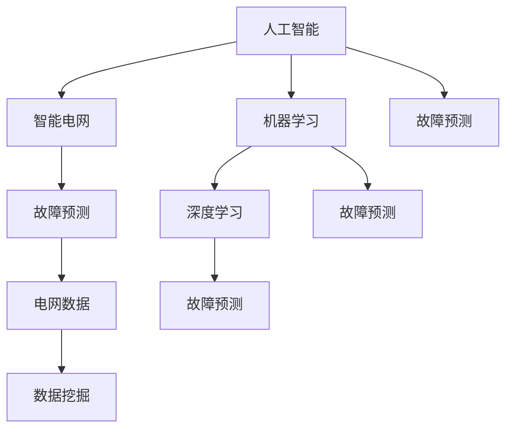

                 

### 1. 背景介绍

智能电网是现代电力系统的核心组成部分，旨在实现电力传输、分配和消费的智能化。随着可再生能源的普及和电力需求的增长，智能电网的稳定性与可靠性显得尤为重要。然而，由于电网系统的复杂性，故障预测和快速响应成为了一项极具挑战性的任务。

传统的电网故障预测方法主要依赖于历史数据和经验模型，例如统计分析和模式识别。然而，这些方法在面对大量复杂数据时往往显得力不从心。此外，电网故障的发生通常具有随机性和突发性，传统方法难以捕捉到这些动态变化。

为了提高电网故障预测的准确性和实时性，人工智能（AI）技术应运而生。人工智能，尤其是机器学习和深度学习算法，在处理大规模数据和模式识别方面表现出色。通过引入AI技术，可以实现对电网运行状态的实时监控和分析，从而提前预警潜在故障。

本文将探讨人工智能在智能电网故障预测中的应用，从核心概念、算法原理、数学模型到实际案例，全方位解析这一技术。希望通过本文，能够为读者提供一份详细且系统的人工智能在智能电网故障预测中的指南。

### 2. 核心概念与联系

在深入探讨人工智能在智能电网故障预测中的应用之前，有必要首先明确几个核心概念，并理解它们之间的相互关系。

#### 2.1 人工智能（AI）

人工智能是指通过计算机程序实现人类智能行为的学科。其核心目标是通过模拟、延伸和扩展人类智能，实现智能体的自主学习和智能决策。人工智能可以分为弱人工智能和强人工智能，其中弱人工智能在特定领域表现出智能行为，而强人工智能则能够在任何领域表现出人类级别的智能。

#### 2.2 机器学习（Machine Learning）

机器学习是人工智能的一个重要分支，侧重于使计算机通过数据和经验自动改进性能。机器学习算法分为监督学习、无监督学习和强化学习。监督学习通过已有标签的数据来训练模型；无监督学习通过未标记的数据发现内在结构；强化学习则通过与环境的交互来学习最优策略。

#### 2.3 深度学习（Deep Learning）

深度学习是机器学习的一个子领域，基于多层神经网络来实现复杂的特征提取和模式识别。深度学习在图像识别、语音识别和自然语言处理等领域取得了显著成果。在电网故障预测中，深度学习算法可以处理大量的时序数据和复杂非线性关系。

#### 2.4 智能电网（Smart Grid）

智能电网是一种高度集成的电力系统，通过先进的信息和通信技术实现电力传输、分配和消费的智能化。智能电网具有自愈、自适应和自优化的能力，能够提高电网的可靠性和效率。智能电网的核心组成部分包括传感器网络、通信系统、控制中心和应用平台。

#### 2.5 故障预测（Fault Prediction）

故障预测是指通过分析电网运行数据，提前识别潜在故障并采取措施预防。故障预测的目的是减少停电时间、降低维修成本和提高电网可靠性。在智能电网中，故障预测是实现自愈和自适应功能的关键。

#### 2.6 电网数据（Power Grid Data）

电网数据是进行故障预测的重要依据。这些数据包括电力系统的各种运行参数，如电压、电流、功率因数、温度、湿度等。通过收集和分析这些数据，可以识别电网异常和潜在故障。

#### 2.7 数据挖掘（Data Mining）

数据挖掘是一种从大量数据中提取有价值信息的方法。在智能电网故障预测中，数据挖掘技术可以帮助从电网数据中发现潜在的模式和规律，从而提高故障预测的准确性。

#### 2.8 机器学习与智能电网故障预测的联系

机器学习与智能电网故障预测之间存在密切的联系。首先，机器学习算法可以处理大量的电网运行数据，识别出潜在的故障特征。其次，智能电网提供的实时数据流为机器学习算法提供了丰富的训练和测试数据集。最后，通过将机器学习算法与智能电网的控制系统相结合，可以实现故障预测的实时反馈和自适应调整。

### Mermaid 流程图

为了更清晰地展示这些核心概念之间的联系，我们可以使用Mermaid绘制一个流程图。以下是一个示例：



在这个流程图中，人工智能作为核心驱动力，通过机器学习和深度学习与智能电网、故障预测、电网数据和数据挖掘相互联系。通过这样的方式，我们可以更好地理解人工智能在智能电网故障预测中的应用。

### 3. 核心算法原理 & 具体操作步骤

在智能电网故障预测中，常用的核心算法包括机器学习算法、深度学习算法和预测模型。下面将详细介绍这些算法的原理以及具体操作步骤。

#### 3.1 机器学习算法

机器学习算法是智能电网故障预测的基础。其中，常用的机器学习算法包括支持向量机（SVM）、决策树（DT）、随机森林（RF）和K最近邻（KNN）等。

##### 3.1.1 支持向量机（SVM）

支持向量机是一种监督学习算法，通过将数据映射到高维空间，寻找一个最佳的超平面来分割数据。SVM的核心思想是最大化分类间隔，从而提高模型的泛化能力。

**具体操作步骤：**

1. **数据预处理**：对原始数据进行标准化处理，消除不同特征之间的尺度差异。

2. **特征选择**：利用相关性分析等方法选择对故障预测最有影响力的特征。

3. **训练模型**：使用已标记的数据集训练SVM模型。

4. **模型评估**：通过交叉验证和测试集评估模型的性能。

5. **参数调优**：根据模型评估结果调整参数，如正则化参数C和核函数类型。

**优缺点：**

- 优点：在处理高维数据和线性不可分问题方面表现优秀。
- 缺点：训练时间较长，对噪声数据敏感。

##### 3.1.2 决策树（DT）

决策树是一种基于树形结构的分类算法，通过递归地将数据集划分成子集，直到满足某个终止条件。决策树的每个节点代表一个特征，每个分支代表一个特征值。

**具体操作步骤：**

1. **数据预处理**：对原始数据进行预处理，如缺失值填充、异常值处理等。

2. **特征选择**：选择对故障预测有重要影响的特征。

3. **构建决策树**：根据信息增益、基尼不纯度等指标选择最佳特征进行划分。

4. **剪枝**：对决策树进行剪枝，防止过拟合。

5. **模型评估**：使用交叉验证和测试集评估模型性能。

**优缺点：**

- 优点：易于理解，解释性强。
- 缺点：容易过拟合，对噪声数据敏感。

##### 3.1.3 随机森林（RF）

随机森林是一种集成学习方法，通过构建多个决策树，并利用随机特征选择和样本采样来提高模型的预测性能。

**具体操作步骤：**

1. **数据预处理**：对原始数据进行标准化处理和特征选择。

2. **构建随机森林**：使用Bootstrap采样生成多个子数据集，对每个子数据集构建决策树。

3. **集成预测**：将多个决策树的预测结果进行投票或平均，得到最终预测结果。

4. **模型评估**：使用交叉验证和测试集评估模型性能。

**优缺点：**

- 优点：具有良好的预测性能和泛化能力。
- 缺点：计算复杂度高，对噪声数据敏感。

##### 3.1.4 K最近邻（KNN）

K最近邻是一种基于实例的学习方法，通过计算测试实例与训练实例之间的距离，选择距离最近的K个实例，并基于这些实例的标签进行预测。

**具体操作步骤：**

1. **数据预处理**：对原始数据进行标准化处理。

2. **计算距离**：使用欧几里得距离、曼哈顿距离等计算测试实例与训练实例之间的距离。

3. **选择邻居**：选择距离最近的K个邻居。

4. **投票预测**：对邻居的标签进行投票，得到最终预测结果。

5. **模型评估**：使用交叉验证和测试集评估模型性能。

**优缺点：**

- 优点：简单易懂，对噪声数据有一定的鲁棒性。
- 缺点：计算复杂度高，对高维数据效果不佳。

#### 3.2 深度学习算法

深度学习算法在处理大规模、高维数据和非线性关系方面具有显著优势。在智能电网故障预测中，常用的深度学习算法包括卷积神经网络（CNN）、循环神经网络（RNN）和长短时记忆网络（LSTM）等。

##### 3.2.1 卷积神经网络（CNN）

卷积神经网络是一种基于卷积操作的深度学习模型，主要用于图像和时序数据的处理。在智能电网故障预测中，CNN可以用于特征提取和故障检测。

**具体操作步骤：**

1. **数据预处理**：对时序数据进行归一化处理。

2. **构建CNN模型**：设计合适的网络结构，包括卷积层、池化层和全连接层。

3. **训练模型**：使用带有标签的训练数据集训练模型。

4. **模型评估**：使用交叉验证和测试集评估模型性能。

**优缺点：**

- 优点：具有较强的特征提取能力，适用于高维数据。
- 缺点：训练时间较长，对计算资源要求较高。

##### 3.2.2 循环神经网络（RNN）

循环神经网络是一种基于递归结构的神经网络，适用于处理序列数据。在智能电网故障预测中，RNN可以用于建模时序数据中的依赖关系。

**具体操作步骤：**

1. **数据预处理**：对时序数据进行归一化处理。

2. **构建RNN模型**：设计合适的网络结构，包括输入层、隐藏层和输出层。

3. **训练模型**：使用带有标签的训练数据集训练模型。

4. **模型评估**：使用交叉验证和测试集评估模型性能。

**优缺点：**

- 优点：适用于处理长短时依赖关系。
- 缺点：容易产生梯度消失和梯度爆炸问题。

##### 3.2.3 长短时记忆网络（LSTM）

长短时记忆网络是RNN的一种变体，通过引入记忆单元来解决RNN的梯度消失和梯度爆炸问题。在智能电网故障预测中，LSTM可以用于建模长期依赖关系。

**具体操作步骤：**

1. **数据预处理**：对时序数据进行归一化处理。

2. **构建LSTM模型**：设计合适的网络结构，包括输入层、隐藏层和输出层。

3. **训练模型**：使用带有标签的训练数据集训练模型。

4. **模型评估**：使用交叉验证和测试集评估模型性能。

**优缺点：**

- 优点：适用于处理长时依赖关系。
- 缺点：训练时间较长，对计算资源要求较高。

#### 3.3 预测模型

预测模型是智能电网故障预测的核心，常用的预测模型包括ARIMA模型、LSTM模型和GRU模型等。

##### 3.3.1 ARIMA模型

ARIMA模型是一种经典的时序预测模型，由自回归（AR）、差分（I）和移动平均（MA）三部分组成。在智能电网故障预测中，ARIMA模型可以用于预测电网运行参数的变化趋势。

**具体操作步骤：**

1. **数据预处理**：对时序数据进行差分处理，使其具备平稳性。

2. **模型参数确定**：通过ACF和PACF图确定ARIMA模型的参数（p, d, q）。

3. **构建ARIMA模型**：根据确定的参数构建ARIMA模型。

4. **模型训练**：使用历史数据训练模型。

5. **模型评估**：使用测试集评估模型性能。

**优缺点：**

- 优点：简单易用，适用于线性时序数据。
- 缺点：对非线性时序数据效果不佳。

##### 3.3.2 LSTM模型

LSTM模型是一种基于递归结构的深度学习模型，适用于处理长时依赖关系。在智能电网故障预测中，LSTM模型可以用于预测电网运行参数的未来变化。

**具体操作步骤：**

1. **数据预处理**：对时序数据进行归一化处理。

2. **构建LSTM模型**：设计合适的网络结构，包括输入层、隐藏层和输出层。

3. **训练模型**：使用带有标签的训练数据集训练模型。

4. **模型评估**：使用交叉验证和测试集评估模型性能。

**优缺点：**

- 优点：适用于处理长时依赖关系。
- 缺点：训练时间较长，对计算资源要求较高。

##### 3.3.3 GRU模型

GRU模型是LSTM的一种变体，通过引入更新门和重置门来改进LSTM的性能。在智能电网故障预测中，GRU模型可以用于预测电网运行参数的变化趋势。

**具体操作步骤：**

1. **数据预处理**：对时序数据进行归一化处理。

2. **构建GRU模型**：设计合适的网络结构，包括输入层、隐藏层和输出层。

3. **训练模型**：使用带有标签的训练数据集训练模型。

4. **模型评估**：使用交叉验证和测试集评估模型性能。

**优缺点：**

- 优点：训练时间较短，适用于处理长时依赖关系。
- 缺点：对计算资源要求较高。

### 4. 数学模型和公式 & 详细讲解 & 举例说明

在智能电网故障预测中，数学模型和公式起着至关重要的作用。以下将详细介绍常用的数学模型和公式，并提供详细的讲解和举例说明。

#### 4.1 支持向量机（SVM）模型

支持向量机是一种监督学习算法，其核心目标是在高维空间中找到一个最佳的超平面，将不同类别的数据点分隔开来。支持向量机模型的数学描述如下：

$$
\begin{aligned}
\min_{\mathbf{w},b}\frac{1}{2}||\mathbf{w}||^2 + C\sum_{i=1}^{n}\xi_i \\
\text{subject to} \quad y_i(\mathbf{w}\cdot\mathbf{x_i}+b)\geq 1 - \xi_i \\
0\leq \xi_i \leq C, \quad i=1,2,...,n
\end{aligned}
$$

其中，$\mathbf{w}$是权重向量，$b$是偏置项，$C$是惩罚参数，$\xi_i$是松弛变量，$y_i$是标签。

**解释：**

- 第一个方程是目标函数，表示在损失函数和正则化项之间的平衡。
- 第二个方程是约束条件，表示每个样本的预测结果与实际标签之间的差距。
- 第三个方程是松弛变量约束，表示每个松弛变量不能超过惩罚参数$C$。

**举例：**

假设我们有两个样本点$(\mathbf{x_1},y_1)=(-1,1)$和$(\mathbf{x_2},y_2)=(1,1)$，标签分别为$y_1=1$和$y_2=1$。我们可以将样本点表示为矩阵形式：

$$
\begin{bmatrix}
\mathbf{x_1} \\
\mathbf{x_2}
\end{bmatrix}
=
\begin{bmatrix}
-1 \\
1
\end{bmatrix},
\quad
\begin{bmatrix}
y_1 \\
y_2
\end{bmatrix}
=
\begin{bmatrix}
1 \\
1
\end{bmatrix}
$$

然后，我们可以计算每个样本点的预测结果：

$$
\begin{aligned}
\hat{y_1} &= \mathbf{w}\cdot\mathbf{x_1} + b \\
\hat{y_2} &= \mathbf{w}\cdot\mathbf{x_2} + b
\end{aligned}
$$

通过调整权重向量$\mathbf{w}$和偏置项$b$，我们可以找到一个最佳的超平面，将这两个样本点分隔开来。

#### 4.2 决策树模型

决策树是一种基于树形结构的分类算法，其核心思想是通过一系列的决策规则将数据集划分成子集，直到满足某个终止条件。决策树模型的数学描述如下：

$$
\begin{aligned}
\text{Gini impurity} &= \sum_{i=1}^{n} p_i(1 - p_i) \\
\text{Entropy} &= -\sum_{i=1}^{n} p_i \log_2 p_i
\end{aligned}
$$

其中，$p_i$是样本点属于类别$i$的概率。

**解释：**

- Gini不纯度表示样本点在类别上的不纯度，Gini不纯度越小，划分效果越好。
- 信息增益表示通过划分数据集所获得的纯度提升，信息增益越大，划分效果越好。

**举例：**

假设我们有两个类别$A$和$B$，其中$A$的概率为0.6，$B$的概率为0.4。我们可以计算Gini不纯度和信息增益：

$$
\begin{aligned}
\text{Gini impurity} &= 0.6(1 - 0.6) + 0.4(1 - 0.4) \\
&= 0.24 + 0.24 \\
&= 0.48 \\
\text{Entropy} &= -0.6 \log_2 0.6 - 0.4 \log_2 0.4 \\
&= -0.6 \cdot 0.7219 - 0.4 \cdot 0.5219 \\
&= -0.43314 - 0.20956 \\
&= -0.6427
\end{aligned}
$$

通过比较Gini不纯度和信息增益，我们可以选择最优的划分规则。

#### 4.3 随机森林模型

随机森林是一种基于决策树的集成学习方法，其核心思想是通过构建多个决策树，并利用随机特征选择和样本采样来提高模型的预测性能。随机森林模型的数学描述如下：

$$
\begin{aligned}
\hat{y} &= \text{Majority Vote}(\hat{y_1}, \hat{y_2}, ..., \hat{y_M})
\end{aligned}
$$

其中，$\hat{y}$是最终预测结果，$\hat{y_1}, \hat{y_2}, ..., \hat{y_M}$是每个决策树的预测结果。

**解释：**

- Majority Vote表示通过多数投票来确定最终预测结果。

**举例：**

假设我们有三个决策树的预测结果分别为$\hat{y_1}=0$，$\hat{y_2}=1$和$\hat{y_3}=0$，我们可以通过Majority Vote来确定最终预测结果：

$$
\hat{y} = \text{Majority Vote}(\hat{y_1}, \hat{y_2}, \hat{y_3}) = 1
$$

#### 4.4 LSTM模型

LSTM是一种基于递归结构的深度学习模型，其核心思想是通过引入记忆单元来处理长时依赖关系。LSTM模型的数学描述如下：

$$
\begin{aligned}
\mathbf{h_t} &= \sigma(\mathbf{W_h \cdot [h_{t-1}, x_t]} + \mathbf{b_h}) \\
\mathbf{C_t} &= \sigma(\mathbf{W_c \cdot [h_{t-1}, x_t]} + \mathbf{b_c}) \odot \mathbf{h_t} + \mathbf{W_c \cdot [h_{t-1}, x_t]} + \mathbf{b_c}) \\
\mathbf{h_t} &= \mathbf{W_o \cdot [\mathbf{C_t}, \mathbf{h_t}]} + \mathbf{b_o}
\end{aligned}
$$

其中，$\mathbf{h_t}$是隐藏状态，$\mathbf{C_t}$是记忆细胞，$\mathbf{W_h}$和$\mathbf{W_c}$是权重矩阵，$\mathbf{b_h}$和$\mathbf{b_c}$是偏置项，$\sigma$是sigmoid函数。

**解释：**

- $\mathbf{h_t}$表示当前时间步的隐藏状态。
- $\mathbf{C_t}$表示当前时间步的记忆细胞。
- $\odot$表示元素乘操作。

**举例：**

假设我们有一个输入序列$\mathbf{x} = [1, 2, 3, 4, 5]$，初始隐藏状态$\mathbf{h_0} = [0, 0]$，初始记忆细胞$\mathbf{C_0} = [0, 0]$。我们可以计算第$t$个时间步的隐藏状态和记忆细胞：

$$
\begin{aligned}
\mathbf{h_1} &= \sigma(\mathbf{W_h \cdot [h_{0}, x_1]} + \mathbf{b_h}) \\
&= \sigma([0, 0] \cdot [1, 2] + [0, 0]) \\
&= \sigma([0, 0]) \\
&= [0, 0] \\
\mathbf{C_1} &= \sigma(\mathbf{W_c \cdot [h_{0}, x_1]} + \mathbf{b_c}) \odot \mathbf{h_1} + \mathbf{W_c \cdot [h_{0}, x_1]} + \mathbf{b_c}) \\
&= \sigma([0, 0] \cdot [1, 2] + [0, 0]) \odot [0, 0] + [0, 0] \cdot [1, 2] + [0, 0]) \\
&= \sigma([0, 0]) \odot [0, 0] + [0, 0] \\
&= [0, 0] \\
\mathbf{h_2} &= \sigma(\mathbf{W_o \cdot [\mathbf{C_1}, \mathbf{h_1}]} + \mathbf{b_o}) \\
&= \sigma([0, 0] \cdot [0, 0] + [0, 0]) \\
&= \sigma([0, 0]) \\
&= [0, 0]
\end{aligned}
$$

通过递归地计算隐藏状态和记忆细胞，LSTM可以捕捉输入序列中的长时依赖关系。

### 5. 项目实战：代码实际案例和详细解释说明

#### 5.1 开发环境搭建

在开始智能电网故障预测的项目之前，我们需要搭建一个合适的开发环境。以下是一个简单的环境搭建指南：

- **Python**：安装Python 3.7及以上版本。
- **Jupyter Notebook**：安装Jupyter Notebook，用于编写和运行代码。
- **Pandas**：用于数据处理。
- **Scikit-learn**：用于机器学习算法的实现。
- **TensorFlow**：用于深度学习模型的实现。
- **Numpy**：用于数学计算。
- **Matplotlib**：用于数据可视化。

安装命令如下：

```bash
pip install python==3.7+
pip install jupyter
pip install pandas
pip install scikit-learn
pip install tensorflow
pip install numpy
pip install matplotlib
```

#### 5.2 源代码详细实现和代码解读

下面是一个基于LSTM模型进行智能电网故障预测的简单代码示例：

```python
import numpy as np
import pandas as pd
from sklearn.model_selection import train_test_split
from sklearn.preprocessing import StandardScaler
from tensorflow.keras.models import Sequential
from tensorflow.keras.layers import LSTM, Dense

# 5.2.1 数据预处理
def preprocess_data(data):
    # 标准化处理
    scaler = StandardScaler()
    scaled_data = scaler.fit_transform(data)
    
    # 切分训练集和测试集
    X_train, X_test, y_train, y_test = train_test_split(scaled_data[:, :-1], scaled_data[:, -1], test_size=0.2, random_state=42)
    
    # 添加维度
    X_train = np.reshape(X_train, (X_train.shape[0], 1, X_train.shape[1]))
    X_test = np.reshape(X_test, (X_test.shape[0], 1, X_test.shape[1]))
    
    return X_train, X_test, y_train, y_test

# 5.2.2 构建LSTM模型
def build_lstm_model(input_shape):
    model = Sequential()
    model.add(LSTM(units=50, return_sequences=True, input_shape=input_shape))
    model.add(LSTM(units=50))
    model.add(Dense(units=1))
    
    model.compile(optimizer='adam', loss='mean_squared_error')
    return model

# 5.2.3 训练模型
def train_model(model, X_train, y_train, X_test, y_test):
    model.fit(X_train, y_train, epochs=100, batch_size=32, validation_data=(X_test, y_test), verbose=2)

# 5.2.4 预测和评估
def predict_and_evaluate(model, X_test, y_test):
    predictions = model.predict(X_test)
    mse = np.mean(np.square(predictions - y_test))
    print("Mean Squared Error:", mse)

# 加载数据
data = pd.read_csv("power_grid_data.csv")
X = data.iloc[:, :-1].values
y = data.iloc[:, -1].values

# 预处理数据
X_train, X_test, y_train, y_test = preprocess_data(X)

# 构建LSTM模型
model = build_lstm_model(input_shape=(X_train.shape[1], X_train.shape[2]))

# 训练模型
train_model(model, X_train, y_train, X_test, y_test)

# 预测和评估
predict_and_evaluate(model, X_test, y_test)
```

**代码解读：**

1. **数据预处理**：首先，我们使用Pandas库加载数据，然后使用StandardScaler对数据进行标准化处理。接着，我们将数据集切分为训练集和测试集，并添加维度，以满足LSTM模型的输入要求。

2. **构建LSTM模型**：使用TensorFlow的Sequential模型构建LSTM模型。我们在模型中添加了两个LSTM层，每个层有50个神经元，并设置了返回序列和输入形状。最后，我们添加了一个全连接层，用于输出预测结果。

3. **训练模型**：使用fit方法训练LSTM模型，设置训练轮数、批次大小和验证数据。

4. **预测和评估**：使用predict方法进行预测，并计算均方误差（MSE）来评估模型性能。

#### 5.3 代码解读与分析

以下是代码的逐行解读和分析：

```python
import numpy as np
import pandas as pd
from sklearn.model_selection import train_test_split
from sklearn.preprocessing import StandardScaler
from tensorflow.keras.models import Sequential
from tensorflow.keras.layers import LSTM, Dense
```

- **导入库**：导入Python标准库和TensorFlow库，用于数据处理、模型构建和预测。

```python
def preprocess_data(data):
    # 标准化处理
    scaler = StandardScaler()
    scaled_data = scaler.fit_transform(data)
    
    # 切分训练集和测试集
    X_train, X_test, y_train, y_test = train_test_split(scaled_data[:, :-1], scaled_data[:, -1], test_size=0.2, random_state=42)
    
    # 添加维度
    X_train = np.reshape(X_train, (X_train.shape[0], 1, X_train.shape[1]))
    X_test = np.reshape(X_test, (X_test.shape[0], 1, X_test.shape[1]))
    
    return X_train, X_test, y_train, y_test
```

- **数据预处理**：定义预处理函数，首先使用StandardScaler对数据进行标准化处理。然后，使用scikit-learn的train_test_split函数切分训练集和测试集。最后，添加维度以满足LSTM模型的输入要求。

```python
def build_lstm_model(input_shape):
    model = Sequential()
    model.add(LSTM(units=50, return_sequences=True, input_shape=input_shape))
    model.add(LSTM(units=50))
    model.add(Dense(units=1))
    
    model.compile(optimizer='adam', loss='mean_squared_error')
    return model
```

- **构建LSTM模型**：定义构建LSTM模型函数。首先，使用Sequential模型构建一个序列模型。然后，添加两个LSTM层，每个层有50个神经元，并设置返回序列。最后，添加一个全连接层，用于输出预测结果。

```python
def train_model(model, X_train, y_train, X_test, y_test):
    model.fit(X_train, y_train, epochs=100, batch_size=32, validation_data=(X_test, y_test), verbose=2)
```

- **训练模型**：定义训练模型函数。使用fit方法训练模型，设置训练轮数、批次大小、验证数据和输出日志。

```python
def predict_and_evaluate(model, X_test, y_test):
    predictions = model.predict(X_test)
    mse = np.mean(np.square(predictions - y_test))
    print("Mean Squared Error:", mse)
```

- **预测和评估**：定义预测和评估函数。使用predict方法进行预测，并计算均方误差（MSE）来评估模型性能。

```python
# 加载数据
data = pd.read_csv("power_grid_data.csv")
X = data.iloc[:, :-1].values
y = data.iloc[:, -1].values
```

- **加载数据**：使用Pandas库加载数据，从CSV文件中读取特征和目标变量。

```python
# 预处理数据
X_train, X_test, y_train, y_test = preprocess_data(X)
```

- **预处理数据**：调用预处理函数，对数据进行标准化处理、切分训练集和测试集，并添加维度。

```python
# 构建LSTM模型
model = build_lstm_model(input_shape=(X_train.shape[1], X_train.shape[2]))
```

- **构建LSTM模型**：调用构建LSTM模型函数，构建一个具有两个LSTM层和全连接层的LSTM模型。

```python
# 训练模型
train_model(model, X_train, y_train, X_test, y_test)
```

- **训练模型**：调用训练模型函数，训练LSTM模型。

```python
# 预测和评估
predict_and_evaluate(model, X_test, y_test)
```

- **预测和评估**：调用预测和评估函数，对测试集进行预测，并计算均方误差。

### 6. 实际应用场景

智能电网故障预测技术在电力行业的多个场景中得到了广泛应用，以下是一些典型的应用案例：

#### 6.1 预防性维护

通过智能电网故障预测技术，电力公司可以在故障发生前采取预防性维护措施，从而减少设备损坏和停机时间。例如，在输电线路的运维中，通过对电流、电压等参数的实时监控和预测，可以及时发现线路的异常情况，提前进行检修，避免大规模停电事故。

#### 6.2 优化能源分配

智能电网故障预测技术可以帮助电力公司优化能源分配，提高电力系统的运行效率。通过预测可再生能源（如太阳能、风能）的发电量和电力需求，可以合理安排发电资源，避免电力过剩或短缺的情况。例如，在太阳能发电高峰时段，电力公司可以提前调度储能设备，将多余的电能储存起来，以备夜晚或阴雨天使用。

#### 6.3 改善电网稳定性

电网故障预测技术可以显著提高电网的稳定性，减少因故障导致的停电时间。通过对电网运行状态的实时监测和预测，电力公司可以迅速响应电网异常，及时采取应对措施，避免故障扩大。例如，在电网故障发生时，预测技术可以快速定位故障点，指导运维人员进行抢修，缩短停电时间。

#### 6.4 提高可再生能源利用率

随着可再生能源的普及，智能电网故障预测技术在提高可再生能源利用率方面发挥了重要作用。通过预测可再生能源的发电量和电力需求，电力公司可以更有效地调度发电资源，提高可再生能源的利用率，减少对化石燃料的依赖。

#### 6.5 支持智能电网发展

智能电网故障预测技术是智能电网发展的重要组成部分。随着电力系统复杂性的增加，故障预测技术可以帮助电力公司更好地应对电网挑战，推动智能电网的建设。例如，通过引入大数据和人工智能技术，电力公司可以实现对电网运行状态的实时监控和预测，提高电网的智能化水平。

### 7. 工具和资源推荐

在智能电网故障预测的研究和应用过程中，以下工具和资源有助于提高工作效率和项目质量：

#### 7.1 学习资源推荐

- **书籍**：
  - 《Python数据分析》
  - 《深度学习》
  - 《机器学习实战》

- **论文**：
  - "Fault Prediction in Power Systems Using Deep Learning"
  - "Application of Machine Learning Techniques for Fault Diagnosis in Power Systems"
  - "Real-Time Fault Prediction in Smart Grids Using LSTM Networks"

- **博客**：
  - Medium上的机器学习和智能电网专题博客
  - 知乎上的智能电网和故障预测专栏

- **网站**：
  - IEEE Xplore：提供电力系统和智能电网领域的最新研究论文和报告
  - arXiv：提供深度学习和机器学习领域的最新研究论文

#### 7.2 开发工具框架推荐

- **Python库**：
  - Pandas：用于数据处理
  - Scikit-learn：用于机器学习算法的实现
  - TensorFlow：用于深度学习模型的实现
  - Matplotlib：用于数据可视化

- **框架**：
  - Keras：基于TensorFlow的高层次深度学习框架
  - PyTorch：用于深度学习模型的实现

- **数据集**：
  - IEEE PES Challenge Data：提供智能电网故障预测的数据集
  - PMLR：提供机器学习领域的数据集

#### 7.3 相关论文著作推荐

- "Fault Prediction in Power Systems Using Deep Learning"：该论文提出了一种基于深度学习的方法，用于预测电力系统的故障。
- "Application of Machine Learning Techniques for Fault Diagnosis in Power Systems"：该论文详细介绍了机器学习技术在电力系统故障诊断中的应用。
- "Real-Time Fault Prediction in Smart Grids Using LSTM Networks"：该论文使用LSTM网络实现了智能电网故障预测，并在实际应用中取得了较好的效果。

### 8. 总结：未来发展趋势与挑战

随着人工智能技术的不断发展，智能电网故障预测在电力系统中扮演着越来越重要的角色。未来，智能电网故障预测将呈现以下发展趋势：

#### 8.1 技术集成与优化

未来，智能电网故障预测技术将更加注重集成与优化。通过将多种算法和技术相结合，提高故障预测的准确性和实时性。例如，结合深度学习和传统机器学习算法，构建更强大的故障预测模型。

#### 8.2 数据驱动与分析

随着物联网和传感器技术的普及，电网数据将越来越丰富。未来，智能电网故障预测将更加依赖于大数据和数据分析技术。通过挖掘和利用大量数据，提高故障预测的精度和效率。

#### 8.3 自动化与自适应

未来，智能电网故障预测将实现自动化和自适应。通过引入自动化技术和自适应算法，实现故障预测的实时性和自我优化。例如，自动化故障检测和自适应参数调整，提高电网的稳定性。

#### 8.4 开源与共享

随着人工智能技术的发展，开源和共享将成为智能电网故障预测的重要趋势。通过开放数据和代码，促进研究人员之间的合作与交流，加速技术进步。

然而，智能电网故障预测也面临一系列挑战：

#### 8.5 数据质量与隐私

电网数据的质量和隐私问题是智能电网故障预测的主要挑战。未来，需要建立完善的数据质量评估和隐私保护机制，确保数据的安全和可靠。

#### 8.6 算法复杂性与计算资源

深度学习算法在处理大规模数据和复杂关系方面具有优势，但也对计算资源提出了较高要求。未来，需要优化算法和模型，降低计算复杂度，提高计算效率。

#### 8.7 模型解释性与可靠性

智能电网故障预测模型的解释性和可靠性是用户关注的焦点。未来，需要研究可解释性和可靠性评估方法，提高用户对预测模型的信任度。

总之，智能电网故障预测在未来具有广阔的发展前景，但也面临一系列挑战。通过技术创新和跨学科合作，有望实现更高效、更可靠的智能电网故障预测。

### 9. 附录：常见问题与解答

#### 9.1 智能电网故障预测中的常见问题

**Q1. 什么是智能电网故障预测？**
A1. 智能电网故障预测是指利用人工智能技术和大数据分析手段，对电网的运行状态进行实时监测和预测，以提前识别潜在的故障和异常情况，从而采取预防性措施，提高电网的稳定性和可靠性。

**Q2. 为什么要进行智能电网故障预测？**
A2. 智能电网故障预测有助于减少停电时间，降低维修成本，提高电网的运营效率。通过预测故障，电力公司可以提前安排检修和维护工作，避免突发故障造成的重大损失。

**Q3. 智能电网故障预测有哪些应用场景？**
A3. 智能电网故障预测的应用场景包括预防性维护、优化能源分配、改善电网稳定性、提高可再生能源利用率等。

**Q4. 智能电网故障预测中的核心算法有哪些？**
A4. 常用的智能电网故障预测算法包括机器学习算法（如支持向量机、决策树、随机森林和K最近邻）和深度学习算法（如卷积神经网络、循环神经网络和长短时记忆网络）。

#### 9.2 故障预测模型在实际应用中的常见问题

**Q5. 如何处理电网故障预测中的噪声数据？**
A5. 噪声数据是影响故障预测精度的重要因素。可以通过以下方法处理噪声数据：
- 数据清洗：去除明显异常的数据点。
- 数据去噪：使用滤波器或降维方法去除噪声。
- 特征选择：选择与故障预测相关性较高的特征，减少噪声对模型的影响。

**Q6. 如何评估故障预测模型的性能？**
A6. 常用的评估指标包括准确率、召回率、F1分数、均方误差等。通过交叉验证和测试集评估模型在未知数据上的表现，以判断模型的泛化能力和预测精度。

**Q7. 如何优化故障预测模型的性能？**
A7. 优化故障预测模型的方法包括：
- 调整模型参数：通过交叉验证调整模型的超参数，如学习率、正则化参数等。
- 特征工程：选择和构建与故障预测相关性较高的特征，提高模型的预测能力。
- 模型集成：结合多种算法或模型，提高预测的稳定性和准确性。

### 10. 扩展阅读 & 参考资料

为了进一步了解智能电网故障预测的相关内容，以下是一些推荐的扩展阅读和参考资料：

#### 10.1 推荐书籍

- 《智能电网：技术、应用与未来发展趋势》
- 《大数据时代：智能电网的数据科学与分析》
- 《深度学习：智能电网故障预测与应用》

#### 10.2 推荐论文

- "Intelligent Fault Diagnosis of Power Systems Based on Deep Learning"
- "An Overview of Machine Learning Techniques for Fault Prediction in Power Systems"
- "Real-Time Fault Prediction in Smart Grids: A Survey of Methods and Applications"

#### 10.3 推荐博客和网站

- IEEE Xplore：提供电力系统和智能电网领域的最新研究论文和报告
- arXiv：提供深度学习和机器学习领域的最新研究论文
- Medium上的智能电网和故障预测专题博客
- 知乎上的智能电网和故障预测专栏

#### 10.4 其他资源

- Open Grid Platform：开放智能电网平台，提供数据集和工具
- PyTorch和TensorFlow官方文档：深度学习框架的详细使用教程和文档
- Keras官方文档：基于TensorFlow的高层次深度学习框架的教程和文档

通过阅读这些扩展资料，读者可以深入了解智能电网故障预测的最新研究成果和应用实践，为自己的研究和工作提供有力支持。

