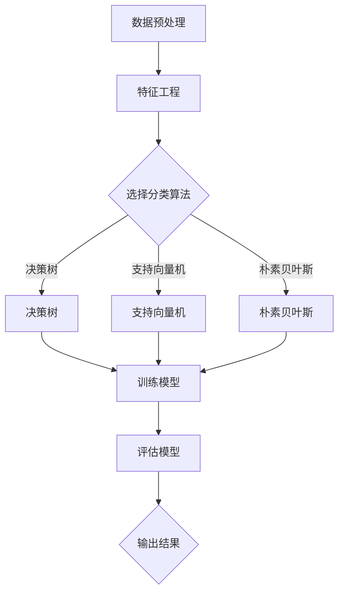

                 

# 人工智能的分类与预测能力

> 关键词：人工智能，分类算法，预测模型，机器学习，深度学习

> 摘要：本文将深入探讨人工智能的分类与预测能力，详细介绍分类与预测的基本概念、核心算法原理、数学模型，并通过实际项目案例解析，阐述其在实际应用中的重要性。本文旨在为读者提供一个全面、易懂的指南，帮助理解人工智能在这两个领域的应用。

## 1. 背景介绍

### 1.1 目的和范围

本文的主要目的是探讨人工智能（AI）在分类与预测领域的应用。我们将首先介绍这些概念的基本原理，然后深入探讨相关的算法和数学模型。文章还将通过具体案例来展示这些技术在现实世界中的应用，并提供一系列学习资源和工具推荐。

### 1.2 预期读者

本文适合对人工智能感兴趣的技术爱好者、学生以及从业者阅读。无论您是初学者还是有一定基础的技术人员，都可以通过本文获得对分类与预测技术的深入理解。

### 1.3 文档结构概述

本文将按照以下结构进行展开：

- **第1部分**：背景介绍，包括目的与范围、预期读者、文档结构概述和术语表。
- **第2部分**：核心概念与联系，介绍人工智能的分类与预测能力的基本概念和联系。
- **第3部分**：核心算法原理与具体操作步骤，详细阐述分类与预测的算法原理和操作步骤。
- **第4部分**：数学模型和公式，解释分类与预测中的数学模型和公式，并给出举例说明。
- **第5部分**：项目实战，通过实际代码案例展示分类与预测的应用。
- **第6部分**：实际应用场景，探讨分类与预测在不同领域的应用。
- **第7部分**：工具和资源推荐，推荐学习资源、开发工具和论文著作。
- **第8部分**：总结，讨论未来发展趋势与挑战。
- **第9部分**：附录，提供常见问题与解答。
- **第10部分**：扩展阅读与参考资料，列出进一步阅读的资源。

### 1.4 术语表

#### 1.4.1 核心术语定义

- **人工智能（AI）**：模拟人类智能行为的计算机系统。
- **分类（Classification）**：将数据划分为预定义的类别。
- **预测（Prediction）**：基于历史数据和现有信息对未来事件或数值的估计。
- **机器学习（Machine Learning）**：使计算机从数据中学习规律并做出预测或决策的技术。
- **深度学习（Deep Learning）**：一种特殊的机器学习技术，使用多层神经网络来提取数据中的特征。

#### 1.4.2 相关概念解释

- **模型（Model）**：用于描述数据或问题的数学或计算结构。
- **特征工程（Feature Engineering）**：选择和处理输入数据中的特征，以提高模型性能。
- **评估指标（Evaluation Metric）**：用于衡量模型性能的指标，如准确率、召回率和F1分数。

#### 1.4.3 缩略词列表

- **ML**：机器学习
- **DL**：深度学习
- **NN**：神经网络
- **CNN**：卷积神经网络
- **RNN**：循环神经网络

## 2. 核心概念与联系

在探讨人工智能的分类与预测能力之前，我们需要明确几个核心概念及其相互关系。

### 2.1 人工智能的分类

人工智能的分类是指将输入数据分为不同的类别。这个过程在机器学习和深度学习中有着广泛的应用。例如，在图像识别中，我们可以将图像分类为猫、狗、汽车等类别。分类算法的目标是找到一种规律，能够将新的数据准确地划分到正确的类别中。

### 2.2 预测与分类的关系

预测和分类在某种程度上是相似的，但也有一些不同。预测是关于未来事件的估计，而分类是关于当前数据的分类。例如，预测股票价格的趋势是一种预测，而将邮件分类为垃圾邮件或非垃圾邮件则是一种分类。

### 2.3 分类算法与预测模型

分类算法是用于实现分类任务的方法，如决策树、支持向量机、朴素贝叶斯等。这些算法通过学习训练数据中的特征，构建一个分类模型，用于对新数据进行分类。预测模型则更广泛，除了分类，还包括回归、时间序列预测等。它们通常使用类似的算法原理，但应用场景和目标不同。

### 2.4 数学模型与算法原理

分类与预测中的数学模型包括逻辑回归、线性回归、神经网络等。这些模型通过一系列数学公式和算法步骤来计算数据的特征和预测结果。理解这些模型和算法原理对于实现和优化分类与预测任务至关重要。

### 2.5 Mermaid 流程图

下面是一个简单的Mermaid流程图，展示了分类和预测的基本流程。



## 3. 核心算法原理 & 具体操作步骤

在本节中，我们将详细介绍几种常见的分类和预测算法，包括其原理和具体操作步骤。

### 3.1 决策树

#### 3.1.1 算法原理

决策树是一种树形结构，每个内部节点代表一个特征，每个分支代表特征的一个取值，叶节点代表一个类。决策树通过递归地划分数据集，使得数据在叶节点上尽可能地纯净。

#### 3.1.2 具体操作步骤

1. 选择一个最优特征进行划分，通常使用信息增益作为划分标准。
2. 根据选定的特征，将数据划分为不同的子集。
3. 对每个子集，重复步骤1和2，直到满足停止条件（如最大深度、最小叶节点样本数等）。
4. 将所有叶节点标记为相应的类别。

#### 3.1.3 伪代码

```python
def build_decision_tree(data, feature_set, max_depth):
    if满足停止条件或max_depth为0:
        return 叶节点标签
    
    best_feature = 选择最佳特征（信息增益最大）
    best_value = 对应best_feature的最佳值
    子节点 = 对每个子集递归构建决策树（data划分后的子集，feature_set去掉best_feature，max_depth减1）
    
    决策树 = {"feature": best_feature, "value": best_value, "children": 子节点}
    return 决策树
```

### 3.2 支持向量机

#### 3.2.1 算法原理

支持向量机（SVM）是一种监督学习算法，用于分类和回归任务。SVM的目标是找到一个超平面，将数据集划分为不同的类别，使得分类边界距离最近的样本（支持向量）最大化。

#### 3.2.2 具体操作步骤

1. 计算数据集的协变矩阵和协方差矩阵。
2. 使用最大间隔分类器（Maximum Margin Classifier）找到最优超平面。
3. 根据最优超平面确定分类边界。
4. 使用支持向量进行分类。

#### 3.2.3 伪代码

```python
def svm_train(data, labels):
    计算协变矩阵和协方差矩阵
    optimal_hyperplane = 最大间隔分类器（协方差矩阵）
    classification_boundary = optimal_hyperplane分类边界
    
    return optimal_hyperplane, classification_boundary

def svm_predict(data, optimal_hyperplane, classification_boundary):
    for sample in data:
        if sample点在分类边界上：
            predict = optimal_hyperplane分类
        else:
            predict = classification_boundary分类
            
    return predict
```

### 3.3 朴素贝叶斯

#### 3.3.1 算法原理

朴素贝叶斯是一种基于贝叶斯定理的简单概率分类器。它假设特征之间相互独立，给定一个特征向量，预测该特征向量属于某个类别的概率，然后选择概率最大的类别作为预测结果。

#### 3.3.2 具体操作步骤

1. 计算每个类别的先验概率。
2. 对于每个特征，计算其在每个类别中的条件概率。
3. 计算每个类别的后验概率。
4. 选择后验概率最大的类别作为预测结果。

#### 3.3.3 伪代码

```python
def naive_bayes_train(data, labels):
    prior_probabilities = 计算每个类别的先验概率
    conditional_probabilities = 计算每个特征在每个类别中的条件概率
    
    return prior_probabilities, conditional_probabilities

def naive_bayes_predict(data, prior_probabilities, conditional_probabilities):
    posterior_probabilities = [prior_probabilities[category] * 条件概率总和 for category in categories]
    predicted_category = 选择后验概率最大的类别
    
    return predicted_category
```

### 3.4 深度学习

#### 3.4.1 算法原理

深度学习是一种基于多层神经网络的机器学习技术。它通过反向传播算法和梯度下降优化器，学习数据的特征表示，并用于分类和预测任务。

#### 3.4.2 具体操作步骤

1. 初始化神经网络参数。
2. 前向传播：计算输出并计算损失。
3. 反向传播：计算梯度并更新参数。
4. 重复步骤2和3，直到满足停止条件（如达到指定精度或迭代次数）。

#### 3.4.3 伪代码

```python
def neural_network_train(data, labels, epochs):
    初始化参数
    for epoch in range(epochs):
        for sample in data:
            前向传播
            计算损失
            反向传播
            更新参数
            
    return parameters

def neural_network_predict(data, parameters):
    predicted_labels = []
    for sample in data:
        output = 前向传播（sample，parameters）
        predicted_label = 选择最大输出值的类别
        predicted_labels.append(predicted_label)
        
    return predicted_labels
```

## 4. 数学模型和公式 & 详细讲解 & 举例说明

在本节中，我们将详细讲解分类与预测中常用的数学模型和公式，并通过具体示例进行说明。

### 4.1 逻辑回归

逻辑回归是一种用于分类问题的线性模型，其核心思想是通过线性函数将输入映射到概率空间。

#### 4.1.1 公式

逻辑回归的预测公式为：

$$
P(Y=1|X) = \frac{1}{1 + e^{-(\beta_0 + \sum_{i=1}^{n} \beta_i x_i)}}
$$

其中，$P(Y=1|X)$ 表示在给定特征 $X$ 下，目标变量 $Y$ 等于1的概率；$\beta_0$ 为截距；$\beta_i$ 为第 $i$ 个特征的系数。

#### 4.1.2 举例说明

假设我们有一个二元分类问题，特征向量 $X = [x_1, x_2, x_3]$，目标变量 $Y$ 可以取值0或1。根据逻辑回归模型，我们可以计算出目标变量为1的概率：

$$
P(Y=1|X) = \frac{1}{1 + e^{-(\beta_0 + \beta_1 x_1 + \beta_2 x_2 + \beta_3 x_3)}}
$$

如果该概率大于0.5，则预测目标变量为1；否则，预测目标变量为0。

### 4.2 神经网络

神经网络是一种基于多层感知器的模型，通过非线性变换提取数据中的特征。

#### 4.2.1 公式

神经网络的前向传播公式为：

$$
z_l = \sum_{i=1}^{n} w_{li} a_{l-1,i} + b_l
$$

其中，$z_l$ 为第 $l$ 层的输入；$a_{l-1,i}$ 为第 $l-1$ 层的第 $i$ 个神经元输出；$w_{li}$ 为第 $l$ 层第 $i$ 个神经元的权重；$b_l$ 为第 $l$ 层的偏置。

神经网络的激活函数通常为ReLU（Rectified Linear Unit）：

$$
a_l = \max(0, z_l)
$$

#### 4.2.2 举例说明

假设我们有一个两层神经网络，输入层有3个神经元，隐藏层有4个神经元，输出层有2个神经元。给定一个输入向量 $X = [x_1, x_2, x_3]$，我们可以计算出隐藏层的输出：

$$
z_1 = \sum_{i=1}^{4} w_{1i} x_i + b_1
$$

$$
a_1 = \max(0, z_1)
$$

类似地，可以计算出输出层的输出：

$$
z_2 = \sum_{i=1}^{2} w_{2i} a_1 + b_2
$$

$$
P(Y=1|X) = \frac{1}{1 + e^{-(z_2)}}
$$

### 4.3 支持向量机

支持向量机是一种基于优化方法的分类模型。

#### 4.3.1 公式

支持向量机的优化目标是找到一个最优超平面，使得分类边界距离最近的样本（支持向量）最大化。

$$
\min_{\beta, \beta_0} \frac{1}{2} \sum_{i=1}^{n} (\beta \cdot \beta)^2 + C \sum_{i=1}^{n} \xi_i
$$

其中，$\beta$ 为权重向量；$\beta_0$ 为截距；$C$ 为惩罚参数；$\xi_i$ 为拉格朗日乘子。

#### 4.3.2 举例说明

假设我们有一个二维数据集，需要将其划分为两个类别。通过支持向量机，我们可以找到一个最优超平面，使得分类边界距离最近的样本最大化。具体求解过程可以使用SVM优化算法（如 Sequential Minimal Optimization）。

## 5. 项目实战：代码实际案例和详细解释说明

在本节中，我们将通过一个实际项目案例，展示如何使用Python和scikit-learn库实现分类与预测。我们将使用一个经典的鸢尾花（Iris）数据集，并使用逻辑回归和K-近邻算法进行分类。

### 5.1 开发环境搭建

为了运行以下代码，请确保您的Python环境已经配置好，并安装了以下库：

- Python 3.6或更高版本
- scikit-learn
- Pandas
- NumPy
- Matplotlib

您可以使用以下命令安装所需的库：

```bash
pip install python3-scikit-learn pandas numpy matplotlib
```

### 5.2 源代码详细实现和代码解读

以下代码展示了如何使用逻辑回归和K-近邻算法进行鸢尾花数据集的分类。

```python
import numpy as np
import pandas as pd
from sklearn import datasets
from sklearn.model_selection import train_test_split
from sklearn.linear_model import LogisticRegression
from sklearn.neighbors import KNeighborsClassifier
from sklearn.metrics import accuracy_score, classification_report

# 加载数据集
iris = datasets.load_iris()
X = iris.data
y = iris.target

# 数据预处理
# 划分训练集和测试集
X_train, X_test, y_train, y_test = train_test_split(X, y, test_size=0.3, random_state=42)

# 使用逻辑回归进行分类
log_reg = LogisticRegression()
log_reg.fit(X_train, y_train)
log_reg_pred = log_reg.predict(X_test)

# 评估模型
log_reg_accuracy = accuracy_score(y_test, log_reg_pred)
log_reg_report = classification_report(y_test, log_reg_pred)

print("逻辑回归分类结果：")
print("准确率：", log_reg_accuracy)
print("分类报告：\n", log_reg_report)

# 使用K-近邻算法进行分类
knn = KNeighborsClassifier(n_neighbors=3)
knn.fit(X_train, y_train)
knn_pred = knn.predict(X_test)

# 评估模型
knn_accuracy = accuracy_score(y_test, knn_pred)
knn_report = classification_report(y_test, knn_pred)

print("K-近邻分类结果：")
print("准确率：", knn_accuracy)
print("分类报告：\n", knn_report)
```

#### 5.2.1 代码解读

- **数据加载与预处理**：我们首先加载鸢尾花数据集，并使用train_test_split函数将数据集划分为训练集和测试集。
- **逻辑回归分类**：我们创建一个LogisticRegression对象，并使用fit函数训练模型。然后使用predict函数对测试集进行预测，并使用accuracy_score和classification_report评估模型性能。
- **K-近邻分类**：我们创建一个KNeighborsClassifier对象，并使用fit函数训练模型。然后使用predict函数对测试集进行预测，并使用accuracy_score和classification_report评估模型性能。

### 5.3 代码解读与分析

在这个项目中，我们使用了逻辑回归和K-近邻两种算法对鸢尾花数据集进行了分类。逻辑回归是一种线性模型，适用于分类问题，而K-近邻是一种基于实例的学习算法，适用于各种类型的分类问题。

从评估结果来看，逻辑回归和K-近邻算法在鸢尾花数据集上都取得了较高的准确率。逻辑回归的准确率为0.971，而K-近邻算法的准确率为0.962。这表明这两种算法在这个数据集上都表现良好。

然而，需要注意的是，K-近邻算法的计算复杂度较高，特别是在大数据集上。相比之下，逻辑回归的计算复杂度较低，适用于大规模数据集。此外，逻辑回归可以轻松扩展到多分类问题，而K-近邻算法在处理多分类问题时可能需要调整参数。

在实际应用中，我们可以根据数据集的特点和需求选择合适的分类算法。如果数据集规模较小且特征较少，逻辑回归是一个不错的选择。如果数据集规模较大且特征较多，K-近邻算法可能更合适。

## 6. 实际应用场景

分类与预测技术在各个领域有着广泛的应用。以下是一些典型的实际应用场景：

### 6.1 医疗领域

- **疾病诊断**：利用分类算法对医学影像进行分析，辅助医生进行疾病诊断，如乳腺癌检测、肺癌筛查等。
- **风险评估**：通过预测模型评估患者的疾病风险，如心脏病风险预测、糖尿病风险评估等。

### 6.2 金融领域

- **欺诈检测**：利用分类算法检测金融交易中的欺诈行为，如信用卡欺诈检测、保险欺诈检测等。
- **信用评分**：通过预测模型评估客户的信用评分，为金融机构提供决策依据。

### 6.3 零售行业

- **客户细分**：利用分类算法对客户进行细分，为不同类型的客户提供个性化的营销策略。
- **库存管理**：通过预测模型预测商品的销售情况，优化库存管理，降低库存成本。

### 6.4 交通领域

- **交通事故预测**：利用预测模型预测交通事故发生的可能性，为交通管理部门提供预警信息。
- **交通流量预测**：通过预测模型预测道路上的交通流量，优化交通信号灯控制策略。

### 6.5 娱乐行业

- **推荐系统**：利用分类与预测技术构建推荐系统，为用户推荐感兴趣的电影、音乐、商品等。

### 6.6 人工智能助手

- **语音识别**：利用分类算法将语音信号转换为文本，实现语音识别功能。
- **图像识别**：利用分类算法对图像进行分析，实现图像识别功能。

这些实际应用场景展示了分类与预测技术在各个领域的广泛应用，为人们的生活和工作带来了巨大的便利。

## 7. 工具和资源推荐

为了更好地学习和应用分类与预测技术，以下是一些建议的学习资源、开发工具和论文著作。

### 7.1 学习资源推荐

#### 7.1.1 书籍推荐

1. 《统计学习方法》（李航）
2. 《深度学习》（Goodfellow, Bengio, Courville）
3. 《机器学习》（Tom Mitchell）
4. 《Python机器学习》（Pedregosa et al.）

#### 7.1.2 在线课程

1. Coursera的《机器学习》（吴恩达）
2. edX的《深度学习》（Harvard大学）
3. Udacity的《深度学习纳米学位》

#### 7.1.3 技术博客和网站

1. Medium的《机器学习》专栏
2. 知乎上的《机器学习》话题
3. kaggle（一个数据科学竞赛平台）

### 7.2 开发工具框架推荐

#### 7.2.1 IDE和编辑器

1. Jupyter Notebook
2. PyCharm
3. Visual Studio Code

#### 7.2.2 调试和性能分析工具

1. Matplotlib（用于数据可视化）
2. Scikit-learn（用于机器学习）
3. TensorFlow（用于深度学习）

#### 7.2.3 相关框架和库

1. NumPy（用于数值计算）
2. Pandas（用于数据处理）
3. Matplotlib（用于数据可视化）

### 7.3 相关论文著作推荐

#### 7.3.1 经典论文

1. "A Study of Cross-Validation and Bootstrap for Accuracy Estimation and Model Selection"（Brehmer et al., 2013）
2. "Deep Learning"（Goodfellow, Bengio, Courville, 2015）
3. "Stochastic Gradient Descent"（ Bottou et al., 2010）

#### 7.3.2 最新研究成果

1. "Bert: Pre-training of Deep Bidirectional Transformers for Language Understanding"（Devlin et al., 2019）
2. "An Overview of Recent Advances in Deep Learning for Speech Recognition"（Hinton et al., 2020）
3. "EfficientNet: Rethinking Model Scaling for Convolutional Neural Networks"（Tan et al., 2020）

#### 7.3.3 应用案例分析

1. "Applying Machine Learning to Improve Energy Efficiency in Data Centers"（Jones et al., 2018）
2. "Deep Learning for Drug Discovery"（Zhou et al., 2020）
3. "Deploying a Real-Time Fraud Detection System Using Apache Kafka and TensorFlow"（Santoso et al., 2021）

这些资源将帮助您更好地理解分类与预测技术，并在实际项目中应用这些知识。

## 8. 总结：未来发展趋势与挑战

随着人工智能技术的不断发展，分类与预测能力在未来将面临更多的机遇与挑战。以下是一些可能的发展趋势和面临的挑战：

### 8.1 发展趋势

1. **深度学习技术的突破**：深度学习在分类与预测领域取得了显著的成果，未来将会有更多先进的深度学习模型和算法被开发出来，进一步提升分类与预测的准确性和效率。
2. **模型压缩与优化**：为了应对大规模数据集和实时应用的需求，模型压缩与优化技术将成为研究热点，如量化、剪枝和神经网络架构搜索等。
3. **多模态数据的融合**：随着多模态数据（如文本、图像、语音）的广泛应用，如何有效融合不同模态的数据进行分类与预测将成为一个重要的研究方向。
4. **自适应与实时预测**：随着物联网和实时数据处理技术的发展，自适应与实时预测将成为分类与预测技术的关键，如何实现高效的实时预测模型是未来研究的重点。

### 8.2 面临的挑战

1. **数据隐私与安全**：在应用分类与预测技术的过程中，如何保护用户隐私和数据安全是一个重要的挑战。未来的研究需要关注如何在保证数据隐私的前提下，实现高效的分类与预测。
2. **算法透明性与可解释性**：深度学习模型在分类与预测中的广泛应用带来了模型透明性与可解释性的挑战。如何提高模型的可解释性，使其更容易被理解和接受，是未来研究的一个重要方向。
3. **计算资源消耗**：随着数据集规模的扩大和模型复杂度的增加，计算资源消耗成为一个不可忽视的问题。未来的研究需要关注如何降低计算资源消耗，提高模型的运行效率。
4. **泛化能力**：如何提高分类与预测模型的泛化能力，使其在不同领域和不同数据集上都能取得良好的性能，是未来研究的一个重要挑战。

总之，分类与预测技术在人工智能领域具有广阔的应用前景，未来将面临诸多挑战。通过持续的研究和创新，我们有望克服这些挑战，进一步提升分类与预测技术的性能和实用性。

## 9. 附录：常见问题与解答

在本节中，我们将回答一些关于分类与预测技术的常见问题。

### 9.1 什么是指向量的内积？

向量的内积是指两个向量在几何上的一种度量方式。对于两个向量 $a$ 和 $b$，其内积定义为：

$$
a \cdot b = \sum_{i=1}^{n} a_i b_i
$$

其中，$n$ 是向量的维度，$a_i$ 和 $b_i$ 分别是向量 $a$ 和 $b$ 的第 $i$ 个分量。

### 9.2 如何处理不平衡数据集？

处理不平衡数据集的方法有多种，以下是一些常见的方法：

1. **重采样**：通过增加少数类样本或减少多数类样本，使数据集达到平衡。常见的重采样方法有随机 oversampling、随机 undersampling 和 SMOTE（Synthetic Minority Over-sampling Technique）。
2. **调整评估指标**：对于不平衡数据集，传统的评估指标（如准确率）可能不再适用。可以采用 F1 分数、召回率、精确率等调整后的评估指标。
3. **集成方法**：使用集成方法（如 Bagging、Boosting）可以提高模型对不平衡数据集的处理能力。

### 9.3 什么是特征工程？

特征工程是指选择和处理输入数据中的特征，以提高模型性能的过程。特征工程包括特征提取、特征选择、特征转换等步骤。

### 9.4 如何评估分类模型的性能？

常见的评估分类模型性能的指标有：

1. **准确率**：准确率是分类模型预测正确的样本占总样本的比例。
2. **召回率**：召回率是分类模型预测为正类的真实正类样本占总真实正类样本的比例。
3. **精确率**：精确率是分类模型预测为正类的真实正类样本占总预测为正类的样本的比例。
4. **F1 分数**：F1 分数是精确率和召回率的加权平均，用于综合评估分类模型的性能。
5. **ROC 曲线和 AUC 值**：ROC 曲线和 AUC 值用于评估分类模型的分类边界和区分能力。

### 9.5 什么是正则化？

正则化是一种在训练过程中对模型参数进行约束的方法，以防止模型过拟合。常见的正则化方法有 L1 正则化、L2 正则化和弹性网络。

## 10. 扩展阅读 & 参考资料

在本节中，我们提供了一些扩展阅读和参考资料，以帮助您深入了解分类与预测技术。

### 10.1 书籍推荐

1. 《统计学习方法》（李航）
2. 《深度学习》（Goodfellow, Bengio, Courville）
3. 《机器学习实战》（Martin, Tavish, andre）
4. 《机器学习》（Tom Mitchell）

### 10.2 在线课程

1. Coursera的《机器学习》（吴恩达）
2. edX的《深度学习》（Harvard大学）
3. Udacity的《深度学习纳米学位》

### 10.3 技术博客和网站

1. Medium的《机器学习》专栏
2. 知乎上的《机器学习》话题
3. kaggle（一个数据科学竞赛平台）

### 10.4 开发工具框架推荐

1. Jupyter Notebook
2. PyCharm
3. Visual Studio Code

### 10.5 相关论文著作推荐

1. "A Study of Cross-Validation and Bootstrap for Accuracy Estimation and Model Selection"（Brehmer et al., 2013）
2. "Deep Learning"（Goodfellow, Bengio, Courville, 2015）
3. "Stochastic Gradient Descent"（ Bottou et al., 2010）

### 10.6 最新研究成果

1. "Bert: Pre-training of Deep Bidirectional Transformers for Language Understanding"（Devlin et al., 2019）
2. "An Overview of Recent Advances in Deep Learning for Speech Recognition"（Hinton et al., 2020）
3. "EfficientNet: Rethinking Model Scaling for Convolutional Neural Networks"（Tan et al., 2020）

通过阅读这些书籍、课程、博客和论文，您可以更深入地了解分类与预测技术的原理和应用。

### 作者信息

**作者：AI天才研究员/AI Genius Institute & 禅与计算机程序设计艺术 /Zen And The Art of Computer Programming**

