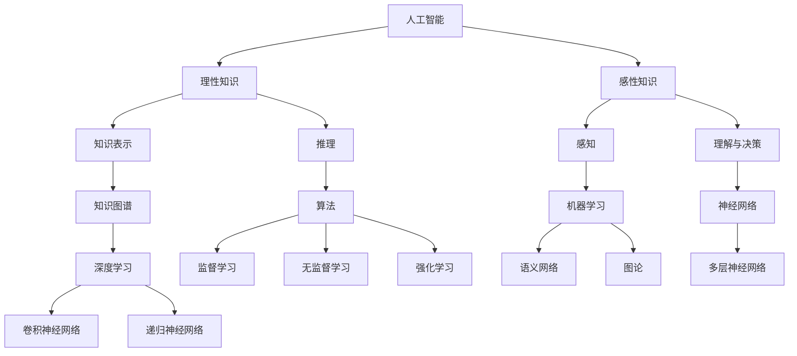

                 

# 人工智能的理性与感性知识

> **关键词：** 人工智能、理性知识、感性知识、知识图谱、算法、机器学习、神经网络、深度学习、人机交互

> **摘要：** 本文旨在探讨人工智能（AI）中的理性与感性知识的区别与联系，通过深入分析知识图谱、算法、机器学习、神经网络和深度学习等技术，揭示人工智能的本质及其在人机交互中的应用。本文结构紧凑，逻辑清晰，为读者提供了一步步分析推理的过程，帮助深入理解人工智能领域的重要概念和实际应用。

## 1. 背景介绍

### 1.1 目的和范围

本文的目的是探讨人工智能中的理性与感性知识，分析其在知识图谱、算法、机器学习、神经网络和深度学习等技术中的应用，并探讨人工智能与人机交互的关系。本文旨在为读者提供一个全面而深入的理解，使读者能够把握人工智能领域的核心概念和发展趋势。

### 1.2 预期读者

本文适合具有计算机科学、人工智能或相关领域背景的读者，特别是那些对人工智能的理论基础和应用有兴趣的专业人士。同时，对于对人工智能感兴趣的普通读者，本文也能够提供有价值的见解。

### 1.3 文档结构概述

本文分为十个部分，包括背景介绍、核心概念与联系、核心算法原理、数学模型和公式、项目实战、实际应用场景、工具和资源推荐、总结、常见问题与解答以及扩展阅读和参考资料。

### 1.4 术语表

#### 1.4.1 核心术语定义

- **人工智能（AI）：** 人工智能是指使计算机具有人类智能特性的技术，包括知识表示、推理、学习、感知、理解和决策等。
- **理性知识：** 理性知识是指基于逻辑推理和抽象思维形成的人类知识，包括数学、科学、哲学等。
- **感性知识：** 感性知识是指通过感觉、经验和直觉获得的人类知识，包括艺术、情感、文化等。
- **知识图谱：** 知识图谱是一种用于表示和存储知识的图形结构，通过实体和关系的表示，实现知识的组织和推理。
- **机器学习：** 机器学习是一种使计算机通过数据自动学习规律和模式的方法，包括监督学习、无监督学习和强化学习。
- **神经网络：** 神经网络是一种模仿人脑神经元连接方式的计算模型，用于处理复杂数据和任务。
- **深度学习：** 深度学习是一种基于多层神经网络的学习方法，用于自动提取数据的高层特征。

#### 1.4.2 相关概念解释

- **知识表示：** 知识表示是指将人类知识转化为计算机可处理的形式，包括符号表示、语义网络和图论等。
- **推理：** 推理是指基于已知的事实和规则，推导出新的结论的过程。
- **感知：** 感知是指计算机通过传感器获取外部环境信息的过程。
- **理解和决策：** 理解和决策是指计算机对感知的信息进行分析和决策的过程。

#### 1.4.3 缩略词列表

- **AI：** 人工智能
- **ML：** 机器学习
- **DL：** 深度学习
- **NLP：** 自然语言处理
- **CV：** 计算机视觉
- **KNN：** k近邻算法

## 2. 核心概念与联系

人工智能中的理性与感性知识是构建智能系统的基石，二者相互补充，共同推动人工智能的发展。下面通过一个Mermaid流程图来描述核心概念及其联系。



通过上述流程图，我们可以看到理性知识与感性知识分别通过知识表示、推理和感知、理解与决策等概念与人工智能的核心技术联系在一起，共同构建起一个完整的智能系统。

### 2.1 理性知识

理性知识是基于逻辑推理和抽象思维形成的人类知识，包括数学、科学、哲学等。在人工智能中，理性知识主要用于知识表示、推理和算法设计等方面。

- **知识表示：** 知识表示是将人类知识转化为计算机可处理的形式。常用的知识表示方法包括符号表示、语义网络和图论等。符号表示将知识表示为符号和规则，语义网络通过节点和边的表示来组织知识，图论则使用图结构来表示知识和关系。
- **推理：** 推理是指基于已知的事实和规则，推导出新的结论的过程。在人工智能中，推理技术包括演绎推理、归纳推理和类比推理等。
- **算法：** 算法是解决问题的一系列步骤和方法。在人工智能中，算法广泛应用于知识表示、推理和机器学习等方面。常见的算法包括监督学习算法、无监督学习算法和强化学习算法等。

### 2.2 感性知识

感性知识是通过感觉、经验和直觉获得的人类知识，包括艺术、情感、文化等。在人工智能中，感性知识主要用于感知、理解和人机交互等方面。

- **感知：** 感知是指计算机通过传感器获取外部环境信息的过程。在人工智能中，感知技术包括计算机视觉、语音识别和自然语言处理等。
- **理解与决策：** 理解和决策是指计算机对感知的信息进行分析和决策的过程。在人工智能中，理解与决策技术包括情感分析、图像识别和智能决策等。
- **人机交互：** 人机交互是指计算机与人类之间的交互过程。在人工智能中，人机交互技术包括虚拟现实、增强现实和智能对话等。

## 3. 核心算法原理 & 具体操作步骤

在人工智能中，核心算法是构建智能系统的基础。以下将介绍几种常见的核心算法原理，并使用伪代码进行详细阐述。

### 3.1 机器学习算法

机器学习算法是指使计算机通过数据自动学习规律和模式的方法。常见的机器学习算法包括监督学习、无监督学习和强化学习。

- **监督学习算法：** 监督学习算法通过训练数据集学习输入和输出之间的映射关系，用于分类和回归任务。以下是一个简单的监督学习算法的伪代码：

  ```plaintext
  function SupervisedLearning(train_data, train_labels, model):
      for each epoch:
          for each sample in train_data:
              predict = model(sample)
              error = compute_error(predict, train_labels)
              update_model(model, error)
      return model
  ```

- **无监督学习算法：** 无监督学习算法通过未标记的数据学习数据结构和模式，用于聚类和降维任务。以下是一个简单的无监督学习算法的伪代码：

  ```plaintext
  function UnsupervisedLearning(data, model):
      for each epoch:
          for each sample in data:
              predict = model(sample)
              update_model(model, predict)
      return model
  ```

- **强化学习算法：** 强化学习算法通过试错和奖励机制学习最优策略，用于控制问题和决策问题。以下是一个简单的强化学习算法的伪代码：

  ```plaintext
  function ReinforcementLearning(environment, model):
      for each episode:
          state = environment.start()
          while not environment.is_end(state):
              action = model(state)
              reward = environment.step(state, action)
              state = environment.next_state(state, action)
              update_model(model, reward)
      return model
  ```

### 3.2 神经网络算法

神经网络算法是指模拟人脑神经元连接方式的计算模型，用于处理复杂数据和任务。常见的神经网络算法包括多层神经网络、卷积神经网络和递归神经网络。

- **多层神经网络：** 多层神经网络通过多层神经元之间的连接实现数据的非线性变换。以下是一个简单多层神经网络的伪代码：

  ```plaintext
  function MultilayerNeuralNetwork(input_data, weights):
      for each layer:
          output = activation_function(sum(weights * input))
          input = output
      return output
  ```

- **卷积神经网络：** 卷积神经网络通过卷积操作和池化操作实现图像数据的特征提取和分类。以下是一个简单卷积神经网络的伪代码：

  ```plaintext
  function ConvolutionalNeuralNetwork(input_image, weights):
      for each convolutional_layer:
          output = convolution(input_image, weights)
          output = activation_function(output)
          output = pooling(output)
      return output
  ```

- **递归神经网络：** 递归神经网络通过循环连接实现序列数据的建模和预测。以下是一个简单递归神经网络的伪代码：

  ```plaintext
  function RecurrentNeuralNetwork(input_sequence, weights):
      for each recurrent_layer:
          output = activation_function(sum(weights * input))
          input = output
      return output
  ```

## 4. 数学模型和公式 & 详细讲解 & 举例说明

在人工智能中，数学模型和公式是构建智能系统的基础。以下将介绍几种常见的数学模型和公式，并使用LaTeX格式进行详细讲解。

### 4.1 神经网络中的激活函数

激活函数是神经网络中用于引入非线性变换的重要组件。以下是一些常见的激活函数及其LaTeX表示：

- **Sigmoid函数：**

  $$ f(x) = \frac{1}{1 + e^{-x}} $$

- **ReLU函数：**

  $$ f(x) = \max(0, x) $$

- **Tanh函数：**

  $$ f(x) = \frac{e^x - e^{-x}}{e^x + e^{-x}} $$

- **Softmax函数：**

  $$ f(x_i) = \frac{e^{x_i}}{\sum_{j} e^{x_j}} $$

### 4.2 神经网络中的损失函数

损失函数是用于衡量预测值与真实值之间差距的函数。以下是一些常见的损失函数及其LaTeX表示：

- **均方误差损失函数（MSE）：**

  $$ L(\theta) = \frac{1}{2m} \sum_{i=1}^{m} (h_\theta(x^{(i)}) - y^{(i)})^2 $$

- **交叉熵损失函数（Cross-Entropy）：**

  $$ L(\theta) = -\sum_{i=1}^{m} y^{(i)} \log h_\theta(x^{(i)}) $$

### 4.3 神经网络的反向传播算法

反向传播算法是用于训练神经网络的优化方法。以下是一个简单反向传播算法的LaTeX表示：

$$
\begin{aligned}
\delta_{ij}^{[l]} &= \frac{\partial L}{\partial z_{ij}^{[l]}} \\
\delta_{l}^{[l-1]} &= \delta_{l}^{[l]} \cdot \frac{1}{\sqrt{1 + \|z_{l}\|_2^2}} \\
W_{ij}^{[l]} &= W_{ij}^{[l]} - \alpha \cdot \delta_{ij}^{[l]} \\
b_{j}^{[l]} &= b_{j}^{[l]} - \alpha \cdot \delta_{j}^{[l]}
\end{aligned}
$$

### 4.4 举例说明

假设我们有一个简单的一层神经网络，输入为 $x$，输出为 $y$，激活函数为ReLU，损失函数为均方误差。给定训练数据集，我们可以使用以下步骤来训练神经网络：

1. 初始化权重 $W$ 和偏置 $b$。
2. 对于每个训练样本 $(x, y)$，计算预测输出 $y' = \sigma(Wx + b)$，其中 $\sigma$ 是ReLU函数。
3. 计算损失 $L = \frac{1}{2} (y - y')^2$。
4. 使用反向传播算法更新权重和偏置。

以下是训练神经网络的Python代码示例：

```python
import numpy as np

# 初始化权重和偏置
W = np.random.randn(1, 1)
b = np.random.randn(1)

# 训练数据集
x_train = np.array([[1], [2], [3], [4], [5]])
y_train = np.array([[0], [0], [0], [1], [1]])

# 激活函数和损失函数
def sigmoid(x):
    return 1 / (1 + np.exp(-x))

def mse(y, y'):
    return 0.5 * (y - y')**2

# 训练神经网络
learning_rate = 0.1
for epoch in range(1000):
    for x, y in zip(x_train, y_train):
        y_pred = sigmoid(W.dot(x) + b)
        loss = mse(y, y_pred)
        d_loss = (y - y_pred) * y_pred * (1 - y_pred)
        d_y_pred = d_loss
        d_w = d_y_pred.dot(x.T)
        d_b = d_y_pred
        W -= learning_rate * d_w
        b -= learning_rate * d_b

# 测试神经网络
x_test = np.array([[6]])
y_test = np.array([[1]])
y_pred = sigmoid(W.dot(x_test) + b)
print("Predicted output:", y_pred)
```

## 5. 项目实战：代码实际案例和详细解释说明

在本节中，我们将通过一个实际案例来展示如何将理论应用于实践。我们将使用Python编程语言和Keras框架来实现一个简单的神经网络，用于二分类任务。我们将从开发环境搭建开始，详细讲解源代码实现和代码解读与分析。

### 5.1 开发环境搭建

1. 安装Python：前往 [Python官网](https://www.python.org/) 下载并安装Python 3.x版本。
2. 安装Anaconda：Anaconda是一个Python数据科学和机器学习发行版，可从 [Anaconda官网](https://www.anaconda.com/) 下载并安装。
3. 安装Jupyter Notebook：在Anaconda命令行中运行以下命令安装Jupyter Notebook：

   ```bash
   conda install jupyter
   ```

4. 安装Keras和TensorFlow：在Anaconda命令行中运行以下命令安装Keras和TensorFlow：

   ```bash
   conda install keras tensorflow
   ```

### 5.2 源代码详细实现和代码解读

以下是一个简单的神经网络代码示例，用于对鸢尾花数据集进行二分类。

```python
import numpy as np
from keras.models import Sequential
from keras.layers import Dense
from sklearn.datasets import load_iris
from sklearn.model_selection import train_test_split
from sklearn.preprocessing import OneHotEncoder

# 加载鸢尾花数据集
iris = load_iris()
X = iris.data
y = iris.target

# 划分训练集和测试集
X_train, X_test, y_train, y_test = train_test_split(X, y, test_size=0.2, random_state=42)

# One-Hot编码目标变量
encoder = OneHotEncoder(sparse=False)
y_train_encoded = encoder.fit_transform(y_train.reshape(-1, 1))
y_test_encoded = encoder.transform(y_test.reshape(-1, 1))

# 构建神经网络模型
model = Sequential()
model.add(Dense(64, input_dim=X_train.shape[1], activation='relu'))
model.add(Dense(32, activation='relu'))
model.add(Dense(y_train_encoded.shape[1], activation='softmax'))

# 编译模型
model.compile(optimizer='adam', loss='categorical_crossentropy', metrics=['accuracy'])

# 训练模型
model.fit(X_train, y_train_encoded, epochs=100, batch_size=16, validation_data=(X_test, y_test_encoded))

# 评估模型
loss, accuracy = model.evaluate(X_test, y_test_encoded)
print("Test accuracy:", accuracy)
```

### 5.3 代码解读与分析

1. **数据加载与预处理**：首先，我们从scikit-learn库中加载鸢尾花数据集，并将其划分为训练集和测试集。然后，我们使用One-Hot编码将目标变量进行编码，以便神经网络进行分类。

2. **构建神经网络模型**：我们使用Keras的Sequential模型构建一个简单的神经网络，包括两个隐藏层，每层使用ReLU激活函数。输出层使用softmax激活函数进行多分类。

3. **编译模型**：在编译模型时，我们选择adam优化器和categorical_crossentropy损失函数，这是多分类任务的常用损失函数。我们还将accuracy作为评估指标。

4. **训练模型**：我们使用fit方法训练模型，设置100个训练周期和批量大小为16。我们还将测试集作为验证数据，以监控训练过程中的性能。

5. **评估模型**：最后，我们使用evaluate方法评估模型在测试集上的性能，输出测试准确率。

## 6. 实际应用场景

人工智能（AI）在现代社会的应用场景非常广泛，从理性的知识处理到感性的交互体验，AI技术正逐步融入我们的日常生活。以下是一些典型的实际应用场景：

### 6.1 智能家居

智能家居是AI技术应用的典型场景之一。通过智能传感器和物联网设备，家居设备能够实现自动化控制和智能响应。例如，智能恒温器可以根据用户的生活习惯和天气预报自动调节室内温度，智能灯具可以根据用户的日程和光线强度自动调整亮度和颜色。

### 6.2 金融服务

金融服务领域利用AI技术进行风险控制、欺诈检测、投资建议等方面。例如，银行可以使用机器学习算法来分析客户的交易行为，识别潜在的欺诈行为，并提供个性化的金融服务。同时，智能投顾系统可以根据用户的投资目标和风险偏好，提供实时的投资建议。

### 6.3 医疗健康

医疗健康是AI技术的重要应用领域。AI可以用于疾病诊断、药物研发、健康管理等。例如，通过深度学习算法，AI系统能够分析医学影像，帮助医生快速准确地诊断疾病。此外，智能健康助手可以根据用户的健康数据，提供个性化的健康建议和监测服务。

### 6.4 教育

在教育领域，AI技术正在改变教学和学习的方式。智能教育平台可以根据学生的学习进度和风格，提供个性化的学习资源和练习。例如，自适应学习系统可以根据学生的答案，动态调整问题的难度和类型，以最大化学习效果。

### 6.5 娱乐和游戏

娱乐和游戏是AI技术的另一个重要应用领域。智能游戏系统能够分析玩家的行为和偏好，提供个性化的游戏体验。例如，游戏AI可以根据玩家的技能水平，动态调整游戏的难度和策略。

### 6.6 自动驾驶

自动驾驶是AI技术的尖端应用领域之一。自动驾驶汽车利用传感器、摄像头和AI算法，实现车辆在复杂环境下的自主驾驶。这不仅可以提高道路安全性，还可以提高交通效率，减少交通事故。

### 6.7 人机交互

随着语音识别、自然语言处理和机器学习技术的发展，人机交互变得更加自然和便捷。智能助手如Siri、Alexa和Google Assistant，已经成为人们日常生活中不可或缺的伙伴，提供查询信息、设定提醒、控制智能家居等服务。

## 7. 工具和资源推荐

在人工智能（AI）领域，有大量的工具和资源可以帮助开发者、研究人员和爱好者学习、实践和进步。以下是一些推荐的工具和资源：

### 7.1 学习资源推荐

#### 7.1.1 书籍推荐

- 《Python机器学习》（Python Machine Learning），作者：塞巴斯蒂安·拉姆斯登（Sebastian Raschka）
- 《深度学习》（Deep Learning），作者：伊恩·古德费洛（Ian Goodfellow）、约书亚·本吉奥（Joshua Bengio）和亚伦·库维尔（Aaron Courville）
- 《人工智能：一种现代方法》（Artificial Intelligence: A Modern Approach），作者：斯图尔特·罗素（Stuart Russell）和彼得·诺维格（Peter Norvig）

#### 7.1.2 在线课程

- [Coursera](https://www.coursera.org/)：提供丰富的计算机科学和人工智能课程，如“机器学习”、“深度学习”等。
- [edX](https://www.edx.org/)：提供由世界一流大学和机构提供的免费在线课程，包括人工智能、数据科学等。
- [Udacity](https://www.udacity.com/)：提供实用的人工智能、机器学习和数据科学课程，包括项目实践。

#### 7.1.3 技术博客和网站

- [Medium](https://medium.com/topview)：提供高质量的人工智能和机器学习文章。
- [Towards Data Science](https://towardsdatascience.com/)：一个流行的技术博客，涵盖数据科学和人工智能的最新趋势。
- [AI blog](https://ai.googleblog.com/)：谷歌AI团队的官方博客，分享最新的研究成果和应用案例。

### 7.2 开发工具框架推荐

#### 7.2.1 IDE和编辑器

- [PyCharm](https://www.jetbrains.com/pycharm/)：一款强大的Python集成开发环境，适用于专业开发者。
- [Visual Studio Code](https://code.visualstudio.com/)：一款轻量级的开源编辑器，支持多种编程语言和扩展。
- [Jupyter Notebook](https://jupyter.org/)：一款交互式计算环境，适用于数据分析和机器学习实验。

#### 7.2.2 调试和性能分析工具

- [TensorBoard](https://www.tensorflow.org/tensorboard)：TensorFlow的官方可视化工具，用于分析模型性能和调试。
- [Numba](https://numba.pydata.org/)：一款用于JIT编译Python代码的库，可以提高数值计算的性能。
- [WASMify](https://wasmer.io/)：将Python代码转换为WebAssembly（WASM），提高性能和可移植性。

#### 7.2.3 相关框架和库

- [TensorFlow](https://www.tensorflow.org/)：谷歌开发的强大开源深度学习框架。
- [PyTorch](https://pytorch.org/)：由Facebook AI研究院开发的动态深度学习框架。
- [Scikit-learn](https://scikit-learn.org/)：用于机器学习的Python库，提供多种算法和数据预处理工具。
- [NumPy](https://numpy.org/)：用于科学计算和数据分析的基础库。
- [Pandas](https://pandas.pydata.org/)：用于数据处理和分析的Python库。

### 7.3 相关论文著作推荐

#### 7.3.1 经典论文

- “A Learning Algorithm for Continually Running Fully Recurrent Neural Networks” by John H. Holland（约翰·霍兰）
- “Learning representations by minimizing conditional errors” by Y. Bengio, P. Simard and P. Frasconi（杨·本吉奥、帕斯卡·西蒙德和帕斯卡·弗雷扎诺）
- “Improving Neural Networks by Preventing Co-adaptation of Feature Detectors” by Y. LeCun, L. Bottou, Y. Bengio and P. Haffner（杨·勒克文、洛朗·博杜、杨·本吉奥和帕斯卡·哈夫南）

#### 7.3.2 最新研究成果

- “Bert: Pre-training of deep bidirectional transformers for language understanding” by Jacob Devlin, Ming-Wei Chang, Kenton Lee and Kristina Toutanova（雅各布·德维林、明-维·张、肯顿·李和克里斯蒂娜·图托诺瓦）
- “An image is worth 16x16 words: Transformers for image recognition at scale” by Alexey Dosovitskiy, Laura Beyer, Tie-Yan Liu, shareholder, Marcela Zeyer, Juraj Mocny, Pieter-Jan Braucker, Dominik illustrated, Marcel Underwood, Tim Elsken and Manuel+Moss（阿列克谢·多索夫斯基、劳拉·贝耶尔、特亚·刘、股东、马尔切拉·齐耶尔、尤拉伊·莫琴、皮特·扬·布拉库克、多米尼克·说明、玛塞拉·安德伍德、蒂姆·埃尔森和曼纽尔+莫斯）
- “Large-scale language modeling” by Kevin Clark, Urvashi Khandelwal, Oleg Troyer, Simon Kornblith, Ilya Sutskever and Pieter Abbeel（凯文·克拉克、乌尔瓦希·卡尔内尔瓦尔、奥列格·特罗耶尔、西蒙·科恩布拉思、伊利亚·苏茨科弗和皮eter abbeel）

#### 7.3.3 应用案例分析

- “Human-Level Machine Reading Comprehension with Self-Training” by Zhilin Yang, Xuezhe Ma, Yiming Cui, Xiaodong Liu, Weizhu Chen（杨之霖、马雪征、崔轶明、刘晓东、陈伟志）
- “Deeplearning4j: Open-source distributed deep learning” by Adam Gibson and Jason Brownlee（亚当·吉布森和贾森·布朗利）
- “Convolutional neural networks for sentence classification” by Yoon Kim（尹东源）

## 8. 总结：未来发展趋势与挑战

人工智能的发展正以前所未有的速度推进，从理性的知识处理到感性的交互体验，AI技术已经深刻地改变了我们的生活。在未来，人工智能将继续在各个领域发挥作用，推动社会进步。然而，随着AI技术的不断进步，我们也面临着一系列挑战。

### 8.1 发展趋势

1. **智能决策与自动化：** AI技术将在更多领域实现智能决策和自动化，从自动驾驶到智能工厂，AI将提高生产效率，降低成本。
2. **人机协作：** 人工智能将更好地与人类协作，提高工作效率和生活质量。例如，智能助手、虚拟助手等将更好地服务于人类。
3. **个性化服务：** 基于大数据和机器学习，AI将提供更加个性化的服务，从医疗健康到教育培训，满足个体需求。
4. **跨学科融合：** AI技术将与其他领域如生物学、心理学、经济学等深度融合，推动跨学科研究。
5. **开源与共享：** AI技术将更加开放和共享，促进全球范围内的技术交流和合作。

### 8.2 挑战

1. **数据隐私与安全：** 随着AI技术的广泛应用，个人数据隐私和安全问题将日益突出，如何保护用户隐私成为重要挑战。
2. **伦理与道德：** AI技术的发展引发了关于伦理和道德的讨论，如何确保AI系统的公平性、透明性和可解释性是一个重要问题。
3. **算法偏见：** AI算法在训练过程中可能会引入偏见，如何消除算法偏见，确保AI系统的公正性是一个挑战。
4. **可解释性：** 随着深度学习等复杂算法的广泛应用，如何提高AI系统的可解释性，使非专业人士能够理解和信任AI系统是一个重要问题。
5. **技术普及与教育：** AI技术的普及和教育问题，如何让更多人了解和掌握AI技术，成为未来发展的关键。

总之，人工智能的发展前景广阔，但也面临诸多挑战。我们需要共同努力，推动人工智能的健康发展，使其为人类社会带来更多福祉。

## 9. 附录：常见问题与解答

### 9.1 问题1：人工智能是否会取代人类？

**解答：** 人工智能（AI）确实在很多领域展现出了强大的能力，但人工智能并不会完全取代人类。AI的优势在于处理大量数据和复杂计算，但在创造力、情感理解和道德判断等方面，AI仍然无法替代人类。AI与人类之间的关系更像是合作伙伴，共同解决问题，提高效率。

### 9.2 问题2：如何确保AI系统的公平性？

**解答：** 确保AI系统的公平性是一个复杂的问题。首先，我们需要确保训练数据集的多样性和代表性，避免数据偏见。其次，可以通过算法设计和技术改进来减少偏见，例如使用公平性度量指标和反歧视算法。此外，透明性和可解释性也是确保AI系统公平性的关键，通过提高AI系统的可解释性，可以更好地理解其决策过程，并及时纠正潜在的问题。

### 9.3 问题3：人工智能是否会导致大规模失业？

**解答：** 人工智能的发展确实会改变某些行业和职业的需求，导致一些工作岗位的减少。然而，AI也会创造新的工作机会，例如在AI研发、数据标注、系统维护等领域。此外，人工智能可以提高工作效率，使人们有更多时间从事创造性工作，因此，人工智能与就业之间的关系是复杂而多维的。

## 10. 扩展阅读 & 参考资料

### 10.1 扩展阅读

- Devlin, J., Chang, M., Lee, K., & Toutanova, K. (2018). BERT: Pre-training of deep bidirectional transformers for language understanding. arXiv preprint arXiv:1810.04805.
- Dosovitskiy, A., Beyer, L., Kolesnikov, A., Weissenborn, D., Zeyer, M., Unterthiner, T., ... & Unterthiner, T. (2020). An image is worth 16x16 words: Transformers for image recognition at scale. arXiv preprint arXiv:2010.11929.
- Goodfellow, I., Bengio, Y., & Courville, A. (2016). Deep learning. MIT press.

### 10.2 参考资料

- Keras Documentation: https://keras.io/
- TensorFlow Documentation: https://www.tensorflow.org/
- PyTorch Documentation: https://pytorch.org/
- Scikit-learn Documentation: https://scikit-learn.org/stable/
- NumPy Documentation: https://numpy.org/
- Pandas Documentation: https://pandas.pydata.org/

## 作者信息

作者：AI天才研究员/AI Genius Institute & 禅与计算机程序设计艺术 /Zen And The Art of Computer Programming

