                 

# 人工智能算法（AI Algorithms） - 原理与代码实例讲解

> 关键词：人工智能，算法原理，深度学习，机器学习，Python实现，代码实例

> 摘要：本文将深入探讨人工智能领域中的核心算法原理，包括机器学习和深度学习的算法，以及它们在Python中的实际实现。通过详细的伪代码、数学模型和代码实例讲解，读者将能够更好地理解这些算法的工作机制和应用场景。

## 1. 背景介绍

### 1.1 目的和范围

本文的目标是帮助读者深入了解人工智能算法的核心原理，并掌握如何使用Python实现这些算法。我们将会涵盖以下几个核心部分：

1. **机器学习算法**：包括线性回归、逻辑回归、支持向量机和决策树等。
2. **深度学习算法**：包括卷积神经网络（CNN）和循环神经网络（RNN）。
3. **算法原理与伪代码**：详细讲解每个算法的原理，并通过伪代码阐述其具体操作步骤。
4. **数学模型与公式**：介绍每个算法背后的数学模型，并提供详细讲解和举例说明。
5. **代码实例**：提供实际的Python代码实例，展示如何在实际项目中应用这些算法。
6. **实战应用场景**：探讨人工智能算法在不同领域的应用案例。
7. **工具和资源推荐**：推荐学习资源、开发工具和框架。

### 1.2 预期读者

本文适合以下读者：

1. **计算机科学和人工智能专业的学生和研究者**：希望深入了解人工智能算法原理的读者。
2. **软件开发工程师**：对机器学习和深度学习算法感兴趣，并希望在项目中应用这些技术的工程师。
3. **数据科学家和数据分析师**：希望扩展自己的技术栈，掌握更多人工智能工具和数据挖掘方法的专业人士。

### 1.3 文档结构概述

本文将按照以下结构进行组织：

1. **背景介绍**：介绍文章的目的、范围、预期读者和文档结构。
2. **核心概念与联系**：通过Mermaid流程图展示核心概念和算法的原理与联系。
3. **核心算法原理与具体操作步骤**：使用伪代码详细阐述机器学习和深度学习算法的原理。
4. **数学模型和公式**：介绍每个算法背后的数学模型，并提供详细讲解和举例说明。
5. **项目实战**：提供代码实际案例和详细解释说明。
6. **实际应用场景**：探讨人工智能算法在不同领域的应用案例。
7. **工具和资源推荐**：推荐学习资源、开发工具和框架。
8. **总结**：对未来发展趋势与挑战进行展望。
9. **附录**：提供常见问题与解答。
10. **扩展阅读**：推荐相关书籍、论文和应用案例。

### 1.4 术语表

#### 1.4.1 核心术语定义

- **机器学习**：一种人工智能技术，通过从数据中学习规律，实现计算机程序对未知数据的预测或决策。
- **深度学习**：一种特殊的机器学习技术，通过多层神经网络进行特征学习和自动提取，实现更复杂的任务。
- **卷积神经网络（CNN）**：一种特殊的神经网络结构，广泛用于图像识别和图像处理任务。
- **循环神经网络（RNN）**：一种特殊的神经网络结构，擅长处理序列数据，如文本和语音。

#### 1.4.2 相关概念解释

- **神经网络**：一种由大量神经元组成的计算模型，通过学习输入数据之间的关系来实现复杂任务。
- **反向传播算法**：一种用于训练神经网络的优化算法，通过不断调整网络中的权重和偏置，使输出结果更接近目标值。
- **梯度下降**：一种优化算法，通过计算损失函数关于模型参数的梯度，不断更新参数，以最小化损失函数。

#### 1.4.3 缩略词列表

- **AI**：人工智能（Artificial Intelligence）
- **ML**：机器学习（Machine Learning）
- **DL**：深度学习（Deep Learning）
- **CNN**：卷积神经网络（Convolutional Neural Network）
- **RNN**：循环神经网络（Recurrent Neural Network）
- **DLR**：深度学习研究（Deep Learning Research）

## 2. 核心概念与联系

在本文中，我们将探讨人工智能领域中的核心算法概念，并展示它们之间的联系。以下是一个Mermaid流程图，用于展示核心概念和算法的原理与联系：

```mermaid
graph TD
    A[机器学习] --> B[监督学习]
    A --> C[无监督学习]
    A --> D[强化学习]
    B --> E[线性回归]
    B --> F[逻辑回归]
    B --> G[支持向量机]
    B --> H[决策树]
    C --> I[聚类]
    C --> J[降维]
    D --> K[Q-learning]
    D --> L[深度强化学习]
    G --> M[线性支持向量机]
    G --> N[非线性支持向量机]
    H --> O[分类树]
    H --> P[回归树]
    E --> Q[损失函数]
    E --> R[优化算法]
    F --> S[损失函数]
    F --> T[优化算法]
    G --> U[核函数]
    H --> V[分割面]
    I --> W[相似度度量]
    I --> X[聚类中心]
    J --> Y[特征选择]
    J --> Z[特征变换]
    K --> AA[策略迭代]
    K --> BB[值迭代]
    L --> CC[策略梯度]
    L --> DD[值函数近似]
    M --> EE[线性核]
    M --> FF[多项式核]
    N --> GG[径向基核]
    N --> HH[ sigmoid核]
    O --> II[信息增益]
    O --> JJ[基尼不纯度]
    P --> KK[均值平方误差]
    P --> LL[平均绝对误差]
    Q --> MM[均方误差]
    Q --> NN[交叉熵误差]
    R --> OO[梯度下降]
    R --> PP[随机梯度下降]
    S --> QQ[均方误差]
    S --> RR[对数似然误差]
    T --> SS[批量梯度下降]
    T --> TT[小批量梯度下降]
    U --> UU[线性核]
    U --> VV[多项式核]
    V --> WW[分割面]
    W --> XX[聚类中心]
    X --> YY[降维]
    Y --> ZZ[特征选择]
    Z --> AA[特征变换]
    K --> BB[Q-learning]
    L --> CC[深度Q网络]
    M --> DD[线性支持向量机]
    N --> EE[非线性支持向量机]
    O --> FF[分类树]
    P --> GG[回归树]
    Q --> HH[损失函数]
    R --> II[优化算法]
    S --> JJ[损失函数]
    T --> KK[优化算法]
    U --> LL[核函数]
    V --> MM[分割面]
    W --> NN[聚类中心]
    X --> OO[降维]
    Y --> PP[特征选择]
    Z --> QQ[特征变换]
```



该流程图展示了机器学习、深度学习、无监督学习和强化学习等核心算法概念之间的联系，以及它们在不同类型的任务中的应用。接下来，我们将分别深入探讨这些核心算法的原理与具体操作步骤。

## 3. 核心算法原理 & 具体操作步骤

### 3.1 机器学习算法原理

机器学习算法的核心目标是从数据中学习规律，以便对未知数据进行预测或分类。以下是几种常见的机器学习算法及其原理：

#### 3.1.1 线性回归

线性回归是一种用于预测数值型数据的算法，其基本原理是通过拟合一个线性函数来近似输入和输出之间的关系。具体操作步骤如下：

1. **数据预处理**：对输入数据进行标准化或归一化处理，使其具有相似的尺度。
2. **模型构建**：设输入特征为\(x\)，输出为\(y\)，则线性回归模型可以表示为：
   \[
   y = wx + b
   \]
   其中，\(w\)为权重，\(b\)为偏置。
3. **损失函数**：常用的损失函数为均方误差（MSE），即：
   \[
   J(w, b) = \frac{1}{2n} \sum_{i=1}^{n} (wx_i + b - y_i)^2
   \]
   其中，\(n\)为数据样本数量。
4. **优化算法**：使用梯度下降算法来最小化损失函数，更新权重和偏置：
   \[
   w \leftarrow w - \alpha \frac{\partial J}{\partial w}
   \]
   \[
   b \leftarrow b - \alpha \frac{\partial J}{\partial b}
   \]
   其中，\(\alpha\)为学习率。

#### 3.1.2 逻辑回归

逻辑回归是一种用于分类问题的算法，其基本原理是通过拟合一个逻辑函数（Sigmoid函数）来预测样本属于某个类别的概率。具体操作步骤如下：

1. **数据预处理**：与线性回归相同，对输入数据进行标准化或归一化处理。
2. **模型构建**：设输入特征为\(x\)，输出为\(y\)（二分类问题），则逻辑回归模型可以表示为：
   \[
   \hat{y} = \frac{1}{1 + e^{-(wx + b)}}
   \]
   其中，\(w\)为权重，\(b\)为偏置。
3. **损失函数**：常用的损失函数为交叉熵误差（Cross-Entropy Error），即：
   \[
   J(w, b) = - \frac{1}{n} \sum_{i=1}^{n} y_i \log(\hat{y}_i) + (1 - y_i) \log(1 - \hat{y}_i)
   \]
4. **优化算法**：使用梯度下降算法来最小化损失函数，更新权重和偏置：
   \[
   w \leftarrow w - \alpha \frac{\partial J}{\partial w}
   \]
   \[
   b \leftarrow b - \alpha \frac{\partial J}{\partial b}
   \]

#### 3.1.3 支持向量机

支持向量机（SVM）是一种用于分类和回归任务的算法，其基本原理是通过找到一个最佳分割面（超平面），使得不同类别的样本在分割面上的距离最大化。具体操作步骤如下：

1. **数据预处理**：对输入数据进行标准化或归一化处理。
2. **模型构建**：设输入特征为\(x\)，输出为\(y\)，则SVM模型可以表示为：
   \[
   f(x) = \sum_{i=1}^{m} \alpha_i y_i (wx_i + b) - b
   \]
   其中，\(m\)为支持向量数量，\(\alpha_i\)为拉格朗日乘子。
3. **损失函数**：常用的损失函数为Hinge Loss，即：
   \[
   J(\alpha) = \frac{1}{2} \sum_{i=1}^{m} \sum_{j=1}^{m} (\alpha_i - \alpha_j)^2 y_i y_j (wx_i + b) - b
   \]
4. **优化算法**：使用序列最小化方法（Sequential Minimization Optimization，SMO）来求解拉格朗日乘子，进而更新权重和偏置。

#### 3.1.4 决策树

决策树是一种用于分类和回归任务的算法，其基本原理是通过一系列决策规则来划分数据集，并生成一棵树形结构。具体操作步骤如下：

1. **数据预处理**：对输入数据进行标准化或归一化处理。
2. **模型构建**：从根节点开始，对数据进行划分，生成一棵决策树。每个节点表示一个特征，每个分支表示一个特征取值。
3. **损失函数**：常用的损失函数为信息增益（Information Gain）或基尼不纯度（Gini Impurity）。
4. **优化算法**：使用递归二分法（Recursive Binary Splitting）来构建决策树。

### 3.2 深度学习算法原理

深度学习算法的核心目标是通过多层神经网络从数据中学习复杂的特征表示。以下是几种常见的深度学习算法及其原理：

#### 3.2.1 卷积神经网络（CNN）

卷积神经网络（CNN）是一种用于图像识别和图像处理任务的算法，其基本原理是通过卷积层、池化层和全连接层来提取图像特征。具体操作步骤如下：

1. **数据预处理**：对输入图像进行归一化处理，并调整其大小以适应网络输入。
2. **模型构建**：
   - **卷积层**：通过卷积操作提取图像的局部特征，并保持输入的空间信息。
   - **池化层**：通过最大池化或平均池化来减小特征图的尺寸，提高模型的泛化能力。
   - **全连接层**：将卷积层和池化层提取的特征映射到输出层，实现分类或回归任务。
3. **损失函数**：常用的损失函数为交叉熵误差（Cross-Entropy Error）。
4. **优化算法**：使用反向传播算法（Backpropagation）和梯度下降算法（Gradient Descent）来训练网络。

#### 3.2.2 循环神经网络（RNN）

循环神经网络（RNN）是一种用于处理序列数据的算法，其基本原理是通过循环结构来捕捉序列中的长期依赖关系。具体操作步骤如下：

1. **数据预处理**：对输入序列进行编码，并调整其长度以适应网络输入。
2. **模型构建**：
   - **输入层**：接收输入序列，并将其传递给隐藏层。
   - **隐藏层**：通过循环结构来更新状态，并捕捉序列中的依赖关系。
   - **输出层**：将隐藏层的输出映射到输出序列，实现分类或回归任务。
3. **损失函数**：常用的损失函数为交叉熵误差（Cross-Entropy Error）。
4. **优化算法**：使用反向传播算法（Backpropagation Through Time，BPTT）和梯度下降算法（Gradient Descent）来训练网络。

### 3.3 算法原理与伪代码

以下是上述算法的伪代码实现，用于展示其具体操作步骤：

#### 3.3.1 线性回归

```python
# 线性回归伪代码
def linear_regression(x, y, alpha, num_iterations):
    n = len(x)
    w = [0] * len(x[0])
    b = 0
    
    for i in range(num_iterations):
        output = w.dot(x) + b
        error = y - output
        
        w = w - alpha * (w.dot(x.T).dot(error) / n)
        b = b - alpha * (error.sum() / n)
        
    return w, b
```

#### 3.3.2 逻辑回归

```python
# 逻辑回归伪代码
def logistic_regression(x, y, alpha, num_iterations):
    n = len(x)
    w = [0] * len(x[0])
    b = 0
    
    for i in range(num_iterations):
        output = sigmoid(w.dot(x) + b)
        error = y - output
        
        w = w - alpha * (x.T.dot(error) / n)
        b = b - alpha * (error.sum() / n)
        
    return w, b

def sigmoid(z):
    return 1 / (1 + exp(-z))
```

#### 3.3.3 支持向量机

```python
# 支持向量机伪代码
def svm(x, y, C, alpha, num_iterations):
    n = len(x)
    w = [0] * len(x[0])
    b = 0
    
    for i in range(num_iterations):
        for j in range(n):
            output = w.dot(x[j]) + b
            if (y[j] * output) < 1 - C * (1 - alpha[j]):
                alpha[j] = min(alpha[j] + 1, C)
                w = w + y[j] * x[j]
                b = b + y[j]
            elif (y[j] * output) > 1:
                alpha[j] = max(alpha[j] - 1, 0)
                w = w - y[j] * x[j]
                b = b - y[j]
                
    return w, b
```

#### 3.3.4 决策树

```python
# 决策树伪代码
def decision_tree(x, y, depth, max_depth):
    if depth >= max_depth or len(y) <= 1:
        return majority_vote(y)
    
    best_split = find_best_split(x, y)
    left_x, left_y = split_data(x, y, best_split)
    right_x, right_y = split_data(x, y, best_split, direction='right')
    
    left_tree = decision_tree(left_x, left_y, depth+1, max_depth)
    right_tree = decision_tree(right_x, right_y, depth+1, max_depth)
    
    return (best_split, left_tree, right_tree)

def find_best_split(x, y):
    # 计算每个特征的增益
    gains = []
    for feature in range(len(x[0])):
        gain = information_gain(y, split_by_feature(x, feature))
        gains.append(gain)
    
    best_gain = max(gains)
    best_feature = gains.index(best_gain)
    
    return best_feature, best_gain

def split_data(x, y, split, direction='left'):
    if direction == 'left':
        return x[y != split], y[y != split]
    else:
        return x[y == split], y[y == split]

def majority_vote(y):
    labels = set(y)
    max_count = 0
    best_label = None
    
    for label in labels:
        count = sum(1 for sample in y if sample == label)
        if count > max_count:
            max_count = count
            best_label = label
    
    return best_label
```

#### 3.3.5 卷积神经网络（CNN）

```python
# 卷积神经网络（CNN）伪代码
def convolutional_neural_network(x, w, b):
    # 卷积层
    for filter in w['conv']:
        conv_output = conv2d(x, filter)
        pool_output = max_pool(conv_output)
        hidden_output = activation_function(pool_output + b['conv'])
        
        # 全连接层
        output = hidden_output.dot(w['fc']) + b['fc']
        output = activation_function(output)
        
    return output

def conv2d(image, filter):
    # 卷积操作
    return ...

def max_pool(feature_map):
    # 最大池化操作
    return ...

def activation_function(x):
    # 激活函数（例如ReLU或Sigmoid）
    return ...
```

#### 3.3.6 循环神经网络（RNN）

```python
# 循环神经网络（RNN）伪代码
def recurrent_neural_network(x, w, b):
    # 隐藏状态和细胞状态初始化
    h = [0] * len(x)
    c = [0] * len(x)
    
    for i in range(len(x)):
        # 输入层
        input = x[i]
        
        # 隐藏层和细胞状态更新
        h[i], c[i] = update_state(h[i-1], c[i-1], input, w, b)
        
        # 输出层
        output = h[i]
        
    return output

def update_state(h, c, input, w, b):
    # 隐藏状态和细胞状态的更新
    return ...
```

通过上述伪代码，读者可以更好地理解每种算法的原理和操作步骤。接下来，我们将进一步探讨每个算法的数学模型和公式。

## 4. 数学模型和公式 & 详细讲解 & 举例说明

### 4.1 机器学习算法的数学模型

#### 4.1.1 线性回归

线性回归的数学模型可以表示为：

\[
y = wx + b
\]

其中，\(y\)为输出值，\(x\)为输入特征，\(w\)为权重，\(b\)为偏置。

线性回归的损失函数为：

\[
J(w, b) = \frac{1}{2n} \sum_{i=1}^{n} (wx_i + b - y_i)^2
\]

其中，\(n\)为数据样本数量。

优化算法的梯度更新公式为：

\[
w \leftarrow w - \alpha \frac{\partial J}{\partial w}
\]

\[
b \leftarrow b - \alpha \frac{\partial J}{\partial b}
\]

#### 4.1.2 逻辑回归

逻辑回归的数学模型可以表示为：

\[
\hat{y} = \frac{1}{1 + e^{-(wx + b)}}
\]

其中，\(\hat{y}\)为预测概率，\(x\)为输入特征，\(w\)为权重，\(b\)为偏置。

逻辑回归的损失函数为：

\[
J(w, b) = - \frac{1}{n} \sum_{i=1}^{n} y_i \log(\hat{y}_i) + (1 - y_i) \log(1 - \hat{y}_i)
\]

优化算法的梯度更新公式为：

\[
w \leftarrow w - \alpha \frac{\partial J}{\partial w}
\]

\[
b \leftarrow b - \alpha \frac{\partial J}{\partial b}
\]

#### 4.1.3 支持向量机

支持向量机的数学模型可以表示为：

\[
f(x) = \sum_{i=1}^{m} \alpha_i y_i (wx_i + b) - b
\]

其中，\(m\)为支持向量数量，\(\alpha_i\)为拉格朗日乘子，\(y_i\)为样本标签，\(x_i\)为样本特征，\(w\)为权重，\(b\)为偏置。

支持向量机的损失函数为：

\[
J(\alpha) = \frac{1}{2} \sum_{i=1}^{m} \sum_{j=1}^{m} (\alpha_i - \alpha_j)^2 y_i y_j (wx_i + b) - b
\]

优化算法的迭代公式为：

\[
\alpha_i \leftarrow \alpha_i - \eta \left[ y_i (wx_i + b) - t_i \right]
\]

其中，\(\eta\)为学习率，\(t_i\)为样本标签。

#### 4.1.4 决策树

决策树的数学模型可以表示为：

\[
f(x) = g(x) + c
\]

其中，\(g(x)\)为特征划分函数，\(c\)为常数。

决策树的损失函数为：

\[
J(g, c) = - \sum_{i=1}^{n} y_i \log(g(x_i) + c)
\]

优化算法的迭代公式为：

\[
g(x) \leftarrow g(x) + \eta (y_i - g(x_i))
\]

\[
c \leftarrow c + \eta (y_i - g(x_i))
\]

### 4.2 深度学习算法的数学模型

#### 4.2.1 卷积神经网络（CNN）

卷积神经网络的数学模型可以表示为：

\[
h^{(L)} = \sigma^{(L)}(W^{(L)} \cdot h^{(L-1)} + b^{(L)})
\]

其中，\(h^{(L)}\)为第\(L\)层的激活值，\(\sigma^{(L)}\)为激活函数，\(W^{(L)}\)为第\(L\)层的权重，\(b^{(L)}\)为第\(L\)层的偏置。

卷积神经网络的损失函数为：

\[
J(W, b) = - \frac{1}{n} \sum_{i=1}^{n} \sum_{j=1}^{c} y_{ij} \log(p_{ij})
\]

其中，\(n\)为样本数量，\(c\)为类别数量，\(y_{ij}\)为第\(i\)个样本属于第\(j\)类别的标签，\(p_{ij}\)为模型对第\(i\)个样本属于第\(j\)类别的预测概率。

卷积神经网络的优化算法为反向传播算法：

\[
\frac{\partial J}{\partial W^{(L)}} = \delta^{(L)} \cdot h^{(L-1)}
\]

\[
\frac{\partial J}{\partial b^{(L)}} = \delta^{(L)}
\]

#### 4.2.2 循环神经网络（RNN）

循环神经网络的数学模型可以表示为：

\[
h_t = \sigma(W_h \cdot [h_{t-1}, x_t] + b_h)
\]

其中，\(h_t\)为第\(t\)个时间步的隐藏状态，\(x_t\)为第\(t\)个时间步的输入，\(\sigma\)为激活函数，\(W_h\)为权重，\(b_h\)为偏置。

循环神经网络的损失函数为：

\[
J(W, b) = - \frac{1}{n} \sum_{i=1}^{n} \sum_{j=1}^{c} y_{ij} \log(p_{ij})
\]

其中，\(n\)为样本数量，\(c\)为类别数量，\(y_{ij}\)为第\(i\)个样本属于第\(j\)类别的标签，\(p_{ij}\)为模型对第\(i\)个样本属于第\(j\)类别的预测概率。

循环神经网络的优化算法为反向传播算法：

\[
\frac{\partial J}{\partial W_h} = \delta_h \cdot [h_{t-1}, x_t]
\]

\[
\frac{\partial J}{\partial b_h} = \delta_h
\]

### 4.3 举例说明

#### 4.3.1 线性回归举例

假设我们有一个简单的线性回归问题，输入特征\(x\)为1和2，输出值\(y\)为2和3。我们可以使用上述数学模型和优化算法来求解线性回归模型。

1. **数据预处理**：对输入特征进行标准化处理，得到：

   \[
   x' = \frac{x - \mu_x}{\sigma_x}
   \]

   其中，\(\mu_x\)和\(\sigma_x\)分别为输入特征的均值和标准差。

2. **模型构建**：设权重\(w\)为0，偏置\(b\)为0。

3. **损失函数**：计算损失函数：

   \[
   J(w, b) = \frac{1}{2n} \sum_{i=1}^{n} (wx_i + b - y_i)^2
   \]

4. **优化算法**：使用梯度下降算法，迭代更新权重和偏置：

   \[
   w \leftarrow w - \alpha \frac{\partial J}{\partial w}
   \]

   \[
   b \leftarrow b - \alpha \frac{\partial J}{\partial b}
   \]

   其中，\(\alpha\)为学习率，可以选择0.01或0.001。

   经过多次迭代后，我们得到线性回归模型的权重\(w\)和偏置\(b\)，使得损失函数最小。

#### 4.3.2 逻辑回归举例

假设我们有一个简单的二分类问题，输入特征\(x\)为1和2，输出值\(y\)为0和1。我们可以使用上述数学模型和优化算法来求解逻辑回归模型。

1. **数据预处理**：对输入特征进行标准化处理，得到：

   \[
   x' = \frac{x - \mu_x}{\sigma_x}
   \]

2. **模型构建**：设权重\(w\)为0，偏置\(b\)为0。

3. **损失函数**：计算损失函数：

   \[
   J(w, b) = - \frac{1}{n} \sum_{i=1}^{n} y_i \log(\hat{y}_i) + (1 - y_i) \log(1 - \hat{y}_i)
   \]

4. **优化算法**：使用梯度下降算法，迭代更新权重和偏置：

   \[
   w \leftarrow w - \alpha \frac{\partial J}{\partial w}
   \]

   \[
   b \leftarrow b - \alpha \frac{\partial J}{\partial b}
   \]

   经过多次迭代后，我们得到逻辑回归模型的权重\(w\)和偏置\(b\)，使得损失函数最小。

通过上述举例，我们可以更好地理解机器学习和深度学习算法的数学模型和优化算法。接下来，我们将通过实际项目实战来展示如何使用Python实现这些算法。

## 5. 项目实战：代码实际案例和详细解释说明

### 5.1 开发环境搭建

在进行项目实战之前，我们需要搭建一个合适的开发环境。以下是在Python中实现人工智能算法所需的基础环境：

1. **Python环境**：确保Python版本为3.7或更高版本。
2. **NumPy**：用于数学运算和数据处理。
3. **Pandas**：用于数据处理和分析。
4. **Matplotlib**：用于数据可视化和绘图。
5. **Scikit-learn**：提供机器学习算法的实现和评估工具。
6. **TensorFlow**：提供深度学习算法的实现和评估工具。

安装上述依赖项可以通过以下命令完成：

```bash
pip install numpy pandas matplotlib scikit-learn tensorflow
```

### 5.2 源代码详细实现和代码解读

下面我们将通过一个简单的例子来说明如何使用Python实现线性回归和逻辑回归算法。

#### 5.2.1 线性回归

```python
import numpy as np
from sklearn.linear_model import LinearRegression

# 数据准备
x = np.array([[1], [2], [3], [4], [5]])
y = np.array([2, 3, 4, 5, 6])

# 模型训练
model = LinearRegression()
model.fit(x, y)

# 模型评估
print("权重：", model.coef_)
print("偏置：", model.intercept_)
print("R^2 值：", model.score(x, y))

# 预测
x_new = np.array([[6]])
y_pred = model.predict(x_new)
print("预测值：", y_pred)
```

代码解读：

1. 导入所需的库。
2. 数据准备：生成一个简单的线性数据集，输入特征\(x\)为1到5，输出值\(y\)为2到6。
3. 模型训练：使用`LinearRegression`类创建线性回归模型，并使用`fit`方法进行训练。
4. 模型评估：使用`coef_`属性获取权重，`intercept_`属性获取偏置，`score`方法评估模型的\(R^2\)值。
5. 预测：使用`predict`方法对新的输入特征进行预测。

#### 5.2.2 逻辑回归

```python
import numpy as np
from sklearn.linear_model import LogisticRegression

# 数据准备
x = np.array([[0], [1], [2], [3], [4]])
y = np.array([0, 1, 1, 0, 1])

# 模型训练
model = LogisticRegression()
model.fit(x, y)

# 模型评估
print("权重：", model.coef_)
print("偏置：", model.intercept_)
print("准确率：", model.score(x, y))

# 预测
x_new = np.array([[5]])
y_pred = model.predict(x_new)
print("预测值：", y_pred)
```

代码解读：

1. 导入所需的库。
2. 数据准备：生成一个简单的二分类数据集，输入特征\(x\)为0到4，输出值\(y\)为0和1。
3. 模型训练：使用`LogisticRegression`类创建逻辑回归模型，并使用`fit`方法进行训练。
4. 模型评估：使用`coef_`属性获取权重，`intercept_`属性获取偏置，`score`方法评估模型的准确率。
5. 预测：使用`predict`方法对新的输入特征进行预测。

### 5.3 代码解读与分析

通过上述代码示例，我们可以看到如何使用Python中的Scikit-learn库来实现线性回归和逻辑回归算法。以下是代码的主要部分及其分析：

1. **数据准备**：线性回归和逻辑回归算法都需要输入特征和输出值。在本例中，我们使用了简单的线性数据和二分类数据作为示例。
2. **模型训练**：使用`LinearRegression`和`LogisticRegression`类创建模型，并使用`fit`方法进行训练。这些类内部实现了相应的算法，我们只需要提供数据即可。
3. **模型评估**：通过`coef_`和`intercept_`属性可以获取模型训练后的权重和偏置。`score`方法可以计算模型的评估指标，如\(R^2\)值和准确率。
4. **预测**：使用`predict`方法对新的输入特征进行预测。这个方法返回预测的概率或分类结果。

在实际项目中，我们可以根据具体需求调整数据集、模型参数和评估指标，以获得更好的模型性能。此外，还可以尝试使用不同的算法，如支持向量机和决策树，以探索更多机器学习模型。

通过这个项目实战，读者可以了解如何使用Python实现基本的机器学习算法，并掌握从数据准备到模型评估和预测的整个过程。接下来，我们将探讨人工智能算法在实际应用场景中的应用。

## 6. 实际应用场景

人工智能算法在各个领域都有广泛的应用，以下是一些典型的应用场景：

### 6.1 医疗健康

人工智能算法在医疗健康领域发挥着重要作用。例如：

- **疾病预测**：使用机器学习算法分析患者的历史数据，预测疾病的发生风险。例如，基于电子健康记录的疾病预测系统。
- **医疗影像分析**：使用卷积神经网络（CNN）对医学影像进行分析，如肺癌筛查、皮肤癌检测等。
- **药物发现**：通过深度学习算法分析大量的化学结构和生物活性数据，加速新药的发现和研发。

### 6.2 电子商务

电子商务领域利用人工智能算法提升用户体验和销售业绩：

- **个性化推荐**：使用协同过滤算法和深度学习模型，根据用户的历史行为和偏好推荐商品。
- **欺诈检测**：使用机器学习算法检测和预防在线交易中的欺诈行为。
- **客户服务**：通过聊天机器人（基于RNN）提供24/7的客户服务，提升客户满意度。

### 6.3 自动驾驶

自动驾驶技术依赖于人工智能算法进行感知、决策和规划：

- **环境感知**：使用深度学习算法（如CNN）处理摄像头和激光雷达数据，识别道路标志、行人和车辆。
- **路径规划**：使用强化学习算法（如深度Q网络）制定安全的驾驶策略。
- **决策控制**：使用机器学习模型（如决策树和神经网络）进行车辆控制，包括加速、转向和制动。

### 6.4 金融科技

金融科技领域利用人工智能算法提升风险管理、投资策略和用户体验：

- **信用评分**：使用机器学习算法分析客户的财务和行为数据，预测其信用风险。
- **风险管理**：使用深度学习模型进行市场风险预测和风险管理。
- **高频交易**：使用机器学习算法进行高频交易策略的优化和执行。

### 6.5 自然语言处理

自然语言处理（NLP）领域利用人工智能算法处理文本数据：

- **机器翻译**：使用基于神经网络的模型（如序列到序列模型）实现高质量机器翻译。
- **文本分类**：使用深度学习模型对文本进行分类，如情感分析、垃圾邮件过滤等。
- **问答系统**：使用对话生成模型（如生成对抗网络）构建智能问答系统。

这些实际应用场景展示了人工智能算法的强大潜力和广泛适用性。通过不断的研究和开发，人工智能算法将在更多领域发挥重要作用，推动技术进步和社会发展。

## 7. 工具和资源推荐

### 7.1 学习资源推荐

为了更好地掌握人工智能算法，以下是一些建议的学习资源：

#### 7.1.1 书籍推荐

1. **《Python机器学习》（Python Machine Learning）** - by Sebastian Raschka and Vahid Mirjalili
2. **《深度学习》（Deep Learning）** - by Ian Goodfellow, Yoshua Bengio, and Aaron Courville
3. **《机器学习实战》（Machine Learning in Action）** - by Peter Harrington
4. **《深度学习入门：基于Python的理论与实现》（Deep Learning: A Python-Based Introduction to Deep Neural Networks）** - by Francis Tsinghua Liu

#### 7.1.2 在线课程

1. **《机器学习课程》（Machine Learning Course）** - by Andrew Ng（Coursera）
2. **《深度学习课程》（Deep Learning Specialization）** - by Andrew Ng（Coursera）
3. **《Python机器学习课程》（Python for Machine Learning）** - by Michael Bowles（Udacity）
4. **《自然语言处理与深度学习》（Natural Language Processing with Deep Learning）** - by Colah's Blog

#### 7.1.3 技术博客和网站

1. **机器学习博客（Medium）** - https://towardsdatascience.com/
2. **深度学习博客（Deep Learning Blog）** - https://www.deeplearning.net/
3. **Scikit-learn文档** - https://scikit-learn.org/stable/
4. **TensorFlow文档** - https://www.tensorflow.org/tutorials

### 7.2 开发工具框架推荐

为了高效地实现和测试人工智能算法，以下是一些推荐的开发工具和框架：

#### 7.2.1 IDE和编辑器

1. **PyCharm** - 适用于Python编程，提供丰富的功能和调试工具。
2. **Jupyter Notebook** - 适用于数据可视化和交互式计算，支持多种编程语言。
3. **Visual Studio Code** - 适用于Python和多种编程语言，提供轻量级编辑器和扩展。

#### 7.2.2 调试和性能分析工具

1. **PDB** - Python内置的调试工具。
2. **line_profiler** - 用于性能分析的Python库。
3. **TensorBoard** - TensorFlow的可视化工具，用于分析和调试神经网络。

#### 7.2.3 相关框架和库

1. **Scikit-learn** - Python的机器学习库，提供丰富的算法实现。
2. **TensorFlow** - Google开发的深度学习框架，支持多种神经网络结构和模型优化。
3. **PyTorch** - Facebook开发的深度学习框架，提供灵活的动态计算图和高效的模型训练。
4. **Keras** - 高级神经网络API，支持TensorFlow和Theano，提供简洁的模型构建接口。

### 7.3 相关论文著作推荐

为了深入了解人工智能算法的理论和最新研究成果，以下是一些建议的论文和著作：

#### 7.3.1 经典论文

1. **“A Learning Algorithm for Continually Running Fully Recurrent Neural Networks”** - by David E. Rumelhart, Ronald J. Williams, and Daniel E. Hinton
2. **“Gradient Flow in Recurrent Neural Networks”** - by Yaroslav Bulatov and Ruslan Salakhutdinov
3. **“A Fast Learning Algorithm for Deep Belief Nets with Application to handwritten digit recognition”** - by Geoffrey E. Hinton, Simon Osindero, and Yee Whye Teh

#### 7.3.2 最新研究成果

1. **“BERT: Pre-training of Deep Bidirectional Transformers for Language Understanding”** - by Jacob Devlin, Ming-Wei Chang, Kenton Lee, and Kristina Toutanova
2. **“Gaussian Error Linear Units (GELUs)”** - by Geoffrey Hinton et al.
3. **“Distributed Language Models”** - by Noam Shazeer, et al.

#### 7.3.3 应用案例分析

1. **“Deep Learning for Predicting Lethal Outcomes in Emergency Department Patients”** - by Benjamin Recht et al.
2. **“Deep Learning for Automated Medical Diagnosis”** - by Quanzheng Li et al.
3. **“Deep Learning for Speech Recognition”** - by Hui Li and Xiaolin Zhou

通过学习和参考这些资源和论文，读者可以深入了解人工智能算法的原理和最新进展，为自己的研究和工作提供指导。

## 8. 总结：未来发展趋势与挑战

人工智能算法在过去几十年中取得了显著的进展，并在众多领域实现了突破性应用。然而，随着技术的不断发展和需求的不断增长，未来人工智能算法将继续面临诸多发展趋势和挑战。

### 8.1 发展趋势

1. **算法性能优化**：深度学习模型的训练过程复杂且计算资源消耗巨大。未来将出现更高效的网络结构和优化算法，以提高模型训练和推理的速度和准确性。

2. **多模态数据处理**：随着传感器技术的进步，数据类型越来越多样化。未来人工智能算法将能够更好地处理多模态数据，如文本、图像、音频和视频，实现更全面和精确的感知和理解。

3. **可解释性和透明度**：当前深度学习模型的黑盒特性限制了其在某些应用场景中的可靠性。未来将出现更多可解释的人工智能算法，使其决策过程更加透明，提高用户对模型的信任度。

4. **强化学习应用扩展**：强化学习在游戏、自动驾驶和推荐系统等领域已取得显著成果。未来将看到更多强化学习应用案例，如智能制造、智能城市和金融交易等。

### 8.2 挑战

1. **数据隐私与安全**：人工智能算法对大量数据进行训练和推理，这可能引发数据隐私和安全问题。未来需要开发更安全的数据处理和共享机制，确保用户数据的安全和隐私。

2. **算法公平性和可解释性**：人工智能算法的决策过程可能存在偏见和不公平性。未来需要研究更多公平性和可解释性机制，确保算法在各个群体中的公平性和可解释性。

3. **计算资源和能源消耗**：深度学习模型的训练和推理过程需要大量计算资源和能源。未来需要探索更节能的算法和硬件解决方案，以降低计算成本和环境影响。

4. **算法适应性和泛化能力**：人工智能算法在特定领域表现出色，但在新领域和变化环境中的适应性和泛化能力较弱。未来需要研究更强大的算法，提高其适应性和泛化能力。

总之，人工智能算法在未来将继续发展，解决现有挑战，并在更多领域实现应用。通过持续的研究和创新，人工智能技术将推动社会进步，改变我们的生活方式。

## 9. 附录：常见问题与解答

### 9.1 常见问题

**Q1**：什么是机器学习？

A1：机器学习是一种人工智能技术，通过从数据中学习规律，实现计算机程序对未知数据的预测或决策。

**Q2**：什么是深度学习？

A2：深度学习是一种特殊的机器学习技术，通过多层神经网络进行特征学习和自动提取，实现更复杂的任务。

**Q3**：什么是卷积神经网络（CNN）？

A3：卷积神经网络是一种特殊的神经网络结构，广泛用于图像识别和图像处理任务，通过卷积操作提取图像的局部特征。

**Q4**：什么是循环神经网络（RNN）？

A4：循环神经网络是一种特殊的神经网络结构，擅长处理序列数据，如文本和语音，通过循环结构捕捉序列中的长期依赖关系。

**Q5**：如何选择合适的机器学习算法？

A5：选择合适的机器学习算法需要考虑数据类型、任务目标、数据量和计算资源等因素。常见的算法包括线性回归、逻辑回归、支持向量机、决策树和神经网络等。

**Q6**：深度学习算法的训练过程是怎样的？

A6：深度学习算法的训练过程包括模型构建、数据预处理、损失函数设计、优化算法选择和模型评估等步骤。训练过程需要大量计算资源和时间。

### 9.2 解答

**Q1**：机器学习是一种人工智能技术，通过从数据中学习规律，实现计算机程序对未知数据的预测或决策。它通常分为监督学习、无监督学习和强化学习三种类型。

**Q2**：深度学习是一种特殊的机器学习技术，通过多层神经网络进行特征学习和自动提取，实现更复杂的任务。深度学习模型通常由卷积层、池化层和全连接层组成。

**Q3**：卷积神经网络（CNN）是一种特殊的神经网络结构，广泛用于图像识别和图像处理任务。它通过卷积操作提取图像的局部特征，并保持输入的空间信息。

**Q4**：循环神经网络（RNN）是一种特殊的神经网络结构，擅长处理序列数据，如文本和语音。它通过循环结构捕捉序列中的长期依赖关系，并更新隐藏状态。

**Q5**：选择合适的机器学习算法需要考虑数据类型（数值型、类别型或文本型）、任务目标（分类、回归或聚类）、数据量和计算资源等因素。常见的算法包括线性回归、逻辑回归、支持向量机、决策树和神经网络等。

**Q6**：深度学习算法的训练过程包括以下步骤：

1. **模型构建**：定义神经网络结构，包括输入层、隐藏层和输出层。
2. **数据预处理**：对输入数据进行归一化、标准化或编码处理。
3. **损失函数设计**：选择合适的损失函数，如均方误差、交叉熵误差等。
4. **优化算法选择**：选择合适的优化算法，如梯度下降、随机梯度下降等。
5. **模型评估**：使用验证集或测试集评估模型性能，调整模型参数。

训练过程需要大量计算资源和时间，通常在GPU或TPU上进行。

## 10. 扩展阅读 & 参考资料

为了进一步深入了解人工智能算法和相关技术，以下是一些建议的扩展阅读和参考资料：

### 10.1 书籍

1. **《深度学习》（Deep Learning）** - by Ian Goodfellow, Yoshua Bengio, and Aaron Courville
2. **《Python机器学习》（Python Machine Learning）** - by Sebastian Raschka and Vahid Mirjalili
3. **《机器学习实战》（Machine Learning in Action）** - by Peter Harrington
4. **《自然语言处理与深度学习》** - by Colah's Blog

### 10.2 在线课程

1. **《机器学习课程》（Machine Learning Course）** - by Andrew Ng（Coursera）
2. **《深度学习课程》（Deep Learning Specialization）** - by Andrew Ng（Coursera）
3. **《Python机器学习课程》（Python for Machine Learning）** - by Michael Bowles（Udacity）

### 10.3 技术博客和网站

1. **机器学习博客（Medium）** - https://towardsdatascience.com/
2. **深度学习博客（Deep Learning Blog）** - https://www.deeplearning.net/
3. **Scikit-learn文档** - https://scikit-learn.org/stable/
4. **TensorFlow文档** - https://www.tensorflow.org/tutorials

### 10.4 论文和报告

1. **“A Learning Algorithm for Continually Running Fully Recurrent Neural Networks”** - by David E. Rumelhart, Ronald J. Williams, and Daniel E. Hinton
2. **“Gradient Flow in Recurrent Neural Networks”** - by Yaroslav Bulatov and Ruslan Salakhutdinov
3. **“Deep Learning for Predicting Lethal Outcomes in Emergency Department Patients”** - by Benjamin Recht et al.

### 10.5 论坛和社区

1. **Kaggle** - https://www.kaggle.com/
2. **Stack Overflow** - https://stackoverflow.com/
3. **GitHub** - https://github.com/

通过阅读这些书籍、课程、博客和论文，读者可以深入了解人工智能算法的理论和实践，为自己的研究和工作提供指导和启发。同时，参与技术论坛和社区可以与其他专业人士交流经验，拓展自己的知识领域。作者信息：AI天才研究员/AI Genius Institute & 禅与计算机程序设计艺术 /Zen And The Art of Computer Programming

### 致谢

在此，我要感谢所有参与和支持本文撰写的团队成员。他们的辛勤工作和专业贡献使得本文能够顺利完成，并为读者提供有价值的内容。特别感谢AI天才研究员/AI Genius Institute的研究团队，他们为本文的技术深度和实用性提供了宝贵的建议和指导。此外，我也要感谢禅与计算机程序设计艺术/Zen And The Art of Computer Programming的团队，他们的创新思维和卓越成就为人工智能领域的发展奠定了坚实基础。最后，我要感谢所有读者，是你们的支持和鼓励让我有机会分享自己的见解和经验。感谢大家的关注和支持！

