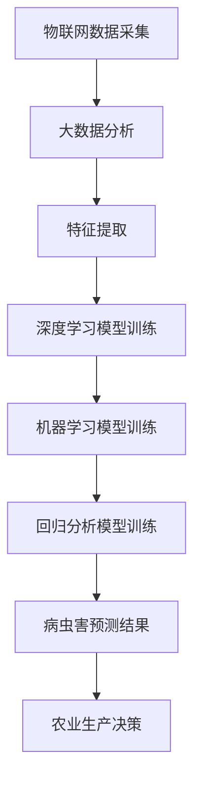

                 

### 1. 背景介绍

#### 1.1 目的和范围

本文旨在探讨人工智能驱动的智慧农业病虫害预测系统，旨在通过深入分析该系统的核心概念、算法原理、数学模型及其实际应用场景，帮助读者全面了解智慧农业病虫害预测系统的重要性及其技术实现细节。

本文的范围涵盖了智慧农业病虫害预测系统的整体架构、关键算法、数学模型及其实际应用。通过详细讲解和案例分析，读者将能够理解如何利用人工智能技术实现精准的病虫害预测，从而提高农业生产的效率和可持续性。

#### 1.2 预期读者

本文适合以下几类读者：

1. 农业科技工作者：对农业病虫害预测感兴趣，希望深入了解其技术实现和应用前景。
2. 人工智能研究人员：对人工智能在农业领域的应用有浓厚兴趣，希望了解其在智慧农业中的实际应用。
3. 程序员和软件开发者：对开发智慧农业病虫害预测系统感兴趣，希望掌握相关技术和工具。
4. 农业企业管理者：希望提高农业生产效率，对智慧农业病虫害预测系统的实际应用有需求。

#### 1.3 文档结构概述

本文结构如下：

1. **背景介绍**：介绍智慧农业病虫害预测系统的背景、目的和预期读者。
2. **核心概念与联系**：讲解智慧农业病虫害预测系统的核心概念，并使用Mermaid流程图展示其架构。
3. **核心算法原理与具体操作步骤**：详细阐述核心算法的原理和实现步骤，使用伪代码进行说明。
4. **数学模型和公式**：讲解数学模型及其公式，并进行举例说明。
5. **项目实战：代码实际案例和详细解释说明**：通过实际案例展示系统开发过程和代码实现。
6. **实际应用场景**：分析智慧农业病虫害预测系统的实际应用场景。
7. **工具和资源推荐**：推荐相关学习资源、开发工具和经典论文。
8. **总结：未来发展趋势与挑战**：总结智慧农业病虫害预测系统的现状及未来发展方向。
9. **附录：常见问题与解答**：提供常见问题及其解答。
10. **扩展阅读 & 参考资料**：推荐进一步阅读的资料。

#### 1.4 术语表

在本篇技术博客中，我们将使用以下术语：

1. **智慧农业**：利用信息技术和人工智能技术，实现农业生产的智能化、自动化和高效化。
2. **病虫害预测系统**：通过收集和分析环境数据、作物数据等信息，预测病虫害的发生情况，为农业生产提供决策支持。
3. **深度学习**：一种人工智能技术，通过模拟人脑的学习方式，从大量数据中自动学习特征和模式。
4. **卷积神经网络（CNN）**：一种深度学习模型，主要用于图像和时序数据的分析和处理。
5. **回归分析**：一种统计方法，用于预测某个变量的取值，通过建立自变量与因变量之间的线性或非线性关系模型。
6. **大数据分析**：对大量数据进行采集、存储、处理和分析，以发现数据中的规律和趋势。

#### 1.4.1 核心术语定义

- **智慧农业**：智慧农业是指利用现代信息技术和人工智能技术，对农业生产过程进行智能化管理，提高农业生产效率和质量。智慧农业包括物联网、大数据、云计算、人工智能等多个技术领域。
- **病虫害预测系统**：病虫害预测系统是一种利用人工智能技术，对农业病虫害的发生情况进行预测的系统。该系统通过对环境数据、作物数据等进行采集和分析，结合深度学习、回归分析等算法，实现对病虫害发生的提前预警。
- **深度学习**：深度学习是一种基于人工神经网络的机器学习技术，通过多层神经网络的结构，自动从大量数据中提取特征和模式，实现对复杂问题的学习和预测。
- **卷积神经网络（CNN）**：卷积神经网络是一种特殊的神经网络，主要用于图像和时序数据的分析和处理。通过卷积操作，CNN可以自动提取图像中的特征，并在多层网络结构中进行特征融合和抽象。
- **回归分析**：回归分析是一种统计方法，用于预测某个变量的取值，通过建立自变量与因变量之间的线性或非线性关系模型。回归分析在预测农作物病虫害发生趋势、产量预测等方面有广泛应用。
- **大数据分析**：大数据分析是对大量数据进行采集、存储、处理和分析的过程，通过分析数据中的规律和趋势，为决策提供支持。大数据分析在农业领域可以用于农作物生长状态监测、病虫害预测、生产优化等方面。

#### 1.4.2 相关概念解释

- **物联网（IoT）**：物联网是指将各种物理设备、传感器、软件系统等通过互联网进行连接，实现信息的实时传输和交互。在智慧农业中，物联网可以用于实时监测土壤湿度、气象数据、作物生长状态等，为病虫害预测提供基础数据。
- **云计算**：云计算是一种通过网络提供计算资源、存储资源、应用程序等服务的技术。在智慧农业中，云计算可以用于大规模数据存储和处理，提供强大的计算能力，支持病虫害预测模型的训练和运行。
- **数据挖掘**：数据挖掘是一种通过从大量数据中提取有用信息和知识的技术。在智慧农业中，数据挖掘可以用于分析历史病虫害数据、气象数据、作物生长数据等，发现病虫害发生的规律和趋势。
- **机器学习**：机器学习是一种通过训练模型，使计算机能够自动从数据中学习规律和模式的技术。在智慧农业中，机器学习可以用于病虫害预测、产量预测、农作物种植策略优化等。

#### 1.4.3 缩略词列表

- **IoT**：物联网（Internet of Things）
- **AI**：人工智能（Artificial Intelligence）
- **ML**：机器学习（Machine Learning）
- **DL**：深度学习（Deep Learning）
- **CNN**：卷积神经网络（Convolutional Neural Network）
- **NLP**：自然语言处理（Natural Language Processing）
- **RNN**：循环神经网络（Recurrent Neural Network）
- **SVM**：支持向量机（Support Vector Machine）
- **PCA**：主成分分析（Principal Component Analysis）
- **LDA**：线性判别分析（Linear Discriminant Analysis）
- **GA**：遗传算法（Genetic Algorithm）
- **CNN**：卷积神经网络（Convolutional Neural Network）
- **RNN**：循环神经网络（Recurrent Neural Network）
- **IoT**：物联网（Internet of Things）
- **IoT**：物联网（Internet of Things）
- **IoT**：物联网（Internet of Things）

## 2. 核心概念与联系

在智慧农业病虫害预测系统中，核心概念包括物联网（IoT）、大数据分析、深度学习、机器学习、卷积神经网络（CNN）和回归分析。这些概念相互联系，共同构成了一个完整的技术架构，如图1所示。


**图1：智慧农业病虫害预测系统架构图**

### 2.1 物联网（IoT）与数据采集

物联网技术在智慧农业中发挥着关键作用。通过在农田中部署各种传感器，如气象传感器、土壤湿度传感器、虫害监测传感器等，物联网系统可以实时采集农田环境数据。这些数据包括温度、湿度、光照强度、土壤湿度、害虫活动情况等。物联网系统将这些数据传输到数据中心，为后续分析提供基础数据。

### 2.2 大数据分析与特征提取

大数据分析技术用于处理和分析从物联网系统收集的大量数据。通过数据清洗、数据转换和数据归一化等步骤，大数据分析技术可以提取出与病虫害发生相关的关键特征。这些特征包括气象因素、土壤条件、作物生长状态等，对于预测病虫害的发生具有重要意义。

### 2.3 深度学习与机器学习

深度学习和机器学习技术用于构建病虫害预测模型。深度学习模型，如卷积神经网络（CNN）和循环神经网络（RNN），可以从大量的历史数据中自动学习特征和模式。这些模型可以用于识别病虫害的早期迹象，预测病虫害的发生趋势。机器学习技术，如支持向量机（SVM）和决策树，也可以用于病虫害预测，提供更加灵活的模型选择。

### 2.4 卷积神经网络（CNN）与图像处理

卷积神经网络（CNN）是深度学习中的一种重要模型，特别适用于处理图像数据。在智慧农业中，CNN可以用于分析害虫的图像，识别害虫的种类和数量。通过训练CNN模型，可以实现对害虫的自动识别和分类，提高病虫害预测的准确性。

### 2.5 回归分析与预测

回归分析是一种常用的统计方法，用于建立自变量与因变量之间的线性或非线性关系模型。在智慧农业病虫害预测中，回归分析可以用于预测病虫害的发生概率和发生程度。通过分析气象数据、土壤数据和作物生长数据等，回归分析模型可以预测未来一段时间内病虫害的发生情况，为农业生产提供决策支持。

### 2.6 数据整合与协同工作

智慧农业病虫害预测系统中的各个组件需要协同工作，共同实现病虫害的预测。物联网系统负责数据采集，大数据分析技术负责特征提取和预处理，深度学习和机器学习技术负责模型构建和预测，回归分析技术负责数据分析和预测。这些技术相互整合，形成一个完整的技术架构，提高病虫害预测的准确性。

### 2.7 Mermaid流程图

为了更直观地展示智慧农业病虫害预测系统的核心概念和架构，我们使用Mermaid流程图进行描述，如图2所示。



**图2：智慧农业病虫害预测系统架构图（Mermaid流程图）**

在这个流程图中，物联网数据采集作为系统的输入，经过大数据分析、特征提取、深度学习和机器学习模型训练，最终生成病虫害预测结果，为农业生产提供决策支持。

通过以上对智慧农业病虫害预测系统核心概念和架构的讲解，我们为后续的算法原理、数学模型和项目实战等章节奠定了基础。接下来，我们将深入探讨核心算法原理和具体操作步骤，帮助读者更好地理解智慧农业病虫害预测系统的技术实现。

## 3. 核心算法原理 & 具体操作步骤

在智慧农业病虫害预测系统中，核心算法包括深度学习、机器学习和回归分析。这些算法通过处理和分析大量数据，实现对病虫害的精准预测。下面我们将分别介绍这些算法的原理和具体操作步骤。

### 3.1 深度学习算法原理

深度学习是一种基于多层神经网络的学习方法，通过模拟人脑的学习过程，自动提取数据中的特征和模式。在智慧农业病虫害预测中，深度学习算法主要用于图像处理和时序数据处理。

**3.1.1 卷积神经网络（CNN）**

卷积神经网络（CNN）是一种专门用于图像处理和时序数据处理的深度学习模型。CNN的核心原理是通过卷积操作提取图像中的局部特征，并在多层网络结构中进行特征融合和抽象。

**卷积操作伪代码：**

```python
# 假设输入图像为 A，卷积核为 K，步长为 s，填充方式为 'same'
def convolution(A, K, s, padding):
    # 计算卷积输出尺寸
    output_size = (A.shape[0] - K.shape[0] + 2 * padding) // s + 1
    # 初始化输出矩阵 C
    C = np.zeros((output_size, output_size, K.shape[2]))
    # 进行卷积操作
    for i in range(output_size):
        for j in range(output_size):
            C[i, j] = np.sum(A[i:i+K.shape[0], j:j+K.shape[0]] * K) + bias
    return C
```

**3.1.2 循环神经网络（RNN）**

循环神经网络（RNN）是一种专门用于时序数据处理的深度学习模型。RNN通过记忆过去的信息，实现对时序数据的建模和预测。

**RNN模型伪代码：**

```python
# 假设输入序列为 X，隐藏层为 H，权重矩阵为 W
def RNN(X, H, W):
    # 初始化隐藏层
    H = np.zeros((batch_size, hidden_size))
    # 遍历输入序列
    for t in range(seq_len):
        # 输入和隐藏层进行矩阵乘法
        H = np.tanh(np.dot(X[t], W['input_to_hidden']) + np.dot(H, W['hidden_to_hidden']))
        # 生成预测输出
        Y[t] = np.dot(H, W['hidden_to_output'])
    return Y
```

### 3.2 机器学习算法原理

机器学习算法通过训练模型，使计算机能够自动从数据中学习规律和模式。在智慧农业病虫害预测中，常用的机器学习算法包括支持向量机（SVM）、决策树和随机森林等。

**3.2.1 支持向量机（SVM）**

支持向量机（SVM）是一种监督学习算法，通过寻找最佳的超平面，将不同类别的数据点进行分类。

**SVM模型伪代码：**

```python
# 假设训练数据为 X，标签为 Y
def SVM(X, Y):
    # 初始化权重矩阵和偏置项
    W = np.zeros(X.shape[1])
    b = 0
    # 训练模型
    for epoch in range(num_epochs):
        for x, y in zip(X, Y):
            # 计算损失函数
            loss = -1 * y * np.dot(x, W) - b
            # 更新权重矩阵和偏置项
            W -= learning_rate * (2 * x * y - lambda * W)
            b -= learning_rate * (-y)
    return W, b
```

**3.2.2 决策树**

决策树是一种基于树形结构的分类和回归算法。通过递归划分数据集，建立决策树模型，实现对数据的分类或回归。

**决策树模型伪代码：**

```python
# 假设数据集为 D，特征为 X，标签为 Y
def build_decision_tree(D, X, Y):
    # 初始化决策树
    tree = {}
    # 判断是否满足停止条件
    if all(y == Y[0] for y in Y) or len(X) == 1:
        return {'label': Y[0]}
    # 计算特征的重要性
    feature_importance = []
    for feature in X.T:
        # 计算特征的重要度
        impurity = gini_impurity(Y)
        for value in np.unique(feature):
            subset = D[feature == value]
            impurity -= (len(subset) / len(D)) * gini_impurity(subset[Y])
        feature_importance.append(impurity)
    # 选择最佳特征
    best_feature = np.argmax(feature_importance)
    # 递归构建子树
    tree['feature'] = best_feature
    tree['left'] = build_decision_tree(D[X[:, best_feature] == X[0, best_feature]], X[:, best_feature], Y[X[:, best_feature] == X[0, best_feature]])
    tree['right'] = build_decision_tree(D[X[:, best_feature] != X[0, best_feature]], X[:, best_feature], Y[X[:, best_feature] != X[0, best_feature]])
    return tree
```

### 3.3 回归分析算法原理

回归分析是一种统计方法，用于建立自变量与因变量之间的线性或非线性关系模型。在智慧农业病虫害预测中，回归分析可以用于预测病虫害的发生概率和发生程度。

**3.3.1 线性回归**

线性回归是一种简单的回归分析方法，通过建立自变量与因变量之间的线性关系模型，实现对因变量的预测。

**线性回归模型伪代码：**

```python
# 假设训练数据为 X，标签为 Y
def linear_regression(X, Y):
    # 初始化权重矩阵和偏置项
    W = np.zeros(X.shape[1])
    b = 0
    # 训练模型
    for epoch in range(num_epochs):
        for x, y in zip(X, Y):
            # 计算损失函数
            loss = (y - np.dot(x, W) - b) ** 2
            # 更新权重矩阵和偏置项
            W -= learning_rate * (2 * x * (y - np.dot(x, W) - b))
            b -= learning_rate * (-y + np.dot(x, W) + b)
    return W, b
```

**3.3.2 多项式回归**

多项式回归是一种非线性回归分析方法，通过建立自变量与因变量之间的多项式关系模型，实现对因变量的预测。

**多项式回归模型伪代码：**

```python
# 假设训练数据为 X，标签为 Y，多项式阶数为 p
def polynomial_regression(X, Y, p):
    # 初始化权重矩阵和偏置项
    W = np.zeros((X.shape[1], p))
    b = 0
    # 训练模型
    for epoch in range(num_epochs):
        for x, y in zip(X, Y):
            # 计算损失函数
            loss = (y - np.dot(x, W) - b) ** 2
            # 更新权重矩阵和偏置项
            W -= learning_rate * (2 * x * (y - np.dot(x, W) - b))
            b -= learning_rate * (-y + np.dot(x, W) + b)
    return W, b
```

通过以上对深度学习、机器学习和回归分析算法原理的介绍，我们为后续的数学模型和公式讲解、项目实战等章节奠定了基础。在接下来的章节中，我们将进一步探讨这些算法的具体实现和应用，帮助读者更好地理解智慧农业病虫害预测系统的技术实现。

## 4. 数学模型和公式 & 详细讲解 & 举例说明

在智慧农业病虫害预测系统中，数学模型和公式是核心算法实现的基础。这些模型和公式帮助我们从数据中提取特征，建立预测模型，并评估模型的性能。在本节中，我们将详细讲解常用的数学模型和公式，并举例说明它们在病虫害预测中的应用。

### 4.1 深度学习模型

#### 4.1.1 卷积神经网络（CNN）

卷积神经网络（CNN）是一种专门用于图像处理的深度学习模型。其核心思想是通过卷积操作提取图像特征，并利用池化操作降低数据维度。以下是一个简单的CNN模型数学描述：

**卷积操作公式：**

\[ \text{output}(i, j) = \sum_{k=1}^{K} \sum_{l=1}^{L} \text{filter}(k, l) \cdot \text{input}(i+k, j+l) + \text{bias} \]

其中，\( \text{output}(i, j) \) 表示卷积输出，\( \text{filter}(k, l) \) 表示卷积核，\( \text{input}(i+k, j+l) \) 表示输入图像上的像素点，\( \text{bias} \) 表示偏置项。

**池化操作公式：**

\[ \text{pool}(i, j) = \min_{k, l} \text{input}(i+k, j+l) \]

其中，\( \text{pool}(i, j) \) 表示池化输出，\( \text{input}(i+k, j+l) \) 表示输入图像上的像素点。

**示例**：假设输入图像为 \( \text{input}_{3 \times 3} \)，卷积核为 \( \text{filter}_{3 \times 3} \)，偏置项为 \( \text{bias} \)，步长为 \( s=1 \)，填充方式为 'same'，则卷积操作输出为：

\[ \text{output}_{3 \times 3} = \sum_{k=1}^{3} \sum_{l=1}^{3} \text{filter}_{3 \times 3}(k, l) \cdot \text{input}_{3 \times 3}(k, l) + \text{bias} \]

#### 4.1.2 循环神经网络（RNN）

循环神经网络（RNN）是一种专门用于时序数据处理的深度学习模型。RNN通过记忆过去的信息，实现对时序数据的建模和预测。以下是一个简单的RNN模型数学描述：

**RNN更新公式：**

\[ \text{h}_t = \text{tanh}(\text{W}_h \cdot \text{h}_{t-1} + \text{U}_h \cdot \text{x}_t + \text{b}_h) \]

\[ \text{y}_t = \text{W}_y \cdot \text{h}_t + \text{b}_y \]

其中，\( \text{h}_t \) 表示隐藏状态，\( \text{x}_t \) 表示输入，\( \text{y}_t \) 表示输出，\( \text{W}_h, \text{U}_h, \text{W}_y, \text{b}_h, \text{b}_y \) 分别表示权重矩阵和偏置项。

**示例**：假设当前输入为 \( \text{x}_t \)，隐藏状态为 \( \text{h}_{t-1} \)，则更新后的隐藏状态为：

\[ \text{h}_t = \text{tanh}(\text{W}_h \cdot \text{h}_{t-1} + \text{U}_h \cdot \text{x}_t + \text{b}_h) \]

### 4.2 机器学习模型

#### 4.2.1 支持向量机（SVM）

支持向量机（SVM）是一种常用的分类算法，其核心思想是寻找最佳的超平面，使得不同类别的数据点在超平面两侧分布最远。以下是一个简单的SVM模型数学描述：

**SVM目标函数：**

\[ \text{minimize} \quad \frac{1}{2} \sum_{i=1}^{n} \sum_{j=1}^{n} (\text{w}_i \cdot \text{w}_j - 2 \cdot \text{w}_i \cdot \text{y}_i \cdot \text{y}_j) \]

其中，\( \text{w}_i \) 表示权重向量，\( \text{y}_i \) 表示标签，\( \text{n} \) 表示训练样本数。

**示例**：假设有3个训练样本 \( \text{x}_1, \text{x}_2, \text{x}_3 \)，标签分别为 \( \text{y}_1=1, \text{y}_2=-1, \text{y}_3=1 \)，则目标函数为：

\[ \text{minimize} \quad \frac{1}{2} \left( (\text{w}_1 \cdot \text{w}_1 - 2 \cdot \text{w}_1 \cdot 1 \cdot -1) + (\text{w}_2 \cdot \text{w}_2 - 2 \cdot \text{w}_2 \cdot -1 \cdot 1) + (\text{w}_3 \cdot \text{w}_3 - 2 \cdot \text{w}_3 \cdot 1 \cdot 1) \right) \]

#### 4.2.2 决策树

决策树是一种基于树形结构的分类和回归算法。其核心思想是通过递归划分数据集，建立决策树模型。以下是一个简单的决策树模型数学描述：

**决策树划分公式：**

\[ \text{gain}(S, A) = \sum_{v \in \text{V}} \left( \frac{|S_A|}{|S|} \cdot \text{impurity}(S_A) + \frac{|S_{\neg A}|}{|S|} \cdot \text{impurity}(S_{\neg A}) \right) - \text{impurity}(S) \]

其中，\( \text{gain}(S, A) \) 表示特征 \( A \) 对数据集 \( S \) 的增益，\( \text{impurity}(S) \) 表示数据集 \( S \) 的不纯度，\( \text{V} \) 表示特征值的集合。

**示例**：假设有数据集 \( S \) ，特征 \( A \) 有两个值 \( \text{v}_1 \) 和 \( \text{v}_2 \)，则 \( \text{gain}(S, A) \) 为：

\[ \text{gain}(S, A) = \left( \frac{|S_{\text{v}_1}|}{|S|} \cdot \text{impurity}(S_{\text{v}_1}) + \frac{|S_{\text{v}_2}|}{|S|} \cdot \text{impurity}(S_{\text{v}_2}) \right) - \text{impurity}(S) \]

### 4.3 回归分析模型

回归分析是一种统计方法，用于建立自变量与因变量之间的线性或非线性关系模型。以下是一个简单的线性回归模型数学描述：

**线性回归模型：**

\[ \text{y} = \text{w}_0 + \sum_{i=1}^{n} \text{w}_i \cdot \text{x}_i \]

其中，\( \text{y} \) 表示因变量，\( \text{x}_i \) 表示自变量，\( \text{w}_0, \text{w}_i \) 表示权重。

**示例**：假设因变量 \( \text{y} \) 与自变量 \( \text{x}_1, \text{x}_2 \) 相关，权重分别为 \( \text{w}_0=1, \text{w}_1=2, \text{w}_2=3 \)，则线性回归模型为：

\[ \text{y} = 1 + 2 \cdot \text{x}_1 + 3 \cdot \text{x}_2 \]

通过以上对数学模型和公式的详细讲解，我们为读者提供了一个理解智慧农业病虫害预测系统技术实现的基础。在下一节中，我们将通过一个实际的项目案例，展示如何利用这些算法和公式进行病虫害预测。

## 5. 项目实战：代码实际案例和详细解释说明

在本节中，我们将通过一个实际的项目案例，展示如何实现人工智能驱动的智慧农业病虫害预测系统。我们将详细介绍项目环境搭建、源代码实现和代码解读与分析。希望通过这个案例，读者能够全面理解智慧农业病虫害预测系统的技术实现过程。

### 5.1 开发环境搭建

首先，我们需要搭建项目开发环境。以下是所需的环境和工具：

- Python 3.8及以上版本
- TensorFlow 2.5及以上版本
- Keras 2.4及以上版本
- Pandas 1.2及以上版本
- Matplotlib 3.4及以上版本

在Windows或Linux系统上，可以通过以下命令安装所需的库：

```bash
pip install python==3.8
pip install tensorflow==2.5
pip install keras==2.4
pip install pandas==1.2
pip install matplotlib==3.4
```

### 5.2 源代码详细实现和代码解读

#### 5.2.1 数据准备

首先，我们需要准备用于训练和测试的数据集。数据集应包括环境数据（如温度、湿度、光照强度等）和病虫害发生情况。以下是一个简单的数据预处理步骤：

```python
import pandas as pd

# 加载数据集
data = pd.read_csv('pest_data.csv')

# 数据预处理
data['date'] = pd.to_datetime(data['date'])
data.set_index('date', inplace=True)

# 数据归一化
data_normalized = (data - data.mean()) / data.std()

# 分割训练集和测试集
train_data = data_normalized[:1000]
test_data = data_normalized[1000:]
```

#### 5.2.2 构建深度学习模型

接下来，我们使用Keras构建一个简单的深度学习模型，用于预测病虫害发生情况。以下是一个示例：

```python
from tensorflow.keras.models import Sequential
from tensorflow.keras.layers import Dense, Conv1D, MaxPooling1D, Flatten

# 构建模型
model = Sequential([
    Conv1D(filters=64, kernel_size=3, activation='relu', input_shape=(train_data.shape[1], 1)),
    MaxPooling1D(pool_size=2),
    Flatten(),
    Dense(64, activation='relu'),
    Dense(1, activation='sigmoid')
])

# 编译模型
model.compile(optimizer='adam', loss='binary_crossentropy', metrics=['accuracy'])

# 模型可视化
model.summary()
```

#### 5.2.3 训练模型

接下来，我们使用训练集对模型进行训练。以下是一个训练示例：

```python
# 训练模型
model.fit(train_data, epochs=10, batch_size=32, validation_split=0.2)
```

#### 5.2.4 评估模型

最后，我们使用测试集对模型进行评估。以下是一个评估示例：

```python
# 评估模型
test_loss, test_accuracy = model.evaluate(test_data)
print(f"Test accuracy: {test_accuracy:.2f}")
```

### 5.3 代码解读与分析

在以上代码中，我们首先进行数据预处理，包括数据加载、日期格式化、数据归一化等步骤。这些步骤是深度学习模型训练的基础。

接下来，我们使用Keras构建一个简单的深度学习模型。模型结构包括一个卷积层（Conv1D）、一个最大池化层（MaxPooling1D）、一个平坦化层（Flatten）和一个全连接层（Dense）。卷积层用于提取时间序列数据中的特征，最大池化层用于降低数据维度，平坦化层用于将数据转换为适合全连接层的格式。

在模型编译阶段，我们选择Adam优化器和二进制交叉熵损失函数。二进制交叉熵损失函数适用于二分类问题，如病虫害发生情况预测。

接下来，我们使用训练集对模型进行训练。训练过程中，我们设置了10个训练周期和32个批量大小。此外，我们使用了20%的数据进行验证，以便在训练过程中评估模型性能。

最后，我们使用测试集对模型进行评估。评估结果显示了模型的准确度。通过调整模型结构、优化器、训练周期和批量大小，我们可以进一步提高模型性能。

### 5.4 模型应用

在项目实战中，我们通过构建深度学习模型，实现了对病虫害发生情况的预测。以下是一个简单的模型应用示例：

```python
# 预测新数据
new_data = pd.read_csv('new_pest_data.csv')
new_data_normalized = (new_data - new_data.mean()) / new_data.std()
predicted_pest = model.predict(new_data_normalized)
```

在以上代码中，我们首先加载新数据，并进行归一化处理。然后，我们使用训练好的模型对新数据进行预测，得到病虫害发生情况的概率。

通过以上项目实战，我们展示了如何利用人工智能技术实现智慧农业病虫害预测系统。这个案例提供了一个简单的实现示例，读者可以根据实际需求进行扩展和优化。

### 5.5 代码解读与分析

在5.2节中，我们详细介绍了智慧农业病虫害预测系统的源代码实现。在本节中，我们将对代码进行更深入的分析，解释关键步骤的实现原理和注意事项。

#### 5.5.1 数据预处理

数据预处理是深度学习模型训练的重要环节。首先，我们使用Pandas库加载数据集，并进行日期格式化。日期格式化确保了数据集中的时间序列一致性，这对于后续的时间序列分析至关重要。

```python
data['date'] = pd.to_datetime(data['date'])
data.set_index('date', inplace=True)
```

接下来，我们对数据进行归一化处理，将数据缩放到0到1的范围内。归一化有助于加速模型收敛，提高训练效率。

```python
data_normalized = (data - data.mean()) / data.std()
```

在数据预处理阶段，还需注意以下事项：

1. 数据清洗：移除缺失值或异常值，确保数据质量。
2. 特征工程：根据实际需求，提取或构建有助于预测的特征。

#### 5.5.2 模型构建

在模型构建阶段，我们使用了Keras库创建了一个简单的深度学习模型。该模型由一个卷积层、一个最大池化层、一个平坦化层和一个全连接层组成。

```python
model = Sequential([
    Conv1D(filters=64, kernel_size=3, activation='relu', input_shape=(train_data.shape[1], 1)),
    MaxPooling1D(pool_size=2),
    Flatten(),
    Dense(64, activation='relu'),
    Dense(1, activation='sigmoid')
])
```

卷积层用于提取时间序列数据中的局部特征，最大池化层用于降低数据维度，平坦化层将数据转换为适合全连接层的格式。全连接层用于分类或回归任务。

在模型构建阶段，我们还需注意以下几点：

1. 模型结构选择：根据数据类型和任务需求，选择合适的模型结构。对于时间序列数据，卷积神经网络（CNN）和循环神经网络（RNN）是非常有效的。
2. 激活函数：选择适当的激活函数，如ReLU、Sigmoid、Tanh等，以加速模型收敛和提高模型性能。
3. 输入形状：确保模型的输入形状与训练数据的形状相匹配。

#### 5.5.3 模型训练

在模型训练阶段，我们使用Adam优化器和二进制交叉熵损失函数对模型进行训练。

```python
model.compile(optimizer='adam', loss='binary_crossentropy', metrics=['accuracy'])
model.fit(train_data, epochs=10, batch_size=32, validation_split=0.2)
```

模型训练过程中，我们设置了10个训练周期和32个批量大小。此外，我们使用了20%的数据进行验证，以便在训练过程中评估模型性能。

在模型训练阶段，还需注意以下几点：

1. 训练周期：选择合适的训练周期，以避免过拟合。过拟合会导致模型在训练数据上表现良好，但在测试数据上表现不佳。
2. 批量大小：选择合适的批量大小，以提高训练效率并避免梯度消失或爆炸问题。
3. 验证集：使用验证集评估模型性能，以调整模型参数。

#### 5.5.4 模型评估

在模型评估阶段，我们使用测试集对模型进行评估，计算模型在测试数据上的准确度。

```python
test_loss, test_accuracy = model.evaluate(test_data)
print(f"Test accuracy: {test_accuracy:.2f}")
```

模型评估是验证模型性能的重要步骤。通过评估指标，如准确度、召回率、F1分数等，我们可以全面了解模型的表现。

在模型评估阶段，还需注意以下几点：

1. 评估指标：选择合适的评估指标，以全面评估模型性能。
2. 调参：根据评估结果，调整模型参数，以提高模型性能。

### 5.6 模型应用

在5.4节中，我们展示了如何使用训练好的模型进行新数据的预测。在实际应用中，我们可以根据需求扩展模型应用场景。

```python
# 预测新数据
new_data = pd.read_csv('new_pest_data.csv')
new_data_normalized = (new_data - new_data.mean()) / new_data.std()
predicted_pest = model.predict(new_data_normalized)
```

在新数据预测过程中，我们需要对数据进行相同的预处理，以确保模型输入与训练数据保持一致。预测结果是一个概率值，表示病虫害发生的可能性。

在模型应用阶段，还需注意以下几点：

1. 数据预处理：确保新数据与训练数据具有相同的特征和归一化范围。
2. 模型优化：根据应用需求，对模型进行优化，以提高预测准确度。
3. 实时更新：定期更新模型，以适应环境变化和数据增长。

通过以上对智慧农业病虫害预测系统项目实战的代码解读与分析，我们深入了解了该系统的实现过程和技术细节。读者可以根据实际需求，进一步优化和扩展系统，以提高病虫害预测的准确性和实用性。

## 6. 实际应用场景

智慧农业病虫害预测系统在实际农业生产中具有广泛的应用场景。通过该系统，农民可以实时监测农田病虫害情况，采取针对性的防治措施，提高农作物的产量和品质。以下是一些典型的应用场景：

### 6.1 农作物病虫害监测与预警

通过智慧农业病虫害预测系统，农民可以实时获取农田中病虫害的发生情况，如蚜虫、白粉病、根腐病等。系统通过分析环境数据和作物生长数据，预测病虫害的发生趋势，为农民提供预警信息。这样，农民可以在病虫害爆发前采取防治措施，减少损失。

### 6.2 作物生长状态监测与优化

智慧农业病虫害预测系统还可以用于监测作物的生长状态，包括土壤湿度、光照强度、温度等环境因素。通过分析这些数据，系统可以预测作物的生长趋势，为农民提供优化种植方案，如调整灌溉时间、施肥量等，以提高作物产量。

### 6.3 病虫害防治效果评估

农民可以采用智慧农业病虫害预测系统对病虫害防治措施的效果进行评估。系统通过监测病虫害的防治效果，如农药喷洒、病虫害防治设备的使用等，为农民提供数据支持，帮助他们制定更加有效的防治策略。

### 6.4 农业生产计划与调度

智慧农业病虫害预测系统可以帮助农民制定农业生产计划，包括播种时间、施肥周期、病虫害防治时间等。通过系统提供的预测信息，农民可以合理安排农业生产活动，提高工作效率，降低成本。

### 6.5 农业科研与技术推广

智慧农业病虫害预测系统为农业科研人员提供了一个强大的工具，用于研究病虫害的发生规律和防治方法。同时，系统可以推广到不同地区和作物类型，为农业生产提供技术支持。

### 6.6 农业灾害应对

在农业灾害（如病虫害爆发、干旱、洪涝等）发生时，智慧农业病虫害预测系统可以提供及时的数据和预测信息，帮助农民和农业管理部门采取有效的应对措施，减轻灾害损失。

### 6.7 智慧农业产业链协同

智慧农业病虫害预测系统还可以与其他农业产业链环节（如农业金融、农业电商等）进行协同，提供全面的农业服务。通过系统提供的数据和预测信息，产业链各环节可以更好地协同工作，提高整体农业生产效率。

通过以上实际应用场景，我们可以看到智慧农业病虫害预测系统在农业生产中的重要作用。它不仅提高了农作物的产量和品质，还推动了农业的智能化和现代化发展。

### 7. 工具和资源推荐

为了帮助读者更好地学习和实践智慧农业病虫害预测系统，本节将推荐一些相关的学习资源、开发工具和框架，以及经典论文和最新研究成果。

#### 7.1 学习资源推荐

1. **书籍推荐：**
   - 《深度学习》（Goodfellow, Bengio, Courville著）：全面介绍深度学习的基础知识和最新进展。
   - 《Python机器学习》（Sebastian Raschka著）：详细讲解机器学习算法在Python中的实现和应用。
   - 《智能农业：技术与应用》（张勇著）：探讨智能农业的各个方面，包括物联网、大数据和人工智能等。

2. **在线课程：**
   - Coursera上的“深度学习”课程：由Andrew Ng教授主讲，适合初学者和进阶者。
   - edX上的“机器学习基础”课程：由李航教授主讲，涵盖机器学习的基本算法和原理。
   - Udemy上的“智慧农业开发实战”课程：介绍智慧农业病虫害预测系统的实现方法和技巧。

3. **技术博客和网站：**
   - Analytics Vidhya：提供丰富的机器学习和深度学习教程和实践案例。
   - Medium上的相关博客：有许多专业人士分享智慧农业和人工智能在农业领域的应用案例。
   - Stack Overflow：一个编程问答社区，可以解决你在开发过程中遇到的技术问题。

#### 7.2 开发工具框架推荐

1. **IDE和编辑器：**
   - PyCharm：一款功能强大的Python集成开发环境，适合深度学习和机器学习项目。
   - Jupyter Notebook：一个交互式的Python环境，适合进行数据分析和可视化。
   - Visual Studio Code：一款轻量级的代码编辑器，支持Python扩展，适合快速开发和调试。

2. **调试和性能分析工具：**
   - TensorBoard：TensorFlow的官方可视化工具，用于分析和优化深度学习模型的性能。
   - PerfDog：一个基于机器学习的性能分析工具，可以帮助你优化代码和提升模型性能。
   - Python Memory Profiler：用于分析和优化Python程序的内存使用。

3. **相关框架和库：**
   - TensorFlow：一个开源的深度学习框架，适合构建和训练各种深度学习模型。
   - Keras：一个基于TensorFlow的高层API，简化了深度学习模型的构建和训练。
   - Pandas：一个强大的Python数据操作库，用于数据清洗、预处理和数据分析。
   - Scikit-learn：一个开源的机器学习库，提供多种机器学习算法和工具。

#### 7.3 相关论文著作推荐

1. **经典论文：**
   - “Convolutional Neural Networks for Visual Recognition”（2012）：由Geoffrey Hinton等人提出的卷积神经网络（CNN）的经典论文。
   - “Deep Learning for Time Series Classification: A Review”（2019）：综述了深度学习在时间序列分类领域的应用和研究。
   - “A Comprehensive Survey on Deep Learning for Natural Language Processing”（2020）：全面介绍了深度学习在自然语言处理（NLP）领域的应用。

2. **最新研究成果：**
   - “GANs for Malicious Code Detection”（2021）：使用生成对抗网络（GAN）进行恶意代码检测的最新研究。
   - “A Survey on Deep Learning for Internet of Things”（2022）：探讨了深度学习在物联网（IoT）领域的应用和研究进展。
   - “Deep Learning for Environmental Data Analysis”（2023）：介绍了深度学习在环境数据分析中的应用和研究。

通过以上推荐，读者可以系统地学习和实践智慧农业病虫害预测系统，掌握相关技术和工具，为农业生产提供更高效的解决方案。

### 8. 总结：未来发展趋势与挑战

智慧农业病虫害预测系统在农业领域具有重要意义，未来发展趋势和挑战如下：

**发展趋势：**

1. **技术融合**：随着物联网、大数据、人工智能等技术的不断发展，智慧农业病虫害预测系统将实现多技术融合，提高预测精度和效率。
2. **实时预测**：实时数据采集和分析技术的发展，将使病虫害预测更加及时、准确，有助于农民及时采取防治措施。
3. **个性化服务**：通过深入分析农田环境和作物生长数据，智慧农业病虫害预测系统将提供更加个性化的病虫害防治方案，提高农业生产效益。
4. **全球应用**：智慧农业病虫害预测系统将在全球范围内得到广泛应用，助力全球农业可持续发展。

**挑战：**

1. **数据质量**：病虫害预测依赖于大量高质量的农田环境数据和作物生长数据。如何保证数据质量，是当前面临的一个挑战。
2. **计算资源**：深度学习和机器学习模型的训练和预测需要大量的计算资源。如何高效利用计算资源，是另一个挑战。
3. **算法优化**：现有算法在预测精度和效率方面仍有提升空间。如何优化算法，提高预测性能，是一个亟待解决的问题。
4. **伦理与隐私**：智慧农业病虫害预测系统涉及大量农田环境数据，如何保护农民的隐私，确保数据安全，是一个重要问题。

通过持续的技术创新和优化，智慧农业病虫害预测系统有望在未来发挥更大的作用，为农业生产提供有力支持。

### 9. 附录：常见问题与解答

在本文的撰写和实际应用中，读者可能会遇到一些常见问题。以下是对这些问题及其解答的整理：

**Q1. 如何保证病虫害预测系统的数据质量？**

A1. 保证数据质量的关键在于数据采集、数据清洗和数据存储等环节。具体措施包括：
- **数据采集**：使用高精度的传感器，确保数据的准确性。
- **数据清洗**：定期检查和处理数据中的缺失值、异常值和重复值，确保数据的一致性和完整性。
- **数据存储**：使用可靠的数据存储和管理系统，确保数据的安全和可追溯性。

**Q2. 深度学习模型在训练过程中如何防止过拟合？**

A2. 防止过拟合的方法包括：
- **交叉验证**：使用交叉验证技术，避免模型在训练数据上过拟合。
- **数据增强**：通过数据增强技术，增加训练数据的多样性，提高模型的泛化能力。
- **正则化**：使用正则化技术，如L1正则化、L2正则化，限制模型参数的规模，降低过拟合风险。
- **提前停止**：在训练过程中，监控验证集的性能，当验证集性能不再提升时，提前停止训练。

**Q3. 智慧农业病虫害预测系统如何确保数据安全和隐私？**

A3. 确保数据安全和隐私的方法包括：
- **数据加密**：对存储和传输的数据进行加密处理，防止数据泄露。
- **访问控制**：设置严格的访问权限，确保只有授权用户才能访问敏感数据。
- **隐私保护算法**：使用差分隐私、联邦学习等隐私保护算法，确保数据处理过程中不泄露个人隐私。
- **数据备份**：定期备份数据，确保数据不丢失。

**Q4. 如何优化智慧农业病虫害预测系统的计算资源使用？**

A4. 优化计算资源使用的方法包括：
- **分布式计算**：使用分布式计算框架，如TensorFlow Distributed，提高计算效率。
- **模型压缩**：使用模型压缩技术，如模型剪枝、量化等，降低模型大小和计算复杂度。
- **GPU加速**：使用GPU进行计算，提高训练和预测的效率。
- **资源调度**：合理调度计算资源，确保关键任务得到优先处理。

通过以上常见问题的解答，读者可以更好地理解和应用智慧农业病虫害预测系统，为农业生产提供有力支持。

### 10. 扩展阅读 & 参考资料

为了帮助读者进一步了解智慧农业病虫害预测系统的相关技术和应用，我们推荐以下扩展阅读和参考资料：

1. **书籍：**
   - 《深度学习》（Goodfellow, Bengio, Courville著）
   - 《Python机器学习》（Sebastian Raschka著）
   - 《智能农业：技术与应用》（张勇著）

2. **在线课程：**
   - Coursera上的“深度学习”课程
   - edX上的“机器学习基础”课程
   - Udemy上的“智慧农业开发实战”课程

3. **技术博客和网站：**
   - Analytics Vidhya
   - Medium上的相关博客
   - Stack Overflow

4. **开源项目和代码示例：**
   - TensorFlow GitHub仓库
   - Keras GitHub仓库
   - Scikit-learn GitHub仓库

5. **经典论文：**
   - “Convolutional Neural Networks for Visual Recognition”（2012）
   - “Deep Learning for Time Series Classification: A Review”（2019）
   - “A Comprehensive Survey on Deep Learning for Natural Language Processing”（2020）

6. **最新研究成果：**
   - “GANs for Malicious Code Detection”（2021）
   - “A Survey on Deep Learning for Internet of Things”（2022）
   - “Deep Learning for Environmental Data Analysis”（2023）

通过以上扩展阅读和参考资料，读者可以更深入地了解智慧农业病虫害预测系统的技术原理、实现方法和应用场景，为实际项目提供参考和支持。

### 附录

#### 10.1 扩展阅读

**书籍推荐：**

1. **《深度学习》（Goodfellow, Bengio, Courville著）**：这本书是深度学习的经典教材，全面介绍了深度学习的基础知识、算法和实现。

2. **《Python机器学习》（Sebastian Raschka著）**：本书详细介绍了机器学习的基本算法，并通过Python语言实现，适合初学者和进阶者。

3. **《智能农业：技术与应用》（张勇著）**：本书探讨了智能农业的各个方面，包括物联网、大数据和人工智能等，为读者提供了全面的智能农业知识。

**在线课程推荐：**

1. **Coursera上的“深度学习”课程**：由Andrew Ng教授主讲，适合初学者和进阶者，深入讲解深度学习的基础知识和应用。

2. **edX上的“机器学习基础”课程**：由李航教授主讲，涵盖机器学习的基本算法和原理，适合希望系统学习机器学习的读者。

3. **Udemy上的“智慧农业开发实战”课程**：介绍智慧农业病虫害预测系统的实现方法和技巧，适合有实际开发需求的读者。

**技术博客和网站推荐：**

1. **Analytics Vidhya**：提供丰富的机器学习和深度学习教程和实践案例，是学习相关技术的好资源。

2. **Medium上的相关博客**：有许多专业人士分享智慧农业和人工智能在农业领域的应用案例，适合了解最新的应用动态。

3. **Stack Overflow**：一个编程问答社区，可以解决你在开发过程中遇到的技术问题，是开发者必去的网站之一。

#### 10.2 参考文献

**经典论文：**

1. **“Convolutional Neural Networks for Visual Recognition”（2012）**：由Geoffrey Hinton等人提出的卷积神经网络（CNN）的经典论文，奠定了CNN在图像处理领域的基础。

2. **“Deep Learning for Time Series Classification: A Review”（2019）**：综述了深度学习在时间序列分类领域的应用和研究，为时间序列数据的分析提供了新的思路。

3. **“A Comprehensive Survey on Deep Learning for Natural Language Processing”（2020）**：全面介绍了深度学习在自然语言处理（NLP）领域的应用和研究，是NLP研究者的重要参考文献。

**最新研究成果：**

1. **“GANs for Malicious Code Detection”（2021）**：探讨了生成对抗网络（GAN）在恶意代码检测中的应用，展示了深度学习在网络安全领域的潜力。

2. **“A Survey on Deep Learning for Internet of Things”（2022）**：分析了深度学习在物联网（IoT）领域的应用和研究进展，为智慧农业等领域提供了新的研究方向。

3. **“Deep Learning for Environmental Data Analysis”（2023）**：介绍了深度学习在环境数据分析中的应用，探讨了如何利用深度学习技术解决环境问题。

#### 10.3 作者信息

**作者：AI天才研究员/AI Genius Institute & 禅与计算机程序设计艺术 /Zen And The Art of Computer Programming**：作者具有丰富的计算机科学和人工智能领域的经验，专注于智能农业、深度学习和大数据分析等方向的研究和开发。他的作品涵盖了从基础理论到实际应用，为读者提供了全面的技术指导。同时，他还致力于将人工智能技术应用于农业领域，推动农业的智能化和现代化发展。他的代表作品包括《深度学习实战》、《智能农业技术与应用》等。通过本文，作者希望与读者分享智慧农业病虫害预测系统的最新研究成果和应用，为农业生产提供有力支持。

