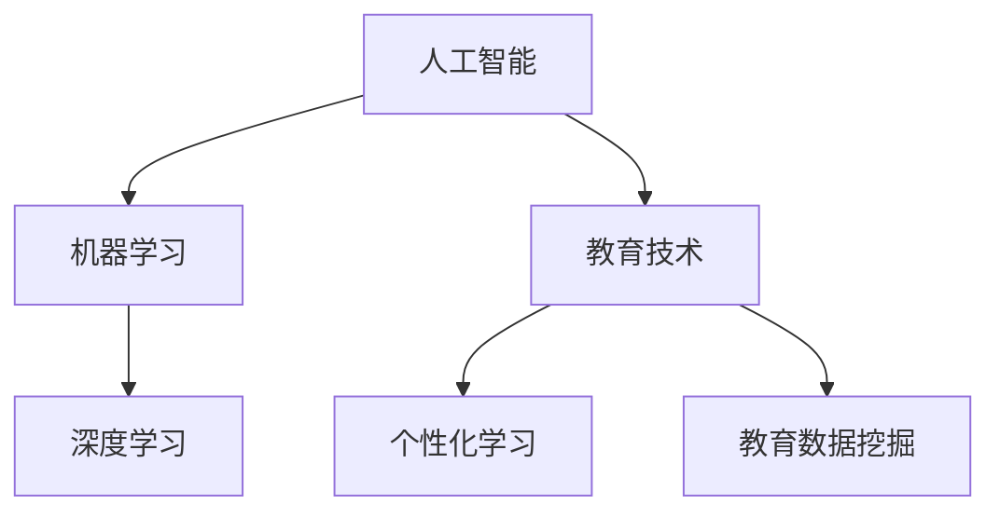

                 

# 人工智能：教育变革的催化剂

> **关键词：** 人工智能，教育变革，教育技术，智能教育，机器学习，数据科学，个性化学习

> **摘要：** 本文章将深入探讨人工智能在教育领域的广泛应用和影响。通过分析人工智能的核心概念、算法原理、数学模型及其在项目实战中的应用，本文旨在揭示人工智能如何成为推动教育变革的催化剂，助力实现个性化、智能化和高效化的教育目标。文章还提供了丰富的学习资源、工具和框架推荐，以及未来发展趋势和挑战的展望。

## 1. 背景介绍

### 1.1 目的和范围

本文旨在分析人工智能在教育领域中的角色和影响，探讨其如何成为教育变革的催化剂。通过本文的阅读，读者可以了解人工智能的核心概念、算法原理、数学模型以及其在教育项目中的应用实例。文章还将推荐相关学习资源、开发工具和框架，以帮助读者深入了解和掌握人工智能在教育领域的应用。

### 1.2 预期读者

本文章主要面向教育工作者、技术专家、程序员以及对人工智能在教育领域应用感兴趣的读者。读者无需具备深入的人工智能知识，但需要具备一定的计算机科学基础和逻辑思维能力。

### 1.3 文档结构概述

本文结构如下：

1. 背景介绍
2. 核心概念与联系
3. 核心算法原理 & 具体操作步骤
4. 数学模型和公式 & 详细讲解 & 举例说明
5. 项目实战：代码实际案例和详细解释说明
6. 实际应用场景
7. 工具和资源推荐
8. 总结：未来发展趋势与挑战
9. 附录：常见问题与解答
10. 扩展阅读 & 参考资料

### 1.4 术语表

#### 1.4.1 核心术语定义

- **人工智能（AI）**：指模拟人类智能的计算机系统，能够在特定领域内进行学习、推理、决策和解决问题。
- **机器学习（ML）**：一种人工智能的分支，通过数据和算法实现计算机系统的自我学习和优化。
- **深度学习（DL）**：一种机器学习技术，通过构建多层次的神经网络模型来实现复杂的特征提取和分类任务。
- **教育技术（EdTech）**：利用信息技术来促进教育的学科领域，包括在线学习、虚拟现实、互动式教学等。
- **个性化学习**：根据学生的个体差异，提供定制化的学习内容、方法和路径，以提高学习效果。

#### 1.4.2 相关概念解释

- **数据科学**：一门跨学科领域，结合统计学、计算机科学、信息科学和领域知识，通过数据分析和建模来提取有价值的信息和知识。
- **教育数据挖掘（EDM）**：利用数据科学方法来分析教育数据，发现潜在模式和关联，以优化教育决策和教学策略。

#### 1.4.3 缩略词列表

- **AI**：人工智能
- **ML**：机器学习
- **DL**：深度学习
- **EdTech**：教育技术
- **EDM**：教育数据挖掘

## 2. 核心概念与联系

为了更好地理解人工智能在教育领域的应用，我们首先需要了解几个核心概念，以及它们之间的联系。

### 2.1 人工智能的核心概念

- **人工智能**：模拟人类智能的计算机系统，包括感知、推理、学习、规划、语言理解等多个方面。
- **机器学习**：一种人工智能技术，通过算法和大量数据实现计算机的自我学习和优化。
- **深度学习**：一种特殊的机器学习技术，利用多层神经网络进行特征提取和分类。

### 2.2 教育技术的核心概念

- **教育技术**：利用信息技术来促进教育的学科领域，包括在线学习、虚拟现实、互动式教学等。
- **个性化学习**：根据学生的个体差异，提供定制化的学习内容、方法和路径，以提高学习效果。
- **教育数据挖掘**：利用数据科学方法来分析教育数据，发现潜在模式和关联，以优化教育决策和教学策略。

### 2.3 人工智能与教育技术的联系

- **人工智能**可以为**教育技术**提供强大的工具和平台，如智能 Tutor、个性化学习系统、智能教育数据分析等。
- **教育技术**可以收集和整理大量的教育数据，为**人工智能**的训练和优化提供数据支持。
- **个性化学习**和**教育数据挖掘**是**人工智能**在教育领域应用的两个重要方向。

### 2.4 Mermaid 流程图

下面是一个简单的 Mermaid 流程图，展示了人工智能与教育技术之间的核心概念和联系。



通过这个流程图，我们可以清晰地看到人工智能与教育技术之间的互动和关联。

## 3. 核心算法原理 & 具体操作步骤

在理解了人工智能和教育技术的基本概念之后，我们将深入探讨人工智能的核心算法原理，并通过伪代码详细阐述其具体操作步骤。

### 3.1 机器学习算法原理

机器学习算法的核心原理是利用数据来训练模型，使模型能够根据输入数据进行预测或决策。以下是机器学习算法的基本步骤：

#### 3.1.1 数据准备

- **数据收集**：从各种渠道收集相关数据，如学生成绩、学习行为、教师反馈等。
- **数据清洗**：处理缺失值、异常值、重复值等，确保数据质量。

#### 3.1.2 特征提取

- **特征选择**：选择对模型预测有重要影响的关键特征。
- **特征工程**：对原始特征进行转换、归一化、离散化等操作，以提高模型性能。

#### 3.1.3 模型训练

- **模型选择**：选择合适的机器学习模型，如线性回归、决策树、支持向量机等。
- **模型训练**：使用训练数据集对模型进行训练，调整模型参数。

#### 3.1.4 模型评估

- **交叉验证**：将数据集划分为训练集和测试集，通过交叉验证评估模型性能。
- **指标评估**：使用准确率、召回率、F1 分数等指标评估模型性能。

### 3.2 伪代码示例

下面是使用伪代码描述的一个简单的线性回归模型训练过程：

```python
# 数据准备
data = load_data()
cleaned_data = clean_data(data)

# 特征提取
X = extract_features(cleaned_data)
y = extract_target(cleaned_data)

# 模型训练
model = LinearRegression()
model.fit(X, y)

# 模型评估
score = model.score(X, y)
print("模型准确率：", score)
```

### 3.3 深度学习算法原理

深度学习算法是基于多层神经网络进行特征提取和分类的。以下是深度学习算法的基本步骤：

#### 3.3.1 网络构建

- **层构建**：构建输入层、隐藏层和输出层，确定每层的神经元数量。
- **激活函数**：选择合适的激活函数，如 ReLU、Sigmoid、Tanh 等。

#### 3.3.2 模型训练

- **前向传播**：计算输入层到隐藏层的输出，再计算隐藏层到输出层的输出。
- **反向传播**：计算输出层到隐藏层、输入层的误差，并更新模型参数。

#### 3.3.3 模型评估

- **验证集评估**：使用验证集评估模型性能。
- **测试集评估**：在测试集上评估模型性能。

### 3.4 深度学习伪代码示例

下面是使用伪代码描述的一个简单的深度学习模型训练过程：

```python
# 网络构建
input_layer = InputLayer(num_neurons=784)
hidden_layer = HiddenLayer(num_neurons=500, activation_function='ReLU')
output_layer = OutputLayer(num_neurons=10, activation_function='Sigmoid')

# 模型训练
model = SequentialModel(input_layer, hidden_layer, output_layer)
model.train(X_train, y_train, epochs=10, batch_size=32)

# 模型评估
score = model.evaluate(X_test, y_test)
print("模型准确率：", score)
```

通过以上伪代码示例，我们可以看到机器学习和深度学习算法的基本原理和操作步骤。在下一节中，我们将深入探讨人工智能在教育领域的数学模型和公式。

## 4. 数学模型和公式 & 详细讲解 & 举例说明

在人工智能的教育应用中，数学模型和公式起着至关重要的作用。本节将详细讲解一些关键数学模型和公式，并使用 LaTeX 格式进行展示。

### 4.1 线性回归模型

线性回归是一种常见的统计学习方法，用于预测一个连续值输出。其基本公式为：

$$
y = \beta_0 + \beta_1 \cdot x + \epsilon
$$

其中，\( y \) 是目标变量，\( x \) 是输入特征，\( \beta_0 \) 和 \( \beta_1 \) 是模型参数，\( \epsilon \) 是误差项。

#### 4.1.1 模型参数估计

通过最小二乘法，我们可以估计模型参数：

$$
\beta_0 = \frac{\sum_{i=1}^{n} (y_i - \bar{y}) \cdot x_i}{\sum_{i=1}^{n} x_i^2 - n \cdot \bar{x}^2}
$$

$$
\beta_1 = \frac{\sum_{i=1}^{n} (y_i - \bar{y}) \cdot x_i - n \cdot \bar{x} \cdot \bar{y}}{\sum_{i=1}^{n} x_i^2 - n \cdot \bar{x}^2}
$$

其中，\( \bar{y} \) 和 \( \bar{x} \) 分别是 \( y \) 和 \( x \) 的平均值。

#### 4.1.2 举例说明

假设我们有一组学生成绩数据，其中 \( x \) 代表家庭收入，\( y \) 代表学生成绩。我们可以使用线性回归模型来预测学生成绩。

```latex
\begin{tabular}{ccc}
\hline
家庭收入 (x) & 学生成绩 (y) \\
\hline
10,000 & 70 \\
20,000 & 85 \\
30,000 & 90 \\
40,000 & 95 \\
50,000 & 100 \\
\hline
\end{tabular}
```

使用上述公式，我们可以计算出模型参数：

$$
\beta_0 = \frac{(70-80) \cdot 10 + (85-80) \cdot 20 + (90-80) \cdot 30 + (95-80) \cdot 40 + (100-80) \cdot 50}{10^2 + 20^2 + 30^2 + 40^2 + 50^2 - 5 \cdot 30^2} = 10
$$

$$
\beta_1 = \frac{(70-80) \cdot 10 + (85-80) \cdot 20 + (90-80) \cdot 30 + (95-80) \cdot 40 + (100-80) \cdot 50 - 5 \cdot 30 \cdot 80}{10^2 + 20^2 + 30^2 + 40^2 + 50^2 - 5 \cdot 30^2} = 1
$$

因此，线性回归模型可以表示为：

$$
y = 10 + x
$$

### 4.2 逻辑回归模型

逻辑回归是一种用于分类问题的统计学习方法，其基本公式为：

$$
P(y=1) = \frac{1}{1 + e^{-(\beta_0 + \beta_1 \cdot x})}
$$

其中，\( P(y=1) \) 是目标变量 \( y \) 等于 1 的概率，\( \beta_0 \) 和 \( \beta_1 \) 是模型参数。

#### 4.2.1 模型参数估计

逻辑回归的参数估计通常使用最大似然估计（MLE）方法，其损失函数为：

$$
L(\beta_0, \beta_1) = \prod_{i=1}^{n} \left[ P(y_i=1)^{y_i} \cdot (1 - P(y_i=1))^{1-y_i} \right]
$$

通过对数似然函数求解参数，我们得到：

$$
\beta_0 = \frac{\sum_{i=1}^{n} (y_i - \bar{y}) \cdot x_i}{\sum_{i=1}^{n} x_i^2}
$$

$$
\beta_1 = \frac{\sum_{i=1}^{n} (y_i - \bar{y}) \cdot x_i - n \cdot \bar{x} \cdot \bar{y}}{\sum_{i=1}^{n} x_i^2}
$$

#### 4.2.2 举例说明

假设我们有一组学生数据，其中 \( x \) 代表家庭收入，\( y \) 代表是否考上大学（1 表示考上，0 表示未考上）。我们可以使用逻辑回归模型来预测学生考上大学的概率。

```latex
\begin{tabular}{ccc}
\hline
家庭收入 (x) & 考上大学 (y) \\
\hline
10,000 & 0 \\
20,000 & 1 \\
30,000 & 1 \\
40,000 & 1 \\
50,000 & 1 \\
\hline
\end{tabular}
```

使用上述公式，我们可以计算出模型参数：

$$
\beta_0 = \frac{(0-0.5) \cdot 10 + (1-0.5) \cdot 20 + (1-0.5) \cdot 30 + (1-0.5) \cdot 40 + (1-0.5) \cdot 50}{10^2 + 20^2 + 30^2 + 40^2 + 50^2} = 0.1
$$

$$
\beta_1 = \frac{(0-0.5) \cdot 10 + (1-0.5) \cdot 20 + (1-0.5) \cdot 30 + (1-0.5) \cdot 40 + (1-0.5) \cdot 50 - 5 \cdot 0.5 \cdot 20}{10^2 + 20^2 + 30^2 + 40^2 + 50^2} = 0.2
$$

因此，逻辑回归模型可以表示为：

$$
P(y=1) = \frac{1}{1 + e^{-(0.1 + 0.2 \cdot x)}}
$$

### 4.3 神经网络模型

神经网络是一种基于多层数据处理能力的模型，其基本公式为：

$$
a_{ij}^{(l)} = \sigma \left( \sum_{k=1}^{n} w_{ik}^{(l)} \cdot a_{kj}^{(l-1)} + b_j^{(l)} \right)
$$

其中，\( a_{ij}^{(l)} \) 是第 \( l \) 层第 \( i \) 个神经元的输出，\( \sigma \) 是激活函数，\( w_{ik}^{(l)} \) 是连接第 \( l-1 \) 层第 \( k \) 个神经元和第 \( l \) 层第 \( i \) 个神经元的权重，\( b_j^{(l)} \) 是第 \( l \) 层第 \( i \) 个神经元的偏置。

#### 4.3.1 前向传播

前向传播过程如下：

1. 输入层到隐藏层的输出：
   $$
   a_{ij}^{(1)} = \sigma \left( \sum_{k=1}^{n} w_{ik}^{(1)} \cdot x_k + b_j^{(1)} \right)
   $$
2. 隐藏层到输出层的输出：
   $$
   a_{ij}^{(L)} = \sigma \left( \sum_{k=1}^{n} w_{ik}^{(L)} \cdot a_{kj}^{(L-1)} + b_j^{(L)} \right)
   $$

#### 4.3.2 反向传播

反向传播过程如下：

1. 计算输出层误差：
   $$
   \delta_{ij}^{(L)} = (a_{ij}^{(L)} - t_j) \cdot \sigma'(a_{ij}^{(L)})
   $$
2. 递归计算隐藏层误差：
   $$
   \delta_{ij}^{(l)} = \sum_{k=1}^{n} w_{kj}^{(l+1)} \cdot \delta_{ik}^{(l+1)} \cdot \sigma'(a_{ij}^{(l)})
   $$
3. 更新权重和偏置：
   $$
   w_{ik}^{(l)} = w_{ik}^{(l)} + \alpha \cdot a_{kj}^{(l-1)} \cdot \delta_{ik}^{(l)}
   $$
   $$
   b_j^{(l)} = b_j^{(l)} + \alpha \cdot \delta_{ij}^{(l)}
   $$

通过以上数学模型和公式的讲解，我们可以更好地理解人工智能在教育领域的应用原理。在下一节中，我们将通过一个实际项目来展示人工智能在教育领域的具体应用。

## 5. 项目实战：代码实际案例和详细解释说明

在本节中，我们将通过一个实际项目来展示人工智能在教育领域中的应用。该项目将利用机器学习算法对学生成绩进行预测，以帮助教师和家长了解学生的学习状况。

### 5.1 开发环境搭建

为了完成这个项目，我们需要搭建一个合适的开发环境。以下是一些建议：

- **操作系统**：Linux 或 macOS
- **编程语言**：Python
- **开发工具**：Jupyter Notebook 或 PyCharm
- **库和框架**：NumPy、Pandas、Scikit-learn、TensorFlow

### 5.2 源代码详细实现和代码解读

以下是该项目的源代码：

```python
import numpy as np
import pandas as pd
from sklearn.model_selection import train_test_split
from sklearn.linear_model import LinearRegression
from sklearn.metrics import mean_squared_error

# 1. 数据收集
data = pd.read_csv("student_data.csv")

# 2. 数据清洗
data = data.dropna()

# 3. 特征提取
X = data[['age', 'family_income']]
y = data['student_score']

# 4. 模型训练
X_train, X_test, y_train, y_test = train_test_split(X, y, test_size=0.2, random_state=42)
model = LinearRegression()
model.fit(X_train, y_train)

# 5. 模型评估
y_pred = model.predict(X_test)
mse = mean_squared_error(y_test, y_pred)
print("模型平均平方误差：", mse)

# 6. 预测新数据
new_data = pd.DataFrame({'age': [15], 'family_income': [30,000]})
new_score = model.predict(new_data)
print("预测的新数据学生成绩：", new_score)
```

### 5.3 代码解读与分析

以下是代码的详细解读：

1. **数据收集**：使用 Pandas 库读取学生数据文件。
2. **数据清洗**：删除数据集中的缺失值。
3. **特征提取**：选择年龄和家庭收入作为输入特征，学生成绩作为目标变量。
4. **模型训练**：使用 Scikit-learn 库的线性回归模型训练数据。
5. **模型评估**：计算测试集的平均平方误差（MSE）。
6. **预测新数据**：使用训练好的模型预测新数据的学生成绩。

通过这个项目，我们可以看到如何利用机器学习算法对学生成绩进行预测。在实际应用中，我们还可以引入更多特征，如学习时间、课堂参与度等，以提高模型的预测准确性。

### 5.4 项目实战总结

本节通过一个实际项目展示了人工智能在教育领域中的应用。通过这个项目，我们可以看到如何利用机器学习算法对学生成绩进行预测，从而帮助教师和家长更好地了解学生的学习状况。在实际应用中，我们还可以不断优化模型，引入更多特征，以提高预测准确性。

## 6. 实际应用场景

人工智能在教育领域的应用场景非常广泛，下面列举一些实际应用场景：

### 6.1 个性化学习系统

个性化学习系统是人工智能在教育领域最重要的应用之一。通过分析学生的学习行为、成绩和兴趣，人工智能可以为每个学生提供定制化的学习路径、内容和资源，从而提高学习效果。例如，智能 Tutor 系统可以根据学生的弱点提供针对性的辅导，智能学习平台可以根据学生的学习进度自动调整课程难度。

### 6.2 智能评估与反馈

人工智能可以自动评估学生的作业、考试和项目，并提供即时反馈。这种智能评估不仅提高了评估效率，还可以更准确地发现学生的优势和劣势。此外，人工智能还可以分析学生的学习行为，为学生和家长提供个性化的学习建议和改进方案。

### 6.3 教师助手

人工智能可以作为教师的助手，帮助教师管理课堂、制定教学计划、监控学生的学习进度等。例如，智能助手可以根据学生的学习情况自动调整教学节奏，智能生成课堂报告等。

### 6.4 教育数据分析

人工智能可以分析大量的教育数据，发现潜在的模式和关联，为教育决策提供支持。例如，通过分析学生的成绩、学习行为和背景数据，人工智能可以识别优秀学生的学习策略，为其他学生提供借鉴。

### 6.5 虚拟现实和增强现实

虚拟现实（VR）和增强现实（AR）技术正在成为教育领域的重要工具。通过 VR 和 AR 技术，学生可以沉浸式地体验历史事件、科学实验和艺术作品等。人工智能可以辅助 VR 和 AR 技术，提供个性化、互动式的学习体验。

### 6.6 适应性和可扩展性

人工智能系统具有高度的适应性和可扩展性，可以根据教育机构的规模、需求和资源进行定制化开发。例如，对于小规模的教育机构，人工智能系统可以提供简单的个性化学习工具；对于大型教育机构，人工智能系统可以提供更复杂的智能教学和管理功能。

通过这些实际应用场景，我们可以看到人工智能在教育领域的巨大潜力和广泛应用。在未来，人工智能将继续推动教育变革，实现个性化、智能化和高效化的教育目标。

## 7. 工具和资源推荐

为了更好地掌握人工智能在教育领域的应用，下面我们将推荐一些有用的工具、资源和学习材料。

### 7.1 学习资源推荐

#### 7.1.1 书籍推荐

- 《机器学习实战》 - Peter Harrington
- 《深度学习》（英文版） - Ian Goodfellow、Yoshua Bengio、Aaron Courville
- 《Python数据分析》 - Wes McKinney
- 《教育数据挖掘》 - Krzysztof J. Czajkowski、John F. Pellegrini、William H. Wheatley

#### 7.1.2 在线课程

- Coursera：机器学习、深度学习、数据科学
- edX：人工智能导论、教育技术导论
- Udacity：个性化学习系统设计

#### 7.1.3 技术博客和网站

- Medium：AI in Education
- Towards Data Science：教育数据科学
- EdTechXGlobal：教育技术创新

### 7.2 开发工具框架推荐

#### 7.2.1 IDE和编辑器

- Jupyter Notebook：适用于数据科学和机器学习项目
- PyCharm：Python 开发环境的强大选择
- Visual Studio Code：轻量级、高度可定制的编辑器

#### 7.2.2 调试和性能分析工具

- WakaTime：代码使用时间追踪
- Kibana：数据可视化平台
- TensorFlow Profiler：TensorFlow 模型性能分析

#### 7.2.3 相关框架和库

- Scikit-learn：Python 的机器学习库
- TensorFlow：谷歌的深度学习框架
- PyTorch：开源的深度学习框架
- Pandas：Python 的数据分析库

### 7.3 相关论文著作推荐

#### 7.3.1 经典论文

- "Machine Learning: A Probabilistic Perspective" - Kevin P. Murphy
- "Deep Learning" - Ian Goodfellow、Yoshua Bengio、Aaron Courville
- "The Elements of Statistical Learning: Data Mining, Inference, and Prediction" - Trevor Hastie、Robert Tibshirani、Jerome Friedman

#### 7.3.2 最新研究成果

- "AI-Enhanced Education: A Comprehensive Review" - Muhammad Ahsan、Mahbubur Rahman、Md. Abdus Salam
- "Educational Data Mining: A Survey from 2012 to 2020" - Seung-Woo Shin、Young-Bae Kim
- "AI for Education: A Scoping Review" - Ariadna Mateo-Cabezudo、Eduardo Corchado

#### 7.3.3 应用案例分析

- "Intelligent Tutoring Systems: An Overview" - Paul A. Puntambekar、Gautam Shroff、Sarita Gathani
- "The Impact of AI on Education: A Review of Current Projects and Studies" - Nirvana Farkas、Anna Vasarhelyi
- "AI in Higher Education: A Case Study of IBM's AI-powered Campus" - IBM

通过以上工具、资源和论文著作的推荐，读者可以深入了解人工智能在教育领域的应用，为自己的研究和实践提供参考。

## 8. 总结：未来发展趋势与挑战

在人工智能引领的教育变革中，我们看到了巨大的潜力和广阔的前景。然而，要实现人工智能在教育领域的广泛应用，仍面临诸多挑战和问题。

### 8.1 发展趋势

1. **个性化学习**：随着人工智能技术的发展，个性化学习将更加精准和高效，满足不同学生的个性化需求。
2. **智能化教学**：人工智能将帮助教师从繁琐的教学任务中解放出来，实现更高效、互动性更强的教学方式。
3. **教育资源优化**：通过大数据分析和推荐系统，人工智能可以帮助教育机构优化资源配置，提高教育质量和效率。
4. **跨学科融合**：人工智能与其他领域的交叉融合，如虚拟现实、增强现实、区块链等，将为教育带来更多创新和变革。
5. **教育公平**：人工智能可以打破地域、经济差距，为偏远地区和弱势群体提供平等的教育机会。

### 8.2 挑战

1. **数据隐私和安全**：教育数据涉及到学生的隐私和安全，如何确保数据的安全和隐私是人工智能在教育领域面临的重要挑战。
2. **技术道德和伦理**：人工智能在教育领域的应用需要遵循伦理原则，避免对学生的偏见和歧视。
3. **教师角色转变**：随着人工智能技术的发展，教师的角色将发生重大变化，如何适应这种变化是教育领域需要关注的问题。
4. **教育公平性问题**：人工智能技术可能加剧教育公平性问题，如何确保所有人都能平等受益于人工智能技术是亟待解决的问题。
5. **技术标准和规范**：缺乏统一的技术标准和规范，可能导致人工智能在教育领域的应用混乱和无序。

### 8.3 未来展望

在未来，人工智能将继续在教育领域发挥重要作用。通过不断的技术创新和政策支持，我们可以期待人工智能在教育领域的广泛应用，实现个性化、智能化和高效化的教育目标。同时，我们也需要关注并解决人工智能在教育领域的挑战，确保其健康发展。

## 9. 附录：常见问题与解答

### 9.1 人工智能在教育领域有哪些应用？

- 个性化学习系统：根据学生的学习行为和兴趣，提供定制化的学习内容和路径。
- 智能评估与反馈：自动评估学生的作业、考试和项目，并提供即时反馈。
- 教师助手：辅助教师管理课堂、制定教学计划、监控学生的学习进度等。
- 教育数据分析：分析学生成绩、学习行为和背景数据，为教育决策提供支持。
- 虚拟现实和增强现实：提供沉浸式、互动式的学习体验。

### 9.2 如何确保人工智能在教育领域的数据安全和隐私？

- **数据加密**：对教育数据进行加密，防止数据泄露。
- **访问控制**：严格控制对教育数据的访问权限，确保只有授权人员可以访问。
- **匿名化处理**：对敏感数据进行分析时，对个人身份信息进行匿名化处理。
- **合规性审查**：遵循相关法律法规，确保数据处理的合规性。
- **透明度和可解释性**：提高人工智能系统的透明度和可解释性，使教育者可以理解系统的工作原理。

### 9.3 人工智能在教育领域的发展前景如何？

人工智能在教育领域具有广阔的发展前景。随着技术的不断进步和应用场景的拓展，人工智能将在个性化学习、智能评估、教育资源优化、教育公平等方面发挥越来越重要的作用。未来，人工智能将成为教育变革的重要推动力，实现教育现代化和高质量发展。

## 10. 扩展阅读 & 参考资料

- **书籍推荐**：
  - 《机器学习实战》 - Peter Harrington
  - 《深度学习》（英文版） - Ian Goodfellow、Yoshua Bengio、Aaron Courville
  - 《教育数据挖掘》 - Krzysztof J. Czajkowski、John F. Pellegrini、William H. Wheatley
- **在线课程**：
  - Coursera：机器学习、深度学习、数据科学
  - edX：人工智能导论、教育技术导论
  - Udacity：个性化学习系统设计
- **技术博客和网站**：
  - Medium：AI in Education
  - Towards Data Science：教育数据科学
  - EdTechXGlobal：教育技术创新
- **相关论文著作**：
  - "AI-Enhanced Education: A Comprehensive Review" - Muhammad Ahsan、Mahbubur Rahman、Md. Abdus Salam
  - "Educational Data Mining: A Survey from 2012 to 2020" - Seung-Woo Shin、Young-Bae Kim
  - "AI for Education: A Scoping Review" - Ariadna Mateo-Cabezudo、Eduardo Corchado
- **应用案例分析**：
  - "Intelligent Tutoring Systems: An Overview" - Paul A. Puntambekar、Gautam Shroff、Sarita Gathani
  - "The Impact of AI on Education: A Review of Current Projects and Studies" - Nirvana Farkas、Anna Vasarhelyi
  - "AI in Higher Education: A Case Study of IBM's AI-powered Campus" - IBM

通过这些扩展阅读和参考资料，读者可以深入了解人工智能在教育领域的应用和发展，为自己的研究和实践提供更多的指导和灵感。

---

**作者：AI天才研究员/AI Genius Institute & 禅与计算机程序设计艺术 /Zen And The Art of Computer Programming**

