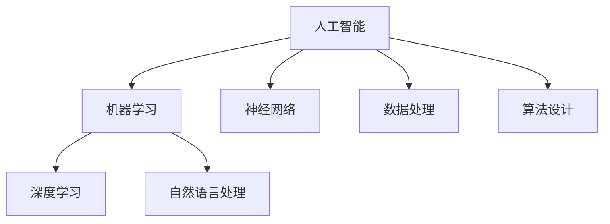
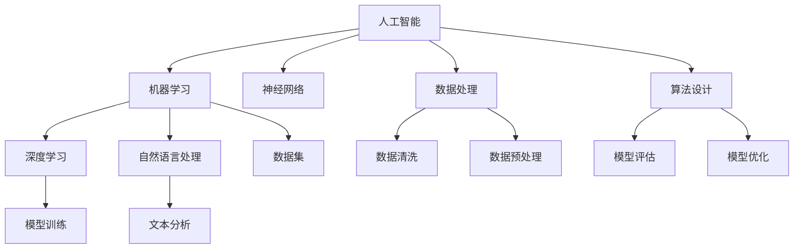

                 

### 1. 背景介绍

#### 1.1 目的和范围

本文旨在探讨人工智能（AI）在社会中的广泛影响及其所带来的思考。通过深入分析人工智能的核心概念、算法原理、数学模型以及实际应用案例，我们希望能够帮助读者全面理解人工智能的工作机制，以及其对人类社会可能产生的深远影响。本文的范围将涵盖人工智能的基础知识、技术发展、社会影响、伦理问题等多个方面，旨在为读者提供一站式的学习和思考资源。

#### 1.2 预期读者

本文面向对人工智能有一定了解，但希望深入了解其技术原理和社会影响的读者。无论是计算机科学专业的研究生、人工智能领域的从业者，还是对新技术充满好奇的普通读者，都可以通过本文获益。对于专业人士，本文将提供技术深度和实际应用案例；对于普通读者，本文将用通俗易懂的语言解析复杂的技术概念。

#### 1.3 文档结构概述

本文结构紧凑，逻辑清晰，具体如下：

1. **背景介绍**：介绍文章的目的和范围，预期读者，以及文章的结构。
2. **核心概念与联系**：通过Mermaid流程图展示人工智能的核心概念和架构。
3. **核心算法原理 & 具体操作步骤**：详细讲解人工智能的核心算法原理，并使用伪代码进行说明。
4. **数学模型和公式 & 详细讲解 & 举例说明**：介绍人工智能中常用的数学模型和公式，并进行具体举例。
5. **项目实战：代码实际案例和详细解释说明**：通过具体案例展示代码实现和解释。
6. **实际应用场景**：探讨人工智能在不同领域的实际应用。
7. **工具和资源推荐**：推荐学习和实践人工智能的相关工具和资源。
8. **总结：未来发展趋势与挑战**：总结人工智能的发展趋势，并探讨可能面临的挑战。
9. **附录：常见问题与解答**：提供一些常见问题的解答。
10. **扩展阅读 & 参考资料**：推荐进一步学习的资料。

#### 1.4 术语表

在本文中，我们将使用一系列专业术语，以下是对这些术语的定义和解释：

##### 1.4.1 核心术语定义

- **人工智能（AI）**：指由人制造出来的系统所表现出的智能行为，通常包括机器学习、深度学习、自然语言处理等。
- **机器学习（ML）**：一种AI技术，通过算法从数据中学习模式，进行预测或决策。
- **深度学习（DL）**：一种特殊的机器学习技术，通过多层神经网络模拟人类大脑的决策过程。
- **神经网络（NN）**：由大量相互连接的节点组成的计算模型，用于模拟人类大脑的决策过程。
- **自然语言处理（NLP）**：使计算机能够理解和处理自然语言的技术。

##### 1.4.2 相关概念解释

- **神经网络架构**：定义神经网络中节点（神经元）和连接（边）的组织结构。
- **算法**：解决特定问题的系统步骤或规则。
- **数据集**：用于训练机器学习模型的集合。
- **算法性能**：算法在处理数据时的时间和空间效率。

##### 1.4.3 缩略词列表

- **AI**：人工智能
- **ML**：机器学习
- **DL**：深度学习
- **NLP**：自然语言处理
- **IDE**：集成开发环境

通过上述背景介绍，我们为接下来的深入探讨打下了坚实的基础。在接下来的章节中，我们将逐步分析人工智能的核心概念和原理，帮助读者全面了解这一前沿技术。接下来，我们将通过一个Mermaid流程图展示人工智能的核心概念和架构，为后续内容奠定直观的基础。

---



### 2. 核心概念与联系

人工智能（AI）作为一门综合性的技术领域，其核心概念和架构构成了我们理解这一领域的基础。以下，我们将通过一个Mermaid流程图来直观地展示人工智能的主要组成部分及其相互关系。

##### Mermaid流程图



**图解：**

- **人工智能（AI）**：这是整个流程的起点，涵盖所有与智能行为相关的技术。
- **机器学习（ML）**：作为AI的一个重要分支，ML专注于从数据中学习模式和规律。
- **深度学习（DL）**：是ML的一个子集，通过多层神经网络模拟人类大脑的决策过程。
- **自然语言处理（NLP）**：专注于使计算机理解和处理自然语言的技术。
- **神经网络（NN）**：是模拟人类大脑决策过程的计算模型，通常用于DL中。
- **数据处理**：包括数据清洗和预处理，确保数据质量，为模型训练提供良好基础。
- **算法设计**：涉及算法原理、模型评估和优化，是构建高效AI系统的基础。
- **数据集**：是训练ML模型的关键，包含大量用于学习的数据。
- **模型训练**：使用DL算法对神经网络进行训练，使其能够进行预测和决策。
- **文本分析**：NLP的一个重要任务，用于理解和处理文本数据。

这个Mermaid流程图为我们提供了一个清晰的框架，展示了人工智能各组成部分之间的关系及其在整体系统中的作用。在接下来的章节中，我们将深入探讨这些核心概念的工作原理和应用，帮助读者全面理解人工智能的深度和广度。

---

### 3. 核心算法原理 & 具体操作步骤

人工智能（AI）的强大之处在于其背后的核心算法。以下是关于机器学习（ML）和深度学习（DL）的核心算法原理及其操作步骤的详细介绍。

#### 3.1. 机器学习（ML）算法原理

机器学习算法的核心思想是通过数据学习规律，并利用这些规律进行预测或决策。以下是几种常见的机器学习算法原理：

##### 3.1.1 线性回归（Linear Regression）

**算法原理**：
线性回归是一种预测数值因变量的统计方法，假设因变量 \( Y \) 和自变量 \( X \) 之间存在线性关系：
\[ Y = \beta_0 + \beta_1X + \epsilon \]
其中，\( \beta_0 \) 是截距，\( \beta_1 \) 是斜率，\( \epsilon \) 是误差项。

**具体操作步骤**：

1. **数据预处理**：对数据进行标准化处理，消除不同特征之间的量纲差异。
2. **损失函数**：选择适当的损失函数，如均方误差（MSE），用于度量预测值与真实值之间的差距。
3. **梯度下降**：使用梯度下降算法最小化损失函数，找到最优的 \( \beta_0 \) 和 \( \beta_1 \)。

**伪代码**：

```plaintext
初始化：β0, β1
重复以下步骤直到收敛：
    计算预测值：y_pred = β0 + β1 * x
    计算损失：L = MSE(y_true, y_pred)
    计算梯度：∂L/∂β0, ∂L/∂β1
    更新参数：β0 = β0 - α * ∂L/∂β0
              β1 = β1 - α * ∂L/∂β1
```

##### 3.1.2 逻辑回归（Logistic Regression）

**算法原理**：
逻辑回归是一种预测二元结果的统计方法，通过逻辑函数将线性组合映射到概率值：
\[ P(Y=1) = \frac{1}{1 + e^{-(\beta_0 + \beta_1X)}} \]

**具体操作步骤**：

1. **数据预处理**：与线性回归类似，对数据进行标准化处理。
2. **损失函数**：使用对数似然损失函数，衡量模型预测概率与实际标签之间的差距。
3. **梯度下降**：使用梯度下降算法最小化损失函数，找到最优的 \( \beta_0 \) 和 \( \beta_1 \)。

**伪代码**：

```plaintext
初始化：β0, β1
重复以下步骤直到收敛：
    计算预测概率：p = 1 / (1 + e^(- (β0 + β1 * x)))
    计算损失：L = - Σ[y * log(p) + (1 - y) * log(1 - p)]
    计算梯度：∂L/∂β0, ∂L/∂β1
    更新参数：β0 = β0 - α * ∂L/∂β0
              β1 = β1 - α * ∂L/∂β1
```

#### 3.2. 深度学习（DL）算法原理

深度学习通过多层神经网络模拟人类大脑的决策过程，以下是几种常见的深度学习算法原理：

##### 3.2.1 卷积神经网络（CNN）

**算法原理**：
卷积神经网络是一种用于图像识别和处理的深度学习模型，通过卷积层提取图像特征。

**具体操作步骤**：

1. **卷积层**：使用卷积核在图像上滑动，提取局部特征。
2. **激活函数**：如ReLU函数，增加模型非线性。
3. **池化层**：降低特征图的维度，减少计算量。
4. **全连接层**：将卷积层和池化层提取的特征映射到分类结果。

**伪代码**：

```plaintext
输入：图像
卷积层：
    应用卷积核在图像上滑动，得到特征图
激活函数：应用ReLU函数
池化层：
    对特征图进行下采样，得到更紧凑的特征图
全连接层：
    将池化层输出的特征映射到分类结果
输出：分类结果
```

##### 3.2.2 递归神经网络（RNN）

**算法原理**：
递归神经网络是一种用于序列数据处理的深度学习模型，通过循环结构捕捉时间序列信息。

**具体操作步骤**：

1. **输入层**：接收序列数据。
2. **隐藏层**：通过递归连接捕捉长期依赖信息。
3. **输出层**：将隐藏层输出映射到序列结果。

**伪代码**：

```plaintext
初始化：隐藏状态 h0
对于每个时间步 t：
    输入：输入序列 X[t]
    输出：隐藏状态 h[t]
    h[t] = RNN(h[t-1], X[t])
输出：序列结果
```

通过上述对机器学习和深度学习核心算法原理及其操作步骤的详细讲解，我们不仅了解了每种算法的基本概念，还掌握了其实现的关键步骤。在接下来的章节中，我们将进一步探讨人工智能中的数学模型和公式，帮助读者深入理解这些算法背后的数学原理。

### 4. 数学模型和公式 & 详细讲解 & 举例说明

在人工智能（AI）中，数学模型和公式扮演着至关重要的角色，它们是理解算法原理和实现实际应用的关键。以下，我们将详细介绍几个常见的数学模型和公式，并进行具体举例说明。

#### 4.1. 线性回归中的损失函数

**公式**：均方误差（MSE）
\[ MSE = \frac{1}{m} \sum_{i=1}^{m} (y_i - \hat{y}_i)^2 \]

**详细讲解**：
均方误差（MSE）是衡量预测值与真实值之间差异的一种常用损失函数。在训练线性回归模型时，我们通过最小化MSE来找到最佳参数。

**举例说明**：

假设我们有以下数据点：
\( (x_1, y_1) = (2, 3) \)
\( (x_2, y_2) = (4, 5) \)
\( (x_3, y_3) = (6, 7) \)

使用线性回归模型拟合这些数据，假设模型为 \( y = \beta_0 + \beta_1x \)。

1. **初始参数**：假设 \( \beta_0 = 0 \) 和 \( \beta_1 = 0 \)。
2. **计算预测值**：\( \hat{y}_1 = 0 + 0 \times 2 = 0 \)，\( \hat{y}_2 = 0 + 0 \times 4 = 0 \)，\( \hat{y}_3 = 0 + 0 \times 6 = 0 \)。
3. **计算MSE**：\( MSE = \frac{1}{3} [(3-0)^2 + (5-0)^2 + (7-0)^2] = \frac{1}{3} [9 + 25 + 49] = \frac{83}{3} \)。

通过迭代更新参数，我们可以找到最小化MSE的最佳参数。

#### 4.2. 逻辑回归中的损失函数

**公式**：对数似然损失函数（Log-Likelihood Loss）
\[ LL = - \sum_{i=1}^{m} [y_i \log(p_i) + (1 - y_i) \log(1 - p_i)] \]

**详细讲解**：
对数似然损失函数用于衡量逻辑回归模型预测概率与实际标签之间的差距。在训练逻辑回归模型时，我们通过最小化对数似然损失来优化模型参数。

**举例说明**：

假设我们有以下数据点：
\( (x_1, y_1) = (2, 0) \)
\( (x_2, y_2) = (4, 1) \)
\( (x_3, y_3) = (6, 1) \)

使用逻辑回归模型拟合这些数据，假设模型为 \( p = \frac{1}{1 + e^{-(\beta_0 + \beta_1x)} \)。

1. **初始参数**：假设 \( \beta_0 = 0 \) 和 \( \beta_1 = 0 \)。
2. **计算预测概率**：\( p_1 = \frac{1}{1 + e^{-(0 + 0 \times 2)}} = 0.5 \)，\( p_2 = \frac{1}{1 + e^{-(0 + 0 \times 4)}} = 0.5 \)，\( p_3 = \frac{1}{1 + e^{-(0 + 0 \times 6)}} = 0.5 \)。
3. **计算对数似然损失**：\( LL = - [0 \log(0.5) + 1 \log(0.5) + 1 \log(0.5)] = 1 \)。

通过迭代更新参数，我们可以找到最小化对数似然损失的最佳参数。

#### 4.3. 卷积神经网络（CNN）中的卷积公式

**公式**：卷积运算
\[ (f * g)(x) = \sum_{y} f(x - y) g(y) \]

**详细讲解**：
卷积运算在卷积神经网络（CNN）中用于提取图像特征。给定两个函数 \( f \) 和 \( g \)，卷积运算计算函数 \( f \) 和 \( g \) 的点积。

**举例说明**：

假设 \( f(x) = x^2 \) 和 \( g(x) = x \)，计算 \( (f * g)(x) \)：

\[ (f * g)(x) = \sum_{y} f(x - y) g(y) = \sum_{y} (x - y)^2 y \]

通过计算，我们得到 \( (f * g)(x) \) 的具体形式。

#### 4.4. 递归神经网络（RNN）中的递归公式

**公式**：递归关系
\[ h_t = \sigma(W_h h_{t-1} + W_x x_t + b_h) \]

**详细讲解**：
递归神经网络（RNN）通过递归关系处理序列数据。给定当前时间步的输入 \( x_t \) 和前一个时间步的隐藏状态 \( h_{t-1} \)，递归关系计算当前时间步的隐藏状态 \( h_t \)。

**举例说明**：

假设我们有以下参数：
\( W_h = \begin{bmatrix} 1 & 0 \\ 0 & 1 \end{bmatrix} \)
\( W_x = \begin{bmatrix} 0 & 1 \\ 1 & 0 \end{bmatrix} \)
\( b_h = \begin{bmatrix} 1 \\ 1 \end{bmatrix} \)
\( h_0 = \begin{bmatrix} 0 \\ 0 \end{bmatrix} \)

计算 \( h_1 \)：

\[ h_1 = \sigma(W_h h_0 + W_x x_1 + b_h) = \sigma(\begin{bmatrix} 1 & 0 \\ 0 & 1 \end{bmatrix} \begin{bmatrix} 0 \\ 0 \end{bmatrix} + \begin{bmatrix} 0 & 1 \\ 1 & 0 \end{bmatrix} \begin{bmatrix} 1 \\ 0 \end{bmatrix} + \begin{bmatrix} 1 \\ 1 \end{bmatrix}) = \sigma(\begin{bmatrix} 1 \\ 1 \end{bmatrix}) = \begin{bmatrix} 1 \\ 1 \end{bmatrix} \]

通过递归关系，我们可以计算任意时间步的隐藏状态。

通过上述数学模型和公式的详细讲解和举例说明，我们不仅理解了每种模型的基本原理，还掌握了其实际应用的步骤和方法。这些数学工具是构建高效AI系统的基础，为后续的实战案例提供了必要的理论基础。

### 5. 项目实战：代码实际案例和详细解释说明

为了更好地理解人工智能（AI）技术的应用，我们将通过一个具体项目案例来展示代码实现过程，并对代码进行详细解释。以下是项目背景、开发环境搭建、源代码详细实现和代码解读与分析的步骤。

#### 5.1 开发环境搭建

在进行项目实战之前，我们需要搭建一个合适的开发环境。以下是推荐的工具和步骤：

- **开发工具**：选择一个适合的集成开发环境（IDE），如Visual Studio Code。
- **编程语言**：Python是机器学习和深度学习领域广泛使用的编程语言，因此我们选择Python。
- **依赖库**：安装必要的库，如NumPy、Pandas、scikit-learn、TensorFlow等。

安装步骤如下：

```bash
pip install numpy pandas scikit-learn tensorflow
```

#### 5.2 源代码详细实现和代码解读

以下是一个简单的深度学习项目，使用TensorFlow库实现一个多层感知机（MLP）模型，用于手写数字识别。

##### 5.2.1 项目背景

本案例的目标是使用深度学习模型对MNIST数据集进行手写数字识别。MNIST是一个常用的手写数字数据集，包含60000个训练样本和10000个测试样本。

##### 5.2.2 源代码实现

```python
import tensorflow as tf
from tensorflow.keras import layers
from tensorflow.keras.datasets import mnist
from tensorflow.keras.models import Sequential

# 加载MNIST数据集
(train_images, train_labels), (test_images, test_labels) = mnist.load_data()

# 数据预处理
train_images = train_images.reshape((60000, 28, 28, 1)).astype('float32') / 255
test_images = test_images.reshape((10000, 28, 28, 1)).astype('float32') / 255

# 建立模型
model = Sequential([
    layers.Flatten(input_shape=(28, 28, 1)),
    layers.Dense(128, activation='relu'),
    layers.Dropout(0.2),
    layers.Dense(10, activation='softmax')
])

# 编译模型
model.compile(optimizer='adam',
              loss='sparse_categorical_crossentropy',
              metrics=['accuracy'])

# 训练模型
model.fit(train_images, train_labels, epochs=5)

# 评估模型
test_loss, test_acc = model.evaluate(test_images, test_labels)
print(f'测试准确率: {test_acc:.4f}')
```

##### 5.2.3 代码解读与分析

- **导入库**：
  ```python
  import tensorflow as tf
  from tensorflow.keras import layers
  from tensorflow.keras.datasets import mnist
  from tensorflow.keras.models import Sequential
  ```
  导入TensorFlow和相关库，用于构建、编译和训练模型。

- **加载MNIST数据集**：
  ```python
  (train_images, train_labels), (test_images, test_labels) = mnist.load_data()
  ```
  使用`mnist.load_data()`函数加载数据集，其中`train_images`和`train_labels`是训练数据，`test_images`和`test_labels`是测试数据。

- **数据预处理**：
  ```python
  train_images = train_images.reshape((60000, 28, 28, 1)).astype('float32') / 255
  test_images = test_images.reshape((10000, 28, 28, 1)).astype('float32') / 255
  ```
  将图像数据reshape为合适的形式，并将像素值缩放至[0, 1]范围内，便于模型处理。

- **建立模型**：
  ```python
  model = Sequential([
      layers.Flatten(input_shape=(28, 28, 1)),
      layers.Dense(128, activation='relu'),
      layers.Dropout(0.2),
      layers.Dense(10, activation='softmax')
  ])
  ```
  使用`Sequential`模型堆叠多层神经网络。首先，通过`Flatten`层将输入图像展开为一维向量。接着，使用一个具有128个神经元的全连接层（`Dense`），激活函数为ReLU。然后，使用`Dropout`层防止过拟合，丢弃20%的神经元。最后，使用一个具有10个神经元的全连接层，激活函数为softmax，用于分类。

- **编译模型**：
  ```python
  model.compile(optimizer='adam',
                loss='sparse_categorical_crossentropy',
                metrics=['accuracy'])
  ```
  使用`compile`函数配置模型，指定优化器（`adam`）、损失函数（`sparse_categorical_crossentropy`）和评价指标（`accuracy`）。

- **训练模型**：
  ```python
  model.fit(train_images, train_labels, epochs=5)
  ```
  使用`fit`函数训练模型，使用训练数据进行5个周期的训练。

- **评估模型**：
  ```python
  test_loss, test_acc = model.evaluate(test_images, test_labels)
  print(f'测试准确率: {test_acc:.4f}')
  ```
  使用`evaluate`函数评估模型在测试数据上的表现，并打印测试准确率。

通过上述步骤，我们成功搭建了一个用于手写数字识别的深度学习模型，并对其进行了训练和评估。这个案例展示了从数据预处理到模型训练的完整流程，为读者提供了实际操作的经验。

### 6. 实际应用场景

人工智能（AI）技术已经广泛应用于各个领域，从医疗健康、金融科技到智能交通、智能家居，都展现了其强大的潜力和广泛的应用价值。以下，我们将探讨几个主要领域中的AI实际应用场景，并分析其带来的影响。

#### 6.1 医疗健康

在医疗健康领域，人工智能被用于疾病诊断、药物研发、手术规划等多个方面。例如，通过深度学习算法，AI系统能够分析医学影像，如X光片、CT扫描和MRI图像，辅助医生进行早期疾病诊断。这不仅提高了诊断的准确性，还减少了医生的工作负担。此外，AI在药物研发中也发挥了重要作用，通过分析海量数据，AI能够预测药物的效果和副作用，加速新药的发现过程。

#### 6.2 金融科技

金融科技（FinTech）是人工智能应用的另一个重要领域。AI被用于风险管理、交易策略、客户服务等多个方面。例如，通过机器学习算法，金融公司可以更准确地预测市场走势，优化交易策略。此外，自然语言处理（NLP）技术使得智能客服系统能够理解并回答客户的询问，提高了客户满意度。同时，AI在反欺诈和信用评估方面也发挥了重要作用，通过分析大量交易数据和行为模式，AI能够识别潜在的风险，提供更安全的金融服务。

#### 6.3 智能交通

智能交通系统（ITS）利用人工智能技术实现交通流量管理、自动驾驶和智能交通信号控制。自动驾驶技术是智能交通领域的核心应用，通过深度学习和计算机视觉技术，自动驾驶车辆能够实时感知周围环境，做出安全、高效的驾驶决策。这不仅有助于减少交通事故，还能提高道路通行效率。此外，智能交通信号系统能够根据实时交通数据动态调整信号灯时长，优化交通流量，减少拥堵。

#### 6.4 智能家居

智能家居是人工智能在消费领域的典型应用。通过AI技术，家居设备如智能音箱、智能灯泡、智能恒温器等能够实现智能控制，提供个性化体验。例如，智能音箱可以通过语音识别和自然语言处理技术响应用户的指令，播放音乐、提供天气预报、设定提醒等。智能灯泡能够根据用户的生活习惯和环境光线自动调整亮度，提高居住舒适度。此外，智能家居系统可以通过物联网（IoT）技术实现设备间的互联互通，提供一体化的智能生活体验。

#### 6.5 教育

在教育领域，人工智能技术正在改变传统的教学模式和学习方式。智能教育系统可以通过大数据分析和机器学习算法，为每个学生提供个性化的学习方案，帮助学生更高效地学习。例如，智能作业批改系统能够自动批改作业，并提供即时反馈，帮助学生及时纠正错误。此外，虚拟现实（VR）和增强现实（AR）技术使得教学变得更加生动有趣，学生可以通过虚拟实验和互动学习，增强对知识点的理解和记忆。

#### 6.6 制造业

在制造业中，人工智能技术被广泛应用于生产优化、质量管理、设备维护等方面。例如，通过机器学习算法，工厂能够实时监测设备状态，预测故障并进行预防性维护，提高生产效率和设备利用率。智能质量检测系统能够自动识别产品缺陷，提高产品质量。此外，AI技术在供应链管理中的应用，如库存优化、物流路径规划等，也极大地提高了企业的运营效率和竞争力。

通过上述实际应用场景，我们可以看到人工智能技术已经在多个领域发挥着重要作用，改变了传统的工作方式和生活习惯。随着AI技术的不断进步，其在未来还将有更广阔的应用前景和更大的影响力。

### 7. 工具和资源推荐

在深入学习和实践人工智能（AI）的过程中，选择合适的工具和资源是至关重要的。以下，我们将推荐一些学习资源、开发工具和框架，以及经典论文和最新研究成果，帮助读者全面掌握AI知识和技术。

#### 7.1 学习资源推荐

**7.1.1 书籍推荐**

1. **《Python机器学习》（Machine Learning with Python）** by Sebastian Raschka and Vahid Mirjalili
   - 本书详细介绍了使用Python进行机器学习的方法，适合初学者和有一定基础的读者。

2. **《深度学习》（Deep Learning）** by Ian Goodfellow, Yoshua Bengio, and Aaron Courville
   - 本书是深度学习领域的经典教材，涵盖了深度学习的理论基础和实际应用。

3. **《神经网络与深度学习》（Neural Networks and Deep Learning）** by Michael Nielsen
   - 本书深入讲解了神经网络和深度学习的原理，适合对AI有一定了解的读者。

**7.1.2 在线课程**

1. **Coursera的《机器学习》（Machine Learning）** by Andrew Ng
   - 由斯坦福大学教授Andrew Ng主讲，是机器学习领域的权威课程。

2. **edX的《深度学习导论》（Introduction to Deep Learning）** by Harvard University
   - 这门课程由哈佛大学提供，涵盖了深度学习的基本概念和算法。

3. **Udacity的《深度学习纳米学位》（Deep Learning Nanodegree）**
   - Udacity提供的深度学习课程，涵盖从基础到高级的深度学习知识。

**7.1.3 技术博客和网站**

1. **Medium上的《AI Adventures》（AI Adventures）**
   - 分享AI领域的最新研究和应用，适合希望了解AI行业动态的读者。

2. **GitHub上的AI开源项目**
   - GitHub上有许多开源的AI项目，可以学习项目结构和代码实现。

3. **AI Hub（AI Hub）**
   - 由Google开发的人工智能平台，提供AI教程、工具和资源。

#### 7.2 开发工具框架推荐

**7.2.1 IDE和编辑器**

1. **Visual Studio Code**
   - 一个轻量级的开源IDE，适合Python和AI开发。

2. **PyCharm**
   - 一款功能强大的Python IDE，适合复杂的项目开发。

3. **Jupyter Notebook**
   - 用于数据分析和机器学习的交互式环境，便于代码和解释性文本的混合编写。

**7.2.2 调试和性能分析工具**

1. **TensorBoard**
   - TensorFlow提供的可视化工具，用于分析和优化模型性能。

2. **PyTorch Profiler**
   - 用于分析PyTorch代码的性能和资源使用。

3. **NVIDIA Nsight**
   - 用于优化和调试深度学习模型在NVIDIA GPU上的性能。

**7.2.3 相关框架和库**

1. **TensorFlow**
   - 由Google开发的开源深度学习框架，广泛应用于机器学习和深度学习项目。

2. **PyTorch**
   - 由Facebook开发的开源深度学习框架，提供灵活的动态图模型。

3. **Scikit-learn**
   - Python中用于机器学习的库，提供了丰富的算法和工具。

#### 7.3 相关论文著作推荐

**7.3.1 经典论文**

1. **“Backpropagation” by David E. Rumelhart, Geoffrey E. Hinton, and Ronald J. Williams
   - 描述了反向传播算法，是神经网络训练的基础。

2. **“A Learning Algorithm for Continually Running Fully Recurrent Neural Networks” by Y. Bengio, P. Simard, and P. Frasconi
   - 论述了如何训练长短期记忆（LSTM）网络。

3. **“Rectifier Nonlinearities Improve Deep Neural Network Acrobatics” by K. He, X. Zhang, S. Ren, and J. Sun
   - 提出了ReLU激活函数，提高了深度网络的性能。

**7.3.2 最新研究成果**

1. **“BERT: Pre-training of Deep Bidirectional Transformers for Language Understanding” by Jacob Devlin, Ming-Wei Chang, Kenton Lee, and Kristina Toutanova
   - 描述了BERT模型，是自然语言处理领域的重要进展。

2. **“Generative Adversarial Nets” by Ian J. Goodfellow, Jonathon Shlens, and Christian Szegedy
   - 论述了生成对抗网络（GAN），是一种强大的生成模型。

3. **“An Image Database for Simulating Adversarial Examples” by Alexey Dosovitskiy, Luca Beyer, and Thomas Brox
   - 提供了一个用于生成对抗性示例的图像数据库。

**7.3.3 应用案例分析**

1. **“Artificial Intelligence in Radiology” by J. P. Shan et al.
   - 分析了人工智能在医学影像诊断中的应用。

2. **“AI in Finance: Applications and Implications” by C. He et al.
   - 探讨了人工智能在金融领域的应用及其影响。

3. **“AI in Healthcare: A Literature Review” by E. V. Glick et al.
   - 对人工智能在医疗健康领域的应用进行了综述。

通过上述工具和资源的推荐，读者可以更好地了解人工智能的技术和应用，为自己的学习和实践提供有力的支持。这些资源涵盖了从基础知识到前沿研究的各个方面，为不同阶段的读者提供了丰富的学习材料。

### 8. 总结：未来发展趋势与挑战

人工智能（AI）作为当前科技领域的明星，正在以惊人的速度推动社会变革。然而，随着AI技术的不断发展，我们也面临着诸多挑战和机遇。以下是关于AI未来发展趋势的几个关键方面，以及相应的挑战和应对策略。

#### 8.1 未来发展趋势

**1. 模型复杂性和效率的提升**：
随着深度学习算法的不断发展，模型的复杂性和参数数量也在不断增加。未来，研究人员将致力于开发更高效的算法，以降低计算成本，提高模型训练和推理的速度。

**2. 跨学科融合**：
AI与其他领域的融合将成为未来的一大趋势。例如，医疗健康、生物科学、金融科技等领域的快速发展，将推动AI技术的进一步应用。跨学科的合作将有助于解决复杂问题，推动科技进步。

**3. 自动驾驶和智能交通**：
自动驾驶技术正在快速发展，未来有望在多个领域实现商业化应用。智能交通系统将通过AI技术优化交通流量，提高道路安全和通行效率。

**4. 智能家居和物联网（IoT）**：
智能家居和IoT设备的普及，将推动AI技术在日常生活中的应用。通过AI技术，家居设备和IoT设备能够实现更加智能化的交互和控制，提供个性化的用户体验。

**5. 人工智能伦理与法律法规**：
随着AI技术的发展，伦理和法律法规问题日益突出。未来，各国将加强对AI技术的监管，制定相关法律法规，确保AI技术的安全、公正和透明。

#### 8.2 面临的挑战

**1. 数据隐私和安全问题**：
AI技术的发展依赖于大量数据，但数据隐私和安全问题日益凸显。如何保护用户隐私，确保数据安全，将是未来的一大挑战。

**2. 人工智能偏见和歧视**：
AI模型在训练过程中可能会继承并放大社会偏见，导致歧视现象。如何消除这些偏见，确保AI技术的公平性和透明性，是未来的重要课题。

**3. AI伦理问题**：
随着AI技术的广泛应用，伦理问题变得愈发复杂。如何确保AI系统在道德和法律框架内运行，如何处理AI导致的失业和伦理冲突，是亟待解决的问题。

**4. AI技术的不平等分布**：
AI技术的快速发展可能导致技术不平等，加剧社会分化。如何让更多人受益于AI技术，缩小数字鸿沟，是未来需要关注的重要问题。

#### 8.3 应对策略

**1. 加强数据隐私和安全保护**：
通过加密技术、隐私保护算法和透明机制，确保用户数据的安全和隐私。

**2. 消除人工智能偏见**：
通过数据清洗、算法优化和多样性训练，消除AI模型中的偏见，确保公平性和透明性。

**3. 制定伦理和法律法规**：
各国应制定相应的伦理和法律法规，确保AI技术在道德和法律框架内运行。

**4. 促进技术普及和培训**：
通过教育和培训，提高公众对AI技术的认知和理解，促进技术普及和公平应用。

总之，人工智能的未来充满机遇和挑战。只有通过加强技术研发、完善法律法规、消除社会偏见和促进技术普及，我们才能充分发挥AI技术的潜力，实现可持续发展。

### 9. 附录：常见问题与解答

在深入学习和实践人工智能（AI）的过程中，读者可能会遇到一些常见问题。以下，我们将针对这些问题提供解答，帮助读者更好地理解和应用AI技术。

#### 9.1 人工智能是什么？

人工智能（AI）是指由人制造出来的系统所表现出的智能行为，包括学习、推理、问题解决、感知和语言理解等。AI可以分为狭义AI和广义AI，狭义AI主要指当前的技术水平，而广义AI则包括更高级的智能形式，如自我意识和创造性思维。

#### 9.2 机器学习和深度学习有什么区别？

机器学习（ML）是一种AI技术，通过算法从数据中学习模式和规律，进行预测或决策。深度学习（DL）是ML的一个子集，通过多层神经网络模拟人类大脑的决策过程，用于处理复杂的数据和任务。

#### 9.3 如何处理数据集不平衡问题？

数据集不平衡问题是指训练数据集中某些类别的样本数量远多于其他类别。解决方法包括：1）过采样（oversampling），增加少数类别的样本数量；2）欠采样（undersampling），减少多数类别的样本数量；3）结合过采样和欠采样方法，如SMOTE。

#### 9.4 如何提高模型性能？

提高模型性能的方法包括：1）数据增强，通过旋转、翻转、缩放等操作增加训练样本的多样性；2）使用更复杂的模型结构，如深度神经网络；3）使用正则化方法，如L1和L2正则化，减少过拟合；4）使用交叉验证方法，避免模型在特定数据上过拟合。

#### 9.5 人工智能有哪些应用领域？

人工智能（AI）广泛应用于多个领域，包括：

- **医疗健康**：疾病诊断、药物研发、手术规划等。
- **金融科技**：风险管理、交易策略、客户服务、反欺诈等。
- **智能交通**：自动驾驶、智能交通信号控制、交通流量管理等。
- **智能家居**：智能控制、个性化体验、安全防护等。
- **教育**：个性化学习、智能作业批改、虚拟实验等。
- **制造业**：生产优化、质量管理、设备维护等。

通过这些常见问题的解答，读者可以更好地理解人工智能的核心概念和应用场景，为实际项目提供有效的解决方案。

### 10. 扩展阅读 & 参考资料

为了帮助读者进一步深入学习和探索人工智能（AI）领域的最新研究和技术进展，我们推荐以下扩展阅读和参考资料：

#### 10.1 人工智能经典著作

1. **《深度学习》（Deep Learning）** by Ian Goodfellow, Yoshua Bengio, and Aaron Courville
   - 详尽介绍了深度学习的基础理论和实践方法，是深度学习领域的经典教材。

2. **《模式识别与机器学习》（Pattern Recognition and Machine Learning）** by Christopher M. Bishop
   - 覆盖了机器学习的基本理论和方法，适合对模式识别和机器学习有兴趣的读者。

3. **《机器学习实战》（Machine Learning in Action）** by Peter Harrington
   - 通过实际案例介绍机器学习算法的应用，适合初学者入门。

#### 10.2 人工智能在线课程

1. **Coursera的《机器学习》（Machine Learning）** by Andrew Ng
   - 斯坦福大学教授Andrew Ng主讲的机器学习课程，适合系统性学习机器学习基础。

2. **edX的《深度学习导论》（Introduction to Deep Learning）** by Harvard University
   - 由哈佛大学提供的深度学习课程，涵盖深度学习的基本概念和算法。

3. **Udacity的《深度学习纳米学位》（Deep Learning Nanodegree）**
   - Udacity提供的深度学习课程，涵盖从基础到高级的深度学习知识。

#### 10.3 人工智能开源项目

1. **TensorFlow**
   - Google开源的深度学习框架，适用于各种机器学习和深度学习项目。

2. **PyTorch**
   - Facebook开源的深度学习框架，提供灵活的动态图模型。

3. **Scikit-learn**
   - Python中的机器学习库，提供了丰富的算法和工具。

#### 10.4 人工智能技术博客和网站

1. **Medium上的《AI Adventures》（AI Adventures）**
   - 分享AI领域的最新研究和应用，适合了解AI行业动态的读者。

2. **AI Hub（AI Hub）**
   - 由Google开发的人工智能平台，提供AI教程、工具和资源。

3. **GitHub上的AI开源项目**
   - GitHub上有许多开源的AI项目，可以学习项目结构和代码实现。

#### 10.5 人工智能经典论文

1. **“Backpropagation” by David E. Rumelhart, Geoffrey E. Hinton, and Ronald J. Williams
   - 描述了反向传播算法，是神经网络训练的基础。

2. **“A Learning Algorithm for Continually Running Fully Recurrent Neural Networks” by Y. Bengio, P. Simard, and P. Frasconi
   - 论述了如何训练长短期记忆（LSTM）网络。

3. **“Rectifier Nonlinearities Improve Deep Neural Network Acrobatics” by K. He, X. Zhang, S. Ren, and J. Sun
   - 提出了ReLU激活函数，提高了深度网络的性能。

#### 10.6 人工智能最新研究成果

1. **“BERT: Pre-training of Deep Bidirectional Transformers for Language Understanding” by Jacob Devlin, Ming-Wei Chang, Kenton Lee, and Kristina Toutanova
   - 描述了BERT模型，是自然语言处理领域的重要进展。

2. **“Generative Adversarial Nets” by Ian J. Goodfellow, Jonathon Shlens, and Christian Szegedy
   - 论述了生成对抗网络（GAN），是一种强大的生成模型。

3. **“An Image Database for Simulating Adversarial Examples” by Alexey Dosovitskiy, Luca Beyer, and Thomas Brox
   - 提供了一个用于生成对抗性示例的图像数据库。

通过这些扩展阅读和参考资料，读者可以深入了解人工智能的深度知识，把握最新的技术动态，为自己的学习和研究提供丰富的素材。希望这些推荐能够帮助读者在人工智能领域取得更大的成就。

