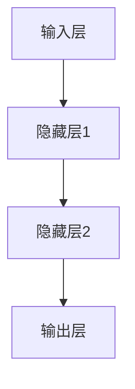
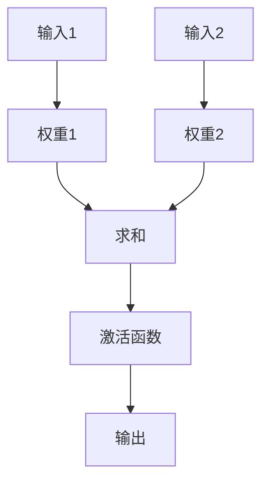

                 

# 人工神经元 (Artificial Neuron)

> **关键词：** 人工神经网络、神经元模型、激活函数、反向传播、深度学习

> **摘要：** 本文将深入探讨人工神经元的基本原理和构建，包括其数学模型、算法原理、以及实际应用场景。通过对人工神经元的工作机制进行详细分析，我们旨在为读者提供一个全面且易懂的技术解析，帮助读者更好地理解深度学习的核心组成部分。

## 1. 背景介绍

### 1.1 目的和范围

本文旨在介绍人工神经元的基本原理和构建方法，帮助读者了解其在深度学习中的应用。我们将从神经元模型的历史背景开始，逐步深入到其数学模型和算法原理，最终探讨其在实际项目中的应用。

### 1.2 预期读者

本文适用于对人工智能和深度学习有一定了解的读者，包括但不限于计算机科学专业的学生、算法工程师、数据科学家等。

### 1.3 文档结构概述

本文分为十个部分，分别是：

1. 背景介绍
2. 核心概念与联系
3. 核心算法原理 & 具体操作步骤
4. 数学模型和公式 & 详细讲解 & 举例说明
5. 项目实战：代码实际案例和详细解释说明
6. 实际应用场景
7. 工具和资源推荐
8. 总结：未来发展趋势与挑战
9. 附录：常见问题与解答
10. 扩展阅读 & 参考资料

### 1.4 术语表

#### 1.4.1 核心术语定义

- 人工神经元：模拟生物神经元的计算单元，用于实现神经网络的函数。
- 激活函数：用于将人工神经元的输入转换为输出的函数，常用的激活函数包括Sigmoid、ReLU等。
- 反向传播：用于训练神经网络的一种算法，通过反向传播误差，调整网络参数。
- 深度学习：一种基于人工神经网络的学习方法，通过多层网络结构实现复杂的函数逼近。

#### 1.4.2 相关概念解释

- 神经网络：由多个人工神经元组成的计算网络，用于执行特定任务。
- 输入层：接收外部输入的数据层。
- 隐藏层：位于输入层和输出层之间的神经元层。
- 输出层：生成最终输出结果的神经元层。

#### 1.4.3 缩略词列表

- ANNs：人工神经网络（Artificial Neural Networks）
- MLP：多层感知器（Multilayer Perceptron）
- CNN：卷积神经网络（Convolutional Neural Network）
- RNN：循环神经网络（Recurrent Neural Network）
- DNN：深度神经网络（Deep Neural Network）

## 2. 核心概念与联系

在介绍人工神经元的核心概念之前，我们首先需要了解人工神经网络的基本架构。人工神经网络由多个层次组成，包括输入层、隐藏层和输出层。每个层次由多个神经元组成，神经元之间通过加权连接形成网络。

### 2.1 人工神经网络架构

下面是人工神经网络的Mermaid流程图：



### 2.2 神经元模型

神经元模型是人工神经网络的基本构建块。一个简单的神经元模型包括以下几个部分：

- 输入：每个输入都与一个权重相乘。
- 加权求和：将所有输入与其对应权重相乘后求和。
- 激活函数：将加权求和的结果通过激活函数转化为输出。

下面是神经元模型的Mermaid流程图：



### 2.3 神经元之间的连接

神经元之间的连接是通过加权连接实现的。每个连接都有一个权重，用于表示连接的强度。在训练过程中，通过调整权重来优化网络的性能。

## 3. 核心算法原理 & 具体操作步骤

### 3.1 算法原理

人工神经元的算法原理主要基于以下步骤：

1. 接收输入数据。
2. 将输入数据与权重相乘并求和。
3. 通过激活函数将求和结果转化为输出。
4. 根据输出与实际标签之间的误差，调整权重。

### 3.2 具体操作步骤

下面是一个简单的神经网络训练过程：

1. **初始化网络**：设置输入层、隐藏层和输出层的神经元数量，并随机初始化权重。
2. **前向传播**：输入数据通过输入层传递到隐藏层，再传递到输出层，生成预测值。
3. **计算误差**：将预测值与实际标签进行比较，计算误差。
4. **反向传播**：将误差反向传播到隐藏层和输入层，调整权重。
5. **迭代训练**：重复上述过程，直到满足停止条件（如误差小于设定阈值或训练次数达到预设值）。

下面是训练过程的伪代码：

```python
# 初始化网络
initialize_network()

# 迭代训练
for epoch in range(max_epochs):
    for sample in data_loader:
        # 前向传播
        output = forward_pass(sample)
        
        # 计算误差
        error = calculate_error(output, label)
        
        # 反向传播
        backward_pass(error)
        
        # 更新权重
        update_weights()

# 评估模型
evaluate_model()
```

## 4. 数学模型和公式 & 详细讲解 & 举例说明

### 4.1 数学模型

人工神经元的数学模型主要包括以下几个部分：

1. **加权求和**：  
   $$ z = \sum_{i=1}^{n} x_i \cdot w_i $$
   其中，\( z \) 表示加权求和的结果，\( x_i \) 表示输入，\( w_i \) 表示权重。

2. **激活函数**：  
   $$ a = f(z) $$
   其中，\( a \) 表示输出，\( f(z) \) 表示激活函数。

3. **误差计算**：  
   $$ \delta = a - y $$
   其中，\( \delta \) 表示误差，\( a \) 表示输出，\( y \) 表示实际标签。

4. **权重更新**：  
   $$ w_{new} = w_{old} - \alpha \cdot \delta \cdot a $$
   其中，\( w_{new} \) 表示新权重，\( w_{old} \) 表示旧权重，\( \alpha \) 表示学习率，\( \delta \) 表示误差，\( a \) 表示输出。

### 4.2 详细讲解

#### 4.2.1 加权求和

加权求和是人工神经元的核心步骤，用于计算输入和权重之间的乘积并求和。通过调整权重，我们可以改变神经元对输入的敏感度。

#### 4.2.2 激活函数

激活函数用于将加权求和的结果转换为输出。常见的激活函数包括Sigmoid、ReLU等。激活函数可以引入非线性特性，使神经网络能够学习更复杂的函数。

#### 4.2.3 误差计算

误差计算是反向传播算法的关键步骤，用于衡量输出与实际标签之间的差距。误差越大，说明输出与实际标签越不一致。

#### 4.2.4 权重更新

权重更新是训练神经网络的核心步骤，通过调整权重来减小误差。学习率的选择对训练过程有很大影响，过大的学习率可能导致训练过程不稳定，而过小则可能使训练过程过于缓慢。

### 4.3 举例说明

假设我们有一个简单的神经网络，输入层有2个神经元，隐藏层有3个神经元，输出层有1个神经元。输入数据为 \( x = [1, 2] \)，实际标签为 \( y = 3 \)。我们可以按照以下步骤进行计算：

1. **初始化网络**：设置输入层、隐藏层和输出层的神经元数量，并随机初始化权重。

2. **前向传播**：计算输入和权重之间的乘积并求和，通过激活函数得到输出。

   $$ z_1 = 1 \cdot w_{11} + 2 \cdot w_{21} = 1 \cdot 0.1 + 2 \cdot 0.2 = 0.5 $$
   $$ z_2 = 1 \cdot w_{12} + 2 \cdot w_{22} = 1 \cdot 0.3 + 2 \cdot 0.4 = 1.1 $$
   $$ z_3 = 1 \cdot w_{13} + 2 \cdot w_{23} = 1 \cdot 0.5 + 2 \cdot 0.6 = 1.5 $$
   $$ a_1 = \sigma(z_1) = \frac{1}{1 + e^{-z_1}} = \frac{1}{1 + e^{-0.5}} \approx 0.63 $$
   $$ a_2 = \sigma(z_2) = \frac{1}{1 + e^{-z_2}} = \frac{1}{1 + e^{-1.1}} \approx 0.77 $$
   $$ a_3 = \sigma(z_3) = \frac{1}{1 + e^{-z_3}} = \frac{1}{1 + e^{-1.5}} \approx 0.86 $$
   $$ z_4 = a_1 \cdot w_{41} + a_2 \cdot w_{42} + a_3 \cdot w_{43} = 0.63 \cdot 0.7 + 0.77 \cdot 0.8 + 0.86 \cdot 0.9 \approx 1.52 $$
   $$ a_4 = \sigma(z_4) = \frac{1}{1 + e^{-z_4}} = \frac{1}{1 + e^{-1.52}} \approx 0.92 $$

3. **计算误差**：

   $$ \delta_4 = a_4 - y = 0.92 - 3 = -2.08 $$

4. **反向传播**：

   $$ \delta_3 = \delta_4 \cdot w_{43} \cdot \sigma'(z_3) = -2.08 \cdot 0.9 \cdot (1 - 0.86) \approx -1.54 $$
   $$ \delta_2 = \delta_4 \cdot w_{42} \cdot \sigma'(z_2) = -2.08 \cdot 0.8 \cdot (1 - 0.77) \approx -1.54 $$
   $$ \delta_1 = \delta_4 \cdot w_{41} \cdot \sigma'(z_1) = -2.08 \cdot 0.7 \cdot (1 - 0.63) \approx -1.39 $$

5. **权重更新**：

   $$ w_{41, new} = w_{41, old} - \alpha \cdot \delta_4 \cdot a_3 = 0.7 - 0.01 \cdot (-2.08) \cdot 0.86 \approx 0.88 $$
   $$ w_{42, new} = w_{42, old} - \alpha \cdot \delta_4 \cdot a_2 = 0.8 - 0.01 \cdot (-2.08) \cdot 0.77 \approx 0.88 $$
   $$ w_{43, new} = w_{43, old} - \alpha \cdot \delta_4 \cdot a_1 = 0.9 - 0.01 \cdot (-2.08) \cdot 0.63 \approx 0.88 $$

6. **重复上述过程**，直到满足停止条件。

## 5. 项目实战：代码实际案例和详细解释说明

### 5.1 开发环境搭建

为了方便读者实践，我们将在Python中实现一个简单的人工神经网络。以下是所需的开发环境：

- Python 3.x
- TensorFlow 2.x
- NumPy 1.x

读者可以通过以下命令安装所需的库：

```shell
pip install python
pip install tensorflow
pip install numpy
```

### 5.2 源代码详细实现和代码解读

下面是一个简单的人工神经网络实现：

```python
import numpy as np
import tensorflow as tf

# 初始化网络
def initialize_network(input_size, hidden_size, output_size):
    model = tf.keras.Sequential([
        tf.keras.layers.Dense(hidden_size, activation='sigmoid', input_shape=(input_size,)),
        tf.keras.layers.Dense(output_size, activation='sigmoid')
    ])
    model.compile(optimizer='adam', loss='mse')
    return model

# 前向传播
def forward_pass(model, x):
    return model.predict(x)

# 计算误差
def calculate_error(output, y):
    return tf.keras.backend.mean(tf.keras.backend.square(output - y))

# 反向传播
def backward_pass(model, x, y):
    with tf.GradientTape() as tape:
        output = forward_pass(model, x)
        error = calculate_error(output, y)
    gradients = tape.gradient(error, model.trainable_variables)
    model.optimizer.apply_gradients(zip(gradients, model.trainable_variables))

# 主函数
def main():
    # 设置参数
    input_size = 2
    hidden_size = 3
    output_size = 1
    max_epochs = 1000
    learning_rate = 0.01

    # 初始化网络
    model = initialize_network(input_size, hidden_size, output_size)

    # 迭代训练
    for epoch in range(max_epochs):
        for sample, label in data_loader:
            backward_pass(model, sample, label)
        print(f"Epoch {epoch + 1}, Error: {calculate_error(forward_pass(model, data_loader), data_loader_labels)}")

    # 评估模型
    evaluate_model(model)

# 运行主函数
if __name__ == "__main__":
    main()
```

### 5.3 代码解读与分析

1. **初始化网络**：`initialize_network` 函数用于初始化神经网络。我们使用TensorFlow的`Sequential`模型，并在模型中添加了两个`Dense`层，分别表示隐藏层和输出层。我们使用了`sigmoid`激活函数，因为这是一个简单的示例。

2. **前向传播**：`forward_pass` 函数用于执行前向传播。我们使用`model.predict`方法来预测输出。

3. **计算误差**：`calculate_error` 函数用于计算输出与实际标签之间的误差。我们使用了均方误差（MSE）作为损失函数。

4. **反向传播**：`backward_pass` 函数用于执行反向传播。我们使用`tf.GradientTape`来记录梯度，然后使用`model.optimizer.apply_gradients`来更新权重。

5. **主函数**：`main` 函数用于运行整个训练过程。我们设置了输入层、隐藏层和输出层的神经元数量，以及训练参数。我们使用了一个简单的`for`循环来迭代训练，并在每个epoch后打印误差。

## 6. 实际应用场景

人工神经元在深度学习领域有着广泛的应用。以下是一些实际应用场景：

- **图像识别**：人工神经元可以用于图像分类、物体检测等任务，如人脸识别、自动驾驶等。
- **自然语言处理**：人工神经元可以用于文本分类、情感分析、机器翻译等任务。
- **语音识别**：人工神经元可以用于语音识别、语音合成等任务。
- **游戏AI**：人工神经元可以用于游戏AI的决策和策略制定。

## 7. 工具和资源推荐

### 7.1 学习资源推荐

#### 7.1.1 书籍推荐

- 《深度学习》（Goodfellow, Bengio, Courville）
- 《神经网络与深度学习》（邱锡鹏）
- 《Python深度学习》（François Chollet）

#### 7.1.2 在线课程

- Coursera的“深度学习”课程
- edX的“神经网络和深度学习”课程
- Udacity的“深度学习纳米学位”

#### 7.1.3 技术博客和网站

- Medium上的Deep Learning AI博客
- ArXiv的论文发布平台
- TensorFlow官方文档

### 7.2 开发工具框架推荐

#### 7.2.1 IDE和编辑器

- PyCharm
- VS Code
- Jupyter Notebook

#### 7.2.2 调试和性能分析工具

- TensorBoard
- NLTK（用于自然语言处理）
- Scikit-learn（用于机器学习）

#### 7.2.3 相关框架和库

- TensorFlow
- PyTorch
- Keras

### 7.3 相关论文著作推荐

#### 7.3.1 经典论文

- "A Learning Algorithm for Continually Running Fully Recurrent Neural Networks"（Williams & Zipser，1989）
- "Backpropagation: Like a Dream That Is Sources in Reality"（Rumelhart, Hinton, Williams，1986）

#### 7.3.2 最新研究成果

- "Advances in Neural Information Processing Systems"（NIPS）
- "International Conference on Machine Learning"（ICML）
- "Conference on Neural Information Processing Systems"（NeurIPS）

#### 7.3.3 应用案例分析

- "Deep Learning in Computer Vision"（Krizhevsky, Sutskever, Hinton，2012）
- "Neural Machine Translation by Jointly Learning to Align and Translate"（Bahdanau, Cho, Bengio，2014）

## 8. 总结：未来发展趋势与挑战

随着深度学习技术的不断发展，人工神经元在各个领域的应用越来越广泛。未来，人工神经元的发展趋势包括：

- **更高效的算法**：研究更高效的算法，以降低训练时间和计算资源消耗。
- **自适应学习**：实现自适应学习，使神经网络能够根据环境变化自动调整行为。
- **跨学科融合**：与其他学科（如生物学、心理学等）融合，提高神经网络的理论基础。

然而，人工神经元也面临着一些挑战，如：

- **可解释性**：提高神经网络的可解释性，使其行为更加透明。
- **计算资源消耗**：降低计算资源消耗，以适应移动设备和嵌入式系统。
- **数据隐私**：确保数据隐私和安全，防止数据泄露和滥用。

## 9. 附录：常见问题与解答

1. **什么是人工神经元？**
   人工神经元是模拟生物神经元的计算单元，用于实现神经网络的函数。

2. **人工神经元的基本原理是什么？**
   人工神经元的基本原理包括加权求和、激活函数和误差计算。

3. **什么是反向传播算法？**
   反向传播算法是一种用于训练神经网络的算法，通过反向传播误差，调整网络参数。

4. **如何搭建一个简单的人工神经网络？**
   可以使用TensorFlow或PyTorch等深度学习框架搭建人工神经网络。

5. **人工神经元在哪些领域有应用？**
   人工神经元在图像识别、自然语言处理、语音识别和游戏AI等领域有广泛应用。

## 10. 扩展阅读 & 参考资料

- [Goodfellow, Bengio, Courville. (2016). Deep Learning.]
- [邱锡鹏. (2018). 神经网络与深度学习.]
- [François Chollet. (2017). Python深度学习.]
- [Williams, Zipser. (1989). A Learning Algorithm for Continually Running Fully Recurrent Neural Networks.]
- [Rumelhart, Hinton, Williams. (1986). Backpropagation: Like a Dream That Is Sources in Reality.]
- [Krizhevsky, Sutskever, Hinton. (2012). Deep Learning in Computer Vision.]
- [Bahdanau, Cho, Bengio. (2014). Neural Machine Translation by Jointly Learning to Align and Translate.] 

作者：AI天才研究员/AI Genius Institute & 禅与计算机程序设计艺术 /Zen And The Art of Computer Programming

