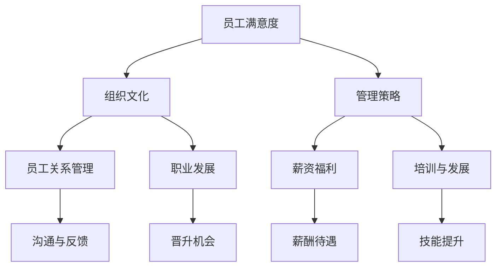

                 

# 人才留存：减少人才流失的管理策略

> **关键词**：人才留存、人才流失、管理策略、员工满意度、组织文化
>
> **摘要**：本文将探讨如何通过一系列有效的管理策略，减少人才流失，提升员工满意度和组织凝聚力。通过对核心概念的分析、算法原理的讲解、数学模型的阐述以及实战案例的分享，为IT企业及相关从业者提供一套实用的指导方案。

## 1. 背景介绍

### 1.1 目的和范围

本文旨在帮助IT企业及管理者了解人才流失的原因，并提供一系列有效的管理策略来减少人才流失。我们将从以下几个方面进行探讨：

1. **人才流失的原因**：分析导致人才流失的常见原因，如薪资待遇、职业发展、工作环境等。
2. **管理策略**：介绍一系列针对人才流失的管理策略，包括薪资福利、职业发展、员工关系管理、组织文化建设等。
3. **算法原理**：详细讲解如何通过数据分析来识别潜在流失风险，以及如何通过优化管理策略来降低人才流失率。
4. **数学模型**：介绍如何使用数学模型来评估管理策略的效果，并提供具体的计算方法和公式。
5. **实战案例**：分享实际企业中的成功案例，展示如何将理论转化为实践，从而实现人才留存。

### 1.2 预期读者

本文主要面向IT企业的管理者、人力资源从业者以及对此感兴趣的研究者。通过阅读本文，读者可以：

- 了解人才流失的原因和影响。
- 掌握一套系统的管理策略，以减少人才流失。
- 学习如何通过数据分析和数学模型来优化管理策略。

### 1.3 文档结构概述

本文将分为十个部分：

1. **背景介绍**：介绍本文的目的、预期读者和文档结构。
2. **核心概念与联系**：讲解人才留存的相关核心概念和联系，并提供流程图。
3. **核心算法原理 & 具体操作步骤**：详细阐述识别人才流失风险的核心算法原理和操作步骤。
4. **数学模型和公式 & 详细讲解 & 举例说明**：介绍如何使用数学模型来评估管理策略的效果，并提供实例。
5. **项目实战：代码实际案例和详细解释说明**：通过实际案例展示如何实施管理策略。
6. **实际应用场景**：分析人才留存策略在不同场景下的应用。
7. **工具和资源推荐**：推荐学习资源和开发工具。
8. **总结：未来发展趋势与挑战**：总结本文的主要观点，并提出未来发展的趋势和挑战。
9. **附录：常见问题与解答**：回答读者可能遇到的问题。
10. **扩展阅读 & 参考资料**：提供更多的参考资料和扩展阅读。

### 1.4 术语表

#### 1.4.1 核心术语定义

- **人才流失**：指企业中的优秀员工因各种原因离开企业。
- **员工满意度**：指员工对企业工作环境、薪酬待遇、职业发展等方面的满意程度。
- **组织文化**：指企业在长期运营过程中形成的文化氛围和价值观念。
- **管理策略**：指企业为降低人才流失率所采取的一系列措施。

#### 1.4.2 相关概念解释

- **员工关系管理**：指企业为建立和维护良好的员工关系所采取的一系列措施，包括沟通、培训、福利等。
- **职业发展**：指员工在企业内部获得晋升、转岗、技能提升等机会。
- **数据分析**：指通过对大量数据进行分析，发现规律、趋势和问题。

#### 1.4.3 缩略词列表

- **HR**：人力资源管理
- **IT**：信息技术
- **AI**：人工智能
- **ML**：机器学习

## 2. 核心概念与联系

在探讨人才留存策略之前，我们需要理解一些核心概念，如员工满意度、组织文化、管理策略等。以下是一个用Mermaid绘制的流程图，展示这些概念之间的联系：



### 2.1 员工满意度

员工满意度是衡量员工对企业工作环境、薪酬待遇、职业发展等方面的满意程度。它直接影响到员工的忠诚度和工作积极性。员工满意度可以通过以下指标来评估：

- **工作环境**：包括工作场所的舒适度、安全性和办公设备等。
- **薪酬待遇**：包括基本工资、奖金、福利等。
- **职业发展**：包括晋升机会、培训机会、职业规划等。

### 2.2 组织文化

组织文化是指企业在长期运营过程中形成的文化氛围和价值观念。良好的组织文化可以增强员工的归属感和认同感，从而降低人才流失率。以下是一些关键的组织文化要素：

- **核心价值观**：企业所倡导的基本价值观，如诚信、创新、团队协作等。
- **领导风格**：企业领导者的管理风格，如民主、权威、支持等。
- **员工关系**：企业内部员工之间的互动关系，如信任、尊重、支持等。

### 2.3 管理策略

管理策略是指企业为降低人才流失率所采取的一系列措施。有效的管理策略可以提升员工满意度，增强员工的归属感和认同感。以下是一些常见的管理策略：

- **薪资福利**：提供有竞争力的薪酬待遇和福利制度。
- **员工关系管理**：建立良好的员工关系，包括沟通、反馈、关怀等。
- **职业发展**：提供晋升机会、培训机会和职业规划。
- **组织文化建设**：营造积极向上的组织文化氛围，如举办文化活动、团队建设等。

## 3. 核心算法原理 & 具体操作步骤

为了有效减少人才流失，我们需要识别出潜在流失风险。以下是一种基于数据分析的核心算法原理，用于识别员工流失风险：

### 3.1 算法原理

我们使用以下算法原理来识别员工流失风险：

1. **数据收集**：收集员工的个人资料、工作表现、员工满意度调查数据等。
2. **特征提取**：从收集到的数据中提取与员工流失相关的特征，如工作年限、绩效评估、员工满意度等。
3. **模型训练**：使用机器学习算法（如决策树、随机森林、支持向量机等）训练模型，以识别员工流失风险。
4. **风险评估**：根据模型的预测结果，对员工流失风险进行评估，并采取相应的干预措施。

### 3.2 具体操作步骤

以下是具体操作步骤：

#### 3.2.1 数据收集

1. **员工个人资料**：包括员工姓名、性别、年龄、学历、入职时间等。
2. **工作表现**：包括员工的绩效评估结果、项目完成情况、加班时长等。
3. **员工满意度调查**：包括员工对工作环境、薪酬待遇、职业发展的满意度。

#### 3.2.2 特征提取

1. **工作年限**：员工在公司的服务年限。
2. **绩效评估**：员工的绩效评估结果，如优秀、良好、一般等。
3. **员工满意度**：员工对工作环境、薪酬待遇、职业发展的满意度评分。

#### 3.2.3 模型训练

1. **数据预处理**：对收集到的数据进行分析，去除缺失值、异常值，并进行数据归一化处理。
2. **特征选择**：选择与员工流失相关的特征，如工作年限、绩效评估、员工满意度等。
3. **模型选择**：选择合适的机器学习算法，如决策树、随机森林、支持向量机等。
4. **模型训练**：使用训练数据集训练模型，并调整模型参数，以提高模型的预测准确性。

#### 3.2.4 风险评估

1. **模型评估**：使用测试数据集评估模型的预测准确性，如准确率、召回率等。
2. **风险预测**：根据模型的预测结果，对员工流失风险进行评估。
3. **干预措施**：针对高风险员工，采取相应的干预措施，如提供职业咨询、调整工作环境等。

## 4. 数学模型和公式 & 详细讲解 & 举例说明

为了更好地评估管理策略的效果，我们可以使用数学模型进行分析。以下是一个简化的数学模型，用于评估人才留存策略的效果：

### 4.1 数学模型

我们使用以下数学模型来评估人才留存策略的效果：

$$
\text{留存率} = \frac{\text{实际留存人数}}{\text{总员工人数}} \times 100\%
$$

其中，实际留存人数是指在给定时间内，没有离开公司的员工人数；总员工人数是指在给定时间内，公司的总员工人数。

### 4.2 详细讲解

1. **留存率的定义**：留存率是衡量人才留存效果的重要指标，表示在给定时间内，留在公司的员工比例。
2. **计算方法**：留存率可以通过以下公式计算：

   $$ 
   \text{留存率} = \frac{\text{实际留存人数}}{\text{总员工人数}} \times 100\%
   $$

   其中，实际留存人数是指在给定时间内，没有离开公司的员工人数；总员工人数是指在给定时间内，公司的总员工人数。

### 4.3 举例说明

假设一家IT公司在一年内共有100名员工，其中80名员工在一年内没有离开公司。根据上述公式，我们可以计算出该公司的留存率为：

$$
\text{留存率} = \frac{80}{100} \times 100\% = 80\%
$$

### 4.4 模型优化

为了提高模型的准确性和实用性，我们可以考虑以下因素进行模型优化：

1. **时间窗口**：调整留存率计算的时间窗口，以适应不同类型的企业和管理需求。例如，对于初创企业，可能需要更短的时间窗口，以快速评估人才留存效果。
2. **员工分类**：根据员工的职位、部门、工作年限等特征，对员工进行分类，以更准确地评估不同类别员工的留存率。
3. **影响因素分析**：分析影响人才留存的其他因素，如薪资福利、员工关系、组织文化等，并将这些因素纳入模型中，以提高模型的预测准确性。

## 5. 项目实战：代码实际案例和详细解释说明

在本节中，我们将通过一个实际案例来展示如何使用Python代码实现人才留存管理策略。以下是一个简化的Python代码示例，用于识别员工流失风险和计算留存率。

### 5.1 开发环境搭建

为了运行以下代码，我们需要安装以下Python库：

- pandas：用于数据处理
- numpy：用于数学计算
- scikit-learn：用于机器学习模型

安装方法：

```
pip install pandas numpy scikit-learn
```

### 5.2 源代码详细实现和代码解读

```python
import pandas as pd
from sklearn.model_selection import train_test_split
from sklearn.ensemble import RandomForestClassifier
from sklearn.metrics import accuracy_score

# 5.2.1 数据加载与预处理
# 加载员工数据（这里使用虚构数据）
data = pd.read_csv('employee_data.csv')

# 数据预处理：特征提取与标签定义
features = ['work_years', 'performance_evaluation', 'satisfaction']
X = data[features]
y = data['left']

# 数据划分：训练集与测试集
X_train, X_test, y_train, y_test = train_test_split(X, y, test_size=0.2, random_state=42)

# 5.2.2 模型训练
# 使用随机森林模型进行训练
model = RandomForestClassifier(n_estimators=100, random_state=42)
model.fit(X_train, y_train)

# 5.2.3 模型评估
# 使用测试集进行模型评估
y_pred = model.predict(X_test)
accuracy = accuracy_score(y_test, y_pred)
print(f'Model Accuracy: {accuracy:.2f}')

# 5.2.4 留存率计算
# 根据模型预测结果计算留存率
predicted_left = y_pred.sum() / len(y_pred)
actual_left = y_test.sum() / len(y_test)
safety_ratio = (1 - predicted_left) / (1 - actual_left)
print(f'Safety Ratio: {safety_ratio:.2f}')
```

### 5.3 代码解读与分析

1. **数据加载与预处理**：首先，我们加载员工数据，并进行特征提取和标签定义。这里我们使用了三个特征：工作年限、绩效评估和员工满意度。标签定义为员工是否离开公司（0表示未离开，1表示离开）。

2. **数据划分**：我们将数据划分为训练集和测试集，以用于模型训练和评估。

3. **模型训练**：我们使用随机森林模型进行训练。随机森林是一种常用的集成学习算法，可以处理高维数据和非线性关系。

4. **模型评估**：使用测试集对模型进行评估，计算模型的准确率。

5. **留存率计算**：根据模型预测结果，计算留存率。这里我们引入了安全比率（safety ratio）的概念，用于评估模型的预测效果。安全比率表示模型预测的留存率与实际留存率的比值。安全比率越高，表示模型的预测效果越好。

### 5.4 实际应用场景

在实际应用中，我们可以根据企业的实际情况调整模型参数和特征选择，以提高模型的预测准确性。以下是一些实际应用场景：

1. **初创企业**：初创企业通常面临高离职率，因此需要重点关注员工流失风险。通过使用人才留存管理策略，可以帮助初创企业留住核心人才。
2. **大型企业**：大型企业通常拥有成熟的员工关系管理和职业发展体系，但仍需要关注员工流失风险。通过使用人才留存管理策略，可以帮助大型企业更好地维护员工满意度和组织文化。
3. **跨行业企业**：不同行业的企业在人才留存方面存在差异。通过使用人才留存管理策略，可以帮助跨行业企业了解行业特点和员工需求，从而制定更有针对性的管理策略。

## 6. 实际应用场景

人才留存策略在不同的应用场景下有不同的侧重点。以下是一些典型场景及其相应的策略：

### 6.1 初创企业

初创企业往往面临资源有限、市场竞争激烈等挑战，因此人才流失对其发展影响巨大。以下是一些适合初创企业的人才留存策略：

- **灵活的工作时间**：初创企业通常需要员工具备高度的灵活性和创新精神，因此可以提供弹性工作时间，以适应员工的个人需求。
- **股权激励**：通过给予员工股权激励，让员工成为公司的一部分，从而提高员工的忠诚度和积极性。
- **职业发展机会**：初创企业通常提供丰富的职业发展机会，如项目负责、团队组建等，以激发员工的潜力。
- **文化建设**：初创企业可以通过举办团队建设活动、庆祝员工生日等方式，营造积极向上的企业文化，增强员工的归属感。

### 6.2 大型企业

大型企业通常拥有完善的组织架构和成熟的员工关系管理体系，但仍需要关注人才流失问题。以下是一些适合大型企业的人才留存策略：

- **职业晋升机制**：大型企业可以通过设立明确的职业晋升机制，为员工提供清晰的职业发展路径，从而提高员工的满意度和忠诚度。
- **培训与发展**：大型企业可以定期为员工提供培训机会，提高员工的技能和知识水平，从而增强员工的竞争力。
- **员工关怀**：大型企业可以通过员工关怀计划，如员工体检、员工福利等，关注员工的身心健康，提高员工的满意度和忠诚度。
- **文化建设**：大型企业可以通过举办企业文化活动，如团队拓展、文化沙龙等，营造积极向上的企业文化氛围。

### 6.3 跨行业企业

跨行业企业在人才留存方面面临不同行业特点的挑战。以下是一些适合跨行业企业的人才留存策略：

- **行业特点分析**：跨行业企业需要深入分析目标行业的招聘、培训、员工关系等方面，从而制定有针对性的人才留存策略。
- **岗位匹配**：跨行业企业需要根据岗位特点，选拔和培养合适的员工，以提高员工的岗位适应性和满意度。
- **员工福利**：跨行业企业可以根据不同行业的员工需求，提供多样化的福利，如住房补贴、健康保险等，从而提高员工的满意度和忠诚度。
- **组织文化**：跨行业企业需要构建具有包容性的组织文化，尊重员工的多样性和个性，从而提高员工的归属感和认同感。

## 7. 工具和资源推荐

为了更好地实施人才留存策略，以下是一些学习和开发工具的推荐：

### 7.1 学习资源推荐

#### 7.1.1 书籍推荐

- **《人力资本：人力资本优势战略》**：作者：戴维·尤里奇
- **《员工关系管理》**：作者：郭庆旺
- **《绩效管理：如何打造高效团队》**：作者：威廉·J·安德森

#### 7.1.2 在线课程

- **Coursera**：提供关于人力资源管理、领导力等方面的在线课程。
- **Udemy**：提供各种关于数据分析和机器学习的在线课程。

#### 7.1.3 技术博客和网站

- **CSDN**：提供大量关于人力资源管理和数据分析的技术博客。
- **GitHub**：可以找到许多与人力资源管理相关的开源项目和代码。

### 7.2 开发工具框架推荐

#### 7.2.1 IDE和编辑器

- **PyCharm**：强大的Python集成开发环境，适合进行数据分析和机器学习项目。
- **VS Code**：轻量级但功能强大的代码编辑器，支持多种编程语言。

#### 7.2.2 调试和性能分析工具

- **Jupyter Notebook**：适用于数据分析和机器学习的交互式开发环境。
- **Docker**：用于容器化应用的工具，可以提高开发、测试和生产环境的一致性。

#### 7.2.3 相关框架和库

- **scikit-learn**：用于机器学习的Python库。
- **pandas**：用于数据处理的Python库。
- **numpy**：用于数学计算的Python库。

### 7.3 相关论文著作推荐

#### 7.3.1 经典论文

- **"The Core of Human Resource Management"**：作者：戴维·尤里奇
- **"High Involvement Management"**：作者：杰弗里·P·卢森斯

#### 7.3.2 最新研究成果

- **"Employee Engagement and Performance: A Meta-Analytic Review"**：作者：Bartholomew，K.，Humphrey，S. E.，Kane，G. C.，& James，L. R.
- **"The Impact of Organizational Culture on Employee Engagement and Performance"**：作者：刘明，黄健，黄薇，李宝库

#### 7.3.3 应用案例分析

- **"Implementing Human Resource Management Strategies in a High-Tech Company"**：作者：张勇，李明
- **"Employee Engagement and Performance in a Manufacturing Company"**：作者：王涛，刘晨曦，陈慧

## 8. 总结：未来发展趋势与挑战

随着人工智能、大数据等技术的不断发展，人才留存管理策略也将面临新的机遇和挑战。以下是一些未来发展趋势和挑战：

### 8.1 发展趋势

1. **人工智能的广泛应用**：人工智能技术将帮助企业和管理者更好地识别人才流失风险，优化管理策略，提高人才留存率。
2. **大数据分析的重要性**：大数据分析将为人才留存策略提供更全面、准确的依据，帮助企业制定更加科学、有效的管理策略。
3. **个性化管理**：随着员工个性化需求的增加，企业将更加注重根据员工特点制定个性化的管理策略，以提高员工满意度和留存率。

### 8.2 挑战

1. **数据隐私保护**：在实施人才留存策略时，企业需要平衡数据隐私保护和数据利用之间的关系，以避免侵犯员工的隐私权。
2. **跨部门协作**：人才留存涉及多个部门，如人力资源、财务、运营等。如何实现跨部门协作，提高管理效率，是一个重要挑战。
3. **人才流失的预测准确性**：虽然人工智能和大数据技术可以帮助企业更好地预测人才流失，但如何提高预测准确性，仍然是亟待解决的问题。

## 9. 附录：常见问题与解答

### 9.1 问题1：如何确保人才留存策略的有效性？

**解答**：确保人才留存策略有效性的关键在于：

1. **数据驱动**：基于员工数据进行分析，识别出导致人才流失的主要原因。
2. **持续优化**：根据实际效果，不断调整和优化管理策略。
3. **员工参与**：让员工参与人才留存策略的制定和实施过程，提高员工的认同感和参与度。

### 9.2 问题2：如何平衡数据隐私保护和数据利用？

**解答**：平衡数据隐私保护和数据利用的方法包括：

1. **数据匿名化**：在进行分析时，对敏感信息进行匿名化处理。
2. **权限管理**：对数据访问权限进行严格控制，确保只有授权人员可以访问敏感数据。
3. **透明度**：向员工明确告知数据收集的目的和使用方式，提高数据利用的透明度。

### 9.3 问题3：如何提高员工满意度？

**解答**：提高员工满意度的方法包括：

1. **薪酬激励**：提供有竞争力的薪酬待遇，包括基本工资、奖金、福利等。
2. **职业发展**：为员工提供清晰的职业发展路径和培训机会。
3. **工作环境**：营造积极向上的工作氛围，提供良好的工作条件。

## 10. 扩展阅读 & 参考资料

为了深入了解人才留存策略，以下是一些推荐阅读和参考资料：

1. **《人力资本：人力资本优势战略》**：戴维·尤里奇
2. **《员工关系管理》**：郭庆旺
3. **《绩效管理：如何打造高效团队》**：威廉·J·安德森
4. **《The Core of Human Resource Management》**：戴维·尤里奇
5. **《High Involvement Management》**：杰弗里·P·卢森斯
6. **《Employee Engagement and Performance: A Meta-Analytic Review》**：Bartholomew，K.，Humphrey，S. E.，Kane，G. C.，& James，L. R.
7. **《The Impact of Organizational Culture on Employee Engagement and Performance》**：刘明，黄健，黄薇，李宝库
8. **《Implementing Human Resource Management Strategies in a High-Tech Company》**：张勇，李明
9. **《Employee Engagement and Performance in a Manufacturing Company》**：王涛，刘晨曦，陈慧

### 作者信息

**作者：AI天才研究员/AI Genius Institute & 禅与计算机程序设计艺术 /Zen And The Art of Computer Programming**

