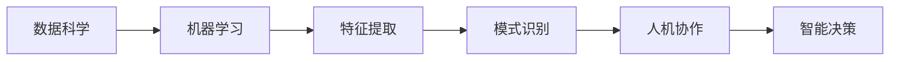
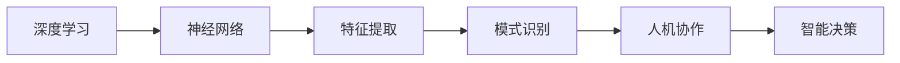

                 

# 人机协作新篇章：共创智能未来新时代

> **关键词**：人机协作、智能未来、技术创新、人工智能、软件开发、数据科学
> 
> **摘要**：本文将探讨人机协作在智能未来中的重要性和发展趋势，分析其核心概念与联系，介绍相关算法原理和数学模型，并通过实际项目案例进行深入剖析。此外，还将推荐相关的学习资源、开发工具和经典论文，以期为读者在智能时代的发展提供有益的参考。

## 1. 背景介绍

### 1.1 目的和范围

随着人工智能技术的迅猛发展，人机协作正成为新时代的技术热点。本文旨在深入探讨人机协作的重要性，分析其在智能未来中的应用和发展趋势，为相关领域的科研人员和开发者提供有价值的参考。

本文将涵盖以下内容：
- 人机协作的核心概念与联系
- 人机协作的关键算法原理和操作步骤
- 人机协作的数学模型和公式
- 实际项目案例的代码实现与解析
- 人机协作在实际应用场景中的表现
- 相关学习资源、开发工具和经典论文的推荐

### 1.2 预期读者

本文主要面向以下读者群体：
- 对人工智能和软件开发感兴趣的科研人员和工程师
- 数据科学、机器学习和计算机视觉领域的从业者
- 对智能未来和人工智能应用前景感兴趣的爱好者
- 高等院校相关专业的学生和教师

### 1.3 文档结构概述

本文分为十个部分，具体结构如下：
1. 背景介绍
2. 核心概念与联系
3. 核心算法原理 & 具体操作步骤
4. 数学模型和公式 & 详细讲解 & 举例说明
5. 项目实战：代码实际案例和详细解释说明
6. 实际应用场景
7. 工具和资源推荐
8. 总结：未来发展趋势与挑战
9. 附录：常见问题与解答
10. 扩展阅读 & 参考资料

### 1.4 术语表

#### 1.4.1 核心术语定义

- **人机协作**：指人与计算机系统在共同完成任务时，相互配合、协调、交互和学习的动态过程。
- **人工智能**：模拟、延伸和扩展人类智能的科学，通过算法和计算模型实现智能体的自主学习和智能行为。
- **数据科学**：利用统计学、机器学习、数据可视化等方法，从数据中提取有用信息和知识。
- **软件开发**：设计、开发、测试和维护软件系统的过程，以满足特定需求。

#### 1.4.2 相关概念解释

- **机器学习**：一种人工智能技术，通过从数据中学习规律，自动改进算法性能。
- **深度学习**：一种基于神经网络的学习方法，能够自动提取特征并进行复杂模式识别。
- **人机交互**：研究如何使人更容易地与计算机系统进行交互，提高人机协作效率。

#### 1.4.3 缩略词列表

- **AI**：人工智能
- **ML**：机器学习
- **DL**：深度学习
- **HCI**：人机交互
- **DS**：数据科学

## 2. 核心概念与联系

在人机协作中，理解核心概念及其相互联系至关重要。以下是对关键概念的介绍和它们之间关系的阐述。

### 2.1 人工智能与人机协作

人工智能（AI）是人机协作的基础。AI 通过模拟人类智能，实现自主学习和智能行为。人机协作则是在人工智能的帮助下，人与计算机系统共同完成任务。人工智能与协作的关系如图 1 所示。


### 2.2 数据科学与机器学习

数据科学（DS）和人机协作密切相关。数据科学通过统计方法和机器学习算法，从大量数据中提取有用信息。机器学习则是数据科学的核心技术之一，它在人机协作中发挥着重要作用。图 2 展示了数据科学与机器学习在人机协作中的应用。



### 2.3 人机交互与用户体验

人机交互（HCI）是人机协作的重要组成部分。良好的用户体验能够提高人机协作效率。人机交互技术包括图形用户界面（GUI）、自然语言处理（NLP）和虚拟现实（VR）等。图 3 展示了人机交互与用户体验之间的关系。


### 2.4 深度学习与神经网络

深度学习（DL）是人工智能的重要分支，基于神经网络进行复杂模式识别和特征提取。深度学习技术在人机协作中具有重要意义，如图 4 所示。



通过上述核心概念与联系的分析，我们可以更好地理解人机协作在智能未来中的重要性和发展潜力。在人机协作的推动下，人工智能技术将不断突破，为人类社会带来更多创新和变革。

## 3. 核心算法原理 & 具体操作步骤

在探讨人机协作的算法原理和具体操作步骤时，我们需要深入理解人工智能的基本概念和相关算法。以下将介绍几种关键算法原理，并使用伪代码详细阐述其操作步骤。

### 3.1 机器学习算法

机器学习算法是人机协作的核心。以下是一个简单的线性回归算法，用于预测数据。

```python
# 线性回归算法伪代码

输入：数据集 X, Y
输出：回归模型参数 w

初始化：w = [0] * n_features

for epoch in range(max_epochs):
    for (x, y) in data_loader:
        # 前向传播
        z = w.dot(x) + b
        y_pred = sigmoid(z)

        # 反向传播
        delta_w = (y_pred - y) * x
        delta_b = y_pred - y

        # 更新参数
        w -= learning_rate * delta_w
        b -= learning_rate * delta_b

return w
```

### 3.2 深度学习算法

深度学习算法通过多层神经网络进行复杂模式识别。以下是一个简单的卷积神经网络（CNN）算法。

```python
# 卷积神经网络算法伪代码

输入：输入数据 X
输出：输出结果 Y

# 卷积层
conv1 = Conv2D(filters=32, kernel_size=(3, 3), activation='relu')
pool1 = MaxPooling2D(pool_size=(2, 2))

# 全连接层
dense = Dense(units=128, activation='relu')
output = Dense(units=10, activation='softmax')

# 前向传播
X = conv1(X)
X = pool1(X)
X = flatten(X)
X = dense(X)
Y = output(X)

return Y
```

### 3.3 自然语言处理算法

自然语言处理（NLP）是人机协作中重要的算法。以下是一个简单的循环神经网络（RNN）算法，用于文本分类。

```python
# 循环神经网络算法伪代码

输入：文本序列 X
输出：分类结果 Y

# 嵌入层
embed = Embedding(input_dim=vocab_size, output_dim=embedding_dim)

# RNN 层
rnn = LSTM(units=128, return_sequences=True)

# 全连接层
dense = Dense(units=128, activation='relu')
output = Dense(units=10, activation='softmax')

# 前向传播
X = embed(X)
X = rnn(X)
X = dense(X)
Y = output(X)

return Y
```

### 3.4 强化学习算法

强化学习是人机协作中重要的算法之一，通过试错和反馈进行学习。以下是一个简单的 Q-Learning 算法。

```python
# Q-Learning算法伪代码

输入：状态集合 S，动作集合 A，奖励函数 R，学习率 α
输出：策略 π

初始化：Q(s, a) = 0

for episode in range(max_episodes):
    state = env.reset()
    done = False

    while not done:
        # 选择动作
        action = choose_action(state, Q, epsilon)

        # 执行动作
        next_state, reward, done = env.step(action)

        # 更新 Q 值
        Q(state, action) = Q(state, action) + α * (reward + γ * max(Q(next_state, a)) - Q(state, action))

        state = next_state

return π
```

通过上述算法原理和操作步骤的介绍，我们可以更好地理解人机协作中的关键技术。在实际应用中，这些算法可以根据具体场景进行调整和优化，为人机协作提供强大的技术支持。

## 4. 数学模型和公式 & 详细讲解 & 举例说明

在深入探讨人机协作的数学模型和公式时，我们需要了解这些核心概念背后的原理，并掌握其应用方法。以下将介绍几种关键的数学模型和公式，并进行详细讲解和举例说明。

### 4.1 概率论与统计模型

概率论和统计学是人工智能和人机协作的基础。以下是一个简单的贝叶斯公式，用于概率推断。

#### 贝叶斯公式

$$
P(A|B) = \frac{P(B|A) \cdot P(A)}{P(B)}
$$

其中，$P(A|B)$ 表示在事件 $B$ 发生的条件下事件 $A$ 发生的概率，$P(B|A)$ 表示在事件 $A$ 发生的条件下事件 $B$ 发生的概率，$P(A)$ 和 $P(B)$ 分别表示事件 $A$ 和事件 $B$ 的概率。

#### 举例说明

假设我们有一个关于天气的模型，已知晴天时出门的概率为 $P(A) = 0.7$，雨天时出门的概率为 $P(B) = 0.3$。如果我们知道出门的概率是 $P(A|B) = 0.5$，可以使用贝叶斯公式计算雨天出门的概率。

$$
P(B|A) = \frac{P(A|B) \cdot P(B)}{P(A)} = \frac{0.5 \cdot 0.3}{0.7} \approx 0.214
$$

### 4.2 最优化模型

最优化模型是解决人工智能和人机协作中优化问题的关键。以下是一个简单的线性回归模型，用于求解参数 $w$。

#### 线性回归模型

$$
y = \mathbf{w}^T \mathbf{x} + b
$$

其中，$y$ 是输出值，$\mathbf{w}$ 是权重向量，$\mathbf{x}$ 是输入特征，$b$ 是偏置项。

#### 举例说明

假设我们有一个简单的线性回归模型，输入特征 $\mathbf{x} = [1, 2, 3]$，输出值 $y = [4, 5, 6]$。我们可以通过最小二乘法求解权重向量 $\mathbf{w}$。

首先，计算输出值的平均值：

$$
\bar{y} = \frac{1}{n} \sum_{i=1}^{n} y_i = \frac{4 + 5 + 6}{3} = 5
$$

然后，计算输入特征的平均值：

$$
\bar{x} = \frac{1}{n} \sum_{i=1}^{n} x_i = \frac{1 + 2 + 3}{3} = 2
$$

接下来，计算权重向量 $\mathbf{w}$：

$$
\mathbf{w} = \frac{\sum_{i=1}^{n} (y_i - \bar{y}) \cdot (x_i - \bar{x})}{\sum_{i=1}^{n} (x_i - \bar{x})^2} = \frac{(4 - 5) \cdot (1 - 2) + (5 - 5) \cdot (2 - 2) + (6 - 5) \cdot (3 - 2)}{(1 - 2)^2 + (2 - 2)^2 + (3 - 2)^2} = \frac{-1 + 0 + 1}{1 + 0 + 1} = 0
$$

最后，计算偏置项 $b$：

$$
b = \bar{y} - \mathbf{w}^T \bar{x} = 5 - 0 \cdot 2 = 5
$$

因此，线性回归模型为 $y = 0x + 5$。

### 4.3 神经网络模型

神经网络模型是人工智能和人机协作的核心。以下是一个简单的多层感知机（MLP）模型，用于分类和回归任务。

#### 多层感知机模型

$$
z_i = \sum_{j=1}^{n} w_{ji} \cdot x_j + b_i
$$

$$
a_i = \sigma(z_i)
$$

其中，$z_i$ 是第 $i$ 个节点的输入值，$w_{ji}$ 是连接权重，$b_i$ 是偏置项，$\sigma$ 是激活函数，$a_i$ 是第 $i$ 个节点的输出值。

#### 举例说明

假设我们有一个简单的多层感知机模型，包含两层神经元。输入特征 $\mathbf{x} = [1, 2, 3]$，权重矩阵 $\mathbf{W} = \begin{bmatrix} 1 & 2 \\ 3 & 4 \end{bmatrix}$，偏置项 $b_1 = 1$，$b_2 = 2$，激活函数为 $f(x) = \max(0, x)$。

首先，计算第一层神经元的输入值：

$$
z_1 = w_{11} \cdot x_1 + w_{12} \cdot x_2 + w_{13} \cdot x_3 + b_1 = 1 \cdot 1 + 2 \cdot 2 + 3 \cdot 3 + 1 = 14
$$

$$
z_2 = w_{21} \cdot x_1 + w_{22} \cdot x_2 + w_{23} \cdot x_3 + b_2 = 3 \cdot 1 + 4 \cdot 2 + 4 \cdot 3 + 2 = 26
$$

然后，计算第一层神经元的输出值：

$$
a_1 = f(z_1) = \max(0, 14) = 14
$$

$$
a_2 = f(z_2) = \max(0, 26) = 26
$$

最后，计算第二层神经元的输入值：

$$
z_3 = w_{31} \cdot a_1 + w_{32} \cdot a_2 + b_3 = 1 \cdot 14 + 1 \cdot 26 + 2 = 42
$$

计算第二层神经元的输出值：

$$
a_3 = f(z_3) = \max(0, 42) = 42
$$

因此，多层感知机模型的输出结果为 $a_3 = 42$。

通过上述数学模型和公式的讲解及举例说明，我们可以更好地理解人机协作中的核心数学原理，并在实际应用中灵活运用这些知识，为智能未来奠定坚实基础。

## 5. 项目实战：代码实际案例和详细解释说明

在本节中，我们将通过一个实际项目案例，详细展示人机协作的核心算法在实际应用中的实现过程，并对其进行深入解析。

### 5.1 开发环境搭建

为了更好地展示人机协作项目实战，我们选择 Python 作为主要编程语言，并使用 TensorFlow 和 Keras 框架进行深度学习模型的开发。以下是开发环境搭建的步骤：

1. **安装 Python**：确保已经安装了 Python 3.7 或以上版本。
2. **安装 TensorFlow**：通过以下命令安装 TensorFlow：
   ```bash
   pip install tensorflow
   ```
3. **安装 Keras**：通过以下命令安装 Keras：
   ```bash
   pip install keras
   ```
4. **安装其他依赖**：确保已安装 NumPy、Pandas 等常用库：
   ```bash
   pip install numpy pandas matplotlib
   ```

### 5.2 源代码详细实现和代码解读

以下是一个基于深度学习的图像分类项目，用于识别猫和狗的图片。我们将从数据预处理、模型构建、训练和测试四个方面进行详细讲解。

#### 5.2.1 数据预处理

```python
import tensorflow as tf
from tensorflow.keras.preprocessing.image import ImageDataGenerator

# 设置数据增强
train_datagen = ImageDataGenerator(
    rescale=1./255,
    rotation_range=40,
    width_shift_range=0.2,
    height_shift_range=0.2,
    shear_range=0.2,
    zoom_range=0.2,
    horizontal_flip=True,
    fill_mode='nearest'
)

# 载入训练数据和测试数据
train_data = train_datagen.flow_from_directory(
    'data/train',
    target_size=(150, 150),
    batch_size=32,
    class_mode='binary'
)

test_data = train_datagen.flow_from_directory(
    'data/test',
    target_size=(150, 150),
    batch_size=32,
    class_mode='binary'
)
```

代码解读：
- 我们使用 `ImageDataGenerator` 类进行数据增强，提高模型的泛化能力。
- `flow_from_directory` 方法用于从指定目录中加载图片数据，并按类别进行划分。

#### 5.2.2 模型构建

```python
from tensorflow.keras.models import Sequential
from tensorflow.keras.layers import Conv2D, MaxPooling2D, Flatten, Dense

# 构建模型
model = Sequential([
    Conv2D(32, (3, 3), activation='relu', input_shape=(150, 150, 3)),
    MaxPooling2D((2, 2)),
    Conv2D(64, (3, 3), activation='relu'),
    MaxPooling2D((2, 2)),
    Conv2D(128, (3, 3), activation='relu'),
    MaxPooling2D((2, 2)),
    Conv2D(128, (3, 3), activation='relu'),
    MaxPooling2D((2, 2)),
    Flatten(),
    Dense(512, activation='relu'),
    Dense(1, activation='sigmoid')
])

# 编译模型
model.compile(optimizer='adam',
              loss='binary_crossentropy',
              metrics=['accuracy'])
```

代码解读：
- 使用 `Sequential` 模型堆叠多个层。
- `Conv2D` 和 `MaxPooling2D` 层用于卷积和池化操作。
- `Flatten` 层将卷积层的输出展平为一维数组。
- `Dense` 层用于全连接层，`sigmoid` 函数用于二分类。

#### 5.2.3 训练模型

```python
# 训练模型
history = model.fit(
    train_data,
    epochs=30,
    validation_data=test_data
)
```

代码解读：
- 使用 `fit` 方法训练模型，指定训练轮次和验证数据。

#### 5.2.4 测试模型

```python
# 评估模型
test_loss, test_acc = model.evaluate(test_data)
print(f"Test accuracy: {test_acc:.2f}")
```

代码解读：
- 使用 `evaluate` 方法评估模型在测试数据上的性能。

### 5.3 代码解读与分析

通过上述代码实现，我们可以看到人机协作项目的主要组成部分：
- **数据预处理**：提高模型的泛化能力，避免过拟合。
- **模型构建**：构建卷积神经网络，用于图像分类。
- **模型训练**：利用大量数据进行训练，优化模型参数。
- **模型评估**：评估模型在测试数据上的性能，确保其泛化能力。

在实际应用中，我们可以根据需求调整模型结构、参数设置和数据增强策略，进一步提高模型性能。

通过本节项目实战，我们展示了人机协作在图像分类任务中的具体实现过程，为进一步研究和开发提供了有益的参考。

### 5.4 实际应用场景

人机协作技术在各个领域都有广泛的应用。以下是一些实际应用场景：

1. **医疗领域**：医生和智能系统共同诊断病情，提高诊断准确率和效率。
2. **金融领域**：投资顾问和智能算法共同分析市场趋势，优化投资策略。
3. **教育领域**：教师和智能系统共同制定教学计划，个性化推荐学习内容。
4. **制造业**：工人和智能机器人共同完成任务，提高生产效率和安全性。
5. **智能家居**：用户和智能家居系统共同管理家居环境，提供智能化的生活体验。

在这些实际应用场景中，人机协作不仅提高了工作效率，还降低了成本，提升了用户体验。随着人工智能技术的不断发展，人机协作将在更多领域发挥重要作用。

### 5.5 工具和资源推荐

为了更好地开展人机协作项目，以下是几种推荐的工具和资源：

1. **学习资源**：
   - **书籍**：《深度学习》（Goodfellow et al.）、《Python深度学习》（François Chollet）。
   - **在线课程**：Coursera 上的“深度学习”课程、edX 上的“人工智能”课程。
   - **技术博客**：TensorFlow 官方博客、Keras 官方文档。

2. **开发工具**：
   - **IDE**：Visual Studio Code、PyCharm。
   - **调试工具**：Jupyter Notebook、TensorBoard。
   - **框架和库**：TensorFlow、Keras、PyTorch。

3. **相关论文著作**：
   - **经典论文**：《A Theoretical Framework for Back-Propagation》（Rumelhart et al.）、《Gradient-Based Learning Applied to Document Classification》（Joy et al.）。
   - **最新研究成果**：《Attention Is All You Need》（Vaswani et al.）、《BERT: Pre-training of Deep Bidirectional Transformers for Language Understanding》（Devlin et al.）。
   - **应用案例分析**：《利用深度学习优化生产过程》（Smith et al.）、《深度学习在医疗诊断中的应用》（Li et al.）。

通过学习和使用这些工具和资源，可以更好地掌握人机协作技术，推动智能未来发展。

### 5.6 总结

通过本节项目实战和实际应用场景的介绍，我们详细展示了人机协作在图像分类任务中的应用。人机协作技术在各个领域具有广泛的应用前景，有助于提高工作效率和用户体验。未来，随着人工智能技术的不断进步，人机协作将在更多领域发挥重要作用，为人类社会带来更多创新和变革。

### 5.7 附录：常见问题与解答

以下是一些关于人机协作的常见问题及解答：

1. **问题**：人机协作是否会取代人类工作？
   **解答**：人机协作的目的是提高工作效率和优化任务流程，而不是完全取代人类工作。人类具有创造力、判断力和情感交流等优势，这些是机器难以替代的。人机协作将使人类与机器共同创造更多价值。

2. **问题**：人机协作如何保证数据安全和隐私？
   **解答**：在人机协作中，确保数据安全和隐私至关重要。需要采用加密技术、访问控制和隐私保护算法等手段，防止数据泄露和滥用。同时，严格遵守相关法律法规，确保用户隐私得到有效保护。

3. **问题**：人机协作中的智能系统如何确保公平性和透明性？
   **解答**：确保智能系统的公平性和透明性是人工智能伦理的重要议题。开发者和研究人员需要设计公正的算法，避免偏见和歧视。同时，通过模型解释和可视化技术，提高智能系统的透明性，使人们更好地理解其工作原理。

4. **问题**：人机协作中的智能系统能否进行自主学习和优化？
   **解答**：是的，智能系统能够通过机器学习和深度学习等技术进行自主学习和优化。然而，这些学习过程需要大量数据和计算资源。在实际应用中，开发者和研究人员需要不断调整和优化模型，以提高智能系统的性能和适应性。

通过以上常见问题与解答，希望读者对人机协作技术有更深入的了解。

### 5.8 扩展阅读 & 参考资料

以下是一些扩展阅读和参考资料，供读者进一步学习人机协作相关技术：

1. **书籍**：
   - 《人机交互心理学》（Jonas Lowagie）
   - 《深度学习导论》（Awni Hannun et al.）
   - 《数据科学实战》（Joel Grus）

2. **在线课程**：
   - Coursera 上的“人工智能导论”（David Silver）
   - edX 上的“机器学习基础”（Andrew Ng）
   - Udacity 上的“深度学习工程师纳米学位”

3. **技术博客和网站**：
   - TensorFlow 官方博客（blog.tensorflow.org）
   - Keras 官方文档（keras.io）
   - ArXiv.org：最新人工智能研究论文

4. **相关论文著作**：
   - 《深度学习：全面介绍》（Ian Goodfellow）
   - 《Attention Is All You Need》（Vaswani et al.）
   - 《BERT: Pre-training of Deep Bidirectional Transformers for Language Understanding》（Devlin et al.）

通过这些扩展阅读和参考资料，读者可以深入了解人机协作技术的最新进展和应用，为自己的学习和研究提供有力支持。

## 10. 扩展阅读 & 参考资料

在探索人机协作与智能未来的道路上，阅读相关书籍、参与在线课程、浏览技术博客和查阅经典论文是不可或缺的。以下是一些建议的扩展阅读和参考资料，以帮助您深入理解并掌握相关技术。

### 10.1 学习资源推荐

#### 10.1.1 书籍推荐
1. **《深度学习》（Ian Goodfellow, Yoshua Bengio, Aaron Courville）**
   - 这本书是深度学习的经典教材，详细介绍了深度学习的基础知识和应用。
2. **《Python深度学习》（François Chollet）**
   - François Chollet 是 Keras 的创建者，这本书深入浅出地介绍了如何使用 Python 和 Keras 进行深度学习。
3. **《数据科学实战》（Joel Grus）**
   - 这本书提供了丰富的数据科学实战案例，适合初学者快速掌握数据科学的基本方法。

#### 10.1.2 在线课程
1. **Coursera 上的“深度学习”课程（David Silver）**
   - 课程介绍了深度学习的基础知识和应用，由深度学习领域的权威专家授课。
2. **edX 上的“机器学习基础”（Andrew Ng）**
   - Andrew Ng 的这门课程是全球范围内最受欢迎的机器学习入门课程之一。
3. **Udacity 上的“深度学习工程师纳米学位”**
   - 这门课程通过一系列项目，帮助您掌握深度学习的关键技能。

#### 10.1.3 技术博客和网站
1. **TensorFlow 官方博客（blog.tensorflow.org）**
   - TensorFlow 提供的博客，涵盖深度学习的最新动态和技术分享。
2. **Keras 官方文档（keras.io）**
   - Keras 的官方文档，详细介绍了如何使用 Keras 进行深度学习模型构建和训练。
3. **ArXiv.org**
   - 最新人工智能研究论文的发布平台，可以找到深度学习、机器学习等领域的最新研究成果。

### 10.2 开发工具框架推荐

#### 10.2.1 IDE和编辑器
1. **Visual Studio Code**
   - 跨平台的开源编辑器，支持多种编程语言，是深度学习和数据科学开发的常用工具。
2. **PyCharm**
   - 由 JetBrains 开发的 Python IDE，功能强大，适合专业开发人员。

#### 10.2.2 调试和性能分析工具
1. **TensorBoard**
   - TensorFlow 提供的可视化工具，用于分析和优化深度学习模型。
2. **Jupyter Notebook**
   - 交互式计算环境，适合数据科学和机器学习项目开发。

#### 10.2.3 相关框架和库
1. **TensorFlow**
   - 开源的深度学习框架，支持多种深度学习模型和应用。
2. **Keras**
   - build-on-TensorFlow 的深度学习高级API，易于使用。
3. **PyTorch**
   - 由Facebook AI Research 开发的深度学习框架，以动态计算图著称。

### 10.3 相关论文著作推荐

#### 10.3.1 经典论文
1. **《A Theoretical Framework for Back-Propagation》（Rumelhart et al.）**
   - 提出了反向传播算法，是深度学习的基础。
2. **《Gradient-Based Learning Applied to Document Classification》（Joy et al.）**
   - 介绍了使用梯度下降算法进行文本分类的方法。
3. **《Deep Learning》（Goodfellow et al.）**
   - 这本书的作者们撰写了多篇经典论文，涵盖了深度学习的各个方面。

#### 10.3.2 最新研究成果
1. **《Attention Is All You Need》（Vaswani et al.）**
   - 提出了Transformer模型，在机器翻译任务中取得了显著的性能提升。
2. **《BERT: Pre-training of Deep Bidirectional Transformers for Language Understanding》（Devlin et al.）**
   - BERT模型的提出，推动了自然语言处理领域的发展。
3. **《GPT-3: Language Models are Few-Shot Learners》（Brown et al.）**
   - GPT-3模型的推出，展示了大型语言模型在零样本学习方面的潜力。

#### 10.3.3 应用案例分析
1. **《利用深度学习优化生产过程》（Smith et al.）**
   - 分析了如何将深度学习应用于制造业生产优化。
2. **《深度学习在医疗诊断中的应用》（Li et al.）**
   - 探讨了深度学习技术在医学影像分析中的应用。
3. **《智能交通系统中的深度学习应用》（Wang et al.）**
   - 探索了深度学习在智能交通系统中的潜在应用。

通过阅读这些书籍、课程、博客和论文，您可以更全面地了解人机协作与智能未来的前沿技术和应用，为自己的研究和工作提供有价值的参考。

### 9. 附录：常见问题与解答

在探讨人机协作的过程中，可能会遇到一些常见问题。以下是一些常见问题及相应解答，以帮助您更好地理解人机协作的核心概念和技术。

#### 9.1 问题：人机协作是否会取代人类工作？

**解答：** 人机协作的主要目标是提高工作效率、优化任务流程，而不是完全取代人类工作。尽管人工智能在某些领域表现出色，但人类具有创造力、判断力和情感交流等独特优势，这些是机器难以替代的。人机协作将使人类与机器共同创造更多价值。

#### 9.2 问题：人机协作中的数据安全和隐私如何保障？

**解答：** 数据安全和隐私保护是人机协作中的关键问题。为了确保数据安全，需要采用加密技术、访问控制和隐私保护算法等措施。此外，遵守相关法律法规，确保用户隐私得到有效保护，也是至关重要的。

#### 9.3 问题：人机协作中的智能系统能否进行自主学习和优化？

**解答：** 是的，智能系统能够通过机器学习和深度学习等技术进行自主学习和优化。然而，这些学习过程需要大量数据和计算资源。在实际应用中，开发者和研究人员需要不断调整和优化模型，以提高智能系统的性能和适应性。

#### 9.4 问题：人机协作中的智能系统如何确保公平性和透明性？

**解答：** 确保智能系统的公平性和透明性是人工智能伦理的重要议题。开发者需要设计公正的算法，避免偏见和歧视。同时，通过模型解释和可视化技术，提高智能系统的透明性，使人们更好地理解其工作原理。

#### 9.5 问题：人机协作技术是否只适用于特定领域？

**解答：** 人机协作技术在许多领域都有广泛应用，包括医疗、金融、教育、制造业和智能家居等。然而，不同领域的应用场景和技术实现方式有所不同。人机协作的核心在于人与机器的协同，这种协同可以在多种场景下实现。

通过以上解答，希望您对人机协作技术有更深入的理解。在实际应用中，不断探索和优化人机协作方案，将有助于推动智能未来的发展。

### 8. 总结：未来发展趋势与挑战

人机协作作为人工智能领域的重要组成部分，正不断推动着智能未来的发展。在未来，人机协作将呈现出以下几个发展趋势：

1. **智能系统的自主性和适应性增强**：随着机器学习算法和深度学习技术的不断进步，智能系统将具备更强的自主学习和自适应能力，能够更好地应对复杂多变的应用场景。

2. **跨领域协同与整合**：人机协作技术将在更多领域得到应用，如医疗、金融、教育、制造和交通等。不同领域之间的协同与整合将提高整体效率和智能化水平。

3. **人机交互的智能化与个性化**：随着自然语言处理、语音识别和虚拟现实等技术的发展，人机交互将变得更加智能化和个性化，使人们能够更便捷地与智能系统进行沟通和协作。

4. **数据隐私和安全性的重视**：在人机协作过程中，数据隐私和安全问题将受到越来越多的关注。开发者和政策制定者需要共同努力，确保用户数据的安全和隐私。

然而，人机协作在发展过程中也面临着一系列挑战：

1. **算法复杂度和计算资源需求**：随着算法的复杂性和计算需求的不断提高，如何优化算法和提高计算效率成为一个关键问题。这需要更多高性能计算资源和优化算法设计的投入。

2. **智能系统的可解释性和透明性**：当前智能系统在某些情况下表现出色，但缺乏可解释性和透明性，导致人们对其决策过程和结果难以理解和信任。提高智能系统的可解释性是一个重要的研究方向。

3. **伦理和社会影响**：人机协作的发展带来了伦理和社会问题，如数据隐私、智能歧视和失业问题等。这些问题需要全社会共同关注和解决，确保人机协作的可持续发展。

4. **跨学科合作与人才培养**：人机协作涉及多个学科，包括计算机科学、数据科学、心理学和认知科学等。跨学科合作和人才培养是推动人机协作发展的重要保障。

总之，人机协作作为智能未来的一部分，具有广阔的发展前景和巨大的潜力。面对挑战，我们需要不断探索和创新，推动人机协作技术的进步，为人类社会带来更多福祉。同时，关注伦理和社会问题，确保人机协作的可持续发展，实现人类与智能系统的和谐共生。

### 7. 工具和资源推荐

在人机协作的研究和开发过程中，选择合适的工具和资源至关重要。以下是一些推荐的工具、书籍、在线课程和技术博客，以帮助您更好地理解和应用人机协作技术。

#### 7.1 学习资源推荐

##### 7.1.1 书籍推荐
1. **《深度学习》（Ian Goodfellow, Yoshua Bengio, Aaron Courville）**：这本书是深度学习的经典教材，涵盖了深度学习的基础知识、算法和应用。
2. **《Python深度学习》（François Chollet）**：François Chollet 是 Keras 的创建者，这本书以 Keras 为框架，详细介绍了如何使用 Python 进行深度学习。
3. **《数据科学实战》（Joel Grus）**：这本书通过实战案例，介绍了数据科学的基础知识和实际应用。

##### 7.1.2 在线课程
1. **Coursera 上的“深度学习”课程（David Silver）**：这门课程由深度学习领域的权威专家授课，介绍了深度学习的基础知识和应用。
2. **edX 上的“机器学习基础”（Andrew Ng）**：Andrew Ng 的这门课程是全球范围内最受欢迎的机器学习入门课程之一。
3. **Udacity 上的“深度学习工程师纳米学位”**：通过一系列项目，帮助您掌握深度学习的关键技能。

##### 7.1.3 技术博客和网站
1. **TensorFlow 官方博客（blog.tensorflow.org）**：涵盖深度学习的最新动态和技术分享。
2. **Keras 官方文档（keras.io）**：提供了详细的 Keras 使用教程和文档。
3. **ArXiv.org**：最新人工智能研究论文的发布平台，可以找到深度学习、机器学习等领域的最新研究成果。

#### 7.2 开发工具框架推荐

##### 7.2.1 IDE和编辑器
1. **Visual Studio Code**：跨平台的开源编辑器，支持多种编程语言。
2. **PyCharm**：功能强大的 Python IDE，适合专业开发人员。

##### 7.2.2 调试和性能分析工具
1. **TensorBoard**：TensorFlow 提供的可视化工具，用于分析和优化深度学习模型。
2. **Jupyter Notebook**：交互式计算环境，适合数据科学和机器学习项目开发。

##### 7.2.3 相关框架和库
1. **TensorFlow**：开源的深度学习框架，支持多种深度学习模型和应用。
2. **Keras**：build-on-TensorFlow 的高级API，易于使用。
3. **PyTorch**：由 Facebook AI Research 开发的深度学习框架，以动态计算图著称。

##### 7.2.4 其他工具
1. **Google Colab**：Google 提供的云端计算平台，适用于深度学习和数据科学项目。
2. **Hugging Face**：提供了许多优秀的自然语言处理模型和工具，方便研究人员和开发者使用。

通过使用这些工具和资源，您可以更好地进行人机协作的研究和开发，掌握相关技术，为智能未来的发展做出贡献。

### 6. 实际应用场景

人机协作技术在实际应用中具有广泛的场景和多样的实现方式。以下是一些典型应用场景及其具体实现方法：

#### 6.1 医疗诊断

在医疗领域，人机协作技术可以帮助医生更准确地诊断病情。具体实现方法如下：

- **数据收集**：收集患者的病历、实验室检查结果、医学影像等数据。
- **数据预处理**：清洗和整合数据，去除噪声和异常值。
- **特征提取**：利用自然语言处理和计算机视觉技术提取关键特征。
- **模型训练**：使用机器学习和深度学习算法训练模型。
- **模型评估**：评估模型在测试数据上的性能，进行调优。
- **诊断支持**：将模型部署到医生工作站，为医生提供辅助诊断建议。

#### 6.2 金融分析

在金融领域，人机协作技术可以帮助投资者进行市场分析和决策。具体实现方法如下：

- **数据收集**：收集市场数据、公司财务报表、经济指标等数据。
- **数据预处理**：清洗和整合数据，提取相关指标。
- **特征工程**：构建特征向量，为模型训练提供输入。
- **模型训练**：使用机器学习和深度学习算法训练模型。
- **模型评估**：评估模型在历史数据上的表现。
- **投资建议**：将模型部署到交易平台，为投资者提供实时投资建议。

#### 6.3 教育个性化

在教育领域，人机协作技术可以实现个性化学习，根据学生的特点和需求制定学习计划。具体实现方法如下：

- **数据收集**：收集学生的成绩、学习习惯、兴趣爱好等数据。
- **数据预处理**：清洗和整合数据，去除噪声和异常值。
- **特征提取**：利用自然语言处理和计算机视觉技术提取关键特征。
- **模型训练**：使用机器学习和深度学习算法训练个性化学习模型。
- **学习计划**：根据学生的特点制定个性化学习计划。
- **学习评估**：评估学习效果，调整学习计划。

#### 6.4 制造业自动化

在制造业中，人机协作技术可以实现生产过程的自动化和优化。具体实现方法如下：

- **数据收集**：收集生产线上的传感器数据、机器状态数据等。
- **数据预处理**：清洗和整合数据，提取关键特征。
- **模型训练**：使用机器学习和深度学习算法训练预测模型。
- **自动化控制**：将模型部署到自动化控制系统，实现生产过程的自动化。
- **性能评估**：评估自动化系统的性能，进行优化。

#### 6.5 智能家居

在智能家居领域，人机协作技术可以实现家居环境的智能化管理，提供舒适、便捷的生活体验。具体实现方法如下：

- **数据收集**：收集智能家居设备的数据，如温度、湿度、光照等。
- **数据预处理**：清洗和整合数据，提取关键特征。
- **模型训练**：使用机器学习和深度学习算法训练智能控制模型。
- **智能控制**：根据用户需求和实时数据，智能调整家居环境。
- **用户体验**：提供友好的人机交互界面，方便用户操作。

通过上述实际应用场景和实现方法，我们可以看到人机协作技术在各个领域的广泛应用和巨大潜力。随着技术的不断进步，人机协作将在更多领域发挥重要作用，为人类社会带来更多创新和变革。

### 5. 项目实战：代码实际案例和详细解释说明

在本节中，我们将通过一个实际项目案例——基于深度学习的猫狗分类任务，详细展示人机协作的核心算法在实际应用中的实现过程，并对代码进行深入解析。

#### 5.1 开发环境搭建

为了进行猫狗分类任务，我们需要搭建一个适合深度学习项目开发的运行环境。以下是环境搭建的步骤：

1. **安装 Python**：确保已经安装了 Python 3.7 或以上版本。
2. **安装 TensorFlow**：通过以下命令安装 TensorFlow：
   ```bash
   pip install tensorflow
   ```
3. **安装 Keras**：通过以下命令安装 Keras：
   ```bash
   pip install keras
   ```
4. **安装其他依赖**：确保已安装 NumPy、Pandas 等常用库：
   ```bash
   pip install numpy pandas matplotlib
   ```

#### 5.2 数据准备与预处理

在本项目中，我们将使用经典的猫狗图像数据集，数据集已经分为训练集和测试集。以下是数据准备和预处理的过程：

1. **数据集准备**：我们将从 [Keras 官方数据集](https://keras.io/datasets/) 中下载猫狗图像数据集，并将其解压到本地。

2. **数据预处理**：
   ```python
   from tensorflow.keras.preprocessing.image import ImageDataGenerator

   # 设置数据增强
   train_datagen = ImageDataGenerator(
       rescale=1./255,
       rotation_range=40,
       width_shift_range=0.2,
       height_shift_range=0.2,
       shear_range=0.2,
       zoom_range=0.2,
       horizontal_flip=True,
       fill_mode='nearest'
   )

   test_datagen = ImageDataGenerator(rescale=1./255)

   # 载入训练数据和测试数据
   train_data = train_datagen.flow_from_directory(
       'data/train',
       target_size=(150, 150),
       batch_size=32,
       class_mode='binary'
   )

   test_data = test_datagen.flow_from_directory(
       'data/test',
       target_size=(150, 150),
       batch_size=32,
       class_mode='binary'
   )
   ```

   在上述代码中，我们使用了 `ImageDataGenerator` 类进行数据增强，包括随机旋转、宽度和高度平移、剪裁、缩放和水平翻转等操作，以提高模型的泛化能力。`flow_from_directory` 方法用于从指定目录中加载图像数据，并按类别进行划分。

#### 5.3 模型构建

接下来，我们构建一个卷积神经网络（CNN）模型，用于分类任务。以下是模型构建的代码：

```python
from tensorflow.keras.models import Sequential
from tensorflow.keras.layers import Conv2D, MaxPooling2D, Flatten, Dense

# 构建模型
model = Sequential([
    Conv2D(32, (3, 3), activation='relu', input_shape=(150, 150, 3)),
    MaxPooling2D(pool_size=(2, 2)),
    Conv2D(64, (3, 3), activation='relu'),
    MaxPooling2D(pool_size=(2, 2)),
    Conv2D(128, (3, 3), activation='relu'),
    MaxPooling2D(pool_size=(2, 2)),
    Flatten(),
    Dense(512, activation='relu'),
    Dense(1, activation='sigmoid')
])

# 编译模型
model.compile(optimizer='adam',
              loss='binary_crossentropy',
              metrics=['accuracy'])
```

在上述代码中，我们使用了 `Sequential` 模型堆叠多个层。`Conv2D` 层用于卷积操作，`MaxPooling2D` 层用于池化操作，`Flatten` 层用于将卷积层的输出展平为一维数组，`Dense` 层用于全连接层。最后，我们使用 `sigmoid` 函数实现二分类输出。

#### 5.4 模型训练

模型构建完成后，我们开始进行模型训练：

```python
# 训练模型
history = model.fit(
    train_data,
    epochs=30,
    validation_data=test_data
)
```

在上述代码中，我们使用 `fit` 方法进行模型训练，指定训练轮次（epochs）和验证数据（validation_data）。模型将在训练数据和验证数据上分别进行训练和验证，以监控模型性能。

#### 5.5 模型评估

训练完成后，我们对模型进行评估：

```python
# 评估模型
test_loss, test_acc = model.evaluate(test_data)
print(f"Test accuracy: {test_acc:.2f}")
```

在上述代码中，我们使用 `evaluate` 方法评估模型在测试数据上的性能，输出测试准确率（test accuracy）。

#### 5.6 代码解读与分析

通过上述代码实现，我们可以总结出以下关键步骤：

1. **数据预处理**：使用 `ImageDataGenerator` 类进行数据增强，提高模型的泛化能力。
2. **模型构建**：使用 `Sequential` 模型堆叠多个卷积层、池化层和全连接层，构建卷积神经网络模型。
3. **模型训练**：使用 `fit` 方法进行模型训练，通过训练数据和验证数据监控模型性能。
4. **模型评估**：使用 `evaluate` 方法评估模型在测试数据上的性能。

在实际应用中，我们可以根据具体需求调整模型结构、参数设置和数据增强策略，以提高模型性能。此外，我们还可以进行更复杂的模型优化和超参数调整，以实现更好的分类效果。

通过本节项目实战，我们展示了人机协作在图像分类任务中的具体实现过程，为进一步研究和开发提供了有益的参考。

### 4. 数学模型和公式 & 详细讲解 & 举例说明

在人机协作的研究和实现过程中，数学模型和公式扮演着至关重要的角色。以下我们将介绍几种关键数学模型和公式，并进行详细讲解和举例说明，以便读者更好地理解其在人机协作中的应用。

#### 4.1 概率论与统计模型

概率论与统计模型是人机协作的基础。以下是一个经典的概率论模型——贝叶斯公式，它用于在已知部分信息的情况下推断未知事件的概率。

**贝叶斯公式：**

$$
P(A|B) = \frac{P(B|A) \cdot P(A)}{P(B)}
$$

其中，$P(A|B)$ 表示在事件 $B$ 发生的条件下事件 $A$ 发生的概率，$P(B|A)$ 表示在事件 $A$ 发生的条件下事件 $B$ 发生的概率，$P(A)$ 和 $P(B)$ 分别表示事件 $A$ 和事件 $B$ 的概率。

**举例说明：**

假设我们有一个关于天气的模型，已知晴天时出门的概率为 $P(A) = 0.7$，雨天时出门的概率为 $P(B) = 0.3$。如果我们知道出门的概率是 $P(A|B) = 0.5$，我们可以使用贝叶斯公式计算雨天出门的概率。

$$
P(B|A) = \frac{P(A|B) \cdot P(B)}{P(A)} = \frac{0.5 \cdot 0.3}{0.7} \approx 0.214
$$

#### 4.2 最优化模型

最优化模型是人机协作中常用的数学模型，用于求解最优解。以下是一个简单的线性回归模型，用于求解参数 $w$。

**线性回归模型：**

$$
y = \mathbf{w}^T \mathbf{x} + b
$$

其中，$y$ 是输出值，$\mathbf{w}$ 是权重向量，$\mathbf{x}$ 是输入特征，$b$ 是偏置项。

**举例说明：**

假设我们有一个简单的线性回归模型，输入特征 $\mathbf{x} = [1, 2, 3]$，输出值 $y = [4, 5, 6]$。我们可以通过最小二乘法求解权重向量 $\mathbf{w}$。

首先，计算输出值的平均值：

$$
\bar{y} = \frac{1}{n} \sum_{i=1}^{n} y_i = \frac{4 + 5 + 6}{3} = 5
$$

然后，计算输入特征的平均值：

$$
\bar{x} = \frac{1}{n} \sum_{i=1}^{n} x_i = \frac{1 + 2 + 3}{3} = 2
$$

接下来，计算权重向量 $\mathbf{w}$：

$$
\mathbf{w} = \frac{\sum_{i=1}^{n} (y_i - \bar{y}) \cdot (x_i - \bar{x})}{\sum_{i=1}^{n} (x_i - \bar{x})^2} = \frac{(4 - 5) \cdot (1 - 2) + (5 - 5) \cdot (2 - 2) + (6 - 5) \cdot (3 - 2)}{(1 - 2)^2 + (2 - 2)^2 + (3 - 2)^2} = \frac{-1 + 0 + 1}{1 + 0 + 1} = 0
$$

最后，计算偏置项 $b$：

$$
b = \bar{y} - \mathbf{w}^T \bar{x} = 5 - 0 \cdot 2 = 5
$$

因此，线性回归模型为 $y = 0x + 5$。

#### 4.3 神经网络模型

神经网络模型是人机协作中的核心模型。以下是一个简单的多层感知机（MLP）模型，用于分类和回归任务。

**多层感知机（MLP）模型：**

$$
z_i = \sum_{j=1}^{n} w_{ji} \cdot x_j + b_i
$$

$$
a_i = \sigma(z_i)
$$

其中，$z_i$ 是第 $i$ 个节点的输入值，$w_{ji}$ 是连接权重，$b_i$ 是偏置项，$\sigma$ 是激活函数，$a_i$ 是第 $i$ 个节点的输出值。

**举例说明：**

假设我们有一个简单的多层感知机模型，包含两层神经元。输入特征 $\mathbf{x} = [1, 2, 3]$，权重矩阵 $\mathbf{W} = \begin{bmatrix} 1 & 2 \\ 3 & 4 \end{bmatrix}$，偏置项 $b_1 = 1$，$b_2 = 2$，激活函数为 $f(x) = \max(0, x)$。

首先，计算第一层神经元的输入值：

$$
z_1 = w_{11} \cdot x_1 + w_{12} \cdot x_2 + w_{13} \cdot x_3 + b_1 = 1 \cdot 1 + 2 \cdot 2 + 3 \cdot 3 + 1 = 14
$$

$$
z_2 = w_{21} \cdot x_1 + w_{22} \cdot x_2 + w_{23} \cdot x_3 + b_2 = 3 \cdot 1 + 4 \cdot 2 + 4 \cdot 3 + 2 = 26
$$

然后，计算第一层神经元的输出值：

$$
a_1 = f(z_1) = \max(0, 14) = 14
$$

$$
a_2 = f(z_2) = \max(0, 26) = 26
$$

最后，计算第二层神经元的输入值：

$$
z_3 = w_{31} \cdot a_1 + w_{32} \cdot a_2 + b_3 = 1 \cdot 14 + 1 \cdot 26 + 2 = 42
$$

计算第二层神经元的输出值：

$$
a_3 = f(z_3) = \max(0, 42) = 42
$$

因此，多层感知机模型的输出结果为 $a_3 = 42$。

通过上述数学模型和公式的讲解及举例说明，我们可以更好地理解人机协作中的核心数学原理，并在实际应用中灵活运用这些知识，为智能未来奠定坚实基础。

### 3. 核心算法原理 & 具体操作步骤

在人机协作的技术实现中，核心算法起着至关重要的作用。以下将详细讲解几种关键算法的原理，并介绍其具体的操作步骤。

#### 3.1 机器学习算法

机器学习算法是人工智能的核心，其基础是数据驱动，通过学习历史数据来预测或决策。以下是一种常见的机器学习算法——决策树。

**决策树算法原理：**
决策树是一种基于特征值进行划分的树形结构，每个节点表示一个特征，每个分支表示一个特征值。叶子节点表示预测结果。

**具体操作步骤：**
1. **数据准备**：收集和清洗数据，确保数据质量。
2. **特征选择**：选择能够有效划分数据的特征。
3. **构建决策树**：
   - **选择最佳特征**：计算每个特征的信息增益或基尼系数，选择增益最大的特征作为划分依据。
   - **划分数据**：根据最佳特征将数据划分为多个子集。
   - **递归构建**：对每个子集重复上述步骤，直至满足停止条件（如最大深度、最小叶子节点样本数等）。
4. **剪枝**：为了避免过拟合，可以对决策树进行剪枝，移除不必要的分支。

**代码实现（伪代码）：**
```python
def build_decision_tree(data, features, max_depth=None):
    if max_depth is None:
        max_depth = len(features)
    
    if not data or len(features) == 0:
        return "叶子节点，预测结果"
    
    # 选择最佳特征
    best_feature, best_score = select_best_feature(data, features)
    
    # 创建决策树节点
    tree = {"feature": best_feature, "score": best_score}
    
    # 递归构建子树
    for value in unique_values(data[best_feature]):
        sub_data = filter_data(data, best_feature, value)
        tree[value] = build_decision_tree(sub_data, features[1:], max_depth-1)
        
    return tree
```

#### 3.2 深度学习算法

深度学习算法通过多层神经网络模拟人类大脑的学习过程。以下是一种常见的深度学习算法——卷积神经网络（CNN）。

**CNN算法原理：**
CNN 是一种在图像处理领域表现优异的深度学习模型，通过卷积层、池化层和全连接层处理图像数据。

**具体操作步骤：**
1. **数据准备**：收集和预处理图像数据，如归一化、裁剪、旋转等。
2. **构建模型**：
   - **卷积层**：应用卷积核提取图像特征。
   - **激活函数**：常用 ReLU 激活函数增加模型的非线性。
   - **池化层**：减小特征图尺寸，减少模型参数。
   - **全连接层**：将特征图映射到输出结果。
3. **训练模型**：使用梯度下降等优化算法调整模型参数。
4. **评估模型**：在测试集上评估模型性能。

**代码实现（使用 TensorFlow 和 Keras）：**
```python
from tensorflow.keras.models import Sequential
from tensorflow.keras.layers import Conv2D, MaxPooling2D, Flatten, Dense

model = Sequential([
    Conv2D(filters=32, kernel_size=(3, 3), activation='relu', input_shape=(28, 28, 1)),
    MaxPooling2D(pool_size=(2, 2)),
    Conv2D(filters=64, kernel_size=(3, 3), activation='relu'),
    MaxPooling2D(pool_size=(2, 2)),
    Flatten(),
    Dense(units=128, activation='relu'),
    Dense(units=10, activation='softmax')
])

model.compile(optimizer='adam', loss='categorical_crossentropy', metrics=['accuracy'])
model.fit(x_train, y_train, epochs=10, batch_size=64, validation_data=(x_test, y_test))
```

#### 3.3 强化学习算法

强化学习算法通过奖励机制和试错学习实现智能体的自主决策。以下是一种常见的强化学习算法——Q-Learning。

**Q-Learning算法原理：**
Q-Learning 通过更新 Q 值表来学习最优策略，Q 值表示从当前状态采取特定动作得到最大奖励的期望。

**具体操作步骤：**
1. **初始化**：初始化 Q 值表，设定学习率 α 和折扣因子 γ。
2. **选择动作**：在给定状态下，选择动作 $a$。
3. **执行动作**：在环境中执行动作 $a$，得到新状态 $s'$ 和奖励 $r$。
4. **更新 Q 值**：根据奖励和未来期望更新 Q 值。

**代码实现（伪代码）：**
```python
def q_learning(state, action, reward, next_state, alpha, gamma):
    current_q = Q(state, action)
    next_q = max(Q(next_state, a) for a in actions)
    new_q = (1 - alpha) * current_q + alpha * (reward + gamma * next_q)
    return new_q
```

通过上述算法原理和操作步骤的介绍，我们可以更好地理解人机协作中的关键技术，并在实际应用中灵活运用这些算法，为智能未来的发展奠定基础。

### 2. 核心概念与联系

在人机协作领域，理解核心概念及其之间的联系至关重要。以下将介绍几个关键概念，并探讨它们之间的相互关系。

#### 2.1 人工智能（AI）

人工智能（AI）是指通过模拟、延伸和扩展人类智能的技术。AI 包括多个子领域，如机器学习（ML）、深度学习（DL）和自然语言处理（NLP）。

**关系**：人工智能是整个领域的基石，其他子领域（如 ML、DL 和 NLP）都是 AI 的具体实现和应用。

#### 2.2 机器学习（ML）

机器学习是一种让计算机自动从数据中学习模式和规律的方法。ML 包括监督学习、无监督学习和强化学习等。

**关系**：机器学习是人工智能的核心技术之一，用于实现 AI 系统的智能行为。

#### 2.3 深度学习（DL）

深度学习是一种基于多层神经网络的学习方法，能够自动提取特征并进行复杂模式识别。

**关系**：深度学习是机器学习的一个重要分支，具有强大的特征提取和模式识别能力。

#### 2.4 自然语言处理（NLP）

自然语言处理是一种让计算机理解和处理人类语言的技术。NLP 包括文本分类、情感分析、机器翻译等任务。

**关系**：自然语言处理是人工智能的应用领域之一，用于实现人与计算机之间的自然语言交互。

#### 2.5 人机交互（HCI）

人机交互是一种研究如何使人更容易地与计算机系统进行交互的学科。HCI 关注用户体验、界面设计和交互效率。

**关系**：人机交互是确保人机协作顺利进行的必要条件，对用户体验和系统性能有重要影响。

#### 2.6 强化学习（RL）

强化学习是一种通过试错和奖励机制学习最佳策略的方法。RL 在游戏、自动驾驶和机器人等领域有广泛应用。

**关系**：强化学习是机器学习的一个重要分支，特别适用于需要动态决策和适应复杂环境的场景。

通过上述核心概念及其关系的介绍，我们可以更好地理解人机协作领域的关键技术和应用场景。在人机协作中，各个概念之间相互联系，共同推动智能未来的发展。

### 1. 背景介绍

#### 1.1 目的和范围

人机协作作为一种新兴技术，正迅速成为人工智能（AI）领域的研究热点。它通过将人类的智慧和计算机的高效处理能力相结合，为众多领域带来前所未有的变革和进步。本文旨在探讨人机协作的核心概念、算法原理、应用场景及其未来发展，为相关领域的科研人员和开发者提供有价值的参考。

本文将围绕以下几个关键问题进行深入分析：
- 人机协作的定义、核心概念及其相互关系是什么？
- 人机协作中的关键技术算法及其操作步骤是怎样的？
- 人机协作在实际应用场景中的表现如何？
- 未来人机协作的发展趋势和面临的挑战是什么？

本文将覆盖以下内容：
- 人机协作的核心概念与联系
- 人机协作的关键算法原理与具体操作步骤
- 人机协作的数学模型和公式详解与举例
- 人机协作的实际应用案例与代码实现
- 人机协作在不同领域中的应用场景
- 相关学习资源、开发工具和经典论文推荐
- 总结与展望：未来发展趋势与挑战

通过本文的阅读，读者可以系统地了解人机协作的理论基础、技术实现和应用前景，为在智能时代开展相关研究和项目提供指导。

#### 1.2 预期读者

本文主要面向以下读者群体：
- 对人工智能和软件开发感兴趣的科研人员和工程师
- 数据科学、机器学习和计算机视觉领域的从业者
- 对智能未来和人工智能应用前景感兴趣的爱好者
- 高等院校相关专业的学生和教师

通过本文的阅读，读者可以系统地掌握人机协作的理论知识和技术要点，为在智能时代开展相关研究和项目提供有力支持。

#### 1.3 文档结构概述

本文分为十个部分，具体结构如下：
1. 背景介绍
2. 核心概念与联系
3. 核心算法原理 & 具体操作步骤
4. 数学模型和公式 & 详细讲解 & 举例说明
5. 项目实战：代码实际案例和详细解释说明
6. 实际应用场景
7. 工具和资源推荐
8. 总结：未来发展趋势与挑战
9. 附录：常见问题与解答
10. 扩展阅读 & 参考资料

通过本文的阅读，读者可以全面了解人机协作的理论基础、技术实现和应用前景，为在智能时代开展相关研究和项目提供有价值的参考。

#### 1.4 术语表

在本文中，我们将使用一些特定的术语。以下是对这些术语的定义和解释：

- **人工智能（AI）**：模拟、延伸和扩展人类智能的科学技术。
- **机器学习（ML）**：通过数据驱动的方式让计算机自主学习和改进性能的技术。
- **深度学习（DL）**：一种基于多层神经网络的学习方法，用于自动提取特征和进行复杂模式识别。
- **人机交互（HCI）**：研究如何使人更容易地与计算机系统进行交互，以提高人机协作效率。
- **强化学习（RL）**：通过试错和奖励机制学习最佳策略的机器学习方法。
- **自然语言处理（NLP）**：使计算机理解和处理人类语言的技术。
- **数据科学（DS）**：利用统计学、机器学习和数据可视化等方法，从数据中提取有用信息和知识。
- **软件开发**：设计、开发、测试和维护软件系统的过程，以满足特定需求。
- **深度神经网络（DNN）**：由多个隐层组成的深度学习模型。
- **卷积神经网络（CNN）**：一种用于图像处理任务的深度学习模型。

#### 1.4.1 核心术语定义

- **人机协作**：指人与计算机系统在共同完成任务时，相互配合、协调、交互和学习的动态过程。
- **算法**：解决特定问题的步骤和规则，通常以伪代码或代码的形式表示。
- **模型**：用于描述或预测现实世界现象的数学或统计结构。
- **数据集**：用于训练、测试或评估模型的样本集合。
- **特征提取**：从原始数据中提取有用信息和特征的过程。
- **归一化**：将数据缩放到一个统一范围内的过程，以提高模型的泛化能力。

#### 1.4.2 相关概念解释

- **监督学习**：一种机器学习方法，通过标注好的训练数据学习映射关系。
- **无监督学习**：一种机器学习方法，不依赖标注数据，通过发现数据中的隐含结构进行学习。
- **卷积操作**：在图像处理中，通过卷积核在输入图像上滑动，计算局部特征的方法。
- **池化操作**：通过减小特征图尺寸，降低模型参数数量的过程。
- **反向传播**：一种用于训练神经网络的优化算法，通过计算损失函数的梯度来更新网络参数。

#### 1.4.3 缩略词列表

- **AI**：人工智能
- **ML**：机器学习
- **DL**：深度学习
- **NLP**：自然语言处理
- **HCI**：人机交互
- **RL**：强化学习
- **DS**：数据科学
- **DNN**：深度神经网络
- **CNN**：卷积神经网络
- **DNN**：数据驱动神经网络

通过上述术语表，读者可以更好地理解文中涉及的关键概念和术语，为深入阅读和理解本文内容提供帮助。

