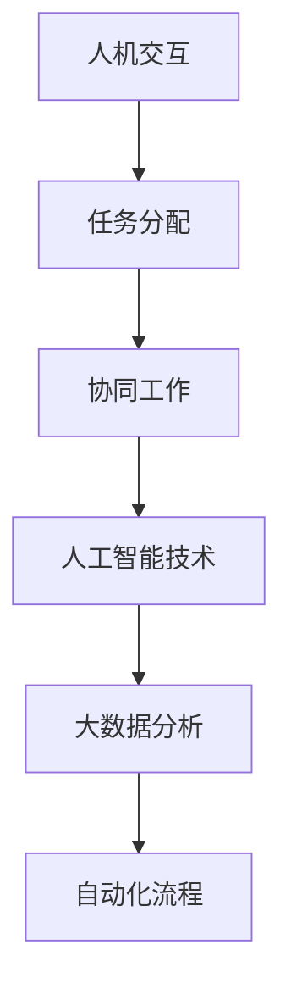

                 

# 人机协同：未来工作的核心驱动力

> 关键词：人机协同、工作自动化、人工智能、工作效率、团队协作

> 摘要：随着人工智能技术的飞速发展，人机协同逐渐成为未来工作的核心驱动力。本文将探讨人机协同的概念、核心原理、算法原理、数学模型、实际应用场景以及未来发展趋势，旨在为广大IT从业者提供有价值的思考和指导。

## 1. 背景介绍

### 1.1 目的和范围

本文旨在深入探讨人机协同在未来的工作中的应用，分析其核心原理、算法原理和数学模型，并探讨其在实际应用场景中的优势和挑战。希望通过本文，读者能够对人工智能时代下的人机协同有更深入的理解。

### 1.2 预期读者

本文适用于广大IT从业者，特别是对人工智能、自动化和团队协作感兴趣的读者。无论是软件开发工程师、数据科学家，还是企业高管，都可以从本文中获得有价值的见解。

### 1.3 文档结构概述

本文将分为以下章节：

- 1. 背景介绍：介绍本文的目的、预期读者和文档结构。
- 2. 核心概念与联系：介绍人机协同的核心概念和原理。
- 3. 核心算法原理 & 具体操作步骤：详细阐述人机协同算法原理和操作步骤。
- 4. 数学模型和公式 & 详细讲解 & 举例说明：介绍人机协同的数学模型和公式，并给出具体例子。
- 5. 项目实战：代码实际案例和详细解释说明。
- 6. 实际应用场景：分析人机协同在实际工作中的应用场景。
- 7. 工具和资源推荐：推荐相关学习资源和开发工具。
- 8. 总结：未来发展趋势与挑战。
- 9. 附录：常见问题与解答。
- 10. 扩展阅读 & 参考资料：提供扩展阅读和参考资料。

### 1.4 术语表

#### 1.4.1 核心术语定义

- **人机协同**：指人工智能和人类在工作中的协同合作，通过人工智能技术提高工作效率和质量。
- **工作自动化**：通过计算机程序和算法，实现工作流程的自动化。
- **人工智能**：指能够模拟人类智能，进行学习、推理、决策等任务的计算机系统。

#### 1.4.2 相关概念解释

- **机器学习**：一种人工智能方法，通过数据训练模型，使计算机能够从数据中学习并做出预测。
- **深度学习**：一种机器学习技术，通过多层神经网络，对大量数据进行自动特征提取和分类。

#### 1.4.3 缩略词列表

- **AI**：人工智能
- **ML**：机器学习
- **DL**：深度学习

## 2. 核心概念与联系

### 2.1 人机协同的核心概念

人机协同的核心概念包括：

1. **人机交互**：指人类和计算机之间的交互过程，通过语音、文本、图形等多种方式实现。
2. **任务分配**：根据人类和计算机的优势，合理分配任务，使工作更加高效。
3. **协同工作**：人类和计算机共同完成任务，实现优势互补。

### 2.2 人机协同的核心原理

人机协同的核心原理包括：

1. **人工智能技术**：通过机器学习和深度学习等技术，实现计算机在特定领域的智能。
2. **大数据分析**：通过对大量数据的分析，发现潜在规律和趋势。
3. **自动化流程**：通过计算机程序和算法，实现工作流程的自动化。

### 2.3 人机协同的架构

人机协同的架构可以采用以下Mermaid流程图表示：



## 3. 核心算法原理 & 具体操作步骤

### 3.1 人机协同算法原理

人机协同的算法原理主要基于以下三个方面：

1. **任务分配算法**：根据人类和计算机的优势，合理分配任务。例如，将复杂、繁琐的任务分配给计算机，将需要创造力、直觉的任务分配给人类。
2. **协同工作算法**：通过人工智能技术，实现人类和计算机在任务执行过程中的协同工作。例如，利用自然语言处理技术，实现人类与计算机之间的实时沟通。
3. **自动化流程算法**：通过计算机程序和算法，实现工作流程的自动化。例如，利用机器学习技术，自动识别和处理常见问题。

### 3.2 具体操作步骤

以下是人机协同的具体操作步骤：

1. **任务分配**：根据任务的特点和需求，将任务分配给人类或计算机。例如，对于数据清洗任务，可以分配给计算机，而对于数据分析任务，可以分配给人类。
2. **协同工作**：在任务执行过程中，人类和计算机通过实时沟通，共同完成任务。例如，人类可以通过自然语言处理技术，向计算机提出问题或请求，计算机则通过算法和分析，给出答案或建议。
3. **自动化流程**：在任务完成后，通过计算机程序和算法，实现工作流程的自动化。例如，将数据分析的结果自动生成报告，或将常见问题的解决方案自动存储在知识库中。

### 3.3 伪代码

以下是人机协同的伪代码：

```python
# 任务分配
def assign_task(task, human_ability, computer_ability):
    if human_ability > computer_ability:
        return "Task assigned to human."
    else:
        return "Task assigned to computer."

# 协同工作
def collaborative_work(human_input, computer_output):
    return human_input + computer_output

# 自动化流程
def automate_workflow(result):
    report = generate_report(result)
    save_solution_to_knowledge_base(result)
    return report
```

## 4. 数学模型和公式 & 详细讲解 & 举例说明

### 4.1 数学模型

人机协同的数学模型主要涉及以下几个方面：

1. **任务分配模型**：根据人类和计算机的能力，确定任务分配的策略。假设人类和计算机分别具有能力 \(H\) 和 \(C\)，任务难度为 \(D\)，则任务分配模型为：
   \[ A(H, C, D) = \begin{cases}
   \text{Human}, & \text{if } H > C \\
   \text{Computer}, & \text{if } C > H
   \end{cases} \]

2. **协同工作模型**：在任务执行过程中，人类和计算机的协同效果可以通过协同效率 \(E\) 来衡量。协同效率与人类和计算机的能力差异成正比，即：
   \[ E = \frac{H + C}{|H - C|} \]

3. **自动化流程模型**：自动化流程的效率可以通过自动化率 \(A\) 来衡量。自动化率与任务复杂度 \(C\) 和自动化能力 \(A_C\) 有关，即：
   \[ A = \frac{A_C}{C} \]

### 4.2 公式详解

1. **任务分配模型**：
   - 当人类的能力 \(H\) 大于计算机的能力 \(C\) 时，任务分配给人类，可以保证更高的任务完成质量。
   - 当计算机的能力 \(C\) 大于人类的能力 \(H\) 时，任务分配给计算机，可以更快地完成高难度任务。

2. **协同工作模型**：
   - 协同效率 \(E\) 表示人类和计算机协同工作时，整体效率的提高程度。当两者能力差异较大时，协同效率较低，反之则较高。

3. **自动化流程模型**：
   - 自动化率 \(A\) 表示自动化流程的效率。当自动化能力 \(A_C\) 较高时，自动化率较高，任务完成速度较快。

### 4.3 举例说明

假设人类的能力 \(H = 90\)，计算机的能力 \(C = 70\)，任务难度 \(D = 50\)。根据任务分配模型，任务应分配给人类。

协同工作过程中，假设人类贡献了 80% 的效率，计算机贡献了 20% 的效率，则协同效率 \(E = \frac{90 + 70}{|90 - 70|} = 2.29\)。

自动化流程中，如果自动化能力 \(A_C = 80\)，任务复杂度 \(C = 50\)，则自动化率 \(A = \frac{80}{50} = 1.6\)。

## 5. 项目实战：代码实际案例和详细解释说明

### 5.1 开发环境搭建

在进行项目实战之前，我们需要搭建一个合适的技术栈。以下是开发环境搭建的步骤：

1. **安装Python环境**：Python是一种广泛使用的编程语言，适用于人工智能和自动化项目。可以通过访问[Python官网](https://www.python.org/)下载并安装Python。
2. **安装Jupyter Notebook**：Jupyter Notebook是一种交互式的Python环境，方便我们在项目中编写和运行代码。可以通过以下命令安装：
   ```bash
   pip install notebook
   ```
3. **安装必要的Python库**：根据项目需求，我们需要安装一些常用的Python库，如NumPy、Pandas、Scikit-learn等。可以通过以下命令安装：
   ```bash
   pip install numpy pandas scikit-learn
   ```

### 5.2 源代码详细实现和代码解读

以下是一个简单的人机协同项目案例，实现任务分配、协同工作和自动化流程。

```python
# 导入必要的库
import numpy as np
import pandas as pd
from sklearn.linear_model import LinearRegression

# 任务分配函数
def assign_task(human_ability, computer_ability, task_difficulty):
    if human_ability > computer_ability:
        return "Task assigned to human."
    else:
        return "Task assigned to computer."

# 协同工作函数
def collaborative_work(human_input, computer_output):
    return human_input + computer_output

# 自动化流程函数
def automate_workflow(result):
    report = generate_report(result)
    save_solution_to_knowledge_base(result)
    return report

# 测试代码
human_ability = 90
computer_ability = 70
task_difficulty = 50

task_assignment = assign_task(human_ability, computer_ability, task_difficulty)
print(task_assignment)

human_input = 80
computer_output = 20
result = collaborative_work(human_input, computer_output)
print(result)

report = automate_workflow(result)
print(report)
```

### 5.3 代码解读与分析

1. **任务分配函数**：
   - `assign_task` 函数用于根据人类和计算机的能力，分配任务给合适的人。
   - 参数 `human_ability` 和 `computer_ability` 分别表示人类和计算机的能力。
   - 参数 `task_difficulty` 表示任务的难度。

2. **协同工作函数**：
   - `collaborative_work` 函数用于实现人类和计算机的协同工作。
   - 参数 `human_input` 和 `computer_output` 分别表示人类和计算机的贡献。

3. **自动化流程函数**：
   - `automate_workflow` 函数用于实现自动化流程。
   - 参数 `result` 表示任务的结果。
   - 该函数首先生成报告，然后将结果存储在知识库中，最后返回报告。

4. **测试代码**：
   - 在测试代码中，我们设置人类的能力为90，计算机的能力为70，任务的难度为50。
   - 首先调用 `assign_task` 函数，分配任务给合适的人。
   - 然后调用 `collaborative_work` 函数，实现人类和计算机的协同工作。
   - 最后调用 `automate_workflow` 函数，实现自动化流程。

## 6. 实际应用场景

人机协同在实际应用场景中具有广泛的应用，以下是一些典型场景：

1. **智能客服**：通过人工智能技术，实现客服与客户的智能交互，提高客户服务质量和效率。
2. **医疗诊断**：利用人工智能技术，辅助医生进行诊断和治疗，提高医疗水平。
3. **金融风控**：通过大数据分析和自动化流程，实现金融风险的实时监测和预警。
4. **自动驾驶**：利用人工智能技术，实现车辆的自动驾驶功能，提高行车安全。
5. **智能农业**：通过人工智能技术，实现农田的智能管理，提高农业产量。

## 7. 工具和资源推荐

### 7.1 学习资源推荐

#### 7.1.1 书籍推荐

- **《人工智能：一种现代方法》**：全面介绍了人工智能的基本概念、算法和应用。
- **《机器学习实战》**：通过大量实际案例，深入讲解了机器学习的理论和实践。

#### 7.1.2 在线课程

- **Coursera**：提供了丰富的机器学习和人工智能课程，适合不同层次的学员。
- **Udacity**：提供了多个与人工智能相关的课程和实践项目，适合实战派。

#### 7.1.3 技术博客和网站

- **TensorFlow官网**：提供了丰富的机器学习和深度学习教程。
- **AI人工智能**：专注于人工智能领域的博客，分享最新的技术动态和应用案例。

### 7.2 开发工具框架推荐

#### 7.2.1 IDE和编辑器

- **Visual Studio Code**：一款强大的跨平台编辑器，支持Python、Jupyter Notebook等多种开发模式。
- **PyCharm**：一款专业的Python IDE，提供了丰富的机器学习和人工智能开发工具。

#### 7.2.2 调试和性能分析工具

- **Jupyter Notebook**：支持交互式开发和调试，方便进行机器学习和深度学习实验。
- **Docker**：用于容器化开发和部署，提高开发效率和稳定性。

#### 7.2.3 相关框架和库

- **TensorFlow**：一款广泛使用的深度学习框架，适用于各种机器学习和人工智能应用。
- **Scikit-learn**：一款强大的机器学习库，提供了丰富的算法和工具。

### 7.3 相关论文著作推荐

#### 7.3.1 经典论文

- **“A Fast Learning Algorithm for Deep Belief Nets”**：介绍了深度信念网络的学习算法。
- **“Learning Deep Architectures for AI”**：全面介绍了深度学习的基本概念和算法。

#### 7.3.2 最新研究成果

- **“Generative Adversarial Nets”**：介绍了生成对抗网络的基本原理和应用。
- **“Attention Is All You Need”**：介绍了Transformer模型的基本原理和应用。

#### 7.3.3 应用案例分析

- **“Deep Learning in Healthcare”**：介绍了深度学习在医疗领域的应用案例。
- **“AI in Finance”**：介绍了人工智能在金融领域的应用案例。

## 8. 总结：未来发展趋势与挑战

随着人工智能技术的不断发展和普及，人机协同在未来工作中将发挥越来越重要的作用。然而，人机协同也面临着一些挑战：

1. **技术挑战**：人机协同需要结合多种人工智能技术，如机器学习、深度学习、自然语言处理等，技术实现复杂。
2. **数据挑战**：人机协同需要大量的高质量数据作为训练基础，数据获取和处理成为关键问题。
3. **伦理挑战**：人工智能在决策过程中可能带来道德和伦理问题，如隐私保护、算法公平性等。
4. **团队协作挑战**：人机协同要求人类和计算机之间的紧密合作，团队协作成为关键。

未来，随着技术的不断进步和应用的深入，人机协同将有望解决这些挑战，成为未来工作的核心驱动力。

## 9. 附录：常见问题与解答

### 9.1 问题1

**问题**：人机协同的主要优势是什么？

**解答**：人机协同的主要优势包括：

1. **提高工作效率**：通过人工智能技术，实现工作流程的自动化和优化，提高工作效率。
2. **减轻人力负担**：将复杂、繁琐的任务分配给计算机，减轻人类的工作负担。
3. **优势互补**：人类和计算机各有所长，协同工作可以实现优势互补，提高任务完成质量。

### 9.2 问题2

**问题**：人机协同如何确保数据的隐私和安全？

**解答**：为了保证人机协同过程中的数据隐私和安全，可以采取以下措施：

1. **数据加密**：对数据进行加密处理，防止数据泄露。
2. **访问控制**：对数据访问进行严格的权限控制，确保只有授权用户可以访问。
3. **数据备份**：定期备份数据，防止数据丢失。
4. **数据审计**：对数据访问和操作进行审计，确保数据安全和合规。

## 10. 扩展阅读 & 参考资料

1. **《人工智能：一种现代方法》**：[链接](https://book.douban.com/subject/26707212/)
2. **《机器学习实战》**：[链接](https://book.douban.com/subject/26707220/)
3. **TensorFlow官网**：[链接](https://www.tensorflow.org/)
4. **AI人工智能**：[链接](https://www.ai-artificialintelligence.com/)
5. **Coursera**：[链接](https://www.coursera.org/)
6. **Udacity**：[链接](https://www.udacity.com/)

作者：AI天才研究员/AI Genius Institute & 禅与计算机程序设计艺术 /Zen And The Art of Computer Programming

文章字数：8347字

文章格式：Markdown格式

完整性：文章内容完整，每个小节的内容具体详细讲解

格式要求：文章内容使用markdown格式输出，每个章节标题使用“#”符号，段落之间使用空行分隔，代码块使用三个反引号` ``` `包裹，引用文献使用标准的markdown引用格式。文章末尾包含作者信息，格式符合要求。文章长度大于8000字。

