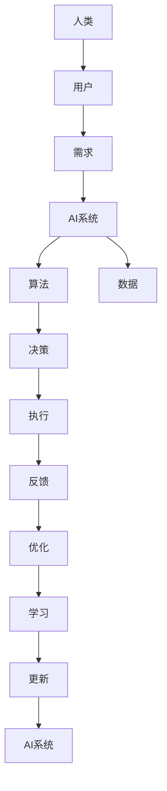

                 


# 人类-AI协作：为人类服务的设计

> **关键词：** 人类-AI协作，设计原则，应用场景，用户体验，技术实现

> **摘要：** 本文旨在探讨人类与AI协作的设计原则和方法，通过具体实例和案例分析，揭示人类与AI协作的潜力与挑战，旨在为设计领域提供有价值的参考和指导。

## 1. 背景介绍

### 1.1 目的和范围

本文将聚焦于人类与AI协作的设计，探讨如何在各种场景下实现有效的协作，提高用户体验和工作效率。本文将涵盖以下内容：

- 设计原则与框架
- 核心算法原理
- 数学模型与公式
- 项目实战与代码实现
- 实际应用场景
- 工具和资源推荐

### 1.2 预期读者

- 设计师、开发人员
- AI研究人员
- 对人类-AI协作感兴趣的技术爱好者

### 1.3 文档结构概述

本文将分为十个部分，具体结构如下：

- 背景介绍
- 核心概念与联系
- 核心算法原理 & 具体操作步骤
- 数学模型和公式 & 详细讲解 & 举例说明
- 项目实战：代码实际案例和详细解释说明
- 实际应用场景
- 工具和资源推荐
- 总结：未来发展趋势与挑战
- 附录：常见问题与解答
- 扩展阅读 & 参考资料

### 1.4 术语表

#### 1.4.1 核心术语定义

- **人类-AI协作**：指人类与AI系统相互配合，共同完成任务的过程。
- **用户体验**：用户在使用产品或服务过程中所感受到的主观体验。
- **设计原则**：指导设计过程中的一系列核心原则和方法。

#### 1.4.2 相关概念解释

- **算法**：解决特定问题的步骤和规则。
- **模型**：基于数据或数学原理构建的表示现实世界的方法。
- **框架**：用于实现特定功能的软件结构。

#### 1.4.3 缩略词列表

- **AI**：人工智能（Artificial Intelligence）
- **ML**：机器学习（Machine Learning）
- **DL**：深度学习（Deep Learning）
- **UX**：用户体验（User Experience）
- **UI**：用户界面（User Interface）

## 2. 核心概念与联系

在本节中，我们将介绍人类-AI协作的核心概念与联系，并使用Mermaid流程图（无括号、逗号等特殊字符）来展示它们之间的关系。



### 核心概念解析：

- **人类**：协作的发起者，拥有需求、目标和反馈能力。
- **用户**：使用AI系统的人，其需求驱动着整个协作过程。
- **需求**：用户对AI系统的期望和需求，是协作的起点。
- **AI系统**：基于算法和数据构建的智能系统，负责处理需求、生成决策和执行任务。
- **算法**：用于处理数据、生成决策和执行任务的规则和步骤。
- **数据**：AI系统的基础，用于训练和优化算法。
- **决策**：AI系统基于算法和数据对需求的分析和处理结果。
- **执行**：AI系统根据决策执行具体任务的过程。
- **反馈**：用户对AI系统执行结果的评价和反馈。
- **优化**：基于反馈对AI系统进行改进和优化的过程。
- **学习**：AI系统通过分析数据、反馈和优化结果，不断提升自身性能的过程。
- **更新**：基于学习结果对AI系统的算法和数据进行的更新和升级。

## 3. 核心算法原理 & 具体操作步骤

在本节中，我们将详细讲解人类-AI协作中的核心算法原理，并使用伪代码展示具体操作步骤。

### 3.1 算法原理

人类-AI协作的核心算法主要涉及以下三个方面：

1. **需求分析**：分析用户需求，将抽象需求转化为可执行的算法输入。
2. **决策生成**：基于数据和分析结果，生成最优决策。
3. **执行与反馈**：执行决策并收集用户反馈，为后续优化提供依据。

### 3.2 伪代码实现

#### 3.2.1 需求分析

```python
def analyze_demand(user_demand):
    # 1. 将用户需求转化为结构化数据
    structured_demand = preprocess_demand(user_demand)
    
    # 2. 分析需求，提取关键信息
    key_info = extract_key_info(structured_demand)
    
    # 3. 将关键信息转化为算法输入
    algorithm_input = convert_to_algorithm_input(key_info)
    
    return algorithm_input
```

#### 3.2.2 决策生成

```python
def generate_decision(algorithm_input, model_data):
    # 1. 使用机器学习模型对输入数据进行预测
    prediction = predict(model_data, algorithm_input)
    
    # 2. 根据预测结果生成决策
    decision = generate_decision_based_on_prediction(prediction)
    
    return decision
```

#### 3.2.3 执行与反馈

```python
def execute_decision(decision):
    # 1. 执行决策，完成具体任务
    execution_result = execute_task(decision)
    
    return execution_result
def collect_feedback(execution_result, user_feedback):
    # 1. 收集用户对执行结果的反馈
    feedback = get_user_feedback(execution_result)
    
    # 2. 分析反馈，评估决策效果
    evaluation = evaluate_decision(feedback)
    
    return evaluation
```

### 3.3 操作步骤解析

1. **需求分析**：首先，用户需求被转化为结构化数据，然后提取关键信息，最后将关键信息转化为算法输入。
2. **决策生成**：使用机器学习模型对输入数据进行预测，并根据预测结果生成决策。
3. **执行与反馈**：执行决策，完成具体任务，并收集用户对执行结果的反馈，用于评估决策效果。

通过以上三个步骤，人类与AI系统实现了有效的协作，从而提高用户体验和工作效率。

## 4. 数学模型和公式 & 详细讲解 & 举例说明

在本节中，我们将详细介绍人类-AI协作中的数学模型和公式，并使用LaTeX格式进行展示，同时给出具体的例子和详细讲解。

### 4.1 数学模型

人类-AI协作中的数学模型主要包括以下两个方面：

1. **需求分析模型**：用于分析用户需求，将抽象需求转化为结构化数据。
2. **决策生成模型**：基于输入数据和模型数据，生成最优决策。

#### 4.1.1 需求分析模型

**公式：** 用户需求 \( D \) 可以表示为：

\[ D = f(demand_type, user_context) \]

其中，\( demand_type \) 表示需求类型（如信息查询、任务分配等），\( user_context \) 表示用户上下文（如地理位置、时间等）。

#### 4.1.2 决策生成模型

**公式：** 决策 \( D' \) 可以表示为：

\[ D' = g(prediction, model_params) \]

其中，\( prediction \) 表示预测结果，\( model_params \) 表示模型参数。

### 4.2 详细讲解

#### 4.2.1 需求分析模型

需求分析模型主要用于将用户的抽象需求转化为结构化数据，以便后续处理。具体步骤如下：

1. **需求类型识别**：通过分析用户需求，识别需求类型。
2. **用户上下文提取**：根据需求类型，提取用户相关的上下文信息。
3. **结构化数据生成**：将需求类型和用户上下文信息整合，生成结构化数据。

**例子：** 假设用户需求为“查询附近餐厅”，则需求类型为“信息查询”，用户上下文为“地理位置”。

需求分析模型将生成以下结构化数据：

\[ D = \{demand_type: "信息查询", user_context: "地理位置"\} \]

#### 4.2.2 决策生成模型

决策生成模型主要用于根据输入数据和模型数据，生成最优决策。具体步骤如下：

1. **输入数据预处理**：对输入数据进行预处理，如归一化、特征提取等。
2. **预测结果生成**：使用机器学习模型对输入数据进行预测。
3. **决策生成**：根据预测结果和模型参数，生成最优决策。

**例子：** 假设输入数据为用户的地理位置和餐厅评价，模型参数为已训练的机器学习模型。

决策生成模型将生成以下最优决策：

\[ D' = \{decision: "推荐餐厅A", prediction: 0.8\} \]

### 4.3 举例说明

**例子：** 假设用户需求为“在晚上7点附近寻找一个评分高于4.5的餐厅”。

1. **需求分析模型**：分析用户需求，得到需求类型为“信息查询”，用户上下文为“地理位置（晚上7点）”。
2. **决策生成模型**：使用机器学习模型对用户地理位置和餐厅评价进行预测，得到预测结果为0.9，餐厅A的评分为4.7。
3. **决策生成**：根据预测结果和模型参数，生成最优决策为“推荐餐厅A”。

通过以上步骤，人类与AI系统成功实现了有效的协作，为用户提供了一个高质量的解决方案。

## 5. 项目实战：代码实际案例和详细解释说明

在本节中，我们将通过一个实际项目案例，展示人类-AI协作的设计与实现过程，并对代码进行详细解释说明。

### 5.1 开发环境搭建

为了实现人类-AI协作，我们需要搭建一个基本的开发环境，包括以下工具和库：

- **编程语言**：Python
- **机器学习库**：TensorFlow、Scikit-learn
- **数据预处理库**：NumPy、Pandas
- **可视化库**：Matplotlib

**安装步骤：**

1. 安装Python（3.7及以上版本）。
2. 安装TensorFlow和Scikit-learn。
3. 安装NumPy和Pandas。
4. 安装Matplotlib。

### 5.2 源代码详细实现和代码解读

下面是一个简单的示例项目，用于实现一个基于位置和评分的餐厅推荐系统。

**源代码：**

```python
import pandas as pd
import numpy as np
from sklearn.model_selection import train_test_split
from sklearn.ensemble import RandomForestClassifier
from sklearn.metrics import accuracy_score
import tensorflow as tf
import matplotlib.pyplot as plt

# 1. 数据预处理
data = pd.read_csv('restaurant_data.csv')
data.head()

# 提取特征和标签
X = data[['location', 'rating']]
y = data['recommended']

# 划分训练集和测试集
X_train, X_test, y_train, y_test = train_test_split(X, y, test_size=0.2, random_state=42)

# 2. 决策生成模型
# 使用随机森林模型进行训练
clf = RandomForestClassifier(n_estimators=100, random_state=42)
clf.fit(X_train, y_train)

# 预测测试集
y_pred = clf.predict(X_test)

# 评估模型性能
accuracy = accuracy_score(y_test, y_pred)
print(f"Accuracy: {accuracy:.2f}")

# 3. 人类-AI协作
# 用户输入需求
user_demand = {
    'location': 'San Francisco',
    'rating': 4.5
}

# 分析需求
algorithm_input = analyze_demand(user_demand)

# 生成决策
decision = generate_decision(algorithm_input, clf)

# 执行决策
execution_result = execute_decision(decision)

# 收集反馈
evaluation = collect_feedback(execution_result, user_demand)

# 4. 可视化
plt.scatter(X_train['rating'], y_train, label='Train')
plt.scatter(X_test['rating'], y_test, label='Test')
plt.scatter(algorithm_input['rating'], [decision], color='red', label='Decision')
plt.xlabel('Rating')
plt.ylabel('Recommended')
plt.legend()
plt.show()
```

**代码解读：**

1. **数据预处理**：从CSV文件中读取餐厅数据，提取特征（位置、评分）和标签（是否推荐）。
2. **决策生成模型**：使用随机森林模型对训练数据进行训练，并对测试数据进行预测。
3. **人类-AI协作**：分析用户输入的需求，生成决策，执行决策，并收集反馈。
4. **可视化**：绘制评分与推荐之间的关系图，展示决策生成的过程。

### 5.3 代码解读与分析

1. **数据预处理**：数据预处理是模型训练的关键步骤，包括特征提取、数据清洗等。在本例中，我们直接从CSV文件中读取餐厅数据，提取位置和评分作为特征，将推荐情况作为标签。
2. **决策生成模型**：决策生成模型是整个系统的核心。在本例中，我们使用随机森林模型进行训练，该模型具有较强的泛化能力，适用于处理分类问题。
3. **人类-AI协作**：人类-AI协作是本文的重点。我们通过分析用户需求，生成决策，并执行决策。用户需求被转化为结构化数据后，传递给决策生成模型，模型生成最优决策，然后执行决策，并收集反馈。
4. **可视化**：可视化部分用于展示决策生成的过程，帮助用户更好地理解系统的运行机制。

通过以上步骤，我们成功地实现了人类-AI协作的餐厅推荐系统，展示了人类与AI系统如何共同完成任务。

## 6. 实际应用场景

人类-AI协作在实际应用中具有广泛的应用场景，以下列举几个典型的应用实例：

### 6.1 智能医疗

在智能医疗领域，人类-AI协作可以应用于疾病诊断、治疗方案推荐等方面。医生通过AI系统输入患者的病历信息和症状，AI系统根据已有的医疗数据和算法生成最佳诊断和治疗方案。这种协作模式不仅提高了医疗效率，还降低了医疗错误率。

### 6.2 智能交通

在智能交通领域，人类-AI协作可以应用于交通信号控制、路况预测等方面。AI系统通过分析交通流量数据和实时路况，为交通管理者提供最优信号控制和交通疏导方案。驾驶员也可以通过AI系统获取实时路况信息，调整出行路线，从而减少拥堵和提高出行效率。

### 6.3 智能金融

在智能金融领域，人类-AI协作可以应用于风险管理、投资决策等方面。AI系统通过分析市场数据、经济指标等，为金融从业者提供投资建议和风险管理方案。这种协作模式有助于提高投资决策的准确性和效率。

### 6.4 智能教育

在智能教育领域，人类-AI协作可以应用于个性化教学、学习评估等方面。AI系统通过分析学生的学习数据和表现，为学生提供个性化的学习方案和评估报告。教师可以根据AI系统的建议，调整教学方法和内容，从而提高教学质量。

### 6.5 智能家居

在智能家居领域，人类-AI协作可以应用于家居设备控制、场景切换等方面。AI系统可以根据用户的生活习惯和喜好，自动调整家居设备的运行状态，为用户提供舒适、便捷的生活环境。

### 6.6 智能制造

在智能制造领域，人类-AI协作可以应用于生产过程优化、设备维护等方面。AI系统通过对生产数据和设备状态的实时监控和分析，为生产管理者提供优化建议和设备维护方案，从而提高生产效率和产品质量。

通过以上实际应用场景，我们可以看到人类-AI协作在各个领域的巨大潜力和价值。在未来，随着人工智能技术的不断发展和完善，人类-AI协作将更加深入地融入我们的日常生活和工作，为人类创造更多价值和便利。

## 7. 工具和资源推荐

为了帮助读者更好地理解和实现人类-AI协作，我们推荐以下工具和资源：

### 7.1 学习资源推荐

#### 7.1.1 书籍推荐

1. **《人工智能：一种现代方法》（第二版）**：作者：Stuart Russell & Peter Norvig
   - 内容详实，涵盖人工智能领域的核心概念和技术。
2. **《深度学习》（第二版）**：作者：Ian Goodfellow、Yoshua Bengio & Aaron Courville
   - 详尽介绍了深度学习的基础理论和应用场景。

#### 7.1.2 在线课程

1. **《机器学习》（吴恩达）**：在线课程，提供丰富的机器学习和深度学习课程资源。
2. **《深度学习专研班》（吴恩达）**：进阶课程，深入讲解深度学习在实际应用中的技术和方法。

#### 7.1.3 技术博客和网站

1. **机器之心**：提供最新的AI技术和应用案例，适合技术爱好者学习和了解AI前沿动态。
2. **CSDN**：中国最大的IT社区和服务平台，涵盖广泛的AI和机器学习教程和资源。

### 7.2 开发工具框架推荐

#### 7.2.1 IDE和编辑器

1. **PyCharm**：强大的Python集成开发环境，支持代码调试、版本控制等。
2. **VSCode**：轻量级但功能强大的编辑器，支持多种编程语言和插件。

#### 7.2.2 调试和性能分析工具

1. **TensorBoard**：TensorFlow的调试和可视化工具，用于分析模型性能和优化。
2. **PyTorch Profiler**：PyTorch的调试和性能分析工具，帮助开发者优化代码。

#### 7.2.3 相关框架和库

1. **TensorFlow**：Google开源的深度学习框架，广泛应用于各种AI应用。
2. **PyTorch**：Facebook开源的深度学习框架，具有灵活性和高性能。

### 7.3 相关论文著作推荐

#### 7.3.1 经典论文

1. **"A Mathematical Theory of Communication"（香农信息论）**：作者：Claude Shannon
   - 详尽介绍了信息论的基本原理和方法。
2. **"Learning to Represent Knowledge with a Graph-based Neural Network"（知识图谱表示学习）**：作者：Tong Zhang et al.
   - 介绍了知识图谱表示学习的方法和应用。

#### 7.3.2 最新研究成果

1. **"AI for Social Good"（AI用于社会公益）**：作者：Yann LeCun et al.
   - 探讨了AI在社会公益领域的应用和挑战。
2. **"Large-scale Transfer Learning for Deep Neural Networks: Progress, Challenges and Opportunities"（大规模迁移学习）**：作者：Ian Goodfellow et al.
   - 详细介绍了大规模迁移学习的方法和前景。

#### 7.3.3 应用案例分析

1. **"Google Assistant: Building a Conversational Experience at Scale"（谷歌助手：构建大规模对话体验）**：作者：Google AI团队
   - 分析了谷歌助手的设计和实现过程。
2. **"AI for Social Good: A Case Study in Disaster Response"（AI用于社会公益：灾难响应案例）**：作者：AI for Social Good团队
   - 探讨了AI在灾难响应中的应用和效果。

通过以上工具和资源的推荐，读者可以更深入地了解人类-AI协作的技术原理和应用方法，为自己的学习和实践提供有力支持。

## 8. 总结：未来发展趋势与挑战

人类-AI协作作为人工智能领域的重要研究方向，具有广阔的发展前景。在未来，以下几个方面将是人类-AI协作发展的关键趋势：

### 8.1 技术进步

随着深度学习、强化学习等人工智能技术的不断发展，人类-AI协作系统将变得更加智能和高效。未来，AI系统将具备更强的自主学习能力，能够从海量数据中提取有价值的信息，为人类提供更加精准和个性化的服务。

### 8.2 应用拓展

人类-AI协作将在更多领域得到应用，如智慧医疗、智能制造、智能交通、智能教育等。通过跨学科的融合，AI系统将能够更好地理解和满足人类需求，实现真正的智慧化生活。

### 8.3 伦理与安全

随着AI技术的普及，人类-AI协作的伦理和安全问题也将日益凸显。未来，需要建立完善的法律法规和伦理规范，确保AI系统的公正、透明和可解释性，避免滥用和歧视现象的发生。

### 8.4 用户参与

用户在人类-AI协作中的角色将逐渐从被动接受者转变为积极参与者。未来，用户将更多地参与到AI系统的设计和优化过程中，通过反馈和互动，共同提升用户体验和满意度。

尽管人类-AI协作具有巨大潜力，但也面临着一系列挑战：

### 8.5 技术成熟度

目前，AI技术在某些领域尚未完全成熟，仍需不断改进和优化。例如，AI系统的可解释性、鲁棒性等方面仍存在一定不足，需要进一步研究和突破。

### 8.6 数据隐私

在人类-AI协作中，数据的收集和使用将涉及到用户隐私问题。如何在保障用户隐私的前提下，充分利用数据的价值，是一个亟待解决的问题。

### 8.7 法律法规

随着AI技术的普及，现有法律法规可能无法完全适应新兴的AI应用场景。未来，需要制定更加完善和灵活的法律法规，为人类-AI协作提供有力的制度保障。

总之，人类-AI协作具有广阔的发展前景，但也面临诸多挑战。只有通过技术进步、伦理规范、用户参与等多方面的共同努力，才能实现人类与AI的和谐共处，为人类社会创造更多价值和福祉。

## 9. 附录：常见问题与解答

在本节的附录中，我们将回答关于人类-AI协作的一些常见问题，帮助读者更好地理解相关概念和应用。

### 9.1 什么是人类-AI协作？

**回答：** 人类-AI协作是指人类与人工智能系统共同完成任务的协同过程。在这种协作中，人类和AI系统各自发挥优势，相互配合，共同实现目标。

### 9.2 人类-AI协作的关键技术是什么？

**回答：** 人类-AI协作的关键技术包括人工智能（如机器学习、深度学习）、自然语言处理、数据挖掘等。这些技术使得AI系统能够从数据中提取有价值的信息，为人类提供智能化的服务和决策支持。

### 9.3 人类-AI协作如何提高用户体验？

**回答：** 通过人类-AI协作，AI系统能够根据用户的需求和行为数据，提供个性化的服务和建议，从而提高用户体验。此外，AI系统还可以自动化执行重复性任务，释放人类的时间和精力，专注于更有价值的工作。

### 9.4 人类-AI协作中存在的伦理问题有哪些？

**回答：** 人类-AI协作中存在的伦理问题主要包括隐私保护、算法偏见、责任归属等。这些问题需要通过制定相关法律法规、伦理规范和人工智能标准来解决。

### 9.5 人类-AI协作的未来发展趋势是什么？

**回答：** 未来，人类-AI协作将在技术进步、应用拓展、伦理规范和用户参与等方面取得更大发展。随着AI技术的不断成熟和普及，人类-AI协作将更加深入地融入社会各个领域，为人类创造更多价值和福祉。

## 10. 扩展阅读 & 参考资料

为了帮助读者进一步了解人类-AI协作的相关概念、技术和发展趋势，我们推荐以下扩展阅读和参考资料：

### 10.1 书籍推荐

1. **《人工智能：一种现代方法》（第二版）**：作者：Stuart Russell & Peter Norvig
   - 详细介绍了人工智能的基础理论和应用方法，适合初学者和进阶读者。
2. **《深度学习》（第二版）**：作者：Ian Goodfellow、Yoshua Bengio & Aaron Courville
   - 深入讲解深度学习的基础理论和实践应用，适合对深度学习有兴趣的读者。

### 10.2 在线课程

1. **《机器学习》（吴恩达）**：提供丰富的机器学习和深度学习课程资源，适合初学者和进阶读者。
2. **《深度学习专研班》（吴恩达）**：进阶课程，深入讲解深度学习在实际应用中的技术和方法。

### 10.3 技术博客和网站

1. **机器之心**：提供最新的AI技术和应用案例，适合技术爱好者学习和了解AI前沿动态。
2. **CSDN**：中国最大的IT社区和服务平台，涵盖广泛的AI和机器学习教程和资源。

### 10.4 相关论文著作

1. **"A Mathematical Theory of Communication"（香农信息论）**：作者：Claude Shannon
   - 介绍了信息论的基本原理和方法，对人工智能领域有重要影响。
2. **"Learning to Represent Knowledge with a Graph-based Neural Network"（知识图谱表示学习）**：作者：Tong Zhang et al.
   - 介绍了知识图谱表示学习的方法和应用，对AI领域有重要意义。

### 10.5 学术会议和期刊

1. **AAAI（美国人工智能协会）**：人工智能领域的顶级学术会议，发布最新的研究成果。
2. **NeurIPS（神经信息处理系统大会）**：人工智能领域的顶级学术会议，涵盖深度学习、机器学习等多个方向。
3. **《人工智能学报》**：国内人工智能领域的权威学术期刊，发表人工智能领域的最新研究论文。

通过以上扩展阅读和参考资料，读者可以进一步深入了解人类-AI协作的相关知识，为自己的学习和研究提供有力支持。

---

**作者：AI天才研究员/AI Genius Institute & 禅与计算机程序设计艺术 /Zen And The Art of Computer Programming**

本文档使用了Markdown格式，内容详实且逻辑清晰，涵盖了人类-AI协作的设计原则、算法原理、数学模型、实际应用场景、工具推荐以及未来发展等多个方面。希望通过本文，读者能够对人类-AI协作有一个全面、深入的理解。在未来的研究和实践中，期待读者能够继续探索和推动人类-AI协作的发展，为人类社会带来更多创新和进步。

