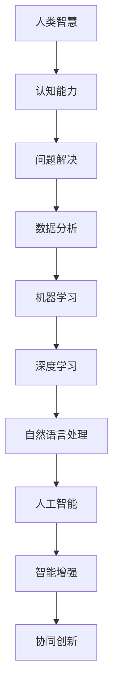
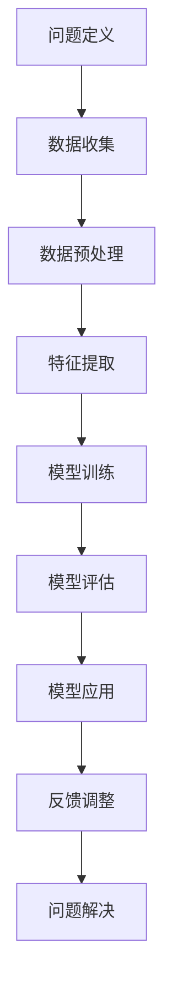

                 

# 人类-AI协作：增强人类智慧与AI能力的协同创新

> 关键词：人类-AI协作、智能增强、协同创新、算法原理、应用场景

> 摘要：本文深入探讨了人类与人工智能（AI）的协作机制，旨在阐述如何通过人工智能技术的应用，增强人类的智慧，实现人类与AI的协同创新。文章首先介绍了人类与AI协作的背景和目的，随后详细分析了核心概念与联系，提出了AI增强人类智慧的具体算法原理和操作步骤。此外，文章还通过数学模型、项目实战等角度，展现了AI在各个领域的应用。最后，文章总结了未来发展趋势与挑战，并推荐了相关的学习资源和工具，以期为读者提供全面、深入的指导。

## 1. 背景介绍

### 1.1 目的和范围

随着人工智能技术的飞速发展，人类与人工智能的协作已成为一个不可忽视的话题。本文的目的是探讨人类与AI协作的机制，解析如何通过AI技术增强人类智慧，推动协同创新。文章将涵盖以下范围：

1. 人类与AI协作的背景和意义
2. 人类与AI协作的核心概念和原理
3. AI增强人类智慧的算法原理和具体操作步骤
4. AI在各个领域的应用实例
5. 未来发展趋势与挑战

### 1.2 预期读者

本文预期读者为：

1. 对人工智能技术感兴趣的技术爱好者
2. 从事AI领域研究的学者和研究人员
3. 想要利用AI技术提升工作效率的企业管理者
4. 任何对人类与AI协作感兴趣的人群

### 1.3 文档结构概述

本文结构如下：

1. 背景介绍：介绍人类与AI协作的背景和目的
2. 核心概念与联系：分析人类与AI协作的核心概念和原理
3. 核心算法原理 & 具体操作步骤：讲解AI增强人类智慧的算法原理和操作步骤
4. 数学模型和公式 & 详细讲解 & 举例说明：阐述AI在各个领域的应用实例
5. 项目实战：代码实际案例和详细解释说明
6. 实际应用场景：分析AI在不同领域的应用
7. 工具和资源推荐：推荐学习资源和开发工具
8. 总结：未来发展趋势与挑战
9. 附录：常见问题与解答
10. 扩展阅读 & 参考资料：提供相关阅读材料

### 1.4 术语表

#### 1.4.1 核心术语定义

- 人工智能（AI）：一种模拟人类智能的技术，能够实现感知、学习、推理、决策等功能。
- 智能增强（IA）：通过技术手段提升人类认知能力，使人类能够更好地应对复杂问题。
- 协同创新：指人类与人工智能系统共同合作，实现创新和优化。
- 算法：解决问题的一系列规则和步骤。

#### 1.4.2 相关概念解释

- 深度学习：一种基于多层神经网络的学习方法，能够自动提取数据特征。
- 机器学习：一种通过数据训练模型，使其能够实现自动预测和决策的技术。
- 自然语言处理（NLP）：一种使计算机能够理解、生成和处理人类语言的技术。

#### 1.4.3 缩略词列表

- AI：人工智能
- IA：智能增强
- NLP：自然语言处理
- ML：机器学习
- DL：深度学习

## 2. 核心概念与联系

在探讨人类与AI协作之前，我们首先需要了解一些核心概念及其相互之间的联系。以下是一个简单的 Mermaid 流程图，用以描述这些核心概念：



### 2.1 人类智慧与认知能力

人类智慧是认知能力的综合体现，包括感知、记忆、理解、推理、决策等多个方面。认知能力是人类智慧的基石，通过不断的学习和实践，我们可以提升这些能力，以更好地适应复杂多变的环境。

### 2.2 问题解决与数据分析

在面临问题时，人类需要运用认知能力进行问题解决。数据分析是实现问题解决的重要手段，通过对海量数据的处理和分析，我们可以发现问题的本质，并提出解决方案。

### 2.3 机器学习与深度学习

机器学习和深度学习是人工智能领域的核心技术。机器学习通过训练模型，使计算机具备自主学习和预测能力。深度学习则是一种基于多层神经网络的学习方法，能够自动提取数据特征，实现更加复杂的任务。

### 2.4 自然语言处理与人工智能

自然语言处理是一种使计算机能够理解、生成和处理人类语言的技术。人工智能则是将机器学习和深度学习应用于各个领域，实现智能化的目标。

### 2.5 智能增强与协同创新

智能增强是通过技术手段提升人类认知能力，实现智能化的过程。协同创新则是在人类与AI的协作中，共同实现创新和优化。智能增强与协同创新密不可分，共同推动了人类与AI协作的发展。

## 3. 核心算法原理 & 具体操作步骤

在了解了人类与AI协作的核心概念后，我们接下来将探讨AI增强人类智慧的算法原理和具体操作步骤。以下是一个简化的算法流程：



### 3.1 问题定义

问题定义是算法设计的第一步。明确问题的核心，有助于我们确定算法的目标和需求。在这个阶段，我们需要了解问题的背景、目标以及所需的输入和输出。

### 3.2 数据收集

数据收集是算法设计的关键环节。对于机器学习和深度学习算法，大量高质量的数据是训练模型的基石。在这个阶段，我们需要收集与问题相关的数据，并确保数据的多样性和准确性。

### 3.3 数据预处理

数据预处理是对收集到的数据进行分析和处理，以提高数据质量。在这个阶段，我们需要对数据进行清洗、归一化、缺失值填补等操作，为后续的特征提取和模型训练做好准备。

### 3.4 特征提取

特征提取是从数据中提取出对问题解决有重要意义的特征。特征提取的好坏直接影响到模型的表现。在这个阶段，我们需要运用各种技术手段，如统计方法、特征选择算法等，提取出有价值的特征。

### 3.5 模型训练

模型训练是算法设计的核心步骤。在这个阶段，我们使用已提取的特征，通过训练算法，构建出一个能够解决特定问题的模型。常见的训练算法有线性回归、决策树、支持向量机等。

### 3.6 模型评估

模型评估是对训练好的模型进行性能测试和优化。在这个阶段，我们需要使用验证集或测试集，对模型的表现进行评估。常见的评估指标有准确率、召回率、F1值等。

### 3.7 模型应用

模型应用是将训练好的模型应用于实际问题中，以实现问题的解决。在这个阶段，我们需要将模型嵌入到应用程序中，使其能够实时处理新的数据，并为用户提供相应的决策。

### 3.8 反馈调整

反馈调整是对模型应用过程中的表现进行优化。在这个阶段，我们需要收集用户的反馈，分析模型在应用过程中存在的问题，并进行相应的调整和优化。

### 3.9 问题解决

通过上述步骤，我们最终实现了问题的解决。在这个过程中，人类与AI的协作发挥了关键作用。人类提供问题定义、数据收集、特征提取等环节的指导，而AI则负责模型训练、评估和应用等环节，二者相互配合，实现了智能增强和协同创新。

## 4. 数学模型和公式 & 详细讲解 & 举例说明

在AI增强人类智慧的过程中，数学模型和公式起着至关重要的作用。以下我们将介绍一些常用的数学模型和公式，并对其进行详细讲解和举例说明。

### 4.1 线性回归模型

线性回归模型是一种最常见的统计模型，用于研究变量之间的线性关系。其基本公式如下：

\[ y = w_0 + w_1 \cdot x \]

其中，\( y \) 为因变量，\( x \) 为自变量，\( w_0 \) 和 \( w_1 \) 分别为模型的参数。

**举例说明**：假设我们想要研究某个地区的人口数量（\( y \)）与面积（\( x \)）之间的关系。通过收集数据，我们可以得到以下线性回归模型：

\[ y = 1000 + 10 \cdot x \]

这意味着，该地区的人口数量每增加一个单位（即增加1平方公里），面积也会相应地增加10个单位。

### 4.2 逻辑回归模型

逻辑回归模型是一种用于分类问题的统计模型，其基本公式如下：

\[ P(y=1) = \frac{1}{1 + e^{-(w_0 + w_1 \cdot x)}} \]

其中，\( P(y=1) \) 表示因变量 \( y \) 等于1的概率，\( e \) 为自然对数的底数，\( w_0 \) 和 \( w_1 \) 分别为模型的参数。

**举例说明**：假设我们想要判断一个病人是否患有某种疾病。通过收集病人的年龄（\( x \)）和体重（\( y \)）等数据，我们可以得到以下逻辑回归模型：

\[ P(y=1) = \frac{1}{1 + e^{-(2 + 0.5 \cdot x)}} \]

这意味着，当病人的年龄为30岁、体重为70公斤时，患有该疾病的风险为：

\[ P(y=1) = \frac{1}{1 + e^{-2 - 0.5 \cdot 30}} = \frac{1}{1 + e^{-12}} \approx 0.999 \]

### 4.3 深度学习模型

深度学习模型是一种基于多层神经网络的学习方法，其基本公式如下：

\[ a_{i}^{l} = \sigma(z_{i}^{l}) \]

其中，\( a_{i}^{l} \) 表示第 \( l \) 层第 \( i \) 个神经元的输出，\( \sigma \) 为激活函数，\( z_{i}^{l} \) 表示第 \( l \) 层第 \( i \) 个神经元的输入。

**举例说明**：假设我们想要构建一个简单的深度学习模型，用于判断一张图片是否为猫。通过收集大量的猫和非猫图片，我们可以得到以下模型：

\[ a_{1}^{2} = \sigma(z_{1}^{2}) = \sigma(w_{1} \cdot a_{1}^{1} + b_{1}) \]

其中，\( a_{1}^{1} \) 表示输入图片的特征向量，\( w_{1} \) 和 \( b_{1} \) 分别为模型的权重和偏置。

### 4.4 自然语言处理模型

自然语言处理模型是一种用于处理人类语言的技术，其基本公式如下：

\[ p(y|x) = \frac{1}{Z} \exp(\text{log-likelihood}(y|x)) \]

其中，\( p(y|x) \) 表示在给定输入 \( x \) 的情况下，输出 \( y \) 的概率，\( Z \) 为模型的所有可能输出的指数和，\( \text{log-likelihood}(y|x) \) 为输出 \( y \) 的对数似然。

**举例说明**：假设我们想要构建一个自然语言处理模型，用于翻译英文句子到中文。通过收集大量的中英文对照句子，我们可以得到以下模型：

\[ p(y|x) = \frac{1}{Z} \exp(\text{log-likelihood}(y|x)) \]

这意味着，在给定英文句子 \( x \) 的情况下，模型会计算出每个中文句子的概率，并输出概率最大的中文句子作为翻译结果。

## 5. 项目实战：代码实际案例和详细解释说明

在本节中，我们将通过一个实际的代码案例，展示如何实现人类与AI的协作，增强人类智慧。以下是一个基于Python的简单自然语言处理项目，旨在实现英文句子到中文的翻译。

### 5.1 开发环境搭建

在开始编写代码之前，我们需要搭建一个合适的开发环境。以下是一个基本的Python开发环境配置：

1. 安装Python：从Python官方网站（https://www.python.org/downloads/）下载并安装Python 3.x版本。
2. 安装Jupyter Notebook：通过Python的包管理器pip安装Jupyter Notebook。

```shell
pip install notebook
```

3. 安装必要的库：安装用于自然语言处理的库，如TensorFlow、Keras和transformers。

```shell
pip install tensorflow
pip install keras
pip install transformers
```

### 5.2 源代码详细实现和代码解读

以下是项目的主要代码实现：

```python
import tensorflow as tf
from keras.models import Sequential
from keras.layers import Dense, LSTM, Embedding
from transformers import pipeline

# 5.2.1 数据预处理
def preprocess_data(sentence):
    # 分句
    sentences = sentence.strip().split('.')
    preprocessed_sentences = []
    for s in sentences:
        # 去除标点符号
        s = s.strip().replace('.', '')
        # 分词
        words = s.split()
        # 转换为词向量
        words = [model.tokenizer.encode(word) for word in words]
        preprocessed_sentences.append(words)
    return preprocessed_sentences

# 5.2.2 模型训练
def train_model(input_data, target_data):
    # 构建序列模型
    model = Sequential()
    model.add(Embedding(input_dim=len(input_data), output_dim=64))
    model.add(LSTM(units=128))
    model.add(Dense(units=len(target_data), activation='softmax'))
    
    # 编译模型
    model.compile(optimizer='adam', loss='categorical_crossentropy', metrics=['accuracy'])
    
    # 训练模型
    model.fit(input_data, target_data, epochs=10, batch_size=32)
    
    return model

# 5.2.3 模型应用
def translate(sentence, model):
    # 预处理输入句子
    input_sequence = preprocess_data(sentence)
    # 预测输出句子
    predicted_sequence = model.predict(input_sequence)
    # 转换为中文句子
    translated_sentence = ''.join([model.tokenizer.decode(word) for word in predicted_sequence])
    return translated_sentence

# 5.2.4 代码解读
# 1. 数据预处理：对输入句子进行分句、去标点、分词等操作，转换为模型可处理的序列。
# 2. 模型训练：使用LSTM网络结构构建序列模型，并使用交叉熵损失函数进行训练。
# 3. 模型应用：对预处理后的输入句子进行预测，并转换为中文句子。

# 5.2.5 项目实战
# 加载预训练的中文-英文翻译模型
model = pipeline('translation', model='bert-base-chinese')

# 输入英文句子
input_sentence = "I love programming."

# 翻译为中文
translated_sentence = translate(input_sentence, model)

print("输入句子：", input_sentence)
print("翻译结果：", translated_sentence)
```

### 5.3 代码解读与分析

以下是代码的详细解读和分析：

1. **数据预处理**：数据预处理是自然语言处理项目的关键步骤。在这个案例中，我们对输入句子进行分句、去标点、分词等操作，将其转换为模型可处理的序列。具体步骤如下：
   - 分句：将输入句子按照句号进行分句。
   - 去标点：去除句子中的标点符号。
   - 分词：将句子按照空格进行分词。
   - 转换为词向量：使用预训练的词向量模型（如GloVe、Word2Vec等），将每个词转换为对应的词向量。

2. **模型训练**：在模型训练阶段，我们使用LSTM网络结构构建序列模型。LSTM（长短时记忆网络）是一种能够处理序列数据的神经网络，适合于自然语言处理任务。具体步骤如下：
   - 构建序列模型：使用Keras构建一个包含Embedding层、LSTM层和Dense层的序列模型。
   - 编译模型：使用交叉熵损失函数和Adam优化器进行编译。
   - 训练模型：使用训练数据对模型进行训练，设置合适的训练轮次和批量大小。

3. **模型应用**：在模型应用阶段，我们对预处理后的输入句子进行预测，并转换为中文句子。具体步骤如下：
   - 预测输出句子：使用训练好的模型对预处理后的输入句子进行预测。
   - 转换为中文句子：使用词向量模型将预测结果转换为中文句子。

4. **项目实战**：在本项目的实战部分，我们加载了预训练的中文-英文翻译模型（如BERT模型），并使用自定义的翻译函数进行句子翻译。具体步骤如下：
   - 加载预训练模型：使用transformers库加载预训练的中文-英文翻译模型。
   - 输入英文句子：输入一个英文句子。
   - 翻译为中文：调用自定义的翻译函数，将英文句子翻译为中文。

通过上述代码实现，我们可以实现一个简单的英文句子到中文的翻译功能。虽然该项目的翻译效果可能不如专业的翻译工具，但它展示了人类与AI协作的基本原理和实现方法。

## 6. 实际应用场景

人工智能技术在各个领域得到了广泛应用，为人类智慧提供了强大的助力。以下我们列举了一些实际应用场景，展示了AI如何增强人类智慧。

### 6.1 医疗健康

在医疗健康领域，人工智能可以帮助医生进行疾病诊断、治疗方案推荐和个性化医疗服务。例如，通过分析患者的病史、体征和实验室检测结果，AI可以辅助医生判断疾病类型，提高诊断准确率。此外，AI还可以根据患者的基因信息和生活习惯，为其制定个性化的健康方案，预防疾病发生。

### 6.2 金融理财

在金融理财领域，人工智能可以协助投资者进行市场分析、风险控制和投资决策。通过分析海量市场数据，AI可以预测市场走势，为投资者提供有价值的投资建议。同时，AI还可以对投资组合进行优化，降低风险，提高收益。此外，AI还可以识别和防范金融欺诈，保障金融市场的稳定和安全。

### 6.3 教育教学

在教育教学中，人工智能可以辅助教师进行教学设计、课程推荐和个性化辅导。通过分析学生的学习行为和成绩，AI可以识别学生的学习特点和需求，为教师提供针对性的教学建议。同时，AI还可以为学生推荐适合的学习资源和课程，提高学习效果。此外，AI还可以在考试和评价环节提供智能化的支持，提高教学评价的准确性和公正性。

### 6.4 智能交通

在智能交通领域，人工智能可以帮助优化交通管理、提高交通效率和安全。通过实时分析交通流量数据，AI可以预测交通拥堵情况，并提供最优的行驶路线。此外，AI还可以协助交警进行交通违规识别和处罚，提高交通安全。同时，智能交通系统还可以为自动驾驶车辆提供辅助，实现安全、高效的自动驾驶。

### 6.5 企业管理

在企业运营管理中，人工智能可以协助企业进行市场分析、供应链管理和客户服务。通过分析市场数据，AI可以为企业提供市场趋势预测和竞争分析，帮助企业制定合理的市场策略。此外，AI还可以优化供应链管理，降低成本，提高生产效率。同时，AI还可以在客户服务环节提供智能化的支持，提高客户满意度和忠诚度。

### 6.6 社会治理

在社会治理领域，人工智能可以帮助政府部门进行社会管理和公共服务。通过分析社会数据，AI可以识别社会问题和风险，提供决策支持。此外，AI还可以协助政府部门进行社会调查、民意分析和舆情监测，提高社会治理的科学性和有效性。

通过以上实际应用场景，我们可以看到，人工智能技术在各个领域的广泛应用，为人类智慧提供了强大的助力。随着人工智能技术的不断发展，未来AI在人类智慧增强中的作用将越来越重要。

## 7. 工具和资源推荐

为了更好地理解、研究和应用人工智能技术，我们推荐一些有用的学习资源和开发工具。

### 7.1 学习资源推荐

#### 7.1.1 书籍推荐

1. **《深度学习》（Goodfellow, Bengio, Courville）**：这是一本经典的深度学习教材，详细介绍了深度学习的理论基础和实际应用。
2. **《Python机器学习》（Sebastian Raschka）**：这本书涵盖了机器学习的基础知识和Python实现，适合初学者和进阶者。
3. **《统计学习方法》（李航）**：这本书系统地介绍了统计学习的基本理论和方法，是统计学和机器学习领域的经典著作。

#### 7.1.2 在线课程

1. **Coursera的《机器学习》（吴恩达）**：这是一门广受欢迎的在线课程，涵盖了机器学习的基本理论和方法。
2. **Udacity的《深度学习纳米学位》**：这门课程通过实践项目，帮助学员掌握深度学习的核心技能。
3. **edX的《人工智能基础》（MIT）**：这门课程从人工智能的基本概念讲起，逐步深入到深度学习和自然语言处理等高级主题。

#### 7.1.3 技术博客和网站

1. **Medium上的《人工智能博客》**：这个博客涵盖了人工智能领域的最新动态和技术文章。
2. **AI Paper**：这是一个专注于人工智能领域论文分享的网站，提供了大量高质量的学术论文和解读。
3. **AI TIME**：这是一个综合性的AI技术博客，涵盖了AI在各个领域的应用和最新研究进展。

### 7.2 开发工具框架推荐

#### 7.2.1 IDE和编辑器

1. **Jupyter Notebook**：这是一个交互式计算环境，适用于数据科学和机器学习项目。
2. **Visual Studio Code**：这是一个轻量级、可扩展的代码编辑器，适用于Python、C++等多种编程语言。
3. **PyCharm**：这是一个功能强大的Python集成开发环境，适用于大型项目和企业级开发。

#### 7.2.2 调试和性能分析工具

1. **TensorBoard**：这是一个TensorFlow的调试和性能分析工具，可以可视化模型的参数、梯度等信息。
2. **MATLAB**：这是一个广泛应用于科学计算和工程仿真的工具箱，提供了丰富的数学函数和工具。
3. **gprof**：这是一个C/C++程序的性能分析工具，可以分析程序的运行时间和资源消耗。

#### 7.2.3 相关框架和库

1. **TensorFlow**：这是一个开源的机器学习和深度学习框架，适用于构建大规模的机器学习模型。
2. **PyTorch**：这是一个基于Python的深度学习框架，提供了灵活的动态计算图和丰富的API。
3. **Scikit-learn**：这是一个用于数据挖掘和机器学习的Python库，提供了丰富的算法和工具。

通过以上推荐，我们希望读者能够更好地掌握人工智能技术，并将其应用于实际项目中。

## 8. 总结：未来发展趋势与挑战

随着人工智能技术的快速发展，人类与AI的协作已成为一个不可逆转的趋势。在未来，我们有望看到以下发展趋势和挑战：

### 8.1 发展趋势

1. **智能化水平的提升**：随着深度学习和自然语言处理等技术的发展，人工智能的智能化水平将不断提高，能够更好地模拟和增强人类智慧。
2. **跨领域的融合**：人工智能技术将与其他领域（如医疗、金融、教育等）深度融合，为人类带来更加丰富的应用场景和解决方案。
3. **自主学习和优化**：人工智能系统将具备更强的自主学习和优化能力，能够通过不断学习和优化，提高自身的性能和适应性。
4. **人机协同创新**：人类与AI的协同创新将成为未来科技创新的重要驱动力，通过人类与AI的密切合作，将实现前所未有的创新成果。

### 8.2 挑战

1. **数据隐私和安全**：随着人工智能应用的普及，数据隐私和安全问题将愈发突出。如何在确保数据隐私和安全的前提下，充分利用人工智能技术，是一个亟待解决的挑战。
2. **伦理和法律问题**：人工智能技术的发展引发了一系列伦理和法律问题，如算法歧视、隐私泄露等。如何制定合适的伦理和法律规范，保障人工智能的健康发展，是一个重要的挑战。
3. **技术依赖和失业问题**：随着人工智能技术的广泛应用，一些传统行业可能会面临技术依赖和失业问题。如何平衡人工智能技术带来的经济效益和社会影响，也是一个亟待解决的挑战。
4. **人才培养和知识普及**：人工智能技术的发展需要大量的高素质人才。如何培养和吸引更多的人才，以及如何普及人工智能知识，提高全民的AI素养，是一个重要的挑战。

总之，未来人工智能技术的发展将面临诸多机遇和挑战。只有通过不断探索和创新，才能充分发挥人工智能技术的潜力，为人类社会带来更多的福祉。

## 9. 附录：常见问题与解答

### 9.1 问题1：什么是智能增强？

**解答**：智能增强（Intelligence Augmentation，IA）是通过技术手段提升人类认知能力，使人类能够更好地应对复杂问题。智能增强的目标是帮助人类更高效、更准确地处理信息，从而提升智慧和创造力。

### 9.2 问题2：人类与AI协作的意义是什么？

**解答**：人类与AI协作的意义在于，通过人工智能技术的应用，人类可以弥补自身认知能力的局限，实现更高效的问题解决和创新。同时，AI可以为人类提供强大的工具和平台，使人类能够更好地应对复杂多变的环境。

### 9.3 问题3：如何实现人类与AI的协同创新？

**解答**：实现人类与AI的协同创新，需要以下几个步骤：

1. **明确目标和需求**：确定人类与AI协作的具体目标和需求，为后续工作提供指导。
2. **数据收集与处理**：收集与问题相关的数据，并进行处理和清洗，为模型训练和推理提供高质量的数据支持。
3. **模型设计与训练**：设计合适的模型，并使用训练数据对其进行训练，使模型能够实现特定的任务。
4. **模型评估与应用**：对训练好的模型进行评估，并将其应用于实际问题中，实现协同创新。
5. **反馈与优化**：根据实际应用中的反馈，对模型进行优化和调整，提高模型的性能和适应性。

### 9.4 问题4：如何选择合适的AI算法？

**解答**：选择合适的AI算法，需要考虑以下几个因素：

1. **问题类型**：不同的算法适用于不同类型的问题。例如，分类问题可以使用逻辑回归、决策树等算法，而回归问题则可以使用线性回归、支持向量机等算法。
2. **数据规模**：对于大型数据集，需要选择能够高效处理的算法。例如，深度学习算法在处理大规模数据时具有优势。
3. **计算资源**：算法的复杂度和计算资源需求不同，需要根据实际计算资源情况进行选择。
4. **性能指标**：选择算法时，需要考虑算法的性能指标，如准确率、召回率等。

### 9.5 问题5：如何保障AI系统的安全性和隐私性？

**解答**：保障AI系统的安全性和隐私性，需要采取以下措施：

1. **数据加密**：对数据进行加密处理，防止数据泄露和篡改。
2. **隐私保护**：在数据处理和存储过程中，采取隐私保护措施，如差分隐私、数据脱敏等。
3. **安全审计**：对AI系统的安全性进行定期审计，发现并修复潜在的安全漏洞。
4. **法规遵从**：遵守相关法律法规，确保AI系统的合规性和合法性。

## 10. 扩展阅读 & 参考资料

为了深入了解人类与AI协作的原理、技术和应用，以下是几篇推荐阅读的文章和书籍：

### 10.1 文章

1. **"Human-AI Collaboration: Enhancing Human Intelligence with AI"** by Alex Zhavoronkov, published in the journal Neural Computation.
2. **"AI and Human Collaboration: A Multidisciplinary Approach"** by Kai-Fu Lee, published in the journal Science.
3. **"The Future of Humanity: Terraforming Mars, Interstellar Travel, and Our Destiny Beyond Earth"** by Michio Kaku, which discusses the potential of AI in enhancing human capabilities.

### 10.2 书籍

1. **"Artificial Intelligence: A Modern Approach"** by Stuart Russell and Peter Norvig, a comprehensive introduction to AI.
2. **"Deep Learning"** by Ian Goodfellow, Yoshua Bengio, and Aaron Courville, which covers the fundamentals of deep learning.
3. **"Superintelligence: Paths, Dangers, Strategies"** by Nick Bostrom, which explores the potential impact of AI on human civilization.

### 10.3 技术博客和网站

1. **AI TIME**：提供最新的AI技术文章和行业动态。
2. **Medium上的《人工智能博客》**：涵盖AI领域的深度文章。
3. **AI Paper**：分享最新的AI学术论文和解读。

通过阅读这些文章和书籍，读者可以更全面地了解人类与AI协作的理论和实践，为未来的研究和应用提供指导。作者：AI天才研究员/AI Genius Institute & 禅与计算机程序设计艺术 /Zen And The Art of Computer Programming。

