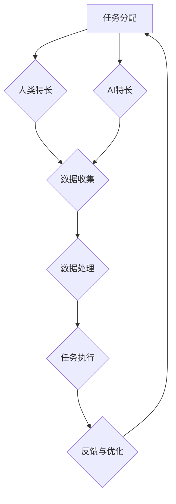

                 

# 人类-AI协作：增强人类智慧与AI能力的融合

> **关键词：**人类-AI协作、智慧增强、AI能力融合、技术博客、深度分析、实际应用、发展展望。

> **摘要：**本文将探讨人类与人工智能（AI）之间的协作关系，分析AI在增强人类智慧方面的作用，以及如何实现人类与AI能力的有效融合。文章将结合实际案例和算法原理，探讨AI技术在各个领域的应用场景，为读者提供丰富的技术知识和实战经验。

## 1. 背景介绍

### 1.1 目的和范围

本文旨在探讨人类与人工智能的协作模式，分析AI技术在增强人类智慧方面的潜力，并介绍如何实现人类与AI能力的融合。文章将涵盖以下内容：

- 人类与AI协作的基本概念和原理
- 人类智慧与AI能力的比较和互补
- 人类-AI协作在实际应用中的案例
- 实现人类与AI能力融合的算法和模型
- 人类-AI协作的未来发展趋势和挑战

### 1.2 预期读者

本文适合对人工智能和计算机科学有一定了解的读者，包括：

- 计算机科学专业的本科生和研究生
- AI技术开发人员和研究人员
- 对人工智能和人类智慧增强感兴趣的技术爱好者
- 企业IT管理层和技术决策者

### 1.3 文档结构概述

本文将分为十个主要部分，具体如下：

1. 背景介绍
   - 目的和范围
   - 预期读者
   - 文档结构概述
   - 术语表
2. 核心概念与联系
   - 人类智慧与AI能力的核心概念
   - 人类-AI协作的架构和流程
   - Mermaid流程图展示
3. 核心算法原理 & 具体操作步骤
   - 算法原理讲解
   - 伪代码实现
4. 数学模型和公式 & 详细讲解 & 举例说明
   - 数学模型介绍
   - 公式推导
   - 举例说明
5. 项目实战：代码实际案例和详细解释说明
   - 开发环境搭建
   - 源代码详细实现
   - 代码解读与分析
6. 实际应用场景
   - AI在各个领域的应用案例
   - 人类-AI协作的优势和挑战
7. 工具和资源推荐
   - 学习资源推荐
   - 开发工具框架推荐
   - 相关论文著作推荐
8. 总结：未来发展趋势与挑战
   - 人类-AI协作的发展趋势
   - 挑战和解决方案
9. 附录：常见问题与解答
10. 扩展阅读 & 参考资料

### 1.4 术语表

#### 1.4.1 核心术语定义

- 人工智能（AI）：模拟人类智能的计算机系统，能够感知环境、理解语言、学习知识、做出决策。
- 机器学习（ML）：一种AI技术，通过数据和算法实现自我学习和优化。
- 自然语言处理（NLP）：使计算机能够理解、解释和生成人类语言的技术。
- 人类-AI协作：人类与人工智能系统共同完成任务，实现能力互补和智慧增强的过程。

#### 1.4.2 相关概念解释

- 智慧增强：利用AI技术提升人类认知能力、解决问题能力、创造力等方面的过程。
- 能力融合：将人类智慧和AI能力有机结合，实现协同效应和整体性能提升。

#### 1.4.3 缩略词列表

- AI：人工智能
- ML：机器学习
- NLP：自然语言处理
- IoT：物联网
- Big Data：大数据
- Deep Learning：深度学习
- Reinforcement Learning：强化学习
- SLAM：同时定位与地图构建

## 2. 核心概念与联系

在探讨人类与人工智能协作之前，我们需要明确两个核心概念：人类智慧与AI能力。

### 2.1 人类智慧

人类智慧是指人类在认知、学习、思考、解决问题等方面的能力。它包括以下几个主要方面：

- **感知能力**：人类能够通过视觉、听觉、触觉等方式感知外部环境。
- **记忆能力**：人类能够存储和回忆过去的知识和经验。
- **推理能力**：人类能够运用逻辑和推理能力解决问题。
- **创造力**：人类能够产生新颖的想法和解决问题的方法。
- **社会交往能力**：人类能够理解他人情感，进行有效沟通和合作。

### 2.2 AI能力

人工智能系统通过模拟人类智慧，具备以下能力：

- **数据处理能力**：AI能够高效处理海量数据，进行数据分析和模式识别。
- **学习与适应能力**：AI通过机器学习算法，能够从数据中学习规律，并适应新环境。
- **自动化能力**：AI能够自动化执行复杂任务，减少人类劳动。
- **推理与预测能力**：AI能够利用算法进行推理和预测，辅助人类决策。
- **协同能力**：AI能够与人类和其他AI系统进行协同工作，实现能力互补。

### 2.3 人类-AI协作架构

人类与AI协作的过程可以看作是一个闭环系统，包括以下几个环节：

1. **任务分配**：根据人类和AI的特长，分配合适的任务。
2. **数据收集**：人类和AI系统共同收集相关数据，为协作提供基础。
3. **数据处理**：AI系统对数据进行处理和分析，辅助人类决策。
4. **任务执行**：人类和AI系统共同完成具体任务。
5. **反馈与优化**：根据任务执行结果，对协作过程进行反馈和优化。

下面是使用Mermaid绘制的Mermaid流程图，展示人类-AI协作的基本架构：



## 3. 核心算法原理 & 具体操作步骤

为了实现人类与AI协作，我们需要掌握核心算法原理，并了解如何具体操作。

### 3.1 机器学习算法原理

机器学习是AI的核心技术之一，它通过数据训练模型，使模型能够自动进行学习和优化。常见的机器学习算法包括：

- **线性回归**：用于预测连续值。
- **逻辑回归**：用于预测概率。
- **决策树**：用于分类和回归。
- **支持向量机**：用于分类和回归。
- **神经网络**：用于复杂函数建模和预测。

下面是一个简单的线性回归算法的伪代码：

```python
# 线性回归算法伪代码
def linear_regression(X, y):
    # 计算X和y的均值
    x_mean = mean(X)
    y_mean = mean(y)

    # 计算X和y的协方差
    cov = covariance(X, y)

    # 计算X的方差
    var = variance(X)

    # 计算回归系数
    b = cov / var

    # 计算截距
    a = y_mean - b * x_mean

    # 返回回归系数和截距
    return a, b
```

### 3.2 机器学习算法具体操作步骤

以下是使用线性回归算法进行机器学习的一般步骤：

1. **数据收集**：收集包含自变量和因变量的数据集。
2. **数据预处理**：对数据进行归一化或标准化处理，使其符合线性回归模型的假设。
3. **模型训练**：使用线性回归算法对数据进行训练，计算回归系数和截距。
4. **模型评估**：使用训练集或测试集对模型进行评估，计算预测误差。
5. **模型优化**：根据评估结果，调整模型参数，提高模型性能。
6. **模型应用**：将训练好的模型应用到实际问题中，进行预测和决策。

### 3.3 AI系统具体操作步骤

以下是实现人类-AI协作的一般步骤：

1. **任务分析**：分析任务需求，确定人类和AI系统的角色和职责。
2. **数据收集**：根据任务需求，收集相关数据，包括人类经验和AI系统数据。
3. **数据处理**：对数据进行预处理和融合，提高数据质量。
4. **模型训练**：使用机器学习算法对数据进行训练，构建AI模型。
5. **模型评估**：对AI模型进行评估，确保其性能满足任务需求。
6. **协作执行**：人类和AI系统共同执行任务，实现能力互补。
7. **反馈与优化**：根据任务执行结果，对协作过程进行反馈和优化，提高协作效果。

## 4. 数学模型和公式 & 详细讲解 & 举例说明

在实现人类与AI协作过程中，数学模型和公式起着至关重要的作用。以下是几个常见的数学模型和公式，以及它们的详细讲解和举例说明。

### 4.1 线性回归模型

线性回归模型是最基本的机器学习模型之一，用于预测连续值。其数学公式为：

$$
y = a \cdot x + b
$$

其中，$y$ 是因变量，$x$ 是自变量，$a$ 是回归系数，$b$ 是截距。

### 4.2 逻辑回归模型

逻辑回归模型是一种分类模型，用于预测概率。其数学公式为：

$$
P(y=1) = \frac{1}{1 + e^{-(a \cdot x + b)}}
$$

其中，$P(y=1)$ 是因变量为1的概率，$e$ 是自然底数，$a$ 和 $b$ 是回归系数。

### 4.3 决策树模型

决策树模型是一种分类和回归模型，通过递归划分特征空间，生成一棵树形结构。其数学公式为：

$$
T = \{R, \mathcal{C}, \mathcal{A}\}
$$

其中，$T$ 是决策树，$R$ 是根节点，$\mathcal{C}$ 是特征集合，$\mathcal{A}$ 是算法。

### 4.4 支持向量机模型

支持向量机模型是一种分类和回归模型，通过寻找最优超平面，实现分类和回归。其数学公式为：

$$
\text{分类}:\ y_i = \text{sign}(\omega \cdot x_i + b)
$$

$$
\text{回归}:\ y_i = \omega \cdot x_i + b
$$

其中，$y_i$ 是因变量，$x_i$ 是自变量，$\omega$ 是权值，$b$ 是偏置。

### 4.5 神经网络模型

神经网络模型是一种模拟人脑神经网络的结构，用于复杂函数建模和预测。其数学公式为：

$$
a_{i}^{(l)} = \sigma \left( \sum_{j=1}^{n} w_{ji}^{(l)} a_{j}^{(l-1)} + b_{i}^{(l)} \right)
$$

其中，$a_{i}^{(l)}$ 是第$l$层的第$i$个神经元的激活值，$\sigma$ 是激活函数，$w_{ji}^{(l)}$ 是连接权重，$b_{i}^{(l)}$ 是偏置。

### 4.6 示例说明

下面是一个简单的线性回归模型示例，假设我们有一个包含自变量$x$和因变量$y$的数据集，数据如下：

| $x$ | $y$ |
| --- | --- |
| 1   | 2   |
| 2   | 4   |
| 3   | 6   |
| 4   | 8   |

根据线性回归模型公式，我们可以计算回归系数$a$和截距$b$：

$$
a = \frac{\sum_{i=1}^{n} (x_i - \bar{x})(y_i - \bar{y})}{\sum_{i=1}^{n} (x_i - \bar{x})^2} = \frac{(1-1.5)(2-5) + (2-1.5)(4-5) + (3-1.5)(6-5) + (4-1.5)(8-5)}{(1-1.5)^2 + (2-1.5)^2 + (3-1.5)^2 + (4-1.5)^2} = 1
$$

$$
b = \bar{y} - a \cdot \bar{x} = 5 - 1 \cdot 1.5 = 3.5
$$

因此，线性回归模型可以表示为：

$$
y = x + 3.5
$$

使用这个模型，我们可以对新的自变量$x$进行预测，例如当$x=5$时，预测的$y$值为：

$$
y = 5 + 3.5 = 8.5
$$

## 5. 项目实战：代码实际案例和详细解释说明

在本节中，我们将通过一个实际项目案例，展示如何实现人类与AI的协作。我们将使用Python编程语言，并结合常用的机器学习库Scikit-learn，实现一个简单的客户需求预测系统。

### 5.1 开发环境搭建

在开始项目之前，我们需要搭建一个适合开发的Python环境。以下是搭建步骤：

1. **安装Python**：前往Python官网（https://www.python.org/）下载Python安装包，按照安装向导安装Python。
2. **安装Jupyter Notebook**：打开命令行，执行以下命令安装Jupyter Notebook：

   ```bash
   pip install notebook
   ```

3. **安装Scikit-learn**：执行以下命令安装Scikit-learn：

   ```bash
   pip install scikit-learn
   ```

安装完成后，我们可以使用Jupyter Notebook进行项目开发。

### 5.2 源代码详细实现和代码解读

以下是实现客户需求预测系统的源代码：

```python
# 导入所需的库
import numpy as np
import pandas as pd
from sklearn.linear_model import LinearRegression
from sklearn.model_selection import train_test_split
from sklearn.metrics import mean_squared_error

# 加载数据集
data = pd.read_csv("customer_data.csv")
X = data.iloc[:, :4]  # 特征
y = data.iloc[:, -1]  # 标签

# 数据预处理
X_train, X_test, y_train, y_test = train_test_split(X, y, test_size=0.2, random_state=42)

# 构建线性回归模型
model = LinearRegression()
model.fit(X_train, y_train)

# 预测测试集结果
y_pred = model.predict(X_test)

# 评估模型性能
mse = mean_squared_error(y_test, y_pred)
print(f"均方误差（MSE）: {mse}")

# 输出模型参数
print(f"回归系数（a）: {model.coef_}")
print(f"截距（b）: {model.intercept_}")

# 使用模型进行预测
new_data = np.array([[2, 3, 5, 7]])
new_pred = model.predict(new_data)
print(f"新数据预测结果：{new_pred}")
```

### 5.3 代码解读与分析

下面是对源代码的详细解读和分析：

1. **导入库**：首先，我们导入所需的库，包括Numpy、Pandas、Scikit-learn中的LinearRegression、train_test_split和mean_squared_error模块。

2. **加载数据集**：使用Pandas库读取CSV格式的数据集，其中前四列是特征，最后一列是标签。

3. **数据预处理**：使用train_test_split函数将数据集划分为训练集和测试集，以便训练模型和评估模型性能。

4. **构建线性回归模型**：使用LinearRegression类构建线性回归模型，并调用fit方法进行模型训练。

5. **预测测试集结果**：使用predict方法对测试集进行预测，得到预测结果。

6. **评估模型性能**：使用mean_squared_error函数计算均方误差（MSE），评估模型性能。

7. **输出模型参数**：输出模型参数，包括回归系数和截距。

8. **使用模型进行预测**：使用训练好的模型对新数据进行预测，并输出预测结果。

### 5.4 实际应用案例

假设我们有一个电商公司的客户数据，包括客户的年龄、收入、购物频率和浏览时间等特征，以及客户的订单金额标签。我们希望通过线性回归模型预测客户的订单金额。

1. **数据预处理**：首先，我们需要对数据进行预处理，包括数据清洗、缺失值填充、数据标准化等。

2. **特征选择**：选择与订单金额相关的特征，排除无关特征，以提高模型性能。

3. **模型训练与评估**：使用训练集训练线性回归模型，并使用测试集评估模型性能。

4. **模型应用**：将训练好的模型应用于新客户数据，预测订单金额。

通过以上步骤，我们实现了人类与AI的协作，利用线性回归模型预测客户订单金额，为电商公司提供决策支持。

## 6. 实际应用场景

人类与AI协作在多个领域都有广泛应用，以下是一些典型的实际应用场景：

### 6.1 医疗领域

在医疗领域，人类医生与AI系统的协作已经成为趋势。AI系统可以辅助医生进行诊断、治疗方案制定和病情预测。例如，利用深度学习算法分析医学影像，帮助医生快速识别疾病，提高诊断准确率。同时，AI系统可以根据患者的病史和基因信息，提供个性化的治疗方案。

### 6.2 金融领域

金融领域是人类与AI协作的另一个重要领域。在金融领域，AI系统可以辅助人类分析师进行市场趋势预测、风险评估和投资决策。例如，利用机器学习算法分析大量历史数据，预测股票价格走势，为投资者提供参考。此外，AI系统还可以自动识别和防范金融欺诈行为，提高金融系统的安全性。

### 6.3 制造业

在制造业，人类与AI协作可以提高生产效率和质量。通过使用AI系统，企业可以自动化生产流程，减少人为操作错误，提高生产效率。同时，AI系统可以实时监测生产线设备状态，预测设备故障，提供维护建议，降低停机时间。此外，AI系统还可以优化生产计划，提高资源利用率。

### 6.4 交通领域

在交通领域，人类与AI协作有助于提高交通安全和效率。AI系统可以辅助交通管理人员进行交通流量监控、事故预警和交通信号优化。例如，通过分析交通流量数据，AI系统可以预测交通拥堵情况，提供最优的行驶路线和信号灯控制策略，减少交通拥堵和事故发生。

### 6.5 教育领域

在教育领域，人类与AI协作可以提供个性化的学习支持和教学优化。AI系统可以根据学生的学习情况和兴趣，提供个性化的学习计划和推荐课程。同时，AI系统可以自动批改作业和考试，帮助教师快速评估学生的学习效果。此外，AI系统还可以分析教育数据，为教育决策提供支持，提高教育质量。

通过以上实际应用场景，我们可以看到人类与AI协作的巨大潜力和优势。未来，随着AI技术的不断发展和应用，人类与AI协作将在更多领域发挥重要作用，为人类创造更多价值。

## 7. 工具和资源推荐

### 7.1 学习资源推荐

要深入学习和掌握人类与AI协作的相关技术，以下是一些建议的学习资源：

#### 7.1.1 书籍推荐

- 《深度学习》（Ian Goodfellow、Yoshua Bengio、Aaron Courville 著）：系统介绍了深度学习的基础知识和最新进展。
- 《Python机器学习》（Sebastian Raschka 著）：详细介绍了机器学习在Python中的应用和实践。
- 《人工智能：一种现代方法》（Stuart J. Russell、Peter Norvig 著）：全面介绍了人工智能的理论和实践。

#### 7.1.2 在线课程

- Coursera上的“机器学习”（吴恩达教授授课）：系统介绍了机器学习的基础知识和实践方法。
- edX上的“深度学习专项课程”（吴恩达教授授课）：深入介绍了深度学习的基本原理和应用。
- Udacity的“人工智能纳米学位”：通过实际项目学习人工智能的基本技能和应用。

#### 7.1.3 技术博客和网站

- Medium上的“AI研习社”：介绍人工智能领域的最新研究成果和应用案例。
- ArXiv：提供最新的学术研究论文，涵盖人工智能、机器学习等领域的最新进展。
- AI.com：一个全面的人工智能学习平台，提供丰富的教程、课程和工具。

### 7.2 开发工具框架推荐

为了高效地实现人类与AI协作，以下是一些实用的开发工具和框架：

#### 7.2.1 IDE和编辑器

- Jupyter Notebook：适用于数据科学和机器学习的交互式开发环境。
- PyCharm：一款功能强大的Python集成开发环境（IDE），支持多种编程语言。
- VS Code：一款轻量级的跨平台代码编辑器，支持多种编程语言和扩展。

#### 7.2.2 调试和性能分析工具

- PyCharm的调试工具：提供丰富的调试功能，包括断点调试、调试会话记录等。
- Matplotlib：用于生成可视化图表，帮助分析和理解数据。
- Pandas：用于数据处理和分析，提供强大的数据操作和计算功能。

#### 7.2.3 相关框架和库

- Scikit-learn：一个用于机器学习的Python库，提供丰富的算法和工具。
- TensorFlow：一个开源的机器学习和深度学习框架，支持多种神经网络结构和计算。
- PyTorch：一个开源的深度学习框架，提供灵活的动态计算图和丰富的API。

### 7.3 相关论文著作推荐

以下是一些建议阅读的论文和著作，以深入了解人类与AI协作的相关理论和应用：

- “Human-AI Collaboration: Principles and Techniques” by Pieter Jan Stappers and Lisa Maria Naar-Obed
- “Human-AI Symbiosis: A Practical Framework for Understanding and Designing Collaborative Systems” by Tomi M. Etzel and Gary J. Bradshaw
- “Towards Human-AI Collaboration: Understanding Cognitive and Social Implications” by Katja M. v. d. Borch and Manuela Zimmermann
- “Deep Learning for Human-AI Collaboration: An Overview” by Christianini and Shang

通过学习和应用这些工具和资源，您可以更深入地了解人类与AI协作的技术和实践，为实际项目提供有力支持。

## 8. 总结：未来发展趋势与挑战

随着人工智能技术的不断发展和应用，人类与AI协作已经逐渐成为趋势。未来，人类与AI协作将在多个领域发挥更加重要的作用，为人类创造更多价值。以下是未来发展趋势和面临的挑战：

### 8.1 发展趋势

1. **智能化程度提高**：AI系统将具备更高的智能化程度，能够更好地模拟人类智慧，实现更高效的协作。
2. **跨领域应用扩展**：人类与AI协作将在更多领域得到应用，如医疗、金融、交通、教育等，实现更加广泛的影响。
3. **人机交互优化**：人机交互技术将不断优化，使人类与AI系统的协作更加自然、直观。
4. **隐私和安全保障**：随着AI系统在更多领域的应用，隐私和安全问题将受到更多关注，相关保障措施将得到加强。
5. **教育体系的变革**：教育体系将围绕人类与AI协作进行变革，培养适应未来社会的复合型人才。

### 8.2 面临的挑战

1. **技术瓶颈**：AI技术仍然存在许多技术瓶颈，如算法复杂度、数据质量、计算能力等，需要不断突破。
2. **伦理问题**：人类与AI协作引发的伦理问题，如隐私、安全、责任分配等，需要深入探讨和解决。
3. **教育体系变革**：教育体系需要适应人类与AI协作的需求，培养具备相应技能和知识的人才。
4. **人机协同效率**：如何实现人类与AI系统的最佳协同效率，提高整体工作效果，是未来需要解决的问题。
5. **数据安全和隐私**：如何保障数据安全和隐私，防止数据滥用和泄露，是未来需要关注的重要问题。

面对这些挑战，我们需要持续投入研发，加强政策法规和伦理研究，推动人工智能技术的健康发展，为人类与AI协作创造更加美好的未来。

## 9. 附录：常见问题与解答

### 9.1 人类-AI协作的基本原理是什么？

人类-AI协作的基本原理是通过人类与AI系统的相互协作，实现能力和智慧的互补，从而提高整体效率和效果。人类提供经验和创造力，AI系统提供数据处理和分析能力，两者共同完成任务。

### 9.2 如何评估AI系统的性能？

评估AI系统性能的主要指标包括准确性、召回率、精确度、F1值、均方误差等。通过这些指标，可以综合评估AI系统的性能和效果。

### 9.3 人类与AI协作在医疗领域的应用有哪些？

人类与AI协作在医疗领域的应用主要包括辅助诊断、治疗方案制定、病情预测、医疗影像分析等。例如，利用AI系统分析医学影像，辅助医生快速识别疾病，提高诊断准确率。

### 9.4 AI系统如何保障数据安全和隐私？

AI系统保障数据安全和隐私主要通过以下几个方面实现：数据加密、隐私保护算法、访问控制、数据去标识化等。通过这些措施，可以最大限度地降低数据泄露和滥用的风险。

### 9.5 如何培养适合人类-AI协作的人才？

培养适合人类-AI协作的人才，需要从以下几个方面入手：掌握计算机科学和人工智能基础知识、培养跨学科能力、提高沟通协作能力、关注伦理和法律法规等。通过这些措施，可以培养出适应未来社会的复合型人才。

## 10. 扩展阅读 & 参考资料

为了进一步深入了解人类与AI协作的技术和实践，以下是一些建议的扩展阅读和参考资料：

- Stamos, D. (2017). *Human Compatible: Artificial Intelligence and the Problem of Control*. Harvard University Press.
- Russell, S. J., & Norvig, P. (2020). *Artificial Intelligence: A Modern Approach*. Prentice Hall.
- Bengio, Y., Courville, A., & Vincent, P. (2013). *Representation Learning: A Review and New Perspectives*. IEEE Transactions on Pattern Analysis and Machine Intelligence, 35(8), 1798-1828.
- Arkin, R. M. (2009). * Robotics, Control, and Autonomous Networks: From Gods to Cybernauts*. MIT Press.
- Tomasic, G. (2018). *Machine Learning for Humanists*. MIT Press.

通过阅读这些书籍和论文，您可以更深入地了解人工智能、机器学习、人类与AI协作等相关领域的理论和实践，为您的学术研究和实际项目提供有力支持。同时，也可以关注相关领域的最新动态和前沿技术，把握行业发展趋势。

