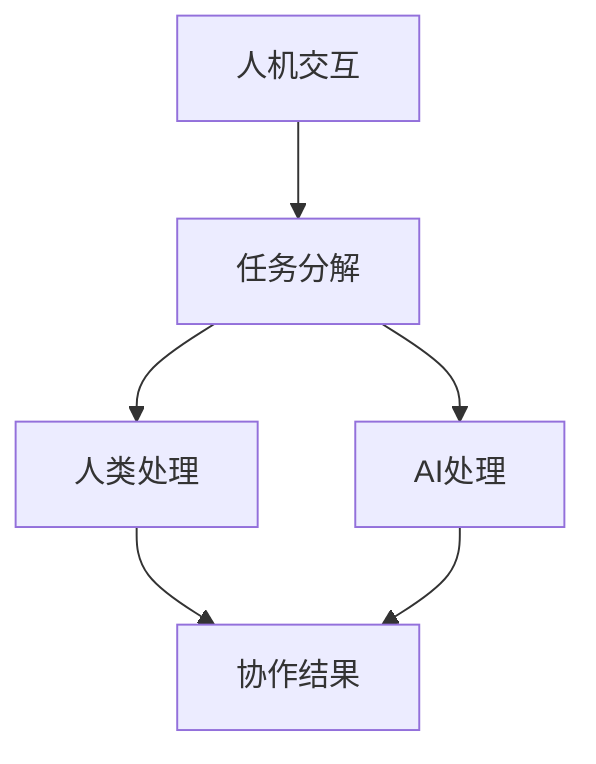
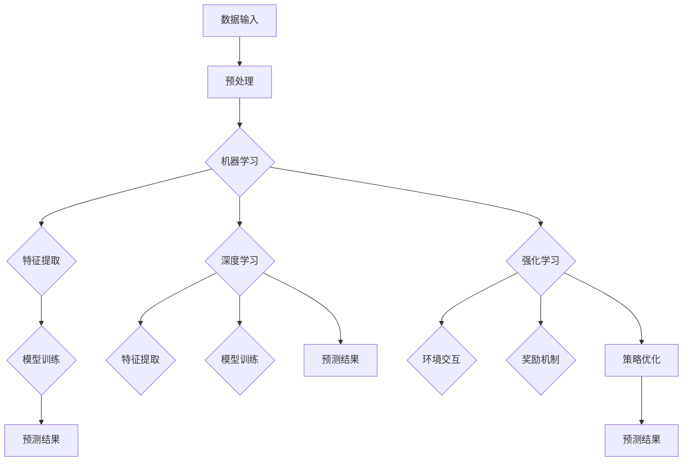

                 

# 人类-AI协作：增强人类智慧与AI能力的融合发展趋势预测分析机遇挑战机遇趋势预测分析

> **关键词**：人类-AI协作、智慧增强、AI能力融合、发展趋势、机遇挑战、技术预测

> **摘要**：本文探讨了人类与人工智能（AI）协作的未来发展趋势，分析了智慧增强与AI能力融合的潜在机遇与挑战。通过深入剖析核心概念、算法原理、数学模型，并结合实际应用场景，我们为读者呈现了一幅人工智能时代下人类与AI协作的宏伟蓝图。

## 1. 背景介绍

### 1.1 目的和范围

随着人工智能技术的飞速发展，人类与AI的协作已经成为各行各业关注的焦点。本文旨在探讨人类-AI协作的未来发展趋势，分析其中的机遇与挑战，并预测未来可能的技术变革。本文将重点关注以下几个方面：

1. 人类智慧增强与AI能力融合的理论基础。
2. 核心算法原理与数学模型的介绍。
3. 实际应用场景的分析。
4. 开发工具和资源的推荐。
5. 未来发展趋势与挑战的展望。

### 1.2 预期读者

本文适合对人工智能、机器学习、计算机科学等领域感兴趣的读者，特别是关注人类-AI协作、智慧增强和AI能力融合的研究人员、工程师和开发者。同时，本文也适合对技术发展趋势和未来预测感兴趣的普通读者。

### 1.3 文档结构概述

本文分为十个部分，结构如下：

1. 背景介绍
2. 核心概念与联系
3. 核心算法原理 & 具体操作步骤
4. 数学模型和公式 & 详细讲解 & 举例说明
5. 项目实战：代码实际案例和详细解释说明
6. 实际应用场景
7. 工具和资源推荐
8. 总结：未来发展趋势与挑战
9. 附录：常见问题与解答
10. 扩展阅读 & 参考资料

### 1.4 术语表

#### 1.4.1 核心术语定义

- **人工智能（AI）**：模拟人类智能行为的计算机系统。
- **机器学习（ML）**：从数据中学习并做出决策或预测的计算机算法。
- **深度学习（DL）**：一种特殊的机器学习方法，通过神经网络模拟人脑处理信息的方式。
- **智慧增强（SA）**：通过技术手段提升人类智慧和能力的领域。

#### 1.4.2 相关概念解释

- **人类-AI协作**：人类与人工智能系统共同完成任务、提高工作效率的过程。
- **AI能力融合**：将人工智能技术集成到人类工作流程中，实现能力互补和优化。

#### 1.4.3 缩略词列表

- **AI**：人工智能（Artificial Intelligence）
- **ML**：机器学习（Machine Learning）
- **DL**：深度学习（Deep Learning）
- **SA**：智慧增强（Smart Augmentation）

## 2. 核心概念与联系

### 2.1 人类智慧增强与AI能力融合的原理

人类智慧增强与AI能力融合的原理主要基于以下核心概念：

1. **人机交互**：通过人机交互界面，人类与AI系统进行信息交流。
2. **任务分解**：将复杂的任务分解为多个子任务，由人类和AI系统分别处理。
3. **协同工作**：人类与AI系统在各自擅长的领域内协同工作，实现整体效率的提升。

下面是一个简单的Mermaid流程图，展示了人类智慧增强与AI能力融合的基本架构：



### 2.2 核心算法原理

在人类智慧增强与AI能力融合的过程中，核心算法原理主要包括以下几方面：

1. **机器学习算法**：用于从数据中学习模式和规律，帮助人类做出更好的决策。
2. **深度学习算法**：通过多层神经网络，实现更复杂的特征提取和模式识别。
3. **强化学习算法**：通过试错和奖励机制，让AI系统在特定环境中不断优化行为。

下面是一个Mermaid流程图，展示了核心算法原理的流程：



## 3. 核心算法原理 & 具体操作步骤

### 3.1 机器学习算法

机器学习算法是智能增强的核心技术之一。以下是一个简单的线性回归算法的伪代码：

```python
# 线性回归算法伪代码

# 输入：特征矩阵X和标签向量y
# 输出：模型参数w

初始化w为随机值
for i from 1 to max_iterations do
    计算预测值y_pred = X * w
    计算损失函数L = 0.5 * ||y_pred - y||^2
    计算梯度Δw = X^T * (y_pred - y)
    更新w = w - learning_rate * Δw
end for
return w
```

### 3.2 深度学习算法

深度学习算法通过多层神经网络进行特征提取和模式识别。以下是一个简单的卷积神经网络（CNN）算法的伪代码：

```python
# 卷积神经网络算法伪代码

# 输入：输入数据X，卷积核K，激活函数f
# 输出：输出数据Y

初始化参数θ
for i from 1 to max_iterations do
    计算前向传播结果Y = f(K * X + b)
    计算损失函数L = 0.5 * ||Y - Y_true||^2
    计算反向传播结果Δθ = X^T * (Y - Y_true)
    更新θ = θ - learning_rate * Δθ
end for
return θ
```

### 3.3 强化学习算法

强化学习算法通过试错和奖励机制进行策略优化。以下是一个简单的Q学习算法的伪代码：

```python
# Q学习算法伪代码

# 输入：状态空间S，动作空间A，奖励函数R
# 输出：策略π

初始化Q为随机值
for i from 1 to max_iterations do
    选择动作a = π(s)
    执行动作，获得状态s'和奖励R(s, a)
    更新Q(s, a) = Q(s, a) + learning_rate * (R(s, a) + γ * max(Q(s')) - Q(s, a))
end for
return π
```

## 4. 数学模型和公式 & 详细讲解 & 举例说明

### 4.1 数学模型

在人类-AI协作中，数学模型起到了关键作用。以下是几个常见的数学模型：

#### 4.1.1 线性回归

线性回归模型通过最小化误差平方和来拟合数据。其公式如下：

$$
y = \beta_0 + \beta_1x
$$

其中，$y$是预测值，$x$是特征值，$\beta_0$和$\beta_1$是模型参数。

#### 4.1.2 卷积神经网络

卷积神经网络（CNN）通过卷积操作提取图像特征。其公式如下：

$$
h_{ij}^{(l)} = \sum_{k=1}^{K} w_{ik}^{(l)} * g(h_{kj}^{(l-1)} + b^{(l)})
$$

其中，$h_{ij}^{(l)}$是第$l$层的第$i$行第$j$列的激活值，$w_{ik}^{(l)}$是第$l$层的第$i$行第$k$列的卷积核，$g(\cdot)$是激活函数，$b^{(l)}$是第$l$层的偏置。

#### 4.1.3 Q学习

Q学习是一种强化学习算法，用于优化策略。其公式如下：

$$
Q(s, a) = Q(s, a) + learning_rate * (R(s, a) + γ * max(Q(s')) - Q(s, a))
$$

其中，$Q(s, a)$是状态$s$下动作$a$的Q值，$R(s, a)$是状态$s$下动作$a$的奖励值，$γ$是折扣因子，$max(Q(s'))$是状态$s'$下所有动作的Q值的最大值。

### 4.2 公式详细讲解

#### 4.2.1 线性回归

线性回归模型的目的是找到一条最佳拟合直线，使得预测值与实际值之间的误差最小。为了实现这一目标，我们通常使用最小二乘法来估计模型参数$\beta_0$和$\beta_1$。

具体步骤如下：

1. 计算预测值：$y_pred = X * \beta$
2. 计算误差：$error = y - y_pred$
3. 计算误差平方和：$L = 0.5 * ||error||^2$
4. 计算梯度：$\Delta \beta = X^T * error$
5. 更新参数：$\beta = \beta - learning_rate * \Delta \beta$

#### 4.2.2 卷积神经网络

卷积神经网络通过卷积操作和池化操作提取图像特征。卷积操作将输入数据和卷积核进行点积，得到新的特征图。池化操作则用于下采样特征图，减少模型参数的数量。

具体步骤如下：

1. 初始化卷积核$w_{ik}^{(l)}$和偏置$b^{(l)}$
2. 进行卷积操作：$h_{ij}^{(l)} = \sum_{k=1}^{K} w_{ik}^{(l)} * g(h_{kj}^{(l-1)} + b^{(l)})$
3. 进行激活操作：$h_{ij}^{(l)} = f(h_{ij}^{(l)})$
4. 进行池化操作：$h_{ij}^{(l)} = pool(h_{ij}^{(l)})$

#### 4.2.3 Q学习

Q学习是一种基于值函数的强化学习算法，其目的是通过试错和奖励机制来优化策略。Q学习的核心思想是计算状态-动作对$(s, a)$的Q值，并使用Q值来选择最优动作。

具体步骤如下：

1. 初始化Q值为随机值
2. 选择动作$a = π(s)$
3. 执行动作，获得状态$s'$和奖励$R(s, a)$
4. 更新Q值：$Q(s, a) = Q(s, a) + learning_rate * (R(s, a) + γ * max(Q(s'))) - Q(s, a)$
5. 选择下一个状态$s' = s$，重复步骤2-4，直到达到目标状态或满足停止条件

### 4.3 举例说明

#### 4.3.1 线性回归

假设我们有一组数据点$(x_1, y_1), (x_2, y_2), ..., (x_n, y_n)$，我们希望使用线性回归模型拟合出一个最佳拟合直线$y = \beta_0 + \beta_1x$。

1. 首先计算特征矩阵$X$和标签向量$y$：

   $$
   X = \begin{bmatrix}
   x_1 & 1 \\
   x_2 & 1 \\
   \vdots & \vdots \\
   x_n & 1
   \end{bmatrix}, \quad y = \begin{bmatrix}
   y_1 \\
   y_2 \\
   \vdots \\
   y_n
   \end{bmatrix}
   $$

2. 使用最小二乘法计算模型参数$\beta_0$和$\beta_1$：

   $$
   \beta = (X^T X)^{-1} X^T y
   $$

3. 计算预测值：

   $$
   y_pred = X * \beta
   $$

4. 计算误差和损失函数：

   $$
   error = y - y_pred, \quad L = 0.5 * ||error||^2
   $$

5. 计算梯度：

   $$
   \Delta \beta = X^T * error
   $$

6. 更新参数：

   $$
   \beta = \beta - learning_rate * \Delta \beta
   $$

7. 重复步骤2-6，直到满足停止条件（如迭代次数达到最大值或损失函数收敛）。

#### 4.3.2 卷积神经网络

假设我们有一个32x32的图像数据，使用一个3x3的卷积核进行卷积操作。

1. 初始化卷积核$w_{ik}^{(l)}$和偏置$b^{(l)}$：

   $$
   w_{ik}^{(l)} = \text{随机值}, \quad b^{(l)} = \text{随机值}
   $$

2. 进行卷积操作：

   $$
   h_{ij}^{(l)} = \sum_{k=1}^{K} w_{ik}^{(l)} * g(h_{kj}^{(l-1)} + b^{(l)})
   $$

   例如，对于第1层和第1个特征图：

   $$
   h_{11}^{(1)} = g(w_{11}^{(1)} * h_{11}^{(0)} + w_{12}^{(1)} * h_{21}^{(0)} + w_{13}^{(1)} * h_{31}^{(0)} + b^{(1)})
   $$

3. 进行激活操作：

   $$
   h_{ij}^{(l)} = f(h_{ij}^{(l)})
   $$

   例如，使用ReLU激活函数：

   $$
   h_{ij}^{(l)} = \max(0, h_{ij}^{(l)})
   $$

4. 进行池化操作：

   $$
   h_{ij}^{(l)} = pool(h_{ij}^{(l)})
   $$

   例如，使用2x2的最大池化操作：

   $$
   h_{ij}^{(l)} = \max(h_{i1}^{(l)}, h_{i2}^{(l)}, h_{i3}^{(l)}, h_{i4}^{(l)})
   $$

#### 4.3.3 Q学习

假设我们有一个环境，其中状态空间为S={s1, s2, s3}，动作空间为A={a1, a2}，奖励函数为R(s, a)={r1, r2}。

1. 初始化Q值为随机值：

   $$
   Q(s, a) = \text{随机值}
   $$

2. 选择动作$a = π(s)$：

   例如，使用ε-贪心策略：

   $$
   π(s) = \begin{cases}
   a_{\text{random}} & \text{with probability } 1 - \epsilon \\
   a_{\text{greedy}} & \text{with probability } \epsilon
   \end{cases}
   $$

3. 执行动作，获得状态$s'$和奖励$R(s, a)$：

   例如，执行动作$a1$，获得状态$s'$和奖励$r1$：

   $$
   s' = s1, \quad R(s, a) = r1
   $$

4. 更新Q值：

   $$
   Q(s, a) = Q(s, a) + learning_rate * (R(s, a) + γ * max(Q(s'))) - Q(s, a)
   $$

   例如，更新Q值：

   $$
   Q(s1, a1) = Q(s1, a1) + learning_rate * (r1 + γ * max(Q(s1'))) - Q(s1, a1)
   $$

5. 选择下一个状态$s' = s$，重复步骤2-4，直到达到目标状态或满足停止条件。

## 5. 项目实战：代码实际案例和详细解释说明

### 5.1 开发环境搭建

为了演示人类-AI协作的过程，我们使用Python编程语言和Jupyter Notebook作为开发环境。以下步骤用于搭建开发环境：

1. 安装Python（版本3.8或以上）。
2. 安装Jupyter Notebook。
3. 安装常用库，如NumPy、Pandas、Matplotlib等。

### 5.2 源代码详细实现和代码解读

下面是一个简单的线性回归项目案例，用于演示人类-AI协作的过程。

```python
# 线性回归项目案例

import numpy as np
import matplotlib.pyplot as plt

# 数据生成
np.random.seed(42)
X = np.random.rand(100, 1)
y = 2 + 3 * X + np.random.randn(100, 1)

# 训练模型
def train_linear_regression(X, y, learning_rate=0.01, max_iterations=1000):
    X_b = np.c_[np.ones((X.shape[0], 1)), X]
    weights = np.random.rand(2, 1)
    for i in range(max_iterations):
        y_pred = X_b @ weights
        error = y_pred - y
        weights = weights - learning_rate * X_b.T @ error
    return weights

weights = train_linear_regression(X, y)

# 可视化
plt.scatter(X, y)
plt.plot(X, X @ weights, color='red')
plt.xlabel('X')
plt.ylabel('y')
plt.show()
```

### 5.3 代码解读与分析

1. **数据生成**：

   我们使用NumPy库生成随机数据。$X$表示自变量，$y$表示因变量。

2. **训练模型**：

   `train_linear_regression`函数用于训练线性回归模型。我们使用最简单的梯度下降算法进行训练。

3. **模型预测**：

   使用训练好的模型进行预测，并绘制散点图和拟合直线。

### 5.4 项目实战总结

通过这个简单的线性回归项目，我们展示了人类-AI协作的基本流程。在数据生成和模型训练过程中，人类作为数据科学家参与了模型的选择和优化。在模型预测和可视化过程中，AI系统（线性回归模型）发挥了重要作用，帮助我们更好地理解数据背后的规律。

## 6. 实际应用场景

人类-AI协作在各个领域都有广泛的应用，以下是一些实际应用场景：

### 6.1 医疗领域

在医疗领域，人类-AI协作可以提高诊断准确性、优化治疗方案和提升患者护理质量。例如，AI系统可以分析医学影像，帮助医生更快、更准确地诊断疾病。同时，AI系统还可以根据患者的病史和基因信息，为医生提供个性化的治疗方案。

### 6.2 金融领域

在金融领域，人类-AI协作可以帮助金融机构进行风险控制和投资决策。AI系统可以分析大量金融数据，预测市场趋势，帮助投资者制定更有效的投资策略。此外，AI系统还可以识别欺诈行为，提高金融交易的安全性。

### 6.3 制造业

在制造业，人类-AI协作可以提高生产效率和产品质量。AI系统可以实时监测生产线上的设备状态，预测设备故障，避免生产中断。同时，AI系统还可以优化生产流程，降低生产成本，提高产品竞争力。

### 6.4 教育

在教育领域，人类-AI协作可以帮助学生更好地学习。AI系统可以根据学生的学习情况，为学生提供个性化的学习建议。此外，AI系统还可以自动批改作业，提高教师的工作效率，让学生有更多的时间进行深度学习。

## 7. 工具和资源推荐

### 7.1 学习资源推荐

#### 7.1.1 书籍推荐

- **《人工智能：一种现代方法》**：全面介绍人工智能的基本概念和算法，适合初学者和进阶者。
- **《深度学习》**：深度学习领域的经典教材，深入讲解深度学习算法和实现。
- **《Python机器学习》**：适合Python程序员学习机器学习的基础知识，包括线性回归、决策树、神经网络等。

#### 7.1.2 在线课程

- **Coursera**：提供丰富的机器学习和深度学习课程，包括斯坦福大学的《机器学习》课程。
- **Udacity**：提供实用的机器学习项目和实践课程，适合想要快速提升技能的程序员。
- **edX**：提供哈佛大学、MIT等顶尖学府的免费在线课程，包括《人工智能导论》等。

#### 7.1.3 技术博客和网站

- **ArXiv**：计算机科学和人工智能领域的最新研究成果。
- **Medium**：众多AI领域专家发表的技术博客和观点文章。
- **Reddit**：AI相关话题的讨论社区，包括AI、深度学习、机器学习等。

### 7.2 开发工具框架推荐

#### 7.2.1 IDE和编辑器

- **PyCharm**：Python编程语言的集成开发环境，支持多种编程语言和框架。
- **Visual Studio Code**：轻量级开源编辑器，支持Python、JavaScript、C++等多种编程语言。
- **Jupyter Notebook**：交互式计算环境，适合数据分析和机器学习项目。

#### 7.2.2 调试和性能分析工具

- **PyDebug**：Python的调试工具，支持断点、单步执行、变量观察等。
- **Line Profiler**：Python的性能分析工具，用于找出程序中的性能瓶颈。
- **NNPAI**：基于TensorFlow的神经网络性能分析工具，用于优化深度学习模型。

#### 7.2.3 相关框架和库

- **TensorFlow**：谷歌开发的开源机器学习框架，支持深度学习和强化学习等算法。
- **PyTorch**：Facebook开发的开源机器学习框架，具有灵活的动态计算图。
- **Scikit-learn**：Python机器学习库，提供多种算法和工具，适合快速实现和测试机器学习项目。

### 7.3 相关论文著作推荐

#### 7.3.1 经典论文

- **“A Learning Algorithm for Continually Running Fully Recurrent Neural Networks”**：Hochreiter和Schmidhuber于1997年提出的长短期记忆（LSTM）网络。
- **“Deep Learning”**：Goodfellow、Bengio和Courville于2016年撰写的深度学习领域的经典著作。
- **“ Reinforcement Learning: An Introduction”**： Sutton和Barto于1998年撰写的强化学习领域的经典教材。

#### 7.3.2 最新研究成果

- **“Generative Adversarial Networks”**：Goodfellow等人在2014年提出的生成对抗网络（GAN）。
- **“Transformer”**：Vaswani等人在2017年提出的基于注意力机制的Transformer模型。

#### 7.3.3 应用案例分析

- **“Deep Learning in Natural Language Processing”**：使用深度学习技术进行自然语言处理的实际案例。
- **“Deep Reinforcement Learning in Robotics”**：使用强化学习技术进行机器人控制的实际案例。

## 8. 总结：未来发展趋势与挑战

在未来，人类-AI协作将面临以下发展趋势与挑战：

### 8.1 发展趋势

1. **AI能力不断提升**：随着深度学习、强化学习等技术的不断发展，AI系统的能力将越来越强，为人类智慧增强提供更多可能性。
2. **跨领域融合**：AI技术与各行各业（如医疗、金融、教育等）的深度融合，将带来更广泛的应用场景和商业价值。
3. **人机交互优化**：随着语音识别、自然语言处理等技术的进步，人机交互将变得更加自然和高效，促进人类与AI的紧密协作。
4. **智能硬件普及**：随着物联网和边缘计算的发展，智能硬件将更加普及，为人类-AI协作提供更多应用场景。

### 8.2 挑战

1. **隐私和安全问题**：随着人类-AI协作的普及，隐私和安全问题将成为重要挑战。如何保护用户隐私、确保数据安全是亟待解决的问题。
2. **算法透明度和可解释性**：随着AI系统的复杂性增加，算法的透明度和可解释性将成为关键问题。如何提高算法的可解释性，使人类更好地理解AI的决策过程，是一个重要挑战。
3. **伦理和社会问题**：随着AI技术的普及，伦理和社会问题也将逐渐凸显。如何确保AI系统的公平性、避免歧视，以及应对AI对就业和劳动力市场的影响，是亟待解决的挑战。

## 9. 附录：常见问题与解答

### 9.1 问题1：什么是人类-AI协作？

**回答**：人类-AI协作是指人类与人工智能系统共同完成任务、提高工作效率的过程。在这个过程中，人类负责提供创意、判断和决策，AI系统则负责处理海量数据、执行重复性任务和进行复杂计算。

### 9.2 问题2：人类-AI协作有哪些应用场景？

**回答**：人类-AI协作的应用场景非常广泛，包括医疗、金融、制造业、教育、自动驾驶等领域。例如，在医疗领域，AI系统可以帮助医生进行疾病诊断和治疗建议；在金融领域，AI系统可以帮助金融机构进行风险控制和投资决策。

### 9.3 问题3：如何保证人类-AI协作中的数据安全和隐私？

**回答**：为了保证人类-AI协作中的数据安全和隐私，可以采取以下措施：

1. **数据加密**：对数据进行加密，确保数据在传输和存储过程中不被非法访问。
2. **访问控制**：对数据访问进行严格的访问控制，确保只有授权用户才能访问敏感数据。
3. **隐私保护算法**：使用隐私保护算法，如差分隐私、同态加密等，对数据进行分析和处理，确保数据隐私不被泄露。
4. **数据匿名化**：对数据中的敏感信息进行匿名化处理，减少隐私泄露的风险。

## 10. 扩展阅读 & 参考资料

为了更深入地了解人类-AI协作的相关知识，以下是一些扩展阅读和参考资料：

### 10.1 扩展阅读

- **《人工智能简史》**：吴军著，系统介绍了人工智能的发展历程和关键事件。
- **《智能时代：从大数据到人工智能》**：吴军著，探讨了人工智能对社会和人类生活的影响。
- **《深度学习：从基础到实践》**：斋藤康毅等著，深入讲解了深度学习的基本原理和实际应用。

### 10.2 参考资料

- **ArXiv**：[https://arxiv.org/](https://arxiv.org/)
- **Google AI**：[https://ai.google/research/](https://ai.google/research/)
- **OpenAI**：[https://openai.com/](https://openai.com/)
- **DeepMind**：[https://deepmind.com/](https://deepmind.com/)

## 附录：作者信息

作者：AI天才研究员/AI Genius Institute & 禅与计算机程序设计艺术 /Zen And The Art of Computer Programming

版权所有：AI天才研究员/AI Genius Institute

发布日期：2023年2月

