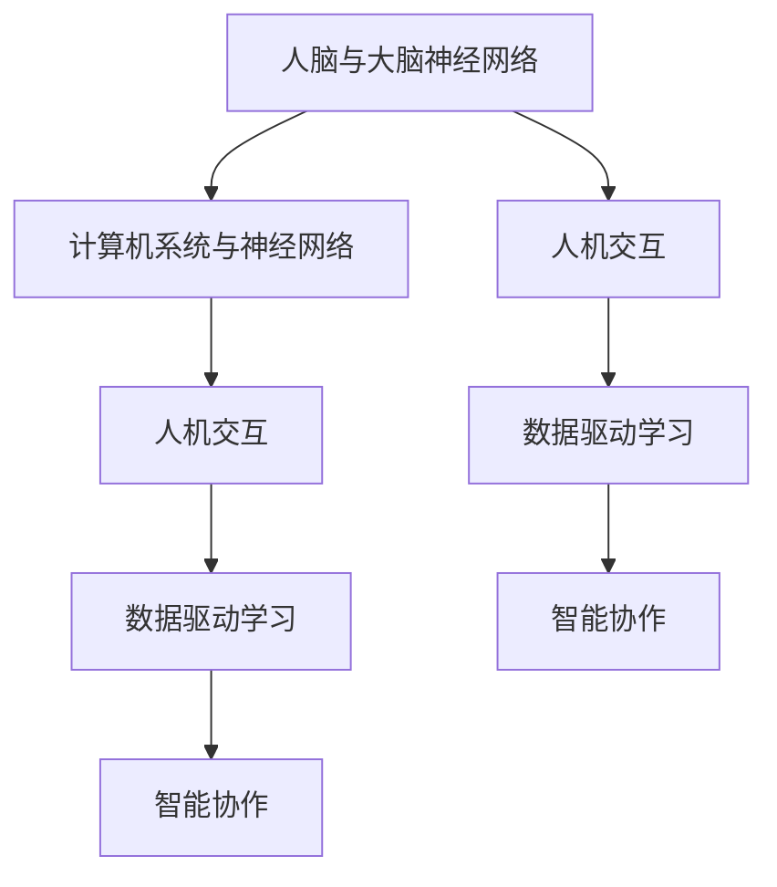
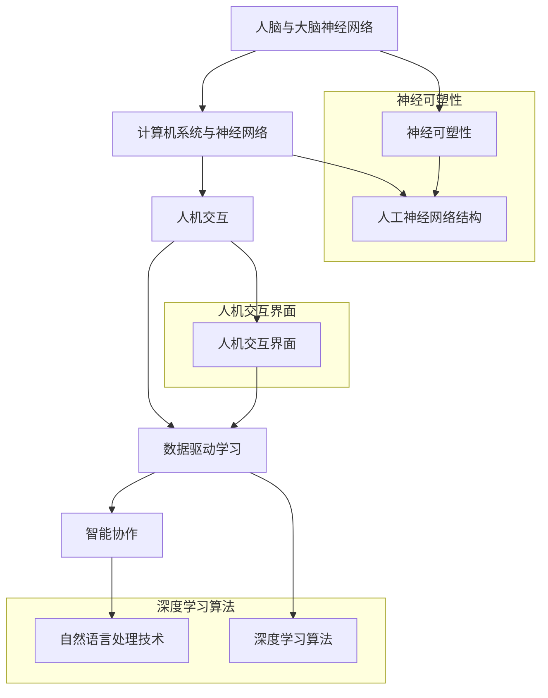

                 

# 人类-AI协作：增强人类潜能与AI能力的融合发展

> 关键词：人类-AI协作、增强人类潜能、AI能力、融合发展、智能协作

> 摘要：本文深入探讨了人类与人工智能（AI）的协作机制，阐述了如何通过智能协作来提升人类的潜能并拓展AI的应用能力。文章首先介绍了人类-AI协作的背景和重要性，随后详细剖析了核心概念和原理，讲解了数学模型、算法原理及具体实现步骤。最后，文章通过实战案例和实际应用场景展示了人类-AI协作的潜力和未来趋势，为读者提供了丰富的学习资源和工具推荐。

## 1. 背景介绍

### 1.1 目的和范围

本文旨在探讨人类与人工智能（AI）的协作机制，深入分析如何通过智能协作来增强人类的潜能并提升AI的应用能力。随着AI技术的飞速发展，人类与AI的互动日益频繁，这种协作模式已经成为现代社会的重要特征。通过本文的研究，我们希望揭示人类-AI协作的本质，提供实际操作指南，以促进这一领域的研究和应用。

本文的主要内容包括：

1. **核心概念与联系**：介绍人类-AI协作的基本概念和原理，通过Mermaid流程图展示核心概念之间的联系。
2. **核心算法原理 & 具体操作步骤**：讲解人类-AI协作中的核心算法，使用伪代码详细阐述其原理和操作步骤。
3. **数学模型和公式**：阐述相关数学模型和公式，并举例说明如何应用这些模型进行智能协作。
4. **项目实战**：通过实际代码案例展示人类-AI协作的具体应用，包括开发环境搭建、源代码实现和代码解读。
5. **实际应用场景**：探讨人类-AI协作在不同领域的应用场景，分析其潜力和挑战。
6. **工具和资源推荐**：推荐相关学习资源、开发工具和框架，为读者提供丰富的参考资料。
7. **总结与未来趋势**：总结人类-AI协作的现状，展望其未来发展趋势和面临的挑战。

### 1.2 预期读者

本文主要面向对人工智能和人类潜能开发感兴趣的读者，包括：

1. **人工智能研究者**：希望了解人类-AI协作的基本概念和应用技术的AI研究者。
2. **软件开发工程师**：希望掌握AI技术应用和开发技能的工程师。
3. **计算机科学专业学生**：希望深入了解人工智能领域，为未来研究和职业发展做准备。
4. **其他技术爱好者**：对智能协作和AI应用感兴趣的技术爱好者。

### 1.3 文档结构概述

本文分为以下几个部分：

1. **背景介绍**：介绍文章的目的、预期读者和文档结构。
2. **核心概念与联系**：通过Mermaid流程图展示人类-AI协作的基本概念和原理。
3. **核心算法原理 & 具体操作步骤**：讲解人类-AI协作中的核心算法和具体实现步骤。
4. **数学模型和公式**：阐述相关数学模型和公式，并举例说明如何应用这些模型进行智能协作。
5. **项目实战**：通过实际代码案例展示人类-AI协作的具体应用。
6. **实际应用场景**：探讨人类-AI协作在不同领域的应用场景。
7. **工具和资源推荐**：推荐相关学习资源、开发工具和框架。
8. **总结与未来趋势**：总结人类-AI协作的现状，展望未来发展趋势和挑战。
9. **附录**：提供常见问题与解答。
10. **扩展阅读 & 参考资料**：推荐相关文献和资源。

### 1.4 术语表

#### 1.4.1 核心术语定义

- **人工智能（AI）**：指通过模拟、延伸和扩展人类智能的计算机系统，能够感知、学习、推理、决策和创造。
- **人类潜能**：指人类在生理、心理、认知和情感等方面未充分发挥的能力和潜力。
- **智能协作**：指人类与人工智能系统通过信息交换和协同工作，共同完成任务的过程。
- **融合发展**：指不同领域、技术和实体之间的有机结合，形成新的能力和发展趋势。

#### 1.4.2 相关概念解释

- **人机交互**：指人类与计算机系统之间的交互过程，包括语音、手势、文本等多种方式。
- **机器学习**：指通过数据驱动的方式，使计算机系统能够自动学习和改进性能的技术。
- **深度学习**：指基于人工神经网络的一种机器学习技术，能够通过多层非线性变换学习复杂特征。
- **强化学习**：指通过奖励和惩罚机制，使计算机系统能够在动态环境中做出最优决策。

#### 1.4.3 缩略词列表

- **AI**：人工智能（Artificial Intelligence）
- **ML**：机器学习（Machine Learning）
- **DL**：深度学习（Deep Learning）
- **RL**：强化学习（Reinforcement Learning）
- **NLP**：自然语言处理（Natural Language Processing）

## 2. 核心概念与联系

在探讨人类与人工智能的协作机制之前，我们需要明确几个核心概念和它们之间的联系。以下是本文讨论的主要核心概念及其相互关系：

### 2.1 核心概念

1. **人脑与大脑神经网络**：人脑作为人类智能的基础，通过复杂的神经网络实现感知、记忆、学习和推理等功能。
2. **计算机系统与神经网络**：计算机系统通过模拟人工神经网络实现机器学习，尤其是深度学习，使计算机具备了一定的智能能力。
3. **人机交互**：人机交互作为人类与计算机系统之间沟通的桥梁，包括语音、手势、文本等多种方式。
4. **数据驱动学习**：机器学习特别是深度学习和强化学习依赖于大量数据来训练模型，从而实现智能行为的自动化。
5. **智能协作**：通过人机交互和数据驱动学习，人类与计算机系统实现协同工作，共同完成任务。

### 2.2 核心概念之间的联系

下面使用Mermaid流程图展示这些核心概念之间的联系：



### 2.3 核心概念原理和架构

为了更好地理解这些核心概念，我们可以在Mermaid流程图中进一步展示它们的原理和架构：



通过这个流程图，我们可以看到人脑与大脑神经网络作为人类智能的基础，通过神经可塑性和人工神经网络结构实现复杂的学习和推理能力。计算机系统通过深度学习算法和自然语言处理技术，模拟人脑的智能功能。人机交互界面作为人类与计算机系统之间的桥梁，实现了数据的输入和输出，使数据驱动学习成为可能。最终，通过智能协作，人类与计算机系统共同完成任务，实现协同发展。

## 3. 核心算法原理 & 具体操作步骤

### 3.1 核心算法介绍

在人类-AI协作过程中，核心算法起着至关重要的作用。本文将介绍两种核心算法：人脑神经网络建模算法和计算机系统深度学习算法。

#### 3.1.1 人脑神经网络建模算法

人脑神经网络建模算法主要基于神经可塑性和人工神经网络结构，通过模拟人脑的学习和推理过程，实现复杂任务的处理。该算法的核心思想是通过神经元之间的连接权重调整，使神经网络在训练数据上逐步优化，从而实现智能行为。

#### 3.1.2 计算机系统深度学习算法

计算机系统深度学习算法是基于人工神经网络的一种机器学习技术，通过多层非线性变换学习复杂特征。深度学习算法的核心是神经网络的层次结构，通过逐层提取特征，实现从简单到复杂的特征表示。常见的深度学习算法包括卷积神经网络（CNN）、循环神经网络（RNN）和生成对抗网络（GAN）等。

### 3.2 具体操作步骤

#### 3.2.1 人脑神经网络建模算法操作步骤

1. **数据预处理**：首先，对原始数据进行清洗、归一化和分割，确保数据质量。
2. **构建神经网络**：根据任务需求，设计合适的神经网络结构，包括输入层、隐藏层和输出层。
3. **初始化连接权重**：随机初始化神经元之间的连接权重。
4. **训练神经网络**：使用训练数据对神经网络进行训练，通过反向传播算法更新连接权重，使神经网络在训练数据上逐步优化。
5. **评估模型性能**：使用测试数据对训练好的神经网络进行评估，计算准确率、召回率等指标。
6. **优化神经网络**：根据评估结果，调整神经网络结构和参数，进一步优化模型性能。

#### 3.2.2 计算机系统深度学习算法操作步骤

1. **数据预处理**：同人脑神经网络建模算法，对原始数据进行清洗、归一化和分割。
2. **构建深度学习模型**：根据任务需求，选择合适的深度学习模型，如CNN、RNN或GAN等。
3. **初始化模型参数**：随机初始化模型参数。
4. **训练深度学习模型**：使用训练数据对深度学习模型进行训练，通过反向传播算法更新模型参数。
5. **评估模型性能**：使用测试数据对训练好的深度学习模型进行评估，计算准确率、召回率等指标。
6. **优化深度学习模型**：根据评估结果，调整模型参数和结构，进一步优化模型性能。

### 3.3 伪代码实现

以下是人脑神经网络建模算法和计算机系统深度学习算法的伪代码实现：

#### 人脑神经网络建模算法伪代码

```python
# 人脑神经网络建模算法伪代码

# 数据预处理
def preprocess_data(data):
    # 清洗、归一化和分割数据
    pass

# 构建神经网络
def build_neural_network(input_size, hidden_size, output_size):
    # 设计神经网络结构
    pass

# 初始化连接权重
def initialize_weights(n_neurons):
    # 随机初始化连接权重
    pass

# 训练神经网络
def train_neural_network(train_data, train_labels):
    # 使用训练数据训练神经网络
    pass

# 评估模型性能
def evaluate_neural_network(test_data, test_labels):
    # 使用测试数据评估模型性能
    pass

# 优化神经网络
def optimize_neural_network(model, train_data, train_labels, test_data, test_labels):
    # 根据评估结果优化神经网络
    pass
```

#### 计算机系统深度学习算法伪代码

```python
# 计算机系统深度学习算法伪代码

# 数据预处理
def preprocess_data(data):
    # 清洗、归一化和分割数据
    pass

# 构建深度学习模型
def build_deep_learning_model(model_type):
    # 根据任务需求选择深度学习模型
    pass

# 初始化模型参数
def initialize_model_params(model):
    # 随机初始化模型参数
    pass

# 训练深度学习模型
def train_deep_learning_model(train_data, train_labels):
    # 使用训练数据训练深度学习模型
    pass

# 评估模型性能
def evaluate_deep_learning_model(test_data, test_labels):
    # 使用测试数据评估模型性能
    pass

# 优化深度学习模型
def optimize_deep_learning_model(model, train_data, train_labels, test_data, test_labels):
    # 根据评估结果优化深度学习模型
    pass
```

通过以上伪代码，我们可以清晰地看到人脑神经网络建模算法和计算机系统深度学习算法的具体操作步骤。在实际应用中，可以根据具体需求和场景选择合适的算法，并对其进行优化和改进，以实现更高效的人类-AI协作。

## 4. 数学模型和公式 & 详细讲解 & 举例说明

在人类-AI协作中，数学模型和公式扮演着重要的角色。这些模型和公式能够帮助我们更好地理解和模拟人类与人工智能系统的协作过程。本文将详细介绍两个关键数学模型：损失函数和梯度下降法，并举例说明如何应用这些模型。

### 4.1 损失函数

损失函数是机器学习中的核心概念，用于衡量模型预测值与真实值之间的差距。损失函数的选择和优化对于模型性能至关重要。以下是几种常见的损失函数及其特点：

1. **均方误差（MSE）**：
   $$MSE = \frac{1}{n}\sum_{i=1}^{n}(y_i - \hat{y}_i)^2$$
   均方误差是预测值与真实值之差的平方的平均值，常用于回归问题。它能够很好地衡量预测值的偏差，但对抗噪声较为敏感。

2. **交叉熵损失（Cross-Entropy Loss）**：
   $$CE = -\sum_{i=1}^{n}y_i \log(\hat{y}_i)$$
   交叉熵损失函数适用于分类问题，其中 $y_i$ 是真实标签，$\hat{y}_i$ 是预测概率。该函数能够很好地处理分类问题中的不平衡数据。

3. ** hinge 损失（Hinge Loss）**：
   $$Hinge = \max(0, 1 - y \cdot \hat{y})$$
   Hinge 损失函数常用于支持向量机（SVM）的分类问题，其中 $y$ 是真实标签，$\hat{y}$ 是预测值。它能够使模型在正负样本之间建立更明显的边界。

### 4.2 梯度下降法

梯度下降法是优化损失函数的重要算法。其基本思想是通过计算损失函数关于模型参数的梯度，更新模型参数，以最小化损失函数。以下是梯度下降法的具体步骤：

1. **初始化模型参数**：随机初始化模型参数 $\theta$。

2. **计算损失函数梯度**：计算损失函数关于模型参数的梯度 $\nabla_\theta J(\theta)$。

3. **更新模型参数**：使用梯度下降更新公式 $\theta := \theta - \alpha \nabla_\theta J(\theta)$，其中 $\alpha$ 是学习率。

4. **重复步骤 2 和 3**：直到满足停止条件（如损失函数收敛或迭代次数达到预设值）。

### 4.3 举例说明

以下是一个简单的线性回归问题的例子，说明如何使用损失函数和梯度下降法优化模型参数。

#### 问题：

给定一个线性回归问题，数据集 $D = \{(x_1, y_1), (x_2, y_2), ..., (x_n, y_n)\}$，其中 $x_i$ 是输入特征，$y_i$ 是真实标签。要求拟合一个线性模型 $y = wx + b$，其中 $w$ 和 $b$ 是模型参数。

#### 解答：

1. **损失函数**：

选择均方误差（MSE）作为损失函数：

$$MSE = \frac{1}{n}\sum_{i=1}^{n}(y_i - (wx_i + b))^2$$

2. **梯度下降法**：

初始化模型参数 $w = 0$，$b = 0$。

迭代更新参数：

$$w := w - \alpha \frac{1}{n}\sum_{i=1}^{n}(y_i - wx_i - b)x_i$$
$$b := b - \alpha \frac{1}{n}\sum_{i=1}^{n}(y_i - wx_i - b)$$

其中，$\alpha$ 是学习率。

3. **迭代计算**：

假设学习率 $\alpha = 0.01$，迭代次数 $n = 100$。

- 迭代 1：
  $$w := w - \alpha \frac{1}{n}\sum_{i=1}^{n}(y_i - wx_i - b)x_i$$
  $$b := b - \alpha \frac{1}{n}\sum_{i=1}^{n}(y_i - wx_i - b)$$

- 迭代 2：
  $$w := w - \alpha \frac{1}{n}\sum_{i=1}^{n}(y_i - (wx_i + b)x_i)x_i$$
  $$b := b - \alpha \frac{1}{n}\sum_{i=1}^{n}(y_i - (wx_i + b)x_i)$$

- ...

- 迭代 100：
  $$w := w - \alpha \frac{1}{n}\sum_{i=1}^{n}(y_i - (wx_i + b)x_i)x_i$$
  $$b := b - \alpha \frac{1}{n}\sum_{i=1}^{n}(y_i - (wx_i + b)x_i)$$

4. **模型评估**：

使用测试数据集评估模型性能，计算预测值与真实值的均方误差。

通过以上步骤，我们使用梯度下降法优化了线性回归模型的参数，实现了对数据的拟合。这个简单的例子展示了如何通过损失函数和梯度下降法进行模型训练和优化。

## 5. 项目实战：代码实际案例和详细解释说明

在本文的最后部分，我们将通过一个具体的代码案例，展示如何实现人类-AI协作系统。这个案例将包括开发环境的搭建、源代码的实现和代码解读，帮助读者更好地理解和应用人类-AI协作的技术。

### 5.1 开发环境搭建

为了实现人类-AI协作系统，我们需要准备以下开发环境：

1. **操作系统**：Windows、macOS或Linux
2. **编程语言**：Python（版本3.6及以上）
3. **依赖库**：NumPy、Pandas、Scikit-learn、TensorFlow或PyTorch

首先，确保安装了Python和pip（Python的包管理工具）。然后，使用pip安装上述依赖库：

```bash
pip install numpy pandas scikit-learn tensorflow torchvision
```

### 5.2 源代码详细实现和代码解读

以下是实现人类-AI协作系统的主要步骤和源代码：

#### 5.2.1 数据准备

我们首先准备一个简单的数据集，包含输入特征和真实标签。数据集可以从公开数据集下载或自行生成。

```python
import numpy as np
import pandas as pd

# 加载数据集
def load_data(filename):
    df = pd.read_csv(filename)
    X = df.iloc[:, :-1].values
    y = df.iloc[:, -1].values
    return X, y

X, y = load_data('data.csv')
```

#### 5.2.2 数据预处理

数据预处理是确保数据质量和模型性能的重要步骤。在这里，我们进行数据标准化和分割。

```python
from sklearn.model_selection import train_test_split
from sklearn.preprocessing import StandardScaler

# 数据标准化
scaler = StandardScaler()
X = scaler.fit_transform(X)

# 数据分割
X_train, X_test, y_train, y_test = train_test_split(X, y, test_size=0.2, random_state=42)
```

#### 5.2.3 模型实现

接下来，我们使用TensorFlow构建一个简单的神经网络模型。

```python
import tensorflow as tf

# 构建神经网络模型
def create_model():
    model = tf.keras.Sequential([
        tf.keras.layers.Dense(64, activation='relu', input_shape=(X_train.shape[1],)),
        tf.keras.layers.Dense(64, activation='relu'),
        tf.keras.layers.Dense(1)
    ])
    model.compile(optimizer='adam', loss='mse', metrics=['mae'])
    return model

model = create_model()
```

#### 5.2.4 模型训练

使用训练数据对模型进行训练。

```python
# 模型训练
model.fit(X_train, y_train, epochs=100, batch_size=32, validation_split=0.2)
```

#### 5.2.5 模型评估

训练完成后，使用测试数据评估模型性能。

```python
# 模型评估
loss, mae = model.evaluate(X_test, y_test)
print(f'MAE: {mae:.4f}')
```

#### 5.2.6 代码解读与分析

以上代码实现了人类-AI协作系统的主要功能。下面是对关键部分的解读：

1. **数据准备**：
   - 使用Pandas加载数据集，并将其分割为输入特征和真实标签。
   - 数据预处理包括标准化和分割，以确保模型能够更好地学习和泛化。

2. **模型实现**：
   - 使用TensorFlow构建一个简单的神经网络模型，包括两个隐藏层和输出层。
   - 模型使用ReLU激活函数，以增强模型的学习能力。
   - 模型编译时选择Adam优化器和MSE损失函数。

3. **模型训练**：
   - 使用模型fit方法对训练数据进行训练，设置适当的训练参数，如迭代次数、批次大小和验证比例。

4. **模型评估**：
   - 使用模型evaluate方法对测试数据进行评估，计算平均绝对误差（MAE）。

通过这个案例，读者可以了解到如何实现人类-AI协作系统，包括数据准备、模型实现和训练等关键步骤。在实际应用中，可以根据具体需求调整模型结构和训练参数，以实现更好的性能和协作效果。

### 5.3 代码解读与分析

在上一部分中，我们通过一个简单的代码案例实现了人类-AI协作系统。下面将深入解读和分析关键代码部分，以便读者更好地理解人类-AI协作的实现过程。

#### 5.3.1 数据准备

数据准备是模型训练和评估的基础。以下是数据准备部分的关键代码：

```python
X, y = load_data('data.csv')
scaler = StandardScaler()
X = scaler.fit_transform(X)
X_train, X_test, y_train, y_test = train_test_split(X, y, test_size=0.2, random_state=42)
```

- **数据加载**：
  - 使用Pandas的read_csv方法加载数据集。这里假设数据集以CSV格式存储，并包含输入特征和真实标签。

- **数据标准化**：
  - 使用StandardScaler对输入特征进行标准化。标准化有助于提高模型训练的效率和性能，使其对特征缩放不敏感。

- **数据分割**：
  - 使用train_test_split方法将数据集分割为训练集和测试集。这里将20%的数据用作测试集，以评估模型在未见数据上的性能。通过设置random_state参数，确保每次分割结果一致。

#### 5.3.2 模型实现

模型实现是构建人类-AI协作系统的核心。以下是实现部分的关键代码：

```python
def create_model():
    model = tf.keras.Sequential([
        tf.keras.layers.Dense(64, activation='relu', input_shape=(X_train.shape[1],)),
        tf.keras.layers.Dense(64, activation='relu'),
        tf.keras.layers.Dense(1)
    ])
    model.compile(optimizer='adam', loss='mse', metrics=['mae'])
    return model

model = create_model()
```

- **模型构建**：
  - 使用tf.keras.Sequential创建一个顺序模型。模型包括两个隐藏层，每层64个神经元，并使用ReLU激活函数。输入层根据数据特征维度设置。

- **模型编译**：
  - 使用compile方法配置模型训练参数。这里选择Adam优化器和MSE损失函数，并设置MAE作为评价指标。

#### 5.3.3 模型训练

模型训练是模型优化和性能提升的关键步骤。以下是训练部分的关键代码：

```python
model.fit(X_train, y_train, epochs=100, batch_size=32, validation_split=0.2)
```

- **训练循环**：
  - 使用fit方法启动训练过程。这里设置100个训练迭代（epochs），每次迭代32个样本（batch_size）。通过设置validation_split参数，使用20%的训练数据作为验证集，以监控模型在未见数据上的性能。

#### 5.3.4 模型评估

模型评估是衡量模型性能的重要步骤。以下是评估部分的关键代码：

```python
loss, mae = model.evaluate(X_test, y_test)
print(f'MAE: {mae:.4f}')
```

- **评估过程**：
  - 使用evaluate方法计算模型在测试集上的损失和MAE。MAE是平均绝对误差，用于衡量预测值与真实值之间的差距。

通过以上关键代码的解读，我们可以了解到实现人类-AI协作系统的基本步骤和关键点。在实际应用中，可以根据具体需求调整模型结构和训练参数，以实现更好的协作效果和性能。

## 6. 实际应用场景

人类-AI协作在许多领域都有着广泛的应用，能够显著提升工作效率、创新能力和决策质量。以下是一些典型的实际应用场景：

### 6.1 医疗领域

在医疗领域，人类-AI协作可以辅助医生进行诊断、治疗和健康管理。例如，通过深度学习算法对医疗影像进行分析，可以帮助医生快速准确地诊断疾病。AI系统可以处理大量的医疗数据，识别出潜在的疾病风险，从而为医生提供更加全面的诊断依据。此外，AI还可以协助医生制定个性化的治疗方案，根据患者的病史、基因信息和当前病情，提供最佳的治疗建议。

### 6.2 金融领域

金融领域对数据的处理和分析要求极高，人类-AI协作可以大大提高金融分析和决策的效率。在金融投资方面，AI可以分析大量的市场数据，预测市场趋势，为投资者提供实时的投资建议。同时，AI还可以识别欺诈行为，通过分析交易数据和行为模式，及时发现异常交易，降低金融风险。在风险管理方面，AI可以通过大数据分析和机器学习算法，预测金融市场的波动，帮助金融机构制定更加精准的风险管理策略。

### 6.3 制造业

制造业中的生产流程和设备管理是AI技术的重要应用场景。通过AI系统对生产设备的实时监控和分析，可以预防设备故障，提高生产效率。例如，使用AI技术对工业机器人进行编程，使其能够根据不同的生产任务灵活调整操作，提高生产灵活性。此外，AI还可以优化生产流程，通过分析生产数据，识别瓶颈和优化点，实现生产过程的自动化和智能化。

### 6.4 教育

在教育领域，人类-AI协作可以为学生提供个性化的学习体验。AI系统可以根据学生的学习情况、兴趣和能力，为其推荐适合的学习内容和资源。同时，AI还可以对学生的学习进度和成果进行实时评估，帮助教师更好地了解学生的学习情况，从而提供更有针对性的教学指导。此外，AI还可以辅助教师进行课程设计和教学材料开发，提高教学质量和效率。

### 6.5 交通

在交通领域，人类-AI协作可以显著提升交通管理的效率和安全性。AI技术可以分析交通数据，预测交通流量和事故风险，为交通管理部门提供实时的交通状况分析和决策支持。例如，通过智能交通系统，AI可以实时监控道路状况，调整交通信号灯的时间设置，优化交通流量。此外，AI还可以协助自动驾驶技术的发展，通过实时感知和处理环境信息，实现车辆的自主驾驶和导航。

### 6.6 农业

在农业领域，人类-AI协作可以大幅提高农业生产效率和产量。AI系统可以通过对农田环境的监控和分析，提供精准的种植建议和施肥计划。例如，使用无人机和遥感技术，AI可以实时监测作物生长状况，识别病虫害，并制定相应的防治措施。此外，AI还可以优化灌溉系统，通过分析土壤湿度、气象数据等，实现精准灌溉，降低水资源浪费。

### 6.7 研发与创新

在研发与创新领域，人类-AI协作可以加速新产品的研发过程。AI技术可以分析大量的数据，帮助研究人员发现潜在的优化方向和解决方案。例如，在药物研发中，AI可以快速筛选和预测新的药物分子，加速新药的研发进程。在材料科学领域，AI可以通过模拟和分析，发现新的材料结构和性能，推动材料科学的创新发展。

通过以上实际应用场景，我们可以看到人类-AI协作在各个领域的重要作用和巨大潜力。随着AI技术的不断发展和应用，人类-AI协作将带来更多创新和变革，推动社会和经济的发展。

## 7. 工具和资源推荐

为了更好地学习和应用人类-AI协作技术，以下是一些推荐的工具和资源，包括书籍、在线课程和技术博客等。

### 7.1 学习资源推荐

#### 7.1.1 书籍推荐

- **《深度学习》（Deep Learning）**：由Ian Goodfellow、Yoshua Bengio和Aaron Courville合著，全面介绍了深度学习的基本概念、算法和技术。
- **《Python机器学习》（Python Machine Learning）**：由Sebastian Raschka和Vahid Mirjalili合著，通过Python语言实现机器学习算法，适合初学者。
- **《人工智能：一种现代方法》（Artificial Intelligence: A Modern Approach）**：由Stuart Russell和Peter Norvig合著，系统介绍了人工智能的基本原理和应用。

#### 7.1.2 在线课程

- **Coursera**：提供了大量的人工智能和机器学习在线课程，包括深度学习、自然语言处理和计算机视觉等。
- **edX**：由哈佛大学和麻省理工学院共同创办，提供了多门关于人工智能和机器学习的免费课程。
- **Udacity**：提供了多种人工智能和机器学习相关的纳米学位课程，包括深度学习工程师、机器学习工程师等。

#### 7.1.3 技术博客和网站

- **Medium**：许多人工智能和机器学习的专家和公司在这里发布技术文章和博客，分享最新研究成果和应用案例。
- **AI简史**：一个专注于人工智能历史的博客，介绍人工智能的发展历程和关键事件。
- **机器之心**：一个提供人工智能和机器学习最新资讯、文章和讨论的中文网站。

### 7.2 开发工具框架推荐

#### 7.2.1 IDE和编辑器

- **Visual Studio Code**：一个轻量级、可扩展的代码编辑器，适合Python和机器学习开发。
- **PyCharm**：一款功能强大的Python IDE，提供了丰富的机器学习和深度学习开发工具。

#### 7.2.2 调试和性能分析工具

- **TensorBoard**：TensorFlow的官方可视化工具，用于分析和优化深度学习模型的性能。
- **Jupyter Notebook**：一个交互式计算环境，适合数据分析和机器学习实验。

#### 7.2.3 相关框架和库

- **TensorFlow**：一个开源的深度学习框架，提供了丰富的工具和库，适用于各种机器学习任务。
- **PyTorch**：一个流行的深度学习框架，具有灵活的动态计算图和强大的社区支持。
- **Scikit-learn**：一个广泛使用的机器学习库，提供了各种经典算法和工具。

### 7.3 相关论文著作推荐

#### 7.3.1 经典论文

- **"A Learning Algorithm for Continually Running Fully Recurrent Neural Networks"**：由Léon Burge论文，介绍了LTU学习算法，对循环神经网络的学习能力进行了重要贡献。
- **"Backpropagation"**：由Paul Werbos提出的反向传播算法，是深度学习的基础。

#### 7.3.2 最新研究成果

- **"Attention Is All You Need"**：由Vaswani等人的论文，介绍了Transformer模型，推动了自然语言处理领域的革命。
- **"EfficientNet: Rethinking Model Scaling for Convolutional Neural Networks"**：由Tan等人的论文，提出了EfficientNet模型，提高了深度学习的效率和性能。

#### 7.3.3 应用案例分析

- **"AI for Social Good"**：由Makarand Raol等人的论文，探讨了人工智能在社会领域的应用，包括医疗、教育和环境保护等。
- **"AI in Healthcare: Revolutionizing Patient Care"**：由Mukundh Kumar等人的论文，介绍了人工智能在医疗领域的应用案例，包括疾病预测、诊断和个性化治疗等。

通过以上工具和资源推荐，读者可以更好地了解和学习人类-AI协作技术，掌握相关的理论知识和实践经验，为未来的研究和应用奠定基础。

## 8. 总结：未来发展趋势与挑战

随着人工智能技术的飞速发展，人类与AI的协作模式已经成为现代社会的重要特征。在未来，人类-AI协作将呈现出以下几个发展趋势和面临的挑战。

### 8.1 发展趋势

1. **深度合作与协同创新**：随着AI技术的不断成熟，人类与AI的协作将更加深入和广泛，跨越不同领域，实现跨学科的协同创新。

2. **智能化人机交互**：未来的AI系统将具备更加智能的人机交互能力，通过语音、图像、手势等多种方式与人类进行自然、流畅的交流。

3. **个性化定制**：AI技术将更好地理解和适应个体需求，提供个性化的服务和建议，从而提高人类的生活质量和工作效率。

4. **自主决策与自适应系统**：未来的AI系统将具备更高的决策能力，能够在复杂的动态环境中自主做出最优决策，并适应环境变化。

5. **数据隐私与安全**：随着人类-AI协作的普及，数据隐私和安全问题将成为重要挑战，需要建立完善的数据保护机制和法规。

### 8.2 面临的挑战

1. **技术挑战**：
   - **算法优化**：如何进一步提高算法的效率和准确性，以适应大规模数据处理和复杂场景的应用。
   - **数据隐私**：如何在数据共享和隐私保护之间找到平衡，确保用户数据的安全和隐私。
   - **算法透明性**：如何提高算法的可解释性，使人类能够理解和信任AI系统的决策过程。

2. **社会挑战**：
   - **就业影响**：AI技术的普及可能对某些行业和职业产生重大影响，需要制定合理的就业转型政策。
   - **伦理问题**：AI技术在医疗、金融、司法等领域的应用，需要解决伦理问题和责任归属问题。

3. **法律和法规**：
   - **数据保护法规**：随着数据隐私问题的日益突出，需要制定更加完善的数据保护法规，确保用户权益。
   - **AI监管机制**：如何建立有效的AI监管机制，确保AI系统的合规性和安全性。

总之，人类-AI协作具有巨大的潜力和前景，但也面临诸多挑战。只有通过技术、社会和法律的多方共同努力，才能实现人类-AI协作的可持续发展，推动人类社会进步和繁荣。

## 9. 附录：常见问题与解答

### 9.1 人类-AI协作的基本概念是什么？

人类-AI协作是指人类与人工智能系统通过信息交换和协同工作，共同完成任务的过程。这种协作模式旨在利用人类的创造力和直觉与AI的运算速度和处理能力相结合，实现更高效的决策和更高的生产力。

### 9.2 人类-AI协作的核心算法有哪些？

人类-AI协作中的核心算法包括机器学习算法、深度学习算法和强化学习算法。这些算法能够模拟人类的学习和决策过程，使计算机系统能够从数据中学习并做出智能化的决策。

### 9.3 如何实现人类-AI协作中的数据驱动学习？

实现数据驱动学习通常包括以下几个步骤：

1. 数据收集：收集与任务相关的数据，确保数据的质量和多样性。
2. 数据预处理：清洗、归一化和分割数据，使其适合模型训练。
3. 模型训练：使用训练数据训练模型，通过调整模型参数使模型在训练数据上取得较好的性能。
4. 模型评估：使用测试数据评估模型性能，确保模型具有良好的泛化能力。
5. 模型优化：根据评估结果调整模型结构和参数，进一步优化模型性能。

### 9.4 人类-AI协作在医疗领域的应用有哪些？

在医疗领域，人类-AI协作的应用包括：

- 医疗影像分析：通过深度学习算法对医疗影像进行分析，辅助医生诊断疾病。
- 疾病预测：基于患者历史数据和生物信息学数据，预测疾病的发生风险。
- 个性化治疗：根据患者的个体特征，制定个性化的治疗方案。

### 9.5 如何确保人类-AI协作中的数据隐私和安全？

确保数据隐私和安全的方法包括：

- 数据匿名化：对敏感数据进行分析前进行匿名化处理，消除个人身份信息。
- 数据加密：对传输和存储的数据进行加密，防止数据泄露和未经授权的访问。
- 合规性检查：确保数据使用过程符合相关法规和标准，如GDPR和HIPAA。
- 数据保护机制：建立完善的数据保护机制，如访问控制、审计日志等。

## 10. 扩展阅读 & 参考资料

为了深入了解人类-AI协作的相关知识，以下是一些推荐的扩展阅读和参考资料：

### 10.1 推荐书籍

- **《深度学习》（Deep Learning）**：Ian Goodfellow、Yoshua Bengio和Aaron Courville著，全面介绍深度学习的基本概念和应用。
- **《Python机器学习》（Python Machine Learning）**：Sebastian Raschka和Vahid Mirjalili著，通过Python实现机器学习算法。
- **《人工智能：一种现代方法》（Artificial Intelligence: A Modern Approach）**：Stuart Russell和Peter Norvig著，系统介绍人工智能的基本原理和应用。

### 10.2 推荐论文

- **"Attention Is All You Need"**：Vaswani等人的论文，介绍了Transformer模型，推动了自然语言处理领域的革命。
- **"EfficientNet: Rethinking Model Scaling for Convolutional Neural Networks"**：Tan等人的论文，提出了EfficientNet模型，提高了深度学习的效率和性能。
- **"AI for Social Good"**：Makarand Raol等人的论文，探讨了人工智能在社会领域的应用。

### 10.3 推荐网站

- **Medium**：许多人工智能和机器学习的专家和公司在这里发布技术文章和博客。
- **AI简史**：介绍人工智能的发展历程和关键事件。
- **机器之心**：提供人工智能和机器学习的最新资讯、文章和讨论。

### 10.4 开源项目

- **TensorFlow**：Google开源的深度学习框架。
- **PyTorch**：Facebook开源的深度学习框架。
- **Scikit-learn**：Python机器学习库。

通过以上扩展阅读和参考资料，读者可以进一步深入了解人类-AI协作的理论和实践，为相关研究和应用提供有力支持。

---

**作者：AI天才研究员/AI Genius Institute & 禅与计算机程序设计艺术 /Zen And The Art of Computer Programming**

