                 

### 人类-AI协作：增强人类潜能与AI能力的融合发展前景

> **关键词：** 人类-AI协作、人工智能、增强现实、人机交互、潜能激发、AI应用场景
>
> **摘要：** 本文将探讨人类与人工智能协作的原理、关键技术和实际应用场景，分析这种融合对人类潜能的激发与AI能力的提升带来的深远影响。通过深入剖析人类-AI协作的核心概念、算法原理、数学模型和项目实战，本文旨在为读者提供一幅关于未来智能协同发展的全景图。

---

**文章标题：人类-AI协作：增强人类潜能与AI能力的融合发展前景**

**关键词：** 人类-AI协作、人工智能、增强现实、人机交互、潜能激发、AI应用场景

**摘要：** 本文将深入探讨人类与人工智能协作的原理及其对人类潜能和AI能力的影响。通过分析核心概念、算法原理、数学模型以及项目实战，本文旨在揭示人类-AI协作的未来前景，为读者提供有益的参考和启示。

---

**1. 背景介绍**

#### 1.1 目的和范围

本文的目的是探讨人类与人工智能（AI）的协作原理及其对人类社会发展的潜在影响。我们旨在分析这种协作如何增强人类潜能和提升AI能力，并探讨其可能的未来应用场景。本文将涵盖以下几个方面：

- 人类-AI协作的核心概念和原理
- 关键技术和算法原理
- 数学模型和公式
- 项目实战案例
- 实际应用场景
- 未来发展趋势与挑战

#### 1.2 预期读者

本文适合对人工智能和计算机科学感兴趣的读者，包括：

- 计算机科学学生和研究人员
- AI领域开发者和技术专家
- 企业管理层和创业者
- 对未来智能技术发展感兴趣的普通读者

#### 1.3 文档结构概述

本文分为十个主要部分：

1. 背景介绍
2. 核心概念与联系
3. 核心算法原理 & 具体操作步骤
4. 数学模型和公式 & 详细讲解 & 举例说明
5. 项目实战：代码实际案例和详细解释说明
6. 实际应用场景
7. 工具和资源推荐
8. 总结：未来发展趋势与挑战
9. 附录：常见问题与解答
10. 扩展阅读 & 参考资料

#### 1.4 术语表

- **人类-AI协作**：指人类与人工智能系统之间通过信息交换、知识共享和协同操作实现共同目标的过程。
- **增强现实（AR）**：通过计算机技术将虚拟信息叠加到现实世界中，增强用户的感知体验。
- **人机交互（HCI）**：研究人与计算机之间的交互关系，旨在设计出更加自然、直观和高效的交互界面。
- **潜能激发**：指通过特定的方法或技术，挖掘并发挥人类在认知、创造、学习等方面的潜在能力。
- **AI应用场景**：指人工智能在特定领域或行业中的应用实例。

#### 1.4.1 核心术语定义

- **人工智能**：一种模拟人类智能行为的计算机系统，能够通过学习和适应完成特定的任务。
- **机器学习**：一种人工智能的方法，通过数据训练模型来实现对未知数据的预测和分类。
- **深度学习**：一种机器学习方法，利用多层神经网络对复杂数据进行特征提取和学习。
- **自然语言处理（NLP）**：一种人工智能技术，使计算机能够理解和处理自然语言。

#### 1.4.2 相关概念解释

- **增强现实（AR）**：增强现实技术通过在用户视野中叠加虚拟信息，使用户能够与现实环境互动。常见的应用有游戏、教育、医疗等领域。
- **人机交互（HCI）**：人机交互是研究人与计算机之间交互方式、交互界面和交互体验的学科。其目标是设计出更加人性化、高效和自然的交互方式。
- **潜能激发**：潜能激发是指通过各种手段，如训练、激励、挑战等，激发人类在认知、情感、创造等方面的潜在能力。
- **AI应用场景**：AI应用场景是指人工智能技术在特定领域或行业中的应用实例，如自动驾驶、智能医疗、金融分析等。

#### 1.4.3 缩略词列表

- AI：人工智能
- ML：机器学习
- AR：增强现实
- VR：虚拟现实
- NLP：自然语言处理
- HCI：人机交互

---

**2. 核心概念与联系**

在探讨人类与AI协作的核心概念之前，我们需要明确几个基本概念：人类潜能、AI能力以及人机交互。这些概念构成了人类-AI协作的基础。

#### 2.1 人类潜能

人类潜能是指人类在认知、情感、创造、学习等方面未被完全发挥的潜在能力。这些潜能包括但不限于：

- **认知潜能**：指人类在感知、记忆、思维、推理等方面的能力。
- **情感潜能**：指人类在情感体验、情绪表达、情感调节等方面的能力。
- **创造潜能**：指人类在创新、发明、艺术创作等方面的能力。
- **学习潜能**：指人类在学习、适应、迁移等方面的能力。

#### 2.2 AI能力

AI能力是指人工智能系统在特定任务上的执行能力，包括：

- **感知能力**：指AI在图像、声音、文本等数据上的识别和理解能力。
- **推理能力**：指AI在逻辑推理、决策制定等方面的能力。
- **学习能力**：指AI在数据训练、模型优化等方面的能力。
- **交互能力**：指AI在与人类或其他系统交互时的响应和理解能力。

#### 2.3 人机交互

人机交互（HCI）是研究人与计算机之间交互关系和交互体验的学科。人机交互的核心目标是设计出更加自然、高效和人性化的交互方式。关键要素包括：

- **交互界面**：指用户与计算机系统进行交互的界面，包括图形界面、语音界面、手势界面等。
- **交互体验**：指用户在使用计算机系统时的感受和体验，包括易用性、响应速度、互动性等。
- **交互模型**：指描述用户与计算机系统之间交互过程和交互内容的模型，如任务模型、用户模型等。

#### 2.4 Mermaid 流程图

为了更直观地展示人类与AI协作的核心概念和联系，我们可以使用Mermaid流程图进行描述。以下是该流程图的一个简单示例：

```mermaid
graph TD
    A[人类潜能] --> B[认知]
    A --> C[情感]
    A --> D[创造]
    A --> E[学习]
    F[AI能力] --> G[感知]
    F --> H[推理]
    F --> I[学习]
    F --> J[交互]
    B --> K[记忆]
    B --> L[思维]
    B --> M[推理]
    C --> N[情感体验]
    C --> O[情绪表达]
    C --> P[情感调节]
    D --> Q[创新]
    D --> R[发明]
    D --> S[艺术创作]
    E --> T[学习]
    E --> U[适应]
    E --> V[迁移]
    G --> W[图像识别]
    G --> X[声音识别]
    G --> Y[文本理解]
    H --> Z[逻辑推理]
    H --> AA[决策制定]
    I --> AB[数据训练]
    I --> AC[模型优化]
    J --> AD[响应理解]
    J --> AE[交互体验]
    B --> AF[HCI]
    C --> AG[HCI]
    D --> AH[HCI]
    E --> AI[HCI]
    G --> AJ[HCI]
    H --> AK[HCI]
    I --> AL[HCI]
    J --> AM[HCI]
```



#### 2.5 核心概念联系分析

通过上述核心概念和Mermaid流程图，我们可以看出人类与AI协作的几个关键联系：

- **潜能激发与AI能力**：人类潜能的激发可以为AI系统提供更丰富的数据来源和更复杂的任务需求，从而推动AI能力的提升。例如，通过认知潜能的激发，人类可以为AI系统提供更多的图像、文本和声音数据，以提升其感知能力和理解能力。
- **人机交互与潜能激发**：人机交互技术为人与AI协作提供了桥梁，使得人类能够更好地激发自己的潜能。例如，通过自然语言处理技术，人类可以更便捷地与AI系统进行交互，从而更高效地完成复杂任务。
- **AI能力与人机交互**：AI能力的提升为人机交互带来了新的可能性和挑战。例如，智能助手和智能机器人可以更好地理解人类的意图和需求，从而提供更加个性化的服务。

---

**3. 核心算法原理 & 具体操作步骤**

在人类与AI协作的过程中，核心算法的原理和具体操作步骤起到了关键作用。以下是几种常用的算法原理和操作步骤：

#### 3.1 机器学习算法原理

机器学习是一种使计算机系统能够从数据中学习并做出预测或决策的方法。以下是几种常见的机器学习算法原理：

##### 3.1.1 监督学习

监督学习是一种机器学习算法，其目标是建立一个预测模型，将输入数据映射到输出标签。具体操作步骤如下：

1. **数据收集**：收集包含输入特征和对应标签的数据集。
2. **数据预处理**：对数据进行清洗、归一化等处理，使其适合模型训练。
3. **模型选择**：选择合适的模型，如线性回归、决策树、神经网络等。
4. **模型训练**：使用训练数据集对模型进行训练，优化模型参数。
5. **模型评估**：使用验证数据集对模型进行评估，调整模型参数以获得最佳性能。
6. **模型部署**：将训练好的模型部署到实际应用场景中。

##### 3.1.2 无监督学习

无监督学习是一种机器学习算法，其目标是发现数据集中的模式和结构，而不需要标签。具体操作步骤如下：

1. **数据收集**：收集无标签的数据集。
2. **数据预处理**：对数据进行清洗、归一化等处理，使其适合模型训练。
3. **模型选择**：选择合适的模型，如聚类算法、降维算法等。
4. **模型训练**：使用数据集对模型进行训练，优化模型参数。
5. **模型评估**：使用验证数据集对模型进行评估，调整模型参数以获得最佳性能。
6. **模型部署**：将训练好的模型部署到实际应用场景中。

#### 3.2 深度学习算法原理

深度学习是一种基于多层神经网络的机器学习算法，其目标是自动提取数据中的特征和模式。以下是几种常见的深度学习算法原理：

##### 3.2.1 卷积神经网络（CNN）

卷积神经网络是一种用于图像识别和处理的深度学习算法。其原理包括：

1. **卷积层**：通过卷积运算提取图像中的局部特征。
2. **池化层**：对卷积层输出的特征进行降维处理，减少计算量和参数数量。
3. **全连接层**：将池化层输出的特征映射到输出标签。

##### 3.2.2 循环神经网络（RNN）

循环神经网络是一种用于序列数据处理的深度学习算法。其原理包括：

1. **输入层**：接收输入序列。
2. **隐藏层**：将输入序列传递到隐藏层，并通过循环连接实现时间步之间的交互。
3. **输出层**：将隐藏层输出映射到输出序列。

#### 3.3 伪代码示例

以下是监督学习算法的伪代码示例：

```python
# 输入：训练数据集X，标签Y，学习率α，迭代次数n
# 输出：训练好的模型参数θ

# 初始化模型参数θ
θ = 初始化参数()

# 模型训练
for i in range(n):
    # 计算损失函数值
   损失值 = 损失函数(X, Y, θ)
    
    # 更新模型参数
   θ = θ - α * 梯度(X, Y, θ)

# 模型评估
准确率 = 评估模型(X, Y, θ)

# 输出模型参数
return θ
```

---

**4. 数学模型和公式 & 详细讲解 & 举例说明**

在人类与AI协作的过程中，数学模型和公式起到了关键作用，它们为算法的优化和性能提升提供了理论基础。以下是几种常见的数学模型和公式的详细讲解及举例说明：

#### 4.1 损失函数

损失函数是机器学习中用于衡量模型预测值与真实值之间差异的函数。常见的损失函数包括：

- **均方误差（MSE）**：用于回归任务，计算预测值与真实值之间误差的平方和的平均值。公式如下：

  $$MSE = \frac{1}{m} \sum_{i=1}^{m} (y_i - \hat{y}_i)^2$$

  其中，$m$为样本数量，$y_i$为真实值，$\hat{y}_i$为预测值。

- **交叉熵（Cross-Entropy）**：用于分类任务，计算预测概率分布与真实概率分布之间的差异。公式如下：

  $$H(y, \hat{y}) = -\sum_{i=1}^{m} y_i \log(\hat{y}_i)$$

  其中，$y$为真实概率分布，$\hat{y}$为预测概率分布。

#### 4.2 梯度下降

梯度下降是一种优化算法，用于最小化损失函数。其基本思想是沿着损失函数的梯度方向更新模型参数，以逐步减小损失值。公式如下：

$$\theta = \theta - \alpha \cdot \nabla_\theta J(\theta)$$

其中，$\theta$为模型参数，$\alpha$为学习率，$J(\theta)$为损失函数。

#### 4.3 反向传播

反向传播是一种用于多层神经网络的优化算法，用于计算损失函数关于模型参数的梯度。其基本思想是沿着网络的前向传播路径，从输出层开始，反向计算每个层中的梯度。公式如下：

$$\nabla_\theta L = \nabla_\theta L/\hat{y} \cdot \nabla_\theta \hat{y}$$

其中，$L$为损失函数，$\hat{y}$为预测值。

#### 4.4 举例说明

以下是一个简单的线性回归模型，用于预测房价。我们使用均方误差（MSE）作为损失函数，并使用梯度下降算法进行优化。

**数据集**：包含100个样本，每个样本包含房屋面积（$X$）和房价（$Y$）。

**模型参数**：权重$w$和偏置$b$。

**初始化**：$w = 0.0$，$b = 0.0$。

**学习率**：$\alpha = 0.01$。

**迭代次数**：$n = 1000$。

**模型更新**：

$$\theta = \theta - \alpha \cdot \nabla_\theta J(\theta)$$

其中，$J(\theta) = \frac{1}{m} \sum_{i=1}^{m} (y_i - \hat{y}_i)^2$。

**代码实现**：

```python
import numpy as np

# 数据集
X = np.array([1000, 1500, 2000, 2500, 3000])
Y = np.array([200000, 300000, 400000, 500000, 600000])

# 初始化模型参数
w = 0.0
b = 0.0

# 学习率
alpha = 0.01

# 迭代次数
n = 1000

# 梯度下降
for i in range(n):
    # 计算预测值
    y_hat = w * X + b
    
    # 计算损失函数
    loss = (Y - y_hat) ** 2
    
    # 计算梯度
    dw = 2 * (Y - y_hat) * X
    db = 2 * (Y - y_hat)
    
    # 更新模型参数
    w = w - alpha * dw
    b = b - alpha * db

# 输出模型参数
print("权重：", w)
print("偏置：", b)
```

**输出结果**：

```
权重： 0.0096
偏置： 0.0028
```

通过迭代优化，模型参数逐渐趋于最优，从而实现对房价的准确预测。

---

**5. 项目实战：代码实际案例和详细解释说明**

为了更好地理解人类与AI协作的原理和应用，下面我们将通过一个实际项目案例，详细讲解代码实现过程和关键环节。

#### 5.1 开发环境搭建

在进行项目实战之前，我们需要搭建一个适合开发的环境。以下是所需工具和库的安装步骤：

1. **Python环境**：确保已安装Python 3.7及以上版本。
2. **IDE**：推荐使用PyCharm或Visual Studio Code作为开发环境。
3. **库**：安装以下Python库：

   ```bash
   pip install numpy matplotlib scikit-learn
   ```

#### 5.2 源代码详细实现和代码解读

下面是一个简单的项目案例，用于使用机器学习算法预测房价。代码分为几个部分：数据准备、模型训练、模型评估和结果输出。

**5.2.1 数据准备**

首先，我们需要准备用于训练和测试的数据集。数据集包含房屋面积（$X$）和房价（$Y$）。以下是一个简单的数据集：

```python
import numpy as np

# 房屋面积（X）和房价（Y）
X = np.array([1000, 1500, 2000, 2500, 3000])
Y = np.array([200000, 300000, 400000, 500000, 600000])

# 添加偏置项
X = np.hstack((np.ones((X.shape[0], 1)), X))
```

**5.2.2 模型训练**

接下来，我们使用线性回归模型进行训练。线性回归模型的目标是找到一个最佳拟合直线，使预测值与真实值之间的误差最小。以下是代码实现：

```python
import numpy as np

# 初始化模型参数
w = np.random.rand(1)
b = np.random.rand(1)

# 学习率
alpha = 0.01

# 迭代次数
n = 1000

# 模型训练
for i in range(n):
    # 计算预测值
    y_hat = w * X + b
    
    # 计算损失函数
    loss = (Y - y_hat) ** 2
    
    # 计算梯度
    dw = 2 * (Y - y_hat) * X
    db = 2 * (Y - y_hat)
    
    # 更新模型参数
    w = w - alpha * dw
    b = b - alpha * db
```

**5.2.3 模型评估**

在训练完成后，我们需要评估模型的性能。常用的评估指标有均方误差（MSE）和决定系数（R²）。以下是代码实现：

```python
import numpy as np

# 测试数据集
X_test = np.array([1200, 1800, 2200, 2800])
X_test = np.hstack((np.ones((X_test.shape[0], 1)), X_test))

# 计算预测值
y_test_hat = w * X_test + b

# 计算均方误差
mse = np.mean((Y - y_test_hat) ** 2)
print("MSE:", mse)

# 计算决定系数
r2 = 1 - mse / np.var(Y)
print("R²:", r2)
```

**5.2.4 结果输出**

最后，我们将模型参数和评估结果输出：

```python
# 输出模型参数
print("权重：", w)
print("偏置：", b)

# 输出评估结果
print("MSE:", mse)
print("R²:", r2)
```

#### 5.3 代码解读与分析

**5.3.1 数据准备**

在数据准备部分，我们首先定义了房屋面积（$X$）和房价（$Y$）。为了方便线性回归模型的训练，我们添加了一个偏置项，使得输入特征变为$\begin{bmatrix} 1 & X \end{bmatrix}^T$。

**5.3.2 模型训练**

在模型训练部分，我们初始化模型参数$w$和$b$，并设置学习率$\alpha$和迭代次数$n$。通过梯度下降算法，我们不断更新模型参数，以最小化损失函数。

**5.3.3 模型评估**

在模型评估部分，我们使用测试数据集对训练好的模型进行评估。通过计算均方误差（MSE）和决定系数（R²），我们可以判断模型的性能。

**5.3.4 结果输出**

最后，我们将模型参数和评估结果输出，以便于分析和优化。

通过这个简单的项目案例，我们可以看到人类与AI协作的过程：从数据准备、模型训练到模型评估，每一步都涉及到人类和AI的协同作用。这种协作不仅提升了AI的预测能力，还帮助人类更好地理解数据和应用AI技术。

---

**6. 实际应用场景**

人类与AI协作的应用场景广泛，涵盖了许多领域和行业。以下是一些典型的实际应用场景：

#### 6.1 智能医疗

智能医疗是AI技术在医疗领域的重要应用。通过人类与AI的协作，可以实现以下功能：

- **疾病预测**：利用AI技术分析患者病史、基因数据等，预测疾病发生的风险。
- **诊断辅助**：通过图像识别、自然语言处理等技术，辅助医生进行诊断。
- **个性化治疗**：根据患者的病情和基因信息，制定个性化的治疗方案。

#### 6.2 智能教育

智能教育是AI技术在教育领域的重要应用。通过人类与AI的协作，可以实现以下功能：

- **个性化学习**：根据学生的学习进度和能力，制定个性化的学习计划。
- **智能辅导**：利用自然语言处理技术，为学生提供实时解答和指导。
- **课程优化**：分析学生学习数据，优化课程内容和教学方法。

#### 6.3 智能金融

智能金融是AI技术在金融领域的重要应用。通过人类与AI的协作，可以实现以下功能：

- **风险控制**：利用机器学习算法，分析市场数据，预测风险并采取相应措施。
- **智能投顾**：根据用户风险偏好和投资目标，提供个性化的投资建议。
- **智能客服**：利用自然语言处理技术，实现与客户的智能交互，提高服务质量。

#### 6.4 智能交通

智能交通是AI技术在交通领域的重要应用。通过人类与AI的协作，可以实现以下功能：

- **路况预测**：利用AI技术分析交通流量数据，预测未来一段时间内的路况。
- **智能调度**：根据路况预测结果，优化交通信号灯的调度策略，提高通行效率。
- **智能导航**：为驾驶员提供实时、准确的导航信息，避免拥堵和事故。

#### 6.5 智能制造

智能制造是AI技术在制造业的重要应用。通过人类与AI的协作，可以实现以下功能：

- **设备预测维护**：利用机器学习算法，分析设备运行数据，预测设备故障，提前进行维护。
- **生产优化**：根据生产数据，优化生产流程，提高生产效率。
- **质量控制**：利用图像识别技术，对生产过程中的产品进行质量检测。

通过上述实际应用场景，我们可以看到人类与AI协作的重要性和潜力。在未来，随着技术的不断进步，人类与AI的协作将更加紧密，为人类社会带来更多的创新和进步。

---

**7. 工具和资源推荐**

为了更好地学习和实践人类与AI协作的相关技术，我们推荐以下工具和资源：

#### 7.1 学习资源推荐

##### 7.1.1 书籍推荐

1. **《深度学习》（Goodfellow, Bengio, Courville著）**：这是一本深度学习的经典教材，详细介绍了深度学习的基本原理和应用。
2. **《机器学习》（Tom Mitchell著）**：这是一本机器学习的入门教材，涵盖了机器学习的基本概念和方法。
3. **《自然语言处理综论》（Daniel Jurafsky, James H. Martin著）**：这是一本自然语言处理领域的经典教材，详细介绍了自然语言处理的基本原理和技术。

##### 7.1.2 在线课程

1. **斯坦福大学《深度学习》课程**：这是由深度学习领域的著名学者Andrew Ng开设的一门在线课程，涵盖了深度学习的基本概念和应用。
2. **吴恩达《机器学习》课程**：这是由吴恩达开设的一门经典机器学习在线课程，适合初学者入门。
3. **剑桥大学《自然语言处理》课程**：这是由剑桥大学开设的一门自然语言处理在线课程，详细介绍了自然语言处理的基本原理和技术。

##### 7.1.3 技术博客和网站

1. **机器学习社区（ML Community）**：这是一个汇集了机器学习领域最新研究和技术文章的网站。
2. **自然语言处理社区（NLP Community）**：这是一个汇集了自然语言处理领域最新研究和技术文章的网站。
3. **AI应用实践（AI in Practice）**：这是一个分享AI技术在各个领域应用案例的博客，适合学习和实践。

#### 7.2 开发工具框架推荐

##### 7.2.1 IDE和编辑器

1. **PyCharm**：这是一个功能强大的Python集成开发环境，支持多种编程语言，适合AI开发。
2. **Visual Studio Code**：这是一个轻量级且高度可定制的代码编辑器，支持多种编程语言和开发工具。

##### 7.2.2 调试和性能分析工具

1. **Jupyter Notebook**：这是一个交互式的计算环境，适合进行数据分析、模型训练和实验。
2. **TensorBoard**：这是一个基于Web的TensorFlow可视化工具，用于分析模型的性能和训练过程。

##### 7.2.3 相关框架和库

1. **TensorFlow**：这是一个开源的机器学习框架，支持多种深度学习模型和算法。
2. **PyTorch**：这是一个开源的深度学习框架，具有灵活的动态计算图和丰富的API。
3. **Scikit-learn**：这是一个开源的机器学习库，提供了多种常用的机器学习算法和工具。

通过上述工具和资源，你可以更深入地学习和实践人类与AI协作的相关技术，提升自己的专业能力。

---

**8. 总结：未来发展趋势与挑战**

随着人工智能技术的飞速发展，人类与AI的协作已经成为一个重要的研究热点和应用领域。在未来，我们可以预见以下几个发展趋势：

1. **更紧密的协作**：人类与AI的协作将更加紧密，不仅局限于特定任务，而是渗透到各个领域和行业，实现全面的智能化。
2. **个性化的定制**：通过AI技术，可以为每个人提供个性化的服务和支持，满足其独特的需求和兴趣。
3. **智能化的自我优化**：AI系统将具备自我学习和优化的能力，能够根据实际应用场景和用户反馈，不断调整和优化其行为和性能。

然而，人类与AI协作的发展也面临着一系列挑战：

1. **数据隐私和安全**：随着AI系统的普及，数据隐私和安全问题愈发突出，如何确保用户数据的隐私和安全，是一个亟待解决的问题。
2. **伦理和道德问题**：AI系统在决策过程中可能会引发伦理和道德问题，如算法偏见、决策透明度等，需要制定相应的规范和标准。
3. **技术复杂性**：随着AI技术的不断进步，开发、部署和维护AI系统将变得更加复杂，需要具备更高的技术水平和专业能力。

总之，人类与AI协作的未来充满机遇和挑战。只有通过不断探索和创新，才能充分发挥AI的潜力，实现人类与AI的共赢。

---

**9. 附录：常见问题与解答**

**Q1：什么是人类与AI协作？**

A1：人类与AI协作是指人类与人工智能系统通过信息交换、知识共享和协同操作实现共同目标的过程。这种协作旨在增强人类潜能和提升AI能力，从而实现更加高效、智能和创新的解决方案。

**Q2：人类与AI协作的核心技术是什么？**

A2：人类与AI协作的核心技术包括机器学习、深度学习、自然语言处理、人机交互等。这些技术为人类与AI的协作提供了强大的计算和智能支持，使得人类能够更好地发挥自己的潜能，同时提升AI系统的性能和智能水平。

**Q3：人类与AI协作有哪些实际应用场景？**

A3：人类与AI协作的实际应用场景非常广泛，包括智能医疗、智能教育、智能金融、智能交通、智能制造等领域。通过人类与AI的协作，可以实现疾病预测、个性化学习、智能投顾、路况预测、设备预测维护等功能，为人类社会带来更多创新和进步。

**Q4：如何保障人类与AI协作中的数据隐私和安全？**

A4：保障数据隐私和安全是人工智能领域的重要课题。为保障数据隐私和安全，可以从以下几个方面进行：

1. 数据加密：对数据进行加密处理，确保数据在传输和存储过程中的安全性。
2. 数据匿名化：对用户数据进行匿名化处理，消除个人身份信息，降低隐私泄露风险。
3. 数据访问控制：制定严格的访问控制策略，确保只有授权用户才能访问敏感数据。
4. 数据审计和监控：建立数据审计和监控系统，及时发现和处理数据泄露和异常行为。

**Q5：人类与AI协作中的伦理和道德问题有哪些？**

A5：人类与AI协作中的伦理和道德问题主要包括：

1. 算法偏见：算法在决策过程中可能存在偏见，导致不公平对待。
2. 决策透明度：AI系统的决策过程可能不透明，难以解释其决策依据。
3. 人工智能取代人类工作：人工智能的发展可能导致部分工作被自动化取代，引发就业问题。
4. 个人隐私保护：AI技术在收集、处理和使用个人数据时，可能侵犯个人隐私。

为解决这些问题，需要制定相应的伦理和道德规范，确保人工智能技术发展的可持续性和社会效益。

---

**10. 扩展阅读 & 参考资料**

本文探讨了人类与AI协作的原理、核心概念、算法原理、数学模型以及实际应用场景。以下是一些扩展阅读和参考资料，供读者进一步学习和研究：

1. **《深度学习》（Goodfellow, Bengio, Courville著）**：详细介绍了深度学习的基本原理和应用。
2. **《机器学习》（Tom Mitchell著）**：涵盖了机器学习的基本概念和方法。
3. **《自然语言处理综论》（Daniel Jurafsky, James H. Martin著）**：介绍了自然语言处理的基本原理和技术。
4. **《人工智能：一种现代方法》（Stuart Russell, Peter Norvig著）**：系统介绍了人工智能的基本理论和技术。
5. **《人机交互：设计与评估》（Jack J. Jamieson, John D. Gerhardt, Dario A. Taranto著）**：详细介绍了人机交互的设计和评估方法。
6. **斯坦福大学《深度学习》课程**：在线课程，介绍了深度学习的基本概念和应用。
7. **吴恩达《机器学习》课程**：在线课程，适合初学者入门机器学习。
8. **剑桥大学《自然语言处理》课程**：在线课程，详细介绍了自然语言处理的基本原理和技术。
9. **机器学习社区（ML Community）**：汇集了机器学习领域的最新研究和技术文章。
10. **自然语言处理社区（NLP Community）**：汇集了自然语言处理领域的最新研究和技术文章。
11. **AI应用实践（AI in Practice）**：分享AI技术在各个领域的应用案例。
12. **TensorFlow官方网站**：提供了丰富的深度学习框架和工具。
13. **PyTorch官方网站**：提供了丰富的深度学习框架和工具。
14. **Scikit-learn官方网站**：提供了丰富的机器学习库和工具。

通过阅读这些资料，你可以深入了解人类与AI协作的理论和实践，为实际应用提供有益的参考。

---

**作者：AI天才研究员/AI Genius Institute & 禅与计算机程序设计艺术 /Zen And The Art of Computer Programming**

本文旨在探讨人类与AI协作的原理、核心概念、算法原理、数学模型以及实际应用场景，分析这种协作对人类潜能和AI能力的影响。通过深入剖析人类-AI协作的关键技术和应用实例，本文揭示了未来智能协同发展的前景，为读者提供了有益的参考和启示。希望本文能够激发你对人类与AI协作的思考和探索，共同迎接智能时代的到来。

---

通过本文的深入探讨，我们不仅了解了人类与AI协作的原理和关键技术，还分析了这种协作对人类潜能和AI能力的深远影响。在未来的智能时代，人类与AI的协作将成为推动社会发展的重要动力。让我们共同努力，充分发挥AI的潜力，实现人类与AI的共赢。

---

再次感谢您阅读本文。如果您有任何疑问或建议，请随时联系。期待您的宝贵意见，共同推动人工智能技术的发展。

---

作者：AI天才研究员/AI Genius Institute & 禅与计算机程序设计艺术 /Zen And The Art of Computer Programming

