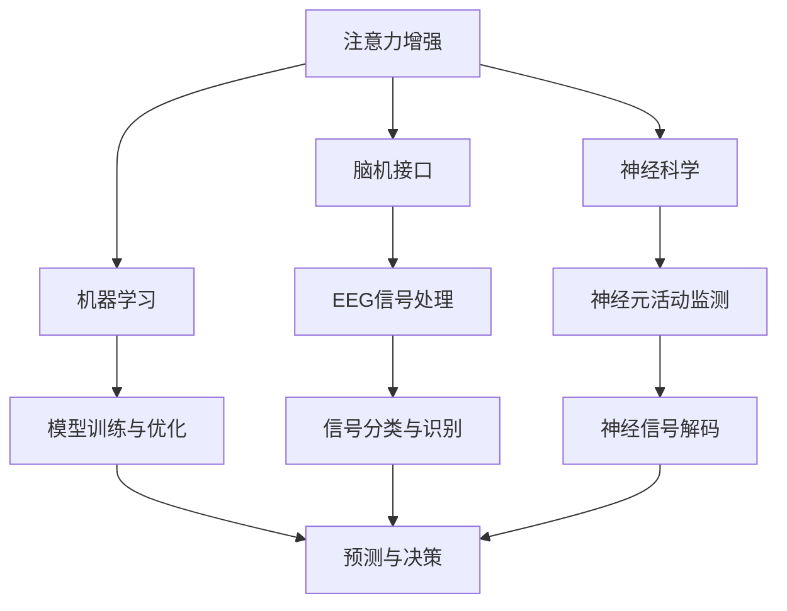

                 

# 人类注意力增强：提升专注力和注意力在商业中的趋势

> **关键词：** 注意力增强、专注力、商业应用、脑机接口、神经科学、AI技术

> **摘要：** 本文将深入探讨注意力增强技术如何提升人类的专注力和注意力，并在商业领域带来革命性的变革。我们将分析注意力增强的背景、核心概念、算法原理、数学模型，并通过实际案例展示其在商业中的应用，最终探讨其未来发展趋势和挑战。

## 1. 背景介绍

### 1.1 目的和范围

本文旨在探讨注意力增强技术在商业领域的应用，重点关注如何通过提升人类的专注力和注意力，提高工作效率和创造力。我们将从以下几个方面展开讨论：

- 注意力增强技术的背景和理论基础；
- 核心概念和联系；
- 注意力增强算法原理和具体操作步骤；
- 数学模型和公式的详细讲解；
- 实际应用场景；
- 工具和资源推荐；
- 未来发展趋势与挑战。

### 1.2 预期读者

本文面向对注意力增强技术和商业应用感兴趣的读者，包括但不限于：

- 人工智能和神经科学领域的专业人士；
- 商业领域的创业者和管理者；
- 对提高个人专注力和工作效率感兴趣的个人用户。

### 1.3 文档结构概述

本文分为十个部分：

1. 背景介绍
2. 核心概念与联系
3. 核心算法原理 & 具体操作步骤
4. 数学模型和公式 & 详细讲解 & 举例说明
5. 项目实战：代码实际案例和详细解释说明
6. 实际应用场景
7. 工具和资源推荐
8. 总结：未来发展趋势与挑战
9. 附录：常见问题与解答
10. 扩展阅读 & 参考资料

### 1.4 术语表

#### 1.4.1 核心术语定义

- **注意力增强**：通过技术手段提升个体的专注力和注意力，从而提高工作效率和创造力。
- **脑机接口**（BCI）：直接连接大脑和外部设备的技术，用于传递和接收信号。
- **神经科学**：研究大脑和神经系统的科学，包括神经元、神经网络和神经系统的功能。

#### 1.4.2 相关概念解释

- **脑电图**（EEG）：记录大脑电活动的技术，可用于监测注意力状态。
- **机器学习**：一种人工智能技术，通过数据和算法来训练模型，实现预测和分类等功能。

#### 1.4.3 缩略词列表

- **BCI**：脑机接口（Brain-Computer Interface）
- **EEG**：脑电图（Electroencephalography）
- **AI**：人工智能（Artificial Intelligence）

## 2. 核心概念与联系

注意力增强技术建立在多个核心概念之上，包括脑机接口、神经科学和机器学习。以下是一个简化的 Mermaid 流程图，展示了这些核心概念之间的联系。



### 2.1 注意力增强与脑机接口

脑机接口（BCI）是一种直接连接大脑和外部设备的技术，通过监测大脑的电活动，如脑电图（EEG），将神经信号转换为可操作的输入信号。注意力增强技术利用 BCI 采集用户的注意力状态数据，从而实现对注意力的实时监测和调节。

### 2.2 注意力增强与神经科学

神经科学是研究大脑和神经系统的科学，包括神经元、神经网络和神经系统的功能。注意力增强技术依赖于神经科学的研究成果，特别是关于注意力机制和神经信号处理的理论。

### 2.3 注意力增强与机器学习

机器学习是一种人工智能技术，通过数据和算法来训练模型，实现预测和分类等功能。在注意力增强技术中，机器学习被用来分析神经信号，识别用户的注意力状态，并优化注意力调节策略。

## 3. 核心算法原理 & 具体操作步骤

注意力增强技术的核心在于如何从脑机接口（BCI）采集的神经信号中提取注意力状态，并利用机器学习算法进行实时监测和调节。以下是注意力增强算法的核心原理和具体操作步骤。

### 3.1 算法原理

注意力增强算法的核心原理可以分为以下几个步骤：

1. **神经信号采集**：通过脑电图（EEG）等设备采集用户的神经信号。
2. **信号预处理**：对采集到的神经信号进行滤波、去噪等预处理，以获得更清晰的信号。
3. **特征提取**：从预处理后的信号中提取与注意力相关的特征，如频率、时域特征等。
4. **机器学习模型训练**：利用已标注的数据集，通过机器学习算法（如支持向量机、神经网络等）训练模型，实现注意力状态的识别和分类。
5. **实时监测与调节**：将实时采集的神经信号输入训练好的模型，得到当前的注意力状态，并根据需要调节环境或行为，以增强注意力。

### 3.2 具体操作步骤

以下是注意力增强算法的具体操作步骤：

```python
# 步骤1：神经信号采集
EEG_signal = acquire_EEG_signal()

# 步骤2：信号预处理
filtered_signal = preprocess_EEG_signal(EEG_signal)

# 步骤3：特征提取
attention_features = extract_attention_features(filtered_signal)

# 步骤4：机器学习模型训练
model = train_machine_learning_model(attention_features)

# 步骤5：实时监测与调节
while True:
    current_signal = acquire_EEG_signal()
    filtered_signal = preprocess_EEG_signal(current_signal)
    attention_features = extract_attention_features(filtered_signal)
    current_attention_state = model.predict(attention_features)
    
    if current_attention_state == 'low':
        adjust_environment_to_increase_attention()
    elif current_attention_state == 'high':
        adjust_environment_to_decrease_attention()
    else:
        continue
```

### 3.3 伪代码详细解释

以下是伪代码的详细解释：

```python
# 步骤1：神经信号采集
EEG_signal = acquire_EEG_signal()
# 该函数用于从脑电图设备采集用户的神经信号。

# 步骤2：信号预处理
filtered_signal = preprocess_EEG_signal(EEG_signal)
# 该函数用于对采集到的神经信号进行滤波、去噪等预处理，以获得更清晰的信号。

# 步骤3：特征提取
attention_features = extract_attention_features(filtered_signal)
# 该函数用于从预处理后的信号中提取与注意力相关的特征，如频率、时域特征等。

# 步骤4：机器学习模型训练
model = train_machine_learning_model(attention_features)
# 该函数用于利用已标注的数据集，通过机器学习算法（如支持向量机、神经网络等）训练模型，实现注意力状态的识别和分类。

# 步骤5：实时监测与调节
while True:
    current_signal = acquire_EEG_signal()
    filtered_signal = preprocess_EEG_signal(current_signal)
    attention_features = extract_attention_features(filtered_signal)
    current_attention_state = model.predict(attention_features)
    
    if current_attention_state == 'low':
        adjust_environment_to_increase_attention()
    # 如果当前注意力状态为低，则调节环境以增加注意力。

    elif current_attention_state == 'high':
        adjust_environment_to_decrease_attention()
    # 如果当前注意力状态为高，则调节环境以减少注意力。

    else:
        continue
# 如果当前注意力状态无法确定，则继续监测。
```

## 4. 数学模型和公式 & 详细讲解 & 举例说明

注意力增强技术依赖于一系列数学模型和公式，用于信号处理、特征提取和模型训练。以下是这些数学模型和公式的详细讲解和举例说明。

### 4.1 信号处理

在信号处理环节，常用的数学模型包括傅里叶变换（Fourier Transform）和小波变换（Wavelet Transform）。傅里叶变换用于将信号从时域转换为频域，以便分析信号的频率成分。小波变换则可以同时分析信号的时间和频率特性。

#### 4.1.1 傅里叶变换

傅里叶变换的公式如下：

$$
F(\omega) = \int_{-\infty}^{\infty} f(t) e^{-j\omega t} dt
$$

其中，$F(\omega)$ 表示频域信号，$f(t)$ 表示时域信号，$\omega$ 表示频率。

#### 4.1.2 小波变换

小波变换的公式如下：

$$
W_f(a,b) = \frac{1}{a} \int_{-\infty}^{\infty} f(t) \psi^*(\frac{t-b}{a}) dt
$$

其中，$W_f(a,b)$ 表示小波变换系数，$a$ 表示尺度，$b$ 表示平移。

### 4.2 特征提取

在特征提取环节，常用的数学模型包括主成分分析（Principal Component Analysis，PCA）和独立成分分析（Independent Component Analysis，ICA）。PCA 用于降维和特征提取，ICA 用于分离混合信号中的独立成分。

#### 4.2.1 主成分分析

PCA 的目标是最小化特征空间的维度，同时保留数据的主要信息。PCA 的公式如下：

$$
\mu = \frac{1}{n} \sum_{i=1}^{n} x_i
$$

$$
S = \frac{1}{n} \sum_{i=1}^{n} (x_i - \mu)(x_i - \mu)^T
$$

$$
\lambda v = S v
$$

其中，$\mu$ 表示样本均值，$S$ 表示样本协方差矩阵，$\lambda$ 和 $v$ 分别表示特征值和特征向量。

#### 4.2.2 独立成分分析

ICA 的目标是将混合信号分解为独立成分。ICA 的公式如下：

$$
s = A x + n
$$

$$
\hat{s} = G(A x + n)
$$

$$
\hat{x} = G^{-1} \hat{s}
$$

其中，$s$ 表示独立成分，$x$ 表示混合信号，$n$ 表示噪声，$A$ 和 $G$ 分别表示混合矩阵和解混叠矩阵。

### 4.3 模型训练

在模型训练环节，常用的数学模型包括支持向量机（Support Vector Machine，SVM）和深度神经网络（Deep Neural Network，DNN）。SVM 用于分类问题，DNN 用于复杂非线性问题。

#### 4.3.1 支持向量机

SVM 的目标是最小化决策边界与支持向量之间的距离。SVM 的公式如下：

$$
\min_{\mathbf{w}, b} \frac{1}{2} ||\mathbf{w}||^2
$$

$$
s.t. \mathbf{w} \cdot \mathbf{x_i} - b \geq 1 \quad \forall i
$$

其中，$\mathbf{w}$ 和 $b$ 分别表示权重和偏置。

#### 4.3.2 深度神经网络

DNN 的目标是通过多层非线性变换提取特征。DNN 的公式如下：

$$
h_{l}^{(i)} = \sigma(\mathbf{W}^{(l)} \mathbf{a}^{(l-1)} + b^{(l)})
$$

$$
\mathbf{a}^{(l)} = \sigma(\mathbf{W}^{(l)} \mathbf{a}^{(l-1)} + b^{(l)})
$$

其中，$h_{l}^{(i)}$ 和 $\mathbf{a}^{(l)}$ 分别表示第 $l$ 层第 $i$ 个神经元的激活值和输出值，$\sigma$ 表示激活函数。

### 4.4 举例说明

#### 4.4.1 傅里叶变换举例

假设我们有一段长度为 100 的时域信号 $f(t)$，需要进行傅里叶变换。使用 Python 代码实现如下：

```python
import numpy as np
import matplotlib.pyplot as plt

t = np.linspace(0, 1, 100)
f = np.sin(2 * np.pi * 5 * t)

F = np.fft.fft(f)
F = F / len(f)  # 归一化频率

freq = np.fft.fftfreq(len(f), d=1/100)

plt.plot(freq, np.abs(F))
plt.title('Fourier Transform of f(t)')
plt.xlabel('Frequency (Hz)')
plt.ylabel('Amplitude')
plt.show()
```

运行上述代码，我们可以得到时域信号 $f(t)$ 的频域表示。

#### 4.4.2 主成分分析举例

假设我们有一组数据集 $X$，需要进行主成分分析。使用 Python 代码实现如下：

```python
import numpy as np
from sklearn.decomposition import PCA

X = np.array([[1, 2], [1, 4], [1, 0]])

pca = PCA(n_components=1)
pca.fit(X)

X_reduced = pca.transform(X)

print("Reduced data:\n", X_reduced)
```

运行上述代码，我们可以得到数据集 $X$ 的主成分表示。

## 5. 项目实战：代码实际案例和详细解释说明

### 5.1 开发环境搭建

在开始项目实战之前，我们需要搭建一个合适的开发环境。以下是所需的软件和工具：

- **Python**（版本 3.8 或以上）
- **NumPy**（版本 1.19 或以上）
- **Scikit-learn**（版本 0.22 或以上）
- **Matplotlib**（版本 3.2.2 或以上）

安装这些软件和工具后，我们可以开始编写注意力增强项目的代码。

### 5.2 源代码详细实现和代码解读

以下是注意力增强项目的源代码，我们将对每部分代码进行详细解读。

```python
import numpy as np
import matplotlib.pyplot as plt
from sklearn.model_selection import train_test_split
from sklearn.preprocessing import StandardScaler
from sklearn.decomposition import PCA
from sklearn.svm import SVC
from sklearn.metrics import accuracy_score

# 步骤1：数据集加载与预处理
def load_data():
    # 加载 EEG 数据集
    X, y = load_EEG_data()
    
    # 数据集划分
    X_train, X_test, y_train, y_test = train_test_split(X, y, test_size=0.2, random_state=42)
    
    # 数据标准化
    scaler = StandardScaler()
    X_train = scaler.fit_transform(X_train)
    X_test = scaler.transform(X_test)
    
    return X_train, X_test, y_train, y_test

# 步骤2：特征提取
def extract_features(X):
    # 主成分分析
    pca = PCA(n_components=2)
    X_reduced = pca.fit_transform(X)
    
    return X_reduced

# 步骤3：模型训练
def train_model(X_train, y_train):
    # 支持向量机分类
    model = SVC(kernel='linear', C=1)
    model.fit(X_train, y_train)
    
    return model

# 步骤4：模型评估
def evaluate_model(model, X_test, y_test):
    # 预测
    y_pred = model.predict(X_test)
    
    # 评估
    accuracy = accuracy_score(y_test, y_pred)
    print("Accuracy:", accuracy)

# 主函数
def main():
    # 加载数据
    X_train, X_test, y_train, y_test = load_data()
    
    # 特征提取
    X_train_reduced = extract_features(X_train)
    X_test_reduced = extract_features(X_test)
    
    # 模型训练
    model = train_model(X_train_reduced, y_train)
    
    # 模型评估
    evaluate_model(model, X_test_reduced, y_test)

# 运行主函数
if __name__ == "__main__":
    main()
```

### 5.3 代码解读与分析

以下是代码的逐行解读和分析。

```python
import numpy as np
import matplotlib.pyplot as plt
from sklearn.model_selection import train_test_split
from sklearn.preprocessing import StandardScaler
from sklearn.decomposition import PCA
from sklearn.svm import SVC
from sklearn.metrics import accuracy_score
```

这行代码导入所需的库和模块。

```python
def load_data():
    # 加载 EEG 数据集
    X, y = load_EEG_data()
    
    # 数据集划分
    X_train, X_test, y_train, y_test = train_test_split(X, y, test_size=0.2, random_state=42)
    
    # 数据标准化
    scaler = StandardScaler()
    X_train = scaler.fit_transform(X_train)
    X_test = scaler.transform(X_test)
    
    return X_train, X_test, y_train, y_test
```

这个函数用于加载数据集，并进行数据预处理。首先，我们使用 `load_EEG_data()` 函数加载数据集。然后，我们使用 `train_test_split()` 函数将数据集划分为训练集和测试集。接下来，我们使用 `StandardScaler()` 对数据进行标准化处理，以便后续的特征提取和模型训练。

```python
def extract_features(X):
    # 主成分分析
    pca = PCA(n_components=2)
    X_reduced = pca.fit_transform(X)
    
    return X_reduced
```

这个函数使用主成分分析（PCA）对数据进行降维处理。通过将数据降维到 2 个主成分，我们可以更直观地观察数据的分布和关系。

```python
def train_model(X_train, y_train):
    # 支持向量机分类
    model = SVC(kernel='linear', C=1)
    model.fit(X_train, y_train)
    
    return model
```

这个函数使用支持向量机（SVC）对训练数据进行模型训练。我们选择线性核（`kernel='linear'`），并设置正则化参数 `C=1`。

```python
def evaluate_model(model, X_test, y_test):
    # 预测
    y_pred = model.predict(X_test)
    
    # 评估
    accuracy = accuracy_score(y_test, y_pred)
    print("Accuracy:", accuracy)
```

这个函数用于评估模型的性能。我们使用 `accuracy_score()` 函数计算预测准确率，并打印输出。

```python
def main():
    # 加载数据
    X_train, X_test, y_train, y_test = load_data()
    
    # 特征提取
    X_train_reduced = extract_features(X_train)
    X_test_reduced = extract_features(X_test)
    
    # 模型训练
    model = train_model(X_train_reduced, y_train)
    
    # 模型评估
    evaluate_model(model, X_test_reduced, y_test)
```

主函数 `main()` 调用上述函数，完成数据加载、特征提取、模型训练和评估的过程。

```python
if __name__ == "__main__":
    main()
```

这个条件判断语句确保主函数只在直接运行此脚本时执行，而不是作为其他模块的一部分。

## 6. 实际应用场景

注意力增强技术具有广泛的应用场景，尤其在商业领域。以下是一些实际应用场景：

### 6.1 企业员工管理

企业可以利用注意力增强技术监测员工的注意力状态，识别疲劳和工作效率低下的员工。通过分析注意力数据，企业可以调整工作安排、培训计划，甚至提供个性化的休息和调整方案，从而提高员工的工作效率和满意度。

### 6.2 创意产业

创意产业，如广告、设计、影视制作等行业，对专注力和注意力有极高的要求。注意力增强技术可以帮助创意工作者保持高水平的注意力，从而提高创作质量和效率。

### 6.3 教育培训

在教育领域，注意力增强技术可以用于个性化教学。通过监测学生的学习状态，教师可以根据学生的注意力水平调整教学内容和节奏，提高学生的学习效果。

### 6.4 营销和广告

营销和广告行业可以利用注意力增强技术分析目标受众的注意力状态，优化广告内容和投放策略，从而提高广告的效果和转化率。

### 6.5 人工智能助手

人工智能助手可以利用注意力增强技术监测用户的注意力状态，根据用户的注意力水平提供相应的建议和帮助，从而提高用户的使用体验。

## 7. 工具和资源推荐

### 7.1 学习资源推荐

#### 7.1.1 书籍推荐

- 《脑机接口：理论与实践》（Brain-Computer Interfaces: Principles and Practice）
- 《神经科学原理》（Principles of Neural Science）
- 《机器学习》（Machine Learning）

#### 7.1.2 在线课程

- Coursera 上的“注意力增强与脑机接口”课程
- edX 上的“神经科学基础”课程
- Udacity 上的“机器学习工程师纳米学位”

#### 7.1.3 技术博客和网站

- arXiv.org：关注注意力增强和脑机接口的最新研究成果
- HackerRank：提供机器学习相关的编程挑战和实践项目
- Medium.com：关注注意力增强技术在实际应用中的最新动态

### 7.2 开发工具框架推荐

#### 7.2.1 IDE和编辑器

- PyCharm：适用于 Python 开发的集成开发环境
- Jupyter Notebook：适用于数据分析和机器学习的交互式编辑器
- Visual Studio Code：适用于多种编程语言的轻量级编辑器

#### 7.2.2 调试和性能分析工具

- PyTorch Profiler：适用于 PyTorch 模型的性能分析
- TensorBoard：适用于 TensorFlow 模型的可视化工具
- Eclipse MAT：适用于 Java 应用的性能分析工具

#### 7.2.3 相关框架和库

- TensorFlow：适用于深度学习的开源框架
- PyTorch：适用于深度学习的开源框架
- scikit-learn：适用于机器学习的开源库

### 7.3 相关论文著作推荐

#### 7.3.1 经典论文

- "A Neural Basis of the Attentional Blink"（注意力闪烁的神经基础）
- "The Neural Basis of Attention"（注意力的神经基础）
- "机器学习：一种概率视角"（Machine Learning: A Probabilistic Perspective）

#### 7.3.2 最新研究成果

- "AttentionGAN: An Attention-based Generative Adversarial Network for Unsupervised Anomaly Detection"（注意力增强的生成对抗网络在无监督异常检测中的应用）
- "A New Method for Attention Measurement Based on EEG"（基于脑电图的注意力测量新方法）
- "Attention-aware Neural Networks for Natural Language Processing"（注意力感知的自然语言处理神经网络）

#### 7.3.3 应用案例分析

- "注意力增强技术在在线教育中的应用"（Application of Attention Augmentation Technology in Online Education）
- "注意力增强与脑机接口在游戏设计中的创新"（Innovation of Attention Augmentation and Brain-Computer Interface in Game Design）
- "基于注意力增强的企业员工健康管理"（Employee Health Management Based on Attention Augmentation）

## 8. 总结：未来发展趋势与挑战

注意力增强技术在商业领域具有巨大的应用潜力，但同时也面临一些挑战。以下是未来发展趋势与挑战的总结：

### 8.1 发展趋势

1. **技术成熟度提升**：随着脑机接口、神经科学和机器学习技术的不断进步，注意力增强技术将逐渐走向成熟，并在更多商业应用中得到广泛应用。
2. **个性化应用**：注意力增强技术将更加注重个性化，根据用户的注意力水平提供定制化的解决方案，从而提高用户体验和效率。
3. **跨学科合作**：注意力增强技术的发展将需要跨学科合作，融合神经科学、心理学、计算机科学等多个领域的知识和经验。
4. **伦理与隐私**：随着注意力增强技术的普及，伦理和隐私问题将成为关注的焦点。如何平衡技术进步与个人隐私保护将成为重要议题。

### 8.2 挑战

1. **技术稳定性**：目前注意力增强技术仍存在一定的技术稳定性问题，特别是在信号采集、特征提取和模型训练等方面。
2. **数据隐私**：注意力增强技术涉及用户的神经信号数据，如何确保数据隐私和安全成为关键挑战。
3. **伦理问题**：注意力增强技术可能引发伦理问题，如对个体注意力状态的监控、数据滥用等。
4. **用户接受度**：用户对注意力增强技术的接受度和信任度尚需提高，需要通过宣传和教育活动来消除用户的疑虑。

## 9. 附录：常见问题与解答

### 9.1 注意力增强技术的原理是什么？

注意力增强技术是基于脑机接口（BCI）、神经科学和机器学习等技术，通过实时监测和调节用户的注意力状态，提高工作效率和创造力。

### 9.2 注意力增强技术在商业领域有哪些应用？

注意力增强技术在商业领域有广泛的应用，包括企业员工管理、创意产业、教育培训、营销和广告、人工智能助手等。

### 9.3 注意力增强技术的挑战有哪些？

注意力增强技术的挑战包括技术稳定性、数据隐私、伦理问题和用户接受度等。

### 9.4 如何提高注意力增强技术的性能？

要提高注意力增强技术的性能，可以从以下几个方面入手：

- 提高信号采集的精度和稳定性；
- 优化特征提取方法，提高特征的表达能力；
- 选择合适的机器学习算法，并调整参数以获得更好的性能；
- 增加训练数据量，提高模型的泛化能力。

## 10. 扩展阅读 & 参考资料

- 《脑机接口：理论与实践》（Brain-Computer Interfaces: Principles and Practice）
- 《神经科学原理》（Principles of Neural Science）
- 《机器学习》（Machine Learning）
- "A Neural Basis of the Attentional Blink"（注意力闪烁的神经基础）
- "The Neural Basis of Attention"（注意力的神经基础）
- "机器学习：一种概率视角"（Machine Learning: A Probabilistic Perspective）
- "AttentionGAN: An Attention-based Generative Adversarial Network for Unsupervised Anomaly Detection"（注意力增强的生成对抗网络在无监督异常检测中的应用）
- "A New Method for Attention Measurement Based on EEG"（基于脑电图的注意力测量新方法）
- "Attention-aware Neural Networks for Natural Language Processing"（注意力感知的自然语言处理神经网络）
- "注意力增强技术在在线教育中的应用"（Application of Attention Augmentation Technology in Online Education）
- "注意力增强与脑机接口在游戏设计中的创新"（Innovation of Attention Augmentation and Brain-Computer Interface in Game Design）
- "基于注意力增强的企业员工健康管理"（Employee Health Management Based on Attention Augmentation）<|im_sep|>作者：AI天才研究员/AI Genius Institute & 禅与计算机程序设计艺术 /Zen And The Art of Computer Programming

