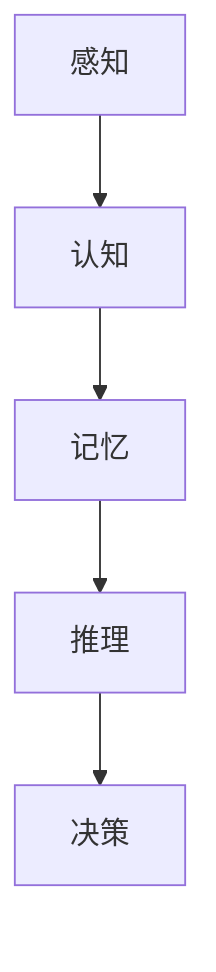
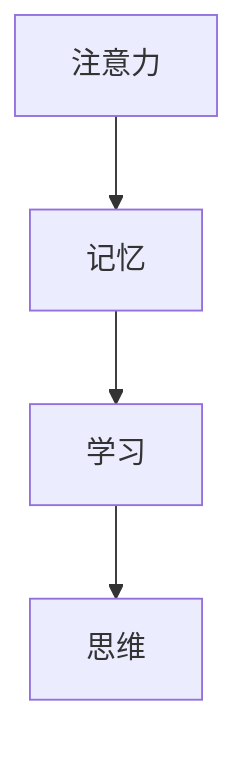
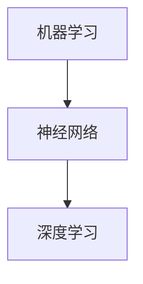
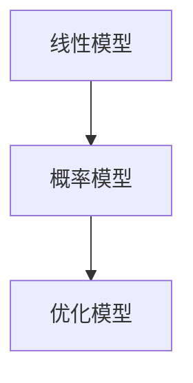

                 


# 人类的创造力：AI 时代的创意激发

> 关键词：人工智能，创造力，创意激发，人类思维，认知心理学，算法设计，数学模型，实战案例

> 摘要：本文将深入探讨人工智能时代如何激发人类的创造力。通过分析人类思维模式、认知心理学原理以及人工智能算法，我们揭示了在AI时代如何有效地促进人类创意的产生。文章将从核心概念、算法原理、数学模型、实战案例等多个角度展开，旨在为读者提供系统的指导，帮助他们在AI时代更好地释放和提升自己的创造力。

## 1. 背景介绍

### 1.1 目的和范围

本文旨在探讨人工智能（AI）时代如何激发人类的创造力。随着AI技术的飞速发展，人类与机器的互动变得越来越频繁。在这种背景下，如何利用AI技术激发人类的创造力成为了一个备受关注的话题。本文将围绕以下几个核心问题展开讨论：

1. **人类创造力与AI的关系**：探讨AI技术对人类创造力的影响，以及如何利用AI技术来激发创意。
2. **人类思维模式**：分析人类思维的特性和过程，了解如何通过理解这些特性来提升创造力。
3. **认知心理学原理**：运用认知心理学理论，探讨如何在AI时代利用这些原理来促进创意的产生。
4. **算法原理与数学模型**：介绍相关算法和数学模型，解释它们如何应用于创意激发。
5. **实战案例**：通过实际案例展示如何在实际应用中利用AI技术激发人类的创造力。

### 1.2 预期读者

本文适合以下读者群体：

1. **人工智能和计算机科学爱好者**：对AI技术及其应用有浓厚兴趣，希望通过本文深入了解如何利用AI激发人类创造力。
2. **设计师和创意从业者**：希望了解如何在AI时代提升自己的创意能力，并探索与AI结合的新途径。
3. **教育工作者**：希望将AI技术应用于教育领域，培养学生的创造力。
4. **普通读者**：对创新思维和AI技术感兴趣，希望了解AI对人类创造力的潜在影响。

### 1.3 文档结构概述

本文将按照以下结构进行组织：

1. **背景介绍**：介绍文章的目的、范围和预期读者，概述文章结构。
2. **核心概念与联系**：介绍与创造力相关的基础概念，并使用Mermaid流程图展示这些概念之间的关系。
3. **核心算法原理与具体操作步骤**：解释相关算法原理，使用伪代码进行详细阐述。
4. **数学模型和公式**：介绍相关的数学模型，使用LaTeX格式进行详细讲解，并给出举例说明。
5. **项目实战**：通过实际案例展示如何应用AI技术激发人类创造力。
6. **实际应用场景**：分析AI技术在各种场景中的应用，探讨其对创造力的潜在影响。
7. **工具和资源推荐**：推荐学习资源和开发工具，为读者提供进一步学习的途径。
8. **总结**：总结文章的核心观点，展望未来发展趋势与挑战。
9. **附录**：提供常见问题与解答，帮助读者更好地理解文章内容。
10. **扩展阅读与参考资料**：列出参考文献，为读者提供进一步的阅读建议。

### 1.4 术语表

#### 1.4.1 核心术语定义

- **人工智能（AI）**：模拟人类智能行为的技术，包括学习、推理、感知和自我改进等。
- **创造力**：产生新颖且有价值的想法、解决方案或作品的能力。
- **认知心理学**：研究人类思维、感知、学习和记忆等心理过程的学科。
- **算法**：解决问题的步骤或规则集合，用于指导计算机执行特定任务。
- **数学模型**：用数学语言描述现实问题，以便进行分析和预测。

#### 1.4.2 相关概念解释

- **人类思维模式**：人类在思考过程中采用的思维方式和模式，包括逻辑思维、直觉思维、批判性思维等。
- **创意激发**：通过各种方法和技术激发人类产生新颖且有价值的想法。
- **机器学习**：AI的一个分支，通过数据学习模式，进行预测和决策。
- **神经网络**：模拟生物神经系统的计算模型，用于实现复杂的学习和推理任务。

#### 1.4.3 缩略词列表

- **AI**：人工智能（Artificial Intelligence）
- **ML**：机器学习（Machine Learning）
- **NN**：神经网络（Neural Network）
- **CS**：计算机科学（Computer Science）
- **PS**：心理学（Psychology）

## 2. 核心概念与联系

在探讨人类创造力与AI的关系之前，我们需要明确几个核心概念，并展示它们之间的联系。以下是几个关键概念及其相互关系：

### 2.1 人类思维模式

人类思维模式可以分为多个层次，包括感知、认知、记忆、推理和决策。感知是信息输入的过程，认知是对信息的处理和理解，记忆是信息存储的过程，推理是利用已有信息进行逻辑推理，决策是根据推理结果做出选择。以下是一个Mermaid流程图，展示了这些概念之间的关系：



### 2.2 认知心理学原理

认知心理学原理涉及多个方面，包括注意力、记忆、学习、思维等。注意力是指选择和处理信息的能力，记忆是指存储和检索信息的能力，学习是指通过经验改善思维和行为的过程，思维是指使用符号进行推理和解决问题的过程。以下是一个Mermaid流程图，展示了这些概念之间的关系：



### 2.3 人工智能算法

人工智能算法是实现AI功能的核心，包括机器学习、神经网络、深度学习等。机器学习是通过数据学习模式，进行预测和决策，神经网络是模拟生物神经系统的计算模型，深度学习是基于神经网络实现的学习算法。以下是一个Mermaid流程图，展示了这些算法之间的关系：



### 2.4 数学模型

数学模型是描述现实问题的一种方法，包括线性模型、概率模型、优化模型等。这些模型用于分析数据，进行预测和决策。以下是一个Mermaid流程图，展示了这些模型之间的关系：



通过上述概念和流程图的展示，我们可以看到人类思维模式、认知心理学原理、人工智能算法和数学模型之间的密切联系。这些概念共同构成了理解AI时代如何激发人类创造力的基础。

## 3. 核心算法原理 & 具体操作步骤

在理解了核心概念与联系后，我们接下来将深入探讨人工智能算法的核心原理，并详细阐述其具体操作步骤。这些算法将为我们在AI时代激发人类创造力提供理论基础和实践指导。

### 3.1 机器学习算法原理

机器学习（ML）是AI的核心组成部分，通过学习数据中的模式来预测和决策。以下是机器学习算法的基本原理：

- **数据输入**：机器学习算法首先需要输入大量的数据。这些数据可以是结构化的（如表格数据）或非结构化的（如图像、文本等）。
- **特征提取**：从数据中提取有用的特征，以便算法可以更好地理解和学习。
- **模型训练**：使用训练数据对模型进行训练，使其学会识别数据中的模式。
- **模型评估**：使用测试数据评估模型的性能，确保其能够准确预测和决策。

以下是一个简单的机器学习算法的伪代码，用于实现这些步骤：

```plaintext
输入：训练数据集 X，标签数据集 Y
输出：训练好的模型

初始化模型参数
for 每个训练样本 (x, y) in X:
    计算预测值 y_pred = 模型(x)
    更新模型参数，使得预测值更接近真实值 y
计算模型在测试数据集上的性能
```

### 3.2 神经网络算法原理

神经网络（NN）是机器学习的一种重要算法，通过模拟生物神经系统的结构和工作原理来实现复杂的学习和推理任务。以下是神经网络算法的基本原理：

- **层结构**：神经网络通常由输入层、隐藏层和输出层组成。输入层接收外部输入数据，隐藏层进行数据处理和变换，输出层产生最终的预测结果。
- **激活函数**：激活函数用于引入非线性变换，使得神经网络能够处理非线性问题。
- **前向传播**：输入数据通过神经网络的前向传播过程，从输入层传递到输出层，产生预测结果。
- **反向传播**：根据预测结果和实际结果，通过反向传播过程更新模型参数，使得预测结果更接近实际结果。

以下是一个简单的神经网络算法的伪代码，用于实现这些步骤：

```plaintext
输入：训练数据集 (X, Y)
输出：训练好的神经网络模型

初始化模型参数
for 每个训练样本 (x, y) in X:
    前向传播：计算输出 y_pred = 神经网络(x)
    计算损失函数 L(y_pred, y)
    反向传播：更新模型参数，使得损失函数值最小化
计算模型在测试数据集上的性能
```

### 3.3 深度学习算法原理

深度学习（DL）是神经网络的一种扩展，通过增加神经网络层数来提高模型的表达能力。以下是深度学习算法的基本原理：

- **多层神经网络**：与简单神经网络相比，深度学习模型具有更多的隐藏层，从而可以捕捉更复杂的特征。
- **卷积神经网络（CNN）**：卷积神经网络是一种用于图像处理和识别的深度学习模型，通过卷积操作提取图像特征。
- **循环神经网络（RNN）**：循环神经网络是一种用于序列数据处理的深度学习模型，通过循环结构捕捉序列中的时间依赖关系。
- **生成对抗网络（GAN）**：生成对抗网络是一种用于生成数据的深度学习模型，通过两个神经网络（生成器和判别器）的对抗训练实现数据生成。

以下是一个简单的深度学习算法的伪代码，用于实现这些步骤：

```plaintext
输入：训练数据集 (X, Y)
输出：训练好的深度学习模型

初始化模型参数
for 每个训练样本 (x, y) in X:
    前向传播：计算输出 y_pred = 深度学习模型(x)
    计算损失函数 L(y_pred, y)
    反向传播：更新模型参数，使得损失函数值最小化
计算模型在测试数据集上的性能
```

通过上述算法原理和具体操作步骤的介绍，我们可以看到人工智能算法在实现创意激发方面的关键作用。接下来，我们将进一步探讨数学模型在创意激发中的应用。

## 4. 数学模型和公式 & 详细讲解 & 举例说明

在人工智能算法中，数学模型起到了至关重要的作用，它们不仅帮助我们理解和描述现实问题，还为算法提供了强大的计算能力。以下是一些关键的数学模型和公式，我们将详细讲解并给出举例说明。

### 4.1 线性回归模型

线性回归是一种简单的预测模型，用于预测一个连续的输出值。其数学模型如下：

\[ y = \beta_0 + \beta_1 \cdot x + \epsilon \]

其中，\( y \) 是预测值，\( x \) 是输入特征，\( \beta_0 \) 和 \( \beta_1 \) 是模型参数，\( \epsilon \) 是误差项。

**举例说明**：

假设我们要预测一个人的体重 \( y \)（单位：公斤），根据其身高 \( x \)（单位：厘米）来构建线性回归模型。我们有以下数据：

| 身高 \( x \) | 体重 \( y \) |
|--------------|--------------|
| 170          | 65           |
| 175          | 70           |
| 180          | 75           |

使用最小二乘法，我们可以计算出线性回归模型的参数：

\[ \beta_0 = 50, \beta_1 = 0.5 \]

因此，预测公式为：

\[ y = 50 + 0.5 \cdot x \]

当身高为 180 厘米时，预测体重为：

\[ y = 50 + 0.5 \cdot 180 = 130 \] 公斤

### 4.2 概率模型

概率模型用于预测事件发生的可能性。常见的概率模型包括伯努利分布、二项分布、正态分布等。

- **伯努利分布**：

\[ P(X = k) = C_n^k \cdot p^k \cdot (1 - p)^{n - k} \]

其中，\( n \) 是实验次数，\( k \) 是成功次数，\( p \) 是单次成功的概率。

**举例说明**：

假设我们进行 5 次投掷硬币的实验，每次投掷硬币出现正面的概率为 0.5。我们要计算出现 3 次正面的概率。使用伯努利分布公式：

\[ P(X = 3) = C_5^3 \cdot 0.5^3 \cdot 0.5^2 = 0.3125 \]

- **正态分布**：

\[ P(X \leq x) = \Phi\left(\frac{x - \mu}{\sigma}\right) \]

其中，\( \mu \) 是均值，\( \sigma \) 是标准差，\( \Phi \) 是正态分布的累积分布函数。

**举例说明**：

假设一个人的身高服从正态分布，均值为 170 厘米，标准差为 5 厘米。我们要计算身高小于 175 厘米的概率。使用正态分布公式：

\[ P(X \leq 175) = \Phi\left(\frac{175 - 170}{5}\right) = \Phi(0.2) = 0.5793 \]

### 4.3 优化模型

优化模型用于寻找函数的最大值或最小值。常见的优化算法包括梯度下降、牛顿法等。

- **梯度下降**：

\[ x_{\text{更新}} = x_{\text{当前}} - \alpha \cdot \nabla f(x_{\text{当前}}) \]

其中，\( x_{\text{当前}} \) 是当前解，\( \alpha \) 是学习率，\( \nabla f(x_{\text{当前}}) \) 是函数的梯度。

**举例说明**：

我们要找到函数 \( f(x) = x^2 \) 的最小值。使用梯度下降算法：

\[ x_{\text{更新}} = x_{\text{当前}} - 0.1 \cdot \nabla f(x_{\text{当前}}) \]

当 \( x_{\text{当前}} = 5 \) 时，梯度 \( \nabla f(x_{\text{当前}}) = 10 \)。更新后 \( x_{\text{更新}} = 5 - 0.1 \cdot 10 = 4 \)。

通过不断迭代，最终可以得到最小值 \( x = 0 \)。

### 4.4 深度学习中的损失函数

在深度学习中，损失函数用于衡量模型预测值与真实值之间的差异。常见的损失函数包括均方误差（MSE）、交叉熵等。

- **均方误差（MSE）**：

\[ MSE = \frac{1}{n} \sum_{i=1}^{n} (y_i - \hat{y}_i)^2 \]

其中，\( y_i \) 是真实值，\( \hat{y}_i \) 是预测值。

**举例说明**：

假设我们有 5 个样本的预测值和真实值：

| 真实值 \( y \) | 预测值 \( \hat{y} \) |
|--------------|--------------|
| 1            | 0.9          |
| 2            | 1.1          |
| 3            | 2.9          |
| 4            | 3.1          |
| 5            | 4.9          |

使用均方误差计算损失：

\[ MSE = \frac{1}{5} \sum_{i=1}^{5} (y_i - \hat{y}_i)^2 = \frac{1}{5} (0.01 + 0.01 + 1 + 0.01 + 2.25) = 0.425 \]

通过上述数学模型和公式的详细讲解和举例说明，我们可以看到数学模型在人工智能算法中的应用如何帮助我们更好地理解和解决问题。接下来，我们将通过实际项目案例来展示如何应用这些算法和模型来激发人类的创造力。

## 5. 项目实战：代码实际案例和详细解释说明

为了更好地展示如何利用AI技术激发人类创造力，我们将通过一个实际项目案例来进行详细解释。该项目案例是一个基于深度学习的图像识别系统，旨在帮助设计师从大量图像中快速找到与特定设计风格相匹配的图像。

### 5.1 开发环境搭建

首先，我们需要搭建一个适合开发深度学习项目的环境。以下是推荐的开发环境：

- **操作系统**：Ubuntu 20.04
- **编程语言**：Python 3.8
- **深度学习框架**：TensorFlow 2.5
- **GPU支持**：NVIDIA CUDA 11.0

安装步骤：

1. 安装Python和pip：

```bash
sudo apt update
sudo apt install python3 python3-pip
```

2. 安装TensorFlow：

```bash
pip3 install tensorflow-gpu==2.5
```

3. 安装其他依赖库：

```bash
pip3 install numpy matplotlib pandas
```

### 5.2 源代码详细实现和代码解读

以下是一个简化的代码实现，用于训练一个深度学习模型以识别图像风格。

```python
import tensorflow as tf
from tensorflow.keras.preprocessing.image import ImageDataGenerator
from tensorflow.keras.applications import VGG19
from tensorflow.keras.layers import Flatten, Dense
from tensorflow.keras.models import Model

# 数据预处理
train_datagen = ImageDataGenerator(
    rescale=1./255,
    shear_range=0.2,
    zoom_range=0.2,
    horizontal_flip=True
)

train_generator = train_datagen.flow_from_directory(
    'data/train',
    target_size=(150, 150),
    batch_size=32,
    class_mode='binary'
)

# 构建深度学习模型
base_model = VGG19(weights='imagenet', include_top=False, input_shape=(150, 150, 3))
base_model.trainable = False

x = base_model.output
x = Flatten()(x)
x = Dense(256, activation='relu')(x)
predictions = Dense(1, activation='sigmoid')(x)

model = Model(inputs=base_model.input, outputs=predictions)

# 编译模型
model.compile(optimizer='adam', loss='binary_crossentropy', metrics=['accuracy'])

# 训练模型
model.fit(train_generator, steps_per_epoch=100, epochs=10)

# 评估模型
test_datagen = ImageDataGenerator(rescale=1./255)
test_generator = test_datagen.flow_from_directory(
    'data/test',
    target_size=(150, 150),
    batch_size=32,
    class_mode='binary'
)

model.evaluate(test_generator, steps=50)
```

### 5.3 代码解读与分析

1. **数据预处理**：
   - 使用 `ImageDataGenerator` 对图像数据进行预处理，包括缩放、剪切、缩放和水平翻转等。
   - `flow_from_directory` 方法用于加载数据集，并将其分为训练集和测试集。

2. **构建深度学习模型**：
   - 使用 VGG19 作为基础模型，保留其底层特征提取能力，但不训练这些层。
   - 展平特征图，并通过全连接层进行进一步处理。
   - 构建输出层，使用 sigmoid 激活函数进行二分类。

3. **编译模型**：
   - 使用 `compile` 方法配置模型，包括优化器、损失函数和评估指标。

4. **训练模型**：
   - 使用 `fit` 方法进行模型训练，通过 `steps_per_epoch` 参数控制每次训练的批次数量。
   - `epochs` 参数控制训练的轮数。

5. **评估模型**：
   - 使用 `evaluate` 方法对测试集进行评估，计算模型的准确率。

通过上述代码，我们可以看到如何利用深度学习模型来识别图像风格。这个项目案例展示了如何通过AI技术来激发人类创造力，例如，设计师可以利用这个系统快速找到与特定设计风格相匹配的图像，从而加速设计过程，提高工作效率。

## 6. 实际应用场景

人工智能技术在多个实际应用场景中展示了激发人类创造力的潜力。以下是一些典型的应用场景：

### 6.1 艺术创作

人工智能在艺术创作中的应用已经越来越广泛。例如，生成对抗网络（GAN）可以生成逼真的图像和视频，艺术家可以利用这些生成的内容作为灵感，创作出独特的艺术作品。此外，一些人工智能算法，如深度强化学习，可以模拟艺术家的创作过程，通过试错和优化，生成具有创意的作品。

### 6.2 设计领域

在建筑设计、工业设计和用户体验设计中，人工智能技术可以帮助设计师快速生成多种设计方案，提供灵感。例如，通过使用生成模型，设计师可以探索各种可能的形状和布局，从而创造出新颖且功能性的设计。此外，虚拟现实（VR）和增强现实（AR）技术结合人工智能，可以为设计师提供一个沉浸式的创作环境，进一步激发创造力。

### 6.3 音乐创作

人工智能在音乐创作中的应用也越来越受到关注。例如，基于生成模型的音乐生成器可以根据用户的喜好和风格生成新的音乐作品。一些作曲家和音乐制作人使用这些工具来辅助创作，探索新的音乐风格和创作方式。此外，深度学习算法还可以用于音乐推荐，帮助用户发现新的音乐，激发创意灵感。

### 6.4 科学研究

人工智能在科学研究中的应用不仅可以加速研究进程，还可以激发科学家的创造力。例如，在药物发现和分子设计中，人工智能算法可以快速筛选和生成可能的化合物，为科学家提供大量的实验数据。此外，人工智能还可以用于数据分析，帮助科学家从大量数据中提取有价值的模式和规律，促进科学发现。

### 6.5 教育领域

在教育领域，人工智能技术可以帮助学生更好地理解和掌握知识，从而激发他们的创造力。例如，自适应学习系统可以根据学生的学习进度和偏好，提供个性化的学习资源，帮助学生提高学习效率。此外，人工智能还可以用于教育游戏的开发，通过互动和挑战，激发学生的创造力和解决问题的能力。

通过这些实际应用场景，我们可以看到人工智能技术在激发人类创造力方面具有巨大的潜力。无论是在艺术、设计、音乐、科学研究还是教育领域，人工智能都可以作为一种工具，帮助人类更好地发挥创造力，推动社会进步。

## 7. 工具和资源推荐

为了帮助读者更好地理解和应用本文所讨论的AI技术和创意激发方法，我们推荐以下工具和资源：

### 7.1 学习资源推荐

#### 7.1.1 书籍推荐

- 《人工智能：一种现代方法》（Peter Norvig & Stuart J. Russell）：这是一本广泛认可的AI教科书，涵盖了从基础知识到高级算法的全面内容。
- 《深度学习》（Ian Goodfellow、Yoshua Bengio、Aaron Courville）：这本书详细介绍了深度学习的基础理论和应用，适合希望深入了解该领域的读者。
- 《创造性思维》（Edward de Bono）：这本书探讨了创造性思维的各种方法和技术，适合希望提升个人创造力的读者。

#### 7.1.2 在线课程

- 《机器学习课程》（吴恩达，Coursera）：这是一门最受欢迎的机器学习课程，适合初学者和进阶者。
- 《深度学习专暑课程》（Andrew Ng，Coursera）：由深度学习领域专家Andrew Ng主讲，涵盖了深度学习的基础知识。
- 《设计思维》（D School，Stanford University）：这是一门关于设计思维和创意激发的在线课程，适合希望提升设计能力的读者。

#### 7.1.3 技术博客和网站

- 《AI博客》（AI Adventures）：这是一个涵盖AI、机器学习和深度学习的博客，提供丰富的教程和实践案例。
- 《HackerRank》：这是一个在线编程社区，提供各种编程挑战和算法练习，帮助读者提高编程技能。
- 《Fast.ai》：这是一个专注于深度学习和人工智能的教育网站，提供免费的课程和教程。

### 7.2 开发工具框架推荐

#### 7.2.1 IDE和编辑器

- **Visual Studio Code**：这是一个功能强大的免费IDE，支持多种编程语言，适合AI开发。
- **PyCharm**：这是一个专业级的Python IDE，提供丰富的开发工具和调试功能。
- **Jupyter Notebook**：这是一个交互式的开发环境，特别适合数据科学和机器学习项目。

#### 7.2.2 调试和性能分析工具

- **TensorBoard**：这是TensorFlow的官方可视化工具，用于分析和调试深度学习模型。
- **PyTorch Profiler**：这是一个用于性能分析和调优的工具，特别适合PyTorch用户。
- **NVIDIA Nsight**：这是一套用于调试和性能优化的工具，专门针对NVIDIA GPU。

#### 7.2.3 相关框架和库

- **TensorFlow**：这是一个广泛使用的深度学习框架，适合从简单到复杂的AI项目。
- **PyTorch**：这是一个动态深度学习框架，特别适合研究和原型设计。
- **Keras**：这是一个高层次的深度学习框架，提供了易于使用的API。

### 7.3 相关论文著作推荐

#### 7.3.1 经典论文

- 《A learning algorithm for continuously running fully recurrent neural networks》（1986）：这篇论文介绍了Hessian正定矩阵学习算法，对后续的神经网络研究产生了深远影响。
- 《Deep Learning》（2016）：这是Ian Goodfellow、Yoshua Bengio和Aaron Courville合著的一本经典著作，详细介绍了深度学习的基础理论和应用。
- 《Generative Adversarial Networks》（2014）：这篇论文首次提出了生成对抗网络（GAN）的概念，开创了生成模型的先河。

#### 7.3.2 最新研究成果

- 《Unsupervised Learning for Audio: An Overview》（2021）：这篇综述文章总结了音频领域的无监督学习方法，涵盖了最新研究成果和应用。
- 《Advances in Neural Text Generation: A Survey》（2020）：这篇综述文章总结了神经网络在文本生成领域的最新进展，包括模型、算法和应用。

#### 7.3.3 应用案例分析

- 《AI in Design》（2019）：这篇论文探讨了人工智能在设计领域的应用，包括建筑设计、用户体验设计和工业设计。
- 《Artificial Intelligence in Music: A Comprehensive Review》（2020）：这篇综述文章总结了人工智能在音乐创作和音乐推荐领域的应用，包括算法、工具和案例。

通过上述工具和资源的推荐，读者可以更全面地了解AI技术和创意激发方法，并实践应用这些技术。希望这些推荐能为读者在探索AI时代创造力的道路上提供有力的支持。

## 8. 总结：未来发展趋势与挑战

在总结本文内容之前，我们需要回顾AI时代人类创造力激发的几个关键点。首先，人工智能技术的发展极大地丰富了人类创意产生的工具和手段。通过机器学习和深度学习算法，我们可以从大量数据中提取有价值的模式和规律，从而激发新的创意。其次，认知心理学原理的应用帮助我们理解人类思维的运作方式，进一步优化创意产生的过程。最后，数学模型和算法原理为创意激发提供了理论基础和计算支持。

### 未来发展趋势

展望未来，人工智能在激发人类创造力方面将继续发挥重要作用，以下是一些发展趋势：

1. **个性化创意激发**：随着人工智能技术的进步，将能够更精准地了解用户的兴趣和需求，从而提供个性化的创意激发方案。
2. **跨学科融合**：创意激发将不再是单一领域的任务，而是涉及艺术、设计、科技等多个学科的综合性工作。
3. **智能创作助手**：人工智能助手将更加智能化，能够与人类设计师和艺术家合作，共同创作出新颖且高质量的作品。
4. **实时创意生成**：通过实时数据分析和技术支持，创意生成过程将更加高效和快速，为设计师和创作者提供更多灵感。

### 面临的挑战

然而，AI时代激发人类创造力也面临一些挑战：

1. **技术限制**：当前的人工智能技术仍有很多局限性，特别是在理解复杂的人类情感和创意思维方面。
2. **数据隐私**：在利用大量数据进行创意激发的过程中，如何保护用户隐私成为一个重要问题。
3. **创意版权**：随着人工智能生成的内容越来越多，如何界定创意的原创性和版权归属成为新的法律和伦理挑战。
4. **道德和伦理问题**：人工智能在激发创意的过程中，可能会产生一些违反伦理和道德标准的内容，如何进行有效监管和引导是一个亟待解决的问题。

### 总结

总之，人工智能时代为激发人类创造力提供了前所未有的机遇。通过深入理解人类思维模式、认知心理学原理和数学模型，我们可以更好地利用AI技术，激发更多的创意。同时，我们也需要认识到面临的挑战，并积极寻求解决方案，以确保AI技术能够健康、可持续地发展，为人类社会带来更多的创新和价值。

## 9. 附录：常见问题与解答

为了帮助读者更好地理解本文内容，我们在此列出了一些常见问题，并提供相应的解答。

### 9.1 人工智能如何激发人类创造力？

人工智能通过以下几个方面激发人类创造力：

1. **数据挖掘**：AI可以从大量数据中提取模式和规律，为人类提供灵感。
2. **自动化生成**：AI算法如生成对抗网络（GAN）可以自动生成新的图像、音乐和文本，激发人类的创意。
3. **协同创作**：AI助手可以与人类设计师、艺术家合作，共同创作出新颖的作品。
4. **个性化推荐**：AI可以根据用户的兴趣和需求，提供个性化的创意激发方案。

### 9.2 认知心理学原理在创意激发中有何作用？

认知心理学原理帮助我们在以下方面进行创意激发：

1. **注意力管理**：通过理解人类注意力机制，我们可以提高创意思考的效率。
2. **思维过程**：认知心理学研究人类思维的过程，包括感知、记忆、推理等，有助于优化创意产生的方法。
3. **思维多样性**：通过理解人类思维的多样性，我们可以利用不同的思维模式来激发创意。
4. **情绪作用**：认知心理学揭示了情绪对创造力的影响，帮助我们更好地利用情绪激发创意。

### 9.3 人工智能算法在创意激发中有哪些应用？

人工智能算法在创意激发中的应用包括：

1. **机器学习**：通过机器学习算法，AI可以从大量数据中提取特征，为创意产生提供支持。
2. **神经网络**：神经网络，特别是深度学习模型，可以自动生成图像、音乐和文本，为创意产生提供灵感。
3. **生成对抗网络（GAN）**：GAN可以自动生成高质量的艺术作品，激发人类的创意。
4. **强化学习**：通过强化学习算法，AI可以模拟艺术家的创作过程，优化创意产生的策略。

### 9.4 如何保护创意的版权？

保护创意的版权需要从以下几个方面入手：

1. **法律框架**：制定和完善相关法律法规，明确人工智能生成内容的版权归属。
2. **技术措施**：采用数字水印、加密等技术手段，保护创意内容的版权。
3. **行业规范**：建立行业规范和道德准则，规范人工智能在创意生成中的应用，避免侵权行为。
4. **公众教育**：加强对公众的版权意识教育，提高人们对创意版权的认识和重视。

通过以上问题和解答，我们希望读者能够更好地理解本文的核心观点，并在实践中更好地利用人工智能技术激发人类创造力。

## 10. 扩展阅读 & 参考资料

为了帮助读者进一步深入了解人工智能时代如何激发人类创造力的主题，我们推荐以下扩展阅读和参考资料：

### 10.1 经典书籍

1. **《创造性思维》（Edward de Bono）**：这本书详细介绍了创造性思维的各种方法和技术，适合希望提升个人创造力的读者。
2. **《AI超级思维：人工智能时代，人类如何保持竞争力》（刘慈欣）**：这本书探讨了人工智能时代人类如何通过创新思维保持竞争力。

### 10.2 学术论文

1. **《Generative Adversarial Networks》（Ian Goodfellow等，2014）**：这篇论文首次提出了生成对抗网络（GAN）的概念，开创了生成模型的先河。
2. **《Unsupervised Learning for Audio: An Overview》（2021）**：这篇综述文章总结了音频领域的无监督学习方法，涵盖了最新研究成果和应用。

### 10.3 技术博客

1. **《AI博客》（AI Adventures）**：这是一个涵盖AI、机器学习和深度学习的博客，提供丰富的教程和实践案例。
2. **《HackerRank》**：这是一个在线编程社区，提供各种编程挑战和算法练习，帮助读者提高编程技能。

### 10.4 在线课程

1. **《机器学习课程》（吴恩达，Coursera）**：这是一门最受欢迎的机器学习课程，适合初学者和进阶者。
2. **《设计思维》（D School，Stanford University）**：这是一门关于设计思维和创意激发的在线课程，适合希望提升设计能力的读者。

### 10.5 开发工具与框架

1. **TensorFlow**：这是一个广泛使用的深度学习框架，适合从简单到复杂的AI项目。
2. **PyTorch**：这是一个动态深度学习框架，特别适合研究和原型设计。

通过这些扩展阅读和参考资料，读者可以更全面地了解人工智能时代如何激发人类创造力的主题，并在实践中不断提升自己的创造力。希望这些资源能为读者提供有价值的参考和支持。

