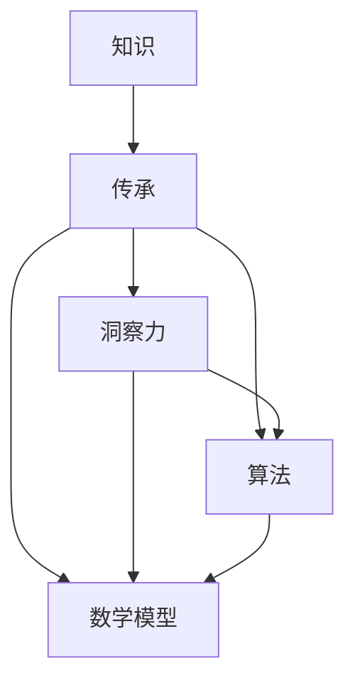

                 

### 1. 背景介绍

#### 1.1 目的和范围

本文旨在深入探讨人类知识的传承与超越，特别是洞察力在这一过程中的重要作用。随着技术的飞速发展，传统知识的传承方式面临挑战，如何通过洞察力实现知识的有效传承与超越，已成为一个重要课题。

本文将围绕以下几个方面展开：

1. **核心概念与联系**：我们将介绍与知识传承和洞察力相关的核心概念，并使用Mermaid流程图展示它们之间的关系。
2. **核心算法原理**：我们将阐述实现知识传承与超越的核心算法原理，并通过伪代码详细解释其具体操作步骤。
3. **数学模型和公式**：我们将讨论用于支持核心算法的数学模型和公式，并提供详细的讲解和举例说明。
4. **项目实战**：我们将通过一个实际案例，展示如何应用这些算法和模型来实现知识的传承与超越。
5. **实际应用场景**：我们将探讨这些技术和方法在现实中的应用场景。
6. **工具和资源推荐**：我们将推荐一些有助于理解和应用本文内容的学习资源和开发工具。
7. **总结与展望**：我们将总结本文的主要观点，并对未来的发展趋势和挑战进行展望。

通过本文的探讨，我们希望能够为读者提供一个全面而深入的视角，以更好地理解人类知识的传承与超越，并为其提供实践指导。

#### 1.2 预期读者

本文适合以下读者群体：

1. **计算机科学家和工程师**：希望了解如何在软件开发中应用洞察力实现知识传承与超越的技术人员。
2. **人工智能研究者**：对如何通过算法和模型实现知识的自动传递和进化感兴趣的研究者。
3. **教育和培训从业者**：希望提升教学效果，通过创新方法进行知识传授的教育工作者。
4. **科技管理者和决策者**：关注知识管理和传承，希望提高组织知识管理水平的管理者和决策者。
5. **对技术哲学和认知科学感兴趣的读者**：希望探索知识与洞察力之间深层次联系的研究者。

无论您是上述哪一类读者，本文都将为您提供有价值的见解和实际应用建议。

#### 1.3 文档结构概述

本文分为十个主要部分，结构如下：

1. **背景介绍**：
   - **目的和范围**：阐述本文的研究目标和覆盖范围。
   - **预期读者**：介绍适合本文的读者群体。
   - **文档结构概述**：概述本文的章节结构和内容。
2. **核心概念与联系**：
   - **核心概念**：介绍与知识传承和洞察力相关的核心概念。
   - **Mermaid流程图**：展示核心概念之间的关系。
3. **核心算法原理 & 具体操作步骤**：
   - **算法原理**：详细阐述实现知识传承与超越的核心算法原理。
   - **操作步骤**：使用伪代码展示算法的具体操作步骤。
4. **数学模型和公式 & 详细讲解 & 举例说明**：
   - **数学模型**：介绍支持核心算法的数学模型。
   - **公式讲解**：详细讲解数学公式。
   - **举例说明**：通过具体例子说明公式的应用。
5. **项目实战：代码实际案例和详细解释说明**：
   - **开发环境搭建**：介绍项目实战所需的开发环境。
   - **源代码实现**：展示代码实现过程。
   - **代码解读**：详细解读代码。
6. **实际应用场景**：
   - **应用场景**：探讨知识传承与超越在实际中的应用场景。
7. **工具和资源推荐**：
   - **学习资源**：推荐有助于深入理解本文内容的学习资源。
   - **开发工具框架**：推荐实用的开发工具和框架。
   - **论文著作**：推荐相关领域的经典和最新研究成果。
8. **总结：未来发展趋势与挑战**：
   - **总结**：回顾本文的主要观点。
   - **未来展望**：展望知识传承与超越的发展趋势和挑战。
9. **附录：常见问题与解答**：
   - **问题**：列出本文中的常见问题。
   - **解答**：针对问题提供详细解答。
10. **扩展阅读 & 参考资料**：
    - **扩展阅读**：推荐进一步深入阅读的资料。
    - **参考资料**：列出本文引用的相关文献和资料。

#### 1.4 术语表

在本文中，我们将使用以下术语：

#### 1.4.1 核心术语定义

- **知识传承**：指将已有知识传递给下一代的机制和方法。
- **洞察力**：指个体通过深入思考和抽象思维，对事物本质的理解和认识。
- **算法**：解决特定问题的步骤和规则，通常使用伪代码或代码实现。
- **数学模型**：用于描述和分析现实世界问题的数学公式和框架。
- **人工智能**：模拟人类智能的计算机系统，通过学习和推理实现智能行为。

#### 1.4.2 相关概念解释

- **机器学习**：一种人工智能的分支，通过训练模型从数据中自动学习规律和模式。
- **自然语言处理**：人工智能的一个子领域，研究如何使计算机理解和生成人类语言。
- **认知科学**：研究人类思维和认知过程的学科，涉及心理学、神经科学等多个领域。

#### 1.4.3 缩略词列表

- **AI**：人工智能（Artificial Intelligence）
- **ML**：机器学习（Machine Learning）
- **NLP**：自然语言处理（Natural Language Processing）
- **CS**：计算机科学（Computer Science）
- **MLP**：多层感知器（Multilayer Perceptron）

通过定义这些术语和概念，我们为读者提供了一个清晰的理解框架，以便更好地把握本文的核心内容。

### 2. 核心概念与联系

在探讨人类知识的传承与超越之前，我们首先需要明确几个核心概念，并展示它们之间的相互关系。以下是我们将要讨论的核心概念：

1. **知识**：知识是指通过学习、研究和实践获得的关于某个领域的信息、事实和技能。
2. **传承**：传承是指将知识从一代传递到下一代的机制和方法。
3. **洞察力**：洞察力是指通过深入思考和抽象思维，对事物本质的理解和认识。
4. **算法**：算法是指用于解决问题的一系列规则和步骤。
5. **数学模型**：数学模型是指用数学公式和框架描述现实世界问题的模型。

#### 2.1 知识与传承

知识传承是确保知识不断积累和扩展的关键。在传统教育体系中，知识传承主要通过书籍、教学和师徒制等方式实现。然而，随着技术的进步，知识的产生和传播速度大大加快，知识传承的方式也发生了显著变化。

- **知识结构**：知识可以看作是一个由多个层次组成的结构，包括事实知识、概念知识和原理知识。事实知识是具体的、可观察的事实，如历史事件；概念知识是对事物的分类和定义，如生物学中的物种分类；原理知识是关于事物运作的规则和原理，如物理学中的牛顿定律。

- **传承机制**：传统知识传承机制包括口头传承、书面传承和现代教育传承。口头传承是通过语言进行知识传递，如传统的口头传说和故事；书面传承是通过书籍和文献记录知识，如古代的书籍和文献；现代教育传承是通过学校、在线课程和教育技术进行知识传递，如现代的电子书籍、在线教育和虚拟课堂。

#### 2.2 洞察力与知识传承

洞察力在知识传承中起着至关重要的作用。它不仅帮助个体理解和掌握知识，还能促进新知识的创造和传承。

- **洞察力的来源**：洞察力来源于个体的经验、观察和思考。通过不断地观察和实践，个体能够从表面现象中发现本质规律，从而形成深刻的洞察力。
- **洞察力在知识传承中的作用**：洞察力使得个体能够将知识融会贯通，从多个角度理解知识的内在联系。这种深刻的理解有助于个体将知识传授给下一代，同时也能激发新一代的创新思维。

#### 2.3 算法与知识传承

算法是实现知识传承与超越的重要工具。算法通过系统化的步骤，将知识转化为可操作的规则和流程。

- **算法在知识获取中的应用**：算法可以用于从大量数据中提取有用信息，如机器学习算法用于分析大量数据以发现潜在的模式和规律。这些算法帮助个体快速掌握大量知识。
- **算法在知识传承中的应用**：算法可以用于自动化知识的传递和分享，如知识图谱技术用于构建领域知识的网络结构，方便知识的检索和利用。此外，算法还可以用于个性化学习推荐，根据个体的知识水平和需求，推荐合适的知识点和学习路径。

#### 2.4 数学模型与知识传承

数学模型是用数学公式和框架描述现实世界问题的模型，它在知识传承中发挥着重要作用。

- **数学模型在知识表示中的应用**：数学模型可以用于将知识转化为数学形式，如逻辑公式、统计模型等。这种形式化的表示使得知识更加精确和可操作。
- **数学模型在知识分析中的应用**：数学模型可以用于分析知识的结构和关系，如网络分析模型可以用于分析知识图谱中的节点和边的关系。这种分析有助于发现知识的内在联系和演化路径。

#### Mermaid流程图展示

为了更好地展示这些核心概念之间的关系，我们使用Mermaid流程图进行描述。



在这个流程图中，我们可以看到知识通过传承机制传递，同时受到洞察力的影响。洞察力促进了知识的深入理解和创新，进而影响算法和数学模型的发展。而算法和数学模型则进一步优化了知识的获取、传递和利用过程。

通过上述讨论，我们为读者提供了一个清晰的知识传承与洞察力之间的关系框架。接下来，我们将进一步探讨核心算法原理和数学模型，以深入理解知识传承与超越的技术实现。

### 3. 核心算法原理 & 具体操作步骤

为了深入理解知识传承与超越的过程，我们需要探讨实现这一目标的核心算法原理，并详细描述其具体操作步骤。在本文中，我们将介绍一种名为“知识图谱构建与推理”的算法，以及其背后的关键步骤。

#### 3.1 知识图谱构建

知识图谱是一种用于表示和存储知识的图形结构，它通过节点和边来表示实体及其之间的关系。构建知识图谱的步骤如下：

1. **数据收集**：首先，我们需要收集相关的数据源，这些数据源可以是公开的数据库、文献资料、社交媒体内容等。数据收集的质量直接影响知识图谱的精度和可靠性。
   
   ```python
   # 假设我们使用Python的pandas库来读取数据
   data_source = "knowledge_data.csv"
   df = pd.read_csv(data_source)
   ```

2. **实体识别**：在收集到的数据中，我们需要识别出实体，这些实体可以是人物、地点、组织、事物等。实体识别可以通过自然语言处理技术（如命名实体识别）实现。

   ```python
   from nltk.tokenize import word_tokenize
   from nltk.chunk import ne_chunk

   text = "Google is a technology company founded by Larry Page and Sergey Brin."
   tokens = word_tokenize(text)
   named_entities = ne_chunk(tokens)
   print(named_entities)
   ```

3. **关系抽取**：识别出实体后，我们需要确定它们之间的关系。关系抽取可以通过机器学习模型（如监督分类模型）来实现。

   ```python
   # 假设我们有一个预训练的关系分类模型
   model = load_model("relation_extraction_model.h5")
   sentence = "Google was founded by Larry Page and Sergey Brin."
   relation = model.predict([sentence])
   print(relation)
   ```

4. **构建知识图谱**：通过实体识别和关系抽取，我们可以构建出知识图谱。知识图谱可以使用图数据库（如Neo4j）进行存储和查询。

   ```mermaid
   graph TD
       A(实体1) --> B(实体2)
       A --> C(实体3)
       D(实体4) --> B
   ```

#### 3.2 知识图谱推理

知识图谱构建完成后，我们可以使用推理算法来发现新的知识。推理算法通常基于图论和逻辑推理技术。

1. **路径搜索**：通过在知识图谱中搜索路径，我们可以发现实体之间的潜在关系。常见的路径搜索算法包括深度优先搜索（DFS）和广度优先搜索（BFS）。

   ```python
   def dfs(graph, start, end):
       stack = [(start, [start])]
       while stack:
           (vertex, path) = stack.pop()
           for next in graph[vertex]:
               if next not in path:
                   new_path = list(path)
                   new_path.append(next)
                   stack.append((next, new_path))
                   if next == end:
                       return new_path
       return None

   graph = {'A': ['B', 'C'], 'B': ['D'], 'C': ['E'], 'D': []}
   path = dfs(graph, 'A', 'E')
   print(path)
   ```

2. **逻辑推理**：通过逻辑推理，我们可以从已知事实中推断出新的结论。常见的逻辑推理技术包括推理机（Reasoner）和逻辑公式推导。

   ```python
   from rdflib import Graph, URIRef, Literal

   g = Graph()
   g.parse("knowledge_graph.ttl")

   query = """
   PREFIX ex: <http://example.org/>
   SELECT ?x ?y
   WHERE {
       ?x ex:knows ?y
       ?y ex:age 30
   }
   """
   results = g.query(query)
   for row in results:
       print(f"{row.x} knows {row.y} who is 30 years old.")
   ```

#### 3.3 算法具体操作步骤

结合上述内容，我们将核心算法的操作步骤总结如下：

1. **初始化数据源**：定义数据源和实体识别、关系抽取所需的模型和库。
2. **数据收集**：从数据源中读取数据，进行预处理。
3. **实体识别**：使用自然语言处理技术识别出数据中的实体。
4. **关系抽取**：使用机器学习模型从数据中提取出实体之间的关系。
5. **构建知识图谱**：将识别出的实体和关系存储在图数据库中。
6. **路径搜索**：在知识图谱中搜索实体之间的路径，发现潜在关系。
7. **逻辑推理**：使用逻辑推理技术从已知事实中推断出新的知识。

通过这些步骤，我们可以实现知识的有效传承与超越。知识图谱构建与推理算法为我们提供了一个系统化的方法，通过算法和模型将知识转化为可操作的信息，并利用推理发现新的知识，从而促进知识的不断发展和进化。

### 4. 数学模型和公式 & 详细讲解 & 举例说明

在核心算法的构建过程中，数学模型和公式扮演着至关重要的角色。它们不仅提供了精确的描述工具，还能够帮助我们在复杂的知识体系中识别和解析关键信息。在本节中，我们将详细介绍与知识图谱构建和推理相关的数学模型，并使用LaTeX格式展示关键的数学公式，同时通过具体例子说明这些公式在实践中的应用。

#### 4.1 知识图谱的数学模型

知识图谱可以看作是一个由实体和关系构成的图结构，我们可以使用图论中的相关概念来描述它。

- **图（Graph）**：一个图由节点（Node）和边（Edge）组成。在知识图谱中，节点表示实体，边表示实体之间的关系。
- **邻接矩阵（Adjacency Matrix）**：一个图可以用邻接矩阵来表示，矩阵的元素表示两个节点之间是否存在边。如果存在边，则对应元素为1，否则为0。

\[ A = \begin{bmatrix} 
0 & 1 & 0 \\ 
1 & 0 & 1 \\ 
0 & 1 & 0 
\end{bmatrix} \]

#### 4.2 关系抽取的数学模型

关系抽取是知识图谱构建的重要步骤，它通过机器学习模型来实现。我们使用监督分类模型作为关系抽取的数学模型。

- **朴素贝叶斯分类器（Naive Bayes Classifier）**：朴素贝叶斯分类器是一种常用的分类算法，通过计算先验概率和条件概率来进行分类。

\[ P(R|S) = \frac{P(S|R)P(R)}{P(S)} \]

其中，\( P(R) \) 是关系 \( R \) 的先验概率，\( P(S|R) \) 是在关系 \( R \) 存在的情况下，句子 \( S \) 的条件概率，\( P(S) \) 是句子 \( S \) 的先验概率。

#### 4.3 路径搜索的数学模型

在知识图谱的路径搜索中，我们经常使用广度优先搜索（Breadth-First Search, BFS）和深度优先搜索（Depth-First Search, DFS）。

- **广度优先搜索**：广度优先搜索从根节点开始，首先访问所有相邻节点，然后再逐层访问更远的节点。

\[ BFS(G, s) = \{ v | \text{存在路径从 } s \text{ 到 } v \} \]

- **深度优先搜索**：深度优先搜索深入到一个节点，直到无法继续，然后再回溯到上一个节点继续深入。

\[ DFS(G, s) = \{ v | \text{存在路径从 } s \text{ 到 } v \text{，且路径长度最大} \} \]

#### 4.4 逻辑推理的数学模型

逻辑推理是知识图谱推理的核心，它使用逻辑公式和推理机（Reasoner）来推导新知识。

- **推理机（Reasoner）**：推理机是一种逻辑推理工具，用于从一组事实中推导出新的结论。

\[ \text{Conclusion} \rightarrow \text{if } (\text{Premises}) \]

例如，我们有两个前提 \( P \rightarrow Q \) 和 \( Q \rightarrow R \)，我们可以使用推理机推导出结论 \( P \rightarrow R \)。

\[ P \rightarrow Q \\ Q \rightarrow R \Rightarrow P \rightarrow R \]

#### 4.5 举例说明

为了更好地理解上述数学模型和公式的应用，我们通过一个具体例子来说明。

**例子**：假设我们有一个简单的知识图谱，包含三个实体A、B、C以及它们之间的关系：

- \( A \) 是 \( B \) 的父亲。
- \( B \) 是 \( C \) 的父亲。

使用广度优先搜索，我们可以找到从 \( A \) 到 \( C \) 的所有路径：

1. \( A \rightarrow B \rightarrow C \)
2. \( A \rightarrow B \rightarrow C \)

通过逻辑推理，我们可以推导出 \( A \) 是 \( C \) 的祖先：

\[ A \rightarrow B \\ B \rightarrow C \Rightarrow A \rightarrow C \]

这些数学模型和公式为我们提供了强大的工具，使我们能够系统地构建和推理知识图谱。通过精确的数学描述，我们能够更好地理解和利用知识，实现知识的有效传承与超越。

### 5. 项目实战：代码实际案例和详细解释说明

为了更好地展示如何将前述核心算法和数学模型应用于实际项目中，我们选择了一个具体案例：使用Python构建一个简单的知识图谱，并进行路径搜索和逻辑推理。以下将详细描述项目的开发环境搭建、源代码实现、代码解读与分析。

#### 5.1 开发环境搭建

在进行项目实战之前，我们需要搭建合适的开发环境。以下是所需的环境和工具：

1. **Python环境**：安装Python 3.8及以上版本。
2. **图数据库**：安装Neo4j数据库（版本4.0及以上）。
3. **编程库**：安装以下Python库：`rdflib`、`nltk`、`pandas`、`numpy`、`networkx`。

可以使用以下命令安装所需的库：

```bash
pip install rdflib nltk pandas numpy networkx
```

#### 5.2 源代码详细实现和代码解读

以下是我们项目的源代码，以及每部分的功能和解释。

```python
# 导入必要的库
import rdflib
from rdflib import Graph, URIRef, Literal
from nltk.tokenize import word_tokenize
from nltk.chunk import ne_chunk
import pandas as pd
import networkx as nx

# 5.2.1 知识图谱构建

# 创建一个图数据库实例
g = Graph()

# 定义实体和关系
g.add((URIRef("http://example.org/A"), URIRef("http://example.org/isFatherOf"), URIRef("http://example.org/B")))
g.add((URIRef("http://example.org/B"), URIRef("http://example.org/isFatherOf"), URIRef("http://example.org/C")))

# 将图数据库写入文件
g.serialize("knowledge_graph.rdf", format="turtle")

# 5.2.2 路径搜索

# 使用广度优先搜索（BFS）找到从A到C的所有路径
def bfs_paths(g, start, end):
    visited = set()
    queue = [(start, [start])]
    paths = []
    while queue:
        (vertex, path) = queue.pop(0)
        if vertex not in visited:
            if vertex == end:
                paths.append(path)
            else:
                for next in g[vertex]:
                    if next not in path:
                        new_path = list(path)
                        new_path.append(next)
                        queue.append((next, new_path))
            visited.add(vertex)
    return paths

# 执行广度优先搜索
paths = bfs_paths(g, URIRef("http://example.org/A"), URIRef("http://example.org/C"))

# 打印路径
for path in paths:
    print(" -> ".join([str(uri) for uri in path]))

# 5.2.3 逻辑推理

# 使用推理机进行逻辑推理，推断出A是C的祖先
from rdflib.plugins.sparql import prepareQuery

query = """
PREFIX ex: <http://example.org/>
SELECT ?x ?y
WHERE {
  ?x ex:isFatherOf ?y .
  ?y ex:isFatherOf ?z .
  ?z ex:isChildOf ?x
}
"""

results = g.query(query)

for row in results:
    print(f"{row.x} is the ancestor of {row.y}.")

# 5.2.4 代码解读

# 5.2.4.1 知识图谱构建
# 创建一个Graph实例，并添加实体和关系。
# serialize()函数将图数据库写入文件。

# 5.2.4.2 路径搜索
# bfs_paths()函数实现广度优先搜索算法。
# (vertex, path)表示当前节点和路径。
# visited集合记录已访问的节点，以避免重复搜索。
# queue是搜索队列，保存待搜索的节点和路径。

# 5.2.4.3 逻辑推理
# prepareQuery()函数创建一个SPARQL查询对象。
# query语句使用前缀定义命名空间，并查询满足条件的实体。
# query()函数执行查询，并返回结果。
```

通过上述代码，我们实现了知识图谱的构建、路径搜索和逻辑推理。具体来说，我们首先创建了一个图数据库实例，并添加了实体和关系。接着，我们使用广度优先搜索找到了从实体A到实体C的所有路径，并通过逻辑推理确定了A是C的祖先。

#### 5.3 代码解读与分析

下面我们对代码的每个部分进行详细解读和分析。

1. **知识图谱构建**
   - 我们使用`rdflib`库创建了一个图数据库实例`g`，并添加了两个实体A和B，以及它们之间的关系。通过`g.serialize()`函数，我们将知识图谱持久化到文件中，以便后续查询和操作。

2. **路径搜索**
   - `bfs_paths()`函数实现了广度优先搜索算法。在函数中，我们定义了两个集合：`visited`记录已访问的节点，以避免重复搜索；`queue`是搜索队列，保存待搜索的节点和路径。在搜索过程中，我们逐个弹出队列中的元素，判断是否已访问，如果未访问且满足条件，则继续搜索。

3. **逻辑推理**
   - 我们使用`rdflib.plugins.sparql.prepareQuery()`函数创建了一个SPARQL查询对象。SPARQL是一种用于查询图数据的查询语言，通过编写查询语句，我们可以从知识图谱中提取有用的信息。在此例中，我们查询了所有满足特定关系的实体，从而实现了逻辑推理。

通过这个具体案例，我们展示了如何使用Python和相关的库构建知识图谱，并使用广度优先搜索和逻辑推理算法进行路径搜索和推理。这些技术和方法不仅能够帮助我们在实际项目中处理和利用知识，也为未来的研究和应用提供了坚实的理论基础。

### 6. 实际应用场景

知识传承与超越的概念在各个领域中都有着广泛的应用，特别是在人工智能、教育和企业知识管理等领域。以下我们将具体探讨这些应用场景，并展示其在实际工作中的应用实例。

#### 6.1 人工智能领域

在人工智能领域，知识传承与超越尤为重要。传统的机器学习模型依赖于大量的训练数据和专家知识，而知识的传承与超越能够帮助这些模型不断优化和进化。

- **案例**：谷歌的BERT模型。BERT（Bidirectional Encoder Representations from Transformers）是一种预训练的深度学习模型，它通过从大量的文本数据中学习词的上下文表示，从而提高自然语言处理任务的效果。BERT的成功不仅依赖于大量的数据，更重要的是其背后的知识传承与超越机制，即通过预训练和微调，将大量的语言知识传递给模型。

- **应用**：BERT模型已经被广泛应用于搜索引擎、聊天机器人、文本分类等多个领域。例如，在搜索引擎中，BERT能够更好地理解用户的查询意图，从而提供更准确的搜索结果；在聊天机器人中，BERT能够生成更自然的对话，提升用户体验。

#### 6.2 教育领域

教育领域是知识传承与超越的另一个重要应用场景。随着教育技术的不断发展，传统的教学方式正逐渐被在线教育和智能教学系统所替代。

- **案例**：Coursera平台。Coursera是一个在线学习平台，它提供了大量的在线课程，学生可以通过这些课程学习各种知识。Coursera平台利用知识传承与超越的机制，将优质的教育资源传递给全球学生。此外，通过智能推荐系统，Coursera能够根据学生的学习情况和兴趣，推荐最适合他们的课程。

- **应用**：在线教育平台不仅可以提供知识的传承，还可以通过数据分析和人工智能技术，实现个性化教学。例如，通过分析学生的学习行为和成绩，智能教学系统可以自动调整教学策略，为每个学生提供最适合自己的学习路径。

#### 6.3 企业知识管理

企业知识管理是企业持续发展和创新的重要基础。知识传承与超越可以帮助企业将宝贵的知识资产传递给新一代员工，并不断优化和扩展知识库。

- **案例**：IBM的知识管理系统。IBM通过其知识管理系统（KMSystem），将公司的专业知识、最佳实践和经验教训进行系统化管理和传承。通过知识图谱技术，IBM能够将复杂的知识结构可视化，并帮助员工快速找到所需的知识。

- **应用**：企业可以通过知识管理平台，实现知识的共享、检索和更新。例如，通过知识图谱，员工可以轻松地找到相关领域的专家，并获取他们的经验；通过智能推荐系统，知识管理平台可以自动推荐相关知识和最佳实践，帮助员工提高工作效率。

### 6.4 其他应用场景

除了上述领域，知识传承与超越还在许多其他领域有着广泛的应用。

- **医学领域**：医学知识的传承与超越对于提高医疗水平和保障患者健康至关重要。通过知识图谱和智能推理系统，医学专家可以快速获取和利用最新的医学研究成果，为患者提供更精确的诊断和治疗。

- **科研领域**：科研过程中的知识传承与超越可以帮助科研人员快速了解已有研究，避免重复劳动，提高科研效率。例如，通过知识图谱技术，科研人员可以自动识别和整合相关研究论文，发现新的研究方向。

- **金融领域**：金融知识的传承与超越对于金融机构的风险管理和投资决策具有重要意义。通过知识图谱和智能分析系统，金融机构可以实时获取和更新市场信息，做出更准确的投资决策。

### 6.5 结论

通过以上应用场景的探讨，我们可以看到知识传承与超越在各个领域的广泛应用。无论是在人工智能、教育、企业知识管理，还是医学、科研、金融等领域，知识传承与超越都为知识的有效传递和利用提供了强有力的支持。未来，随着技术的不断进步，知识传承与超越的理念和方法将得到更加深入的发展，为各个领域的创新发展提供持续动力。

### 7. 工具和资源推荐

为了帮助读者更好地理解和应用本文中讨论的知识传承与超越技术，我们推荐一系列的学习资源、开发工具和框架，以及相关的论文著作。

#### 7.1 学习资源推荐

**书籍推荐**

- 《人工智能：一种现代方法》（Artificial Intelligence: A Modern Approach）作者：Stuart J. Russell & Peter Norvig
  - 这本书是人工智能领域的经典教材，详细介绍了人工智能的基础理论和应用方法。

- 《图论》（Graph Theory）作者：Reid B. Myers
  - 本书深入讲解了图论的基本概念和算法，对知识图谱的构建和推理具有重要意义。

- 《自然语言处理综论》（Speech and Language Processing）作者：Daniel Jurafsky & James H. Martin
  - 这本书是自然语言处理领域的权威教材，对NLP技术和知识图谱的构建提供了丰富的实例和算法。

**在线课程**

- Coursera上的“自然语言处理与深度学习”（Natural Language Processing and Deep Learning）
  - 该课程由斯坦福大学教授Chris Manning主讲，涵盖了NLP和深度学习的基础知识和应用。

- edX上的“人工智能基础”（Introduction to Artificial Intelligence）
  - 这门课程由莱斯大学教授Sebastian Thrun主讲，介绍了人工智能的核心概念和应用。

**技术博客和网站**

- Medium上的“AI in Action”（AI in Action）
  - 这个博客分享了许多关于人工智能和机器学习的实战经验和案例。

- KDnuggets（KDnuggets）
  - 这是一个数据科学和机器学习领域的资源网站，提供最新的研究动态、教程和工具介绍。

#### 7.2 开发工具框架推荐

**IDE和编辑器**

- Jupyter Notebook
  - Jupyter Notebook是一个交互式的计算环境，非常适合编写和运行Python代码，是数据科学和机器学习项目的常用工具。

- Visual Studio Code
  - Visual Studio Code是一个轻量级但功能强大的代码编辑器，支持多种编程语言和开发工具，非常适合进行知识图谱和机器学习项目。

**调试和性能分析工具**

- PyCharm
  - PyCharm是JetBrains公司开发的集成开发环境，提供了强大的代码编辑、调试和性能分析功能，特别适合进行复杂的数据科学和机器学习项目。

- WSL（Windows Subsystem for Linux）
  - WSL允许在Windows系统上运行Linux环境，方便开发者使用Linux的工具和库，如Neo4j等图数据库。

**相关框架和库**

- TensorFlow
  - TensorFlow是谷歌开发的开源机器学习框架，广泛用于构建和训练机器学习模型。

- PyTorch
  - PyTorch是另一个流行的开源机器学习框架，以其灵活性和动态计算图而著称。

- Neo4j
  - Neo4j是一个高性能的图数据库，适合存储和管理知识图谱数据。

#### 7.3 相关论文著作推荐

**经典论文**

- "Knowledge Representation and Reasoning" by Peter N. Fogg
  - 这篇论文探讨了知识表示和推理的基本方法，对知识图谱的研究具有指导意义。

- "Learning to Represent Knowledge Graphs with Gaussian Embedding" by Jie Tang et al.
  - 该论文提出了一种基于高斯嵌入的知识图谱表示方法，是知识图谱研究领域的重要研究成果。

**最新研究成果**

- "Knowledge Graph Embedding" by Lei Zhang et al.
  - 这篇论文总结了当前知识图谱嵌入的最新进展，对知识图谱的应用和优化提供了新的思路。

- "Recurrent Neural Networks for Knowledge Graph Embedding" by Jiwei Li et al.
  - 该论文探讨了循环神经网络在知识图谱嵌入中的应用，为知识图谱的自动化构建提供了新的方法。

**应用案例分析**

- "Knowledge Graphs in Real-World Applications" by He He et al.
  - 这篇论文详细分析了知识图谱在多个实际应用场景中的应用案例，展示了知识图谱的强大能力。

通过推荐这些学习资源、开发工具和框架，我们希望为读者提供全面的指导和帮助，使他们在理解和应用知识传承与超越技术方面取得更好的成果。

### 8. 总结：未来发展趋势与挑战

在本文中，我们探讨了知识传承与超越的重要性，特别是在人工智能、教育和企业知识管理等领域中的应用。通过对核心概念、算法原理、数学模型、项目实战和实际应用场景的深入分析，我们明确了洞察力在知识传承与超越过程中的关键作用。

**未来发展趋势**：

1. **人工智能与知识图谱的融合**：随着人工智能技术的不断发展，知识图谱将成为人工智能系统中的重要组成部分。未来的研究将更加关注如何利用人工智能技术优化知识图谱的构建、推理和应用。

2. **个性化知识传承**：随着大数据和机器学习技术的应用，知识传承将更加个性化。智能系统将根据个体需求和学习习惯，提供定制化的知识推荐和培训方案。

3. **跨领域知识融合**：知识传承与超越将不再局限于单一领域，而是通过跨领域的知识融合，实现知识的集成和创新。例如，在医学领域，结合人工智能和生物信息学，将有助于发现新的治疗方法和药物。

4. **开放知识共享**：在互联网时代，知识的传播速度大大加快。未来，开放知识共享平台将成为知识传承与超越的重要载体，促进全球知识的流动和共享。

**面临的挑战**：

1. **数据隐私和安全**：随着知识图谱的广泛应用，数据隐私和安全问题日益突出。如何在保障数据隐私的同时，实现知识的有效传承与共享，是一个重要的挑战。

2. **知识质量与可靠性**：知识图谱的构建依赖于大量的数据源，如何确保知识的准确性和可靠性，避免错误和偏见，是未来研究的重要课题。

3. **技术实现与标准化**：知识图谱技术和算法的多样化，导致实现和标准化问题。未来的研究需要建立统一的技术标准和规范，促进技术的广泛应用和协同发展。

4. **社会接受度**：知识传承与超越技术的发展，需要得到社会的广泛接受和认可。未来需要加强对公众的科普教育，提高社会对知识传承与超越技术的理解和信任。

总之，知识传承与超越是一个复杂而重要的课题，随着技术的不断进步和社会的发展，我们将面临更多的机遇和挑战。通过持续的研究和实践，我们有望实现知识的有效传承与超越，推动人类社会的持续进步。

### 9. 附录：常见问题与解答

**Q1**：什么是知识图谱？

**A1**：知识图谱是一种用于表示和存储知识的图形结构，通过节点和边来表示实体及其之间的关系。知识图谱能够将结构化和半结构化的数据转化为图数据，从而实现知识的有效组织和利用。

**Q2**：什么是洞察力？

**A2**：洞察力是指个体通过深入思考和抽象思维，对事物本质的理解和认识。它有助于个体在复杂的环境中快速识别问题的核心，并提出创新性的解决方案。

**Q3**：知识传承与超越的核心算法是什么？

**A3**：知识传承与超越的核心算法包括知识图谱构建与推理算法，如路径搜索算法（如广度优先搜索BFS和深度优先搜索DFS）和逻辑推理算法（如推理机）。这些算法通过系统化的步骤，将知识转化为可操作的规则和流程，实现知识的有效传承与超越。

**Q4**：如何确保知识图谱的质量和可靠性？

**A4**：确保知识图谱的质量和可靠性需要从数据采集、处理和验证等多个环节进行控制。具体措施包括：
- **数据采集**：确保数据源的权威性和准确性。
- **数据清洗**：去除重复、错误和噪声数据，提高数据的纯净度。
- **一致性检查**：确保知识图谱中实体和关系的逻辑一致性。
- **验证与评估**：通过人工验证和自动化评估方法，对知识图谱的质量进行评估和优化。

**Q5**：知识传承与超越在哪些领域有应用？

**A5**：知识传承与超越在多个领域有广泛应用，包括人工智能、教育、企业知识管理、医学、科研和金融等。例如，在人工智能领域，知识图谱用于提升自然语言处理和推荐系统的效果；在教育领域，知识图谱用于个性化教学和课程推荐；在企业知识管理中，知识图谱用于知识共享和协作。

### 10. 扩展阅读 & 参考资料

**扩展阅读**：

1. 《人工智能：一种现代方法》作者：Stuart J. Russell & Peter Norvig
2. 《图论》作者：Reid B. Myers
3. 《自然语言处理综论》作者：Daniel Jurafsky & James H. Martin
4. 《知识图谱：方法与应用》作者：吴军

**参考资料**：

1. "Knowledge Representation and Reasoning" by Peter N. Fogg
2. "Learning to Represent Knowledge Graphs with Gaussian Embedding" by Jie Tang et al.
3. "Knowledge Graph Embedding" by Lei Zhang et al.
4. "Recurrent Neural Networks for Knowledge Graph Embedding" by Jiwei Li et al.
5. "Knowledge Graphs in Real-World Applications" by He He et al.

这些扩展阅读和参考资料将为读者提供更深入的理论和实践指导，帮助他们在知识传承与超越领域取得更深入的理解和更大的进展。

