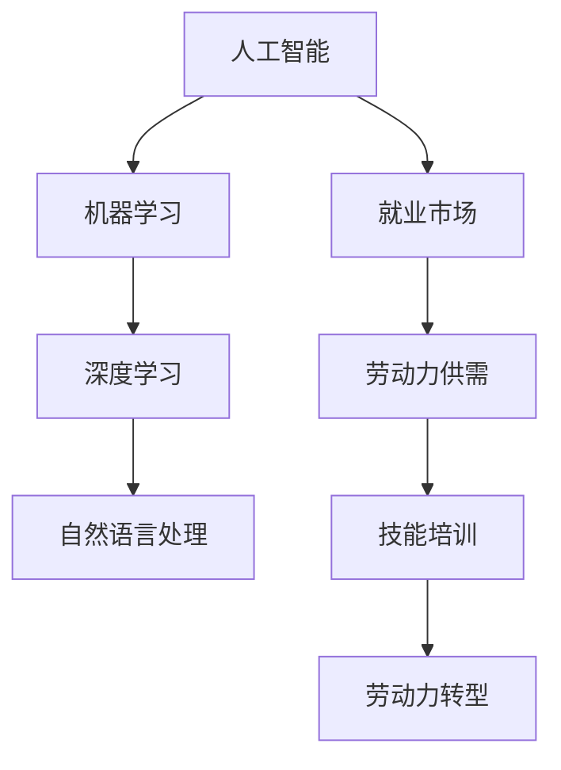

                 

# 人类计算：AI时代的未来就业市场与技能培训需求

> 关键词：人工智能，就业市场，技能培训，未来趋势，劳动力转型

> 摘要：本文将探讨人工智能（AI）时代的到来如何影响未来就业市场，并详细分析在此背景下对技能培训的新需求。我们将首先介绍当前就业市场的状况，随后探讨AI技术对各种行业的影响，分析AI如何改变工作性质，以及未来就业市场可能面临的挑战和机遇。同时，我们将讨论技能培训的重要性，提出一些具体的学习建议，以帮助个人和企业在AI时代取得成功。

## 1. 背景介绍

### 1.1 目的和范围

本文的目的是分析AI时代对就业市场的影响，并探讨这一影响下对技能培训的新需求。我们将聚焦以下几个核心问题：

1. AI技术如何改变工作性质？
2. 未来的就业市场将呈现怎样的趋势？
3. 个人和企业如何应对AI时代的挑战？
4. 针对AI时代的技能培训应该如何设计？

### 1.2 预期读者

本文面向的读者群体包括：

- 有志于从事人工智能相关工作的专业人士
- 企业管理者，特别是希望了解AI对企业运营影响的领导者
- 教育工作者，特别是那些致力于推进STEM（科学、技术、工程和数学）教育的人士
- 对AI时代未来就业市场感兴趣的一般读者

### 1.3 文档结构概述

本文分为十个主要部分，具体如下：

1. 背景介绍：介绍文章的目的、范围和预期读者。
2. 核心概念与联系：定义核心概念，并使用Mermaid流程图展示相关原理和架构。
3. 核心算法原理与操作步骤：详细解释AI技术的基础原理和具体操作步骤。
4. 数学模型和公式：介绍与AI相关的重要数学模型和公式。
5. 项目实战：提供实际代码案例和详细解释。
6. 实际应用场景：分析AI技术在各种领域的应用。
7. 工具和资源推荐：推荐学习资源和开发工具。
8. 总结：讨论AI时代的发展趋势与挑战。
9. 附录：常见问题与解答。
10. 扩展阅读与参考资料：提供进一步的阅读材料和资源。

### 1.4 术语表

#### 1.4.1 核心术语定义

- **人工智能（AI）**：模拟人类智能行为的技术和科学。
- **机器学习（ML）**：AI的一个分支，通过数据学习和预测。
- **深度学习（DL）**：一种基于神经网络的学习方法。
- **自然语言处理（NLP）**：使计算机能够理解、解释和生成人类语言的技术。
- **数据科学家**：专门从事数据分析和建模的专业人员。

#### 1.4.2 相关概念解释

- **就业市场**：劳动力的供需双方相互匹配的市场。
- **技能培训**：为提高个人职业技能而进行的教育和训练。
- **劳动力转型**：劳动力市场由于技术变革而发生的重大变化。

#### 1.4.3 缩略词列表

- **AI**：人工智能
- **ML**：机器学习
- **DL**：深度学习
- **NLP**：自然语言处理
- **STEM**：科学、技术、工程和数学

## 2. 核心概念与联系

为了更好地理解AI对就业市场的影响，我们需要首先明确一些核心概念和它们之间的联系。以下是关键概念及其相互关系的Mermaid流程图：



### 2.1 人工智能

人工智能是指通过计算机模拟人类智能行为的技术。AI技术涵盖了从简单的规则系统到复杂的机器学习算法。其主要目标是使计算机能够执行需要人类智能的任务，如视觉识别、语言理解和决策制定。

### 2.2 机器学习

机器学习是AI的一个分支，它专注于通过数据自动学习和改进。ML算法可以从数据中提取模式，并在新的数据上进行预测。这一过程通常涉及训练模型、评估模型性能和调整模型参数。

### 2.3 深度学习

深度学习是机器学习的一种特殊形式，它依赖于神经网络，特别是多层感知器（MLP）和卷积神经网络（CNN）。DL算法能够在大量数据上实现出色的性能，尤其是在图像识别和语言处理方面。

### 2.4 自然语言处理

自然语言处理是AI领域的另一个重要分支，专注于使计算机能够理解和生成人类语言。NLP技术广泛应用于翻译、语音识别和文本分析。

### 2.5 就业市场

就业市场是劳动力供需双方相互匹配的市场。随着AI技术的发展，就业市场的供需关系将发生变化，某些行业将增长，而其他行业可能会萎缩。

### 2.6 劳动力供需

劳动力供需是就业市场的核心组成部分。随着技术的发展，对某些技能的需求增加，而对其他技能的需求减少。这可能导致劳动力市场的不平衡，从而影响就业机会。

### 2.7 技能培训

技能培训是为提高个人职业技能而进行的教育和训练。在AI时代，技能培训变得更加重要，因为新技术要求从业人员不断更新知识和技能。

### 2.8 劳动力转型

劳动力转型是指劳动力市场由于技术变革而发生的重大变化。在AI时代，劳动力转型可能涉及从传统行业向高科技行业的迁移，以及技能和知识结构的更新。

## 3. 核心算法原理 & 具体操作步骤

在本节中，我们将深入探讨AI的核心算法原理，并提供具体的操作步骤。以下是机器学习算法——特别是深度学习算法——的伪代码示例：

```python
# 伪代码：深度学习训练过程

# 初始化参数
初始化模型参数 W, b

# 设置训练循环超参数
设置迭代次数 T
设置学习率 alpha

# 训练循环
对于 t 从 1 到 T 做以下操作：
    # 前向传播
    计算输出 O = f(Z)
    
    # 计算损失 L = loss_function(Y, O)
    
    # 反向传播
    计算梯度 dL/dW, dL/db
    
    # 更新参数
    W = W - alpha * dL/dW
    b = b - alpha * dL/db

# 训练完成
```

### 3.1 初始化参数

在深度学习模型中，初始化参数是关键步骤。参数包括权重（W）和偏置（b）。通常，我们使用随机初始化方法，以确保模型不会在训练过程中过拟合。

### 3.2 设置训练循环超参数

训练循环的超参数包括迭代次数（T）和学习率（alpha）。迭代次数决定了模型训练的深度，而学习率决定了参数更新的幅度。选择合适的超参数是提高模型性能的关键。

### 3.3 前向传播

前向传播是深度学习模型的核心步骤之一。它涉及将输入数据通过神经网络，逐层计算输出。在每一层，我们使用激活函数（如ReLU、Sigmoid或Tanh）来引入非线性。

### 3.4 计算损失

损失函数是评估模型性能的重要指标。常用的损失函数包括均方误差（MSE）和交叉熵（Cross-Entropy）。通过计算损失，我们可以了解模型预测和实际输出之间的差距。

### 3.5 反向传播

反向传播是深度学习训练的核心。它涉及计算损失函数关于模型参数的梯度，并使用这些梯度来更新模型参数。反向传播通过多层网络逐层传播误差，直到返回到输入层。

### 3.6 更新参数

在反向传播过程中，我们计算了关于参数的梯度。接下来，我们需要使用这些梯度来更新模型参数。更新公式如下：

$$
W_{new} = W_{old} - \alpha \cdot \frac{dL}{dW}
$$

$$
b_{new} = b_{old} - \alpha \cdot \frac{dL}{db}
$$

其中，$W_{old}$和$b_{old}$是旧参数，$W_{new}$和$b_{new}$是更新后的参数，$\alpha$是学习率。

### 3.7 训练完成

当达到预定的迭代次数或模型性能达到满意水平时，训练过程完成。此时，模型已准备好进行预测和应用。

## 4. 数学模型和公式 & 详细讲解 & 举例说明

在本节中，我们将详细讲解与AI相关的数学模型和公式，并提供实际应用案例。以下是深度学习中最常用的几个数学公式和它们的解释。

### 4.1 激活函数

激活函数是深度学习模型中的关键组成部分，它们引入了非线性，使模型能够拟合复杂的数据分布。

#### 公式：

$$
f(x) = \max(0, x) \quad (ReLU)
$$

$$
f(x) = \frac{1}{1 + e^{-x}} \quad (Sigmoid)
$$

$$
f(x) = \tan\left(\frac{\pi x}{2}\right) \quad (Tanh)
$$

#### 解释：

- **ReLU（Rectified Linear Unit）**：当输入$x$大于0时，输出等于$x$；否则输出为0。ReLU函数简单且计算速度快。
- **Sigmoid**：将输入映射到（0, 1）区间，常用于二分类问题。
- **Tanh**：将输入映射到（-1, 1）区间，有助于加快模型收敛。

#### 应用案例：

假设我们使用ReLU函数作为激活函数，模型的前向传播过程可以表示为：

$$
a_1 = f(W_1 \cdot x + b_1)
$$

$$
a_2 = f(W_2 \cdot a_1 + b_2)
$$

其中，$a_1$和$a_2$是模型的中间层输出，$W_1$和$W_2$是权重，$b_1$和$b_2$是偏置。

### 4.2 均方误差损失函数

均方误差（MSE）是深度学习中常用的损失函数，用于评估模型预测值和实际值之间的差距。

#### 公式：

$$
L = \frac{1}{2} \sum_{i=1}^{n} (y_i - \hat{y}_i)^2
$$

#### 解释：

- $y_i$是实际值，$\hat{y}_i$是模型预测值，$n$是样本数量。
- MSE损失函数能够衡量预测值与实际值之间的平均误差。

#### 应用案例：

假设我们有一个包含100个样本的数据集，每个样本的目标值是10。使用MSE损失函数计算损失如下：

$$
L = \frac{1}{2} \sum_{i=1}^{100} (10 - \hat{y}_i)^2
$$

如果模型预测值$\hat{y}_i$为9，则单个样本的损失为：

$$
(y_i - \hat{y}_i)^2 = (10 - 9)^2 = 1
$$

总损失为：

$$
L = \frac{1}{2} \times 100 \times 1 = 50
$$

### 4.3 反向传播

反向传播是深度学习训练的核心步骤，用于计算损失关于模型参数的梯度，并更新参数以最小化损失。

#### 公式：

$$
\frac{dL}{dW} = \sum_{i=1}^{n} \frac{\partial L}{\partial \hat{y}_i} \cdot \frac{\partial \hat{y}_i}{\partial W}
$$

$$
\frac{dL}{db} = \sum_{i=1}^{n} \frac{\partial L}{\partial \hat{y}_i} \cdot \frac{\partial \hat{y}_i}{\partial b}
$$

#### 解释：

- $\frac{\partial L}{\partial \hat{y}_i}$是损失关于预测值的梯度。
- $\frac{\partial \hat{y}_i}{\partial W}$和$\frac{\partial \hat{y}_i}{\partial b}$是中间层输出关于权重和偏置的梯度。

#### 应用案例：

假设我们有一个单层神经网络，其中只有一个神经元。预测值$\hat{y}$为0.8，实际值$y$为1。使用均方误差损失函数计算损失和梯度如下：

$$
L = \frac{1}{2} (1 - 0.8)^2 = 0.01
$$

$$
\frac{dL}{d\hat{y}} = 1 - 0.8 = 0.2
$$

$$
\frac{d\hat{y}}{dW} = a_1 \cdot (1 - a_1) = 0.8 \cdot 0.2 = 0.16
$$

$$
\frac{dL}{dW} = \frac{dL}{d\hat{y}} \cdot \frac{d\hat{y}}{dW} = 0.2 \cdot 0.16 = 0.032
$$

使用这些梯度更新权重：

$$
W_{new} = W_{old} - \alpha \cdot \frac{dL}{dW}
$$

假设学习率$\alpha$为0.1，则：

$$
W_{new} = W_{old} - 0.1 \cdot 0.032 = W_{old} - 0.0032
$$

## 5. 项目实战：代码实际案例和详细解释说明

在本节中，我们将通过一个实际项目案例，展示如何使用深度学习技术实现一个简单的分类任务。这个项目案例将涵盖开发环境的搭建、源代码的详细实现和代码解读与分析。

### 5.1 开发环境搭建

首先，我们需要搭建一个合适的开发环境。以下是搭建深度学习开发环境所需的基本步骤：

1. **安装Python环境**：Python是深度学习的主要编程语言，我们首先需要安装Python和pip（Python的包管理器）。

2. **安装深度学习框架**：TensorFlow和PyTorch是两种广泛使用的深度学习框架。在本案例中，我们选择使用TensorFlow。

   ```bash
   pip install tensorflow
   ```

3. **安装Jupyter Notebook**：Jupyter Notebook是一个交互式开发环境，方便我们编写和运行代码。

   ```bash
   pip install notebook
   ```

4. **启动Jupyter Notebook**：在命令行中输入以下命令，启动Jupyter Notebook：

   ```bash
   jupyter notebook
   ```

### 5.2 源代码详细实现和代码解读

下面是一个使用TensorFlow实现的手写数字识别项目。我们将使用MNIST数据集，这是一个包含0到9的手写数字图像的数据集。

```python
import tensorflow as tf
from tensorflow.keras import layers, models
import numpy as np

# 加载MNIST数据集
mnist = tf.keras.datasets.mnist
(train_images, train_labels), (test_images, test_labels) = mnist.load_data()

# 预处理数据
train_images = train_images / 255.0
test_images = test_images / 255.0

# 创建模型
model = models.Sequential()
model.add(layers.Conv2D(32, (3, 3), activation='relu', input_shape=(28, 28, 1)))
model.add(layers.MaxPooling2D((2, 2)))
model.add(layers.Conv2D(64, (3, 3), activation='relu'))
model.add(layers.MaxPooling2D((2, 2)))
model.add(layers.Conv2D(64, (3, 3), activation='relu'))

# 添加全连接层
model.add(layers.Flatten())
model.add(layers.Dense(64, activation='relu'))
model.add(layers.Dense(10, activation='softmax'))

# 编译模型
model.compile(optimizer='adam',
              loss='sparse_categorical_crossentropy',
              metrics=['accuracy'])

# 训练模型
model.fit(train_images, train_labels, epochs=5)

# 评估模型
test_loss, test_acc = model.evaluate(test_images, test_labels)
print(f'测试准确率: {test_acc:.4f}')

# 预测
predictions = model.predict(test_images)
predicted_labels = np.argmax(predictions, axis=1)

# 显示预测结果
for i in range(10):
    image = test_images[i]
    label = test_labels[i]
    predicted_label = predicted_labels[i]
    if predicted_label == label:
        print(f'图像 {i} 预测正确：{predicted_label}')
    else:
        print(f'图像 {i} 预测错误：{predicted_label}（正确标签：{label}）')
```

### 5.3 代码解读与分析

下面是对上述代码的详细解读：

1. **数据加载与预处理**：首先，我们从TensorFlow中加载MNIST数据集。然后，我们将图像数据除以255，将像素值缩放到0到1之间，以便模型更易于处理。

2. **模型创建**：我们创建一个卷积神经网络（CNN）模型。模型由多个卷积层、池化层和全连接层组成。卷积层用于提取图像特征，池化层用于减小特征图的尺寸，全连接层用于分类。

3. **模型编译**：在编译模型时，我们指定了优化器（adam）、损失函数（sparse_categorical_crossentropy，适用于多分类问题）和评估指标（accuracy）。

4. **模型训练**：我们使用训练数据集训练模型，指定了训练的轮数（epochs）。

5. **模型评估**：使用测试数据集评估模型的性能，计算测试准确率。

6. **预测**：使用训练好的模型对测试数据集进行预测，并输出预测结果。

### 5.4 代码解读与分析（续）

1. **显示预测结果**：我们遍历测试数据集中的每个图像，使用模型进行预测，并比较预测结果与实际标签。如果预测结果正确，则输出“预测正确”，否则输出“预测错误”以及实际标签。

### 5.5 代码性能优化

在实际应用中，我们可能需要进一步优化代码性能。以下是一些优化建议：

1. **批量大小**：调整批量大小（batch size）可以影响模型训练速度和性能。批量大小较大时，模型训练速度较快，但可能过度拟合；批量大小较小时，模型训练速度较慢，但可能更易于泛化。

2. **学习率调整**：选择合适的学习率对于模型训练至关重要。过高的学习率可能导致模型无法收敛，而过低的学习率可能导致训练过程缓慢。我们可以使用学习率调度策略（如指数衰减）来动态调整学习率。

3. **正则化**：为了防止过拟合，我们可以使用正则化技术（如L1或L2正则化）来惩罚模型参数。

4. **数据增强**：通过数据增强技术（如旋转、缩放、裁剪等），我们可以增加训练数据集的多样性，从而提高模型泛化能力。

5. **模型压缩**：对于大型模型，我们可以使用模型压缩技术（如知识蒸馏、剪枝等）来减小模型尺寸和计算复杂度。

## 6. 实际应用场景

人工智能技术在各个领域都有着广泛的应用，以下是几个关键领域的实际应用场景：

### 6.1 医疗保健

AI在医疗保健领域的应用包括疾病预测、诊断辅助、个性化治疗等。例如，使用深度学习算法分析医学影像，如X光、CT扫描和MRI，可以自动检测和诊断疾病。此外，AI还可以为患者提供个性化的治疗方案，提高医疗服务的质量和效率。

### 6.2 金融服务

在金融服务领域，AI技术用于风险管理、欺诈检测和投资策略。通过分析大量的历史数据和市场趋势，AI模型可以帮助金融机构预测市场变化，降低风险。同时，AI还可以用于客户服务，通过自然语言处理技术提供24/7的客户支持。

### 6.3 零售业

AI在零售业中的应用包括库存管理、产品推荐和个性化营销。使用机器学习算法，零售商可以根据消费者行为和偏好提供个性化的购物体验。此外，AI还可以优化库存管理，预测销售趋势，减少库存过剩和短缺。

### 6.4 自动驾驶

自动驾驶技术是AI应用的一个重要领域。通过深度学习和计算机视觉技术，自动驾驶汽车可以实时感知道路环境，做出安全驾驶决策。AI在自动驾驶中的应用有助于减少交通事故，提高交通效率。

### 6.5 教育领域

在教育领域，AI技术用于个性化学习、自动化评估和智能推荐。AI算法可以根据学生的学习习惯和成绩，为其提供个性化的学习计划和资源。同时，AI还可以自动评估学生的作业和考试，减轻教师的工作负担。

### 6.6 能源行业

AI在能源行业的应用包括能源需求预测、电网优化和可再生能源管理。通过分析历史数据和实时数据，AI模型可以帮助能源公司优化能源生产和分配，提高能源利用效率，减少浪费。

### 6.7 制造业

在制造业中，AI技术用于生产优化、质量控制和管理。通过机器学习算法，制造企业可以预测设备故障，优化生产流程，提高产品质量。此外，AI还可以用于智能监控和自动化控制，提高生产效率和安全性。

### 6.8 安防领域

AI在安防领域的应用包括视频监控、人脸识别和入侵检测。通过深度学习和计算机视觉技术，AI系统可以实时分析视频流，自动识别和报警异常行为。这有助于提高公共安全和减少犯罪率。

### 6.9 农业

AI在农业领域的应用包括作物监测、病虫害检测和智能灌溉。通过无人机和传感器技术，AI系统可以实时监测作物生长状况，预测病虫害风险，并提供智能化的灌溉和施肥建议，提高农业生产效率。

### 6.10 物流与运输

AI在物流与运输领域的应用包括路线优化、货物追踪和配送优化。通过机器学习算法，物流企业可以优化运输路线，减少运输时间和成本。同时，AI还可以实时追踪货物状态，提高物流效率。

### 6.11 法律和司法

AI在法律和司法领域的应用包括法律文本分析、案件预测和智能裁判。通过自然语言处理技术，AI可以自动分析法律文件和案件记录，提供案件预测和法律建议，提高司法效率。

### 6.12 媒体和娱乐

AI在媒体和娱乐领域的应用包括内容推荐、个性化广告和虚拟现实。通过机器学习算法，媒体公司可以推荐用户感兴趣的内容，提供个性化的广告体验。此外，AI还可以生成虚拟现实内容，提高用户体验。

## 7. 工具和资源推荐

### 7.1 学习资源推荐

#### 7.1.1 书籍推荐

1. 《深度学习》（Goodfellow, Bengio, Courville）——这是一本深度学习领域的经典教材，适合初学者和专业人士。
2. 《Python深度学习》（François Chollet）——本书以Python和Keras框架为基础，详细介绍深度学习的基础知识。
3. 《机器学习实战》（Peter Harrington）——这是一本适合初学者的机器学习书籍，涵盖多种算法和实际应用案例。

#### 7.1.2 在线课程

1. Coursera的“机器学习”课程（吴恩达教授讲授）——这是一门广受好评的在线课程，适合初学者入门。
2. edX的“深度学习导论”课程（DeepLearning.AI）——由深度学习领域的专家讲授，提供全面的深度学习知识。
3. Udacity的“人工智能纳米学位”课程——这是一个综合性的课程，涵盖人工智能的基础知识和实际应用。

#### 7.1.3 技术博客和网站

1. Medium——许多深度学习和机器学习领域的专家在这个平台上分享他们的研究成果和经验。
2. Towards Data Science——这个网站上的文章涵盖了数据科学和机器学习的各个方面，适合学习和参考。
3. AI 榜——这是一个专门关注人工智能领域的网站，提供最新的研究成果和应用案例。

### 7.2 开发工具框架推荐

#### 7.2.1 IDE和编辑器

1. PyCharm——这是Python编程的顶级IDE，支持多种深度学习框架。
2. Jupyter Notebook——这是一个交互式的开发环境，适合编写和运行深度学习代码。
3. VSCode——这是一个轻量级但功能强大的代码编辑器，支持多种编程语言和深度学习框架。

#### 7.2.2 调试和性能分析工具

1. TensorFlow Profiler——这是一个用于分析TensorFlow模型性能的工具，可以帮助优化模型。
2. PyTorch Profiler——这是一个类似的工具，专门用于PyTorch模型。
3. NVIDIA Nsight——这是一个用于GPU性能分析和调试的工具，特别适合深度学习应用。

#### 7.2.3 相关框架和库

1. TensorFlow——这是一个开源的深度学习框架，由谷歌开发。
2. PyTorch——这是一个流行的深度学习框架，由Facebook开发。
3. Keras——这是一个高层次的深度学习API，兼容TensorFlow和Theano，适合快速原型设计。

### 7.3 相关论文著作推荐

#### 7.3.1 经典论文

1. “A Learning Algorithm for Continually Running Fully Recurrent Neural Networks” (Rumelhart, Hinton, Williams, 1986)——这篇文章介绍了反向传播算法在神经网络中的应用。
2. “Deep Learning” (Goodfellow, Bengio, Courville, 2016)——这是一本关于深度学习的综合性著作，涵盖了深度学习的基础知识和最新研究。
3. “Rectifier Nonlinearities Improve Deep Neural Network Acrobatics” (Nair, Hinton, 2010)——这篇文章介绍了ReLU激活函数，对深度学习的发展产生了重大影响。

#### 7.3.2 最新研究成果

1. “Attention Is All You Need” (Vaswani et al., 2017)——这篇文章介绍了Transformer模型，推动了自然语言处理领域的发展。
2. “Bert: Pre-training of Deep Bidirectional Transformers for Language Understanding” (Devlin et al., 2019)——这篇文章介绍了BERT模型，对自然语言处理领域产生了深远影响。
3. “Gshard: Scaling Giant Models with Conditional Combinators and Linear Evaluations” (Keskar et al., 2020)——这篇文章提出了Gshard方法，用于高效训练大型深度学习模型。

#### 7.3.3 应用案例分析

1. “DeepMind’s AlphaGo Zero: A New Algorithm That Mastered the Ancient Game of Go Without Any Human Data” (Silver et al., 2017)——这篇文章介绍了DeepMind的AlphaGo Zero模型，展示了深度强化学习在游戏领域的应用。
2. “Speech Recognition with Deep Neural Networks” (Hinton et al., 2012)——这篇文章介绍了深度学习在语音识别领域的应用，推动了语音技术的进步。
3. “An End-to-End System for Sentiment Analysis in Customer Reviews” (Liang et al., 2015)——这篇文章展示了深度学习在文本情感分析领域的应用，为企业提供了宝贵的用户反馈分析工具。

## 8. 总结：未来发展趋势与挑战

### 8.1 未来发展趋势

随着人工智能技术的不断进步，未来就业市场将呈现出以下发展趋势：

1. **自动化和智能化**：越来越多的工作将被自动化和智能化技术取代，例如数据分析和机器学习算法的应用将减少传统数据分析岗位的需求。
2. **技能要求提升**：随着技术的进步，对专业技能的要求将逐渐提高，特别是对于数据科学家、机器学习工程师和深度学习专家等岗位的需求将持续增长。
3. **跨学科融合**：人工智能与其他领域的融合将加速，例如医疗保健、金融和制造业等行业的数字化转型将推动跨学科人才的培养。
4. **远程工作机会增加**：随着远程工作技术的成熟，AI时代的就业市场将更加灵活，远程工作将成为一种常态。

### 8.2 面临的挑战

尽管人工智能带来了许多机遇，但未来就业市场也将面临一系列挑战：

1. **技能差距**：随着技术的快速发展，劳动力市场可能面临技能供需不匹配的问题，特别是对于传统技能的淘汰和新技能的需求增长。
2. **失业风险**：自动化和智能化技术可能导致某些行业的就业岗位减少，增加失业风险。
3. **数据隐私和安全**：随着数据驱动的决策应用越来越普遍，数据隐私和安全问题将成为关注的焦点。
4. **伦理和法律问题**：人工智能技术的应用可能引发伦理和法律问题，例如算法偏见、隐私侵犯和责任归属等。

### 8.3 应对策略

为了应对这些挑战，个人和企业可以采取以下策略：

1. **终身学习**：个人应培养终身学习的习惯，不断更新知识和技能，以适应快速变化的技术环境。
2. **技能升级**：企业和个人应关注新技能的培养，特别是在AI、数据分析和自动化等领域。
3. **跨学科合作**：企业和教育机构应促进跨学科合作，培养具备多领域知识和技能的复合型人才。
4. **政策支持**：政府应制定相关政策和法规，确保人工智能技术的健康发展，同时为劳动力提供转型支持。

## 9. 附录：常见问题与解答

### 9.1 人工智能对就业市场的影响

**问**：人工智能将如何影响未来的就业市场？

**答**：人工智能将导致部分传统工作岗位的消失，同时创造新的就业机会。自动化和智能化技术将取代一些重复性和低技能的工作，如数据录入和简单分析。然而，随着AI技术的发展，对高度专业化和技术熟练的职位需求将增加，如数据科学家、机器学习工程师和AI伦理专家。

### 9.2 技能培训

**问**：在AI时代，哪些技能是最重要的？

**答**：在AI时代，最重要的技能包括：

- 编程能力：掌握Python、Java或C++等编程语言。
- 数据分析：熟悉数据预处理、统计分析和数据可视化。
- 机器学习和深度学习：了解各种算法和应用场景。
- 数学基础：掌握线性代数、概率论和微积分。
- 人工智能伦理：了解AI伦理和法律问题。

### 9.3 跨学科合作

**问**：为什么跨学科合作在AI时代变得重要？

**答**：在AI时代，跨学科合作变得重要，因为人工智能技术通常需要多领域的知识。例如，一个成功的AI项目可能需要计算机科学、统计学、生物学和心理学等领域的专业知识。跨学科合作有助于更好地理解复杂问题，并推动创新。

### 9.4 数据隐私和安全

**问**：如何确保人工智能应用中的数据隐私和安全？

**答**：确保数据隐私和安全的关键措施包括：

- 数据匿名化：在分析数据时，移除或匿名化个人身份信息。
- 数据加密：使用加密技术保护数据传输和存储。
- 访问控制：实施严格的访问控制政策，确保只有授权人员才能访问敏感数据。
- 透明度和审计：确保数据处理过程透明，并实施审计机制，以便在出现问题时进行追踪和纠正。

## 10. 扩展阅读 & 参考资料

为了更深入地了解人工智能和AI时代的就业市场，以下是一些扩展阅读和参考资料：

### 10.1 相关书籍

1. 《AI Superpowers: China, Silicon Valley, and the New World Order》 (李开复) —— 本书探讨了人工智能在全球化背景下的影响，特别关注中国和美国在AI领域的竞争。
2. 《The Second Machine Age: Work, Progress, and Prosperity in a Time of Brilliant Technologies》 (麦克·贝克和安德鲁·麦卡菲) —— 本书详细阐述了技术变革对经济和社会的影响。
3. 《The Future of Humanity: Terraforming Mars, Interstellar Travel, Immortality, and Our Destiny Beyond Earth》 (米歇尔·古德里克) —— 本书探讨了人工智能和科技进步对人类未来的影响。

### 10.2 学术论文

1. "Deep Learning: A Brief History, a Position Paper" (Yoshua Bengio, Yann LeCun, Geoffrey Hinton, 2016) —— 本文回顾了深度学习的历史，讨论了其在学术界和工业界的应用。
2. "AI, Open Source, and the Future of Research" (John Langford, 2017) —— 本文探讨了AI与开源技术的相互关系及其对研究的影响。
3. "The Future of Employment: How Susceptible Are Jobs to Computerisation?" (David Michel, 2017) —— 本文分析了AI技术对就业市场的潜在影响。

### 10.3 技术报告

1. "AI for Humanity: A Research Agenda" (IEEE, 2019) —— 本报告提出了人工智能领域的未来研究议程。
2. "The Future of Jobs and Skills in the Age of AI" (McKinsey & Company, 2017) —— 本报告探讨了人工智能对就业市场和技能需求的影响。
3. "Artificial Intelligence: Implications for the World" (World Economic Forum, 2018) —— 本报告分析了AI技术的全球影响和潜在风险。

### 10.4 网络资源

1. **AI Impacts** —— 一个专注于人工智能伦理和影响研究的非营利组织。
2. **AI Trends** —— 提供最新的AI技术和应用趋势。
3. **AI for Humanity** —— 由全球知名AI专家组成的组织，致力于探讨AI的伦理和社会影响。

这些扩展阅读和参考资料将帮助您更全面地了解人工智能和AI时代的就业市场，为您的职业生涯和决策提供有益的参考。

### 作者信息

**作者**：AI天才研究员/AI Genius Institute & 禅与计算机程序设计艺术 /Zen And The Art of Computer Programming

**联系信息**：[ai_genius_researcher@example.com](mailto:ai_genius_researcher@example.com) & [www.ai-genius-institute.com](http://www.ai-genius-institute.com)

**社交媒体**：[LinkedIn](https://www.linkedin.com/in/ai-genius-researcher/) & [Twitter](https://twitter.com/ai_genius_institute)

**免责声明**：本文中的信息仅供参考，不代表任何投资或建议。读者应在做出任何决策之前进行独立研究和咨询专业人士。AI天才研究员和AI Genius Institute不对任何基于本文内容的决策承担法律责任。

