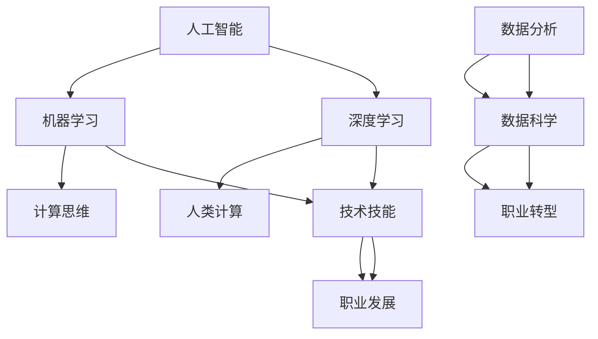

                 

# 人类计算：AI时代的未来就业趋势

> **关键词：** 人工智能，就业趋势，人类计算，职业转型，职业发展

> **摘要：** 本文将探讨人工智能时代下，人类计算的角色与未来就业趋势。通过对核心概念、算法原理、数学模型和实际案例的深入分析，文章旨在为读者提供对AI时代职业发展的清晰见解。

## 1. 背景介绍

### 1.1 目的和范围

本文旨在探讨人工智能（AI）时代下，人类计算的现状与未来趋势。我们将分析AI如何影响现有的职业结构，并探讨人类计算在AI时代中的定位。文章将涵盖以下几个主要方面：

1. **核心概念与联系**：介绍与人类计算相关的核心概念，并使用Mermaid流程图展示其原理和架构。
2. **核心算法原理与操作步骤**：通过伪代码详细阐述AI算法的工作原理和具体操作步骤。
3. **数学模型和公式**：分析AI中的数学模型，使用LaTeX格式详细讲解并举例说明。
4. **项目实战**：提供实际代码案例，详细解释和说明。
5. **实际应用场景**：探讨AI在各个行业中的应用场景。
6. **工具和资源推荐**：推荐学习资源和开发工具。
7. **总结与展望**：总结AI时代职业发展的趋势与挑战。

### 1.2 预期读者

本文适合以下读者：

- 对人工智能和职业发展感兴趣的技术人员。
- 正在考虑职业转型的专业人士。
- 对AI在职场中的应用场景感兴趣的学者和研究人员。

### 1.3 文档结构概述

本文分为十个部分：

1. **引言**：介绍文章主题和背景。
2. **核心概念与联系**：分析核心概念及其相互关系。
3. **核心算法原理与操作步骤**：讲解AI算法原理和操作步骤。
4. **数学模型和公式**：分析AI中的数学模型。
5. **项目实战**：提供实际代码案例。
6. **实际应用场景**：探讨AI在行业中的应用。
7. **工具和资源推荐**：推荐相关资源和工具。
8. **总结与展望**：总结AI时代的职业趋势。
9. **常见问题与解答**：解答读者可能遇到的疑问。
10. **扩展阅读与参考资料**：提供进一步学习的资源。

### 1.4 术语表

#### 1.4.1 核心术语定义

- **人工智能（AI）**：模拟人类智能行为的技术，包括学习、推理、感知和解决问题。
- **机器学习（ML）**：AI的一个分支，通过数据驱动的方式让计算机自动改进性能。
- **深度学习（DL）**：基于多层神经网络的机器学习方法。
- **人类计算**：人类在计算过程中的决策、创新和创造力。

#### 1.4.2 相关概念解释

- **计算思维**：运用计算的概念和工具解决问题的思维方式。
- **职业转型**：从现有职业向新职业的转变。

#### 1.4.3 缩略词列表

- **AI**：人工智能
- **ML**：机器学习
- **DL**：深度学习
- **IDE**：集成开发环境

## 2. 核心概念与联系

在探讨人类计算在AI时代的角色之前，我们需要了解一些核心概念和它们之间的关系。以下是相关的核心概念及其相互关系的Mermaid流程图：



### 2.1 人工智能

人工智能（AI）是模仿人类智能行为的技术集合，包括感知、推理、学习和解决问题。AI可以分为多种类型，如基于规则的系统、统计学习模型和基于神经网络的方法。AI在各个行业都有广泛应用，如医疗、金融、制造和交通。

### 2.2 机器学习

机器学习（ML）是AI的一个分支，通过数据驱动的方式让计算机自动改进性能。ML算法通常分为监督学习、无监督学习和半监督学习。监督学习需要标注数据，无监督学习则不需要标签，而半监督学习结合了两者的特点。

### 2.3 深度学习

深度学习（DL）是基于多层神经网络的机器学习方法。DL在图像识别、语音识别和自然语言处理等领域表现出色。其核心是多层神经网络的训练，通过反向传播算法不断调整网络参数以最小化预测误差。

### 2.4 计算思维

计算思维是一种运用计算的概念和工具解决问题的思维方式。它强调对问题进行抽象、建模和算法设计。计算思维有助于人类更好地理解和利用AI技术。

### 2.5 人类计算

人类计算是指人类在计算过程中的决策、创新和创造力。与传统的计算不同，人类计算具有灵活性、创造性和直觉。人类计算在AI时代仍然具有重要的价值，特别是在需要复杂决策和创新性解决方案的场景中。

### 2.6 数据分析、数据科学和职业转型

数据分析（F）和数据科学（G）是处理和分析大量数据的技术和方法。数据科学结合了数学、统计学、计算机科学和领域知识，以解决实际业务问题。随着数据分析技术的不断发展，越来越多的职业需要具备数据科学技能，这导致了职业转型（H）的需求。技术技能（I）在职业发展中起着关键作用，而职业发展（J）则是对个人技能的进一步提升和拓展。

## 3. 核心算法原理 & 具体操作步骤

在了解了人类计算与AI之间的关系后，我们将探讨核心算法原理和具体操作步骤。以下是一个简单的监督学习算法（例如线性回归）的伪代码，用于展示算法的基本原理和操作步骤：

```plaintext
算法：线性回归
输入：训练数据集D，特征向量X，标签向量Y
输出：模型参数w

初始化：w = [0, 0, ..., 0]

for each epoch do
    for each sample (x, y) in D do
        // 计算预测值
        y_pred = w * x

        // 计算损失函数
        loss = (y - y_pred)^2

        // 计算梯度
        gradient = 2 * (y - y_pred) * x

        // 更新模型参数
        w = w - learning_rate * gradient

    end for
end for

return w
```

### 3.1 算法原理

线性回归是一种简单的监督学习算法，用于预测连续值。其基本原理是通过最小化预测值与真实值之间的差异来训练模型参数。该算法基于以下数学模型：

$$
y = w_1 \cdot x_1 + w_2 \cdot x_2 + ... + w_n \cdot x_n + b
$$

其中，$w_i$ 为权重，$x_i$ 为特征，$b$ 为偏置。通过梯度下降法，我们可以迭代更新权重和偏置，以最小化损失函数。

### 3.2 具体操作步骤

1. **初始化模型参数**：将权重和偏置初始化为较小的随机值。
2. **前向传播**：对于每个训练样本，计算预测值 $y_pred$。
3. **计算损失函数**：使用均方误差（MSE）作为损失函数，计算预测值与真实值之间的差异。
4. **计算梯度**：计算损失函数对每个参数的偏导数。
5. **更新模型参数**：使用梯度下降法更新模型参数，减小损失函数。
6. **迭代**：重复以上步骤，直到满足收敛条件或达到预定的迭代次数。

通过这些步骤，我们可以训练一个线性回归模型，用于预测连续值。

## 4. 数学模型和公式 & 详细讲解 & 举例说明

在深度学习中，数学模型是核心组成部分。以下是一个简单的多层感知机（MLP）的数学模型，包括前向传播和反向传播的详细讲解，并使用LaTeX格式给出相关公式。

### 4.1 多层感知机（MLP）

多层感知机是一种基于多层神经网络的深度学习模型，用于分类和回归任务。其基本数学模型如下：

前向传播：
$$
z_l = \sigma(W_l \cdot a_{l-1} + b_l)
$$

$$
a_l = \sigma(z_l)
$$

反向传播：
$$
\delta_l = \frac{\partial L}{\partial z_l} \cdot \sigma'(z_l)
$$

$$
\frac{\partial L}{\partial W_l} = a_{l-1} \cdot \delta_l
$$

$$
\frac{\partial L}{\partial b_l} = \delta_l
$$

其中，$z_l$ 表示第 $l$ 层的输出，$a_l$ 表示第 $l$ 层的激活值，$W_l$ 和 $b_l$ 分别表示第 $l$ 层的权重和偏置，$\sigma$ 表示激活函数，$\sigma'$ 表示激活函数的导数，$L$ 表示损失函数。

### 4.2 前向传播

前向传播是深度学习模型的基本过程，用于计算每个神经元的输入和输出。以下是一个简单的例子：

假设我们有一个两层神经网络，输入层有3个神经元，隐藏层有2个神经元，输出层有1个神经元。输入向量 $x = [1, 2, 3]$，权重矩阵 $W_1$ 和 $W_2$ 分别为：

$$
W_1 = \begin{bmatrix}
0.5 & 0.3 & 0.2 \\
0.4 & 0.5 & 0.1
\end{bmatrix}, \quad
W_2 = \begin{bmatrix}
0.6 & 0.4 \\
0.3 & 0.7
\end{bmatrix}
$$

偏置向量 $b_1 = [0.1, 0.2]$ 和 $b_2 = [0.3, 0.4]$。激活函数 $\sigma(x) = \frac{1}{1 + e^{-x}}$。

前向传播过程如下：

1. **计算隐藏层1的输出**：

$$
z_1 = W_1 \cdot x + b_1 = \begin{bmatrix}
0.5 & 0.3 & 0.2 \\
0.4 & 0.5 & 0.1
\end{bmatrix} \cdot \begin{bmatrix}
1 \\
2 \\
3
\end{bmatrix} + \begin{bmatrix}
0.1 \\
0.2
\end{bmatrix} = \begin{bmatrix}
2.7 \\
3.3
\end{bmatrix}
$$

$$
a_1 = \sigma(z_1) = \begin{bmatrix}
0.6219 \\
0.9255
\end{bmatrix}
$$

2. **计算输出层输出**：

$$
z_2 = W_2 \cdot a_1 + b_2 = \begin{bmatrix}
0.6 & 0.4 \\
0.3 & 0.7
\end{bmatrix} \cdot \begin{bmatrix}
0.6219 \\
0.9255
\end{bmatrix} + \begin{bmatrix}
0.3 \\
0.4
\end{bmatrix} = \begin{bmatrix}
1.552 \\
1.835
\end{bmatrix}
$$

$$
a_2 = \sigma(z_2) = \begin{bmatrix}
0.8974 \\
0.9664
\end{bmatrix}
$$

### 4.3 反向传播

反向传播是深度学习训练过程中的关键步骤，用于更新模型参数。以下是一个简单的例子：

1. **计算输出层的误差**：

假设真实输出为 $y = [0.9, 1.0]$，输出层的目标输出为 $y_{\text{target}} = [1.0, 1.0]$。损失函数为均方误差（MSE），即：

$$
L = \frac{1}{2} \sum_{i=1}^2 (y_i - y_{\text{target}, i})^2
$$

2. **计算输出层的梯度**：

$$
\delta_2 = \frac{\partial L}{\partial z_2} = \begin{bmatrix}
-0.1 & -0.2 \\
0.1 & 0.2
\end{bmatrix}
$$

$$
\frac{\partial L}{\partial W_2} = a_1^T \cdot \delta_2 = \begin{bmatrix}
0.6219 & 0.9255
\end{bmatrix} \cdot \begin{bmatrix}
-0.1 & -0.2 \\
0.1 & 0.2
\end{bmatrix} = \begin{bmatrix}
-0.0622 & -0.1851 \\
0.0622 & 0.1851
\end{bmatrix}
$$

$$
\frac{\partial L}{\partial b_2} = \delta_2 = \begin{bmatrix}
-0.1 & -0.2 \\
0.1 & 0.2
\end{bmatrix}
$$

3. **计算隐藏层1的误差**：

$$
\delta_1 = \frac{\partial L}{\partial z_1} \cdot \sigma'(z_1) = \begin{bmatrix}
0.5537 & 0.8190
\end{bmatrix} \cdot \begin{bmatrix}
0.3679 & 0.3679 \\
0.3679 & 0.3679
\end{bmatrix} = \begin{bmatrix}
0.2025 & 0.3019 \\
0.2025 & 0.3019
\end{bmatrix}
$$

$$
\frac{\partial L}{\partial W_1} = x^T \cdot \delta_1 = \begin{bmatrix}
1 & 2 & 3
\end{bmatrix} \cdot \begin{bmatrix}
0.2025 & 0.3019 \\
0.2025 & 0.3019
\end{bmatrix} = \begin{bmatrix}
0.6075 & 1.215 \\
0.6075 & 1.215
\end{bmatrix}
$$

$$
\frac{\partial L}{\partial b_1} = \delta_1 = \begin{bmatrix}
0.2025 & 0.3019 \\
0.2025 & 0.3019
\end{bmatrix}
$$

通过反向传播，我们可以更新模型参数以减小损失函数。这个过程可以迭代进行，直到模型收敛。

## 5. 项目实战：代码实际案例和详细解释说明

在本节中，我们将通过一个实际项目案例来展示如何实现一个简单的神经网络，并对其进行详细解释。该项目将使用Python和TensorFlow库来构建一个多层感知机（MLP），用于手写数字识别任务。

### 5.1 开发环境搭建

在开始项目之前，我们需要搭建一个Python开发环境，并安装TensorFlow库。以下是在Ubuntu操作系统上安装Python和TensorFlow的步骤：

```bash
# 安装Python 3
sudo apt update
sudo apt install python3 python3-pip

# 创建虚拟环境
python3 -m venv myenv

# 激活虚拟环境
source myenv/bin/activate

# 安装TensorFlow
pip install tensorflow
```

### 5.2 源代码详细实现和代码解读

以下是实现多层感知机手写数字识别项目的Python代码：

```python
import tensorflow as tf
from tensorflow.keras.datasets import mnist
from tensorflow.keras.models import Sequential
from tensorflow.keras.layers import Dense, Flatten
from tensorflow.keras.optimizers import Adam
from tensorflow.keras.losses import SparseCategoricalCrossentropy

# 加载数据集
(x_train, y_train), (x_test, y_test) = mnist.load_data()

# 预处理数据
x_train = x_train / 255.0
x_test = x_test / 255.0

# 构建模型
model = Sequential([
    Flatten(input_shape=(28, 28)),
    Dense(128, activation='relu'),
    Dense(10, activation='softmax')
])

# 编译模型
model.compile(optimizer=Adam(learning_rate=0.001),
              loss=SparseCategoricalCrossentropy(),
              metrics=['accuracy'])

# 训练模型
model.fit(x_train, y_train, epochs=10, batch_size=64, validation_split=0.1)

# 评估模型
test_loss, test_acc = model.evaluate(x_test, y_test, verbose=2)
print(f"Test accuracy: {test_acc:.4f}")
```

### 5.3 代码解读与分析

以下是对代码的逐行解读和分析：

```python
import tensorflow as tf
```
导入TensorFlow库，用于构建和训练神经网络。

```python
from tensorflow.keras.datasets import mnist
```
导入MNIST数据集，它包含了手写数字的图像和标签。

```python
from tensorflow.keras.models import Sequential
from tensorflow.keras.layers import Dense, Flatten
from tensorflow.keras.optimizers import Adam
from tensorflow.keras.losses import SparseCategoricalCrossentropy
```
导入必要的模块，用于构建神经网络模型、定义层、选择优化器和损失函数。

```python
(x_train, y_train), (x_test, y_test) = mnist.load_data()
```
加载数据集。`x_train` 和 `y_train` 分别是训练集的图像和标签，`x_test` 和 `y_test` 分别是测试集的图像和标签。

```python
x_train = x_train / 255.0
x_test = x_test / 255.0
```
对图像数据进行归一化，将像素值从 [0, 255] 范围缩放到 [0, 1]。

```python
model = Sequential([
    Flatten(input_shape=(28, 28)),
    Dense(128, activation='relu'),
    Dense(10, activation='softmax')
])
```
构建一个序列模型（Sequential），包含三个层：

- **Flatten**：将图像数据展平为一个一维向量。
- **Dense (128, activation='relu')**：一个具有128个神经元的全连接层，使用ReLU激活函数。
- **Dense (10, activation='softmax')**：一个具有10个神经元的全连接层，用于输出softmax概率分布。

```python
model.compile(optimizer=Adam(learning_rate=0.001),
              loss=SparseCategoricalCrossentropy(),
              metrics=['accuracy'])
```
编译模型，指定优化器（Adam）、损失函数（SparseCategoricalCrossentropy）和评估指标（accuracy）。

```python
model.fit(x_train, y_train, epochs=10, batch_size=64, validation_split=0.1)
```
训练模型，设置训练轮次（epochs）、批量大小（batch_size）和验证集比例（validation_split）。

```python
test_loss, test_acc = model.evaluate(x_test, y_test, verbose=2)
print(f"Test accuracy: {test_acc:.4f}")
```
评估模型在测试集上的性能，并打印测试精度。

通过以上步骤，我们构建了一个简单的多层感知机模型，并实现了手写数字识别任务。代码结构清晰，易于理解和修改。

## 6. 实际应用场景

人工智能（AI）技术已经深入到各行各业，从医疗、金融到制造业，都看到了AI的广泛应用。以下是一些AI在行业中的应用场景：

### 6.1 医疗

- **诊断辅助**：AI可以帮助医生分析医疗影像，如X光片、CT扫描和MRI，提高诊断准确性。
- **个性化治疗**：通过分析患者的基因组数据，AI可以制定个性化的治疗方案。
- **药物发现**：AI可以加速新药的发现过程，通过分析大量化合物数据，筛选出有潜力的药物。

### 6.2 金融

- **风险管理**：AI可以分析大量的金融数据，识别潜在的市场风险。
- **欺诈检测**：AI算法可以实时监控交易行为，识别和预防欺诈行为。
- **智能投顾**：基于用户的投资目标和风险偏好，AI可以提供个性化的投资建议。

### 6.3 制造业

- **预测维护**：AI可以分析设备运行数据，预测设备故障，从而实现预防性维护。
- **质量检测**：AI可以在生产过程中自动检测产品缺陷，提高产品质量。
- **生产优化**：AI可以优化生产流程，提高生产效率和资源利用率。

### 6.4 零售

- **客户行为分析**：AI可以分析客户行为数据，了解客户需求，优化营销策略。
- **库存管理**：AI可以根据历史销售数据和市场需求，优化库存水平。
- **智能推荐**：AI可以基于用户的浏览和购买历史，提供个性化的产品推荐。

### 6.5 交通

- **自动驾驶**：AI技术正在推动自动驾驶技术的发展，有望在未来实现完全自动驾驶。
- **智能交通管理**：AI可以分析交通数据，优化交通信号，提高交通流畅性。
- **物流优化**：AI可以优化物流路线，提高运输效率，降低成本。

通过以上实际应用场景，我们可以看到AI技术正在深刻地改变各个行业的运营模式，提高生产效率和服务质量。随着AI技术的不断发展，未来将有更多的行业受益于AI的应用。

## 7. 工具和资源推荐

在AI领域学习和实践的过程中，选择合适的工具和资源是非常重要的。以下是一些推荐的学习资源、开发工具和相关论文著作，帮助读者更好地掌握AI技术。

### 7.1 学习资源推荐

#### 7.1.1 书籍推荐

- **《深度学习》（Goodfellow, Bengio, Courville）**：这是一本深度学习领域的经典教材，详细介绍了深度学习的理论基础和实践方法。
- **《Python机器学习》（Sebastian Raschka）**：本书通过Python语言介绍了机器学习的基本概念和应用，适合初学者学习。
- **《机器学习实战》（Peter Harrington）**：本书通过实际案例介绍了多种机器学习算法的实现和应用。

#### 7.1.2 在线课程

- **Coursera**：提供由斯坦福大学、谷歌等知名机构开设的深度学习和机器学习在线课程。
- **Udacity**：提供AI、机器学习等相关领域的认证课程，包括深度学习和TensorFlow等。
- **edX**：提供由哈佛大学、MIT等顶尖大学开设的在线课程，包括计算机科学和人工智能等领域。

#### 7.1.3 技术博客和网站

- **TensorFlow官网**（tensorflow.org）：官方文档和教程，涵盖TensorFlow的安装、使用和最佳实践。
- **Towards Data Science**（towardsdatascience.com）：一个面向数据科学和机器学习的博客，提供各种技术文章和教程。
- **AI Hub**（ai hub.com）：提供AI领域的前沿研究和应用案例，涵盖深度学习、计算机视觉和自然语言处理等。

### 7.2 开发工具框架推荐

#### 7.2.1 IDE和编辑器

- **Jupyter Notebook**：一种交互式的编程环境，适用于数据科学和机器学习项目。
- **PyCharm**：一款功能强大的Python IDE，提供代码补全、调试和性能分析等功能。
- **Visual Studio Code**：一款轻量级的代码编辑器，支持多种编程语言，可通过扩展插件支持机器学习和数据科学。

#### 7.2.2 调试和性能分析工具

- **TensorBoard**：TensorFlow提供的可视化工具，用于分析和调试神经网络模型。
- **Wandb**：一种实验跟踪和性能分析工具，适用于机器学习和深度学习项目。
- **SciKit-Learn**：Python的一个机器学习库，提供丰富的算法和工具，用于数据预处理、模型评估等。

#### 7.2.3 相关框架和库

- **TensorFlow**：一个开源的深度学习框架，适用于构建和训练各种神经网络模型。
- **PyTorch**：一个基于Python的深度学习库，提供灵活的动态计算图，适用于研究和开发。
- **Keras**：一个高层神经网络API，基于TensorFlow和Theano，简化了神经网络构建和训练。

### 7.3 相关论文著作推荐

#### 7.3.1 经典论文

- **"A Learning Algorithm for Continually Running Fully Recurrent Neural Networks"* (1990)：由James L. McClelland等人提出的BPTT算法，是深度学习的基础。
- **"Deep Learning" (2015)：由Ian Goodfellow、Yoshua Bengio和Aaron Courville编写的深度学习领域的经典教材。

#### 7.3.2 最新研究成果

- **"Attention is All You Need" (2017)：由Vaswani等人提出的Transformer模型，颠覆了传统的序列模型。
- **"GPT-3: Language Models are Few-Shot Learners" (2020)：由OpenAI提出的GPT-3模型，展示了大规模语言模型在零样本学习中的强大能力。

#### 7.3.3 应用案例分析

- **"DeepMind的人工智能研究"：DeepMind在围棋、蛋白质折叠等领域的最新研究成果，展示了深度学习在复杂任务中的应用。
- **"Facebook的人工智能研究"：Facebook在计算机视觉、自然语言处理等领域的应用案例，展示了深度学习在实际场景中的价值。

通过以上推荐的工具和资源，读者可以更好地掌握AI技术，并在实际项目中应用。这些资源和工具为AI的学习和实践提供了丰富的支持，有助于读者在AI领域中取得更好的成果。

## 8. 总结：未来发展趋势与挑战

随着人工智能（AI）技术的不断发展，人类计算的角色在职场中正发生着深刻的变化。在未来，以下趋势和挑战值得我们关注：

### 8.1 发展趋势

1. **自动化和智能化**：AI技术将进一步推动自动化和智能化的发展，提高生产效率和服务质量。
2. **个性化和定制化**：基于大数据和深度学习，AI将能够提供更加个性化和定制化的服务，满足用户多样化的需求。
3. **跨界融合**：AI与各行各业深度融合，推动跨界创新，催生新的产业模式和商业模式。
4. **人机协作**：AI与人类计算相结合，实现人机协作，提高工作效率和创新能力。

### 8.2 挑战

1. **技能升级与转型**：AI时代对人类计算提出了更高的技能要求，传统岗位可能面临转型压力，需要不断学习和适应新技术。
2. **数据安全和隐私保护**：随着数据量的增加和数据的广泛应用，数据安全和隐私保护问题日益突出，需要建立有效的法律法规和防护措施。
3. **伦理和社会责任**：AI技术的发展带来了伦理和社会责任问题，如算法偏见、数据滥用等，需要全社会共同关注和解决。
4. **教育和培训**：为应对AI时代的人才需求，教育和培训体系需要改革和创新，培养具备计算思维和创新能力的人才。

### 8.3 未来展望

1. **人类计算与AI融合**：人类计算和AI将实现更深层次的融合，人类利用AI的强大计算能力，发挥自身的创造力和直觉，实现更大的价值。
2. **可持续发展和绿色发展**：AI技术在节能减排、环境监测等方面具有巨大潜力，将助力实现可持续发展和绿色发展。
3. **全球化合作**：在全球范围内，各国应加强合作，共同推动AI技术的发展和应用，共享科技进步的红利。

总之，AI时代为人类计算带来了前所未有的机遇和挑战。通过不断学习、适应和应对，我们可以充分利用AI技术的优势，推动社会进步和人类发展。

## 9. 附录：常见问题与解答

### 9.1 人工智能的基本概念

**Q1**：什么是人工智能？

**A1**：人工智能（AI）是指模拟人类智能行为的技术，包括学习、推理、感知和解决问题。AI可以分为多种类型，如基于规则的系统、统计学习模型和基于神经网络的方法。

**Q2**：机器学习和深度学习有什么区别？

**A2**：机器学习（ML）是AI的一个分支，通过数据驱动的方式让计算机自动改进性能。深度学习（DL）是ML的一种方法，基于多层神经网络，通过学习大量数据来提取特征和模式。

### 9.2 AI在职业中的应用

**Q3**：AI会对职业产生什么影响？

**A3**：AI技术将推动自动化和智能化的发展，提高生产效率和服务质量。同时，一些传统岗位可能面临转型压力，需要不断学习和适应新技术。

**Q4**：AI在医疗领域有哪些应用？

**A4**：AI在医疗领域有广泛的应用，如诊断辅助、个性化治疗、药物发现等。通过分析医疗影像和基因组数据，AI可以提高诊断准确性，优化治疗方案。

### 9.3 学习资源与工具

**Q5**：如何学习人工智能？

**A5**：可以通过以下途径学习人工智能：

1. 阅读经典教材和论文。
2. 参加在线课程和培训班。
3. 实践项目，使用Python等编程语言和TensorFlow等框架进行实际操作。
4. 加入AI社区和论坛，与其他学习者和专家交流。

**Q6**：常用的AI开发工具有哪些？

**A6**：常用的AI开发工具包括：

1. **Jupyter Notebook**：交互式编程环境。
2. **PyCharm**：Python IDE。
3. **Visual Studio Code**：代码编辑器。
4. **TensorFlow**：深度学习框架。
5. **PyTorch**：深度学习框架。
6. **TensorBoard**：TensorFlow可视化工具。

## 10. 扩展阅读 & 参考资料

### 10.1 书籍推荐

1. **《深度学习》（Ian Goodfellow, Yoshua Bengio, Aaron Courville）**：深度学习的经典教材，详细介绍了深度学习的理论基础和实践方法。
2. **《Python机器学习》（Sebastian Raschka）**：通过Python语言介绍了机器学习的基本概念和应用。
3. **《机器学习实战》（Peter Harrington）**：通过实际案例介绍了多种机器学习算法的实现和应用。

### 10.2 在线课程

1. **Coursera**：提供由斯坦福大学、谷歌等知名机构开设的深度学习和机器学习在线课程。
2. **Udacity**：提供AI、机器学习等相关领域的认证课程，包括深度学习和TensorFlow等。
3. **edX**：提供由哈佛大学、MIT等顶尖大学开设的在线课程，包括计算机科学和人工智能等领域。

### 10.3 技术博客和网站

1. **TensorFlow官网**（tensorflow.org）：官方文档和教程，涵盖TensorFlow的安装、使用和最佳实践。
2. **Towards Data Science**（towardsdatascience.com）：一个面向数据科学和机器学习的博客，提供各种技术文章和教程。
3. **AI Hub**（ai hub.com）：提供AI领域的前沿研究和应用案例，涵盖深度学习、计算机视觉和自然语言处理等。

### 10.4 相关论文著作

1. **"A Learning Algorithm for Continually Running Fully Recurrent Neural Networks"** (1990)：介绍了BPTT算法。
2. **"Deep Learning"** (2015)：介绍了深度学习的理论基础。
3. **"Attention is All You Need"** (2017)：介绍了Transformer模型。
4. **"GPT-3: Language Models are Few-Shot Learners"** (2020)：介绍了GPT-3模型。

### 10.5 应用案例分析

1. **DeepMind的人工智能研究**：介绍DeepMind在围棋、蛋白质折叠等领域的最新研究成果。
2. **Facebook的人工智能研究**：介绍Facebook在计算机视觉、自然语言处理等领域的应用案例。

通过扩展阅读和参考资料，读者可以进一步深入了解AI技术及其在职场中的应用，为未来的职业发展做好准备。

---

**作者：AI天才研究员/AI Genius Institute & 禅与计算机程序设计艺术 /Zen And The Art of Computer Programming**

