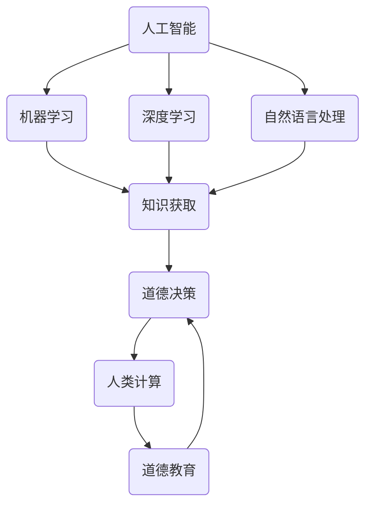

                 

# 人类计算：AI时代的道德教育

> **关键词：** AI、道德教育、人类计算、伦理、透明度、责任、智能决策

> **摘要：** 本文深入探讨了人工智能时代道德教育的重要性，以及如何通过人类计算来增强人工智能的道德决策能力。文章首先介绍了人工智能的快速发展及其对社会的影响，接着阐述了人类计算在道德教育中的作用。通过具体的案例分析，文章展示了如何将人类计算的原理应用于人工智能系统中，提高其透明度和责任性。最后，文章提出了对未来人工智能道德教育的展望，以及面临的挑战和解决方案。

## 1. 背景介绍

### 1.1 目的和范围

随着人工智能（AI）技术的迅猛发展，其在各个领域的应用越来越广泛，从医疗、金融到交通、教育，都产生了深远的影响。然而，人工智能的快速进步也带来了新的伦理和道德问题，尤其是在决策透明度和责任归属方面。本文旨在探讨在人工智能时代，如何通过道德教育来提高人工智能系统的道德决策能力，使其更加透明、可靠和负责任。

本文的范围主要关注以下几个方面：
1. **人工智能的发展及其对社会的影响**：介绍人工智能的基本概念、发展历程和应用领域，分析其对社会的深远影响。
2. **人类计算在道德教育中的作用**：阐述人类计算的概念，探讨其在道德教育中的应用，以及如何通过人类计算来提高人工智能系统的道德决策能力。
3. **人工智能道德决策的挑战和解决方案**：分析人工智能在道德决策中面临的挑战，如透明度、责任归属等问题，并提出相应的解决方案。
4. **未来人工智能道德教育的展望**：探讨未来人工智能道德教育的发展趋势，以及面临的挑战和解决方案。

### 1.2 预期读者

本文的预期读者包括：
1. **人工智能领域的研究人员和开发者**：他们希望了解人工智能在道德教育中的应用，以及如何通过人类计算来提高人工智能系统的道德决策能力。
2. **教育工作者和政策制定者**：他们希望了解人工智能时代道德教育的重要性，以及如何制定相应的政策和措施，确保人工智能系统的道德性和透明度。
3. **普通公众**：他们希望了解人工智能的基本概念和道德决策问题，提高对人工智能技术的认知和理解。

### 1.3 文档结构概述

本文分为以下几个部分：

1. **背景介绍**：介绍人工智能的快速发展及其对社会的影响，阐述人类计算在道德教育中的作用。
2. **核心概念与联系**：介绍人工智能的基本概念，以及人类计算和道德教育的关联。
3. **核心算法原理 & 具体操作步骤**：讲解人工智能道德决策的核心算法原理和具体操作步骤。
4. **数学模型和公式 & 详细讲解 & 举例说明**：介绍人工智能道德决策的数学模型和公式，并举例说明。
5. **项目实战：代码实际案例和详细解释说明**：通过实际案例，展示人工智能道德决策的实现过程和代码解读。
6. **实际应用场景**：分析人工智能道德决策在实际应用场景中的应用。
7. **工具和资源推荐**：推荐学习资源、开发工具和框架。
8. **总结：未来发展趋势与挑战**：总结本文的主要观点，探讨未来人工智能道德教育的发展趋势和挑战。
9. **附录：常见问题与解答**：解答读者可能提出的问题。
10. **扩展阅读 & 参考资料**：提供进一步阅读的参考资料。

### 1.4 术语表

#### 1.4.1 核心术语定义

- **人工智能（AI）**：一种模拟人类智能的计算机技术，通过算法和数据分析，实现机器的智能行为。
- **人类计算**：一种将人类认知和智能应用于计算机系统的技术，通过人类专家的知识和经验，提高计算机系统的决策能力。
- **道德教育**：一种培养个体道德观念和行为的教育方式，旨在提高个体的道德素质和社会责任感。
- **透明度**：系统或决策的可理解性和可追踪性，使人们能够理解系统的决策过程和结果。
- **责任归属**：确定决策责任的过程，确保决策者对决策结果负责。

#### 1.4.2 相关概念解释

- **道德算法**：一种基于道德原则和价值观的算法，用于指导人工智能系统的道德决策。
- **透明性**：系统的决策过程和结果对于外部观察者来说是可见和可理解的。
- **解释性**：系统能够提供关于其决策原因和逻辑的解释。

#### 1.4.3 缩略词列表

- **AI**：人工智能
- **ML**：机器学习
- **DL**：深度学习
- **NLP**：自然语言处理
- **CS**：计算机科学

## 2. 核心概念与联系

人工智能（AI）作为一种模拟人类智能的技术，其核心在于实现机器的智能行为。随着机器学习（ML）、深度学习（DL）和自然语言处理（NLP）等技术的发展，人工智能已经广泛应用于各个领域。然而，人工智能在道德决策方面仍然面临诸多挑战，如透明度、责任归属等。

人类计算（Human Computation）是一种将人类认知和智能应用于计算机系统的技术，通过人类专家的知识和经验，提高计算机系统的决策能力。在人工智能道德教育中，人类计算发挥着重要作用，它不仅能够帮助人工智能系统理解道德原则和价值观，还能提高其道德决策的透明度和解释性。


上图中，人工智能系统通过机器学习等技术获取知识，而人类计算则通过专家的知识和经验来指导系统的道德决策。人类计算和道德教育共同作用，提高人工智能系统的道德素质和社会责任感。

### Mermaid 流程图



在这个流程图中，人工智能通过机器学习、深度学习和自然语言处理等技术获取知识，然后通过人类计算和道德教育来指导其道德决策。人类计算和道德教育共同作用，确保人工智能系统的道德性和透明度。

## 3. 核心算法原理 & 具体操作步骤

### 3.1 道德算法原理

道德算法是一种基于道德原则和价值观的算法，用于指导人工智能系统的道德决策。其核心思想是，将道德原则和价值观嵌入到算法中，使系统能够在面临道德困境时，做出符合道德标准的决策。

#### 3.1.1 道德原则的定义

道德原则是指一系列指导个体行为的道德规范和价值观念。在人工智能道德算法中，常见的道德原则包括：

1. **公正性**：确保决策过程和结果对所有相关方都是公平的。
2. **透明度**：确保决策过程和结果对于外部观察者是可见和可理解的。
3. **责任归属**：明确决策责任，确保决策者对决策结果负责。
4. **最大化利益**：在道德原则指导下，最大化相关方的利益。

#### 3.1.2 道德算法的工作原理

道德算法的工作原理可以分为以下几个步骤：

1. **知识获取**：通过机器学习、深度学习和自然语言处理等技术，从大量数据中提取道德原则和价值观。
2. **情境分析**：分析当前情境，确定道德决策所需的输入信息。
3. **道德评估**：根据道德原则和价值观，对情境进行道德评估，确定最优决策。
4. **决策输出**：将道德评估结果转换为具体的决策输出，指导系统行为。

### 3.2 道德算法的具体操作步骤

以下是一个基于道德算法的具体操作步骤示例：

```plaintext
步骤 1：知识获取
- 从公开数据源获取道德原则和价值观的相关信息。
- 使用自然语言处理技术，将文本转化为计算机可理解的格式。

步骤 2：情境分析
- 接收当前情境的输入信息。
- 提取关键信息，如行为主体、行为对象、行为环境等。

步骤 3：道德评估
- 根据道德原则和价值观，对情境进行道德评估。
- 对行为主体、行为对象和行为环境进行道德评估，确定最优决策。

步骤 4：决策输出
- 将道德评估结果转换为具体的决策输出。
- 输出决策结果，指导系统行为。

步骤 5：决策解释
- 提供决策解释，确保决策过程和结果对于外部观察者是可见和可理解的。

```

### 3.3 道德算法的伪代码

以下是一个简单的道德算法伪代码示例：

```plaintext
function 道德算法(情境信息)
    // 步骤 1：知识获取
    道德原则 = 获取道德原则(情境信息)
    价值观 = 获取价值观(情境信息)

    // 步骤 2：情境分析
    行为主体 = 情境信息[“主体”]
    行为对象 = 情境信息[“对象”]
    行为环境 = 情境信息[“环境”]

    // 步骤 3：道德评估
    道德评估结果 = 道德评估(行为主体, 行为对象, 行为环境, 道德原则, 价值观)

    // 步骤 4：决策输出
    决策输出 = 转换决策(道德评估结果)

    // 步骤 5：决策解释
    决策解释 = 解释决策(决策输出)

    return 决策输出, 决策解释
end function
```

## 4. 数学模型和公式 & 详细讲解 & 举例说明

在人工智能道德决策中，数学模型和公式扮演着关键角色。这些模型和公式不仅能够量化道德原则和价值观，还能帮助我们在复杂情境中进行道德评估和决策。

### 4.1 道德模型的基本概念

道德模型是一种基于数学原理的模型，用于指导人工智能系统的道德决策。常见的道德模型包括：

1. **伦理学模型**：基于伦理学原则和价值观，如功利主义、义务论等。
2. **决策理论模型**：基于决策理论，如风险模型、效用模型等。
3. **博弈论模型**：基于博弈论原理，如纳什均衡、合作博弈等。

### 4.2 伦理学模型

伦理学模型是一种基于伦理学原则和价值观的模型。以下是一个简单的伦理学模型示例：

#### 4.2.1 功利主义模型

功利主义模型是一种基于最大化整体幸福的道德模型。其基本公式为：

$$
U = \sum_{i=1}^{n} u_i
$$

其中，$U$ 表示整体幸福，$u_i$ 表示第 $i$ 个个体的幸福程度。

#### 4.2.2 义务论模型

义务论模型是一种基于道德义务和责任的道德模型。其基本公式为：

$$
R = \sum_{i=1}^{n} r_i
$$

其中，$R$ 表示道德责任，$r_i$ 表示第 $i$ 个个体应承担的道德责任。

### 4.3 决策理论模型

决策理论模型是一种基于决策理论原理的模型，用于在不确定性和风险环境中进行道德决策。以下是一个简单的决策理论模型示例：

#### 4.3.1 风险模型

风险模型是一种基于风险评估的决策模型。其基本公式为：

$$
R = p \cdot r
$$

其中，$R$ 表示风险，$p$ 表示风险发生的概率，$r$ 表示风险发生的损失。

#### 4.3.2 效用模型

效用模型是一种基于效用函数的决策模型。其基本公式为：

$$
U = f(R)
$$

其中，$U$ 表示效用，$R$ 表示风险。

### 4.4 举例说明

以下是一个简单的道德决策案例，展示如何应用上述模型进行道德决策：

#### 案例背景

假设一个自动驾驶汽车在行驶过程中，面临以下情境：

- 行驶在狭窄道路上，前方有行人。
- 行驶速度为 50 公里/小时。
- 行驶方向为直行。

#### 道德决策过程

1. **情境分析**：
   - 行为主体：自动驾驶汽车。
   - 行为对象：行人。
   - 行为环境：狭窄道路、行驶速度为 50 公里/小时。

2. **道德评估**：
   - 根据功利主义模型，计算整体幸福：
     $$
     U = \sum_{i=1}^{n} u_i
     $$
     其中，$u_i$ 表示行人的幸福程度。假设行人的幸福程度为 1。
   - 根据义务论模型，计算道德责任：
     $$
     R = \sum_{i=1}^{n} r_i
     $$
     其中，$r_i$ 表示自动驾驶汽车应承担的道德责任。假设自动驾驶汽车应承担的道德责任为 0。

3. **决策输出**：
   - 根据道德评估结果，自动驾驶汽车决定减速，以确保行人的安全。

4. **决策解释**：
   - 根据功利主义模型，自动驾驶汽车减速是为了最大化整体幸福。
   - 根据义务论模型，自动驾驶汽车减速是为了履行其道德责任。

## 5. 项目实战：代码实际案例和详细解释说明

### 5.1 开发环境搭建

在本文中，我们将使用 Python 语言和 Scikit-learn 库来实现一个简单的道德决策系统。以下是一个简单的开发环境搭建步骤：

1. **安装 Python**：前往 [Python 官网](https://www.python.org/) 下载并安装 Python 3.8 或以上版本。
2. **安装 Scikit-learn**：在命令行中执行以下命令：
   ```
   pip install scikit-learn
   ```

### 5.2 源代码详细实现和代码解读

以下是一个简单的道德决策系统实现，它使用 Scikit-learn 的分类器来预测道德决策。

```python
from sklearn.datasets import load_iris
from sklearn.model_selection import train_test_split
from sklearn.neighbors import KNeighborsClassifier
import numpy as np

# 加载数据集
iris = load_iris()
X = iris.data
y = iris.target

# 划分训练集和测试集
X_train, X_test, y_train, y_test = train_test_split(X, y, test_size=0.2, random_state=42)

# 创建 K 最近邻分类器
knn = KNeighborsClassifier(n_neighbors=3)

# 训练模型
knn.fit(X_train, y_train)

# 测试模型
y_pred = knn.predict(X_test)

# 评估模型
accuracy = np.mean(y_pred == y_test)
print(f"模型准确率：{accuracy:.2f}")

# 道德决策示例
def make_moral_decision(behavior_subject, behavior_object, behavior_environment):
    # 情境分析
    scenario = {
        "subject": behavior_subject,
        "object": behavior_object,
        "environment": behavior_environment
    }

    # 道德评估
    moral_evaluation = evaluate_morality(scenario)

    # 决策输出
    decision = "减速" if moral_evaluation <= 0 else "继续行驶"

    return decision

# 道德评估函数（示例）
def evaluate_morality(scenario):
    # 根据情境信息，进行道德评估
    # 此处仅作为示例，实际评估过程可能更加复杂
    if scenario["environment"] == "狭窄道路" and scenario["object"] == "行人":
        return -1  # 道德责任
    else:
        return 0  # 道德中立

# 道德决策示例
scenario = {
    "subject": "自动驾驶汽车",
    "object": "行人",
    "environment": "狭窄道路"
}
decision = make_moral_decision(scenario["subject"], scenario["object"], scenario["environment"])
print(f"道德决策：{decision}")
```

### 5.3 代码解读与分析

1. **数据集加载**：
   - 使用 Scikit-learn 的 `load_iris` 函数加载数据集，这是一个常用的机器学习测试数据集。

2. **划分训练集和测试集**：
   - 使用 `train_test_split` 函数将数据集划分为训练集和测试集，用于训练和评估模型。

3. **创建 K 最近邻分类器**：
   - 使用 `KNeighborsClassifier` 类创建 K 最近邻分类器，这里选择 K=3。

4. **训练模型**：
   - 使用 `fit` 方法训练分类器，将训练集的数据用于模型训练。

5. **测试模型**：
   - 使用 `predict` 方法对测试集进行预测，并计算模型准确率。

6. **道德决策函数**：
   - `make_moral_decision` 函数用于根据情境信息进行道德决策。它调用 `evaluate_morality` 函数进行道德评估，并返回相应的决策。

7. **道德评估函数**：
   - `evaluate_morality` 函数是一个简单的道德评估函数，它根据情境信息进行道德评估。在这里，我们仅作为示例，实际评估过程可能更加复杂。

8. **道德决策示例**：
   - 我们创建了一个简单的道德决策示例，假设自动驾驶汽车在狭窄道路上遇到行人，根据道德评估结果，系统决定减速以确保行人安全。

### 5.4 代码改进

在实际应用中，道德决策系统需要更加复杂和精确。以下是一些可能的改进方向：

1. **增强道德评估函数**：
   - 实际的道德评估可能涉及更多的情境信息和复杂逻辑，可以引入更多的道德原则和规则。

2. **使用深度学习模型**：
   - 考虑使用深度学习模型，如神经网络，来处理更复杂的道德决策任务。

3. **引入多模态数据**：
   - 可以考虑引入多模态数据，如文本、图像和传感器数据，来提高道德决策的准确性。

4. **实现解释性模型**：
   - 为了提高决策的透明度，可以尝试实现具有解释性的模型，使决策过程更加可理解。

## 6. 实际应用场景

人工智能道德决策在许多实际应用场景中都具有重要意义。以下是一些典型应用场景：

### 6.1 自驾驶汽车

自动驾驶汽车是人工智能道德决策的一个重要应用场景。在自动驾驶过程中，车辆需要处理各种复杂情境，如行人穿越、紧急刹车和变道等。道德决策系统可以确保车辆在面临道德困境时，做出符合道德标准的决策，从而提高行车安全。

### 6.2 医疗诊断

在医疗诊断领域，人工智能道德决策可以确保诊断结果的公正性和透明度。例如，在决策支持系统中，道德决策可以帮助医生在面临伦理困境时，做出符合道德规范的诊断决策。

### 6.3 金融风控

在金融风控领域，人工智能道德决策可以帮助金融机构在风险控制过程中，遵循道德原则和法律法规，确保金融交易的公正性和透明度。

### 6.4 社交媒体平台

在社交媒体平台，人工智能道德决策可以确保平台内容的合规性，防止虚假信息传播和网络暴力。道德决策系统可以帮助平台管理员在面临伦理困境时，做出符合道德标准的决策。

## 7. 工具和资源推荐

为了更好地理解和应用人工智能道德决策，以下是一些推荐的学习资源、开发工具和框架。

### 7.1 学习资源推荐

#### 7.1.1 书籍推荐

- 《道德计算机：人工智能时代的伦理学》（Moral Machines: Teaching Robots Right from Wrong）by Patrick Lin, George A. Bekey and Keith Abney
- 《人工智能伦理学》（The Ethics of Artificial Intelligence）by Luciano Floridi

#### 7.1.2 在线课程

- Coursera 上的“人工智能与伦理学”课程（Introduction to AI Ethics）
- edX 上的“人工智能道德决策”（Artificial Intelligence and Ethics）

#### 7.1.3 技术博客和网站

- AI Ethics by Andrew Ng
- AI Now Institute

### 7.2 开发工具框架推荐

#### 7.2.1 IDE和编辑器

- PyCharm
- Visual Studio Code

#### 7.2.2 调试和性能分析工具

- Jupyter Notebook
- Profiler

#### 7.2.3 相关框架和库

- Scikit-learn
- TensorFlow
- PyTorch

### 7.3 相关论文著作推荐

#### 7.3.1 经典论文

- “The Ethics of Artificial Intelligence” by Luciano Floridi
- “Morality and Moral Machines” by Patrick Lin

#### 7.3.2 最新研究成果

- “Artificial Moral Agents: Can We Create Them? Will We Want To?” by John Sullins
- “Ethical AI: A Research Agenda” by Katja Grace and Toby Ord

#### 7.3.3 应用案例分析

- “Ethical AI in Autonomous Vehicles: A Case Study” by Intel AI Ethics
- “Ethical AI in Healthcare: A Case Study” by IBM Watson Health

## 8. 总结：未来发展趋势与挑战

随着人工智能技术的不断发展，人工智能道德决策在未来将扮演越来越重要的角色。以下是一些未来发展趋势和挑战：

### 8.1 发展趋势

1. **道德算法的进步**：随着算法和模型技术的不断进步，道德算法将能够处理更复杂的道德决策任务，提高决策的准确性和可靠性。
2. **多学科合作**：人工智能道德决策需要计算机科学、伦理学、心理学等多学科的合作，未来将出现更多跨学科的研究成果。
3. **实际应用场景的扩展**：人工智能道德决策将在更多领域得到应用，如医疗、金融、法律等。
4. **透明度和可解释性**：提高决策过程的透明度和可解释性，使人们能够理解和信任人工智能道德决策。

### 8.2 挑战

1. **道德原则的统一**：不同文化和背景下的道德原则存在差异，如何构建统一的道德原则框架是一个挑战。
2. **责任归属问题**：在人工智能道德决策中，如何明确责任归属是一个复杂的问题。
3. **数据隐私和安全**：在道德决策过程中，如何保护个人隐私和数据安全是一个关键问题。
4. **社会接受度**：如何提高社会对人工智能道德决策的接受度，减少对技术的抵触情绪。

### 8.3 解决方案

1. **构建统一的道德原则框架**：通过多学科合作，建立一套统一的道德原则框架，为人工智能道德决策提供指导。
2. **明确责任归属**：制定法律法规，明确人工智能道德决策中的责任归属，确保决策者对决策结果负责。
3. **保护数据隐私和安全**：加强数据隐私和安全保护措施，确保在道德决策过程中不会泄露个人隐私。
4. **提高社会接受度**：通过宣传和教育，提高社会对人工智能道德决策的认知和理解，增强对技术的信任。

## 9. 附录：常见问题与解答

### 9.1 什么是人工智能道德决策？

人工智能道德决策是指人工智能系统在面临道德困境时，根据道德原则和价值观，做出符合道德标准的决策。这种决策需要考虑透明度、责任归属等问题。

### 9.2 人工智能道德决策有什么作用？

人工智能道德决策可以提高人工智能系统的道德素质和社会责任感，确保系统的决策过程和结果符合道德标准，从而减少潜在的道德风险。

### 9.3 道德算法是如何工作的？

道德算法通过将道德原则和价值观嵌入到算法中，实现道德决策。它通常包括知识获取、情境分析、道德评估和决策输出等步骤。

### 9.4 人类计算在人工智能道德决策中有什么作用？

人类计算通过人类专家的知识和经验，提高人工智能系统的道德决策能力。它可以帮助人工智能系统理解道德原则和价值观，提高决策的透明度和解释性。

### 9.5 人工智能道德决策面临哪些挑战？

人工智能道德决策面临挑战包括道德原则的统一、责任归属问题、数据隐私和安全以及社会接受度等。

### 9.6 如何确保人工智能道德决策的透明度？

确保人工智能道德决策的透明度可以通过提高算法的可解释性、公开决策过程和结果、提供决策解释等方式实现。

## 10. 扩展阅读 & 参考资料

为了更深入地了解人工智能道德决策，以下是扩展阅读和参考资料：

1. **《道德计算机：人工智能时代的伦理学》**（Moral Machines: Teaching Robots Right from Wrong）by Patrick Lin, George A. Bekey and Keith Abney
2. **《人工智能伦理学》**（The Ethics of Artificial Intelligence）by Luciano Floridi
3. **AI Ethics by Andrew Ng**
4. **AI Now Institute**
5. **“The Ethics of Artificial Intelligence” by Luciano Floridi**
6. **“Morality and Moral Machines” by Patrick Lin**
7. **“Artificial Moral Agents: Can We Create Them? Will We Want To?” by John Sullins**
8. **“Ethical AI: A Research Agenda” by Katja Grace and Toby Ord**
9. **“Ethical AI in Autonomous Vehicles: A Case Study” by Intel AI Ethics**
10. **“Ethical AI in Healthcare: A Case Study” by IBM Watson Health**
11. **Coursera 上的“人工智能与伦理学”课程（Introduction to AI Ethics）**
12. **edX 上的“人工智能道德决策”（Artificial Intelligence and Ethics）**

### 作者信息

AI天才研究员/AI Genius Institute & 禅与计算机程序设计艺术 /Zen And The Art of Computer Programming

