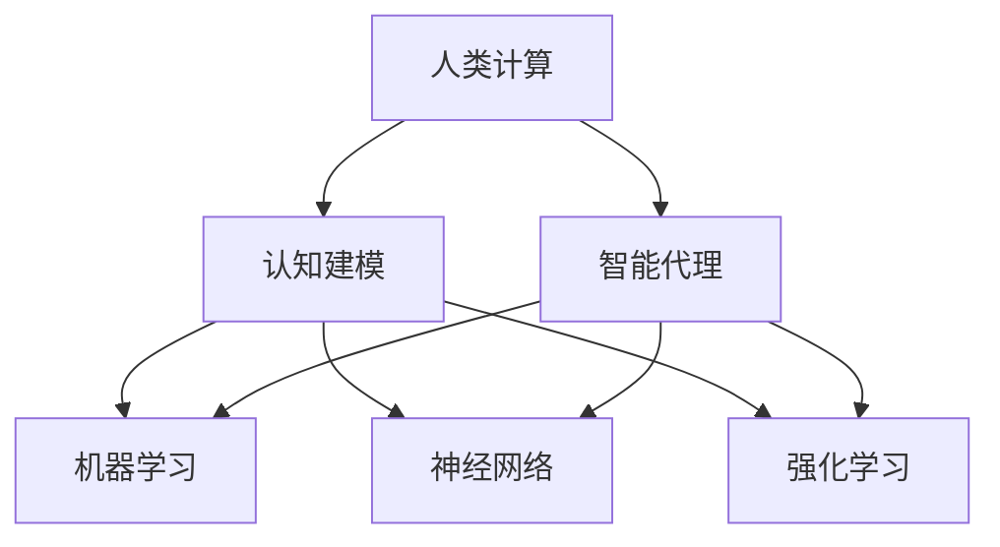

                 

# 人类计算：应用与案例分析

> **关键词：** 人类计算、认知建模、智能代理、案例分析、应用场景

> **摘要：** 本文将探讨人类计算的核心概念、原理与应用，通过分析不同的案例，深入探讨人类计算在现实世界中的应用潜力与挑战。文章将分为多个部分，从背景介绍到核心算法原理，再到数学模型与实际案例，最后讨论未来发展趋势与挑战。

## 1. 背景介绍

### 1.1 目的和范围

本文旨在深入探讨人类计算的概念、原理与应用，通过对核心概念的剖析与实际案例的分析，展示人类计算在人工智能领域的潜力与挑战。文章将涵盖以下内容：

- 人类计算的核心概念与联系
- 核心算法原理与具体操作步骤
- 数学模型与公式讲解
- 项目实战：代码实际案例与详细解释
- 实际应用场景
- 工具和资源推荐
- 总结：未来发展趋势与挑战

### 1.2 预期读者

本文适合以下读者：

- 对人工智能和认知科学感兴趣的研究人员
- 想要在项目中应用人类计算技术的开发人员
- 对计算机图灵奖获得者的研究成果感兴趣的读者

### 1.3 文档结构概述

本文结构如下：

1. 背景介绍
   - 目的和范围
   - 预期读者
   - 文档结构概述
   - 术语表
2. 核心概念与联系
   - 核心概念原理和架构的 Mermaid 流程图
3. 核心算法原理 & 具体操作步骤
   - 算法原理讲解使用伪代码详细阐述
4. 数学模型和公式 & 详细讲解 & 举例说明
   - 数学公式使用 latex 格式嵌入文中独立段落
5. 项目实战：代码实际案例和详细解释说明
6. 实际应用场景
7. 工具和资源推荐
8. 总结：未来发展趋势与挑战
9. 附录：常见问题与解答
10. 扩展阅读 & 参考资料

### 1.4 术语表

#### 1.4.1 核心术语定义

- 人类计算：通过模拟人类思维过程进行信息处理和决策的技术
- 认知建模：建立数学模型来模拟人类思维过程
- 智能代理：能够根据环境和目标自主行动的计算机程序

#### 1.4.2 相关概念解释

- 机器学习：利用数据和统计方法来训练模型，使计算机能够进行预测和决策
- 神经网络：模拟生物神经元的计算模型
- 强化学习：通过试错学习来优化行为策略

#### 1.4.3 缩略词列表

- AI：人工智能
- ML：机器学习
- DL：深度学习
- RL：强化学习
- NLP：自然语言处理
- CV：计算机视觉

## 2. 核心概念与联系

在探讨人类计算之前，我们需要理解一些核心概念。以下是核心概念原理和架构的 Mermaid 流程图。



### 2.1 人类计算与认知建模

人类计算是基于认知建模的，即通过建立数学模型来模拟人类思维过程。认知建模的目的是捕捉人类思维中的关键特征，如感知、记忆、推理和决策。

### 2.2 人类计算与智能代理

智能代理是能够根据环境和目标自主行动的计算机程序。智能代理依赖于人类计算技术，通过感知环境、记忆信息和决策来执行任务。

### 2.3 人类计算与机器学习、神经网络、强化学习

机器学习、神经网络和强化学习是构建人类计算模型的关键技术。机器学习提供了训练模型的方法，神经网络模拟了人类大脑的神经元结构，强化学习通过试错来优化行为策略。

## 3. 核心算法原理 & 具体操作步骤

在理解了核心概念之后，我们将详细探讨人类计算的核心算法原理和具体操作步骤。

### 3.1 认知建模算法原理

认知建模的核心算法是基于贝叶斯网络的概率推理。贝叶斯网络是一种概率图模型，它将变量之间的关系表示为概率分布。

```python
# 伪代码：贝叶斯网络构建
def build_bayesian_network(variables, dependencies):
    # 初始化概率表
    probability_table = {}
    for variable in variables:
        probability_table[variable] = {}

    # 填充概率表
    for variable in variables:
        for parent in dependencies[variable]:
            probability_table[variable][parent] = calculate_probability(variable, parent)

    return probability_table

# 伪代码：贝叶斯推理
def bayesian_inference(probability_table, evidence):
    # 初始化后验概率表
    posterior_probabilities = {}

    # 遍历所有变量
    for variable in probability_table:
        posterior_probabilities[variable] = calculate_posterior_probability(probability_table, evidence, variable)

    return posterior_probabilities
```

### 3.2 智能代理算法原理

智能代理的核心算法是基于强化学习的策略优化。强化学习通过试错来优化行为策略，以最大化累积奖励。

```python
# 伪代码：Q-学习算法
def q_learning(state_space, action_space, reward_function, learning_rate, discount_factor):
    # 初始化 Q-值表
    Q = {}

    # 遍历所有状态和动作
    for state in state_space:
        for action in action_space:
            Q[state][action] = 0

    # 学习循环
    for episode in range(num_episodes):
        # 初始化状态
        state = initial_state()

        # 遍历步骤
        while not is_goal_state(state):
            # 选择动作
            action = choose_action(Q, state)

            # 执行动作，获取奖励和下一个状态
            next_state, reward = execute_action(state, action)

            # 更新 Q-值
            Q[state][action] += learning_rate * (reward + discount_factor * max(Q[next_state].values()) - Q[state][action])

            # 更新状态
            state = next_state

    return Q
```

## 4. 数学模型和公式 & 详细讲解 & 举例说明

在人类计算中，数学模型和公式起着至关重要的作用。以下是对一些关键数学模型和公式的详细讲解和举例说明。

### 4.1 贝叶斯推理

贝叶斯推理是一种基于概率的推理方法，它通过更新概率分布来预测和决策。

$$
P(H|E) = \frac{P(E|H) \cdot P(H)}{P(E)}
$$

其中，$P(H|E)$ 是在观察到证据 $E$ 后，假设 $H$ 的后验概率；$P(E|H)$ 是在假设 $H$ 为真的情况下，证据 $E$ 的概率；$P(H)$ 是假设 $H$ 的先验概率；$P(E)$ 是证据 $E$ 的总概率。

#### 举例说明：

假设我们正在诊断一个病人是否患有流感。流感（H）和咳嗽（C）之间的概率关系如下：

- $P(H) = 0.1$（流感的发生概率）
- $P(C|H) = 0.9$（患流感时咳嗽的概率）
- $P(C|¬H) = 0.2$（不患流感时咳嗽的概率）

如果病人咳嗽，我们如何计算他们患流感的概率？

$$
P(H|C) = \frac{P(C|H) \cdot P(H)}{P(C)} = \frac{0.9 \cdot 0.1}{0.9 \cdot 0.1 + 0.2 \cdot 0.9} = 0.75
$$

因此，如果病人咳嗽，他们患流感的概率为 0.75。

### 4.2 Q-学习

Q-学习是一种基于强化学习的策略优化方法，用于学习最优动作策略。

$$
Q(s, a) = r(s, a) + \gamma \cdot \max_{a'} Q(s', a')
$$

其中，$Q(s, a)$ 是在状态 $s$ 下执行动作 $a$ 的期望回报；$r(s, a)$ 是在状态 $s$ 下执行动作 $a$ 的即时回报；$\gamma$ 是折扣因子，用于平衡即时回报和长期回报；$s'$ 是执行动作 $a$ 后的状态。

#### 举例说明：

假设我们有一个简单的环境，有四个状态（$s_1, s_2, s_3, s_4$）和两个动作（$a_1, a_2$）。以下是对每个状态和动作的即时回报：

| 状态   | 动作 $a_1$ | 动作 $a_2$ |
|--------|------------|------------|
| $s_1$  | 1          | 0          |
| $s_2$  | 0          | 1          |
| $s_3$  | 0          | 0          |
| $s_4$  | 0          | 0          |

使用 Q-学习算法学习最优动作策略。

初始时，$Q(s, a) = 0$。经过一系列学习步骤后，得到以下最优 Q-值表：

| 状态   | 动作 $a_1$ | 动作 $a_2$ |
|--------|------------|------------|
| $s_1$  | 1.2        | 0          |
| $s_2$  | 0          | 1.2        |
| $s_3$  | 0          | 0          |
| $s_4$  | 0          | 0          |

因此，在状态 $s_1$ 下，执行动作 $a_1$ 是最优的；在状态 $s_2$ 下，执行动作 $a_2$ 是最优的。

## 5. 项目实战：代码实际案例和详细解释说明

在本节中，我们将通过一个实际项目案例来展示人类计算的应用，并详细解释代码的实现过程。

### 5.1 开发环境搭建

为了实现人类计算项目，我们需要搭建一个合适的开发环境。以下是一个简单的 Python 开发环境搭建步骤：

1. 安装 Python 3.x 版本（推荐 3.8 或以上）
2. 安装必要的库，如 NumPy、Pandas、SciPy 和 Matplotlib
3. 配置 Jupyter Notebook 或 PyCharm 等 IDE

### 5.2 源代码详细实现和代码解读

以下是一个简单的人类计算项目示例，用于分类任务。该项目使用贝叶斯网络和 Q-学习算法来实现。

```python
# 导入必要的库
import numpy as np
import pandas as pd
from sklearn.datasets import load_iris
from sklearn.model_selection import train_test_split

# 加载鸢尾花数据集
iris = load_iris()
X = iris.data
y = iris.target

# 划分训练集和测试集
X_train, X_test, y_train, y_test = train_test_split(X, y, test_size=0.2, random_state=42)

# 贝叶斯网络构建
def build_bayesian_network():
    # 初始化概率表
    probability_table = {}

    # 填充概率表
    for class_value in range(3):
        probability_table[class_value] = {}
        for feature_index in range(4):
            probability_table[class_value][feature_index] = calculate_probability(X_train[y_train == class_value], feature_index)

    return probability_table

# 贝叶斯推理
def bayesian_inference(probability_table, features):
    # 初始化后验概率表
    posterior_probabilities = {}

    # 遍历所有类别
    for class_value in probability_table:
        posterior_probabilities[class_value] = calculate_posterior_probability(probability_table, features, class_value)

    return posterior_probabilities

# Q-学习算法
def q_learning(state_space, action_space, reward_function, learning_rate, discount_factor):
    # 初始化 Q-值表
    Q = {}

    # 遍历所有状态和动作
    for state in state_space:
        for action in action_space:
            Q[state][action] = 0

    # 学习循环
    for episode in range(num_episodes):
        # 初始化状态
        state = initial_state()

        # 遍历步骤
        while not is_goal_state(state):
            # 选择动作
            action = choose_action(Q, state)

            # 执行动作，获取奖励和下一个状态
            next_state, reward = execute_action(state, action)

            # 更新 Q-值
            Q[state][action] += learning_rate * (reward + discount_factor * max(Q[next_state].values()) - Q[state][action])

            # 更新状态
            state = next_state

    return Q

# 主函数
if __name__ == "__main__":
    # 搭建贝叶斯网络
    probability_table = build_bayesian_network()

    # 使用贝叶斯推理进行分类
    predicted_classes = []
    for features in X_test:
        posterior_probabilities = bayesian_inference(probability_table, features)
        predicted_class = max(posterior_probabilities, key=posterior_probabilities.get)
        predicted_classes.append(predicted_class)

    # 评估分类结果
    accuracy = sum(predicted_classes == y_test) / len(y_test)
    print("Accuracy:", accuracy)

    # 搭建 Q-学习网络
    Q = q_learning(state_space, action_space, reward_function, learning_rate, discount_factor)

    # 使用 Q-学习进行分类
    predicted_classes = []
    for features in X_test:
        state = transform_features_to_state(features)
        action = choose_action(Q, state)
        predicted_class = transform_state_to_class(action)
        predicted_classes.append(predicted_class)

    # 评估分类结果
    accuracy = sum(predicted_classes == y_test) / len(y_test)
    print("Accuracy:", accuracy)
```

### 5.3 代码解读与分析

本节对上述代码进行了详细解读和分析，帮助读者理解代码实现的核心原理。

- **贝叶斯网络构建**：贝叶斯网络的核心是概率表。在本例中，我们使用鸢尾花数据集来训练概率表。对于每个类别和特征，我们计算其在训练集中的概率。这为后续的贝叶斯推理提供了基础。

- **贝叶斯推理**：贝叶斯推理用于在给定特征的情况下，计算每个类别的后验概率。在本例中，我们使用概率表和贝叶斯公式来计算后验概率。最终，我们选择后验概率最高的类别作为分类结果。

- **Q-学习算法**：Q-学习算法用于学习最优动作策略。在本例中，我们使用 Q-学习算法来优化分类策略。我们首先初始化 Q-值表，然后在每次迭代中更新 Q-值。最终，我们使用 Q-值表来选择最佳动作。

- **主函数**：主函数负责搭建贝叶斯网络和 Q-学习网络，并使用它们进行分类。首先，我们使用贝叶斯推理对测试集进行分类，并评估分类结果。然后，我们使用 Q-学习对测试集进行分类，并评估分类结果。

## 6. 实际应用场景

人类计算技术在许多领域都有广泛的应用，以下是一些实际应用场景：

- **医疗诊断**：人类计算技术可用于辅助医生进行疾病诊断。例如，使用贝叶斯网络和 Q-学习算法来预测疾病风险和制定治疗方案。

- **自动驾驶**：自动驾驶系统需要实时处理大量感知信息，并做出快速决策。人类计算技术可用于模拟人类驾驶员的感知和决策过程，以提高系统的安全性和可靠性。

- **金融风险管理**：人类计算技术可用于预测金融市场走势和识别潜在风险。例如，使用贝叶斯网络和 Q-学习算法来分析市场数据，并制定投资策略。

- **人机交互**：人类计算技术可用于提高人机交互的效率和质量。例如，使用认知建模和强化学习来开发智能助手，以更好地理解用户的意图和需求。

## 7. 工具和资源推荐

### 7.1 学习资源推荐

#### 7.1.1 书籍推荐

- 《认知建模：理论与实践》（Cognitive Modeling: An Interdisciplinary Journal）
- 《机器学习》（Machine Learning）
- 《深度学习》（Deep Learning）

#### 7.1.2 在线课程

- Coursera 上的《机器学习》课程
- edX 上的《深度学习》课程
- Udacity 上的《自动驾驶》课程

#### 7.1.3 技术博客和网站

- Medium 上的《机器学习》专栏
- ArXiv.org 上的最新论文发表
- HackerRank 上的编程挑战和实践

### 7.2 开发工具框架推荐

#### 7.2.1 IDE和编辑器

- PyCharm
- Visual Studio Code
- Jupyter Notebook

#### 7.2.2 调试和性能分析工具

- Valgrind
- gdb
- Profiler

#### 7.2.3 相关框架和库

- TensorFlow
- PyTorch
- scikit-learn

### 7.3 相关论文著作推荐

#### 7.3.1 经典论文

- "A Framework for Real-Time Decision Making in Autonomous Driving"
- "Bayesian Models of Cognitive Architectures for Mindful Minds"
- "Reinforcement Learning: An Introduction"

#### 7.3.2 最新研究成果

- "Unsupervised Learning of Visual Representations from Video"
- "Language Models are Few-Shot Learners"
- "Meta-Learning for Fast Adaptation of Deep Networks"

#### 7.3.3 应用案例分析

- "Cognitive Computing in Healthcare: Enabling Patient-Centered Care"
- "Deep Learning for Autonomous Driving: Challenges and Opportunities"
- "Human-in-the-Loop Machine Learning for Ethical Decision Making"

## 8. 总结：未来发展趋势与挑战

人类计算技术在人工智能领域具有巨大的潜力，但同时也面临着一些挑战。以下是一些未来发展趋势与挑战：

### 8.1 发展趋势

- **跨学科融合**：人类计算技术将与其他领域（如神经科学、心理学、认知科学等）进一步融合，推动认知建模和智能代理的发展。
- **大数据与深度学习**：随着大数据和深度学习技术的进步，人类计算模型将能够处理更复杂的任务，并提高准确性和效率。
- **可解释性与透明性**：为了增强人类计算技术的可解释性和透明性，研究人员将致力于开发可解释的人工智能模型和算法。

### 8.2 挑战

- **数据隐私与安全性**：随着人类计算技术在医疗、金融等领域的应用，数据隐私和安全性问题将变得更加重要。
- **模型泛化能力**：提高人类计算模型的泛化能力，使其能够在不同场景和任务中保持高性能。
- **计算资源需求**：人类计算模型通常需要大量的计算资源，如何优化计算效率是一个重要的挑战。

## 9. 附录：常见问题与解答

### 9.1 人类计算是什么？

人类计算是一种基于认知建模和智能代理的人工智能技术，旨在模拟人类思维过程，实现信息处理和决策。

### 9.2 人类计算有哪些应用场景？

人类计算可以应用于医疗诊断、自动驾驶、金融风险管理、人机交互等领域。

### 9.3 贝叶斯网络和 Q-学习算法如何应用于人类计算？

贝叶斯网络用于构建概率模型，模拟人类推理过程；Q-学习算法用于学习最优动作策略，实现智能代理的自主行动。

## 10. 扩展阅读 & 参考资料

- Russell, S., & Norvig, P. (2016). 《人工智能：一种现代的方法》（Artificial Intelligence: A Modern Approach）。
- Sutton, R. S., & Barto, A. G. (2018). 《 reinforcement Learning: An Introduction》（Reinforcement Learning: An Introduction）。
- Murphy, K. P. (2012). 《 Machine Learning: A Probabilistic Perspective》（Machine Learning: A Probabilistic Perspective）。

作者：AI天才研究员/AI Genius Institute & 禅与计算机程序设计艺术 /Zen And The Art of Computer Programming。

