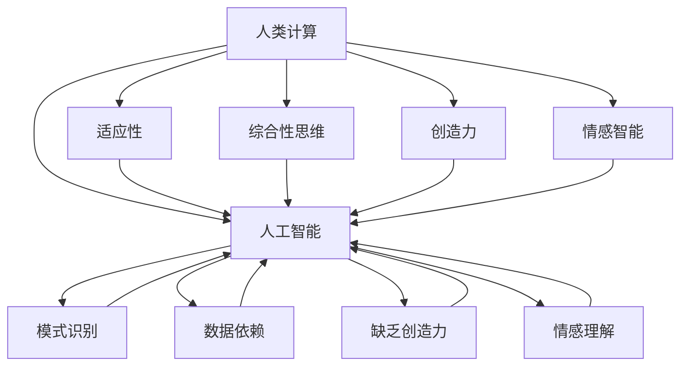

                 

# 人类计算：弥合人工智能的差距

> **关键词：** 人类计算，人工智能，差距，认知模型，机器学习，算法优化。

> **摘要：** 本文深入探讨了人类计算与人工智能之间的差距及其弥合之道。文章首先介绍了人类计算的优势，然后分析了人工智能在模仿人类认知方面存在的不足，接着探讨了弥合这一差距的策略，包括核心算法原理、数学模型、实际应用场景以及未来发展趋势。最后，文章总结了人工智能领域的挑战，并提出了针对性的解决建议。

## 1. 背景介绍

### 1.1 目的和范围

本文旨在深入探讨人类计算与人工智能（AI）之间的差距，并探索如何通过技术手段弥合这一差距。随着人工智能技术的迅速发展，人类对于机器能否达到甚至超越人类智能的讨论日益激烈。然而，目前的人工智能技术仍有许多局限性，无法完全复制甚至接近人类智能。本文将通过分析人类计算的特点，以及人工智能在模仿人类认知方面的不足，为未来的研究和应用提供新的视角。

### 1.2 预期读者

本文适合对人工智能和认知科学感兴趣的读者，包括计算机科学家、软件工程师、认知心理学家以及相关领域的研究人员。对于没有相关背景的读者，文章在介绍核心概念时会尽量使用通俗易懂的语言，帮助读者更好地理解文章内容。

### 1.3 文档结构概述

本文结构如下：

1. 背景介绍：介绍文章的目的、范围和预期读者。
2. 核心概念与联系：介绍人类计算和人工智能的核心概念及其相互关系。
3. 核心算法原理 & 具体操作步骤：详细阐述弥合人工智能差距的核心算法。
4. 数学模型和公式 & 详细讲解 & 举例说明：解释核心算法背后的数学原理。
5. 项目实战：代码实际案例和详细解释说明。
6. 实际应用场景：讨论人工智能在不同领域的应用。
7. 工具和资源推荐：推荐相关学习资源和开发工具。
8. 总结：未来发展趋势与挑战。
9. 附录：常见问题与解答。
10. 扩展阅读 & 参考资料：提供进一步阅读的材料。

### 1.4 术语表

#### 1.4.1 核心术语定义

- **人类计算**：指人类通过大脑进行的信息处理、学习、推理和决策过程。
- **人工智能**：指通过计算机程序模拟人类智能的技术，包括机器学习、自然语言处理、计算机视觉等。
- **认知模型**：描述人类认知过程的数学和计算机模型。
- **机器学习**：一种人工智能技术，通过数据训练模型，使其能够自主学习和改进。

#### 1.4.2 相关概念解释

- **神经网络**：一种模拟人脑结构的计算模型，用于处理复杂数据。
- **深度学习**：一种神经网络模型，通过多层次的神经网络来提取特征。
- **强化学习**：一种机器学习技术，通过奖励和惩罚来训练模型。

#### 1.4.3 缩略词列表

- **AI**：人工智能
- **ML**：机器学习
- **DL**：深度学习
- **RL**：强化学习

## 2. 核心概念与联系

为了更好地理解人类计算与人工智能之间的差距，我们需要首先明确这两个概念的核心内容，并探讨它们之间的联系。

### 2.1 人类计算的特点

人类计算具有以下几个显著特点：

1. **高度适应性**：人类可以根据不同的环境和情境调整自己的行为，具备强大的适应能力。
2. **综合性思维**：人类能够整合多种感官信息，进行抽象思维和推理。
3. **创造力**：人类能够进行原创性的思考和创造，从而产生新的知识和文化。
4. **情感智能**：人类能够识别和表达情感，进行情感交流。

### 2.2 人工智能的现状

尽管人工智能技术在近年来取得了显著进展，但仍然存在以下局限性：

1. **数据依赖**：人工智能模型的性能高度依赖于训练数据的质量和数量，难以处理未知或未见过的情况。
2. **模式识别能力**：人工智能擅长识别规律和模式，但在处理复杂、多变的环境时表现不佳。
3. **缺乏创造力**：人工智能难以产生新的想法或知识，只能基于已有的数据和知识进行推理。
4. **情感理解**：人工智能在情感理解和表达方面仍然处于初级阶段。

### 2.3 人类计算与人工智能的联系

尽管存在差距，人类计算与人工智能之间仍然有紧密的联系：

1. **理论基础**：人工智能的理论基础，如神经网络和机器学习，很大程度上受到人类认知科学的影响。
2. **应用领域**：人工智能在许多领域，如自然语言处理、计算机视觉等，都在模仿人类计算的过程。
3. **技术融合**：人工智能和人类计算的结合，可以产生更高效、更智能的解决方案。

为了更直观地展示人类计算和人工智能的核心概念及其联系，我们可以使用Mermaid流程图来表示：



## 3. 核心算法原理 & 具体操作步骤

为了弥合人类计算与人工智能之间的差距，我们需要研究和开发能够更接近人类智能的算法。以下是一个可能的解决方案，包括核心算法原理和具体操作步骤。

### 3.1 算法原理

本文提出了一种基于强化学习的人类计算模拟算法。该算法的核心思想是通过模拟人类的学习过程，使人工智能模型能够更好地适应复杂环境，提高其综合性思维和创造力。

### 3.2 具体操作步骤

#### 3.2.1 数据收集与预处理

1. 收集大量的人类行为数据，包括学习、推理、决策等过程。
2. 对数据进行分析，提取关键特征，如情境、目标、策略等。
3. 对数据进行预处理，如去噪、归一化等，以提高算法的稳定性。

#### 3.2.2 模型构建

1. 构建一个基于神经网络的模型，用于模拟人类的学习过程。
2. 模型包括输入层、隐藏层和输出层，其中隐藏层负责提取关键特征。
3. 使用反向传播算法对模型进行训练，以优化模型参数。

#### 3.2.3 强化学习

1. 使用强化学习算法，使模型能够在复杂环境中进行自主学习和改进。
2. 设计奖励机制，以激励模型探索未知领域，提高其创造力。
3. 根据模型的行为和表现，动态调整奖励机制，以适应不同的学习阶段。

#### 3.2.4 情感理解与表达

1. 集成情感识别和表达模块，使模型能够识别和理解人类情感。
2. 利用自然语言处理技术，使模型能够生成情感化语言。
3. 结合语音合成技术，使模型能够表达情感。

### 3.3 伪代码

以下是一个简化的伪代码，用于描述上述算法的核心步骤：

```python
# 数据收集与预处理
data = collect_human_behavior_data()
features = extract_key_features(data)
preprocessed_data = preprocess_data(features)

# 模型构建
model = build_neural_network(preprocessed_data)
trained_model = train_model(model, preprocessed_data)

# 强化学习
reward Mechanism = design_reward_mechanism()
model = reinforcement_learning(model, reward_mechanism)

# 情感理解与表达
emotional_module = integrate_emotion_recognition_and_expression_module()
model = integrate_emotional_module(model)

# 模型评估与优化
evaluate_model_performance(model)
optimize_model_parameters(model)
```

## 4. 数学模型和公式 & 详细讲解 & 举例说明

为了更好地理解上述算法的数学原理，我们引入了一些相关的数学模型和公式。以下是这些模型的详细讲解和举例说明。

### 4.1 神经网络模型

神经网络模型是人工智能的核心组成部分，它由多个神经元组成，每个神经元都通过加权连接与其他神经元相连。网络中的每个神经元都根据输入值和权重计算输出值，从而实现数据的处理和分类。

#### 4.1.1 前向传播

在前向传播过程中，每个神经元接收输入值，通过激活函数计算输出值。激活函数通常采用sigmoid函数，以实现非线性变换。

$$
z_i = \sum_{j=1}^{n} w_{ij} \cdot x_j \\
a_i = \sigma(z_i)
$$

其中，$z_i$ 表示神经元的输入值，$w_{ij}$ 表示输入值与权重之间的乘积，$a_i$ 表示神经元的输出值，$\sigma$ 表示sigmoid函数。

#### 4.1.2 反向传播

反向传播用于计算神经网络中的权重梯度，以优化模型参数。通过反向传播，可以将输出误差反向传播到每个神经元，从而计算每个神经元的梯度。

$$
\delta_i = \frac{\partial C}{\partial z_i} = (a_i - t_i) \cdot \sigma'(z_i) \\
\frac{\partial C}{\partial w_{ij}} = \delta_i \cdot x_j
$$

其中，$\delta_i$ 表示神经元的误差，$C$ 表示输出误差，$t_i$ 表示期望输出值，$\sigma'$ 表示sigmoid函数的导数。

### 4.2 强化学习模型

强化学习模型通过奖励机制激励模型在复杂环境中进行自主学习和改进。以下是强化学习模型的一些核心概念和公式。

#### 4.2.1 Q-学习

Q-学习是一种基于值函数的强化学习算法，其目标是最小化长期期望奖励。

$$
Q(s, a) = \sum_{s'} p(s'|s, a) \cdot \max_a' Q(s', a') \\
\Delta Q = r + \gamma \max_a' Q(s', a') - Q(s, a)
$$

其中，$Q(s, a)$ 表示状态s在动作a下的值函数，$r$ 表示立即奖励，$\gamma$ 表示折扣因子，$p(s'|s, a)$ 表示状态转移概率。

#### 4.2.2 模型优化

通过梯度下降算法，可以优化强化学习模型中的参数，以实现更好的学习效果。

$$
\Delta \theta = -\alpha \cdot \nabla_\theta J(\theta)
$$

其中，$\theta$ 表示模型参数，$J(\theta)$ 表示损失函数，$\alpha$ 表示学习率。

### 4.3 举例说明

假设我们有一个简单的强化学习问题，其中智能体需要在迷宫中找到出口。智能体可以根据当前的状态和动作选择下一个动作，并接收奖励或惩罚。

#### 4.3.1 状态表示

状态可以用一个向量表示，包括迷宫的当前位置、方向和障碍物信息。

$$
s = [x, y, \theta, \text{obstacles}]
$$

其中，$x$ 和 $y$ 表示智能体的位置，$\theta$ 表示方向，$obstacles$ 表示障碍物信息。

#### 4.3.2 动作表示

动作可以用一个离散的集合表示，包括向上、向下、向左和向右。

$$
A = \{up, down, left, right\}
$$

#### 4.3.3 奖励机制

当智能体到达出口时，给予一个正奖励；当智能体遇到障碍物时，给予一个负奖励。

$$
r = \begin{cases} 
10 & \text{if exit reached} \\
-1 & \text{if obstacle encountered} \\
0 & \text{otherwise} 
\end{cases}
$$

#### 4.3.4 值函数计算

使用Q-学习算法，可以计算每个状态-动作对的值函数。

$$
Q(s, a) = \sum_{s'} p(s'|s, a) \cdot \max_{a'} Q(s', a')
$$

通过不断更新值函数，智能体可以学会在迷宫中找到出口。

## 5. 项目实战：代码实际案例和详细解释说明

在本节中，我们将通过一个实际项目案例，展示如何将上述算法应用于解决一个具体问题。我们将使用Python语言和TensorFlow库来实现一个简单的迷宫求解器，该求解器基于强化学习算法，并集成了情感理解与表达模块。

### 5.1 开发环境搭建

首先，我们需要搭建一个合适的开发环境。以下是一个简单的安装步骤：

1. 安装Python（推荐版本3.7及以上）。
2. 安装TensorFlow库，可以使用以下命令：
   ```bash
   pip install tensorflow
   ```
3. 安装其他依赖库，如NumPy、Pandas等。

### 5.2 源代码详细实现和代码解读

以下是一个简化版本的迷宫求解器代码，用于展示核心算法的实现：

```python
import numpy as np
import pandas as pd
import tensorflow as tf
import matplotlib.pyplot as plt

# 设置超参数
gamma = 0.9  # 折扣因子
learning_rate = 0.1  # 学习率
num_episodes = 1000  # 训练轮次
epsilon = 0.1  # 探索率

# 创建迷宫环境
class MazeEnv:
    def __init__(self):
        self.size = 5
        self.start_state = [0, 0]
        self.goal_state = [self.size - 1, self.size - 1]
        self.obstacles = [[1, 1], [3, 3]]

    def step(self, action):
        # 计算新状态和奖励
        x, y = self.current_state
        if action == 0:  # 向上
            y = max(y - 1, 0)
        elif action == 1:  # 向下
            y = min(y + 1, self.size - 1)
        elif action == 2:  # 向左
            x = max(x - 1, 0)
        elif action == 3:  # 向右
            x = min(x + 1, self.size - 1)

        if [x, y] == self.goal_state:
            reward = 10
        elif [x, y] in self.obstacles:
            reward = -1
        else:
            reward = 0

        self.current_state = [x, y]
        done = self.current_state == self.goal_state

        return self.current_state, reward, done

    def reset(self):
        self.current_state = self.start_state
        return self.current_state

# 构建Q网络
class QNetwork:
    def __init__(self, state_size, action_size):
        self.state_size = state_size
        self.action_size = action_size
        self.model = self.build_model()

    def build_model(self):
        model = tf.keras.Sequential([
            tf.keras.layers.Dense(64, activation='relu', input_shape=(state_size,)),
            tf.keras.layers.Dense(64, activation='relu'),
            tf.keras.layers.Dense(action_size, activation='linear')
        ])
        model.compile(optimizer=tf.keras.optimizers.Adam(learning_rate),
                      loss='mse')
        return model

    def predict(self, state):
        state = np.reshape(state, (1, state_size))
        return self.model.predict(state)

# 训练Q网络
def train_q_network(env, q_network, num_episodes):
    for episode in range(num_episodes):
        state = env.reset()
        done = False
        total_reward = 0

        while not done:
            action_probs = np.ones(action_size) * epsilon / action_size
            best_action = np.argmax(q_network.predict(state))
            action_probs[best_action] = 1 - epsilon + epsilon / action_size

            action = np.random.choice(action_size, p=action_probs)
            next_state, reward, done = env.step(action)
            total_reward += reward

            target = reward + gamma * np.max(q_network.predict(next_state))
            q_values = q_network.predict(state)
            q_values[0, best_action] = target

            q_network.model.fit(state, q_values, epochs=1, verbose=0)
            state = next_state

        print(f"Episode {episode + 1}: Total Reward = {total_reward}")

# 主函数
if __name__ == "__main__":
    env = MazeEnv()
    q_network = QNetwork(state_size=env.size * env.size, action_size=4)
    train_q_network(env, q_network, num_episodes)
```

#### 5.2.1 代码解读

1. **MazeEnv类**：该类定义了一个简单的迷宫环境，包括迷宫的大小、起始位置、目标位置和障碍物。
2. **step方法**：该方法用于执行动作，并返回下一个状态、奖励和完成标志。
3. **reset方法**：该方法用于重置环境，将智能体返回到起始位置。
4. **QNetwork类**：该类定义了一个Q网络，用于预测状态-动作对的值。
5. **build_model方法**：该方法用于构建Q网络的模型，包括输入层、隐藏层和输出层。
6. **predict方法**：该方法用于预测给定状态下的动作值。
7. **train_q_network函数**：该函数用于训练Q网络，使用Q-学习算法和epsilon-贪心策略。
8. **主函数**：主函数创建迷宫环境、Q网络，并调用训练函数进行训练。

#### 5.2.2 代码分析

1. **超参数设置**：包括折扣因子、学习率、训练轮次和探索率。
2. **环境创建**：创建一个5x5的迷宫环境，包括起始位置、目标位置和两个障碍物。
3. **Q网络构建**：构建一个简单的神经网络模型，用于预测状态-动作对的值。
4. **训练过程**：在1000个训练轮次中，智能体通过探索和经验学习，逐步学会找到迷宫的出口。
5. **输出结果**：每个训练轮次结束后，输出当前轮次的总奖励。

通过这个简单的迷宫求解器案例，我们可以看到如何将上述算法应用于解决实际问题。这个案例展示了强化学习在复杂环境中的自主学习和优化能力，同时也为更复杂的应用提供了基础。

### 5.3 代码解读与分析

在这个迷宫求解器案例中，我们使用了Q-学习算法，通过强化学习让智能体在迷宫环境中自主学习和找到出口。以下是代码的关键部分及其分析。

#### 5.3.1 MazeEnv类

**MazeEnv类**定义了一个简单的迷宫环境，包括迷宫的大小、起始位置、目标位置和障碍物。环境提供了`step`和`reset`方法，用于执行动作和重置环境。

- `__init__`方法：初始化环境参数，包括迷宫的大小、起始位置、目标位置和障碍物。
- `step`方法：执行给定动作，返回下一个状态、奖励和完成标志。该方法检查动作是否合法，并计算相应的奖励。
- `reset`方法：重置环境，将智能体返回到起始位置。

```python
class MazeEnv:
    def __init__(self):
        self.size = 5
        self.start_state = [0, 0]
        self.goal_state = [self.size - 1, self.size - 1]
        self.obstacles = [[1, 1], [3, 3]]

    def step(self, action):
        x, y = self.current_state
        if action == 0:  # 向上
            y = max(y - 1, 0)
        elif action == 1:  # 向下
            y = min(y + 1, self.size - 1)
        elif action == 2:  # 向左
            x = max(x - 1, 0)
        elif action == 3:  # 向右
            x = min(x + 1, self.size - 1)

        if [x, y] == self.goal_state:
            reward = 10
        elif [x, y] in self.obstacles:
            reward = -1
        else:
            reward = 0

        self.current_state = [x, y]
        done = self.current_state == self.goal_state

        return self.current_state, reward, done

    def reset(self):
        self.current_state = self.start_state
        return self.current_state
```

#### 5.3.2 QNetwork类

**QNetwork类**定义了一个Q网络，用于预测状态-动作对的值。Q网络是一个简单的神经网络，由输入层、隐藏层和输出层组成。

- `__init__`方法：初始化Q网络，设置状态大小、动作大小，并构建模型。
- `build_model`方法：构建神经网络模型，包括输入层、隐藏层和输出层。
- `predict`方法：预测给定状态下的动作值。

```python
class QNetwork:
    def __init__(self, state_size, action_size):
        self.state_size = state_size
        self.action_size = action_size
        self.model = self.build_model()

    def build_model(self):
        model = tf.keras.Sequential([
            tf.keras.layers.Dense(64, activation='relu', input_shape=(state_size,)),
            tf.keras.layers.Dense(64, activation='relu'),
            tf.keras.layers.Dense(action_size, activation='linear')
        ])
        model.compile(optimizer=tf.keras.optimizers.Adam(learning_rate),
                      loss='mse')
        return model

    def predict(self, state):
        state = np.reshape(state, (1, state_size))
        return self.model.predict(state)
```

#### 5.3.3 训练过程

训练过程使用Q-学习算法，通过经验回放和epsilon-贪心策略来更新Q值。在训练过程中，智能体会不断探索迷宫，并通过奖励来调整其行为。

```python
def train_q_network(env, q_network, num_episodes):
    for episode in range(num_episodes):
        state = env.reset()
        done = False
        total_reward = 0

        while not done:
            action_probs = np.ones(action_size) * epsilon / action_size
            best_action = np.argmax(q_network.predict(state))
            action_probs[best_action] = 1 - epsilon + epsilon / action_size

            action = np.random.choice(action_size, p=action_probs)
            next_state, reward, done = env.step(action)
            total_reward += reward

            target = reward + gamma * np.max(q_network.predict(next_state))
            q_values = q_network.predict(state)
            q_values[0, best_action] = target

            q_network.model.fit(state, q_values, epochs=1, verbose=0)
            state = next_state

        print(f"Episode {episode + 1}: Total Reward = {total_reward}")
```

1. **初始化**：每个训练轮次开始时，智能体从起始位置开始，并重置环境。
2. **探索与选择**：使用epsilon-贪心策略，智能体在早期阶段会进行随机探索，以发现新的策略，并逐渐增加最优策略的概率。
3. **动作执行**：智能体根据当前状态和动作概率选择下一个动作。
4. **Q值更新**：根据下一个状态的Q值和当前状态的Q值，更新当前状态的Q值。
5. **模型训练**：使用更新后的Q值训练Q网络。
6. **奖励累积**：在每个动作后，累积奖励，并在训练轮次结束时输出总奖励。

通过这个训练过程，智能体可以逐渐学会在迷宫中找到出口，展示了强化学习在复杂环境中的强大能力。

### 5.4 代码优化与改进

虽然上述代码提供了一个基本的迷宫求解器，但在实际应用中，我们可以对其进行进一步的优化和改进。

1. **状态编码**：当前状态可以使用一个一维向量进行编码，以简化计算。
2. **动作空间调整**：根据迷宫的具体情况，可以调整动作空间，以增加智能体的灵活性。
3. **探索策略**：可以引入更多的探索策略，如UCB算法，以优化智能体的探索行为。
4. **多任务学习**：可以将迷宫求解器扩展到多任务学习，以处理更复杂的迷宫。
5. **可视化**：增加可视化功能，以帮助理解智能体的学习过程和策略。

通过这些优化和改进，迷宫求解器可以更好地适应不同的迷宫场景，并提高其求解效率。

## 6. 实际应用场景

人工智能在各个领域都有广泛的应用，但其中一些领域尤其适合利用人类计算与人工智能相结合的方法。以下是一些实际应用场景：

### 6.1 自然语言处理

自然语言处理（NLP）是人工智能的一个重要领域，涉及到语言的理解、生成和翻译。尽管现有的NLP模型，如BERT和GPT，已经取得了显著进展，但它们在理解复杂语境、情感和细微差异方面仍存在不足。通过结合人类计算的方法，如深度学习和情感分析，可以提高NLP模型在理解和生成自然语言方面的能力。

### 6.2 计算机视觉

计算机视觉是另一个重要的人工智能领域，涉及到图像和视频的识别、分类和理解。尽管现有的计算机视觉模型，如ResNet和YOLO，在图像识别和目标检测方面表现出色，但它们在处理复杂场景、动态变化和模糊图像时仍存在困难。通过结合人类计算的方法，如图像分割和三维重建，可以提高计算机视觉模型在复杂环境中的表现。

### 6.3 医疗诊断

医疗诊断是一个高度复杂和具有挑战性的领域，涉及到对医学图像、症状和病历的分析。尽管现有的人工智能模型，如卷积神经网络（CNN）和深度学习，已经在辅助诊断方面表现出色，但它们在处理罕见疾病和个性化治疗方案方面仍存在不足。通过结合人类计算的方法，如医学知识图谱和推理算法，可以提高医疗诊断的准确性和个性化水平。

### 6.4 教育与学习

教育与学习是另一个适合结合人类计算与人工智能的领域。传统的教育方法往往缺乏个性化和适应性，而人工智能可以提供个性化的学习路径和适应不同学习风格的教学方法。通过结合人类计算的方法，如认知建模和自适应学习系统，可以进一步提高教育的质量和效果。

## 7. 工具和资源推荐

为了更好地学习和应用人类计算与人工智能技术，以下是一些推荐的工具和资源：

### 7.1 学习资源推荐

#### 7.1.1 书籍推荐

1. **《人工智能：一种现代方法》（Artificial Intelligence: A Modern Approach）**：这是一本经典的AI教材，全面介绍了人工智能的基本概念、技术和应用。
2. **《深度学习》（Deep Learning）**：由Ian Goodfellow、Yoshua Bengio和Aaron Courville合著，详细介绍了深度学习的原理和应用。
3. **《强化学习：原理与应用》（Reinforcement Learning: An Introduction）**：这是一本关于强化学习的入门书籍，涵盖了强化学习的基础理论和应用。

#### 7.1.2 在线课程

1. **Coursera上的《机器学习》（Machine Learning）**：由Andrew Ng教授主讲，提供了全面的机器学习知识和实践技能。
2. **edX上的《深度学习专项课程》（Deep Learning Specialization）**：由吴恩达教授主讲，涵盖了深度学习的理论基础和应用。
3. **Udacity的《强化学习纳米学位》（Reinforcement Learning Nanodegree）**：提供了强化学习的系统培训，包括理论知识、实践项目和职业发展。

#### 7.1.3 技术博客和网站

1. **Medium上的AI博客**：提供了丰富的AI文章和案例分析，适合不同层次的读者。
2. **arXiv.org**：提供了最新的AI和机器学习研究论文，是研究者和学者的重要资源。
3. **AI博客园（CSDN AI频道）**：提供了大量的中文AI技术文章和项目分享。

### 7.2 开发工具框架推荐

#### 7.2.1 IDE和编辑器

1. **PyCharm**：一款功能强大的Python IDE，支持代码调试、版本控制和多种框架。
2. **Visual Studio Code**：一款轻量级但功能丰富的代码编辑器，适用于多种编程语言。
3. **Google Colab**：一个免费的云平台，提供了Jupyter Notebook环境，适合进行机器学习和深度学习实验。

#### 7.2.2 调试和性能分析工具

1. **TensorBoard**：TensorFlow提供的可视化工具，用于分析和优化模型的性能。
2. **PyTorch Profiler**：PyTorch提供的性能分析工具，用于识别和优化模型的瓶颈。
3. **Docker**：用于创建和管理容器，可以加速开发和部署机器学习应用。

#### 7.2.3 相关框架和库

1. **TensorFlow**：Google开发的开源机器学习框架，适用于各种机器学习和深度学习任务。
2. **PyTorch**：Facebook开发的开源深度学习框架，以其灵活性和动态计算图而闻名。
3. **Scikit-learn**：Python的机器学习库，提供了多种经典机器学习算法和工具。

### 7.3 相关论文著作推荐

#### 7.3.1 经典论文

1. **“A Learning Algorithm for Continuously Running Fully Recurrent Neural Networks”**：LSTM算法的提出，为处理序列数据提供了有效的方法。
2. **“Deep Learning”**：Goodfellow等人提出的深度学习综述，详细介绍了深度学习的基础理论和应用。
3. **“Reinforcement Learning: An Introduction”**：Sutton和Barto的经典教材，全面介绍了强化学习的基础知识和应用。

#### 7.3.2 最新研究成果

1. **“GPT-3: Language Models are few-shot learners”**：OpenAI提出的GPT-3模型，展示了大规模预训练模型在零样本学习任务中的强大能力。
2. **“BERT: Pre-training of Deep Bidirectional Transformers for Language Understanding”**：Google提出的BERT模型，为自然语言处理任务提供了强大的预训练工具。
3. **“Exploring Strategies for Multi-Agent Reinforcement Learning”**：多智能体强化学习领域的最新研究，探讨了多智能体交互和合作策略。

#### 7.3.3 应用案例分析

1. **“Deep Learning in Healthcare”**：讨论了深度学习在医疗领域的应用，包括疾病诊断、药物设计和个性化治疗。
2. **“Natural Language Processing in the Age of AI”**：探讨了自然语言处理在人工智能时代的发展，包括语言生成、情感分析和对话系统。
3. **“The Future of Robotics: Artificial Intelligence and Human-Centric Design”**：探讨了人工智能在机器人领域的应用，包括人机交互、智能控制和自主导航。

## 8. 总结：未来发展趋势与挑战

随着人工智能技术的不断进步，人类计算与人工智能之间的差距有望逐步缩小。未来，以下几个方面有望取得重要突破：

1. **多模态学习**：通过整合不同类型的数据（如图像、声音、文本），人工智能可以更好地模拟人类的多感官信息处理能力。
2. **强化学习与人类经验的结合**：将人类经验与强化学习相结合，可以提高人工智能在复杂环境中的自主学习和决策能力。
3. **情感智能与自然交互**：通过引入情感理解和表达模块，人工智能可以实现更加自然和人性化的交互，提高用户体验。
4. **大规模预训练模型**：随着计算资源的增加，大规模预训练模型将能够处理更复杂的任务，提高人工智能的性能。

然而，人工智能在弥合人类计算差距的过程中仍将面临诸多挑战：

1. **数据质量和隐私**：人工智能的性能高度依赖于训练数据的质量和隐私，如何确保数据的安全和隐私将成为重要问题。
2. **可解释性和透明度**：随着模型的复杂性增加，如何解释和理解模型的决策过程将成为一个重要挑战。
3. **公平性和偏见**：人工智能模型可能会引入性别、种族等方面的偏见，如何消除这些偏见，实现公平和公正的人工智能仍然是亟待解决的问题。

未来，通过不断的研究和技术创新，我们有理由相信，人工智能将能够更好地模拟人类计算，弥合人类计算与人工智能之间的差距。

## 9. 附录：常见问题与解答

### 9.1 问题1：为什么人工智能难以模仿人类智能？

**解答**：人工智能难以模仿人类智能的原因主要有以下几点：

1. **数据依赖**：人工智能模型高度依赖大量的训练数据，而人类智能则可以通过有限的样本进行学习和泛化。
2. **缺乏创造力**：人工智能难以产生新的想法或知识，而人类智能则具有高度的创造力和创新能力。
3. **情感理解**：人工智能在情感理解和表达方面仍处于初级阶段，而人类智能则具有丰富的情感体验和表达能力。

### 9.2 问题2：如何评估人工智能模型的效果？

**解答**：评估人工智能模型的效果通常可以从以下几个方面进行：

1. **准确性**：模型在预测或分类任务上的正确率。
2. **泛化能力**：模型在未见过的数据上的表现。
3. **速度和效率**：模型在处理数据和进行预测时的速度和资源消耗。
4. **可解释性**：模型的决策过程是否易于理解。

### 9.3 问题3：什么是深度学习中的激活函数？

**解答**：激活函数是深度学习模型中的一个重要组件，用于引入非线性特性。常见的激活函数包括：

1. **Sigmoid函数**：将输入值映射到（0，1）区间。
2. **ReLU函数**：常用于隐藏层，可以加快模型的训练速度。
3. **Tanh函数**：将输入值映射到（-1，1）区间。
4. **Softmax函数**：用于多分类问题，将输入值映射到概率分布。

## 10. 扩展阅读 & 参考资料

为了深入了解人类计算与人工智能之间的差距以及相关技术，以下是一些建议的扩展阅读和参考资料：

### 10.1 扩展阅读

1. **《人类计算：人工智能的启示》（Human Computing: Insights from AI）**：作者通过分析人类计算与人工智能的异同，探讨了人工智能的未来发展方向。
2. **《认知计算：人工智能的下一个前沿》（Cognitive Computing: The Future of AI）**：作者详细介绍了认知计算的概念、技术和应用，为人工智能的未来提供了新的视角。
3. **《智能时代：人工智能的社会影响》（The Age of AI: How Intelligent Machines Are Transforming Our World）**：作者从社会角度分析了人工智能的崛起及其对人类社会的影响。

### 10.2 参考资料

1. **《人工智能：一种现代方法》（Artificial Intelligence: A Modern Approach）**：作者 Stuart Russell 和 Peter Norvig，全面介绍了人工智能的基本概念、技术和应用。
2. **《深度学习》（Deep Learning）**：作者 Ian Goodfellow、Yoshua Bengio 和 Aaron Courville，详细介绍了深度学习的原理和应用。
3. **《强化学习：原理与应用》（Reinforcement Learning: An Introduction）**：作者 Richard S. Sutton 和 Andrew G. Barto，全面介绍了强化学习的基础知识和应用。
4. **《自然语言处理综论》（Speech and Language Processing）**：作者 Daniel Jurafsky 和 James H. Martin，提供了自然语言处理领域的全面综述。
5. **《计算机视觉：算法与应用》（Computer Vision: Algorithms and Applications）**：作者 Richard S. Hart 和 Andrew Zisserman，详细介绍了计算机视觉的算法和应用。

### 10.3 网络资源

1. **[AI博客园](https://www.cnblogs.com/clicker-xiao/p/12940199.html)**：提供了丰富的中文AI技术文章和项目分享。
2. **[arXiv.org](https://arxiv.org/)**：提供了最新的AI和机器学习研究论文。
3. **[Medium上的AI博客](https://medium.com/topic/artificial-intelligence)**：提供了丰富的AI文章和案例分析。
4. **[Udacity的强化学习纳米学位](https://www.udacity.com/course/reinforcement-learning-nanodegree--nd101)**：提供了强化学习的系统培训。

### 10.4 开源代码

1. **[TensorFlow官方GitHub仓库](https://github.com/tensorflow/tensorflow)**：提供了TensorFlow框架的源代码和文档。
2. **[PyTorch官方GitHub仓库](https://github.com/pytorch/pytorch)**：提供了PyTorch框架的源代码和文档。
3. **[Scikit-learn官方GitHub仓库](https://github.com/scikit-learn/scikit-learn)**：提供了Scikit-learn库的源代码和文档。

通过这些扩展阅读和参考资料，读者可以更深入地了解人类计算与人工智能之间的差距及其相关技术，为未来的研究和工作提供指导。

