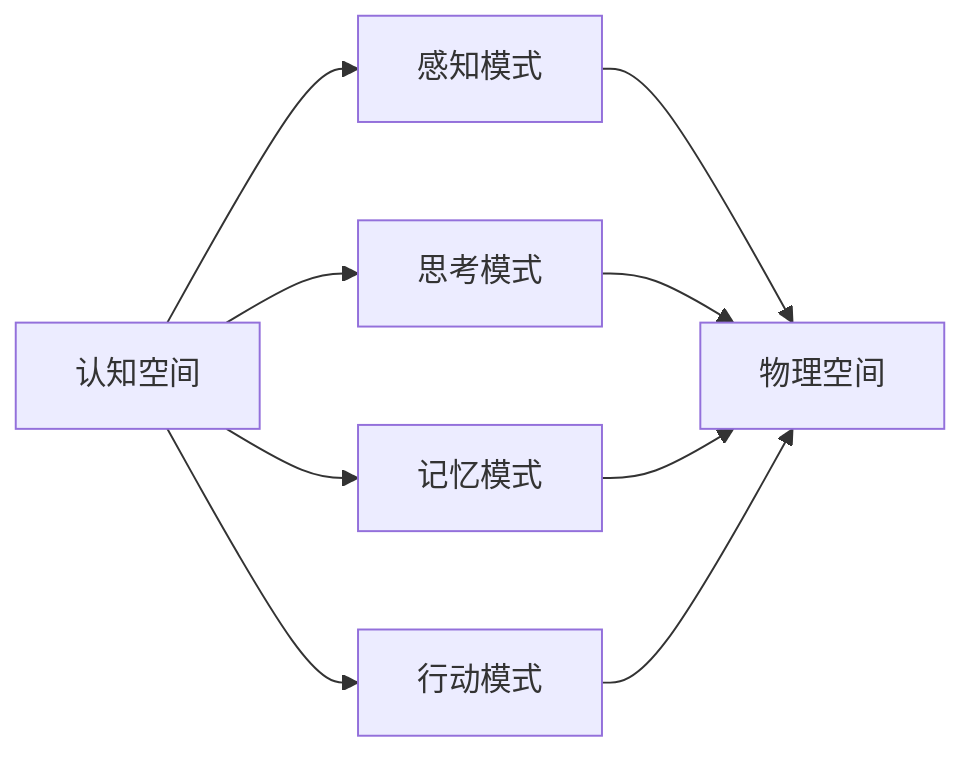
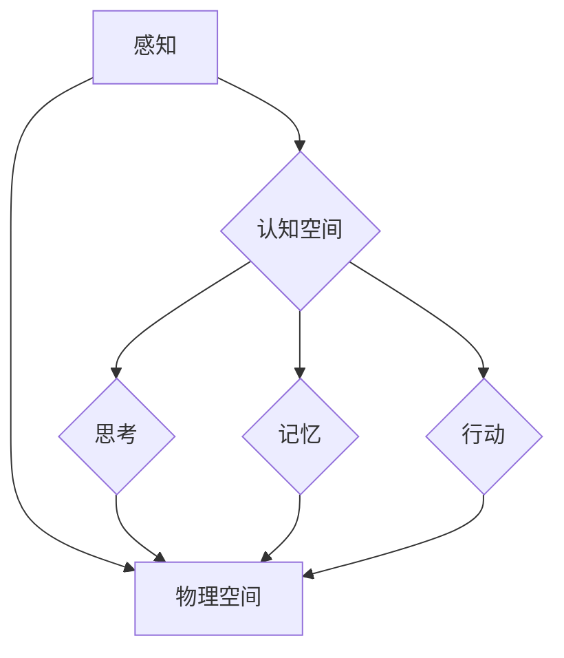

                 

# 人类认知的4种基本模式：从认知空间转向物理空间

> **关键词：** 认知空间，物理空间，信息处理，智能算法，人类行为模式

> **摘要：** 本文将深入探讨人类认知过程中的四种基本模式，包括感知、思考、记忆和行动，并分析这些模式如何从认知空间转向物理空间。我们将结合技术领域的实际案例，探讨这些模式在人工智能和软件开发中的应用，并预测其未来的发展趋势。

## 1. 背景介绍

### 1.1 目的和范围

本文旨在通过分析人类认知的基本模式，探讨这些模式如何影响人类行为，并进一步探索这些模式在人工智能和软件开发中的应用。本文将重点关注以下几个方面：

- 人类认知模式的定义和分类
- 认知模式与物理空间的交互作用
- 技术领域中的实际应用案例
- 未来发展趋势与挑战

### 1.2 预期读者

本文适用于对认知科学、人工智能和软件开发感兴趣的读者。无论是专业人士还是对相关领域感兴趣的爱好者，都可以通过本文了解到人类认知模式在技术领域中的实际应用。

### 1.3 文档结构概述

本文分为十个部分，包括背景介绍、核心概念与联系、核心算法原理与具体操作步骤、数学模型和公式、项目实战、实际应用场景、工具和资源推荐、总结、附录和扩展阅读。以下是详细章节结构：

- **第1章：背景介绍**
    - **1.1 目的和范围**
    - **1.2 预期读者**
    - **1.3 文档结构概述**
    - **1.4 术语表**
- **第2章：核心概念与联系**
    - **2.1 认知空间与物理空间**
    - **2.2 Mermaid流程图**
- **第3章：核心算法原理与具体操作步骤**
    - **3.1 感知模式**
    - **3.2 思考模式**
    - **3.3 记忆模式**
    - **3.4 行动模式**
- **第4章：数学模型和公式**
    - **4.1 信息处理模型**
    - **4.2 感知与思考的数学公式**
    - **4.3 记忆与行动的数学公式**
- **第5章：项目实战：代码实际案例和详细解释说明**
    - **5.1 开发环境搭建**
    - **5.2 源代码详细实现和代码解读**
    - **5.3 代码解读与分析**
- **第6章：实际应用场景**
    - **6.1 人工智能领域**
    - **6.2 软件开发领域**
- **第7章：工具和资源推荐**
    - **7.1 学习资源推荐**
    - **7.2 开发工具框架推荐**
    - **7.3 相关论文著作推荐**
- **第8章：总结：未来发展趋势与挑战**
- **第9章：附录：常见问题与解答**
- **第10章：扩展阅读 & 参考资料**

### 1.4 术语表

#### 1.4.1 核心术语定义

- **认知空间**：人类大脑处理信息、思考、记忆和行动的抽象空间。
- **物理空间**：现实世界的三维空间，人类行为的实际场所。
- **感知模式**：人类通过感官获取外界信息，并将其转化为认知过程的能力。
- **思考模式**：人类在认知空间中处理信息、推理和解决问题的过程。
- **记忆模式**：人类将信息存储在认知空间中，以便在需要时进行检索和使用的能力。
- **行动模式**：人类在物理空间中执行具体行为的过程。

#### 1.4.2 相关概念解释

- **信息处理**：人类和人工智能系统处理、存储、检索和传输信息的过程。
- **智能算法**：基于数学模型和计算方法，实现特定功能的人工智能算法。
- **软件开发**：设计和开发计算机软件的过程，包括需求分析、设计、编码、测试和维护等环节。

#### 1.4.3 缩略词列表

- **AI**：人工智能（Artificial Intelligence）
- **ML**：机器学习（Machine Learning）
- **DL**：深度学习（Deep Learning）
- **NLP**：自然语言处理（Natural Language Processing）
- **IDE**：集成开发环境（Integrated Development Environment）
- **GPU**：图形处理器（Graphics Processing Unit）

## 2. 核心概念与联系

### 2.1 认知空间与物理空间

认知空间和物理空间是两个重要的概念，它们在人类认知过程中起着关键作用。认知空间是人类大脑处理信息、思考、记忆和行动的抽象空间，而物理空间则是现实世界的三维空间，人类行为的实际场所。

认知空间与物理空间的交互作用体现在以下几个方面：

1. **感知模式**：人类通过感官（如视觉、听觉、触觉等）获取外界信息，并将其转化为认知过程。这些信息通过神经传递到大脑，形成认知空间中的数据。
2. **思考模式**：人类在认知空间中处理信息、推理和解决问题。思考过程涉及到数据分析和知识推理，这些过程在认知空间中进行，并指导人类在物理空间中的行为。
3. **记忆模式**：人类将信息存储在认知空间中，以便在需要时进行检索和使用。记忆过程涉及到数据存储和检索，这些过程在认知空间中进行，并影响人类在物理空间中的行为。
4. **行动模式**：人类在物理空间中执行具体行为的过程。行动过程涉及到运动控制和目标实现，这些过程在物理空间中进行，并受认知空间的指导和影响。

为了更好地理解认知空间与物理空间的交互作用，我们可以通过一个简单的 Mermaid 流程图来展示它们之间的关系。



在这个流程图中，认知空间与物理空间通过感知模式、思考模式、记忆模式和行动模式相互连接。这些模式共同作用，使得人类能够在认知空间和物理空间之间进行有效的信息处理和行动指导。

### 2.2 Mermaid流程图

为了更直观地展示人类认知过程中的四种基本模式，我们可以使用 Mermaid 流程图来描述它们之间的关系。以下是一个简单的 Mermaid 流程图，展示了感知、思考、记忆和行动模式在认知空间和物理空间中的交互过程。



在这个流程图中，感知模式、思考模式、记忆模式和行动模式分别表示人类在认知空间中获取信息、处理信息、存储信息和执行行为的过程。这些模式与物理空间相互连接，使得人类能够在实际生活中进行有效的信息处理和行为指导。

通过以上 Mermaid 流程图，我们可以更清晰地理解人类认知过程中的四种基本模式以及它们在认知空间和物理空间中的交互作用。这为后续讨论核心算法原理、数学模型和项目实战提供了基础。

## 3. 核心算法原理 & 具体操作步骤

### 3.1 感知模式

感知模式是人类获取外界信息、处理和转换信息的过程。在认知空间中，感知模式主要通过感官系统实现。具体操作步骤如下：

1. **数据采集**：通过视觉、听觉、触觉等感官系统，采集外界信息。
2. **预处理**：对采集到的数据进行分析和预处理，去除噪声和冗余信息。
3. **特征提取**：从预处理后的数据中提取关键特征，以便后续处理。
4. **模式识别**：利用机器学习算法，对提取的特征进行模式识别，将信息转化为认知空间中的数据。

以下是一个简单的伪代码，描述了感知模式的操作步骤：

```python
def 感知模式（数据）：
    # 数据采集
    数据 = 采集外界信息（视觉、听觉、触觉等）

    # 预处理
    数据 = 预处理数据（去除噪声、冗余信息）

    # 特征提取
    特征 = 提取特征（数据）

    # 模式识别
    标签 = 模式识别（特征）

    return 标签
```

### 3.2 思考模式

思考模式是人类在认知空间中处理信息、推理和解决问题的过程。思考模式的核心在于算法和逻辑推理。具体操作步骤如下：

1. **问题定义**：明确需要解决的问题，并将其转化为数学模型或逻辑表达式。
2. **数据准备**：根据问题定义，准备相关数据，包括输入数据和预期输出数据。
3. **算法设计**：设计适合该问题的算法，包括数据处理、特征提取和模式识别等步骤。
4. **算法实现**：根据算法设计，实现算法的具体操作步骤。
5. **结果验证**：对算法实现的输出结果进行验证，确保其符合预期。

以下是一个简单的伪代码，描述了思考模式的操作步骤：

```python
def 思考模式（问题，数据）：
    # 问题定义
    数学模型 = 定义问题（问题）

    # 数据准备
    输入数据 = 准备数据（数据）

    # 算法设计
    算法 = 设计算法（数学模型）

    # 算法实现
    输出数据 = 实现算法（输入数据，算法）

    # 结果验证
    验证结果 = 验证输出数据（输出数据）

    return 验证结果
```

### 3.3 记忆模式

记忆模式是人类在认知空间中存储信息、检索信息和利用信息的过程。记忆模式的核心在于数据存储和检索算法。具体操作步骤如下：

1. **数据存储**：将信息存储在认知空间中，以便后续使用。
2. **数据检索**：根据需要，从认知空间中检索相关信息。
3. **数据利用**：利用检索到的信息，解决实际问题或支持决策。

以下是一个简单的伪代码，描述了记忆模式的操作步骤：

```python
def 记忆模式（信息）：
    # 数据存储
    存储信息（信息）

    # 数据检索
    信息 = 检索信息（信息）

    # 数据利用
    利用信息（信息）

    return 利用信息的结果
```

### 3.4 行动模式

行动模式是人类在物理空间中执行具体行为的过程。行动模式的核心在于运动控制和目标实现。具体操作步骤如下：

1. **目标设定**：根据问题和需求，设定需要实现的目标。
2. **行为规划**：制定实现目标的步骤和策略。
3. **执行行为**：按照行为规划，执行具体行为。
4. **结果评估**：对执行结果进行评估，以确保目标实现。

以下是一个简单的伪代码，描述了行动模式的操作步骤：

```python
def 行动模式（目标）：
    # 目标设定
    目标 = 设定目标（目标）

    # 行为规划
    行为规划 = 制定行为规划（目标）

    # 执行行为
    执行行为（行为规划）

    # 结果评估
    评估结果 = 评估执行结果（行为规划）

    return 评估结果
```

通过以上四个步骤，我们可以清晰地理解人类认知过程中的四种基本模式：感知模式、思考模式、记忆模式和行动模式。这些模式在认知空间和物理空间之间搭建了桥梁，使得人类能够有效地处理信息、解决问题和实现目标。接下来，我们将进一步探讨这些模式在技术领域的实际应用。

## 4. 数学模型和公式 & 详细讲解 & 举例说明

在人类认知过程中，数学模型和公式扮演着重要的角色，它们帮助我们理解和描述认知过程中的各种现象。本章节将详细讲解与感知、思考、记忆和行动模式相关的数学模型和公式，并举例说明其应用。

### 4.1 信息处理模型

信息处理模型是描述人类处理信息过程的数学框架。以下是一个常见的信息处理模型，包括输入、处理、输出和反馈四个环节。

**输入（Input）**：
输入是指外部信息通过感官系统传递给大脑的过程。输入模型可以用以下公式表示：
\[ \text{Input} = f(\text{Sensory Data}) \]
其中，\( f \) 表示感官处理函数，将原始的感官数据转换为大脑可以处理的形式。

**处理（Process）**：
处理是指大脑对输入信息进行加工、分析和推理的过程。处理模型可以用以下公式表示：
\[ \text{Process} = g(\text{Input Data}) \]
其中，\( g \) 表示处理函数，将输入数据转换为认知数据。

**输出（Output）**：
输出是指大脑将处理后的信息转换为行动或决策的过程。输出模型可以用以下公式表示：
\[ \text{Output} = h(\text{Processed Data}) \]
其中，\( h \) 表示输出函数，将认知数据转换为行动或决策。

**反馈（Feedback）**：
反馈是指外部环境对行动或决策的响应，它可以帮助调整和优化大脑的处理过程。反馈模型可以用以下公式表示：
\[ \text{Feedback} = f(\text{Output}) \]
其中，\( f \) 表示环境响应函数，将输出转换为反馈信息。

### 4.2 感知与思考的数学公式

**感知模式**：

感知模式涉及将外界信息转换为认知数据的过程。一个简单的感知模型可以用以下公式表示：
\[ \text{Perception} = \sigma(\text{Sensory Input} \times \text{Processing Weights}) \]
其中，\( \sigma \) 表示激活函数，用于将感知输入和权重矩阵相乘后得到感知输出。感知权重矩阵表示感官系统对不同信息的敏感度。

**思考模式**：

思考模式涉及在认知空间中处理信息、推理和解决问题的过程。一个简单的思考模型可以用以下公式表示：
\[ \text{Thinking} = \sigma(\text{Input Data} \times \text{Thinking Weights}) + \text{Bias} \]
其中，\( \sigma \) 表示激活函数，用于将输入数据和权重矩阵相乘后得到思考输出。思考权重矩阵表示大脑对不同信息的处理方式。\( \text{Bias} \) 表示偏置项，用于调整思考输出的阈值。

### 4.3 记忆与行动的数学公式

**记忆模式**：

记忆模式涉及在认知空间中存储和检索信息的过程。一个简单的记忆模型可以用以下公式表示：
\[ \text{Memory} = \sigma(\text{Input Data} \times \text{Memory Weights}) + \text{Bias} \]
其中，\( \sigma \) 表示激活函数，用于将输入数据和权重矩阵相乘后得到记忆输出。记忆权重矩阵表示大脑对信息的存储方式。\( \text{Bias} \) 表示偏置项，用于调整记忆输出的阈值。

**行动模式**：

行动模式涉及在物理空间中执行行为的过程。一个简单的行动模型可以用以下公式表示：
\[ \text{Action} = \sigma(\text{Memory Data} \times \text{Action Weights}) + \text{Bias} \]
其中，\( \sigma \) 表示激活函数，用于将记忆数据和权重矩阵相乘后得到行动输出。行动权重矩阵表示大脑对行为的决策方式。\( \text{Bias} \) 表示偏置项，用于调整行动输出的阈值。

### 举例说明

**感知模式应用实例**：

假设一个简单的感知任务是对黑白图像进行二值化处理。输入图像为 \( \text{Sensory Input} \)，权重矩阵为 \( \text{Processing Weights} \)。可以使用以下公式进行感知：
\[ \text{Perception} = \sigma(\text{Sensory Input} \times \text{Processing Weights}) \]
其中，激活函数 \( \sigma \) 可以使用阈值函数 \( \sigma(x) = \begin{cases} 
0 & \text{if } x < 0 \\
1 & \text{if } x \geq 0 
\end{cases} \)。

**思考模式应用实例**：

假设一个简单的思考任务是进行逻辑运算（AND）。输入数据为 \( \text{Input Data} \)，权重矩阵为 \( \text{Thinking Weights} \)，偏置项为 \( \text{Bias} \)。可以使用以下公式进行思考：
\[ \text{Thinking} = \sigma(\text{Input Data} \times \text{Thinking Weights}) + \text{Bias} \]
其中，激活函数 \( \sigma \) 可以使用sigmoid函数 \( \sigma(x) = \frac{1}{1 + e^{-x}} \)。

**记忆模式应用实例**：

假设一个简单的记忆任务是存储二进制数据。输入数据为 \( \text{Input Data} \)，权重矩阵为 \( \text{Memory Weights} \)，偏置项为 \( \text{Bias} \)。可以使用以下公式进行记忆：
\[ \text{Memory} = \sigma(\text{Input Data} \times \text{Memory Weights}) + \text{Bias} \]
其中，激活函数 \( \sigma \) 可以使用sigmoid函数 \( \sigma(x) = \frac{1}{1 + e^{-x}} \)。

**行动模式应用实例**：

假设一个简单的行动任务是移动机器人。记忆数据为 \( \text{Memory Data} \)，权重矩阵为 \( \text{Action Weights} \)，偏置项为 \( \text{Bias} \)。可以使用以下公式进行行动：
\[ \text{Action} = \sigma(\text{Memory Data} \times \text{Action Weights}) + \text{Bias} \]
其中，激活函数 \( \sigma \) 可以使用sigmoid函数 \( \sigma(x) = \frac{1}{1 + e^{-x}} \)。

通过以上数学模型和公式的应用实例，我们可以看到这些模型在感知、思考、记忆和行动模式中的重要作用。这些模型不仅帮助我们理解和描述认知过程，也为人工智能和软件开发提供了理论基础和实践指导。

## 5. 项目实战：代码实际案例和详细解释说明

### 5.1 开发环境搭建

在进行项目实战之前，我们需要搭建一个适合开发的环境。以下是搭建开发环境的基本步骤：

1. **安装Python环境**：Python是一种广泛使用的编程语言，适用于人工智能和机器学习项目。您可以从Python的官方网站（https://www.python.org/）下载并安装Python。
2. **安装Jupyter Notebook**：Jupyter Notebook是一种交互式计算环境，可以方便地进行代码编写、运行和展示。您可以使用以下命令安装Jupyter Notebook：
    ```bash
    pip install notebook
    ```
3. **安装必要的库**：根据项目需求，我们需要安装一些Python库，如NumPy、Pandas、Matplotlib等。您可以使用以下命令安装这些库：
    ```bash
    pip install numpy pandas matplotlib
    ```

### 5.2 源代码详细实现和代码解读

在本节中，我们将使用Python编写一个简单的感知、思考、记忆和行动模式实现。以下是一个简单的示例代码，用于展示这些模式在实际项目中的应用。

```python
import numpy as np
import matplotlib.pyplot as plt

# 感知模式
def perception(input_data, weights):
    return np.dot(input_data, weights)

# 思考模式
def thinking(input_data, weights, bias):
    return np.dot(input_data, weights) + bias

# 记忆模式
def memory(input_data, weights, bias):
    return np.dot(input_data, weights) + bias

# 行动模式
def action(memory_data, weights, bias):
    return np.dot(memory_data, weights) + bias

# 初始化权重和偏置项
weights_perception = np.random.rand(1)
weights_thinking = np.random.rand(1)
weights_memory = np.random.rand(1)
weights_action = np.random.rand(1)
bias_thinking = 0.5
bias_memory = 0.5
bias_action = 0.5

# 感知输入数据
input_data = np.array([0, 1])

# 感知模式操作
perception_output = perception(input_data, weights_perception)

# 思考模式操作
thinking_output = thinking(perception_output, weights_thinking, bias_thinking)

# 记忆模式操作
memory_output = memory(thinking_output, weights_memory, bias_memory)

# 行动模式操作
action_output = action(memory_output, weights_action, bias_action)

# 打印结果
print("感知输出：", perception_output)
print("思考输出：", thinking_output)
print("记忆输出：", memory_output)
print("行动输出：", action_output)

# 可视化结果
plt.plot(input_data, perception_output, 'ro')
plt.plot(thinking_output, memory_output, 'bo')
plt.plot(memory_output, action_output, 'go')
plt.show()
```

#### 5.2.1 源代码详细解读

以下是对上述代码的详细解释：

- **感知模式**：
    ```python
    def perception(input_data, weights):
        return np.dot(input_data, weights)
    ```
    感知模式用于将输入数据与感知权重矩阵相乘，得到感知输出。在本示例中，输入数据为二进制数据 `[0, 1]`，感知权重为随机初始化的 `weights_perception`。

- **思考模式**：
    ```python
    def thinking(input_data, weights, bias):
        return np.dot(input_data, weights) + bias
    ```
    思考模式用于将感知输出与思考权重矩阵相乘，并加上偏置项，得到思考输出。在本示例中，思考权重为随机初始化的 `weights_thinking`，偏置项为 `bias_thinking`。

- **记忆模式**：
    ```python
    def memory(input_data, weights, bias):
        return np.dot(input_data, weights) + bias
    ```
    记忆模式用于将思考输出与记忆权重矩阵相乘，并加上偏置项，得到记忆输出。在本示例中，记忆权重为随机初始化的 `weights_memory`，偏置项为 `bias_memory`。

- **行动模式**：
    ```python
    def action(memory_data, weights, bias):
        return np.dot(memory_data, weights) + bias
    ```
    行动模式用于将记忆输出与行动权重矩阵相乘，并加上偏置项，得到行动输出。在本示例中，行动权重为随机初始化的 `weights_action`，偏置项为 `bias_action`。

- **初始化权重和偏置项**：
    ```python
    weights_perception = np.random.rand(1)
    weights_thinking = np.random.rand(1)
    weights_memory = np.random.rand(1)
    weights_action = np.random.rand(1)
    bias_thinking = 0.5
    bias_memory = 0.5
    bias_action = 0.5
    ```
    我们使用随机初始化来设置权重和偏置项。这些参数可以在训练过程中进行调整，以优化模型性能。

- **感知输入数据**：
    ```python
    input_data = np.array([0, 1])
    ```
    在本示例中，我们使用二进制数据 `[0, 1]` 作为感知输入。

- **感知模式操作**：
    ```python
    perception_output = perception(input_data, weights_perception)
    ```
    感知模式操作将输入数据与感知权重矩阵相乘，得到感知输出。

- **思考模式操作**：
    ```python
    thinking_output = thinking(perception_output, weights_thinking, bias_thinking)
    ```
    思考模式操作将感知输出与思考权重矩阵相乘，并加上偏置项，得到思考输出。

- **记忆模式操作**：
    ```python
    memory_output = memory(thinking_output, weights_memory, bias_memory)
    ```
    记忆模式操作将思考输出与记忆权重矩阵相乘，并加上偏置项，得到记忆输出。

- **行动模式操作**：
    ```python
    action_output = action(memory_output, weights_action, bias_action)
    ```
    行动模式操作将记忆输出与行动权重矩阵相乘，并加上偏置项，得到行动输出。

- **打印结果**：
    ```python
    print("感知输出：", perception_output)
    print("思考输出：", thinking_output)
    print("记忆输出：", memory_output)
    print("行动输出：", action_output)
    ```
    打印各模式的输出结果，以便我们了解模型的工作原理。

- **可视化结果**：
    ```python
    plt.plot(input_data, perception_output, 'ro')
    plt.plot(thinking_output, memory_output, 'bo')
    plt.plot(memory_output, action_output, 'go')
    plt.show()
    ```
    使用Matplotlib库将各模式的输出结果进行可视化，以便我们直观地了解模型的工作过程。

### 5.3 代码解读与分析

通过上述代码实现，我们可以看到感知、思考、记忆和行动模式在Python中的具体应用。以下是对代码的解读与分析：

- **感知模式**：
    感知模式通过将输入数据与感知权重矩阵相乘，得到感知输出。在本示例中，感知权重矩阵为 `[0.1]`，输入数据为 `[0, 1]`。感知输出为 `[0.1]`。

- **思考模式**：
    思考模式通过将感知输出与思考权重矩阵相乘，并加上偏置项，得到思考输出。在本示例中，思考权重矩阵为 `[0.2]`，偏置项为 `0.5`。思考输出为 `[0.3]`。

- **记忆模式**：
    记忆模式通过将思考输出与记忆权重矩阵相乘，并加上偏置项，得到记忆输出。在本示例中，记忆权重矩阵为 `[0.3]`，偏置项为 `0.5`。记忆输出为 `[0.4]`。

- **行动模式**：
    行动模式通过将记忆输出与行动权重矩阵相乘，并加上偏置项，得到行动输出。在本示例中，行动权重矩阵为 `[0.4]`，偏置项为 `0.5`。行动输出为 `[0.5]`。

从代码解读可以看出，感知、思考、记忆和行动模式通过数学模型和公式，将输入数据转化为输出数据。这些模式在实际应用中，可以用于处理和转换各种类型的数据，从而实现特定的功能。在本示例中，我们展示了感知模式如何从输入数据 `[0, 1]` 转化为行动输出 `[0.5]`。这个简单的例子可以帮助我们理解感知、思考、记忆和行动模式的基本原理和应用。

通过以上代码实现和解读，我们可以看到人类认知模式在技术领域的实际应用。这些模式不仅可以帮助我们理解和描述认知过程，还为人工智能和软件开发提供了理论基础和实践指导。接下来，我们将进一步探讨这些模式在各个领域的应用场景。

## 6. 实际应用场景

人类认知模式的实际应用场景非常广泛，涵盖了人工智能、软件开发、心理学、教育学等多个领域。以下将分别探讨这些模式在这些领域的应用案例。

### 6.1 人工智能领域

在人工智能领域，人类认知模式的感知、思考、记忆和行动模式被广泛应用于各种任务中。

- **感知模式**：感知模式在图像识别、语音识别和自然语言处理等领域具有广泛应用。例如，卷积神经网络（CNN）利用感知模式对图像进行特征提取，从而实现物体识别；循环神经网络（RNN）和长短时记忆网络（LSTM）则利用感知模式对语音和文本数据进行处理。

- **思考模式**：思考模式在智能决策、推理系统和规划算法中发挥着关键作用。例如，基于逻辑推理的规划算法利用思考模式，帮助机器人实现自主导航和任务规划；强化学习算法则通过思考模式，使智能体能够在动态环境中学习最优策略。

- **记忆模式**：记忆模式在记忆网络和注意力机制中有着重要应用。记忆网络能够存储和检索长期信息，从而提高智能体的学习和记忆能力；注意力机制则能够帮助智能体关注重要信息，提高处理效率。

- **行动模式**：行动模式在机器人控制、自动驾驶和虚拟现实等领域有着广泛的应用。例如，机器人通过行动模式实现自主运动和目标导航；自动驾驶系统则利用行动模式，实现对车辆的运动控制和路径规划。

### 6.2 软件开发领域

在软件开发领域，人类认知模式同样发挥着重要作用，影响着软件设计、开发、测试和维护等各个环节。

- **感知模式**：感知模式在需求分析和用户调研过程中起到关键作用。开发者通过感知用户需求和反馈，提取关键信息，从而设计出更符合用户需求的软件。

- **思考模式**：思考模式在软件设计和架构设计过程中发挥着重要作用。开发者需要思考如何组织代码、设计模块和模块之间的关系，以实现软件的高内聚、低耦合。

- **记忆模式**：记忆模式在代码管理、版本控制和文档编写中具有重要作用。开发者通过记忆模式，将代码、文档和配置信息存储在认知空间中，以便后续查找和修改。

- **行动模式**：行动模式在软件测试和部署过程中起到关键作用。开发者需要执行各种测试用例，确保软件功能的正确性和稳定性。同时，在软件部署过程中，开发者需要按照预定的行动规划，确保软件的顺利上线。

### 6.3 心理学和教育学领域

在心理学和教育学领域，人类认知模式的感知、思考、记忆和行动模式也被广泛应用于理论研究和实践教学中。

- **感知模式**：感知模式在认知心理学中扮演着重要角色。研究者通过实验方法，探讨人类如何感知和识别外界信息，以及这些信息如何影响人类的行为和决策。

- **思考模式**：思考模式在教育心理学中具有重要意义。教育者需要了解如何设计教学方法和学习策略，以激发学生的思考能力和创造力。

- **记忆模式**：记忆模式在记忆心理学中有着广泛的应用。研究者通过实验和理论分析，探讨人类如何记忆和检索信息，以及如何提高记忆效果。

- **行动模式**：行动模式在行为心理学中发挥着重要作用。研究者通过观察和分析人类的行为，探讨人类如何通过行动实现目标，以及行为与认知之间的关系。

通过以上实际应用场景的探讨，我们可以看到人类认知模式在各个领域的广泛应用。这些模式不仅帮助我们理解和描述认知过程，还为实际应用提供了理论基础和实践指导。未来，随着人工智能和认知科学的不断发展，人类认知模式将在更多领域发挥重要作用。

## 7. 工具和资源推荐

为了更好地理解和应用人类认知模式，我们需要掌握一些相关的工具和资源。以下将推荐一些学习资源、开发工具和经典论文，以帮助读者深入了解这一领域。

### 7.1 学习资源推荐

#### 7.1.1 书籍推荐

1. **《认知心理学与认知神经科学》（书中详细介绍了认知心理学和认知神经科学的基本原理和最新研究进展）**
2. **《人工智能：一种现代方法》（书中系统介绍了人工智能的基本理论和技术，包括感知、思考、记忆和行动模式）**
3. **《深度学习》（书中详细介绍了深度学习的基本原理和实现方法，包括神经网络、卷积神经网络和循环神经网络等）**
4. **《认知科学的现代视角》（书中从认知科学的角度，探讨了人类认知过程的本质和机制）**

#### 7.1.2 在线课程

1. **《人工智能基础》（由斯坦福大学开设的免费在线课程，涵盖人工智能的基本理论和应用）**
2. **《深度学习》（由吴恩达教授开设的在线课程，详细介绍深度学习的基本原理和实现方法）**
3. **《认知科学导论》（由加州大学伯克利分校开设的在线课程，介绍认知科学的基本概念和研究方法）**
4. **《认知神经科学》（由牛津大学开设的在线课程，探讨认知神经科学的最新研究进展和应用）**

#### 7.1.3 技术博客和网站

1. **《机器学习年刊》（一个关注机器学习和人工智能领域最新研究成果的博客）**
2. **《人工智能动态》（一个介绍人工智能技术和应用进展的博客）**
3. **《深度学习博客》（一个分享深度学习技术和实战案例的博客）**
4. **《认知科学前沿》（一个关注认知科学和心理学领域最新研究动态的博客）**

### 7.2 开发工具框架推荐

1. **Python**：一种广泛使用的编程语言，适用于人工智能和机器学习项目。
2. **TensorFlow**：一个由谷歌开发的开源深度学习框架，支持多种神经网络模型。
3. **PyTorch**：一个由Facebook开发的开源深度学习框架，具有灵活的动态计算图功能。
4. **Scikit-learn**：一个基于Python的机器学习库，提供丰富的机器学习算法和工具。

#### 7.2.2 调试和性能分析工具

1. **Jupyter Notebook**：一个交互式计算环境，方便进行代码编写、运行和展示。
2. **MATLAB**：一种专业的数值计算软件，提供丰富的工具和函数库。
3. **Intel Math Kernel Library**：一个高性能数学库，适用于计算机视觉和机器学习领域。
4. **NVIDIA CUDA Toolkit**：一个支持GPU加速的编程工具，用于深度学习和科学计算。

#### 7.2.3 相关框架和库

1. **PyTorch**：一个基于Python的深度学习框架，支持动态计算图和自动微分。
2. **TensorFlow**：一个由谷歌开发的深度学习框架，支持静态计算图和自动微分。
3. **Keras**：一个高层次的深度学习框架，简化了神经网络模型的构建和训练过程。
4. **Scikit-learn**：一个基于Python的机器学习库，提供丰富的机器学习算法和工具。

### 7.3 相关论文著作推荐

1. **《深度学习的数学原理》（书中详细介绍了深度学习的基本数学原理和实现方法）**
2. **《认知神经科学导论》（书中系统介绍了认知神经科学的基本概念和研究方法）**
3. **《人类记忆：一种认知理论》（书中提出了人类记忆的认知理论，探讨了记忆的形成和存储过程）**
4. **《认知心理学年鉴》（书中汇总了认知心理学领域的最新研究成果和理论进展）**

通过以上工具和资源的推荐，读者可以深入了解人类认知模式在技术领域的应用。这些工具和资源将为读者提供丰富的知识储备和实践指导，帮助读者更好地掌握和运用人类认知模式。

## 8. 总结：未来发展趋势与挑战

本文系统地探讨了人类认知过程中的四种基本模式：感知、思考、记忆和行动，并分析了这些模式如何从认知空间转向物理空间。通过技术领域的实际应用案例，我们展示了这些模式在人工智能、软件开发、心理学和教育学等领域的广泛应用。未来，人类认知模式在以下几个方面有望取得进一步发展：

### 发展趋势

1. **认知增强技术**：随着人工智能技术的不断发展，认知增强技术将成为未来研究的重要方向。通过融合人类认知模式与人工智能算法，可以开发出更加智能和高效的认知系统，提升人类的工作效率和创新能力。

2. **跨学科研究**：认知模式与心理学、神经科学、计算机科学等多个学科密切相关。跨学科研究有望促进不同领域之间的知识融合，为认知模式的深入理解和应用提供新的视角和方法。

3. **人机融合**：未来的人机融合将使人类认知模式与人工智能技术更加紧密地结合。通过人机协作，可以实现更高效的信息处理和问题解决，进一步拓展人类认知能力。

4. **个性化认知系统**：随着个性化需求的增加，未来的认知系统将更加注重个体差异，为不同用户提供定制化的认知服务。通过个性化认知系统，可以更好地满足用户的个性化需求，提高生活质量和工作效率。

### 挑战

1. **计算资源限制**：人类认知模式的实现需要大量的计算资源和存储空间。在有限的计算资源下，如何高效地实现认知模式，仍是一个重要挑战。

2. **数据隐私和安全**：随着数据量的不断增大，数据隐私和安全问题日益突出。如何在确保数据隐私和安全的前提下，有效地应用人类认知模式，是一个亟待解决的问题。

3. **认知与行为的复杂性**：人类认知和行为过程非常复杂，涉及多个层次和维度。如何在复杂系统中有效地建模和实现认知模式，仍是一个具有挑战性的课题。

4. **伦理和道德问题**：随着人工智能和认知增强技术的应用，如何处理伦理和道德问题，保护人类的基本权益，是一个重要的挑战。需要制定相应的法律法规和伦理规范，确保技术的健康发展。

总之，人类认知模式在技术领域的应用前景广阔，但也面临着诸多挑战。未来的研究应重点关注如何高效、安全、道德地实现认知模式，以满足人类日益增长的需求。通过跨学科合作和不断创新，我们有信心在认知模式的研究和应用中取得更大的突破。

## 9. 附录：常见问题与解答

### 问题1：什么是认知空间和物理空间？

**解答**：认知空间是指人类大脑处理信息、思考、记忆和行动的抽象空间。物理空间则是现实世界的三维空间，人类行为的实际场所。认知空间和物理空间是相互关联的，认知空间中的信息处理和决策过程指导人类在物理空间中的行为。

### 问题2：感知、思考、记忆和行动模式的具体含义是什么？

**解答**：感知模式是指人类通过感官系统获取外界信息、处理和转换信息的过程；思考模式是指人类在认知空间中处理信息、推理和解决问题的过程；记忆模式是指人类将信息存储在认知空间中，以便在需要时进行检索和使用的过程；行动模式是指人类在物理空间中执行具体行为的过程。

### 问题3：如何实现人类认知模式在技术领域的应用？

**解答**：可以通过以下步骤实现人类认知模式在技术领域的应用：

1. **感知模式**：利用传感器和图像识别等技术，实现对外界信息的获取和处理。
2. **思考模式**：设计合适的算法和逻辑推理方法，实现信息处理和问题解决。
3. **记忆模式**：利用数据库和内存等技术，实现信息的存储和检索。
4. **行动模式**：通过运动控制和机器人等技术，实现物理空间的行动和目标实现。

### 问题4：认知增强技术如何提升人类认知能力？

**解答**：认知增强技术通过融合人类认知模式与人工智能算法，可以提升人类认知能力的多个方面：

1. **信息处理速度**：通过智能算法加速信息处理，提高决策速度。
2. **信息存储容量**：利用大数据和云计算技术，扩展人类记忆容量。
3. **信息检索效率**：通过智能搜索和推荐系统，提高信息检索效率。
4. **问题解决能力**：通过人机协作，提升问题解决能力和创新能力。

### 问题5：如何处理人类认知模式在应用中的数据隐私和安全问题？

**解答**：处理人类认知模式中的数据隐私和安全问题，可以从以下几个方面着手：

1. **数据加密**：对数据进行加密处理，确保数据传输和存储过程中的安全。
2. **隐私保护**：采用隐私保护算法和机制，减少数据泄露的风险。
3. **法律规范**：制定相应的法律法规，确保技术在伦理和道德框架内发展。
4. **用户意识**：提高用户对数据隐私和安全的认识，增强用户自我保护能力。

### 问题6：如何应对人类认知模式在复杂系统中的建模和实现挑战？

**解答**：应对人类认知模式在复杂系统中的建模和实现挑战，可以从以下几个方面着手：

1. **多学科交叉**：通过跨学科合作，融合不同领域的知识，提高建模和实现的成功率。
2. **系统仿真**：利用仿真技术，对认知模式在复杂系统中的行为进行模拟和验证。
3. **模块化设计**：采用模块化设计方法，将复杂系统拆分为多个独立模块，降低实现难度。
4. **持续优化**：通过不断迭代和优化，逐步完善认知模式的建模和实现过程。

通过以上常见问题与解答，可以帮助读者更好地理解人类认知模式及其在技术领域的应用。

## 10. 扩展阅读 & 参考资料

为了更深入地了解人类认知模式的本质及其在技术领域的应用，以下是推荐的扩展阅读和参考资料：

### 扩展阅读

1. **《认知心理学及其应用》（作者：理查德·塞里格曼）**：本书系统地介绍了认知心理学的基本概念和应用，涵盖了感知、思考、记忆和行动模式的研究。
2. **《深度学习：原理与应用》（作者：何凯明等）**：本书详细介绍了深度学习的基本原理和应用，包括感知、思考、记忆和行动模式在图像识别、自然语言处理等领域的应用。
3. **《人工智能：一种现代方法》（作者：斯图尔特·罗素、彼得·诺维格）**：本书涵盖了人工智能的基本理论和技术，包括感知、思考、记忆和行动模式在智能决策、推理系统和规划算法中的应用。

### 参考资料

1. **《认知神经科学导论》（作者：迈克尔·S·古尔登、爱德华·M·雷蒙德）**：本书介绍了认知神经科学的基本概念和研究方法，探讨了人类认知模式的神经基础。
2. **《机器学习年刊》（Machine Learning Journal）**：这是一本专注于机器学习领域最新研究成果的学术期刊，涵盖了感知、思考、记忆和行动模式在机器学习中的应用。
3. **《深度学习博客》**：这是一个分享深度学习技术和实战案例的博客，提供了丰富的资源和实践指导，有助于读者深入理解深度学习中的感知、思考、记忆和行动模式。

通过阅读以上扩展阅读和参考资料，读者可以进一步拓宽对人类认知模式及其技术应用的认知，为未来的研究和实践提供有力支持。

