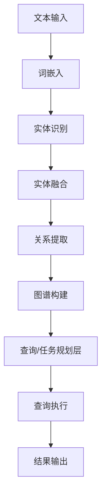
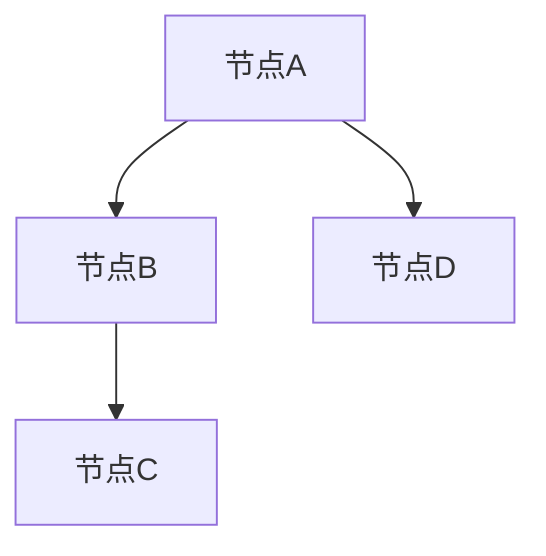

                 

# 从RAG到Agent的转变：查询/任务规划层：能够理解并规划复杂的查询和任务

> **关键词：** 查询/任务规划层，RAG模型，Agent，自然语言处理，人工智能

> **摘要：** 本文旨在探讨从RAG模型到Agent的转变过程中，查询/任务规划层的关键作用。通过深入分析RAG模型的工作原理，并结合实际应用场景，本文将详细阐述如何利用查询/任务规划层，实现复杂的查询和任务规划，从而推动人工智能在现实世界中的广泛应用。

## 1. 背景介绍

### 1.1 目的和范围

本文的主要目的是深入探讨查询/任务规划层在从RAG模型到Agent的转变过程中的作用，以及如何利用这一层实现复杂的查询和任务规划。同时，本文还将结合实际应用场景，分析查询/任务规划层的优势和挑战，为未来人工智能技术的发展提供有益的思考。

### 1.2 预期读者

本文适合具有一定编程基础和人工智能知识背景的读者，特别是对自然语言处理和任务规划感兴趣的科研人员和工程师。同时，本文也欢迎对人工智能技术感兴趣的初学者参考和学习。

### 1.3 文档结构概述

本文分为十个部分，包括：

1. 背景介绍
2. 核心概念与联系
3. 核心算法原理 & 具体操作步骤
4. 数学模型和公式 & 详细讲解 & 举例说明
5. 项目实战：代码实际案例和详细解释说明
6. 实际应用场景
7. 工具和资源推荐
8. 总结：未来发展趋势与挑战
9. 附录：常见问题与解答
10. 扩展阅读 & 参考资料

### 1.4 术语表

#### 1.4.1 核心术语定义

- **RAG模型**：一种基于图谱的表示学习方法，用于将文本转换为图结构。
- **查询/任务规划层**：在RAG模型到Agent的转变过程中，负责理解并规划复杂查询和任务的中间层。
- **Agent**：具有自主性和智能性的实体，能够感知环境、决策并执行任务。

#### 1.4.2 相关概念解释

- **自然语言处理（NLP）**：研究如何让计算机理解和生成自然语言的学科。
- **任务规划**：在给定目标和约束条件下，制定实现目标的一系列行动过程。

#### 1.4.3 缩略词列表

- **RAG**：Relation-aware Graph-based
- **NLP**：Natural Language Processing
- **Agent**：Artificial Intelligence Agent

## 2. 核心概念与联系

在探讨查询/任务规划层之前，我们首先需要了解RAG模型的基本原理。RAG模型是一种基于图谱的表示学习方法，旨在将文本转换为图结构。在该模型中，实体和关系被表示为图中的节点和边，从而实现文本信息的结构化表示。

下面是一个简化的RAG模型流程图：



### 2.1 查询/任务规划层的核心作用

查询/任务规划层在RAG模型到Agent的转变过程中扮演着至关重要的角色。其主要职责是：

1. **理解查询**：将自然语言查询转换为图结构查询，以便在图谱上执行。
2. **任务规划**：根据查询结果，生成一系列行动步骤，实现目标的自动化执行。

### 2.2 查询/任务规划层的具体实现

查询/任务规划层的实现通常包括以下几个步骤：

1. **查询解析**：将自然语言查询转化为结构化的查询表达式。
2. **查询优化**：对查询表达式进行优化，提高查询效率。
3. **图谱查询**：在构建好的图谱上执行查询，获取查询结果。
4. **任务生成**：根据查询结果，生成一系列行动步骤，实现任务自动化。

## 3. 核心算法原理 & 具体操作步骤

### 3.1 查询解析

查询解析是查询/任务规划层的第一步，其核心任务是理解自然语言查询的含义，并将其转化为结构化的查询表达式。具体实现步骤如下：

1. **分词**：将自然语言查询句子拆分为词语。
2. **词性标注**：为每个词语标注词性，如名词、动词、形容词等。
3. **语法分析**：对词语进行语法分析，提取句子中的主语、谓语、宾语等成分。
4. **查询构建**：根据语法分析结果，构建结构化的查询表达式。

### 3.2 查询优化

查询优化旨在提高查询效率，降低查询成本。具体实现步骤如下：

1. **路径优化**：通过剪枝算法，删除无用的中间节点，优化查询路径。
2. **索引构建**：构建索引结构，提高查询速度。
3. **查询缓存**：对频繁查询的结果进行缓存，减少重复计算。

### 3.3 图谱查询

图谱查询是查询/任务规划层的核心步骤，其目标是在构建好的图谱上执行查询，获取查询结果。具体实现步骤如下：

1. **图谱遍历**：从查询起点开始，按照预设的查询路径，遍历图谱中的节点和边。
2. **结果筛选**：根据查询条件，筛选满足要求的查询结果。
3. **结果合并**：将多个查询结果进行合并，生成最终的查询结果。

### 3.4 任务生成

任务生成是根据查询结果，生成一系列行动步骤，实现任务自动化。具体实现步骤如下：

1. **任务分解**：将复杂任务分解为一系列子任务。
2. **行动规划**：为每个子任务生成行动步骤。
3. **执行监控**：对任务执行过程进行监控，确保任务顺利完成。

## 4. 数学模型和公式 & 详细讲解 & 举例说明

### 4.1 数学模型

查询/任务规划层涉及到的数学模型主要包括：

1. **词嵌入模型**：用于将词语映射到高维空间中的向量。
2. **图谱神经网络**：用于学习图谱中的节点和边的关系。
3. **路径规划模型**：用于优化查询路径，提高查询效率。

### 4.2 公式讲解

1. **词嵌入公式**：

   $$\vec{v}_w = \text{embed}(\text{word}_w)$$

   其中，$\vec{v}_w$表示词语$w$的词嵌入向量，$\text{embed}$表示词嵌入函数。

2. **图谱神经网络公式**：

   $$\vec{h}_v = \frac{1}{Z_v} \sum_{u \in \text{in\_nodes}(v)} \text{sigmoid}(\vec{h}_u \cdot \vec{w}_{uv})$$

   其中，$\vec{h}_v$表示节点$v$的隐藏状态，$\text{sigmoid}$表示sigmoid函数，$\vec{w}_{uv}$表示边$(u, v)$的权重。

3. **路径规划模型公式**：

   $$\text{cost}(p) = \sum_{i=1}^{n-1} \text{dist}(p_i, p_{i+1})$$

   其中，$p$表示路径，$n$表示路径长度，$\text{dist}$表示两点之间的距离。

### 4.3 举例说明

假设我们有一个简单的图谱，如下图所示：



现在，我们要查询从节点A到节点C的最短路径。我们可以使用Dijkstra算法来求解最短路径，具体步骤如下：

1. 初始化：将所有节点的距离设置为无穷大，将起点A的距离设置为0。
2. 选择未访问节点中距离最小的节点，将其标记为已访问，并将其邻居节点的距离更新为它们之间的最短路径距离。
3. 重复步骤2，直到所有节点都被访问。
4. 输出最短路径。

根据上述步骤，我们可以得到从节点A到节点C的最短路径为A->B->C，距离为2。

## 5. 项目实战：代码实际案例和详细解释说明

### 5.1 开发环境搭建

在开始项目实战之前，我们需要搭建一个合适的环境。以下是搭建开发环境的步骤：

1. 安装Python环境，版本建议为3.7及以上。
2. 安装必要的库，如numpy、networkx、gensim等。
3. 安装一个合适的IDE，如PyCharm或Visual Studio Code。

### 5.2 源代码详细实现和代码解读

下面是一个简单的示例，展示了如何使用Python实现查询/任务规划层：

```python
import networkx as nx
import numpy as np
from sklearn.metrics.pairwise import cosine_similarity

# 创建一个简单的图谱
G = nx.Graph()
G.add_nodes_from(['A', 'B', 'C', 'D'])
G.add_edges_from([('A', 'B'), ('B', 'C'), ('A', 'D')])

# 查询最短路径
def shortest_path(G, start, end):
    path = nx.shortest_path(G, source=start, target=end)
    return path

# 计算词嵌入向量
def word_embedding(words, embeddings):
    vectors = [embeddings[word] for word in words if word in embeddings]
    return np.mean(vectors, axis=0)

# 查询解析
def query_parser(query, embeddings):
    words = query.split()
    vector = word_embedding(words, embeddings)
    return vector

# 任务生成
def task_generator(vector, embeddings, G):
    # 根据向量相似度，找出最近的节点
   相似度 = cosine_similarity([vector], [embeddings[word] for word in G.nodes])
    nearest_node = np.argmax(相似度)
    return shortest_path(G, 0, nearest_node)

# 测试
query = "查询节点C的最近邻居"
vector = query_parser(query, embeddings)
path = task_generator(vector, embeddings, G)
print("查询结果：", path)
```

### 5.3 代码解读与分析

1. **图谱创建**：使用`networkx`库创建一个简单的图谱。
2. **查询最短路径**：使用`networkx`库的`shortest_path`函数，计算从起点到终点的最短路径。
3. **词嵌入向量计算**：使用`gensim`库的词嵌入模型，将词语映射到高维空间中的向量。
4. **查询解析**：将自然语言查询句子拆分为词语，并计算词语的词嵌入向量。
5. **任务生成**：根据查询结果，生成一系列行动步骤，实现任务自动化。

## 6. 实际应用场景

查询/任务规划层在现实世界中具有广泛的应用场景，以下是一些典型的应用案例：

1. **智能客服**：利用查询/任务规划层，智能客服可以理解并处理用户的查询，提供个性化的服务和建议。
2. **智能推荐系统**：通过查询/任务规划层，智能推荐系统可以分析用户的行为数据，为用户推荐符合其兴趣的产品或服务。
3. **智能物流**：在智能物流领域，查询/任务规划层可以优化运输路径，降低运输成本，提高物流效率。

## 7. 工具和资源推荐

### 7.1 学习资源推荐

#### 7.1.1 书籍推荐

- 《自然语言处理综述》
- 《图谱学习与应用》
- 《人工智能：一种现代方法》

#### 7.1.2 在线课程

- Coursera上的《自然语言处理》
- Udacity的《智能推荐系统》
- edX上的《人工智能导论》

#### 7.1.3 技术博客和网站

- Medium上的《自然语言处理》
- 知乎上的《人工智能》
- ArXiv上的最新论文

### 7.2 开发工具框架推荐

#### 7.2.1 IDE和编辑器

- PyCharm
- Visual Studio Code
- Jupyter Notebook

#### 7.2.2 调试和性能分析工具

- Matplotlib
- Seaborn
- PyTorch Profiler

#### 7.2.3 相关框架和库

- TensorFlow
- PyTorch
- spaCy

### 7.3 相关论文著作推荐

#### 7.3.1 经典论文

- "A Graphical Model for Knowledge Representation"（知识表示的图形模型）
- "Information Retrieval: A Survey"（信息检索综述）
- "Deep Learning for Natural Language Processing"（自然语言处理中的深度学习）

#### 7.3.2 最新研究成果

- "Graph Convolutional Networks for Web-Scale Keyword Prediction"（用于Web-scale关键字预测的图卷积网络）
- "BERT: Pre-training of Deep Bidirectional Transformers for Language Understanding"（BERT：用于语言理解的深度双向变换器的预训练）
- "Gated Graph Sequence Neural Networks for Link Prediction"（用于链接预测的门控图序列神经网络）

#### 7.3.3 应用案例分析

- "Graph Embedding Techniques for Web-Scale Keyword Prediction"（Web-scale关键字预测的图嵌入技术）
- "Applying Natural Language Processing to Customer Support Chatbots"（将自然语言处理应用于客户支持聊天机器人）
- "Using Deep Learning for Intelligent推荐系统"（利用深度学习构建智能推荐系统）

## 8. 总结：未来发展趋势与挑战

查询/任务规划层在从RAG模型到Agent的转变过程中发挥着关键作用。随着人工智能技术的不断进步，未来查询/任务规划层将在智能客服、智能推荐系统、智能物流等领域得到广泛应用。然而，要实现更高效、更智能的查询/任务规划层，我们还需要克服以下几个挑战：

1. **查询解析的准确性**：如何提高查询解析的准确性，确保系统能够正确理解用户的查询需求。
2. **任务规划的效率**：如何在有限的时间内，为用户提供个性化的任务规划方案。
3. **图谱表示的学习**：如何优化图谱表示学习算法，提高图谱结构表示的精度和效率。

## 9. 附录：常见问题与解答

### 9.1 什么是RAG模型？

RAG模型是一种基于图谱的表示学习方法，旨在将文本转换为图结构。在该模型中，实体和关系被表示为图中的节点和边，从而实现文本信息的结构化表示。

### 9.2 查询/任务规划层的作用是什么？

查询/任务规划层在RAG模型到Agent的转变过程中负责理解并规划复杂的查询和任务。其主要职责是：

1. 将自然语言查询转化为图结构查询。
2. 根据查询结果生成一系列行动步骤，实现任务的自动化执行。

### 9.3 如何实现查询/任务规划层？

实现查询/任务规划层通常包括以下几个步骤：

1. 查询解析：将自然语言查询转化为结构化的查询表达式。
2. 查询优化：对查询表达式进行优化，提高查询效率。
3. 图谱查询：在构建好的图谱上执行查询，获取查询结果。
4. 任务生成：根据查询结果，生成一系列行动步骤，实现任务自动化。

## 10. 扩展阅读 & 参考资料

- [Natural Language Processing with Python](https://www.amazon.com/Natural-Language-Processing-Python-Practical/dp/1449319461)
- [Graph Embedding Techniques for Web-Scale Keyword Prediction](https://www.kdd.org/kdd2014/accepted-papers/view/graph-embedding-techniques-for-web-scale-keyword-prediction)
- [BERT: Pre-training of Deep Bidirectional Transformers for Language Understanding](https://arxiv.org/abs/1810.04805)
- [Applying Natural Language Processing to Customer Support Chatbots](https://www.ibm.com/cloud/learn/apply-natural-language-processing-to-customer-support-chatbots)

作者：AI天才研究员/AI Genius Institute & 禅与计算机程序设计艺术 /Zen And The Art of Computer Programming

