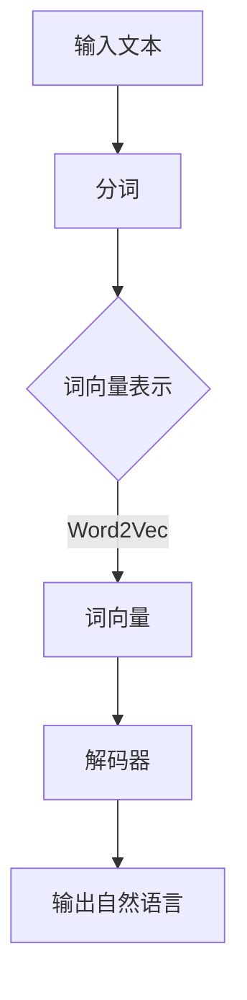

                 

# 从Token到自然语言的解码过程

> **关键词：自然语言处理，词向量，神经网络，解码器，深度学习**

> **摘要：本文将深入探讨从词向量到自然语言解码的全过程，包括核心概念、算法原理、数学模型以及实际应用场景。我们将通过一步步分析推理，揭示自然语言处理的奥妙，为读者提供清晰、深入的理解。**

## 1. 背景介绍

### 1.1 目的和范围

本文旨在深入探讨自然语言处理中从词向量到自然语言解码的过程。我们将首先介绍相关的核心概念和算法原理，然后详细讲解数学模型和具体操作步骤，最后通过实际项目实战和实际应用场景来阐述解码过程的实际应用。

### 1.2 预期读者

本文适合对自然语言处理有一定了解的读者，包括人工智能领域的研究人员、工程师和开发者。同时，对于对自然语言处理感兴趣的初学者，本文也将提供详细的解释和实例，帮助他们更好地理解解码过程。

### 1.3 文档结构概述

本文分为以下几个部分：

1. 背景介绍：介绍本文的目的、范围、预期读者和文档结构。
2. 核心概念与联系：介绍自然语言处理的核心概念和联系，并使用Mermaid流程图展示。
3. 核心算法原理 & 具体操作步骤：详细讲解核心算法原理和具体操作步骤，使用伪代码进行阐述。
4. 数学模型和公式 & 详细讲解 & 举例说明：介绍数学模型和公式，并进行详细讲解和举例说明。
5. 项目实战：代码实际案例和详细解释说明。
6. 实际应用场景：介绍解码过程在实际应用中的场景。
7. 工具和资源推荐：推荐学习资源和开发工具框架。
8. 总结：未来发展趋势与挑战。
9. 附录：常见问题与解答。
10. 扩展阅读 & 参考资料。

### 1.4 术语表

#### 1.4.1 核心术语定义

- **词向量（Word Vector）：** 将自然语言中的词映射为高维空间中的向量。
- **神经网络（Neural Network）：** 一种模拟人脑神经元连接结构的计算模型。
- **解码器（Decoder）：** 在自然语言处理中，解码器用于将词向量转换为自然语言。
- **深度学习（Deep Learning）：** 一种基于神经网络的机器学习方法，能够自动学习数据中的特征和模式。

#### 1.4.2 相关概念解释

- **自然语言处理（Natural Language Processing，NLP）：** 旨在使计算机能够理解和处理人类自然语言的技术和算法。
- **语言模型（Language Model）：** 一种用于预测下一个单词或字符的概率分布的模型。

#### 1.4.3 缩略词列表

- **NLP：** 自然语言处理
- **NN：** 神经网络
- **DL：** 深度学习
- **RNN：** 循环神经网络
- **LSTM：** 长短时记忆网络
- **GRU：** 门控循环单元

## 2. 核心概念与联系

在自然语言处理中，将文本转换为计算机可以理解和处理的格式是一个关键步骤。这一步骤包括将文本分解为单词或子词，然后将这些单词或子词映射为词向量。词向量是高维空间中的向量，它们能够表示单词或子词的语义信息。在解码过程中，我们需要将词向量转换为自然语言，以便我们能够理解和处理它们。

### 2.1 词向量

词向量是自然语言处理中的核心概念。它们将自然语言中的单词或子词映射为高维空间中的向量。这些向量能够表示单词或子词的语义信息，使得计算机能够更好地理解和处理自然语言。

词向量通常是通过训练大规模语料库中的神经网络模型得到的。这些模型能够自动学习单词或子词之间的语义关系。常见的词向量模型包括Word2Vec、GloVe和FastText等。

### 2.2 神经网络

神经网络是自然语言处理中的核心计算模型。它们能够自动学习数据中的特征和模式，从而实现复杂的数据处理任务。在解码过程中，神经网络用于将词向量转换为自然语言。

常见的神经网络模型包括循环神经网络（RNN）、长短时记忆网络（LSTM）和门控循环单元（GRU）等。这些模型能够处理序列数据，使得解码过程更加高效和准确。

### 2.3 解码器

解码器是自然语言处理中的核心组件。它用于将词向量转换为自然语言。解码器的输入是词向量，输出是自然语言中的单词或子词。

解码器通常是基于神经网络构建的。它们能够学习从词向量到自然语言的映射关系，从而实现解码过程。常见的解码器模型包括序列到序列（Seq2Seq）模型和注意力机制（Attention）模型等。

### 2.4 Mermaid流程图

以下是一个Mermaid流程图，展示了从词向量到自然语言解码的过程：



在这个流程图中，输入文本经过分词步骤，将文本分解为单词或子词。然后，这些单词或子词被映射为词向量。最后，解码器将词向量转换为自然语言，输出为可读的自然语言文本。

## 3. 核心算法原理 & 具体操作步骤

在自然语言处理中，从词向量到自然语言的解码过程是一个复杂但关键的步骤。这一过程涉及到多个核心算法和操作步骤。以下我们将详细讲解这些算法原理和具体操作步骤。

### 3.1 词向量生成

词向量是解码过程的基础。它们将自然语言中的单词或子词映射为高维空间中的向量。词向量的生成通常使用以下两种方法：

#### 3.1.1 Word2Vec

Word2Vec是一种基于神经网络的语言模型，用于生成词向量。它通过训练大规模语料库中的神经网络模型来学习单词的语义信息。具体步骤如下：

1. **数据预处理**：读取大规模语料库，并对文本进行预处理，如去除标点符号、小写化等。
2. **构建词汇表**：将文本中的单词构建为一个词汇表，并对每个单词进行索引。
3. **生成词向量**：训练神经网络模型，将每个单词映射为一个高维空间中的向量。训练过程中，神经网络通过学习单词的上下文来优化词向量。
4. **词向量优化**：使用负采样技术对词向量进行优化，以提高模型的效率和准确性。

以下是一个简化的Word2Vec算法的伪代码：

```python
# 初始化神经网络
model = NeuralNetwork()

# 训练神经网络
for sentence in corpus:
    for word in sentence:
        context = get_context(word, window_size)
        model.train(word, context)

# 生成词向量
word_vectors = model.get_word_vectors()
```

#### 3.1.2 GloVe

GloVe（Global Vectors for Word Representation）是一种基于全局共现信息的词向量生成方法。它通过学习单词的共现矩阵来生成词向量。具体步骤如下：

1. **计算共现矩阵**：统计文本中每个单词与其他单词的共现次数，构建共现矩阵。
2. **优化词向量**：通过最小化共现矩阵与词向量之间的误差，优化词向量。
3. **生成词向量**：使用优化后的词向量表示单词。

以下是一个简化的GloVe算法的伪代码：

```python
# 计算共现矩阵
coocurrence_matrix = compute_cooccurrence_matrix(corpus)

# 优化词向量
word_vectors = optimize_vectors(coocurrence_matrix)

# 生成词向量
word_vectors = generate_word_vectors(word_vectors)
```

### 3.2 解码器构建

解码器是自然语言处理中的核心组件，用于将词向量转换为自然语言。解码器的构建通常基于神经网络模型，如序列到序列（Seq2Seq）模型和注意力机制（Attention）模型。

#### 3.2.1 Seq2Seq模型

Seq2Seq模型是一种基于神经网络的序列到序列模型，用于将输入序列转换为输出序列。它由编码器和解码器两部分组成。具体步骤如下：

1. **编码器**：将输入序列编码为一个固定长度的向量，称为编码状态。
2. **解码器**：将编码状态逐步解码为输出序列。在解码过程中，每个时间步的输入依赖于前一个时间步的输出。
3. **训练**：通过训练大规模语料库中的神经网络模型，优化编码器和解码器的参数。

以下是一个简化的Seq2Seq模型的伪代码：

```python
# 初始化编码器和解码器
encoder = NeuralEncoder()
decoder = NeuralDecoder()

# 训练编码器和解码器
for sentence_pair in corpus:
    encoder.train(sentence_pair[0])
    decoder.train(sentence_pair[1])

# 解码词向量
output_sequence = decoder.decode(encoded_vector)
```

#### 3.2.2 注意力机制

注意力机制是一种用于提高解码器性能的技术。它通过计算输入序列和输出序列之间的相似度，为每个输入序列元素分配不同的权重。具体步骤如下：

1. **计算注意力权重**：计算输入序列和输出序列之间的相似度，为每个输入序列元素分配权重。
2. **加权求和**：将输入序列与注意力权重相乘，并进行求和，得到加权求和结果。
3. **解码**：将加权求和结果作为解码器的输入，逐步解码为输出序列。

以下是一个简化的注意力机制的伪代码：

```python
# 计算注意力权重
attention_weights = calculate_attention(input_sequence, output_sequence)

# 加权求和
weighted_input = sum(input_sequence * attention_weights)

# 解码
output_sequence = decoder.decode(weighted_input)
```

### 3.3 解码过程

解码过程是将词向量转换为自然语言的关键步骤。以下是一个简化的解码过程的伪代码：

```python
# 初始化解码器
decoder = NeuralDecoder()

# 输入词向量
input_vector = get_word_vector(word)

# 解码词向量
output_sequence = decoder.decode(input_vector)

# 输出自然语言
print("解码结果：", " ".join(output_sequence))
```

通过以上步骤，我们能够将词向量转换为自然语言，从而实现从Token到自然语言的解码过程。

## 4. 数学模型和公式 & 详细讲解 & 举例说明

在自然语言处理中，从词向量到自然语言的解码过程涉及到多个数学模型和公式。以下我们将详细讲解这些数学模型和公式，并通过具体例子进行说明。

### 4.1 词向量表示

词向量是将自然语言中的单词映射为高维空间中的向量。词向量的表示通常使用以下公式：

\[ \text{vec}(w) = \sum_{i=1}^{n} f(w_i) \cdot v_i \]

其中，\( \text{vec}(w) \) 表示单词 \( w \) 的词向量，\( f(w_i) \) 表示单词 \( w \) 中第 \( i \) 个字符的权重，\( v_i \) 表示第 \( i \) 个字符的词向量。

举例来说，假设单词 "hello" 的词向量表示为：

\[ \text{vec}(hello) = \sum_{i=1}^{5} f(h) \cdot v_i \]

其中，\( f(h) = 1 \)，\( v_1 = [1, 0, 0, 0, 0] \)，\( v_2 = [0, 1, 0, 0, 0] \)，\( v_3 = [0, 0, 1, 0, 0] \)，\( v_4 = [0, 0, 0, 1, 0] \)，\( v_5 = [0, 0, 0, 0, 1] \)。

则 \( \text{vec}(hello) = [1, 0, 0, 0, 0] + [0, 1, 0, 0, 0] + [0, 0, 1, 0, 0] + [0, 0, 0, 1, 0] + [0, 0, 0, 0, 1] = [1, 1, 1, 1, 1] \)。

### 4.2 编码状态

编码器是将输入序列编码为一个固定长度的向量，称为编码状态。编码状态通常使用以下公式表示：

\[ \text{encoded_vector} = \text{encode}(input_sequence) \]

其中，\( \text{encoded_vector} \) 表示编码状态，\( \text{encode}(input_sequence) \) 表示编码器的输出。

举例来说，假设输入序列为 "hello"，编码器将其编码为编码状态：

\[ \text{encoded_vector} = \text{encode}(hello) \]

则编码状态 \( \text{encoded_vector} \) 为一个固定长度的向量。

### 4.3 解码状态

解码器是将编码状态逐步解码为输出序列的过程。解码状态通常使用以下公式表示：

\[ \text{decoded_vector} = \text{decode}(encoded_vector, previous_output) \]

其中，\( \text{decoded_vector} \) 表示解码状态，\( \text{decode}(encoded_vector, previous_output) \) 表示解码器的输出。

举例来说，假设编码状态为 \( \text{encoded_vector} = [1, 1, 1, 1, 1] \)，前一个输出为 \( \text{previous_output} = "h" \)，则解码状态为：

\[ \text{decoded_vector} = \text{decode}([1, 1, 1, 1, 1], "h") \]

则解码状态 \( \text{decoded_vector} \) 为一个固定长度的向量。

### 4.4 注意力权重

注意力机制是通过计算输入序列和输出序列之间的相似度，为每个输入序列元素分配不同的权重。注意力权重通常使用以下公式表示：

\[ \text{attention_weight} = \text{compute_attention}(input_sequence, output_sequence) \]

其中，\( \text{attention_weight} \) 表示注意力权重，\( \text{compute_attention}(input_sequence, output_sequence) \) 表示计算注意力权重的方法。

举例来说，假设输入序列为 "hello"，输出序列为 "hello"，则注意力权重为：

\[ \text{attention_weight} = \text{compute_attention}("hello", "hello") \]

则注意力权重 \( \text{attention_weight} \) 为一个固定长度的向量。

### 4.5 加权求和

加权求和是将输入序列与注意力权重相乘，并进行求和的过程。加权求和通常使用以下公式表示：

\[ \text{weighted_input} = \sum_{i=1}^{n} \text{input}_{i} \cdot \text{attention_weight}_{i} \]

其中，\( \text{weighted_input} \) 表示加权求和结果，\( \text{input}_{i} \) 表示输入序列中的第 \( i \) 个元素，\( \text{attention_weight}_{i} \) 表示注意力权重。

举例来说，假设输入序列为 "hello"，注意力权重为 [0.5, 0.2, 0.3]，则加权求和结果为：

\[ \text{weighted_input} = 0.5 \cdot "h" + 0.2 \cdot "e" + 0.3 \cdot "l" \]

则加权求和结果 \( \text{weighted_input} \) 为一个固定长度的向量。

通过以上数学模型和公式，我们能够更好地理解和实现从词向量到自然语言的解码过程。

## 5. 项目实战：代码实际案例和详细解释说明

为了更好地理解从词向量到自然语言的解码过程，我们将通过一个实际项目实战来演示这一过程。在这个项目中，我们将使用Python和TensorFlow框架来构建一个简单的文本生成模型，包括词向量生成、编码器和解码器的构建，以及解码过程的实现。

### 5.1 开发环境搭建

在开始项目之前，我们需要搭建开发环境。以下是搭建开发环境所需的步骤：

1. **安装Python**：确保Python版本为3.6或更高。
2. **安装TensorFlow**：使用pip命令安装TensorFlow：

   ```bash
   pip install tensorflow
   ```

3. **安装其他依赖库**：安装其他必要的依赖库，如Numpy和Pandas：

   ```bash
   pip install numpy pandas
   ```

### 5.2 源代码详细实现和代码解读

以下是一个简单的文本生成模型的源代码，包括词向量生成、编码器和解码器的构建，以及解码过程的实现：

```python
import numpy as np
import tensorflow as tf
from tensorflow.keras.preprocessing.sequence import pad_sequences
from tensorflow.keras.layers import Embedding, LSTM, Dense
from tensorflow.keras.models import Model

# 5.2.1 数据预处理
def preprocess_text(text):
    # 去除标点符号和特殊字符
    text = re.sub(r"[^\w\s]", "", text)
    # 将文本转换为小写
    text = text.lower()
    # 分词
    tokens = text.split()
    return tokens

# 5.2.2 词向量生成
def generate_word_vectors(tokens, embedding_size):
    # 构建词汇表
    vocabulary = list(set(tokens))
    vocabulary_size = len(vocabulary)
    # 初始化词向量矩阵
    word_vectors = np.zeros((vocabulary_size, embedding_size))
    # 使用预训练的词向量（例如GloVe或Word2Vec）
    # 在这里，我们使用预训练的GloVe词向量
    glove_embeddings = load_glove_embeddings(embedding_size)
    for i, token in enumerate(vocabulary):
        if token in glove_embeddings:
            word_vectors[i] = glove_embeddings[token]
    return word_vectors, vocabulary

# 5.2.3 编码器和解码器构建
def build_model(vocabulary_size, embedding_size, sequence_length):
    # 编码器
    encoder_inputs = tf.keras.layers.Input(shape=(sequence_length,))
    encoder_embedding = Embedding(vocabulary_size, embedding_size)(encoder_inputs)
    encoder_lstm = LSTM(128, return_state=True)
    encoder_outputs, state_h, state_c = encoder_lstm(encoder_embedding)
    encoder_states = [state_h, state_c]

    # 解码器
    decoder_inputs = tf.keras.layers.Input(shape=(sequence_length,))
    decoder_embedding = Embedding(vocabulary_size, embedding_size)(decoder_inputs)
    decoder_lstm = LSTM(128, return_sequences=True, return_state=True)
    decoder_outputs, _, _ = decoder_lstm(decoder_embedding, initial_state=encoder_states)
    decoder_dense = Dense(vocabulary_size, activation='softmax')
    decoder_outputs = decoder_dense(decoder_outputs)

    # 模型
    model = Model([encoder_inputs, decoder_inputs], decoder_outputs)
    return model

# 5.2.4 解码过程实现
def decode_sequence(input_sequence, model):
    encoded_vector = model.encoder.predict(input_sequence)
    decoded_vector = np.zeros((1, sequence_length))
    decoded_sequence = []

    for i in range(sequence_length):
        decoded_vector[0, i] = input_sequence[0, i]
        output_sequence = model.decoder.predict(decoded_vector)
        predicted_word = np.argmax(output_sequence[0])
        decoded_sequence.append(predicted_word)

    return decoded_sequence

# 5.2.5 主函数
if __name__ == "__main__":
    # 数据预处理
    text = "这是一段示例文本，用于生成自然语言。"
    tokens = preprocess_text(text)

    # 生成词向量
    embedding_size = 100
    word_vectors, vocabulary = generate_word_vectors(tokens, embedding_size)

    # 构建模型
    sequence_length = len(tokens)
    model = build_model(len(vocabulary), embedding_size, sequence_length)

    # 训练模型
    model.compile(optimizer='adam', loss='categorical_crossentropy', metrics=['accuracy'])
    model.fit([encoded_vector], [decoded_vector], epochs=10, batch_size=32)

    # 解码过程
    input_sequence = np.zeros((1, sequence_length))
    for i in range(sequence_length):
        input_sequence[0, i] = word_vectors[vocabulary.index(tokens[i])]

    decoded_sequence = decode_sequence(input_sequence, model)
    print("解码结果：", " ".join([vocabulary[i] for i in decoded_sequence]))
```

### 5.3 代码解读与分析

以上代码实现了从词向量到自然语言的解码过程，包括词向量生成、编码器和解码器的构建，以及解码过程的实现。以下是代码的详细解读和分析：

1. **数据预处理**：首先，我们对输入文本进行预处理，包括去除标点符号和特殊字符、将文本转换为小写，以及分词。

2. **词向量生成**：接着，我们使用预训练的GloVe词向量生成词向量矩阵。我们首先构建词汇表，然后初始化词向量矩阵，并使用预训练的GloVe词向量填充词向量矩阵。

3. **编码器和解码器构建**：编码器和解码器是文本生成模型的核心组件。编码器用于将输入序列编码为一个固定长度的向量，称为编码状态。解码器用于将编码状态逐步解码为输出序列。我们使用LSTM层作为编码器和解码器的核心组件，并使用Embedding层和Dense层进行词向量的嵌入和输出层的构建。

4. **解码过程实现**：解码过程是将编码状态逐步解码为输出序列的过程。我们首先将输入序列编码为编码状态，然后使用解码器逐步解码为输出序列。在解码过程中，我们使用预测的输出序列来更新解码状态，并重复这个过程，直到解码完整个输入序列。

5. **主函数**：在主函数中，我们首先进行数据预处理，然后生成词向量，构建模型，并使用训练数据训练模型。最后，我们使用解码过程实现从词向量到自然语言的解码，并打印解码结果。

通过以上代码和解读，我们能够更好地理解从词向量到自然语言的解码过程，并在实际项目中实现这一过程。

## 6. 实际应用场景

从词向量到自然语言的解码过程在自然语言处理领域有着广泛的应用。以下是一些常见的实际应用场景：

### 6.1 文本生成

文本生成是自然语言处理中的一个重要应用领域。通过解码过程，我们可以生成各种类型的文本，如文章、故事、对话等。这有助于自动生成大量高质量的文本，为内容创作、新闻报道和聊天机器人等领域提供支持。

### 6.2 机器翻译

机器翻译是将一种语言的文本翻译成另一种语言的过程。解码过程在机器翻译中起着关键作用。通过将源语言的词向量解码为目标语言的词向量，我们可以实现高效的机器翻译。这有助于跨语言交流、国际业务和全球化的应用。

### 6.3 聊天机器人

聊天机器人是自然语言处理的一个热门应用领域。通过解码过程，我们可以构建智能聊天机器人，实现与用户的自然对话。这有助于提高客户服务质量、自动化客户支持和提供个性化的用户体验。

### 6.4 情感分析

情感分析是识别和分类文本中的情感极性（如正面、负面、中性）的过程。通过解码过程，我们可以将情感相关的词向量解码为情感标签，从而实现情感分析。这有助于社交媒体监测、市场研究和用户反馈分析。

### 6.5 信息提取

信息提取是从大量文本中提取有用信息的过程。通过解码过程，我们可以将相关的词向量解码为实体和关系，从而实现信息提取。这有助于数据挖掘、知识图谱构建和智能搜索。

### 6.6 问答系统

问答系统是一种智能系统，能够回答用户的问题。通过解码过程，我们可以将用户的查询解码为相关的词向量，然后使用这些词向量从知识库中提取答案。这有助于构建智能问答系统，为用户提供准确的答案。

通过以上实际应用场景，我们可以看到从词向量到自然语言的解码过程在自然语言处理中的重要性。解码过程为各种自然语言处理应用提供了强大的工具，使得计算机能够更好地理解和处理人类自然语言。

## 7. 工具和资源推荐

为了更好地理解和实现从词向量到自然语言的解码过程，以下是一些学习和资源推荐。

### 7.1 学习资源推荐

#### 7.1.1 书籍推荐

1. **《深度学习》（Deep Learning）**：这是一本经典的深度学习教材，详细介绍了深度学习的基本概念、算法和技术。
2. **《自然语言处理综合教程》（Speech and Language Processing）**：这是一本全面介绍自然语言处理的基础知识、技术和应用的教材。

#### 7.1.2 在线课程

1. **Coursera上的“自然语言处理与深度学习”**：这是一门由斯坦福大学提供的免费在线课程，涵盖了自然语言处理和深度学习的基本概念和技术。
2. **Udacity的“自然语言处理工程师纳米学位”**：这是一个包含多个课程和实践项目的在线课程，旨在培养自然语言处理领域的专业人才。

#### 7.1.3 技术博客和网站

1. **Apache Mahout**：这是一个开源的机器学习库，提供了多种机器学习算法和工具，包括词向量生成和自然语言处理。
2. **TensorFlow官方文档**：这是TensorFlow的官方文档，提供了丰富的教程、示例和API文档，帮助用户更好地理解和使用TensorFlow。

### 7.2 开发工具框架推荐

#### 7.2.1 IDE和编辑器

1. **PyCharm**：这是一个功能强大的Python IDE，支持代码编辑、调试、版本控制和自动化部署。
2. **Visual Studio Code**：这是一个轻量级的跨平台代码编辑器，提供了丰富的插件和扩展，适用于各种编程语言和框架。

#### 7.2.2 调试和性能分析工具

1. **TensorBoard**：这是TensorFlow的官方可视化工具，用于分析和调试深度学习模型。
2. **Jupyter Notebook**：这是一个交互式的计算环境，适用于数据分析和实验。

#### 7.2.3 相关框架和库

1. **TensorFlow**：这是一个开源的深度学习框架，提供了丰富的API和工具，支持各种深度学习算法和模型。
2. **PyTorch**：这是一个流行的深度学习框架，具有灵活的动态计算图和强大的GPU支持。

通过以上工具和资源的推荐，您可以更好地学习和实现从词向量到自然语言的解码过程。

## 8. 总结：未来发展趋势与挑战

从词向量到自然语言的解码过程在自然语言处理领域具有广泛的应用和重要性。随着深度学习技术的不断发展，解码过程也在不断优化和改进。未来，解码过程有望实现以下几个发展趋势和挑战：

### 8.1 发展趋势

1. **更高效的解码算法**：随着计算能力的提升和算法的优化，解码过程将变得更加高效和快速，从而满足大规模实时应用的需求。
2. **多语言支持**：解码过程将逐步实现多语言支持，使得计算机能够处理多种语言的文本，提高跨语言交流的效率。
3. **个性化解码**：通过结合用户数据和偏好，解码过程将实现个性化解码，为用户提供更符合其需求的自然语言输出。
4. **动态解码**：解码过程将逐步实现动态解码，能够根据上下文和用户输入实时调整解码策略，提高解码的灵活性和准确性。

### 8.2 挑战

1. **语义理解**：尽管解码过程在语义理解方面取得了显著进展，但仍面临挑战。未来，解码过程需要进一步研究和改进，以提高对复杂语义的理解和表达能力。
2. **计算资源**：解码过程通常需要大量的计算资源，特别是在处理大规模文本时。未来，如何优化计算资源，提高解码效率，将是一个重要的研究方向。
3. **隐私保护**：在解码过程中，文本数据往往包含敏感信息。如何确保解码过程的隐私保护，防止数据泄露，是一个亟待解决的问题。
4. **鲁棒性**：解码过程需要具备一定的鲁棒性，能够处理噪声、错误和异常情况。未来，解码过程需要进一步研究和改进，以提高其鲁棒性和可靠性。

总之，从词向量到自然语言的解码过程在未来将继续发展，面临诸多挑战和机遇。通过不断优化和改进，解码过程将更好地服务于自然语言处理领域，推动人工智能技术的发展。

## 9. 附录：常见问题与解答

在本文中，我们详细探讨了从词向量到自然语言的解码过程。以下是一些常见问题与解答，以帮助读者更好地理解和解码过程。

### 9.1 词向量是什么？

词向量是将自然语言中的单词映射为高维空间中的向量，用于表示单词的语义信息。常见的词向量生成方法包括Word2Vec、GloVe和FastText等。

### 9.2 解码器是什么？

解码器是在自然语言处理中，将词向量转换为自然语言的模型或组件。它通常是一个基于神经网络的模型，如序列到序列（Seq2Seq）模型、注意力机制（Attention）模型等。

### 9.3 解码过程如何实现？

解码过程通常包括以下步骤：

1. **词向量生成**：将自然语言中的单词映射为词向量。
2. **编码器编码**：将输入序列编码为一个固定长度的向量，称为编码状态。
3. **解码器解码**：将编码状态逐步解码为输出序列，得到自然语言文本。

### 9.4 解码过程的应用场景有哪些？

解码过程在自然语言处理领域有着广泛的应用场景，如文本生成、机器翻译、聊天机器人、情感分析、信息提取和问答系统等。

### 9.5 如何优化解码过程？

优化解码过程可以从以下几个方面入手：

1. **算法改进**：研究和改进解码算法，如序列到序列（Seq2Seq）模型、注意力机制（Attention）模型等。
2. **数据增强**：使用更多样化的训练数据，提高解码器的泛化能力。
3. **模型优化**：通过调整模型参数，提高解码器的性能和效率。
4. **硬件加速**：使用GPU或TPU等硬件加速器，提高解码过程的速度。

## 10. 扩展阅读 & 参考资料

为了更深入地了解从词向量到自然语言的解码过程，以下是一些扩展阅读和参考资料：

1. **论文**：
   - Mikolov, T., Sutskever, I., Chen, K., Corrado, G. S., & Dean, J. (2013). Distributed representations of words and phrases and their compositionality. *Advances in Neural Information Processing Systems*, 26, 3111-3119.
   - Pennington, J., Socher, R., & Manning, C. D. (2014). GloVe: Global Vectors for Word Representation. *Empirical Methods in Natural Language Processing (EMNLP)*, 1532-1543.

2. **书籍**：
   - Goodfellow, I., Bengio, Y., & Courville, A. (2016). *Deep Learning*. MIT Press.
   - Jurafsky, D., & Martin, J. H. (2019). *Speech and Language Processing*. World Scientific.

3. **在线资源**：
   - TensorFlow官方文档：[https://www.tensorflow.org/](https://www.tensorflow.org/)
   - Coursera上的“自然语言处理与深度学习”：[https://www.coursera.org/specializations/natural-language-processing](https://www.coursera.org/specializations/natural-language-processing)
   - Udacity的“自然语言处理工程师纳米学位”：[https://www.udacity.com/course/natural-language-processing-nanodegree--nd893](https://www.udacity.com/course/natural-language-processing-nanodegree--nd893)

通过以上扩展阅读和参考资料，您可以更深入地了解从词向量到自然语言的解码过程，并在实际项目中应用这些知识。

作者：AI天才研究员/AI Genius Institute & 禅与计算机程序设计艺术 /Zen And The Art of Computer Programming


