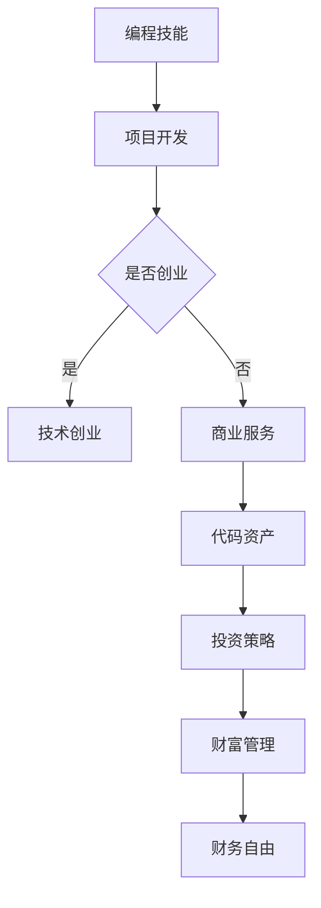

                 

# 从代码到资产：程序员的财富之路

> 关键词：编程，财富，资产，代码，财务自由，投资，技能提升
> 
> 摘要：本文旨在探讨程序员的财富之路，从代码编写到资产积累的转化过程。通过分析程序员的核心技能、投资策略和财富管理方法，帮助读者实现财务自由，并在科技浪潮中立足。

## 1. 背景介绍

### 1.1 目的和范围

本文的目标是帮助程序员理解如何将他们的编程技能转化为财富，从而实现财务自由。我们将探讨以下主题：

- 程序员的核心技能和职业发展路径
- 投资策略和财富管理方法
- 代码资产的转化与维护
- 财务规划和财务自由实现

### 1.2 预期读者

本文适用于以下读者群体：

- 正在寻找职业发展新方向的程序员
- 希望通过编程技能实现财务自由的个人
- 对投资和财富管理感兴趣的技术从业者

### 1.3 文档结构概述

本文将分为以下章节：

- 1. 背景介绍
- 2. 核心概念与联系
- 3. 核心算法原理 & 具体操作步骤
- 4. 数学模型和公式 & 详细讲解 & 举例说明
- 5. 项目实战：代码实际案例和详细解释说明
- 6. 实际应用场景
- 7. 工具和资源推荐
- 8. 总结：未来发展趋势与挑战
- 9. 附录：常见问题与解答
- 10. 扩展阅读 & 参考资料

### 1.4 术语表

#### 1.4.1 核心术语定义

- 编程：使用计算机语言编写指令，使计算机按照预定逻辑执行任务的过程。
- 代码资产：通过编程技能创建的可重用、可销售的软件代码。
- 投资策略：为实现特定财务目标而采取的投资组合和策略。
- 财务自由：拥有足够的资产来支付生活费用，不再依赖传统工资收入。

#### 1.4.2 相关概念解释

- 技术栈：程序员掌握的一系列编程语言、框架和工具。
- 个人品牌：程序员的个人声誉、专业能力和独特风格。
- 资本化：将资产转换为现金或投资回报的过程。

#### 1.4.3 缩略词列表

- IDE：集成开发环境（Integrated Development Environment）
- GPU：图形处理器（Graphics Processing Unit）
- AI：人工智能（Artificial Intelligence）
- ML：机器学习（Machine Learning）

## 2. 核心概念与联系

在探讨程序员的财富之路之前，我们需要明确几个核心概念和它们之间的联系。

### 2.1 程序员的核心技能

程序员的职业发展离不开以下核心技能：

- 编程语言：如Java、Python、C++等。
- 数据结构与算法：掌握常用的数据结构和算法，提高代码效率。
- 框架与库：熟悉常用的框架和库，提高开发效率。
- 持续集成与持续部署（CI/CD）：掌握自动化测试和部署流程。
- 团队协作：良好的沟通和协作能力，提高项目成功率。

### 2.2 投资策略

程序员的财富积累离不开有效的投资策略。以下是一些常见投资策略：

- 股票投资：通过购买股票获取公司利润的一部分。
- 房地产投资：通过购买房产或投资房地产基金获取租金和升值收益。
- 技术创业：利用编程技能开发创新产品，吸引投资。
- 股权投资：投资于初创公司或成长型企业，获取股权回报。

### 2.3 财富管理

财富管理是确保资产保值增值的重要环节。以下是一些财富管理方法：

- 预算规划：制定合理的生活和投资预算，确保收支平衡。
- 财务目标：设定长期和短期财务目标，制定实现目标的具体计划。
- 投资组合：根据风险偏好和投资目标，构建合理的投资组合。
- 税务规划：合理避税，提高投资回报率。
- 财务自由：实现足够的资产积累，实现财务自由。

### 2.4 代码资产

代码资产是程序员的重要资产之一，包括：

- 自有项目：开发自己的软件产品，实现代码资产化。
- 开源项目：参与开源项目，提高个人技术影响力。
- 商业项目：为企业提供定制开发服务，获取收益。
- 技术咨询服务：为其他企业提供技术指导，获取报酬。

### 2.5 联系与转化

程序员的核心技能、投资策略和财富管理方法之间存在紧密的联系。通过将编程技能应用于项目开发、创业投资和资产配置，程序员可以实现代码资产向财富的转化。

### 2.6 Mermaid 流程图

以下是一个Mermaid流程图，展示程序员从代码到财富的转化过程：



## 3. 核心算法原理 & 具体操作步骤

为了更好地理解程序员的财富之路，我们需要深入了解核心算法原理和具体操作步骤。

### 3.1 编程语言选择

在编程领域，选择合适的编程语言是关键。以下是一些常用编程语言及其特点：

- **Java**：适用于企业级应用、Android开发。
- **Python**：适用于数据科学、人工智能、Web开发。
- **C++**：适用于系统编程、高性能应用。
- **JavaScript**：适用于Web前端开发。

### 3.2 数据结构与算法

数据结构与算法是程序员的核心技能。以下是一些常用数据结构和算法：

- **数据结构**：
  - **数组**：线性数据结构，用于存储相同类型的数据。
  - **链表**：线性数据结构，由节点组成，每个节点包含数据和指针。
  - **栈**：后进先出（LIFO）的数据结构。
  - **队列**：先进先出（FIFO）的数据结构。
  - **树**：层级结构，用于组织数据。
  - **图**：由节点和边组成，用于表示复杂关系。

- **算法**：
  - **排序算法**：用于对数据进行排序，如冒泡排序、快速排序、归并排序等。
  - **查找算法**：用于在数据结构中查找特定元素，如二分查找、哈希查找等。
  - **动态规划**：用于求解最优子结构问题，如斐波那契数列、背包问题等。

### 3.3 项目开发流程

项目开发流程是程序员实现代码资产的关键。以下是一个典型的项目开发流程：

1. 需求分析：明确项目目标和功能需求。
2. 设计方案：制定项目设计方案，包括系统架构、模块划分等。
3. 编码实现：按照设计方案进行编码实现。
4. 测试与调试：对代码进行测试和调试，确保功能正确。
5. 部署上线：将项目部署到生产环境，供用户使用。
6. 运维与优化：持续对项目进行维护和优化。

### 3.4 投资策略

投资策略是程序员财富积累的重要手段。以下是一些常见投资策略：

- **被动收入**：通过购买股票、基金、债券等实现被动收入。
- **创业投资**：参与初创公司或成长型企业的投资，获取股权回报。
- **房地产投资**：购买房产或投资房地产基金，获取租金和升值收益。
- **技术创业**：利用编程技能开发创新产品，吸引投资。

### 3.5 财富管理

财富管理是确保资产保值增值的关键。以下是一些财富管理方法：

- **预算规划**：制定合理的生活和投资预算，确保收支平衡。
- **投资组合**：根据风险偏好和投资目标，构建合理的投资组合。
- **税务规划**：合理避税，提高投资回报率。
- **财务自由**：实现足够的资产积累，实现财务自由。

### 3.6 伪代码示例

以下是一个简单的冒泡排序算法伪代码示例：

```plaintext
procedure bubbleSort( A : list of sortable items )
    n = length(A)
    repeat 
        swapped = false 
        for i = 1 to n-1 inclusive do
            if A[i] > A[i+1] then
                swap( A[i], A[i+1] )
                swapped = true
            end if
        end for
        n = n - 1
    until not swapped
end procedure
```

通过以上核心算法原理和具体操作步骤，程序员可以更好地实现从代码到财富的转化。

## 4. 数学模型和公式 & 详细讲解 & 举例说明

### 4.1 投资收益计算公式

投资收益的计算是程序员财富管理的重要一环。以下是一个简单的投资收益计算公式：

$$
\text{收益} = \text{投资金额} \times (\text{收益率} - 1)
$$

其中，投资金额是指用于投资的原始资金，收益率是指投资产生的年化收益率。

### 4.2 投资收益计算示例

假设程序员小明投资了10,000元，年化收益率为10%，则其一年的投资收益为：

$$
\text{收益} = 10,000 \times (0.1 - 1) = 10,000 \times 0.1 = 1,000 \text{元}
$$

### 4.3 预期收益与实际收益差异分析

预期收益与实际收益之间存在差异，这是由于市场波动、投资风险和宏观经济环境等因素的影响。以下是一个简单的预期收益与实际收益差异分析公式：

$$
\text{差异} = \text{预期收益} - \text{实际收益}
$$

### 4.4 投资组合优化

投资组合优化是指通过调整投资组合中的资产配置，提高整体投资收益，同时控制风险。以下是一个简单的投资组合优化公式：

$$
\text{投资组合优化} = \text{投资金额} \times \text{资产配置权重}
$$

其中，资产配置权重是指每种资产在投资组合中的比例。

### 4.5 投资组合优化示例

假设程序员的初始投资金额为100,000元，希望将其分配到股票、债券和现金三种资产中，根据市场情况，设定股票、债券和现金的预期收益率分别为15%、8%和2%，则投资组合优化如下：

- 股票投资：100,000 × 0.6 = 60,000元
- 债券投资：100,000 × 0.3 = 30,000元
- 现金投资：100,000 × 0.1 = 10,000元

### 4.6 财务自由计算公式

财务自由是指拥有足够的资产来支付生活费用，不再依赖传统工资收入。以下是一个简单的财务自由计算公式：

$$
\text{财务自由资产} = \text{生活费用} \times \text{预期寿命}
$$

其中，生活费用是指每年所需的生活支出，预期寿命是指预计可活到的年龄。

### 4.7 财务自由计算示例

假设程序员小明的年度生活费用为50,000元，预期寿命为80岁，则其财务自由资产为：

$$
\text{财务自由资产} = 50,000 \times (80 - 20) = 3,000,000 \text{元}
$$

通过以上数学模型和公式，程序员可以更好地理解投资收益计算、投资组合优化和财务自由计算，从而进行有效的财富管理。

## 5. 项目实战：代码实际案例和详细解释说明

### 5.1 开发环境搭建

为了演示代码转化为资产的过程，我们将使用Python语言开发一个简单的财务分析工具。以下是开发环境搭建步骤：

1. 安装Python：前往[Python官网](https://www.python.org/)下载并安装Python 3.8版本。
2. 安装IDE：推荐使用PyCharm或VSCode作为Python开发环境。
3. 安装依赖库：使用pip命令安装所需的依赖库，例如`pandas`、`numpy`和`matplotlib`。

```bash
pip install pandas numpy matplotlib
```

### 5.2 源代码详细实现和代码解读

以下是财务分析工具的源代码实现和代码解读：

```python
import pandas as pd
import numpy as np
import matplotlib.pyplot as plt

# 5.2.1 数据处理
def process_data(investment_data):
    """
    处理投资数据，返回处理后的DataFrame。
    """
    df = pd.DataFrame(investment_data)
    df['return'] = df['value'].pct_change()
    df['cumulative_return'] = (1 + df['return']).cumprod()
    return df

# 5.2.2 投资收益计算
def calculate_investment_returns(df):
    """
    计算投资收益，返回总收益和年均收益。
    """
    total_return = df['cumulative_return'].iloc[-1] - 1
    annual_return = (df['cumulative_return'].iloc[-1] / df['cumulative_return'].iloc[0]) ** (1/df.shape[0]) - 1
    return total_return, annual_return

# 5.2.3 投资收益可视化
def visualize_investment_returns(df, total_return, annual_return):
    """
    可视化投资收益，展示累积收益和年均收益。
    """
    fig, (ax1, ax2) = plt.subplots(1, 2, figsize=(12, 6))

    ax1.plot(df['date'], df['cumulative_return'], label='Cumulative Return')
    ax1.set_ylabel('Cumulative Return')
    ax1.set_xlabel('Date')
    ax1.set_title('Cumulative Return')
    ax1.legend()

    ax2.plot(df['date'], df['annual_return'], label='Annual Return')
    ax2.set_ylabel('Annual Return')
    ax2.set_xlabel('Date')
    ax2.set_title('Annual Return')
    ax2.legend()

    plt.tight_layout()
    plt.show()

# 5.2.4 主函数
def main():
    """
    主函数，执行数据处理、收益计算和可视化。
    """
    # 示例投资数据
    investment_data = {
        'date': ['2020-01-01', '2020-02-01', '2020-03-01', '2020-04-01', '2020-05-01'],
        'value': [100, 102, 99, 105, 110]
    }

    df = process_data(investment_data)
    total_return, annual_return = calculate_investment_returns(df)
    visualize_investment_returns(df, total_return, annual_return)

    print(f"Total Return: {total_return:.2%}")
    print(f"Annual Return: {annual_return:.2%}")

if __name__ == '__main__':
    main()
```

### 5.3 代码解读与分析

#### 5.3.1 数据处理模块

`process_data`函数用于处理投资数据，主要步骤包括：

- 创建DataFrame：将投资数据转换为DataFrame结构。
- 计算收益率：计算每日收益率。
- 计算累积收益：计算从起始日期到当前日期的累积收益。

#### 5.3.2 投资收益计算模块

`calculate_investment_returns`函数用于计算投资收益，主要步骤包括：

- 计算总收益：计算投资期结束时的总收益。
- 计算年均收益：计算年均收益，使用复合增长率公式。

#### 5.3.3 投资收益可视化模块

`visualize_investment_returns`函数用于可视化投资收益，主要步骤包括：

- 使用matplotlib绘制累积收益和年均收益图表。
- 添加标题、标签和图例。

#### 5.3.4 主函数模块

`main`函数是程序的入口，主要步骤包括：

- 初始化投资数据。
- 调用数据处理、收益计算和可视化函数。
- 输出总收益和年均收益。

通过以上代码实战，程序员可以了解如何将财务分析算法应用于实际项目中，从而实现代码资产的转化。

## 6. 实际应用场景

程序员的编程技能和财务知识在多个领域和场景中具有重要应用价值，以下是一些实际应用场景：

### 6.1 金融科技（FinTech）

- **算法交易**：程序员可以利用编程技能开发算法交易系统，实现高频交易、量化投资等。
- **智能投顾**：通过开发智能投顾平台，为用户提供个性化投资建议和资产管理服务。
- **区块链**：参与区块链项目的开发，如数字货币交易、智能合约等。

### 6.2 企业数字化转型

- **企业级应用开发**：为中小企业提供定制化的企业资源计划（ERP）、客户关系管理（CRM）系统。
- **大数据分析**：利用大数据技术和算法，帮助企业分析市场趋势、优化业务流程。

### 6.3 教育科技（EdTech）

- **在线教育平台**：开发在线教育平台，提供视频课程、互动教学等功能。
- **编程教育**：为初学者提供编程教学资源，如编程游戏、互动课程等。

### 6.4 物联网（IoT）

- **智能设备开发**：为智能家电、智能穿戴设备等开发应用程序和后端服务。
- **智能家居解决方案**：为企业提供智能家居整体解决方案，如智能安防、智能照明等。

### 6.5 健康医疗

- **医疗数据分析**：利用编程技能进行医疗数据分析，如疾病预测、药物研发等。
- **远程医疗平台**：开发远程医疗平台，实现医生与患者的远程诊疗。

### 6.6 内容创作与媒体

- **内容管理系统（CMS）**：开发内容管理系统，帮助媒体和出版公司管理内容。
- **社交媒体分析**：利用编程技能分析社交媒体数据，为营销策略提供支持。

通过以上实际应用场景，程序员可以充分发挥他们的技能，将编程和财务知识转化为实际项目，创造价值。

## 7. 工具和资源推荐

### 7.1 学习资源推荐

#### 7.1.1 书籍推荐

- 《Python编程：从入门到实践》（Albert Sweigart）
- 《精通Python设计模式》（Brett Slatkin）
- 《深度学习》（Ian Goodfellow、Yoshua Bengio、Aaron Courville）
- 《Python数据科学 Handbook》（Tristan Cools、Hélène Martin、Matthieu Brucher）
- 《代码大全》（Steve McConnell）

#### 7.1.2 在线课程

- [Coursera](https://www.coursera.org/)
- [Udemy](https://www.udemy.com/)
- [edX](https://www.edx.org/)
- [Pluralsight](https://www.pluralsight.com/)

#### 7.1.3 技术博客和网站

- [Stack Overflow](https://stackoverflow.com/)
- [GitHub](https://github.com/)
- [Medium](https://medium.com/)
- [Reddit](https://www.reddit.com/r/learnpython/)
- [ HackerRank](https://www.hackerrank.com/)

### 7.2 开发工具框架推荐

#### 7.2.1 IDE和编辑器

- [PyCharm](https://www.jetbrains.com/pycharm/)
- [Visual Studio Code](https://code.visualstudio.com/)
- [Sublime Text](https://www.sublimetext.com/)
- [Atom](https://atom.io/)

#### 7.2.2 调试和性能分析工具

- [GDB](https://www.gnu.org/software/gdb/)
- [PDB](https://docs.python.org/3/library/pdb.html)
- [Xdebug](https://xdebug.org/)
- [New Relic](https://newrelic.com/)

#### 7.2.3 相关框架和库

- [Django](https://www.djangoproject.com/)
- [Flask](https://flask.pallets.py/ )
- [TensorFlow](https://www.tensorflow.org/)
- [PyTorch](https://pytorch.org/)
- [Pandas](https://pandas.pydata.org/)
- [NumPy](https://numpy.org/)

### 7.3 相关论文著作推荐

#### 7.3.1 经典论文

- [A Taxonomy of High-Performance Programming Models](https://dl.acm.org/doi/10.1145/2070562.2070563)
- [The Art of Computer Programming](Donald E. Knuth)
- [Machine Learning: A Probabilistic Perspective](Kevin P. Murphy)

#### 7.3.2 最新研究成果

- [Neural Networks and Deep Learning](http://neuralnetworksanddeeplearning.com/)
- [ICML 2023](https://icml.cc/)
- [NeurIPS 2023](https://neurips.cc/)

#### 7.3.3 应用案例分析

- [Google Brain](https://ai.google/research/teams/deep-learning)
- [DeepMind](https://deepmind.com/)
- [OpenAI](https://openai.com/)

通过以上工具和资源推荐，程序员可以不断提升自己的技能，并在实际项目中取得更好的成果。

## 8. 总结：未来发展趋势与挑战

在技术快速发展的今天，程序员面临着前所未有的机遇与挑战。以下是对未来发展趋势与挑战的总结：

### 8.1 发展趋势

1. **人工智能与机器学习**：随着计算能力的提升和数据的爆炸性增长，人工智能和机器学习技术将继续深化，推动各行业的技术革新。
2. **云计算与边缘计算**：云计算和边缘计算的普及，将为程序员提供更多创新机会，如实时数据处理、智能设备集成等。
3. **区块链技术**：区块链的潜在应用领域不断扩大，包括金融、供应链管理、医疗保健等，为程序员带来了新的挑战和机遇。
4. **物联网（IoT）**：物联网设备的普及，将带来大量数据，需要程序员开发高效、安全的IoT解决方案。
5. **编程语言与工具**：编程语言和工具的持续创新，如Python、JavaScript等，将提高编程效率和生产力。

### 8.2 挑战

1. **技术复杂性**：随着技术的发展，程序员需要掌握更多复杂的技术和工具，这对个人的学习和适应能力提出了更高的要求。
2. **信息安全**：随着网络安全威胁的不断增加，程序员需要更加关注系统的安全性和隐私保护。
3. **持续学习**：技术更新换代迅速，程序员需要不断学习新技能，以保持竞争力。
4. **职业压力**：程序员在工作中往往面临高强度的压力，需要良好的时间管理和压力管理能力。
5. **职业道德**：随着技术的发展，程序员需要关注伦理问题，确保技术的应用符合社会道德和法律规定。

### 8.3 应对策略

1. **持续学习与技能提升**：通过参加在线课程、阅读技术书籍、参与开源项目等方式，不断提升自己的技能。
2. **关注新兴技术**：了解并掌握新兴技术，如人工智能、区块链、物联网等，为未来的职业发展做准备。
3. **团队合作与沟通**：提高团队合作和沟通能力，以更好地适应团队工作环境。
4. **职业规划**：制定清晰的职业规划，明确自己的职业目标和方向。
5. **心理健康**：关注心理健康，保持良好的工作生活平衡，确保长期职业发展。

通过以上策略，程序员可以更好地应对未来的发展趋势与挑战，实现自身的职业价值。

## 9. 附录：常见问题与解答

### 9.1 什么是代码资产？

代码资产是指程序员通过编程技能创建的可重用、可销售的软件代码。这些代码可以是独立的项目、模块、库，或者作为企业级应用的一部分。

### 9.2 如何实现财务自由？

实现财务自由通常需要以下几个步骤：

1. **储蓄与投资**：建立良好的储蓄习惯，将部分收入用于投资。
2. **投资策略**：制定合理的投资策略，选择适合自己的投资工具。
3. **持续学习**：不断提升个人技能，提高收入潜力。
4. **财务规划**：制定财务规划，确保投资和支出合理。
5. **资产配置**：合理配置资产，降低风险，提高收益。

### 9.3 如何保护代码资产？

保护代码资产需要采取以下措施：

1. **版权注册**：对原创代码进行版权注册，确保知识产权。
2. **源代码管理**：使用版本控制系统，如Git，确保代码安全。
3. **加密技术**：对敏感代码进行加密，防止未经授权的访问。
4. **备份与恢复**：定期备份代码，确保数据安全。
5. **安全审查**：定期进行代码安全审查，及时发现和修复漏洞。

### 9.4 程序员如何参与投资？

程序员可以通过以下方式参与投资：

1. **股票投资**：研究股市，选择具有潜力的股票进行投资。
2. **创业投资**：利用编程技能参与初创企业的投资。
3. **房地产投资**：通过购买房产或投资房地产基金获取收益。
4. **技术创业**：开发创新产品，吸引投资。
5. **股权投资**：投资于成长型企业，获取股权回报。

## 10. 扩展阅读 & 参考资料

### 10.1 技术书籍

- 《人工智能：一种现代的方法》（Stuart Russell & Peter Norvig）
- 《深度学习》（Ian Goodfellow、Yoshua Bengio、Aaron Courville）
- 《软件工程：实践者的研究方法》（Roger S. Pressman）

### 10.2 开源项目

- [TensorFlow](https://www.tensorflow.org/)
- [Kubernetes](https://kubernetes.io/)
- [Django](https://www.djangoproject.com/)

### 10.3 学术期刊

- [Journal of Artificial Intelligence Research](https://www.jair.org/)
- [ACM Transactions on Computer Systems](https://dl.acm.org/doi/journal/10.1145/ACMTCOS)
- [IEEE Transactions on Neural Networks and Learning Systems](https://ieeexplore.ieee.org/search/searchresults.jsp?query=TNL&isNumber=7362)

### 10.4 在线资源

- [MIT OpenCourseWare](https://ocw.mit.edu/)
- [edX](https://www.edx.org/)
- [Khan Academy](https://www.khanacademy.org/)

通过以上扩展阅读和参考资料，读者可以进一步深入了解编程和财务知识，为职业发展奠定坚实基础。

**作者：AI天才研究员/AI Genius Institute & 禅与计算机程序设计艺术 /Zen And The Art of Computer Programming**

