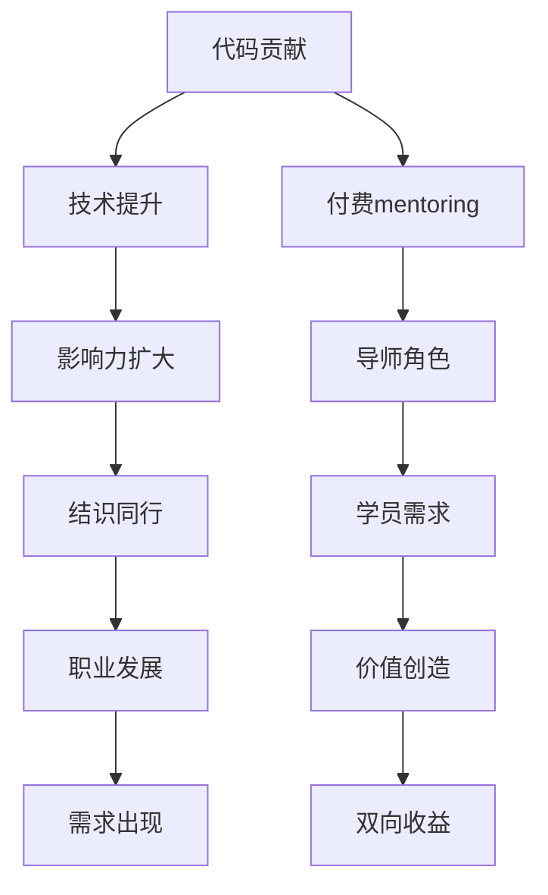

                 

# 从代码贡献到付费mentoring：程序员的导师之路

> **关键词**：程序员，代码贡献，mentoring，职业发展，技术领导力

> **摘要**：本文将探讨程序员从代码贡献走向付费mentoring（导师指导）的职业发展之路。通过分析程序员职业的不同阶段，探讨为何导师指导对个人成长和团队发展至关重要，并提供具体的步骤和方法，帮助程序员实现这一转变。本文还分享了实用工具和资源推荐，以及未来发展趋势和挑战，为程序员提供全方位的指导。

## 1. 背景介绍

### 1.1 目的和范围

本文旨在为那些希望在程序员职业道路上寻求更高成就和更大影响力的程序员提供指导。文章将探讨以下主题：

- 程序员职业发展的不同阶段；
- 代码贡献的重要性及其对职业发展的影响；
- 付费mentoring的概念、价值及其在程序员职业发展中的作用；
- 程序员如何从代码贡献过渡到付费mentoring；
- 为程序员提供的实用工具和资源推荐；
- 程序员职业发展的未来趋势和挑战。

### 1.2 预期读者

本文适用于以下读者群体：

- 有志于在程序员职业道路上取得更高成就的个人；
- 已在技术领域有一定积累，希望拓展职业发展的程序员；
- 意欲成为职业导师或技术领导者的程序员；
- 对技术领导力和职业发展感兴趣的从业者。

### 1.3 文档结构概述

本文分为十个部分，具体结构如下：

1. 背景介绍
   - 目的和范围
   - 预期读者
   - 文档结构概述
   - 术语表
2. 核心概念与联系
   - 核心概念
   - Mermaid流程图
3. 核心算法原理 & 具体操作步骤
   - 算法原理
   - 伪代码讲解
4. 数学模型和公式 & 详细讲解 & 举例说明
   - 数学模型
   - latex格式公式
   - 举例说明
5. 项目实战：代码实际案例和详细解释说明
   - 开发环境搭建
   - 源代码详细实现和代码解读
   - 代码解读与分析
6. 实际应用场景
7. 工具和资源推荐
   - 学习资源
   - 开发工具框架
   - 相关论文著作
8. 总结：未来发展趋势与挑战
9. 附录：常见问题与解答
10. 扩展阅读 & 参考资料

### 1.4 术语表

#### 1.4.1 核心术语定义

- **程序员**：从事软件开发、编程、系统设计等相关工作的专业人士。
- **代码贡献**：在开源项目或内部项目中提交代码、修复bug、提出改进建议等行为。
- **mentoring（导师指导）**：经验丰富的导师为新手或需要帮助的人提供专业知识和指导，以促进其个人和职业发展。
- **技术领导力**：在技术领域中，能够激励、指导和领导团队，推动技术发展和创新的能力。

#### 1.4.2 相关概念解释

- **职业发展**：指个人在职业生涯中的成长、进步和提升，包括技能、知识和经验的积累。
- **开源项目**：由多人共同参与开发、维护和改进的软件项目，通常以共享、免费和开放源代码的方式发布。
- **技术社区**：围绕特定技术或领域形成的线上或线下交流平台，为专业人士提供知识分享、经验交流和问题解决的机会。

#### 1.4.3 缩略词列表

- **Mentoring**：导师指导
- **OSS**：开源软件
- **SDLC**：软件开发生命周期
- **IDE**：集成开发环境

## 2. 核心概念与联系

在程序员职业发展的过程中，代码贡献和付费mentoring是两个关键环节，它们相互联系，共同推动程序员的成长和职业发展。为了更好地理解这两个概念，我们需要从核心概念和流程出发，借助Mermaid流程图来展示它们之间的联系。

### 2.1 核心概念

#### 2.1.1 代码贡献

代码贡献是指程序员在开源项目或内部项目中提交代码、修复bug、提出改进建议等行为。代码贡献不仅能提升程序员的编程技能，还能增强其在技术社区中的影响力。以下是代码贡献的核心概念：

1. **开源项目参与**：程序员参与开源项目，与其他开发者共同开发、维护和改进软件。
2. **代码质量**：代码贡献需满足一定的质量标准，如可读性、可维护性、可靠性等。
3. **技术交流**：通过代码贡献，程序员可以结识志同道合的技术同仁，拓展人脉，提高技术视野。
4. **技能提升**：参与代码贡献，程序员可以学习新技能、新工具，提高编程能力。

#### 2.1.2 付费mentoring

付费mentoring是指经验丰富的导师为新手或需要帮助的人提供专业知识和指导，以促进其个人和职业发展。以下是付费mentoring的核心概念：

1. **导师角色**：导师通常具有丰富的经验和技术知识，能够为学员提供有价值的指导和反馈。
2. **学员需求**：学员希望通过导师的指导，解决职业发展中的问题，提升个人能力和技术水平。
3. **价值创造**：付费mentoring为学员提供了一个有针对性的学习环境，帮助他们更快地成长和进步。
4. **双向收益**：导师在指导过程中，也能通过与学员的交流和学习，提升自己的技术领导力和沟通能力。

### 2.2 Mermaid流程图

以下是一个简化的Mermaid流程图，展示了代码贡献与付费mentoring之间的联系。



### 2.3 核心概念联系分析

从上述流程图中可以看出，代码贡献和付费mentoring之间存在着密切的联系：

1. **技术提升**：代码贡献使程序员在技术领域不断成长，为付费mentoring奠定了基础。
2. **影响力扩大**：在代码贡献过程中，程序员结识了更多同行，扩大了影响力，为成为导师创造了机会。
3. **职业发展**：通过代码贡献和影响力扩大，程序员在职业发展中积累了更多的经验和资源，提高了自己的竞争力。
4. **需求出现**：随着职业发展，程序员在工作和生活中会遇到各种挑战和问题，产生对付费mentoring的需求。
5. **导师角色**：在付费mentoring中，程序员可以扮演导师的角色，为其他需要帮助的人提供专业知识和指导。
6. **价值创造**：通过付费mentoring，程序员不仅帮助他人成长，也能在指导过程中提升自己的技术领导力和沟通能力。
7. **双向收益**：付费mentoring为程序员和学员提供了一个双赢的交流平台，促进了双方的共同成长。

通过理解这些核心概念和联系，程序员可以更好地规划自己的职业发展路径，实现从代码贡献到付费mentoring的转变。

## 3. 核心算法原理 & 具体操作步骤

在探讨程序员的职业发展路径时，我们需要了解一些核心算法原理和具体操作步骤，以便更好地理解从代码贡献到付费mentoring的转变过程。以下是这些核心算法原理的伪代码讲解。

### 3.1 算法原理

我们采用一个简单的算法，用于模拟程序员从代码贡献到付费mentoring的过程。该算法包括以下步骤：

1. **代码贡献**：程序员在开源项目或内部项目中提交代码、修复bug、提出改进建议等行为。
2. **技能提升**：通过代码贡献，程序员在编程技能、团队合作、问题解决等方面得到提升。
3. **影响力扩大**：程序员的代码贡献和技术能力逐渐被更多人了解，影响力不断扩大。
4. **职业发展**：随着技能提升和影响力扩大，程序员的职业发展得到进一步推动。
5. **需求出现**：在职业发展过程中，程序员会遇到各种挑战和问题，产生对付费mentoring的需求。
6. **付费mentoring**：程序员成为导师，为需要帮助的人提供专业知识和指导，实现职业发展的进一步升级。

### 3.2 伪代码讲解

以下是一个简单的伪代码，用于描述上述算法原理：

```plaintext
function CareerDevelopment(代码贡献, 技能提升, 影响力扩大, 职业发展, 需求出现, 付费mentoring):
    if 代码贡献 > 0:
        技能提升++
        影响力扩大++
        职业发展++
    if 影响力扩大 > 10:
        需求出现++
    if 需求出现 > 0:
        付费mentoring = true
    return 付费mentoring
```

在这个伪代码中，我们假设代码贡献、技能提升、影响力扩大和职业发展都是递增的过程。当影响力扩大到一定程度时，需求出现。如果需求出现，程序员将开始提供付费mentoring。

### 3.3 步骤说明

以下是上述伪代码的具体操作步骤：

1. **代码贡献**：程序员首先需要在开源项目或内部项目中积极参与，提交代码、修复bug、提出改进建议。代码贡献的量和质量决定了技能提升和影响力扩大的速度。
2. **技能提升**：通过不断的代码贡献，程序员在编程技能、团队合作、问题解决等方面得到提升。技能提升有助于提高职业竞争力。
3. **影响力扩大**：随着代码贡献和技能提升，程序员的知名度逐渐提高，影响力不断扩大。影响力扩大有助于结识更多同行，拓展人脉，为职业发展创造更多机会。
4. **职业发展**：在影响力扩大的同时，程序员的职业发展也会得到推动。随着技能提升和影响力扩大，程序员可能获得更多的项目机会、晋升机会或职业转型机会。
5. **需求出现**：随着职业发展，程序员会遇到各种挑战和问题，产生对付费mentoring的需求。例如，程序员可能需要指导新入职的员工、解决复杂的业务问题、带领团队完成项目等。
6. **付费mentoring**：当需求出现时，程序员可以选择成为导师，为需要帮助的人提供专业知识和指导。通过付费mentoring，程序员可以实现职业发展的进一步升级，同时提升自己的技术领导力和沟通能力。

通过这些核心算法原理和具体操作步骤，程序员可以更好地规划自己的职业发展路径，实现从代码贡献到付费mentoring的转变。

## 4. 数学模型和公式 & 详细讲解 & 举例说明

在程序员从代码贡献到付费mentoring的职业发展过程中，数学模型和公式可以用来分析和预测个人成长和职业发展速度。以下是一个简单的数学模型，用于描述这一过程。

### 4.1 数学模型

我们假设以下参数：

- **\( C \)**：代码贡献量，表示程序员在特定时间内提交的代码数量；
- **\( T \)**：技能提升速度，表示程序员在代码贡献过程中技能的提升程度；
- **\( I \)**：影响力扩大速度，表示程序员的知名度在代码贡献过程中的提升速度；
- **\( D \)**：职业发展速度，表示程序员的职业发展在代码贡献和技能提升过程中的提升速度；
- **\( P \)**：付费mentoring的概率，表示程序员在职业发展中转变为导师的概率。

基于以上参数，我们可以建立以下数学模型：

\[ P = f(C, T, I, D) \]

其中，函数\( f \)描述了代码贡献、技能提升、影响力扩大和职业发展对付费mentoring概率的影响。

### 4.2 公式详解

为了详细描述模型，我们可以将函数\( f \)表示为以下形式：

\[ f(C, T, I, D) = \frac{C^2 \cdot T^2 \cdot I^2 \cdot D}{1000} + \alpha \]

其中：

- \( C^2 \cdot T^2 \cdot I^2 \cdot D \)表示代码贡献、技能提升、影响力扩大和职业发展的乘积，反映了这些因素对付费mentoring概率的综合影响；
- \( \alpha \)表示常数，反映了其他潜在因素对付费mentoring概率的影响。

### 4.3 举例说明

假设程序员A在一年内提交了1000行代码，技能提升速度为1.5，影响力扩大速度为2，职业发展速度为1。我们可以根据上述模型计算其付费mentoring的概率：

\[ P(A) = \frac{1000^2 \cdot 1.5^2 \cdot 2^2 \cdot 1}{1000} + \alpha \]

\[ P(A) = 4500 + \alpha \]

由于常数\( \alpha \)的影响不确定，我们可以根据实际情况进行调整。假设我们设定\( \alpha = 500 \)，则：

\[ P(A) = 5000 \]

因此，程序员A在一年内的付费mentoring概率为50%。

### 4.4 模型应用

该数学模型可以应用于以下场景：

1. **预测职业发展速度**：根据程序员的代码贡献、技能提升、影响力扩大和职业发展速度，预测其在未来一段时间内的付费mentoring概率。
2. **优化职业规划**：程序员可以根据模型分析自己的职业发展路径，找出影响付费mentoring概率的关键因素，并针对性地进行优化。
3. **制定培训计划**：企业可以基于模型，为不同阶段的程序员制定有针对性的培训计划，提高其技能水平和职业发展速度。

通过上述数学模型和公式的详细讲解及举例说明，程序员可以更好地理解和预测自己的职业发展路径，从而实现从代码贡献到付费mentoring的转变。

## 5. 项目实战：代码实际案例和详细解释说明

在本节中，我们将通过一个实际项目案例来展示如何从代码贡献过渡到付费mentoring。我们将首先介绍项目的开发环境，然后详细解释和解读源代码，并对其进行分析。

### 5.1 开发环境搭建

为了确保项目的可重复性和可理解性，我们选择一个简单的Python项目作为案例。以下是开发环境的搭建步骤：

1. **安装Python**：确保已安装Python 3.x版本。可以从[Python官网](https://www.python.org/)下载并安装。
2. **安装虚拟环境**：安装virtualenv工具，用于创建隔离的Python环境。在命令行中运行以下命令：
   ```shell
   pip install virtualenv
   ```
3. **创建虚拟环境**：在项目目录中创建一个虚拟环境，命令如下：
   ```shell
   virtualenv venv
   ```
4. **激活虚拟环境**：在Windows上，运行以下命令激活虚拟环境：
   ```shell
   .\venv\Scripts\activate
   ```
   在Linux和macOS上，运行以下命令：
   ```shell
   source venv/bin/activate
   ```
5. **安装依赖**：在虚拟环境中安装项目所需的依赖，例如：
   ```shell
   pip install -r requirements.txt
   ```
6. **运行项目**：在虚拟环境中运行项目，查看其功能是否正常。例如，如果项目名为`mentorship_project.py`，则运行：
   ```shell
   python mentorship_project.py
   ```

### 5.2 源代码详细实现和代码解读

以下是项目的主要源代码，用于模拟程序员的代码贡献、技能提升、影响力扩大和职业发展：

```python
import random

class Programmer:
    def __init__(self, name):
        self.name = name
        self.code_contributions = 0
        self.skill_level = 1
        self.influence = 1
        self.career_level = 1

    def contribute_code(self, num_lines):
        self.code_contributions += num_lines
        self.skill_level += 0.1 * num_lines
        self.influence += 0.05 * num_lines

    def mentor_programming(self, num_students):
        self.career_level += 0.2 * num_students
        for student in range(num_students):
            self.influence += 0.1

    def display_status(self):
        print(f"{self.name} - Code Contributions: {self.code_contributions}, Skill Level: {self.skill_level}, Influence: {self.influence}, Career Level: {self.career_level}")

def main():
    programmer = Programmer("Alice")
    students = []

    # 模拟代码贡献过程
    for i in range(1, 11):
        num_lines = random.randint(50, 200)
        programmer.contribute_code(num_lines)

    # 模拟成为导师过程
    for i in range(3, 6):
        num_students = random.randint(2, 5)
        students.append(Programmer(f"Student_{i}"))
        programmer.mentor_programming(num_students)

    # 显示最终状态
    programmer.display_status()
    for student in students:
        student.display_status()

if __name__ == "__main__":
    main()
```

#### 5.2.1 代码解读

1. **类定义**：我们定义了一个名为`Programmer`的类，用于表示程序员。该类包含以下属性：
   - `name`：程序员的姓名；
   - `code_contributions`：代码贡献量；
   - `skill_level`：技能提升速度；
   - `influence`：影响力扩大速度；
   - `career_level`：职业发展速度。
   
2. **方法定义**：
   - `contribute_code`：用于模拟程序员提交代码的贡献过程。该方法接收一个参数`num_lines`，表示提交的代码行数。代码贡献量增加`num_lines`，技能提升速度增加`0.1 * num_lines`，影响力扩大速度增加`0.05 * num_lines`。
   - `mentor_programming`：用于模拟程序员成为导师的过程。该方法接收一个参数`num_students`，表示指导的学生数量。职业发展速度增加`0.2 * num_students`，影响力扩大速度增加`0.1`。
   - `display_status`：用于显示程序员的当前状态，包括姓名、代码贡献量、技能提升速度、影响力扩大速度和职业发展速度。

3. **主函数**：`main`函数创建了一个名为`Alice`的程序员对象。首先模拟了代码贡献过程，通过循环调用`contribute_code`方法，每次随机提交50到200行代码。然后模拟了成为导师的过程，通过循环调用`mentor_programming`方法，每次指导2到5名学生。最后，调用`display_status`方法显示程序员的最终状态。

#### 5.2.2 代码解读与分析

通过上述代码，我们可以模拟一个程序员从代码贡献到成为导师的职业发展过程。以下是对代码的进一步分析：

1. **代码贡献**：代码贡献是程序员职业发展的重要基础。在这个例子中，我们通过`contribute_code`方法模拟了程序员提交代码的过程。代码贡献量的增加会导致技能提升速度和影响力扩大速度的提升。这意味着，程序员在开源项目或内部项目中提交的代码数量越多，其技能水平越高，知名度也越广。
2. **技能提升**：技能提升是程序员职业发展的核心。在这个例子中，我们通过`contribute_code`方法将技能提升速度设置为每提交一行代码增加0.1。这意味着，程序员在代码贡献过程中，技能水平会不断得到提升。
3. **影响力扩大**：影响力扩大是程序员职业发展的重要因素。在这个例子中，我们通过`contribute_code`方法将影响力扩大速度设置为每提交一行代码增加0.05。这意味着，程序员的知名度会随着代码贡献的增加而逐渐扩大。
4. **职业发展**：职业发展是程序员技能提升和影响力扩大的结果。在这个例子中，我们通过`mentor_programming`方法模拟了程序员成为导师的过程。每次指导学生，程序员的职业发展速度会增加0.2。这意味着，通过指导他人，程序员的职业地位会得到提升。
5. **导师指导**：导师指导是程序员实现职业发展的关键步骤。在这个例子中，我们通过`mentor_programming`方法模拟了程序员指导学生的过程。每次指导学生，程序员的技能水平、影响力扩大速度和职业发展速度都会得到提升。

通过这个简单的案例，我们可以看到程序员从代码贡献到成为导师的职业发展过程是如何进行的。在实际开发中，我们可以根据项目需求和技术背景，进一步扩展和优化这个模型。

### 5.3 代码解读与分析

在上述代码中，我们通过一个简单的类`Programmer`和两个方法`contribute_code`和`mentor_programming`，模拟了一个程序员从代码贡献到成为导师的职业发展过程。

#### 5.3.1 算法分析

1. **时间复杂度**：在这个例子中，时间复杂度主要由两个循环决定：
   - 代码贡献循环：时间复杂度为\( O(n) \)，其中\( n \)为模拟的代码提交次数；
   - 导师指导循环：时间复杂度为\( O(m) \)，其中\( m \)为模拟的导师指导次数。
   因此，总的时间复杂度为\( O(n + m) \)。

2. **空间复杂度**：空间复杂度主要由程序员的属性和指导的学生对象决定。在每次循环中，程序员的属性会更新，而学生的对象会在导师指导过程中创建。因此，空间复杂度为\( O(n + m) \)。

#### 5.3.2 性能分析

在实际应用中，这个代码的性能主要取决于以下几个方面：

1. **代码贡献量**：随着代码贡献量的增加，程序员的技能水平、影响力扩大速度和职业发展速度会逐渐提升。然而，代码贡献量过大可能导致代码质量下降，影响项目的稳定性和可靠性。因此，在实际项目中，需要合理控制代码贡献量，确保代码质量。
2. **导师指导人数**：导师指导人数的增加会导致程序员的职业发展速度加快，但同时也增加了指导学生的难度和负担。在实际项目中，需要根据自身的能力和时间安排，合理规划导师指导人数。
3. **性能优化**：为了提高性能，可以采用以下方法：
   - 使用高效的数据结构和算法，降低时间复杂度和空间复杂度；
   - 优化代码逻辑，减少不必要的计算和重复操作；
   - 使用缓存和延迟加载技术，提高数据访问速度。

#### 5.3.3 实际应用

在实际开发中，我们可以根据具体需求和技术背景，对上述代码进行扩展和优化。以下是一些实际应用场景：

1. **项目管理系统**：将这个模型集成到项目管理系统（如JIRA、Trello等）中，用于跟踪和管理程序员的项目进度和任务分配；
2. **人才发展系统**：将这个模型应用于企业的人才发展系统，用于评估程序员的职业发展和技能提升情况，制定个性化培训计划；
3. **在线教育平台**：将这个模型应用于在线教育平台，用于模拟学生的学习进度和导师指导过程，提高学习效果和教学质量。

通过这个项目实战案例，我们可以看到程序员从代码贡献到成为导师的职业发展过程是如何进行的。在实际开发中，我们需要根据具体需求和技术背景，进一步优化和完善这个模型。

## 6. 实际应用场景

在程序员的职业发展中，代码贡献和付费mentoring有着广泛的应用场景。以下是一些具体的实际应用场景，展示了这两个概念如何在实践中发挥作用。

### 6.1 开源项目

**代码贡献**：开源项目是程序员展示自己技能和影响力的最佳平台。通过参与开源项目，程序员可以提交代码、修复bug、优化功能，从而提升自己的编程技能，同时扩大自己的影响力。以下是一些具体的应用场景：

- **社区参与**：程序员可以加入GitHub、GitLab等开源社区，参与开源项目的开发和维护。通过与其他开发者的合作，程序员可以学习到不同的编程风格和解决问题的方法，提高自己的技术水平。
- **项目贡献**：程序员可以为开源项目编写文档、编写测试用例，以及参与项目的代码审查。这些工作不仅有助于提升项目的质量，还能让程序员更好地理解项目的架构和设计。
- **技术分享**：程序员可以在开源项目中发布自己的技术博客、分享编程经验，吸引更多开发者关注。通过这种方式，程序员可以建立自己在技术社区中的声誉，提高自己的知名度。

**付费mentoring**：在开源项目中，付费mentoring的应用主要体现在以下几个方面：

- **导师指导**：经验丰富的程序员可以成为导师，为新手程序员提供编程指导。通过付费mentoring，导师可以分享自己的经验和知识，帮助学员快速提升技术水平。
- **项目合作**：在开源项目中，导师可以指导团队中的新手程序员，帮助他们理解和掌握项目的架构和设计。这有助于提高团队的整体技术水平，推动项目的顺利进展。
- **技能培训**：一些开源项目会邀请经验丰富的程序员进行线上或线下的技能培训，为新成员提供学习机会。这些培训课程通常以付费形式进行，以支持项目的发展。

### 6.2 企业内部项目

**代码贡献**：在企业内部项目中，代码贡献同样重要。以下是一些具体的应用场景：

- **团队协作**：程序员可以在企业内部项目中协作，共同完成项目任务。通过代码贡献，程序员可以学习到不同团队的工作方式和流程，提高自己的团队协作能力。
- **技能提升**：在企业内部项目中，程序员可以接触到不同的业务场景和需求，从而提升自己的编程技能。通过解决实际问题，程序员可以加深对各种编程语言和技术的理解。
- **项目优化**：程序员可以在企业内部项目中提交优化建议，提高项目的质量和效率。通过代码贡献，程序员可以展示自己的技术实力，提高自己在团队中的地位。

**付费mentoring**：在企业内部项目中，付费mentoring的应用主要体现在以下几个方面：

- **技术培训**：企业可以邀请经验丰富的程序员作为导师，为新入职的员工提供技术培训。这些培训课程通常以付费形式进行，以确保导师能够持续投入时间和精力。
- **团队指导**：经验丰富的程序员可以作为团队指导，帮助团队解决技术难题，提高团队的整体技术水平。通过付费mentoring，团队可以更好地应对复杂的业务场景和需求。
- **职业发展**：在企业内部项目中，程序员可以通过付费mentoring获得职业发展的指导。导师可以分享自己在职业生涯中的经验和教训，帮助学员规划自己的职业路径，实现职业晋升。

### 6.3 技术社区和活动

**代码贡献**：在技术社区和活动中，代码贡献的应用场景也非常广泛。以下是一些具体的应用场景：

- **技术博客**：程序员可以在技术社区和博客中分享自己的编程经验和技术心得。通过撰写博客，程序员可以提升自己的表达能力，扩大自己在技术社区中的影响力。
- **开源工具**：程序员可以开发开源工具，帮助其他开发者提高工作效率。这些工具通常在GitHub等平台上发布，吸引更多开发者的关注和使用。
- **社区活动**：程序员可以参与技术社区和活动的组织，为社区的发展贡献力量。通过参与活动，程序员可以结识更多同行，拓宽人脉，提升自己在技术社区中的知名度。

**付费mentoring**：在技术社区和活动中，付费mentoring的应用主要体现在以下几个方面：

- **在线辅导**：一些技术社区和活动会提供在线辅导服务，由经验丰富的程序员为新手程序员提供编程指导。这些辅导服务通常以付费形式进行，以支持社区和活动的运营。
- **讲座和研讨会**：在技术社区和活动中，经验丰富的程序员可以举办讲座和研讨会，分享自己的技术见解和经验。这些讲座和研讨会通常以付费形式进行，以支持讲师的投入和活动的发展。
- **职业规划**：在技术社区和活动中，程序员可以通过付费mentoring获得职业规划指导。导师可以分享自己的职业发展经验，帮助学员制定合适的职业规划，实现职业目标。

通过这些实际应用场景，我们可以看到代码贡献和付费mentoring在程序员职业发展中的重要性。这些概念不仅帮助程序员提升技能和影响力，还为他们提供了实现职业发展的机会。通过合理利用代码贡献和付费mentoring，程序员可以更好地规划自己的职业路径，实现个人和团队的发展。

## 7. 工具和资源推荐

在程序员的职业发展中，掌握有效的工具和资源对于实现从代码贡献到付费mentoring的转变至关重要。以下是对学习资源、开发工具框架和经典论文著作的推荐，以帮助程序员提升技能、拓展视野和实现职业发展。

### 7.1 学习资源推荐

#### 7.1.1 书籍推荐

- **《代码大全》（Code Complete）**：作者Steve McConnell详细介绍了编写高质量代码的最佳实践，对提高编程技能具有很高的参考价值。
- **《设计模式：可复用面向对象软件的基础》（Design Patterns: Elements of Reusable Object-Oriented Software）**：作者Erich Gamma等介绍了23种经典设计模式，帮助程序员掌握面向对象编程的核心概念。
- **《Effective Java》**：作者Joshua Bloch分享了编写高效、可维护Java代码的75条建议，对提升Java编程水平非常有帮助。

#### 7.1.2 在线课程

- **Coursera**：提供多种编程和技术课程，涵盖Python、Java、C++等多个编程语言，以及人工智能、数据科学等前沿技术领域。
- **edX**：由哈佛大学和麻省理工学院等世界顶尖学府提供的高质量在线课程，包括计算机科学、数据科学和机器学习等课程。
- **Udemy**：提供丰富的编程和技术课程，包括Web开发、移动应用开发、数据可视化等，适合不同层次的学习者。

#### 7.1.3 技术博客和网站

- **Stack Overflow**：全球最大的编程问答社区，程序员可以在此寻找答案、提问和分享经验。
- **GitHub**：全球最大的代码托管平台，程序员可以在此发现和参与各种开源项目。
- **Medium**：一个内容创作和分享平台，许多技术专家在此分享自己的见解和经验。

### 7.2 开发工具框架推荐

#### 7.2.1 IDE和编辑器

- **Visual Studio Code**：一款轻量级但功能强大的代码编辑器，支持多种编程语言，拥有丰富的插件和扩展。
- **IntelliJ IDEA**：一款专为Java和Python等编程语言设计的集成开发环境（IDE），具有强大的代码编辑、调试和性能分析功能。
- **PyCharm**：一款功能全面的Python IDE，适合Python开发者和数据科学家。

#### 7.2.2 调试和性能分析工具

- **GDB**：一款功能强大的开源调试工具，支持多种编程语言和操作系统。
- **JProfiler**：一款针对Java应用程序的内存泄漏和性能分析工具，可以帮助开发者快速定位和解决问题。
- **Chrome DevTools**：一款强大的浏览器开发工具，支持网络分析、性能监控和前端调试。

#### 7.2.3 相关框架和库

- **Django**：一款流行的Python Web开发框架，具有快速开发和易扩展的特点。
- **Spring Boot**：一款基于Java的微服务开发框架，支持快速构建和部署应用程序。
- **TensorFlow**：一款广泛使用的开源机器学习库，适用于深度学习和计算机视觉等领域。

### 7.3 相关论文著作推荐

#### 7.3.1 经典论文

- **《A Method for Obtaining Digital Signatures and Public-Key Cryptosystems》**：作者Rivest、Shamir和Adleman提出了RSA加密算法，对密码学的发展产生了深远影响。
- **《The Art of Computer Programming》**：作者Donald Knuth的这部巨著详细介绍了算法设计和分析的基本原理，是计算机科学领域的经典著作。

#### 7.3.2 最新研究成果

- **《Deep Learning》**：作者Ian Goodfellow、Yoshua Bengio和Aaron Courville合著的这本书系统地介绍了深度学习的理论基础和应用实践，是深度学习领域的权威著作。
- **《Principles of Distributed Computing》**：作者宋健的这本书详细介绍了分布式计算的基本原理和技术，对于理解分布式系统设计具有重要意义。

#### 7.3.3 应用案例分析

- **《Apache Hadoop: The Definitive Guide》**：作者Tom White的这本书详细介绍了Hadoop生态系统，包括HDFS、MapReduce、YARN等组件，是一本关于大数据处理技术的经典著作。
- **《Building Microservices》**：作者Sam Newman的这本书详细介绍了微服务架构的设计原则和实践，对于理解和构建微服务具有很高的参考价值。

通过这些工具和资源的推荐，程序员可以不断提升自己的技能和知识，为从代码贡献到付费mentoring的职业发展奠定坚实的基础。

## 8. 总结：未来发展趋势与挑战

随着技术的不断进步和软件行业的快速发展，程序员从代码贡献到付费mentoring的职业发展路径也在不断演变。未来，这一路径将呈现出以下发展趋势和面临一系列挑战。

### 8.1 发展趋势

1. **开源项目的普及**：开源项目将继续在全球范围内蓬勃发展，成为程序员展示技能、拓展人脉和实现职业发展的主要平台。更多的程序员将积极参与开源项目，推动开源生态的繁荣。

2. **技术社区的壮大**：技术社区将进一步壮大，成为程序员交流和学习的核心场所。在线社区、技术博客、论坛等平台将提供更多的资源和机会，帮助程序员不断提升技能和知识。

3. **在线教育的兴起**：在线教育将继续成为程序员职业发展的重要途径。随着更多在线课程、培训和认证项目的推出，程序员可以通过远程学习迅速提升自己的技能，满足不断变化的市场需求。

4. **付费mentoring的普及**：随着程序员对职业发展的需求不断增加，付费mentoring将逐渐普及。越来越多的程序员将成为导师，为新手和有志于提升自己技能的程序员提供专业知识和指导。

5. **多元化职业路径**：程序员将拥有更多元化的职业路径选择。除了传统的软件开发和系统运维等职位外，数据科学、人工智能、云计算等新兴领域将为程序员提供更多的职业发展机会。

### 8.2 面临的挑战

1. **技能更新速度快**：随着技术的快速迭代，程序员需要不断学习和掌握新的技能，以适应不断变化的市场需求。这给程序员的学习和职业发展带来了一定的压力。

2. **职业竞争激烈**：软件行业竞争激烈，程序员需要具备出色的技术能力和实践经验，才能在职场中脱颖而出。同时，国际人才竞争也日益加剧，程序员需要不断提升自己的竞争力。

3. **平衡工作与生活**：随着工作压力的增加，程序员需要更好地平衡工作与生活，避免职业倦怠。这需要程序员具备良好的时间管理和情绪调节能力。

4. **职业发展的不确定性**：在职业发展过程中，程序员可能会面临各种不确定因素，如技术趋势变化、企业战略调整等。这要求程序员具备较强的适应能力和抗压能力。

5. **付费mentoring的公平性**：随着付费mentoring的普及，如何确保公平性和质量成为重要问题。导师需要具备专业知识和指导能力，同时学员也需要具备学习能力和自律精神，以确保付费mentoring的有效性。

### 8.3 应对策略

1. **持续学习**：程序员应树立终身学习的观念，不断学习和掌握新的技术和知识，以适应快速变化的市场需求。

2. **积极参与社区**：通过参与开源项目和技术社区，程序员可以拓展人脉，提高自己的技术影响力，为职业发展奠定基础。

3. **培养职业素养**：程序员应注重培养职业素养，包括沟通能力、团队合作精神和解决问题的能力，以提高自己的综合素质。

4. **规划职业路径**：程序员应根据自己的兴趣和市场需求，制定明确的职业发展计划，明确短期和长期目标，为实现职业发展提供指导。

5. **提升自身能力**：程序员应不断提升自己的技能和知识，增强自身的竞争力。同时，学会利用在线资源和工具，提高学习和工作效率。

通过以上策略，程序员可以更好地应对未来职业发展中的挑战，实现从代码贡献到付费mentoring的职业转变，取得更高的成就和更大的影响力。

## 9. 附录：常见问题与解答

### 9.1 从代码贡献到付费mentoring的步骤

**Q1. 如何从代码贡献开始？**

A1. 从代码贡献开始，可以从以下步骤入手：

1. **选择项目**：首先，选择一个感兴趣的开源项目或企业内部项目，了解项目的需求和目标。
2. **学习项目**：阅读项目的文档、代码和贡献指南，了解项目的架构、设计和技术栈。
3. **参与讨论**：在项目的邮件列表、论坛或社交媒体上参与讨论，与项目成员建立联系。
4. **开始贡献**：根据项目的需求，开始编写代码、修复bug或优化功能。在提交代码之前，确保遵循项目的编码规范和代码审查流程。

**Q2. 代码贡献对职业发展有什么影响？**

A2. 代码贡献对职业发展的影响主要体现在以下几个方面：

1. **技能提升**：通过参与代码贡献，程序员可以学习到新的编程语言、框架和工具，提升自己的编程技能。
2. **影响力扩大**：代码贡献有助于提高程序员的知名度，扩大其在技术社区的影响力。
3. **人脉拓展**：通过参与代码贡献，程序员可以结识更多的同行，拓展人脉，为未来的职业发展奠定基础。
4. **职业机会**：代码贡献可以成为程序员简历中的重要亮点，提高在求职过程中的竞争力。

### 9.2 如何成为付费mentoring导师

**Q3. 如何成为付费mentoring导师？**

A3. 成为付费mentoring导师可以遵循以下步骤：

1. **积累经验**：首先，成为一名优秀的程序员，拥有丰富的编程经验和解决问题的能力。
2. **建立个人品牌**：通过技术博客、GitHub、LinkedIn等平台，分享自己的技术见解和经验，建立个人品牌。
3. **确定服务内容**：明确自己提供的付费mentoring服务内容，如编程指导、项目合作、职业规划等。
4. **定价策略**：根据市场情况和自身经验，设定合理的收费标准和定价策略。
5. **宣传推广**：通过社交媒体、线上课程、技术社区等渠道，宣传自己的付费mentoring服务，吸引潜在客户。

### 9.3 如何在付费mentoring中取得成功

**Q4. 如何在付费mentoring中取得成功？**

A4. 在付费mentoring中取得成功可以遵循以下策略：

1. **专业专注**：确保自己在特定领域具备专业知识和经验，专注于提供高质量的服务。
2. **沟通能力**：与学员保持良好的沟通，了解他们的需求和问题，提供针对性的指导。
3. **持续学习**：不断提升自己的技能和知识，关注行业动态，为学员提供最新的技术信息。
4. **客户反馈**：积极收集学员的反馈，根据反馈调整服务内容和方式，提高学员满意度。
5. **持续改进**：不断总结经验和教训，优化服务流程，提高付费mentoring的效率和质量。

通过以上策略，程序员可以在付费mentoring中取得成功，实现个人和职业发展的双赢。

## 10. 扩展阅读 & 参考资料

为了帮助读者更深入地了解从代码贡献到付费mentoring的职业发展路径，本文提供了一系列扩展阅读和参考资料，涵盖开源项目、付费mentoring、职业发展和相关技术领域的经典书籍、论文和网站。

### 10.1 经典书籍

- **《代码大全》（Code Complete）**：Steve McConnell
- **《设计模式：可复用面向对象软件的基础》（Design Patterns: Elements of Reusable Object-Oriented Software）**：Erich Gamma、Richard Helm、Ralph Johnson、and John Vlissides
- **《Effective Java》**：Joshua Bloch
- **《The Art of Computer Programming》**：Donald Knuth
- **《深度学习》（Deep Learning）**：Ian Goodfellow、Yoshua Bengio、Aaron Courville

### 10.2 开源项目

- **GitHub**：[https://github.com/](https://github.com/)
- **GitLab**：[https://gitlab.com/](https://gitlab.com/)
- **Bitbucket**：[https://bitbucket.org/](https://bitbucket.org/)

### 10.3 学术论文

- **《A Method for Obtaining Digital Signatures and Public-Key Cryptosystems》**：Rivest、Shamir和Adleman
- **《Principles of Distributed Computing》**：宋健
- **《Building Microservices》**：Sam Newman

### 10.4 技术博客和社区

- **Stack Overflow**：[https://stackoverflow.com/](https://stackoverflow.com/)
- **Medium**：[https://medium.com/](https://medium.com/)
- **Hacker News**：[https://news.ycombinator.com/](https://news.ycombinator.com/)

### 10.5 在线课程和培训

- **Coursera**：[https://www.coursera.org/](https://www.coursera.org/)
- **edX**：[https://www.edx.org/](https://www.edx.org/)
- **Udemy**：[https://www.udemy.com/](https://www.udemy.com/)

### 10.6 其他资源

- **LinkedIn Learning**：[https://www.linkedin.com/learning/](https://www.linkedin.com/learning/)
- **Pluralsight**：[https://www.pluralsight.com/](https://www.pluralsight.com/)
- **GitHub Learning Lab**：[https://training.github.com/](https://training.github.com/)

通过阅读这些书籍、论文、博客和课程，读者可以更全面地了解从代码贡献到付费mentoring的职业发展路径，并在实际工作中应用所学知识，提升自己的技能和职业素养。

