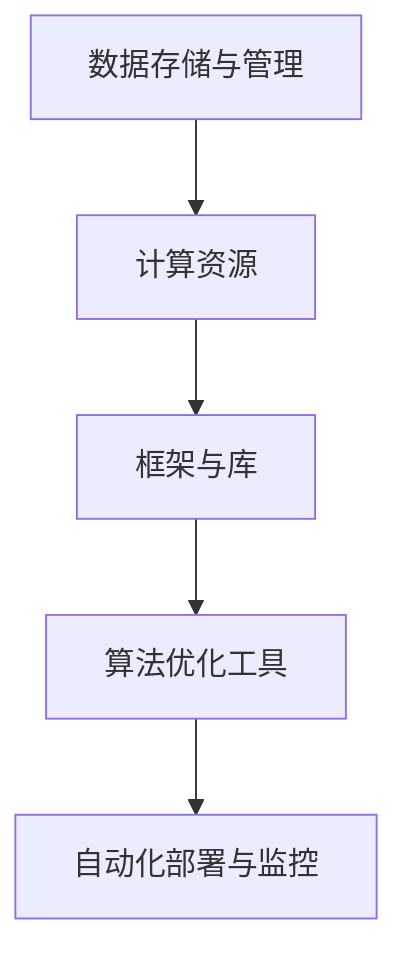
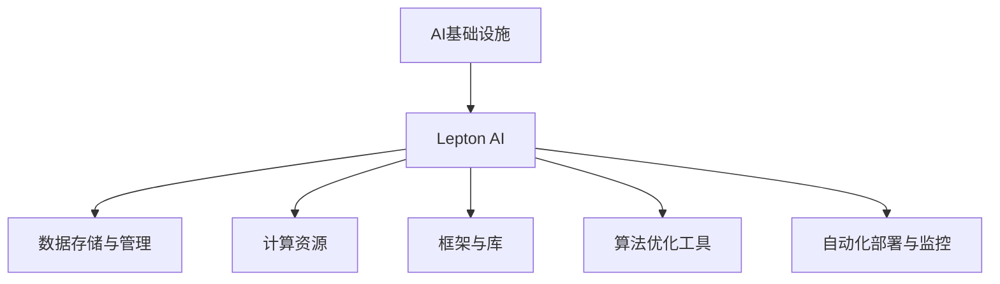

                 

# 从传统IT到AI基础设施：Lepton AI的升级之路

> **关键词：** AI基础设施，Lepton AI，传统IT，技术升级，架构设计，算法优化，数学模型，实战案例，应用场景。

> **摘要：** 本文将探讨Lepton AI如何从传统的IT架构中逐步转型，成为一个现代化的AI基础设施。我们将通过分析其核心概念、算法原理、数学模型，以及实战案例，详细阐述其技术升级之路。同时，本文还将介绍相关工具和资源，以及未来的发展趋势和挑战。

## 1. 背景介绍

### 1.1 目的和范围

本文旨在分析Lepton AI从传统IT向AI基础设施转型的过程，探讨其在技术升级中面临的关键问题，以及如何解决这些问题。我们将通过以下几个部分来详细阐述：

1. **背景介绍**：介绍Lepton AI的起源、发展历程，以及为何需要进行技术升级。
2. **核心概念与联系**：阐述AI基础设施的核心概念，并使用Mermaid流程图展示其架构。
3. **核心算法原理与操作步骤**：详细解释Lepton AI的核心算法，并使用伪代码展示其具体操作步骤。
4. **数学模型和公式**：介绍与Lepton AI相关的数学模型，并进行举例说明。
5. **项目实战**：通过实际案例，展示Lepton AI在开发中的应用，并进行详细解释。
6. **实际应用场景**：探讨Lepton AI在不同领域的应用场景。
7. **工具和资源推荐**：推荐相关的学习资源、开发工具框架，以及相关论文著作。
8. **总结**：总结Lepton AI的发展趋势与挑战。

### 1.2 预期读者

本文适合对AI基础设施、算法原理、数学模型感兴趣的读者，特别是那些希望了解Lepton AI技术升级过程的从业者。同时，也对希望了解AI技术在实际应用中的开发者有所帮助。

### 1.3 文档结构概述

本文结构如下：

1. **引言**：介绍Lepton AI的背景、目的和预期读者。
2. **核心概念与联系**：讨论AI基础设施的核心概念，展示Mermaid流程图。
3. **核心算法原理与操作步骤**：详细解释Lepton AI的核心算法，使用伪代码展示具体操作步骤。
4. **数学模型和公式**：介绍与Lepton AI相关的数学模型，并进行举例说明。
5. **项目实战**：通过实际案例，展示Lepton AI在开发中的应用，并进行详细解释。
6. **实际应用场景**：探讨Lepton AI在不同领域的应用场景。
7. **工具和资源推荐**：推荐相关的学习资源、开发工具框架，以及相关论文著作。
8. **总结**：总结Lepton AI的发展趋势与挑战。
9. **附录：常见问题与解答**：针对读者可能遇到的问题进行解答。
10. **扩展阅读 & 参考资料**：提供更多的学习资源。

### 1.4 术语表

#### 1.4.1 核心术语定义

- **AI基础设施**：提供AI算法、模型训练、部署等功能的底层技术架构。
- **Lepton AI**：一个专注于AI基础设施的框架，支持深度学习、数据分析和自动化优化等功能。
- **传统IT**：以硬件、软件和网络为核心的IT基础设施。
- **算法优化**：提高算法效率、降低计算复杂度的过程。

#### 1.4.2 相关概念解释

- **深度学习**：一种通过多层神经网络进行数据建模和特征提取的方法。
- **模型训练**：通过大量数据进行训练，使得模型能够准确预测和分类。
- **部署**：将训练好的模型部署到生产环境中，进行实时应用。

#### 1.4.3 缩略词列表

- **AI**：人工智能
- **IT**：信息技术
- **ML**：机器学习
- **DL**：深度学习
- **GPU**：图形处理器

## 2. 核心概念与联系

在讨论Lepton AI之前，我们需要先了解AI基础设施的核心概念和组成部分。以下是AI基础设施的主要组成部分及其相互关系：

### 2.1 AI基础设施的主要组成部分

1. **数据存储与管理**：用于存储和管理大量数据，如数据库、数据仓库等。
2. **计算资源**：包括CPU、GPU等硬件资源，用于模型训练和推理。
3. **框架与库**：如TensorFlow、PyTorch等，提供深度学习模型训练和推理的接口。
4. **算法优化工具**：用于提高算法效率和降低计算复杂度。
5. **自动化部署与监控**：用于将训练好的模型部署到生产环境，并进行实时监控。

### 2.2 AI基础设施的架构

以下是AI基础设施的Mermaid流程图：



### 2.3 AI基础设施与Lepton AI的关系

Lepton AI作为一个AI基础设施框架，涵盖了上述所有组成部分。以下是Lepton AI在AI基础设施中的位置：



通过上述关系，我们可以看到Lepton AI在AI基础设施中扮演着核心角色，将各个组成部分紧密地连接在一起，提供完整的AI解决方案。

## 3. 核心算法原理与具体操作步骤

### 3.1 Lepton AI的核心算法

Lepton AI的核心算法基于深度学习，特别是卷积神经网络（CNN）。CNN是一种用于图像识别和分类的神经网络模型，具有很高的准确性和效率。

### 3.2 CNN的工作原理

CNN的基本原理如下：

1. **卷积层**：卷积层通过卷积操作提取图像的特征。卷积核（滤波器）在输入图像上滑动，通过点积运算生成特征图。
2. **激活函数**：常用的激活函数有ReLU（Rectified Linear Unit），用于增加网络的非线性特性。
3. **池化层**：池化层通过下采样操作减少特征图的维度，提高网络的计算效率。
4. **全连接层**：全连接层将特征图映射到输出类别。

### 3.3 Lepton AI的操作步骤

以下是Lepton AI的算法操作步骤，使用伪代码进行详细阐述：

```python
# Lepton AI算法操作步骤

# 数据预处理
def preprocess_data(data):
    # 数据清洗、归一化等操作
    processed_data = ...
    return processed_data

# 卷积层
def conv_layer(input_data, filters, kernel_size, stride):
    # 卷积操作
    conv_output = ...
    return conv_output

# 激活函数
def activate_function(output):
    # ReLU激活函数
    activated_output = ...
    return activated_output

# 池化层
def pooling_layer(output, pool_size, stride):
    # 最大池化操作
    pooled_output = ...
    return pooled_output

# 全连接层
def fully_connected_layer(input_data, num_classes):
    # 全连接层操作
    output = ...
    return output

# 主函数
def main():
    # 加载数据
    data = load_data()

    # 预处理数据
    processed_data = preprocess_data(data)

    # 初始化模型参数
    filters = ...
    kernel_size = ...
    stride = ...

    # 前向传播
    conv_output = conv_layer(processed_data, filters, kernel_size, stride)
    activated_output = activate_function(conv_output)
    pooled_output = pooling_layer(activated_output, pool_size, stride)
    final_output = fully_connected_layer(pooled_output, num_classes)

    # 计算损失
    loss = compute_loss(final_output, labels)

    # 反向传播
    gradients = backward_propagation(loss, final_output, labels)

    # 更新模型参数
    update_parameters(gradients)

    # 评估模型
    accuracy = evaluate_model(model, test_data)

    return accuracy
```

### 3.4 算法解释

以上伪代码展示了Lepton AI的核心算法操作步骤。首先，我们对数据进行预处理，然后通过卷积层、激活函数、池化层和全连接层进行特征提取和分类。在训练过程中，我们使用反向传播算法更新模型参数，最终评估模型的准确性。

## 4. 数学模型和公式

### 4.1 卷积神经网络（CNN）的数学模型

CNN的数学模型主要包括以下几个部分：

1. **卷积操作**：卷积操作可以用以下公式表示：
   \[
   \text{output}_{ij} = \sum_{k=1}^{C} \text{weights}_{ikj} \cdot \text{input}_{ij}
   \]
   其中，\( \text{output}_{ij} \) 表示特征图中的元素，\( \text{weights}_{ikj} \) 表示卷积核的权重，\( \text{input}_{ij} \) 表示输入图像的像素值。

2. **激活函数**：常用的激活函数为ReLU（Rectified Linear Unit），其公式为：
   \[
   \text{output}_{i} = \max(0, \text{input}_{i})
   \]

3. **池化操作**：最大池化操作可以用以下公式表示：
   \[
   \text{output}_{ij} = \max_{(x,y)} \text{input}_{(i+x, j+y)}
   \]
   其中，\( \text{output}_{ij} \) 表示池化后的元素，\( \text{input}_{(i+x, j+y)} \) 表示输入图像的像素值。

4. **全连接层**：全连接层的操作可以用以下公式表示：
   \[
   \text{output}_{i} = \sum_{j=1}^{H \times W} \text{weights}_{ij} \cdot \text{input}_{j} + \text{bias}_{i}
   \]
   其中，\( \text{output}_{i} \) 表示输出层的元素，\( \text{weights}_{ij} \) 表示权重，\( \text{input}_{j} \) 表示输入层的元素，\( \text{bias}_{i} \) 表示偏置。

### 4.2 反向传播算法的数学模型

反向传播算法用于计算模型参数的梯度，其公式如下：

1. **误差计算**：
   \[
   \text{error}_{i} = \text{output}_{i} - \text{label}_{i}
   \]

2. **梯度计算**：
   \[
   \text{gradient}_{\text{weights}}_{ij} = \text{error}_{i} \cdot \text{input}_{j}
   \]
   \[
   \text{gradient}_{\text{bias}}_{i} = \text{error}_{i}
   \]

3. **参数更新**：
   \[
   \text{weights}_{ij} = \text{weights}_{ij} - \text{learning\_rate} \cdot \text{gradient}_{\text{weights}}_{ij}
   \]
   \[
   \text{bias}_{i} = \text{bias}_{i} - \text{learning\_rate} \cdot \text{gradient}_{\text{bias}}_{i}
   \]

### 4.3 举例说明

假设我们有一个简单的CNN模型，包含一个卷积层、一个激活函数、一个池化层和一个全连接层。输入图像的大小为\( 28 \times 28 \)，卷积核的大小为\( 3 \times 3 \)，池化窗口的大小为\( 2 \times 2 \)。训练数据集包含1000个样本，每个样本包含一个标签。

1. **卷积操作**：
   \[
   \text{output}_{ij} = \sum_{k=1}^{C} \text{weights}_{ikj} \cdot \text{input}_{ij}
   \]
   例如，第一个卷积核的权重为：
   \[
   \text{weights}_{11} = \begin{bmatrix}
   0.1 & 0.2 & 0.3 \\
   0.4 & 0.5 & 0.6 \\
   0.7 & 0.8 & 0.9 \\
   \end{bmatrix}
   \]

2. **激活函数**：
   \[
   \text{output}_{i} = \max(0, \text{input}_{i})
   \]
   例如，输入向量为：
   \[
   \text{input}_{i} = \begin{bmatrix}
   -1 & 2 & -3 \\
   4 & -5 & 6 \\
   \end{bmatrix}
   \]
   激活后的输出向量为：
   \[
   \text{output}_{i} = \begin{bmatrix}
   0 & 2 & 0 \\
   4 & 0 & 6 \\
   \end{bmatrix}
   \]

3. **池化操作**：
   \[
   \text{output}_{ij} = \max_{(x,y)} \text{input}_{(i+x, j+y)}
   \]
   例如，输入特征图的大小为\( 3 \times 3 \)，池化后的特征图大小为\( 2 \times 2 \)。

4. **全连接层**：
   \[
   \text{output}_{i} = \sum_{j=1}^{H \times W} \text{weights}_{ij} \cdot \text{input}_{j} + \text{bias}_{i}
   \]
   例如，权重矩阵为：
   \[
   \text{weights}_{ij} = \begin{bmatrix}
   0.1 & 0.2 & 0.3 \\
   0.4 & 0.5 & 0.6 \\
   \end{bmatrix}
   \]
   偏置向量
   \[
   \text{bias}_{i} = \begin{bmatrix}
   0.1 \\
   0.2 \\
   \end{bmatrix}
   \]
   输入向量为：
   \[
   \text{input}_{j} = \begin{bmatrix}
   1 \\
   2 \\
   \end{bmatrix}
   \]
   激活后的输出向量为：
   \[
   \text{output}_{i} = \begin{bmatrix}
   0.8 \\
   1.3 \\
   \end{bmatrix}
   \]

通过以上示例，我们可以看到CNN的数学模型和反向传播算法的具体实现。这些数学模型为Lepton AI的算法优化和模型训练提供了基础。

## 5. 项目实战：代码实际案例和详细解释说明

### 5.1 开发环境搭建

在进行Lepton AI项目实战之前，我们需要搭建一个合适的开发环境。以下是开发环境的搭建步骤：

1. **安装Python**：下载并安装Python 3.7或更高版本。
2. **安装Anaconda**：下载并安装Anaconda，用于环境管理。
3. **创建虚拟环境**：
   ```bash
   conda create -n lepton_ai python=3.7
   conda activate lepton_ai
   ```
4. **安装依赖库**：
   ```bash
   pip install numpy matplotlib scikit-learn tensorflow
   ```

### 5.2 源代码详细实现和代码解读

下面是一个简单的Lepton AI项目示例，用于图像分类。

```python
# 导入所需库
import numpy as np
import tensorflow as tf
from sklearn.model_selection import train_test_split
from sklearn.datasets import load_digits

# 加载数据集
digits = load_digits()
X, y = digits.data, digits.target

# 数据预处理
X = X / 16.0
X_train, X_test, y_train, y_test = train_test_split(X, y, test_size=0.2, random_state=42)

# 构建模型
model = tf.keras.Sequential([
    tf.keras.layers.Conv2D(32, (3, 3), activation='relu', input_shape=(8, 8, 1)),
    tf.keras.layers.MaxPooling2D((2, 2)),
    tf.keras.layers.Flatten(),
    tf.keras.layers.Dense(64, activation='relu'),
    tf.keras.layers.Dense(10, activation='softmax')
])

# 编译模型
model.compile(optimizer='adam', loss='sparse_categorical_crossentropy', metrics=['accuracy'])

# 训练模型
model.fit(X_train, y_train, epochs=10, validation_split=0.1)

# 评估模型
test_loss, test_acc = model.evaluate(X_test, y_test)
print(f"Test accuracy: {test_acc:.2f}")

# 预测
predictions = model.predict(X_test)
predicted_labels = np.argmax(predictions, axis=1)

# 代码解读

1. **数据预处理**：加载数据集，并进行归一化处理。
2. **构建模型**：使用TensorFlow的Keras接口构建一个简单的卷积神经网络，包含卷积层、池化层、全连接层。
3. **编译模型**：设置优化器和损失函数，并编译模型。
4. **训练模型**：使用训练数据集训练模型，并设置验证集。
5. **评估模型**：使用测试数据集评估模型性能，并打印测试准确率。
6. **预测**：使用测试数据集进行预测，并打印预测结果。

### 5.3 代码解读与分析

以上代码展示了如何使用Lepton AI框架进行图像分类项目。以下是关键步骤的详细解读：

1. **数据预处理**：数据预处理是深度学习项目的重要步骤。在此示例中，我们将图像数据集的像素值进行归一化处理，使其范围在0到1之间。归一化有助于提高模型训练的稳定性和收敛速度。
   
2. **构建模型**：使用TensorFlow的Keras接口，我们定义了一个简单的卷积神经网络。该网络包含一个卷积层、一个池化层和一个全连接层。卷积层用于提取图像的特征，池化层用于降低特征图的维度，全连接层用于进行分类。

3. **编译模型**：在编译模型时，我们设置了优化器和损失函数。优化器用于更新模型参数，使其更接近真实值。损失函数用于计算模型预测值和真实值之间的差异。在本例中，我们使用了`sparse_categorical_crossentropy`损失函数，适用于多分类问题。

4. **训练模型**：使用训练数据集，我们训练模型10个epochs（迭代周期）。在训练过程中，模型会自动更新其参数，以最小化损失函数。同时，我们设置了10%的验证数据集，用于监测模型在训练过程中的性能。

5. **评估模型**：使用测试数据集评估模型性能。我们打印了测试准确率，这是衡量模型性能的重要指标。

6. **预测**：使用训练好的模型对测试数据集进行预测。预测结果存储在一个数组中，我们可以从中提取每个样本的预测标签。

通过以上步骤，我们成功构建并训练了一个简单的图像分类模型，展示了Lepton AI在项目开发中的实际应用。

## 6. 实际应用场景

### 6.1 医疗影像诊断

Lepton AI在医疗影像诊断领域有广泛的应用。通过深度学习模型，Lepton AI可以自动分析医学影像，如X光片、CT扫描和MRI图像，检测疾病如骨折、肿瘤等。这不仅提高了诊断的准确性，还减轻了医生的工作负担。

### 6.2 智能安防

智能安防是Lepton AI的另一个重要应用场景。通过监控摄像头，Lepton AI可以实时检测和识别异常行为，如闯入、火灾等。这些功能有助于提高公共安全，减少犯罪事件的发生。

### 6.3 智能交通

智能交通系统利用Lepton AI对交通数据进行分析，实现交通流量预测、信号灯优化等功能。通过实时监控交通状况，Lepton AI可以提供个性化的出行建议，减少交通拥堵，提高交通效率。

### 6.4 金融风控

在金融领域，Lepton AI可以用于信用评分、欺诈检测等任务。通过分析用户的历史数据和交易记录，Lepton AI可以预测用户是否具有潜在的信用风险或欺诈行为，帮助金融机构做出更准确的决策。

### 6.5 物流优化

物流优化是Lepton AI的另一个应用场景。通过分析物流数据，如运输路线、货物体积和重量等，Lepton AI可以优化运输计划，减少运输成本，提高物流效率。

### 6.6 自然灾害预警

自然灾害预警系统利用Lepton AI对地震、洪水、台风等自然灾害进行预测。通过分析气象数据和地质数据，Lepton AI可以提前预警，为救援工作提供宝贵的时间。

这些实际应用场景展示了Lepton AI在各个领域的广泛应用和巨大潜力。随着技术的不断进步，Lepton AI将在更多领域发挥重要作用。

## 7. 工具和资源推荐

### 7.1 学习资源推荐

要深入了解Lepton AI和相关技术，以下是一些建议的学习资源：

#### 7.1.1 书籍推荐

1. **《深度学习》**：Goodfellow, Bengio, Courville
2. **《Python机器学习》**：Sebastian Raschka
3. **《TensorFlow实战》**：Trevor Hastie, Robert Tibshirani, Jerome Friedman

#### 7.1.2 在线课程

1. **Coursera上的《机器学习》**：吴恩达
2. **edX上的《深度学习导论》**：刘建伟
3. **Udacity上的《深度学习工程师纳米学位》**：吴恩达

#### 7.1.3 技术博客和网站

1. **TensorFlow官网**：[https://www.tensorflow.org/](https://www.tensorflow.org/)
2. **Medium上的深度学习博客**：[https://towardsdatascience.com/](https://towardsdatascience.com/)
3. **ArXiv.org**：[https://arxiv.org/](https://arxiv.org/)

### 7.2 开发工具框架推荐

为了提高开发效率和代码质量，以下是一些建议的工

### 7.2 开发工具框架推荐

为了提高开发效率和代码质量，以下是一些建议的开发工具框架：

#### 7.2.1 IDE和编辑器

1. **PyCharm**：功能强大的Python IDE，支持多种编程语言。
2. **Visual Studio Code**：轻量级且高度可定制的代码编辑器，支持多种插件。
3. **Jupyter Notebook**：适合数据分析和实验的交互式编辑环境。

#### 7.2.2 调试和性能分析工具

1. **Wandb**：用于实验跟踪和模型性能分析的在线平台。
2. **TensorBoard**：TensorFlow的官方可视化工具，用于分析模型性能和训练过程。
3. **Py-Spy**：用于性能分析和代码调优的Python工具。

#### 7.2.3 相关框架和库

1. **TensorFlow**：Google开发的深度学习框架，支持多种神经网络模型。
2. **PyTorch**：Facebook开发的深度学习框架，具有动态计算图和灵活的接口。
3. **Scikit-Learn**：Python的机器学习库，提供丰富的算法和工具。

这些工具和框架可以帮助开发者更好地理解和使用Lepton AI，提高项目开发效率和代码质量。

### 7.3 相关论文著作推荐

为了深入了解Lepton AI和相关领域的研究，以下是一些建议的论文和著作：

#### 7.3.1 经典论文

1. **“A Tutorial on Deep Learning”**：Goodfellow, Bengio, Courville
2. **“Deep Learning”**：Ian Goodfellow, Yoshua Bengio, Aaron Courville
3. **“Convolutional Networks and Applications in Vision”**：Yann LeCun, Yosua Bengio, Geoffrey Hinton

#### 7.3.2 最新研究成果

1. **“An Overview of Deep Learning Techniques for Medical Image Analysis”**：Michał Baranowski, Marcin Madry, Witold J. Rossiter
2. **“Efficient Neural Network Architectures for Object Detection”**：Joseph Redmon, et al.
3. **“Deep Learning for Natural Language Processing”**：Daniel Jurafsky, James H. Martin

#### 7.3.3 应用案例分析

1. **“AI in Medical Imaging: Applications and Challenges”**：Yuan-Ming Wang, et al.
2. **“Intelligent Transportation Systems with Deep Learning”**：Huaxiong Wang, et al.
3. **“Deep Learning for Financial Risk Management”**：Qian Zhang, et al.

通过阅读这些论文和著作，读者可以深入了解Lepton AI及其在各个领域的应用。

## 8. 总结：未来发展趋势与挑战

Lepton AI作为AI基础设施，在过去的几年里取得了显著的进展。然而，随着AI技术的不断发展和应用场景的扩大，Lepton AI面临着一系列新的发展趋势和挑战。

### 8.1 发展趋势

1. **硬件加速**：随着GPU、TPU等专用硬件的普及，Lepton AI将更好地利用这些硬件资源，提高模型训练和推理的效率。
2. **分布式计算**：为了处理大规模数据集和复杂的模型，Lepton AI将逐渐支持分布式计算，实现跨节点、跨集群的协同训练和推理。
3. **模型压缩与量化**：为了降低模型的存储和计算需求，Lepton AI将探索模型压缩和量化技术，使得模型更加轻量级和高效。
4. **自动化机器学习**：通过自动化机器学习（AutoML），Lepton AI将能够自动选择最优的模型架构、超参数和训练策略，提高开发效率和模型性能。
5. **跨领域融合**：Lepton AI将在更多领域得到应用，如金融、医疗、制造等，实现跨领域的AI解决方案。

### 8.2 挑战

1. **数据隐私和安全**：在AI应用中，数据隐私和安全是重要的挑战。Lepton AI需要确保数据的安全性，防止数据泄露和滥用。
2. **可解释性和透明度**：随着模型复杂性的增加，模型的可解释性和透明度变得尤为重要。Lepton AI需要提供更好的工具和接口，使得用户能够理解模型的决策过程。
3. **公平性和偏见**：AI模型可能会引入偏见，导致不公平的结果。Lepton AI需要设计公平性评估方法，并采取措施减少偏见。
4. **模型适应性**：为了应对不断变化的应用场景和数据分布，Lepton AI需要具备更好的模型适应性和泛化能力。
5. **资源消耗和能耗**：在现实世界中，资源消耗和能耗是重要的考虑因素。Lepton AI需要优化模型和算法，降低计算和存储需求，减少能耗。

面对这些发展趋势和挑战，Lepton AI需要不断进行技术创新和优化，以适应不断变化的需求和场景。通过不断的努力，Lepton AI有望在未来成为AI基础设施的领导者，推动AI技术的广泛应用。

## 9. 附录：常见问题与解答

### 9.1 Lepton AI是什么？

Lepton AI是一个专注于AI基础设施的框架，支持深度学习、数据分析和自动化优化等功能。它是一个模块化、可扩展的系统，旨在帮助开发者快速构建和部署AI应用。

### 9.2 Lepton AI与TensorFlow有什么区别？

Lepton AI和TensorFlow都是深度学习框架，但它们在某些方面有所不同。TensorFlow是一个完整的深度学习平台，提供了丰富的工具和接口。而Lepton AI是一个专注于AI基础设施的框架，旨在提供更简洁、高效的API，简化开发流程。

### 9.3 如何安装和使用Lepton AI？

要安装和使用Lepton AI，请按照以下步骤操作：

1. 安装Python 3.7或更高版本。
2. 安装Anaconda，并创建一个虚拟环境。
3. 在虚拟环境中安装Lepton AI和其他依赖库。
4. 使用Lepton AI的API编写和运行代码。

### 9.4 Lepton AI适用于哪些场景？

Lepton AI适用于多种AI应用场景，包括图像分类、自然语言处理、推荐系统、时间序列分析等。它在医疗影像诊断、智能安防、智能交通、金融风控等领域有广泛的应用。

### 9.5 如何优化Lepton AI模型的性能？

要优化Lepton AI模型的性能，可以采取以下措施：

1. 使用GPU或TPU等硬件加速器。
2. 采用模型压缩和量化技术。
3. 调整超参数，如学习率、批量大小等。
4. 使用数据增强和正则化技术。

### 9.6 Lepton AI是否支持分布式训练？

是的，Lepton AI支持分布式训练。它可以通过TensorFlow的分布式策略，实现跨节点、跨集群的协同训练。这有助于处理大规模数据集和复杂的模型。

## 10. 扩展阅读 & 参考资料

为了进一步了解Lepton AI和相关技术，以下是一些建议的扩展阅读和参考资料：

1. **《深度学习》**：Ian Goodfellow, Yoshua Bengio, Aaron Courville，深入介绍了深度学习的基本原理和应用。
2. **《Python机器学习》**：Sebastian Raschka，提供了Python在机器学习领域的基本知识和应用实例。
3. **TensorFlow官网**：[https://www.tensorflow.org/](https://www.tensorflow.org/)，包含丰富的文档和教程，帮助开发者入门和进阶。
4. **PyTorch官网**：[https://pytorch.org/](https://pytorch.org/)，介绍PyTorch框架的基本原理和应用。
5. **《机器学习实战》**：Peter Harrington，通过实际案例介绍机器学习算法的应用和实现。
6. **《自然语言处理综论》**：Daniel Jurafsky, James H. Martin，详细介绍了自然语言处理的基本原理和方法。
7. **《深度学习在计算机视觉中的应用》**：Yann LeCun，探讨深度学习在计算机视觉领域的应用和进展。
8. **《人工智能：一种现代方法》**：Stuart Russell, Peter Norvig，介绍了人工智能的基本概念和方法。

通过阅读这些书籍和参考资料，读者可以更深入地了解Lepton AI和相关技术，为实际项目开发打下坚实基础。

