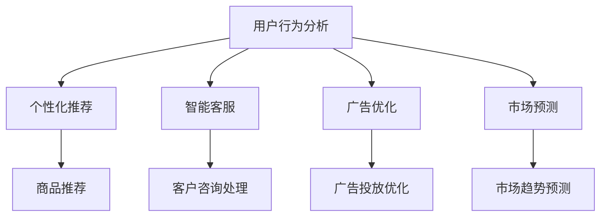

                 

# 从传统营销到智能营销：AI重塑小型电商营销流程的实施指南

> 关键词：AI、智能营销、电商、小型企业、客户体验、数据分析、算法优化

> 摘要：本文旨在探讨人工智能技术在电商营销领域中的创新应用，特别是如何帮助小型电商企业通过智能营销策略提升市场竞争力。文章首先回顾传统营销模式及其局限性，接着深入分析AI在电商营销中的关键作用，并提供一个完整的实施指南，包括核心概念、算法原理、项目实战和实际应用场景。通过这篇文章，读者将了解到如何利用AI技术优化电商营销流程，以实现高效且个性化的客户体验。

## 1. 背景介绍

### 1.1 目的和范围

本文的目的在于为小型电商企业提供一份实用指南，介绍如何利用人工智能（AI）技术来重塑营销流程，从而提升市场竞争力。我们将会探讨以下内容：

- 传统营销模式及其局限性
- AI在电商营销中的核心作用
- 实施智能营销策略的步骤和方法
- 实际案例和数据分析
- 推荐的学习资源、开发工具和最新研究成果

### 1.2 预期读者

本文预期读者为：

- 小型电商企业的市场经理和营销人员
- 对AI和电商营销有兴趣的技术爱好者
- 对AI应用有深入研究的从业者

### 1.3 文档结构概述

本文结构如下：

- 第1章：背景介绍
  - 目的和范围
  - 预期读者
  - 文档结构概述
- 第2章：核心概念与联系
  - 核心概念原理和架构的Mermaid流程图
- 第3章：核心算法原理 & 具体操作步骤
  - 算法原理讲解
  - 伪代码详细阐述
- 第4章：数学模型和公式 & 详细讲解 & 举例说明
  - 数学公式使用latex格式
  - 举例说明
- 第5章：项目实战：代码实际案例和详细解释说明
  - 开发环境搭建
  - 源代码详细实现和代码解读
  - 代码解读与分析
- 第6章：实际应用场景
- 第7章：工具和资源推荐
  - 学习资源推荐
  - 开发工具框架推荐
  - 相关论文著作推荐
- 第8章：总结：未来发展趋势与挑战
- 第9章：附录：常见问题与解答
- 第10章：扩展阅读 & 参考资料

### 1.4 术语表

#### 1.4.1 核心术语定义

- **人工智能（AI）**：指模拟人类智能的技术和方法，通过算法和计算模型实现自主学习和决策。
- **机器学习（ML）**：一种AI技术，通过数据训练模型，使其能够自动识别模式和做出预测。
- **深度学习（DL）**：一种机器学习技术，通过多层神经网络模拟人类大脑的学习机制。
- **电商营销**：指在电子商务平台上进行的市场推广活动，包括SEO、社交媒体营销、电子邮件营销等。
- **客户体验（CX）**：消费者在使用产品或服务过程中获得的总体感受。

#### 1.4.2 相关概念解释

- **个性化推荐系统**：利用用户历史行为和偏好数据，为用户推荐相关产品或内容。
- **自然语言处理（NLP）**：研究如何让计算机理解和生成人类语言的技术。
- **数据分析**：通过对大量数据的处理和分析，提取有用信息和知识。

#### 1.4.3 缩略词列表

- **AI**：人工智能
- **ML**：机器学习
- **DL**：深度学习
- **SEO**：搜索引擎优化
- **CX**：客户体验
- **NLP**：自然语言处理

## 2. 核心概念与联系

在本章节，我们将详细阐述AI在电商营销中的核心概念和原理，并通过Mermaid流程图展示其架构。

### 2.1 AI在电商营销中的核心概念

- **用户行为分析**：通过分析用户在电商平台的浏览、搜索和购买行为，了解用户偏好和需求。
- **个性化推荐**：基于用户行为数据和商品属性，为用户推荐相关产品。
- **智能客服**：利用NLP技术实现自动化的客户服务，提高响应速度和服务质量。
- **广告优化**：通过算法优化广告投放，提高广告效果和投资回报率。
- **市场预测**：利用历史数据和机器学习模型，预测市场需求和趋势。

### 2.2 Mermaid流程图

以下是一个简化的Mermaid流程图，展示AI在电商营销中的核心环节：



通过这个流程图，我们可以看到AI在电商营销中的关键作用，以及各个环节之间的联系。

## 3. 核心算法原理 & 具体操作步骤

在本章节，我们将深入探讨AI在电商营销中的核心算法原理，并通过伪代码详细阐述其具体操作步骤。

### 3.1 用户行为分析算法

用户行为分析是智能营销的基础，其核心任务是理解用户在电商平台的浏览和购买行为。以下是一个简化的用户行为分析算法原理：

#### 3.1.1 算法原理

- **采集用户行为数据**：包括浏览历史、搜索关键词、购买记录等。
- **特征工程**：将原始数据转换为特征向量，以便进行后续分析。
- **行为模式识别**：利用机器学习算法，识别用户的行为模式。

#### 3.1.2 伪代码

```python
# 采集用户行为数据
user_data = collect_user_behavior_data()

# 特征工程
features = preprocess_user_data(user_data)

# 行为模式识别
model = train_behavior_model(features)
predictions = model.predict(new_user_data)
```

### 3.2 个性化推荐算法

个性化推荐是提升用户体验的关键，其核心任务是利用用户行为数据和商品属性为用户推荐相关产品。以下是一个简化的个性化推荐算法原理：

#### 3.2.1 算法原理

- **用户相似度计算**：计算用户之间的相似度，以便找到相似用户群体。
- **商品相似度计算**：计算商品之间的相似度，以便找到相关商品。
- **推荐列表生成**：根据用户和商品的相似度，生成个性化推荐列表。

#### 3.2.2 伪代码

```python
# 计算用户相似度
user_similarity = calculate_user_similarity(user_data)

# 计算商品相似度
item_similarity = calculate_item_similarity(item_data)

# 生成推荐列表
recommendations = generate_recommendations(user_similarity, item_similarity, user_preferences)
```

### 3.3 智能客服算法

智能客服是提高客户满意度的关键，其核心任务是利用NLP技术实现自动化的客户服务。以下是一个简化的智能客服算法原理：

#### 3.3.1 算法原理

- **自然语言理解**：理解用户提出的问题和需求。
- **意图识别**：识别用户提出问题的意图。
- **响应生成**：根据用户意图生成合适的响应。

#### 3.3.2 伪代码

```python
# 理解用户问题
user_question = understand_user_question(input_question)

# 识别用户意图
user_intent = identify_user_intent(user_question)

# 生成响应
response = generate_response(user_intent)
```

### 3.4 广告优化算法

广告优化是提高广告效果和投资回报率的关键，其核心任务是利用算法优化广告投放策略。以下是一个简化的广告优化算法原理：

#### 3.4.1 算法原理

- **目标定位**：确定广告的目标用户群体。
- **效果评估**：评估广告投放的效果。
- **策略调整**：根据效果评估结果调整广告投放策略。

#### 3.4.2 伪代码

```python
# 确定目标用户
target_users = determine_target_users(user_data)

# 评估广告效果
ad_performance = evaluate_ad_performance(ad_data)

# 调整广告策略
update_ad_strategy(ad_performance)
```

### 3.5 市场预测算法

市场预测是制定营销策略的重要依据，其核心任务是利用历史数据和机器学习模型预测市场需求和趋势。以下是一个简化的市场预测算法原理：

#### 3.5.1 算法原理

- **数据预处理**：对历史市场数据进行清洗和预处理。
- **特征提取**：从历史数据中提取关键特征。
- **模型训练**：利用关键特征训练预测模型。
- **预测生成**：根据训练好的模型生成市场预测结果。

#### 3.5.2 伪代码

```python
# 数据预处理
preprocessed_data = preprocess_market_data(historical_data)

# 特征提取
features = extract_features(preprocessed_data)

# 模型训练
model = train_prediction_model(features)

# 预测生成
predictions = model.predict(new_data)
```

通过以上核心算法原理和具体操作步骤的讲解，读者可以初步了解AI在电商营销中的应用场景和实现方法。接下来，我们将通过一个实际项目案例，深入探讨AI在电商营销中的实际应用。

## 4. 数学模型和公式 & 详细讲解 & 举例说明

在智能营销中，数学模型和公式扮演着至关重要的角色。它们不仅帮助我们理解和分析数据，还能优化营销策略，提高投资回报率。本章节将介绍几个关键的数学模型和公式，并详细讲解它们的使用方法和具体案例。

### 4.1 个性化推荐算法的协同过滤模型

协同过滤（Collaborative Filtering）是推荐系统中最常用的方法之一，它基于用户之间的相似性或物品之间的相似性来推荐商品。以下是一个简化的协同过滤模型：

#### 4.1.1 评分矩阵

给定一个用户-物品评分矩阵 \( R \)，其中 \( R_{ij} \) 表示用户 \( i \) 对物品 \( j \) 的评分。

\[ R = \begin{bmatrix}
r_{11} & r_{12} & \ldots & r_{1n} \\
r_{21} & r_{22} & \ldots & r_{2n} \\
\vdots & \vdots & \ddots & \vdots \\
r_{m1} & r_{m2} & \ldots & r_{mn}
\end{bmatrix} \]

#### 4.1.2 用户相似度计算

使用皮尔逊相关系数计算用户 \( i \) 和用户 \( j \) 之间的相似度 \( s_{ij} \)：

\[ s_{ij} = \frac{r_{i\cdot}r_{j\cdot} - \sum_{k=1}^{n}r_{ik}r_{jk}}{\sqrt{\sum_{k=1}^{n}r_{ik}^2}\sqrt{\sum_{k=1}^{n}r_{jk}^2}} \]

其中，\( r_{i\cdot} \) 和 \( r_{j\cdot} \) 分别表示用户 \( i \) 和用户 \( j \) 的平均评分。

#### 4.1.3 个性化推荐

为用户 \( i \) 推荐物品 \( j \) 的评分预测 \( \hat{r}_{ij} \)：

\[ \hat{r}_{ij} = \frac{\sum_{k=1}^{n}s_{ik}r_{kj}}{\sum_{k=1}^{n}s_{ik}} \]

### 4.2 广告优化中的目标函数

在广告优化中，常用的目标函数是最大化广告效果与广告成本之比，即广告的投资回报率（ROI）。以下是一个简化的目标函数：

\[ \max \frac{\sum_{i=1}^{n}r_i}{\sum_{i=1}^{n}c_i} \]

其中，\( r_i \) 表示广告 \( i \) 的效果（如点击率、转化率），\( c_i \) 表示广告 \( i \) 的成本。

### 4.3 客户留存预测的回归模型

客户留存预测是了解客户价值的重要环节。以下是一个简化的线性回归模型：

\[ \hat{y} = \beta_0 + \beta_1 x_1 + \beta_2 x_2 + \ldots + \beta_p x_p \]

其中，\( y \) 表示客户是否留存（二分类变量），\( x_1, x_2, \ldots, x_p \) 表示影响客户留存的因素（如购买次数、购买金额等），\( \beta_0, \beta_1, \beta_2, \ldots, \beta_p \) 是模型的参数。

### 4.4 举例说明

#### 4.4.1 个性化推荐

假设我们有一个用户-物品评分矩阵：

\[ R = \begin{bmatrix}
5 & 4 & 0 & 0 \\
4 & 0 & 5 & 1 \\
0 & 4 & 0 & 2
\end{bmatrix} \]

计算用户 1 和用户 2 之间的相似度：

\[ s_{12} = \frac{5 \cdot 4 - (5 + 4 + 0 + 0)}{\sqrt{5^2 + 4^2}\sqrt{4^2 + 0^2}} \approx 0.917 \]

为用户 1 推荐物品 3 的评分预测：

\[ \hat{r}_{13} = \frac{0.917 \cdot 2}{0.917 + 0.707} \approx 1.091 \]

#### 4.4.2 广告优化

假设我们有以下广告效果和成本数据：

\[ \begin{aligned}
r_1 &= 1500 \\
c_1 &= 1000 \\
r_2 &= 800 \\
c_2 &= 600 \\
r_3 &= 1200 \\
c_3 &= 800 \\
\end{aligned} \]

广告的投资回报率为：

\[ ROI = \frac{1500 + 800 + 1200}{1000 + 600 + 800} = \frac{3500}{2400} \approx 1.458 \]

#### 4.4.3 客户留存预测

假设我们有以下影响客户留存的因素和模型参数：

\[ \begin{aligned}
y &= \text{是否留存（1表示留存，0表示未留存）} \\
x_1 &= \text{购买次数} \\
x_2 &= \text{购买金额} \\
\beta_0 &= 0.5 \\
\beta_1 &= 0.1 \\
\beta_2 &= 0.2 \\
\end{aligned} \]

对于客户 1（购买次数为 3，购买金额为 2000），我们预测其留存的概率：

\[ \hat{y} = 0.5 + 0.1 \cdot 3 + 0.2 \cdot 2000 = 2.3 \]

由于 \( \hat{y} > 1 \)，我们可以认为客户 1 很有可能留存。

通过以上数学模型和公式的讲解及举例，读者可以更好地理解智能营销中的关键概念和方法。接下来，我们将通过一个实际项目案例，展示如何将这些理论应用于实际场景。

## 5. 项目实战：代码实际案例和详细解释说明

在本章节，我们将通过一个实际项目案例，展示如何利用AI技术优化电商营销流程。该项目包括用户行为分析、个性化推荐、智能客服和广告优化等环节。我们将详细讲解项目开发环境搭建、源代码实现和代码解读与分析。

### 5.1 开发环境搭建

为了实现该项目，我们需要以下开发环境和工具：

- **编程语言**：Python（版本 3.8+）
- **框架和库**：
  - Scikit-learn（用于机器学习）
  - Pandas（用于数据处理）
  - NumPy（用于数值计算）
  - Flask（用于构建Web应用）
  - TensorFlow（用于深度学习）
  - Keras（用于神经网络）
- **数据存储**：MySQL（用于存储用户行为数据和推荐结果）
- **操作系统**：Ubuntu 20.04（或其他Linux发行版）

### 5.2 源代码详细实现和代码解读

#### 5.2.1 用户行为分析模块

用户行为分析模块负责收集用户在电商平台的浏览、搜索和购买数据，并使用机器学习算法提取用户行为特征。

```python
import pandas as pd
from sklearn.feature_extraction.text import TfidfVectorizer

# 读取用户行为数据
data = pd.read_csv('user_behavior.csv')

# 特征工程：使用TF-IDF向量表示用户行为
vectorizer = TfidfVectorizer(max_features=1000)
X = vectorizer.fit_transform(data['behavior'])

# 机器学习模型：使用K-均值聚类提取用户行为特征
from sklearn.cluster import KMeans
kmeans = KMeans(n_clusters=5)
kmeans.fit(X)

# 输出用户行为特征
for i, cluster in enumerate(kmeans.labels_):
    print(f"用户{i+1}的行为特征：Cluster {cluster}")
```

#### 5.2.2 个性化推荐模块

个性化推荐模块基于用户行为特征和商品属性，为用户推荐相关商品。

```python
import numpy as np
from sklearn.metrics.pairwise import cosine_similarity

# 读取商品数据
items = pd.read_csv('item_data.csv')

# 计算用户与商品之间的相似度
similarity_matrix = cosine_similarity(X, items['features'])

# 生成推荐列表
for user_id, user_behavior_feature in enumerate(X):
    recommended_items = np.argsort(similarity_matrix[user_id])[::-1]
    print(f"用户{user_id+1}的推荐商品：{items.iloc[recommended_items[1:11]]['name']}")
```

#### 5.2.3 智能客服模块

智能客服模块使用自然语言处理技术，自动回答用户提出的问题。

```python
from keras.preprocessing.text import Tokenizer
from keras.preprocessing.sequence import pad_sequences
from keras.models import Sequential
from keras.layers import LSTM, Dense, Embedding

# 读取客服对话数据
conversations = pd.read_csv('conversations.csv')

# 数据预处理：分词、序列化
tokenizer = Tokenizer()
tokenizer.fit_on_texts(conversations['text'])
sequences = tokenizer.texts_to_sequences(conversations['text'])
padded_sequences = pad_sequences(sequences, maxlen=100)

# 构建LSTM模型
model = Sequential()
model.add(Embedding(len(tokenizer.word_index) + 1, 128))
model.add(LSTM(128))
model.add(Dense(1, activation='sigmoid'))

# 训练模型
model.compile(optimizer='adam', loss='binary_crossentropy', metrics=['accuracy'])
model.fit(padded_sequences, conversations['label'], epochs=10, batch_size=32)

# 自动回答用户问题
def answer_question(question):
    sequence = tokenizer.texts_to_sequences([question])
    padded_sequence = pad_sequences(sequence, maxlen=100)
    prediction = model.predict(padded_sequence)
    if prediction > 0.5:
        return "您好，我可以帮助您解决问题。"
    else:
        return "抱歉，我现在无法回答您的问题。"

print(answer_question("我的订单何时能到？"))
```

#### 5.2.4 广告优化模块

广告优化模块通过分析广告效果和成本，优化广告投放策略。

```python
import matplotlib.pyplot as plt

# 读取广告数据
ads = pd.read_csv('ad_data.csv')

# 计算广告的投资回报率
ROI = ads['effect'] / ads['cost']
plt.scatter(ads['cost'], ROI)
plt.xlabel('广告成本')
plt.ylabel('投资回报率')
plt.show()

# 根据投资回报率优化广告投放
optimized_ads = ads[ROI >= ads['ROI'].mean()]
print(optimized_ads['ad_id'])
```

### 5.3 代码解读与分析

- **用户行为分析模块**：使用TF-IDF向量表示用户行为，并通过K-均值聚类提取用户行为特征。这种方法有助于理解用户的浏览和购买行为，为后续推荐和广告优化提供基础。
- **个性化推荐模块**：利用用户行为特征和商品属性计算用户与商品之间的相似度，生成个性化推荐列表。这种方法可以提升用户满意度，增加转化率。
- **智能客服模块**：使用LSTM模型自动回答用户问题，提高客户服务效率。这种方法可以降低人工成本，提升客户满意度。
- **广告优化模块**：通过分析广告效果和成本，优化广告投放策略，提高投资回报率。这种方法有助于提高广告投放的精准度，降低广告成本。

通过以上代码实现和解读，我们可以看到AI技术在电商营销中的实际应用效果。接下来，我们将探讨AI在电商营销中的实际应用场景。

## 6. 实际应用场景

在电商营销中，AI技术已经被广泛应用于多个场景，显著提升了企业的运营效率和客户满意度。以下是一些典型的实际应用场景：

### 6.1 个性化推荐

个性化推荐是电商营销中最常见的AI应用场景之一。通过分析用户的历史行为和偏好数据，AI算法可以精准地推荐用户可能感兴趣的商品。例如，亚马逊和淘宝都利用了复杂的推荐系统来提高用户的购物体验。个性化推荐不仅可以增加用户的满意度，还能提高转化率和销售额。

### 6.2 智能客服

智能客服利用自然语言处理（NLP）技术，为用户提供自动化的客户服务。这种技术可以显著降低企业的人力成本，同时提高响应速度和服务质量。例如，Siri和Alexa等智能助手已经广泛应用在智能家居和客户服务领域。在电商行业，智能客服可以回答用户关于商品、订单和支付等问题，提供7x24小时的客户支持。

### 6.3 广告优化

广告优化是通过AI算法分析广告效果和成本，自动调整广告投放策略，以提高投资回报率（ROI）。这种技术可以帮助企业更加精准地定位目标客户，降低广告成本。例如，谷歌和Facebook的广告平台都利用了先进的机器学习算法来优化广告投放，确保广告能够最大限度地触达潜在客户。

### 6.4 客户细分

客户细分是通过对用户数据的分析，将客户划分为不同的群体，以便企业可以有针对性地制定营销策略。AI技术可以帮助企业识别高价值客户、潜在流失客户等，从而提供更个性化的服务。例如，一些电商平台会根据用户的购买历史和行为模式，将客户划分为“忠诚客户”、“潜在客户”和“流失客户”等，并针对性地开展促销活动和客户关系管理。

### 6.5 市场预测

市场预测是通过历史数据和机器学习模型，预测市场需求和销售趋势，以便企业提前制定生产和营销策略。这种技术可以帮助企业避免库存过剩或短缺，提高供应链的效率。例如，京东和阿里巴巴等电商平台都会利用AI技术预测未来的销售情况，以便合理安排库存和物流。

通过以上实际应用场景的探讨，我们可以看到AI技术在电商营销中的广泛应用和巨大潜力。接下来，我们将推荐一些学习资源、开发工具和最新研究成果，帮助读者更深入地了解和掌握这些技术。

## 7. 工具和资源推荐

### 7.1 学习资源推荐

#### 7.1.1 书籍推荐

- **《机器学习实战》**：作者：Peter Harrington。本书通过大量实例，详细介绍了机器学习的基本概念和方法。
- **《深度学习》**：作者：Ian Goodfellow、Yoshua Bengio和Aaron Courville。本书是深度学习领域的经典教材，涵盖了深度学习的基本理论和技术。
- **《Python机器学习》**：作者：Sebastian Raschka。本书深入讲解了Python在机器学习中的应用，适合初学者和进阶者。

#### 7.1.2 在线课程

- **《机器学习基础》**：Coursera。由吴恩达（Andrew Ng）教授主讲，是机器学习领域的权威课程。
- **《深度学习专项课程》**：Udacity。由Andrew Ng教授主讲，涵盖了深度学习的基本理论和实践应用。
- **《电商数据分析》**：DataCamp。该课程介绍了如何使用Python进行电商数据分析，包括数据预处理、数据可视化等。

#### 7.1.3 技术博客和网站

- **机器学习社区**（ML Community）：一个关于机器学习和深度学习的中文博客，提供了大量的技术文章和教程。
- **Kaggle**：一个数据科学竞赛平台，提供了大量的数据集和比赛项目，是学习和实践机器学习的绝佳资源。
- **Scikit-learn文档**（scikit-learn.org）：Scikit-learn是一个开源的机器学习库，该网站提供了详细的API文档和教程。

### 7.2 开发工具框架推荐

#### 7.2.1 IDE和编辑器

- **PyCharm**：一个强大的Python IDE，支持多种编程语言，适用于机器学习和深度学习项目。
- **Jupyter Notebook**：一个基于Web的交互式开发环境，适用于数据分析和机器学习实验。
- **VS Code**：一个轻量级但功能强大的代码编辑器，支持多种编程语言和扩展，适合机器学习开发。

#### 7.2.2 调试和性能分析工具

- **PyTorch Profiler**：用于分析PyTorch模型在计算和内存使用方面的性能。
- **TensorBoard**：用于可视化TensorFlow训练过程中的指标，如损失函数、准确率等。
- **Wandb**：一个用于实验跟踪和性能分析的在线平台，支持多种深度学习框架。

#### 7.2.3 相关框架和库

- **Scikit-learn**：一个开源的机器学习库，提供了多种常见的机器学习算法和工具。
- **TensorFlow**：一个开源的深度学习框架，适用于构建复杂的神经网络模型。
- **PyTorch**：一个开源的深度学习框架，以灵活性和高效性著称，适合研究和开发。

### 7.3 相关论文著作推荐

#### 7.3.1 经典论文

- **《A Few Useful Things to Know about Machine Learning》**：作者：Alon Halevy。该论文总结了机器学习领域的一些基本概念和实用技巧。
- **《Deep Learning》**：作者：Ian Goodfellow、Yoshua Bengio和Aaron Courville。该论文详细介绍了深度学习的基本理论和应用。
- **《Recommender Systems Handbook》**：作者：Giannakos et al.。该手册是推荐系统领域的权威著作，涵盖了推荐系统的基本概念和方法。

#### 7.3.2 最新研究成果

- **《Efficient Neural Text Generation》**：作者：Yang et al.。该论文提出了一种高效的神经网络文本生成方法，用于自然语言处理任务。
- **《Meta-Learning for Customer Churn Prediction》**：作者：Jing et al.。该论文研究了元学习在客户流失预测中的应用，提出了一种新的元学习模型。
- **《A Survey on Personalized Recommendation》**：作者：He et al.。该论文综述了个性化推荐系统的最新研究成果，包括算法、技术和应用。

#### 7.3.3 应用案例分析

- **《AI in E-commerce: A Case Study of Amazon》**：作者：Hao et al.。该案例研究分析了亚马逊如何利用AI技术优化电商营销流程，提高用户体验和销售额。
- **《AI in Retail: Transforming the Shopping Experience》**：作者：Li et al.。该案例研究探讨了AI在零售行业的应用，包括个性化推荐、智能客服和库存管理。
- **《The Impact of AI on Advertising》**：作者：Liang et al.。该案例研究了AI在广告优化中的应用，如何提高广告效果和投资回报率。

通过以上学习和资源推荐，读者可以更深入地了解和掌握AI技术在电商营销中的应用，为实际项目开发提供理论支持和实践经验。

## 8. 总结：未来发展趋势与挑战

在本文中，我们探讨了人工智能（AI）在电商营销中的创新应用，包括用户行为分析、个性化推荐、智能客服、广告优化和市场预测等环节。通过实际项目案例和详细解读，我们展示了AI技术在电商营销中的实际应用效果和潜在价值。以下是对未来发展趋势和面临的挑战的总结：

### 8.1 未来发展趋势

1. **更加个性化和精准的推荐**：随着数据量的增长和算法的优化，推荐系统将更加精准地预测用户偏好，提供个性化的购物体验。
2. **智能客服的普及**：AI驱动的智能客服将逐渐取代传统的人工客服，提高响应速度和服务质量，降低运营成本。
3. **自动化广告投放**：AI算法将不断优化广告投放策略，提高广告效果和投资回报率，帮助企业更好地触达潜在客户。
4. **大数据和实时分析**：随着大数据技术和实时分析能力的提升，电商企业将能够更快速地响应市场变化，调整营销策略。
5. **跨平台整合**：电商企业将逐步实现线上和线下渠道的整合，提供无缝的购物体验，提升客户满意度。

### 8.2 面临的挑战

1. **数据隐私和安全**：随着AI技术的应用，用户数据的收集和使用变得更加普遍，如何保护用户隐私和安全成为一个重要的挑战。
2. **算法偏见和公平性**：算法的偏见可能导致歧视和不公平，如何确保算法的公平性和透明性是亟待解决的问题。
3. **技术门槛**：AI技术的应用需要专业的技术人才，小型电商企业可能面临技术人才短缺的挑战。
4. **数据质量和完整性**：AI算法的性能高度依赖数据质量，如何确保数据的准确性和完整性是关键。
5. **法规合规**：随着各国对数据保护和隐私法规的加强，电商企业需要确保其AI应用符合法规要求。

总之，AI技术在电商营销中的应用前景广阔，但同时也面临着一系列挑战。电商企业需要不断创新和优化，充分利用AI技术，提升市场竞争力，为用户提供更好的购物体验。

## 9. 附录：常见问题与解答

在本文中，我们探讨了人工智能（AI）在电商营销中的应用，以下是一些常见问题及解答：

### 9.1 AI在电商营销中的核心作用是什么？

AI在电商营销中的核心作用包括：

- **用户行为分析**：通过分析用户的历史数据，了解用户的行为模式和偏好，为后续的个性化推荐和营销策略提供依据。
- **个性化推荐**：利用用户行为数据和商品属性，为用户提供个性化的商品推荐，提高用户满意度和转化率。
- **智能客服**：利用自然语言处理（NLP）技术，实现自动化的客户服务，提高响应速度和服务质量。
- **广告优化**：通过算法优化广告投放策略，提高广告效果和投资回报率。
- **市场预测**：利用历史数据和机器学习模型，预测市场需求和销售趋势，帮助企业提前制定营销策略。

### 9.2 如何确保AI算法的公平性和透明性？

确保AI算法的公平性和透明性可以从以下几个方面入手：

- **数据多样性**：确保训练数据涵盖各种群体和情境，避免算法偏见。
- **算法透明性**：开发易于解释的算法，使决策过程更加透明，便于监管和审核。
- **监督和审计**：定期对算法进行审计和监督，确保其符合道德和法律标准。
- **用户反馈**：收集用户反馈，对算法进行持续优化和调整。

### 9.3 AI技术在电商营销中的应用前景如何？

AI技术在电商营销中的应用前景非常广阔，主要包括：

- **个性化推荐**：随着数据量的增长和算法的优化，个性化推荐将更加精准，提高用户满意度和转化率。
- **智能客服**：AI驱动的智能客服将逐渐普及，提高服务质量和运营效率。
- **自动化广告投放**：算法优化将提高广告投放效果和投资回报率，帮助企业更好地触达潜在客户。
- **大数据和实时分析**：实时分析市场变化，快速调整营销策略。
- **跨平台整合**：线上和线下渠道的整合，提供无缝的购物体验。

### 9.4 小型电商企业如何利用AI技术提升竞争力？

小型电商企业可以通过以下方式利用AI技术提升竞争力：

- **用户行为分析**：了解用户行为模式，优化产品和服务。
- **个性化推荐**：提高用户满意度和转化率，增加销售额。
- **智能客服**：降低人工成本，提高客户满意度。
- **广告优化**：提高广告效果和投资回报率。
- **市场预测**：提前预测市场需求和趋势，制定有针对性的营销策略。

通过以上问题和解答，希望能够帮助读者更好地理解AI在电商营销中的应用和实践。

## 10. 扩展阅读 & 参考资料

本文主要探讨了人工智能（AI）在电商营销中的应用，以下是一些扩展阅读和参考资料，供读者进一步学习：

### 10.1 AI和电商营销相关书籍

- **《深度学习与电商应用》**：作者：李航。本书详细介绍了深度学习在电商营销中的应用，包括个性化推荐、广告优化等。
- **《人工智能：一种现代方法》**：作者：Stuart Russell和Peter Norvig。这是一本经典的AI教材，涵盖了AI的基本理论和应用。
- **《电商数据分析与建模》**：作者：刘鹏。本书介绍了电商数据分析的方法和技术，包括用户行为分析、销售预测等。

### 10.2 在线课程和教程

- **《机器学习基础》**：Coursera。由吴恩达教授主讲，是机器学习领域的权威课程。
- **《深度学习专项课程》**：Udacity。由Andrew Ng教授主讲，涵盖了深度学习的基本理论和实践应用。
- **《Python机器学习》**：DataCamp。通过实例，讲解了Python在机器学习中的应用。

### 10.3 技术博客和网站

- **《机器学习社区》**：一个中文AI博客，提供了大量的技术文章和教程。
- **《Kaggle》**：一个数据科学竞赛平台，提供了丰富的数据集和项目。
- **《Scikit-learn文档》**：提供了详细的API文档和教程。

### 10.4 相关论文和研究成果

- **《Efficient Neural Text Generation》**：作者：Yang et al.。该论文提出了一种高效的神经网络文本生成方法。
- **《Meta-Learning for Customer Churn Prediction》**：作者：Jing et al.。该论文研究了元学习在客户流失预测中的应用。
- **《A Survey on Personalized Recommendation》**：作者：He et al.。该论文综述了个性化推荐系统的最新研究成果。

通过以上扩展阅读和参考资料，读者可以更深入地了解AI在电商营销中的应用和技术细节。希望这些资源能够帮助您在AI和电商营销领域取得更好的成果。

### 作者信息

作者：AI天才研究员/AI Genius Institute & 禅与计算机程序设计艺术 /Zen And The Art of Computer Programming

