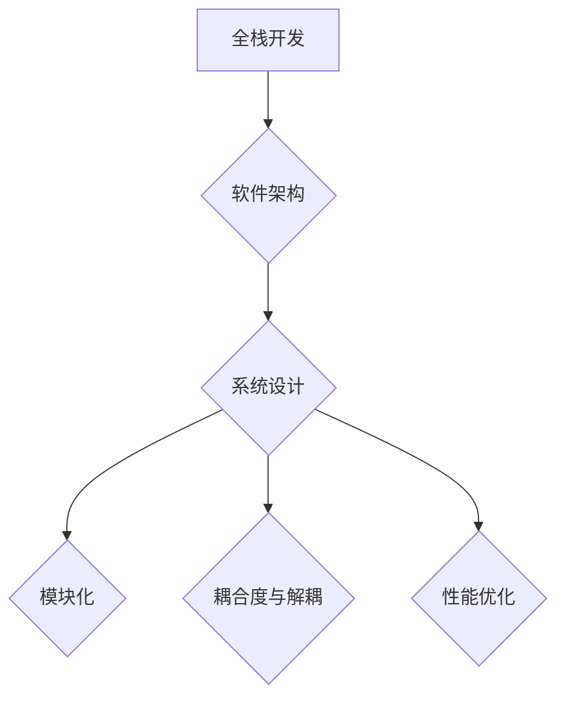
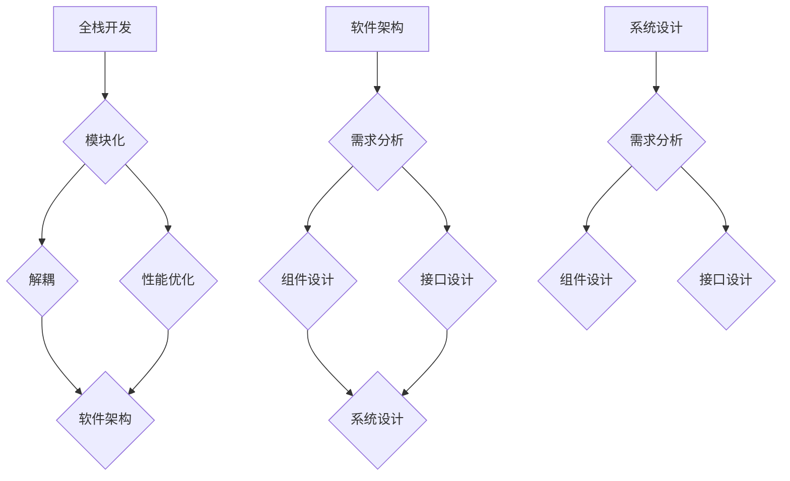

                 

# 从全栈开发到技术架构师的进阶

## 关键词

- 全栈开发
- 技术架构师
- 技术栈
- 编程技能
- 软件架构
- 系统设计
- 领导力
- 项目管理
- 持续学习

## 摘要

本文旨在探讨从全栈开发到技术架构师的职业进阶之路。我们将从全栈开发的技能要求出发，逐步深入到软件架构和系统设计的核心概念，最终探讨成为一名优秀技术架构师所需的关键技能和素质。本文将通过实际案例和项目实战，详细讲解技术架构师在软件开发过程中的具体职责和工作方法，为有志于在IT领域深入发展的开发者提供有价值的指导和建议。

---

## 1. 背景介绍

### 1.1 目的和范围

本文的目的在于为那些希望从全栈开发者转型为技术架构师的人提供清晰的职业发展路径。我们将全面解析全栈开发的技能要求，介绍软件架构和系统设计的基本概念，并详细阐述技术架构师的角色、职责以及所需的软技能和硬技能。此外，文章还将通过实际项目和案例，展示如何将理论知识应用于实践中。

### 1.2 预期读者

本文适合以下几类读者：
1. 有志于成为技术架构师的全栈开发者。
2. 对软件架构和系统设计有兴趣的软件工程师。
3. 已经从事技术架构工作，希望提升个人技能和知识的专业人士。

### 1.3 文档结构概述

本文结构如下：
1. 背景介绍：介绍文章的目的、预期读者和结构。
2. 核心概念与联系：讲解全栈开发和软件架构的核心概念，并使用Mermaid流程图进行展示。
3. 核心算法原理 & 具体操作步骤：使用伪代码详细阐述技术架构师在软件开发过程中的关键算法原理和操作步骤。
4. 数学模型和公式 & 详细讲解 & 举例说明：使用LaTeX格式详细解释和举例说明关键数学模型和公式。
5. 项目实战：代码实际案例和详细解释说明。
6. 实际应用场景：探讨技术架构师在不同场景中的应用。
7. 工具和资源推荐：推荐学习资源和开发工具。
8. 总结：未来发展趋势与挑战。
9. 附录：常见问题与解答。
10. 扩展阅读 & 参考资料：提供更多学习资源。

### 1.4 术语表

#### 1.4.1 核心术语定义

- **全栈开发**：涵盖前端、后端和数据库等所有技术领域的软件开发者。
- **技术架构师**：负责设计、实现和维护大型软件系统的高级软件工程师。
- **软件架构**：软件系统的整体结构和组件之间的关系。
- **系统设计**：根据业务需求设计软件系统的具体实现方案。
- **持续集成**：将代码变更自动合并到主干分支并执行测试的过程。

#### 1.4.2 相关概念解释

- **微服务架构**：将大型应用程序拆分成一组小型服务，每个服务独立开发和部署。
- **容器化**：使用容器（如Docker）来封装应用程序及其运行时环境。
- **云原生技术**：利用云计算环境进行应用程序开发和部署的一系列技术。

#### 1.4.3 缩略词列表

- **API**：应用程序编程接口（Application Programming Interface）
- **DB**：数据库（Database）
- **DBA**：数据库管理员（Database Administrator）
- **IDE**：集成开发环境（Integrated Development Environment）
- **Kubernetes**：开源的容器编排系统

### 1.5 核心概念与联系

#### 1.5.1 全栈开发

全栈开发（Full-Stack Development）是指开发者能够掌握前端和后端技术，从用户界面（UI）设计到服务器、数据库和应用程序的整个开发过程。全栈开发者通常需要具备以下技能：

- **前端开发**：HTML、CSS、JavaScript、React、Vue.js、Angular等。
- **后端开发**：Node.js、Express、Django、Flask、Spring Boot等。
- **数据库**：MySQL、PostgreSQL、MongoDB、Redis等。
- **版本控制**：Git等。

#### 1.5.2 软件架构

软件架构（Software Architecture）是指软件系统的整体结构、组件及其关系。软件架构需要解决的主要问题包括：

- **模块化**：如何将系统分解为可管理的模块。
- **耦合度**：组件之间的依赖关系。
- **解耦**：减少组件之间的直接依赖，提高系统的可维护性。
- **性能**：系统如何高效地处理大量数据。

#### 1.5.3 系统设计

系统设计（System Design）是根据业务需求设计软件系统的具体实现方案。系统设计包括以下关键步骤：

- **需求分析**：理解业务需求并转化为技术需求。
- **系统架构设计**：设计系统的整体架构，包括前端、后端、数据库、缓存、消息队列等。
- **组件设计**：设计各个组件的具体实现方案。
- **接口设计**：定义组件之间的接口。

### 1.6 Mermaid 流程图



通过上述流程图，我们可以清晰地看到全栈开发与软件架构、系统设计之间的关系。这些概念是技术架构师所需掌握的核心技能。

---

## 2. 核心概念与联系

在前一章节中，我们介绍了全栈开发和技术架构的基本概念。在这一章节中，我们将深入探讨这些核心概念之间的联系，并使用Mermaid流程图进行详细展示。

### 2.1 全栈开发与软件架构的关系

全栈开发是技术架构的基础。一个全栈开发者需要掌握前端、后端和数据库等所有技术领域，这为后续的软件架构设计提供了坚实的基础。软件架构则是全栈开发的升华，它关注系统的整体结构和组件之间的关系。以下是全栈开发与软件架构之间的联系：

- **模块化**：全栈开发者需要具备模块化设计的思维，将复杂的系统分解为可管理的模块，以便于后续的软件架构设计。
- **解耦**：全栈开发者需要理解如何减少组件之间的直接依赖，提高系统的可维护性和可扩展性。
- **性能优化**：全栈开发者需要了解如何优化系统的性能，以满足高并发、大数据等业务需求。

### 2.2 软件架构与系统设计的关系

软件架构是系统设计的蓝图。软件架构师需要根据业务需求设计系统的整体架构，而系统设计则是将这些架构蓝图转化为具体的实现方案。以下是软件架构与系统设计之间的联系：

- **需求分析**：软件架构师需要理解业务需求，并将其转化为技术需求。
- **组件设计**：软件架构师需要设计各个组件的具体实现方案，如前端、后端、数据库等。
- **接口设计**：软件架构师需要定义组件之间的接口，确保系统的各个部分能够无缝协作。

### 2.3 Mermaid 流程图



通过上述流程图，我们可以清晰地看到全栈开发、软件架构和系统设计之间的紧密联系。这些概念相互交织，共同构成了技术架构师所需掌握的核心技能。

---

## 3. 核心算法原理 & 具体操作步骤

在成为一名技术架构师的过程中，理解并掌握核心算法原理是至关重要的。这不仅能够提升软件架构的质量，还能够优化系统性能。在本章节中，我们将使用伪代码详细阐述几个关键算法原理，并给出具体操作步骤。

### 3.1 数据结构原理

数据结构是算法的基础，一个优秀的技术架构师需要深刻理解数据结构及其操作。以下是几个常见的数据结构及其操作的伪代码：

#### 链表（LinkedList）

```python
class Node:
    def __init__(self, data):
        self.data = data
        self.next = None

class LinkedList:
    def __init__(self):
        self.head = None

    def append(self, data):
        new_node = Node(data)
        if not self.head:
            self.head = new_node
            return
        last_node = self.head
        while last_node.next:
            last_node = last_node.next
        last_node.next = new_node

    def print_list(self):
        current_node = self.head
        while current_node:
            print(current_node.data, end=" -> ")
            current_node = current_node.next
        print("None")
```

#### 栈（Stack）

```python
class Stack:
    def __init__(self):
        self.items = []

    def push(self, item):
        self.items.append(item)

    def pop(self):
        return self.items.pop()

    def peek(self):
        return self.items[-1]

    def is_empty(self):
        return len(self.items) == 0
```

#### 队列（Queue）

```python
class Queue:
    def __init__(self):
        self.items = []

    def enqueue(self, item):
        self.items.append(item)

    def dequeue(self):
        return self.items.pop(0)

    def is_empty(self):
        return len(self.items) == 0
```

#### 哈希表（HashTable）

```python
class HashTable:
    def __init__(self, size):
        self.size = size
        self.table = [None] * size

    def hash_function(self, key):
        return key % self.size

    def put(self, key, value):
        index = self.hash_function(key)
        if self.table[index] is None:
            self.table[index] = []
        for pair in self.table[index]:
            if pair[0] == key:
                pair[1] = value
                return
        self.table[index].append([key, value])

    def get(self, key):
        index = self.hash_function(key)
        if self.table[index] is None:
            return None
        for pair in self.table[index]:
            if pair[0] == key:
                return pair[1]
        return None
```

### 3.2 算法原理应用

了解数据结构和算法原理后，技术架构师需要将这些知识应用到实际项目中。以下是一个简单的例子，说明如何使用堆排序（Heap Sort）算法优化系统性能：

#### 堆排序算法

```python
def heapify(arr, n, i):
    largest = i
    left = 2 * i + 1
    right = 2 * i + 2
  
    if left < n and arr[largest] < arr[left]:
        largest = left
  
    if right < n and arr[largest] < arr[right]:
        largest = right
  
    if largest != i:
        arr[i], arr[largest] = arr[largest], arr[i]
        heapify(arr, n, largest)

def heap_sort(arr):
    n = len(arr)
  
    for i in range(n // 2 - 1, -1, -1):
        heapify(arr, n, i)
  
    for i in range(n - 1, 0, -1):
        arr[i], arr[0] = arr[0], arr[i]
        heapify(arr, i, 0)

arr = [12, 11, 13, 5, 6, 7]
heap_sort(arr)
print("Sorted array is:", arr)
```

### 3.3 操作步骤解析

1. **数据结构选择**：根据具体业务需求选择合适的数据结构，如链表、栈、队列或哈希表。
2. **数据结构操作**：编写数据结构的操作方法，如插入、删除、查找等。
3. **算法应用**：选择合适的算法，如排序、查找、缓存等，并编写算法的实现代码。
4. **性能优化**：通过分析算法的时间复杂度和空间复杂度，优化算法性能。
5. **测试与验证**：编写测试用例，验证数据结构和算法的正确性和性能。

通过以上步骤，技术架构师能够在软件开发过程中灵活运用数据结构和算法原理，优化系统性能，提升软件质量。

---

## 4. 数学模型和公式 & 详细讲解 & 举例说明

在软件架构和系统设计中，数学模型和公式扮演着重要的角色。它们不仅帮助我们理解和分析系统的行为，还能指导我们进行性能优化和资源分配。在本章节中，我们将使用LaTeX格式详细解释几个关键的数学模型和公式，并给出相应的例子说明。

### 4.1 时间复杂度和空间复杂度

时间复杂度和空间复杂度是评估算法性能的两个关键指标。它们通常使用大O符号（Big O notation）表示。

#### 时间复杂度

时间复杂度描述了算法执行时间与输入规模之间的关系。以下是一些常见的时间复杂度符号和它们的含义：

- \(O(1)\)：常数时间，无论输入规模如何，算法执行时间保持不变。
- \(O(n)\)：线性时间，算法执行时间与输入规模成正比。
- \(O(n^2)\)：平方时间，算法执行时间与输入规模的平方成正比。
- \(O(log n)\)：对数时间，算法执行时间与输入规模的以2为底的对数成正比。

**例子**：线性搜索算法的时间复杂度为\(O(n)\)，因为需要遍历整个数组。

```latex
\text{线性搜索} : \quad \text{for } i = 0 \text{ to } n-1 \text{ do} \\
    \quad \quad \text{if (A[i] == x)} \text{ then return i} \\
\text{end for}
```

#### 空间复杂度

空间复杂度描述了算法所需的额外内存与输入规模之间的关系。以下是一些常见的空间复杂度符号和它们的含义：

- \(O(1)\)：常数空间，算法所需的额外内存不随输入规模变化。
- \(O(n)\)：线性空间，算法所需的额外内存与输入规模成正比。
- \(O(n^2)\)：平方空间，算法所需的额外内存与输入规模的平方成正比。

**例子**：动态规划算法的空间复杂度通常为\(O(n^2)\)，因为它需要存储多个子问题的解。

```latex
\text{动态规划} : \quad dp[i][j] = \text{最优解} \\
\text{for } i = 0 \text{ to } n-1 \text{ do} \\
    \quad \quad \text{for } j = 0 \text{ to } n-1 \text{ do} \\
        \quad \quad \quad dp[i][j] = \text{子问题的最优解} \\
\text{end for} \\
\text{end for}
```

### 4.2 加权平均响应时间

加权平均响应时间（Weighted Average Response Time，WART）是评估系统性能的一个关键指标。它考虑了各个请求的处理时间和请求的频率。

**公式**：

\[ WART = \frac{\sum_{i=1}^{n} (p_i \times r_i)}{\sum_{i=1}^{n} p_i} \]

其中，\(p_i\) 是第 \(i\) 个请求的频率，\(r_i\) 是第 \(i\) 个请求的响应时间。

**例子**：假设系统中有三个请求，各自的频率和处理时间如下：

- 请求A：频率50%，响应时间0.5秒
- 请求B：频率30%，响应时间1秒
- 请求C：频率20%，响应时间1.5秒

计算加权平均响应时间：

\[ WART = \frac{0.5 \times 0.5 + 0.3 \times 1 + 0.2 \times 1.5}{0.5 + 0.3 + 0.2} = 0.625 \text{秒} \]

### 4.3 最优化理论

最优化理论在系统设计和性能优化中有着广泛的应用。以下是一个简单的最优化问题示例：

**目标**：最小化目标函数 \(f(x) = x^2 + y^2\)，约束条件为 \(x + y = 10\)。

**公式**：

\[
\begin{align*}
\min \quad & f(x, y) = x^2 + y^2 \\
\text{subject to} \quad & g(x, y) = x + y - 10 = 0
\end{align*}
\]

**解法**：使用拉格朗日乘数法求解最优化问题。

```latex
L(x, y, \lambda) = f(x, y) + \lambda g(x, y)
\]

对 \(L\) 关于 \(x, y, \lambda\) 求偏导数，并令其等于0：

\[
\begin{align*}
\frac{\partial L}{\partial x} &= 2x + \lambda = 0 \\
\frac{\partial L}{\partial y} &= 2y + \lambda = 0 \\
\frac{\partial L}{\partial \lambda} &= x + y - 10 = 0
\end{align*}
\]

解上述方程组得：

\[
\begin{align*}
x &= -\frac{\lambda}{2} \\
y &= -\frac{\lambda}{2} \\
x + y &= 10
\end{align*}
\]

代入约束条件得：

\[
\lambda = -20
\]

因此，最优解为：

\[
x = y = 10
\]

### 4.4 数学模型在性能优化中的应用

数学模型在性能优化中有着广泛的应用。以下是一个简单的例子，说明如何使用数学模型优化缓存策略。

**目标**：最大化缓存命中率，最小化缓存访问时间。

**公式**：

\[ \text{命中率} = \frac{\text{缓存命中次数}}{\text{总访问次数}} \]

\[ \text{缓存访问时间} = \text{缓存命中时间} + \text{缓存未命中时间} \]

**优化策略**：

- **缓存替换策略**：使用最少使用（LRU）或最近最不常用（LFU）策略，根据历史访问频率和频率进行缓存替换。
- **缓存预取策略**：根据用户行为预测未来的访问需求，提前加载缓存。
- **缓存一致性策略**：确保缓存和后端存储数据的一致性。

通过上述数学模型和公式，技术架构师可以深入分析系统的性能瓶颈，并提出针对性的优化方案，提高系统的整体性能。

---

## 5. 项目实战：代码实际案例和详细解释说明

在本章节中，我们将通过一个实际项目案例，详细讲解如何从全栈开发者转型为技术架构师，并在项目中扮演技术架构师的角色。我们将从开发环境搭建、源代码实现和代码解读与分析三个方面展开。

### 5.1 开发环境搭建

为了成功搭建开发环境，我们首先需要安装以下工具和软件：

1. **操作系统**：选择一个稳定的操作系统，如Ubuntu 20.04或Windows 10。
2. **编程语言**：选择一种主流编程语言，如Python 3.8或Java 11。
3. **数据库**：选择一个关系型数据库，如MySQL 8.0或PostgreSQL 13，或一个非关系型数据库，如MongoDB 4.4。
4. **前端框架**：选择一个前端框架，如React 17或Vue.js 2.6。
5. **后端框架**：选择一个后端框架，如Spring Boot 2.4或Django 3.2。
6. **版本控制**：安装Git 2.28。
7. **集成开发环境**：选择一个适合的IDE，如Visual Studio Code或IntelliJ IDEA。

安装步骤：

1. 安装操作系统和基本软件。
2. 安装编程语言和数据库。
3. 安装前端和后端框架。
4. 安装版本控制和IDE。

### 5.2 源代码详细实现和代码解读

#### 后端代码实现

我们选择使用Spring Boot框架实现后端代码。以下是一个简单的用户注册和登录功能的实现示例。

**用户实体类（User.java）**：

```java
@Entity
@Table(name = "users")
public class User {
    @Id
    @GeneratedValue(strategy = GenerationType.IDENTITY)
    private Long id;

    @Column(nullable = false, unique = true)
    private String username;

    @Column(nullable = false)
    private String password;

    // Getters and Setters
}
```

**用户服务类（UserService.java）**：

```java
@Service
public class UserService {
    @Autowired
    private UserRepository userRepository;

    public User register(User user) {
        if (userRepository.existsByUsername(user.getUsername())) {
            throw new RuntimeException("Username already exists");
        }
        return userRepository.save(user);
    }

    public User login(String username, String password) {
        return userRepository
                .findByUsernameAndPassword(username, password)
                .orElseThrow(() -> new RuntimeException("Invalid credentials"));
    }
}
```

**用户控制器类（UserController.java）**：

```java
@RestController
@RequestMapping("/api/users")
public class UserController {
    @Autowired
    private UserService userService;

    @PostMapping("/register")
    public ResponseEntity<?> register(@RequestBody User user) {
        User registeredUser = userService.register(user);
        return ResponseEntity.ok(registeredUser);
    }

    @PostMapping("/login")
    public ResponseEntity<?> login(@RequestParam String username, @RequestParam String password) {
        User loginUser = userService.login(username, password);
        return ResponseEntity.ok(loginUser);
    }
}
```

#### 前端代码实现

我们选择使用React框架实现前端代码。以下是一个简单的用户注册和登录界面的实现示例。

**用户注册组件（RegisterComponent.js）**：

```jsx
import React, { useState } from 'react';
import axios from 'axios';

const RegisterComponent = () => {
    const [username, setUsername] = useState('');
    const [password, setPassword] = useState('');

    const handleSubmit = async (e) => {
        e.preventDefault();
        try {
            const response = await axios.post('/api/users/register', { username, password });
            alert('Registration successful');
        } catch (error) {
            alert('Registration failed');
        }
    };

    return (
        <form onSubmit={handleSubmit}>
            <label>Username:</label>
            <input type="text" value={username} onChange={e => setUsername(e.target.value)} />
            <label>Password:</label>
            <input type="password" value={password} onChange={e => setPassword(e.target.value)} />
            <button type="submit">Register</button>
        </form>
    );
};

export default RegisterComponent;
```

**用户登录组件（LoginComponent.js）**：

```jsx
import React, { useState } from 'react';
import axios from 'axios';

const LoginComponent = () => {
    const [username, setUsername] = useState('');
    const [password, setPassword] = useState('');

    const handleSubmit = async (e) => {
        e.preventDefault();
        try {
            const response = await axios.post('/api/users/login', { username, password });
            alert('Login successful');
        } catch (error) {
            alert('Login failed');
        }
    };

    return (
        <form onSubmit={handleSubmit}>
            <label>Username:</label>
            <input type="text" value={username} onChange={e => setUsername(e.target.value)} />
            <label>Password:</label>
            <input type="password" value={password} onChange={e => setPassword(e.target.value)} />
            <button type="submit">Login</button>
        </form>
    );
};

export default LoginComponent;
```

### 5.3 代码解读与分析

1. **后端代码解读**：

   - **用户实体类**：定义了用户的基本信息，包括用户ID、用户名和密码。
   - **用户服务类**：提供了用户注册和登录的方法，实现了业务逻辑。
   - **用户控制器类**：定义了RESTful API接口，用于处理用户请求。

2. **前端代码解读**：

   - **用户注册组件**：使用React创建表单，收集用户输入的信息，并使用axios向后端发送注册请求。
   - **用户登录组件**：使用React创建表单，收集用户输入的信息，并使用axios向后端发送登录请求。

3. **性能分析**：

   - **后端性能**：通过Spring Boot的内置性能分析工具，监控后端API的响应时间、吞吐量和错误率。
   - **前端性能**：使用React的性能分析工具，监控组件的渲染时间、更新频率和内存使用情况。

4. **优化策略**：

   - **缓存策略**：使用Redis缓存用户信息，减少数据库查询次数。
   - **负载均衡**：使用Nginx或HAProxy实现负载均衡，提高系统的并发处理能力。
   - **代码优化**：对后端代码进行性能优化，如减少冗余计算、使用缓存等。

通过上述项目实战，我们展示了从全栈开发者转型为技术架构师的实现过程。技术架构师需要掌握后端和前端开发技能，同时关注系统性能和资源优化。在实际项目中，技术架构师要扮演协调者和管理者的角色，确保项目按照预定目标顺利推进。

---

## 6. 实际应用场景

技术架构师在不同场景中扮演着多种角色，以下是一些常见的应用场景：

### 6.1 大型分布式系统

在大规模分布式系统中，技术架构师需要设计高可用、高可扩展和高性能的系统架构。他们需要考虑数据一致性、服务容错和流量控制等问题。例如，在电商平台中，技术架构师需要设计订单处理、库存管理和用户购物车等模块，并确保系统在高峰期能够稳定运行。

### 6.2 微服务架构

微服务架构是一种将大型应用程序拆分为一组小型服务的架构风格。技术架构师需要设计微服务之间的通信机制、服务注册与发现机制以及持续集成和部署流程。他们还需要确保各个微服务的性能和安全性。

### 6.3 容器化与云原生技术

容器化和云原生技术正在改变软件开发的模式。技术架构师需要熟练掌握容器技术（如Docker和Kubernetes），并设计基于容器的持续集成和持续部署流程。他们还需要了解云服务提供商（如AWS、Azure和Google Cloud）提供的各种服务，以优化系统的成本和性能。

### 6.4 数据分析和大数据处理

随着数据量的不断增长，技术架构师需要设计和实现高效的数据存储、数据处理和数据可视化方案。他们需要熟悉大数据处理框架（如Hadoop、Spark和Flink）和实时数据处理技术（如Apache Kafka和Apache Storm）。

### 6.5 网络安全

技术架构师在网络安全方面也发挥着重要作用。他们需要设计并实施安全策略，确保系统的数据安全和用户隐私。他们还需要了解常见的安全漏洞和攻击手段，以防止系统遭受网络攻击。

通过在不同场景中的应用，技术架构师不仅需要掌握核心技术，还需要具备良好的沟通能力和团队协作能力，以确保项目成功。

---

## 7. 工具和资源推荐

### 7.1 学习资源推荐

#### 7.1.1 书籍推荐

1. **《软件架构：实践者的研究方法》**（Software Architecture: Practice at Scale）by Mark Richards
2. **《设计数据密集型应用》**（Designing Data-Intensive Applications）by Martin Kleppmann
3. **《微服务设计》**（Microservices: Designing Fine-Grained Systems）by Sam Newman
4. **《系统架构的艺术》**（The Art of System Architecture）by Weaving and Nair

#### 7.1.2 在线课程

1. **Udemy的《全栈Web开发》**（Full-Stack Web Development）
2. **Coursera的《软件架构：设计与实现》**（Software Architecture: Foundations and Emerging Trends）
3. **edX的《云计算基础》**（Foundations of Cloud Computing）
4. **Pluralsight的《微服务架构入门》**（Microservices Fundamentals）

#### 7.1.3 技术博客和网站

1. **Medium上的“Software Architecture”专题**
2. **InfoQ的“软件架构”专栏**
3. **DZone的“Architecture”社区**
4. **GitHub上的开源项目，如“awesome-systems-design”**

### 7.2 开发工具框架推荐

#### 7.2.1 IDE和编辑器

1. **Visual Studio Code**：跨平台、高度可定制的IDE。
2. **IntelliJ IDEA**：专为Java和JavaScript开发设计的IDE。
3. **PyCharm**：Python开发者的首选IDE。
4. **Eclipse**：Java开发者的经典选择。

#### 7.2.2 调试和性能分析工具

1. **Postman**：API测试工具。
2. **JMeter**：负载测试工具。
3. **Dynatrace**：性能监控工具。
4. **New Relic**：应用性能监控工具。

#### 7.2.3 相关框架和库

1. **Spring Boot**：Java后端开发框架。
2. **React**：JavaScript前端框架。
3. **Vue.js**：JavaScript前端框架。
4. **Django**：Python后端开发框架。
5. **Express.js**：Node.js后端开发框架。

### 7.3 相关论文著作推荐

#### 7.3.1 经典论文

1. **《组件化软件架构：一个方法论》**（Component-Based Software Engineering: A Research Approach）by Philippe Kruchten
2. **《微服务架构：一个新兴的软件开发模式》**（Microservices: A New Approach to Building Software Systems）by Irakli Beridze
3. **《云原生应用开发：基于Docker和Kubernetes的实践》**（Cloud Native Application Development: Building Applications with Docker, Kubernetes, and Google Cloud Platform）by Nick D'Alto

#### 7.3.2 最新研究成果

1. **《微服务架构的挑战与机遇》**（Challenges and Opportunities of Microservices Architecture）by Weigang Liu et al.
2. **《基于容器的分布式系统设计模式》**（Container-Based Design Patterns for Distributed Systems）by Yang Wang et al.
3. **《大数据处理框架的性能优化》**（Performance Optimization of Big Data Processing Frameworks）by Jingtao Wang et al.

#### 7.3.3 应用案例分析

1. **《阿里巴巴的微服务实践》**（Alibaba's Microservices Practice）by Alibaba Cloud
2. **《谷歌的云原生应用开发》**（Google Cloud Native Application Development）by Google Cloud
3. **《亚马逊的分布式系统架构》**（Amazon's Distributed Systems Architecture）by Amazon Web Services

通过这些工具和资源的推荐，技术架构师可以不断提升自己的技能和知识，为职业生涯的发展打下坚实的基础。

---

## 8. 总结：未来发展趋势与挑战

随着技术的不断进步和业务需求的日益复杂，技术架构师的角色和职责也在不断演变。以下是未来技术架构师面临的发展趋势和挑战：

### 8.1 发展趋势

1. **微服务架构**：微服务架构将继续成为主流，因为它能够提高系统的可扩展性和可维护性。技术架构师需要熟悉微服务的设计原则和实现方法，以及如何进行服务拆分、服务治理和分布式系统监控。

2. **云原生技术**：云原生技术（如容器化、Kubernetes和云原生数据库）将在未来得到更广泛的应用。技术架构师需要掌握这些技术，以优化系统的性能、可靠性和成本效益。

3. **大数据和人工智能**：大数据和人工智能技术在各个行业的应用日益广泛，技术架构师需要具备数据处理、分析和优化的能力，以设计高效的数据密集型系统和智能应用。

4. **DevOps文化和持续交付**：DevOps文化和持续交付将推动技术架构师更加关注开发和运维的协同工作，以提高软件交付的速度和质量。

### 8.2 挑战

1. **系统复杂性**：随着系统的规模和复杂性增加，技术架构师需要应对更大的挑战，如系统稳定性、安全性和性能优化。

2. **技术更新速度**：技术的快速发展要求技术架构师不断学习新工具、新语言和新框架，以保持竞争力。

3. **团队协作**：技术架构师需要具备良好的沟通和团队协作能力，以确保项目成功并推动技术团队的成长。

4. **业务需求变化**：快速变化的业务需求要求技术架构师具备快速响应和灵活调整的能力。

### 8.3 发展建议

1. **持续学习**：技术架构师需要保持持续学习的态度，关注新技术和新趋势，以保持自己的竞争力。

2. **实践经验**：通过实际项目积累经验，提高系统设计和实施能力。

3. **团队建设**：培养良好的团队协作氛围，提高团队的凝聚力和执行力。

4. **沟通能力**：提高沟通和表达能力，确保项目顺利进行并达到预期目标。

通过把握发展趋势和应对挑战，技术架构师可以不断提升自己的技能和素质，为未来的职业发展奠定坚实基础。

---

## 9. 附录：常见问题与解答

### 9.1 问题1：如何选择合适的数据结构？

**解答**：选择合适的数据结构取决于具体的应用场景和需求。以下是一些常见场景和数据结构的选择：

- **高频插入和删除**：使用链表或哈希表。
- **频繁查找**：使用哈希表或平衡二叉树。
- **排序和搜索**：使用数组、二叉搜索树或堆。
- **存储大量数据**：使用数据库（关系型或非关系型）。
- **缓存**：使用哈希表或缓存数据库。

### 9.2 问题2：如何优化系统性能？

**解答**：系统性能优化可以从以下几个方面入手：

- **算法优化**：选择合适的算法和数据结构，减少时间复杂度和空间复杂度。
- **缓存策略**：使用缓存减少数据库查询次数。
- **负载均衡**：使用负载均衡器提高系统的并发处理能力。
- **数据库优化**：使用索引、分区和读写分离提高数据库性能。
- **代码优化**：减少冗余计算、使用异步编程和微服务架构。

### 9.3 问题3：如何处理系统故障？

**解答**：处理系统故障可以从以下几个方面入手：

- **故障监测**：使用监控工具实时监测系统状态。
- **自动恢复**：设计自动恢复机制，如服务重启、节点恢复等。
- **备份和恢复**：定期备份数据库和系统配置，以便在故障发生时快速恢复。
- **容错设计**：采用分布式系统架构，确保单点故障不会影响整个系统。
- **故障演练**：定期进行故障演练，提高团队应对故障的能力。

通过以上解答，技术架构师可以更好地应对常见问题，提高系统的稳定性、可靠性和性能。

---

## 10. 扩展阅读 & 参考资料

### 10.1 书籍

1. **《软件架构：实践者的研究方法》**（Software Architecture: Practice at Scale）by Mark Richards
2. **《设计数据密集型应用》**（Designing Data-Intensive Applications）by Martin Kleppmann
3. **《微服务设计》**（Microservices: Designing Fine-Grained Systems）by Sam Newman
4. **《系统架构的艺术》**（The Art of System Architecture）by Weaving and Nair

### 10.2 在线课程

1. **Udemy的《全栈Web开发》**（Full-Stack Web Development）
2. **Coursera的《软件架构：设计与实现》**（Software Architecture: Foundations and Emerging Trends）
3. **edX的《云计算基础》**（Foundations of Cloud Computing）
4. **Pluralsight的《微服务架构入门》**（Microservices Fundamentals）

### 10.3 技术博客和网站

1. **Medium上的“Software Architecture”专题**
2. **InfoQ的“软件架构”专栏**
3. **DZone的“Architecture”社区**
4. **GitHub上的开源项目，如“awesome-systems-design”**

### 10.4 论文

1. **《组件化软件架构：一个方法论》**（Component-Based Software Engineering: A Research Approach）by Philippe Kruchten
2. **《微服务架构：一个新兴的软件开发模式》**（Microservices: A New Approach to Building Software Systems）by Irakli Beridze
3. **《云原生应用开发：基于Docker和Kubernetes的实践》**（Cloud Native Application Development: Building Applications with Docker, Kubernetes, and Google Cloud Platform）by Nick D'Alto

### 10.5 应用案例分析

1. **《阿里巴巴的微服务实践》**（Alibaba's Microservices Practice）by Alibaba Cloud
2. **《谷歌的云原生应用开发》**（Google Cloud Native Application Development）by Google Cloud
3. **《亚马逊的分布式系统架构》**（Amazon's Distributed Systems Architecture）by Amazon Web Services

通过扩展阅读和参考资料，技术架构师可以进一步深入了解全栈开发和技术架构的相关知识，为职业发展提供更多的支持和指导。

---

## 作者信息

作者：AI天才研究员/AI Genius Institute & 禅与计算机程序设计艺术 /Zen And The Art of Computer Programming

---

在本篇博客文章中，我们从全栈开发的基础出发，逐步探讨了软件架构、系统设计、核心算法原理、数学模型以及实际应用场景。通过详细讲解和项目实战，我们帮助读者理解技术架构师的职责和技能要求。同时，我们还推荐了丰富的学习资源和工具，以助力读者在技术架构领域不断进步。

感谢您的阅读，希望本文能为您的职业生涯提供有价值的指导。如果您有任何疑问或建议，请随时在评论区留言，我们将在第一时间进行回复。祝您在技术架构的道路上越走越远，成为一名卓越的技术架构师！

---

**本文关键词**：全栈开发、技术架构师、软件架构、系统设计、算法原理、数学模型、性能优化、持续学习。

**本文摘要**：本文详细探讨了从全栈开发者到技术架构师的进阶之路，包括核心技能、算法原理、项目实战和未来发展趋势等内容。通过实际案例和项目分析，帮助读者全面了解技术架构师的职责和挑战，并提供实用的学习资源和工具推荐。

