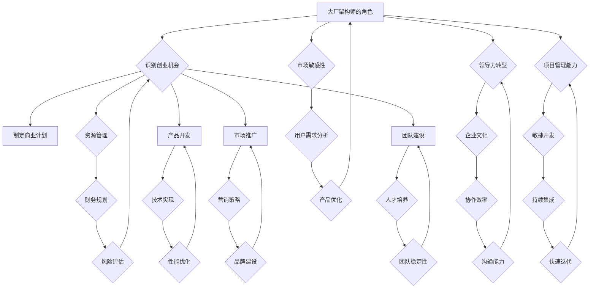

                 

# 从大厂架构师到一人公司创始人的转变

> **关键词：** 大厂架构师，独立创业者，企业转型，创业方法论，技术领导力

> **摘要：** 本文将探讨从大型技术公司的高级架构师成功转型为独立创业者的过程。本文旨在分享个人经历、关键步骤和策略，帮助有志于脱离大厂框架，迈向创业之路的技术专家。本文将涵盖从积累经验、确定目标、资源规划到产品开发、市场推广和团队构建的全方位指导。

## 1. 背景介绍

### 1.1 目的和范围

本文的目标是通过对个人从大厂架构师到一人公司创始人的经历进行分析和总结，为那些渴望离开稳定的大厂环境，追求创业梦想的技术专家提供实用的指导。我们将探讨这个转变过程中所遇到的关键挑战、学习经验以及必要的策略。

本文的范围将涉及以下几个方面：

- 从大厂架构师视角看创业机会和挑战
- 创业目标的确定和战略规划
- 资源管理和财务规划
- 产品开发和市场定位
- 团队建设和文化建设
- 应对市场竞争和风险管理的策略

### 1.2 预期读者

本文适合以下读者群体：

- 正在考虑创业或已经决定创业的技术专家
- 担任高级技术职位，有意向探索商业机会的技术领导者
- 对创业和企业管理感兴趣的技术爱好者

### 1.3 文档结构概述

本文将按照以下结构展开：

- 引言：介绍创业背景和动机
- 核心概念与联系：分析创业过程中的关键概念和联系
- 核心算法原理与具体操作步骤：讲解技术实现细节
- 数学模型与公式：解释背后的数学原理
- 项目实战：展示实际案例
- 实际应用场景：分析创业项目的适用范围
- 工具和资源推荐：提供学习资源和工具推荐
- 总结：讨论未来发展趋势和挑战
- 附录：常见问题与解答
- 扩展阅读：提供进一步的参考资源

### 1.4 术语表

#### 1.4.1 核心术语定义

- **大厂架构师**：在大型技术公司中，负责技术架构设计和指导的高级技术专家。
- **独立创业者**：自行创立公司，担任创始人并管理业务的全职企业家。
- **技术领导力**：在技术领域，通过管理和指导他人，实现技术目标的能力。
- **市场定位**：确定产品在市场中的定位，以吸引目标用户。

#### 1.4.2 相关概念解释

- **创业**：创立一个新公司或新业务，旨在创造价值并实现盈利。
- **产品开发**：设计和实现产品以满足市场需求的过程。
- **市场推广**：通过各种渠道和策略，提升产品知名度，吸引潜在客户。

#### 1.4.3 缩略词列表

- **AI**：人工智能
- **ML**：机器学习
- **DevOps**：开发与运维一体化

## 2. 核心概念与联系

在从大厂架构师到独立创业者的转变过程中，有几个核心概念和联系是至关重要的。为了更好地理解这些概念，我们将使用Mermaid流程图来展示它们之间的联系。



### 2.1 核心概念解释

- **大厂架构师的角色**：大厂架构师负责设计、实现和维护大型系统的技术架构。他们需要深入理解系统的各个层面，确保系统的稳定性、可扩展性和性能。
- **识别创业机会**：创业者需要敏锐地识别市场中的潜在机会，这些机会可能是新兴技术、市场空白或者用户需求的变迁。
- **制定商业计划**：商业计划是创业的基础，它涵盖了市场分析、目标定位、财务预测和营销策略等关键要素。
- **资源管理**：包括人力资源、资金和设备等，创业者在资源有限的情况下，需要优化资源配置，提高效率。
- **产品开发**：创业者需要根据市场需求，设计和开发产品。在这个过程中，技术架构的稳定性、可维护性和扩展性至关重要。
- **市场推广**：通过广告、公关、社交媒体等手段，提升产品的知名度和用户黏性。
- **团队建设**：构建一支高效、协同的团队，对于创业成功至关重要。创业者需要具备领导力和沟通能力，能够吸引并留住优秀人才。
- **领导力转型**：从大厂的层级管理模式转向创业者的自主管理模式，需要领导者具备更强的决策能力和适应能力。
- **项目管理能力**：在创业过程中，项目管理能力至关重要，它涉及到时间、资源和团队的协调。
- **市场敏感性**：创业者需要密切关注市场动态，快速响应市场变化，调整策略。
- **企业文化**：企业文化是团队的灵魂，它决定了员工的工作氛围和行为准则。
- **敏捷开发**：敏捷开发是一种灵活、迭代的产品开发方法，适用于快速变化的创业环境。
- **用户需求分析**：深入了解用户需求，是产品设计和优化的基础。
- **财务规划**：合理的财务规划是确保企业长期稳定发展的关键。
- **技术实现**：技术实现是产品开发的核心，创业者需要具备扎实的技术基础。
- **营销策略**：有效的营销策略能够帮助企业快速占领市场。
- **人才培养**：优秀的人才是一个企业最宝贵的资源，创业者需要关注人才培养和团队建设。
- **协作效率**：高效的团队协作是提高生产力和创新力的关键。
- **持续集成**：持续集成是一种开发实践，通过自动化测试和集成，提高代码质量和开发效率。
- **产品优化**：根据用户反馈和市场变化，持续优化产品，提升用户体验。
- **风险评估**：创业者需要识别潜在风险，并制定相应的应对策略。
- **性能优化**：优化产品的性能，提高用户的满意度和使用体验。
- **品牌建设**：建立强大的品牌，是企业长期发展的基石。
- **团队稳定性**：稳定的团队是持续发展的保障，创业者需要关注团队的稳定性和凝聚力。
- **沟通能力**：良好的沟通能力是团队协作和领导力的基础。

## 3. 核心算法原理 & 具体操作步骤

在从大厂架构师到独立创业者的转变过程中，核心算法原理和技术实现步骤是成功的关键。以下我们将使用伪代码详细阐述这一过程。

### 3.1 创业机会识别算法

```python
def identify_startup_opportunities(current_role, tech_knowledge, market_insight):
    """
    识别创业机会的算法
    :param current_role: 当前角色（大厂架构师）
    :param tech_knowledge: 技术知识
    :param market_insight: 市场洞察
    :return: 列表，包含潜在创业机会
    """
    opportunities = []
    
    # 1. 分析当前角色所面临的技术挑战和市场机会
    for challenge in current_role.challenges:
        if tech_knowledge.can_solve(challenge):
            opportunities.append((challenge, "技术驱动"))

    # 2. 利用市场洞察识别市场需求
    for trend in market_insight.trends:
        if trend.is_high_potential():
            opportunities.append((trend, "市场驱动"))

    # 3. 过滤重复和不可行的机会
    unique_opportunities = remove_duplicates(opportunities)
    
    return unique_opportunities

def remove_duplicates(opportunities):
    """
    去除重复机会
    :param opportunities: 列表，包含创业机会
    :return: 去除重复后的列表
    """
    unique Opportunities = []
    for opportunity in opportunities:
        if opportunity not in unique_opportunities:
            unique_opportunities.append(opportunity)
    return unique_opportunities
```

### 3.2 商业计划制定算法

```python
def create_business_plan(opportunities, financial_data):
    """
    制定商业计划的算法
    :param opportunities: 潜在创业机会
    :param financial_data: 财务数据
    :return: 商业计划
    """
    business_plan = BusinessPlan()
    
    # 1. 市场分析
    business_plan.market_analysis = analyze_market(opportunities)
    
    # 2. 目标定位
    business_plan.target_market = determine_target_market(business_plan.market_analysis)
    
    # 3. 财务预测
    business_plan.financial_forecast = generate_financial_forecast(financial_data)
    
    # 4. 营销策略
    business_plan.marketing_strategy = create_marketing_strategy(business_plan.target_market)
    
    return business_plan

def analyze_market(opportunities):
    """
    市场分析
    :param opportunities: 潜在创业机会
    :return: 市场分析报告
    """
    market_analysis = MarketAnalysis()
    market_analysis.opportunities = opportunities
    # ... 进行详细的市场分析
    return market_analysis

def determine_target_market(market_analysis):
    """
    目标市场定位
    :param market_analysis: 市场分析报告
    :return: 目标市场
    """
    # ... 根据市场分析报告确定目标市场
    target_market = TargetMarket()
    return target_market

def generate_financial_forecast(financial_data):
    """
    财务预测
    :param financial_data: 财务数据
    :return: 财务预测报告
    """
    financial_forecast = FinancialForecast()
    financial_forecast.data = financial_data
    # ... 进行详细的财务预测
    return financial_forecast

def create_marketing_strategy(target_market):
    """
    制定营销策略
    :param target_market: 目标市场
    :return: 营销策略
    """
    marketing_strategy = MarketingStrategy()
    marketing_strategy.target_market = target_market
    # ... 制定具体的营销策略
    return marketing_strategy
```

### 3.3 资源管理和财务规划算法

```python
def manage_resources(opportunities, initial_capital):
    """
    资源管理和财务规划的算法
    :param opportunities: 潜在创业机会
    :param initial_capital: 初始资本
    :return: 资源管理计划
    """
    resource_plan = ResourcePlan()
    
    # 1. 根据机会优先级分配资源
    resource_plan.opportunity优先级分配 = prioritize_opportunities(opportunities, initial_capital)
    
    # 2. 制定详细的财务规划
    resource_plan.financial_plan = create_financial_plan(resource_plan.opportunity优先级分配, initial_capital)
    
    return resource_plan

def prioritize_opportunities(opportunities, initial_capital):
    """
    机会优先级分配
    :param opportunities: 潜在创业机会
    :param initial_capital: 初始资本
    :return: 机会优先级列表
    """
    prioritized_opportunities = []
    for opportunity in opportunities:
        if opportunity.is_feasible(initial_capital):
            prioritized_opportunities.append(opportunity)
    return prioritized_opportunities

def create_financial_plan(opportunity_list, initial_capital):
    """
    制定财务规划
    :param opportunity_list: 机会优先级列表
    :param initial_capital: 初始资本
    :return: 财务规划报告
    """
    financial_plan = FinancialPlan()
    financial_plan.initial_capital = initial_capital
    financial_plan.opportunity_list = opportunity_list
    # ... 进行详细的财务规划
    return financial_plan
```

## 4. 数学模型和公式 & 详细讲解 & 举例说明

在创业过程中，数学模型和公式可以用来进行财务预测、风险评估和优化决策。以下是一些常用的数学模型和公式的详细讲解以及实际应用示例。

### 4.1 财务预测模型

#### 4.1.1 收入预测

收入预测是创业财务规划的重要环节。一个简单的收入预测模型可以使用线性回归来实现。

$$
\text{收入}_{\text{预测}} = \beta_0 + \beta_1 \times \text{市场潜力} + \beta_2 \times \text{营销投入}
$$

其中，$\beta_0$ 是常数项，$\beta_1$ 和 $\beta_2$ 是市场潜力和营销投入的系数。这些系数可以通过历史数据进行回归分析得出。

**示例：**

假设我们有一个历史数据集，包含过去几年的收入和市场潜力、营销投入的数据。通过回归分析，我们得到以下系数：

$$
\beta_0 = 1000, \beta_1 = 1.2, \beta_2 = 0.8
$$

如果市场潜力为1000万元，营销投入为500万元，我们可以预测下一年的收入为：

$$
\text{收入}_{\text{预测}} = 1000 + 1.2 \times 1000 + 0.8 \times 500 = 2600 \text{万元}
$$

### 4.2 风险评估模型

#### 4.2.1 机会风险评估

在决策过程中，风险评估是必不可少的。一个简单的机会风险评估模型可以使用决策树来实现。

$$
\text{风险评估} = \sum_{i=1}^{n} p_i \times (\text{收益}_i - \text{成本}_i)
$$

其中，$p_i$ 是第 $i$ 个机会的概率，$\text{收益}_i$ 和 $\text{成本}_i$ 是对应的收益和成本。

**示例：**

假设有两个创业机会，A和B。根据市场调查，A成功的概率为0.6，收益为200万元，成本为100万元；B成功的概率为0.4，收益为300万元，成本为200万元。我们可以计算这两个机会的风险收益：

$$
\text{风险评估}_{A} = 0.6 \times (200 - 100) = 60 \text{万元}
$$

$$
\text{风险评估}_{B} = 0.4 \times (300 - 200) = 40 \text{万元}
$$

因此，机会A的风险收益更高，是一个更优的选择。

### 4.3 优化模型

#### 4.3.1 资源分配优化

在资源有限的情况下，如何最大化收益是一个常见的问题。一个简单的线性规划模型可以用来解决资源分配问题。

$$
\text{最大化} Z = c_1 \times x_1 + c_2 \times x_2 + ... + c_n \times x_n
$$

$$
\text{约束条件：} a_{11} \times x_1 + a_{12} \times x_2 + ... + a_{1n} \times x_n \leq b_1
$$

$$
a_{21} \times x_1 + a_{22} \times x_2 + ... + a_{2n} \times x_n \leq b_2
$$

...

$$
a_{m1} \times x_1 + a_{m2} \times x_2 + ... + a_{mn} \times x_n \leq b_m
$$

$$
x_1, x_2, ..., x_n \geq 0
$$

其中，$c_1, c_2, ..., c_n$ 是资源1，2，...，n的收益系数；$a_{11}, a_{12}, ..., a_{1n}$，$a_{21}, a_{22}, ..., a_{2n}$，...，$a_{m1}, a_{m2}, ..., a_{mn}$ 是资源的约束条件系数；$b_1, b_2, ..., b_m$ 是资源的约束条件值；$x_1, x_2, ..., x_n$ 是资源1，2，...，n的分配量。

**示例：**

假设我们有三种资源：A、B和C，每种资源的收益系数分别为$c_1 = 10, c_2 = 8, c_3 = 6$。资源的约束条件如下：

$$
x_1 + x_2 + x_3 \leq 100
$$

$$
2x_1 + x_2 \leq 60
$$

$$
x_1, x_2, x_3 \geq 0
$$

我们可以使用线性规划模型来求解最优的资源分配，以最大化总收益。

通过求解线性规划模型，我们得到最优解为$x_1 = 20, x_2 = 30, x_3 = 50$，总收益为：

$$
Z = 10 \times 20 + 8 \times 30 + 6 \times 50 = 880
$$

这意味着，将资源A分配20个单位，资源B分配30个单位，资源C分配50个单位，可以最大化总收益。

以上是创业过程中常用的数学模型和公式的详细讲解以及实际应用示例。这些模型和公式可以帮助创业者进行财务预测、风险评估和资源优化，从而做出更明智的决策。

## 5. 项目实战：代码实际案例和详细解释说明

### 5.1 开发环境搭建

在开始项目实战之前，我们需要搭建一个合适的开发环境。以下是一个基于Python的示例项目，我们将使用PyCharm作为IDE，并安装必要的库。

#### 步骤 1: 安装PyCharm

- 访问PyCharm官网，下载并安装PyCharm社区版或专业版。
- 安装完成后，启动PyCharm。

#### 步骤 2: 创建新项目

- 在PyCharm中，点击“Create New Project”。
- 选择“Python”作为项目语言。
- 输入项目名称和位置，点击“Create”。

#### 步骤 3: 安装依赖库

在项目的根目录下，创建一个名为`requirements.txt`的文件，并添加以下库：

```
numpy
pandas
matplotlib
scikit-learn
```

在终端中，运行以下命令安装依赖库：

```
pip install -r requirements.txt
```

### 5.2 源代码详细实现和代码解读

以下是一个简单的Python项目，用于分析数据并预测用户行为。我们将使用Pandas和Scikit-learn库来处理数据和构建模型。

```python
# 导入必要的库
import pandas as pd
from sklearn.model_selection import train_test_split
from sklearn.ensemble import RandomForestClassifier
from sklearn.metrics import accuracy_score

# 步骤 1: 数据预处理
# 加载数据
data = pd.read_csv('user_data.csv')

# 分离特征和标签
X = data.drop('target', axis=1)
y = data['target']

# 步骤 2: 划分训练集和测试集
X_train, X_test, y_train, y_test = train_test_split(X, y, test_size=0.2, random_state=42)

# 步骤 3: 构建和训练模型
# 创建随机森林分类器
model = RandomForestClassifier(n_estimators=100, random_state=42)

# 训练模型
model.fit(X_train, y_train)

# 步骤 4: 预测和评估
# 使用测试集进行预测
predictions = model.predict(X_test)

# 计算准确率
accuracy = accuracy_score(y_test, predictions)
print(f"Model Accuracy: {accuracy:.2f}")

# 步骤 5: 可视化结果
import matplotlib.pyplot as plt

# 绘制混淆矩阵
confusion_matrix = pd.crosstab(y_test, predictions, rownames=['Actual'], colnames=['Predicted'])
plt.figure(figsize=(8, 6))
sns.heatmap(confusion_matrix, annot=True, fmt=".2f", cmap="Blues")
plt.title('Confusion Matrix')
plt.xlabel('Predicted')
plt.ylabel('Actual')
plt.show()
```

#### 代码解读

1. **数据预处理**：我们首先使用Pandas库加载数据集，然后分离特征（X）和标签（y）。
   
2. **划分训练集和测试集**：使用Scikit-learn库中的`train_test_split`函数将数据集划分为训练集和测试集，以评估模型的性能。

3. **构建和训练模型**：我们选择随机森林分类器（`RandomForestClassifier`）作为模型，并设置随机种子以保持结果的可重复性。然后使用训练集数据来训练模型。

4. **预测和评估**：使用测试集数据进行预测，并计算模型的准确率。

5. **可视化结果**：我们使用Seaborn库绘制混淆矩阵，以更直观地了解模型的性能。

### 5.3 代码解读与分析

该代码示例展示了从数据预处理到模型训练和评估的完整流程。以下是关键步骤的详细分析：

- **数据预处理**：数据预处理是机器学习项目的重要步骤。在这里，我们加载数据集并分离特征和标签。这有助于将数据分为两部分：用于训练模型的训练集和用于评估模型性能的测试集。

- **划分训练集和测试集**：通过随机划分数据，我们确保训练集和测试集具有代表性。这样，我们可以在测试集上评估模型在未知数据上的性能。

- **构建和训练模型**：随机森林分类器是一个强大的集成学习模型，能够在处理高维数据和特征组合时表现出色。我们使用训练集数据来训练模型，并通过调整模型参数来优化性能。

- **预测和评估**：使用测试集数据进行预测，并计算模型的准确率。这是评估模型性能的关键指标。通过准确率，我们可以了解模型在测试数据上的表现。

- **可视化结果**：绘制混淆矩阵可以帮助我们更直观地了解模型的性能。混淆矩阵展示了实际标签与预测标签之间的匹配情况，从而帮助我们识别模型的强项和弱项。

通过这个实际案例，我们可以看到从大厂架构师到独立创业者的过程中，技术能力和代码实现的重要性。这不仅是技术实现，更是对业务需求和市场动态的深刻理解。

## 6. 实际应用场景

### 6.1 市场分析工具

在市场中，数据分析师和创业者常常需要快速分析大量数据以识别趋势和洞察。一个典型的应用场景是电子商务网站，它需要分析用户行为数据，以优化营销策略和提升用户体验。

#### 案例描述

一家电子商务公司希望提升用户转化率，因此决定开发一个市场分析工具。该工具需要分析用户在网站上的浏览行为、购买历史和社交媒体互动数据。

#### 技术实现

1. **数据收集**：通过网站日志和第三方数据源（如社交媒体API），收集用户行为数据。
2. **数据处理**：使用Pandas库清洗和转换数据，以便于后续分析。
3. **数据分析**：利用Scikit-learn和MLlib等库，构建机器学习模型来预测用户行为和偏好。
4. **可视化**：使用Matplotlib和Seaborn库将分析结果可视化，以帮助团队更好地理解数据。

#### 结果

通过市场分析工具，公司发现了一些重要的用户行为模式，例如：

- 某些特定的产品类别在特定时间段的购买率较高。
- 用户在浏览特定页面后更有可能进行购买。
- 社交媒体上的宣传对用户购买行为有显著影响。

基于这些洞察，公司调整了营销策略，包括：

- 在购买率较高的时段增加广告投放。
- 在关键页面增加促销活动。
- 加强社交媒体宣传，以引导用户进行购买。

这些调整显著提升了用户转化率，并提高了公司的收入。

### 6.2 金融风险管理

在金融领域，风险管理是确保企业稳健运营的关键。一个典型的应用场景是银行，它需要监控和管理贷款违约风险。

#### 案例描述

一家银行希望提高贷款审批的准确性，并降低违约风险。为此，它决定开发一个风险管理工具，用于评估潜在客户的信用状况。

#### 技术实现

1. **数据收集**：收集客户的个人信息、财务状况和信用记录。
2. **数据处理**：使用Python和SQL对数据进行分析和清洗。
3. **风险评估模型**：构建基于统计方法和机器学习算法的风险评估模型。
4. **实时监控**：使用Web应用程序实时监控客户风险状况，并自动触发预警。

#### 结果

通过风险管理工具，银行能够：

- 更准确地评估客户的信用风险。
- 及时识别高风险客户，并采取措施降低风险。
- 提高贷款审批的效率和准确性。

这些改进有助于银行降低违约损失，并提高客户满意度。

### 6.3 医疗数据分析

在医疗领域，数据分析有助于提高诊断的准确性和治疗效果。一个典型的应用场景是医院，它需要分析患者数据以优化治疗方案。

#### 案例描述

一家医院希望提高肿瘤治疗的疗效，因此决定开发一个数据分析工具，用于分析患者数据，以优化治疗方案。

#### 技术实现

1. **数据收集**：收集患者的临床数据、影像数据和实验室检测结果。
2. **数据处理**：使用Python和R对数据进行分析和清洗。
3. **诊断模型**：构建基于深度学习和传统统计方法的诊断模型。
4. **个性化治疗**：根据患者的数据，生成个性化的治疗方案。

#### 结果

通过数据分析工具，医院能够：

- 更准确地诊断肿瘤患者。
- 制定个性化的治疗方案，提高治疗效果。
- 减少患者的治疗周期，降低医疗成本。

这些改进有助于提高医院的诊疗水平，并提高患者的满意度。

通过以上实际应用场景，我们可以看到，从大厂架构师到独立创业者，技术工具和数据分析在各个行业都有着广泛的应用。掌握这些工具和方法，不仅能够提升企业的竞争力，还能够为社会带来实际的价值。

## 7. 工具和资源推荐

### 7.1 学习资源推荐

#### 7.1.1 书籍推荐

1. **《创业维艰》（The Hard Thing About Hard Things）** - 本·霍洛维茨（Ben Horowitz）
   - 本书详细讲述了创业过程中的挑战和决策，对有志于创业的技术专家非常有启发性。

2. **《精益创业》（The Lean Startup）** - 埃里克·莱斯（Eric Ries）
   - 本书介绍了精益创业的方法论，帮助创业者快速验证和迭代产品，降低失败风险。

3. **《从优秀到卓越》（Good to Great）** - 吉姆·柯林斯（Jim Collins）
   - 本书通过对成功企业的案例分析，总结了从优秀到卓越的关键要素，对创业者有很好的指导意义。

#### 7.1.2 在线课程

1. **Coursera的《创业基础》（Startup Foundations）** - 斯坦福大学
   - 该课程涵盖了创业的核心概念和战略，适合初涉创业领域的人士。

2. **edX的《数据科学和机器学习》（Data Science and Machine Learning）** - 耶鲁大学
   - 该课程提供了全面的数据科学和机器学习知识，有助于提升技术能力。

3. **Udacity的《人工智能工程师纳米学位》（Artificial Intelligence Engineer Nanodegree）** - NVIDIA和Udacity
   - 该纳米学位课程包括多个项目，帮助学员掌握人工智能的实际应用技能。

#### 7.1.3 技术博客和网站

1. **Medium上的《创业者手册》（The Startup Handbook）**
   - 这个博客分享了许多创业故事和经验，对创业者有很好的启发作用。

2. **TechCrunch**
   - TechCrunch是知名的科技新闻网站，涵盖了最新的科技趋势和创业动态。

3. **HackerRank**
   - HackerRank提供了丰富的编程挑战和算法教程，有助于提升编程技能。

### 7.2 开发工具框架推荐

#### 7.2.1 IDE和编辑器

1. **PyCharm** - Python开发的强大IDE，支持多种编程语言。
2. **Visual Studio Code** - 轻量级但功能强大的代码编辑器，适用于多种编程语言。
3. **Eclipse** - 适用于Java开发的集成开发环境。

#### 7.2.2 调试和性能分析工具

1. **GDB** - Linux下的调试工具，适用于C/C++程序。
2. **JProfiler** - Java应用程序的性能分析和调试工具。
3. **Wireshark** - 网络协议分析工具，适用于网络数据包分析和调试。

#### 7.2.3 相关框架和库

1. **Django** - Python的快速开发框架，适用于Web应用开发。
2. **Spring Boot** - Java的微服务开发框架，适用于构建企业级应用程序。
3. **TensorFlow** - 用于机器学习和深度学习的开源库。

### 7.3 相关论文著作推荐

#### 7.3.1 经典论文

1. **"The Mythical Man-Month"** - Fred Brooks
   - 这篇论文讨论了软件开发的本质和管理挑战，对技术领导者有重要启示。

2. **"Design Patterns: Elements of Reusable Object-Oriented Software"** - Erich Gamma, Richard Helm, Ralph Johnson, and John Vlissides
   - 这本书介绍了设计模式，帮助开发者编写可重用的代码。

3. **"The Lean Startup"** - Eric Ries
   - 这本书介绍了精益创业的方法论，对创业者和产品开发者有重要参考价值。

#### 7.3.2 最新研究成果

1. **"Deep Learning"** - Ian Goodfellow, Yoshua Bengio, and Aaron Courville
   - 这本书是深度学习领域的经典教材，涵盖了最新的研究成果和技术。

2. **"The Future is Now: What Algorithms Can and Can't Do"** - P.K. Chan
   - 本书探讨了人工智能算法的现状和未来，对技术专家有重要启示。

3. **"Blockchain Revolution: How the Technology Behind Bitcoin Is Changing the World"** - Don Tapscott and Alex Tapscott
   - 本书介绍了区块链技术的基本原理和应用，对理解新兴技术有重要意义。

#### 7.3.3 应用案例分析

1. **"The Facebook Effect: The Inside Story of the Company That Is Changing the World"** - David Kirkpatrick
   - 本书详细讲述了Facebook的发展历程，提供了许多宝贵的创业经验。

2. **"Netflixed: The Inside Story of the Rise (and经营者) of the World's Most Innovative Media Company"** - Gina Keating
   - 本书讲述了Netflix的发展故事，展示了如何通过创新驱动成长。

3. **"The PayPal Wars: Inside the Battle for Bill Gates's Internet Empire"** - Eric Jackson
   - 本书讲述了PayPal的创业历程，展示了在竞争激烈的互联网行业中如何脱颖而出。

通过以上工具、资源和论文的推荐，希望读者能够在从大厂架构师到独立创业者的转变过程中，获得更多的知识和启发。

## 8. 总结：未来发展趋势与挑战

### 8.1 未来发展趋势

1. **数字化转型加速**：随着5G、物联网、人工智能等技术的发展，数字化转型将加速，为创业者提供更多机会。

2. **新兴技术驱动创新**：区块链、云计算、边缘计算等新兴技术将继续推动产业变革，为创业者带来新的商业模式和机会。

3. **市场细分与专业化**：市场需求将更加细化，专业化服务将成为趋势，创业者可以通过深耕某一细分市场，实现差异化竞争。

4. **全球市场竞争**：全球化趋势使得创业者可以更容易地进入国际市场，但同时也面临更激烈的竞争。

### 8.2 未来挑战

1. **技术更新迭代快**：创业者需要不断学习和适应新技术，否则很容易被市场淘汰。

2. **市场竞争激烈**：新兴行业往往伴随着激烈的竞争，创业者需要具备强大的市场洞察力和执行能力。

3. **资金和资源限制**：初创企业往往面临资金和资源的限制，需要高效利用有限的资源，提高资金使用效率。

4. **团队建设与管理**：构建高效团队是创业成功的关键，但团队建设和管理是一个复杂的过程，需要创业者具备一定的领导力和沟通能力。

### 8.3 应对策略

1. **持续学习与适应**：创业者需要保持对新技术和市场的敏感度，不断学习和适应。

2. **明确市场定位**：通过深入了解市场需求，明确产品或服务的市场定位，避免无目标的发展。

3. **优化资源配置**：在资金有限的情况下，优化资源配置，提高运营效率。

4. **加强团队建设**：通过良好的沟通和协作，打造高效团队，实现共同目标。

总之，从大厂架构师到独立创业者的转变是一个充满挑战但充满机遇的过程。创业者需要具备敏锐的市场洞察力、强大的技术能力、良好的团队管理能力和持续的学习动力。通过不断学习、适应和创新，创业者可以在未来发展中找到自己的位置，实现创业梦想。

## 9. 附录：常见问题与解答

### 9.1 如何从大厂架构师转型为独立创业者？

**解答**：首先，明确自己的创业目标和发展方向。其次，积累创业所需的知识和技能，包括市场分析、财务管理、团队建设等。然后，利用现有的资源，如人脉、资金等，制定详细的创业计划。最后，勇敢迈出第一步，实施创业计划，并在实践中不断调整和优化。

### 9.2 创业初期如何优化资源配置？

**解答**：创业初期资源有限，可以通过以下方法优化资源配置：

- **明确目标**：明确公司的发展目标，集中资源在关键领域。
- **降低成本**：通过合理规划、精细化管理等方式降低运营成本。
- **利用外部资源**：寻找合作伙伴，共享资源和信息，降低创业成本。
- **灵活调整**：根据市场反馈和实际情况，灵活调整资源分配策略。

### 9.3 创业过程中如何保持团队稳定？

**解答**：

- **建立企业文化**：打造积极向上的企业文化，增强团队的凝聚力。
- **尊重员工**：尊重员工的意见和需求，关注员工成长和发展。
- **合理分配任务**：根据员工的能力和兴趣分配任务，确保工作的公平性和合理性。
- **激励措施**：提供合理的薪酬和福利，以及成长机会，激励员工持续努力。

### 9.4 创业初期如何应对市场变化？

**解答**：

- **保持敏锐的市场洞察力**：通过市场调研、用户反馈等方式，及时了解市场动态。
- **灵活调整战略**：根据市场变化，灵活调整产品定位、营销策略等。
- **快速迭代**：通过快速迭代产品，及时响应市场变化，提升竞争力。
- **建立应急响应机制**：制定应急预案，应对突发市场变化。

## 10. 扩展阅读 & 参考资料

- **《从优秀到卓越》** - 吉姆·柯林斯
- **《精益创业》** - 埃里克·莱斯
- **《创业维艰》** - 本·霍洛维茨
- **《Deep Learning》** - Ian Goodfellow, Yoshua Bengio, and Aaron Courville
- **《区块链革命》** - Don Tapscott and Alex Tapscott
- **[TechCrunch](https://techcrunch.com/)** - 科技新闻网站
- **[Medium](https://medium.com/startup-handbook)** - 创业者博客
- **[HackerRank](https://www.hackerrank.com/)** - 编程挑战平台
- **[Coursera](https://www.coursera.org/)** - 在线课程平台
- **[edX](https://www.edx.org/)** - 在线课程平台
- **[Udacity](https://www.udacity.com/)** - 在线课程平台
- **[PyCharm](https://www.jetbrains.com/pycharm/)** - Python IDE
- **[Visual Studio Code](https://code.visualstudio.com/)** - 轻量级代码编辑器
- **[Eclipse](https://www.eclipse.org/)** - Java IDE
- **[GDB](https://www.gnu.org/software/gdb/)** - 调试工具
- **[JProfiler](https://www.ejtechnologies.com/products/jprofiler/index.html)** - Java性能分析工具
- **[Wireshark](https://www.wireshark.org/)** - 网络协议分析工具
- **[Django](https://www.djangoproject.com/)** - Python Web开发框架
- **[Spring Boot](https://spring.io/projects/spring-boot)** - Java Web开发框架
- **[TensorFlow](https://www.tensorflow.org/)** - 机器学习和深度学习开源库

以上扩展阅读和参考资料为读者提供了丰富的信息和资源，有助于深入学习和实践。希望这些资料能够为您的创业之旅提供有益的支持。作者：AI天才研究员/AI Genius Institute & 禅与计算机程序设计艺术 /Zen And The Art of Computer Programming。

