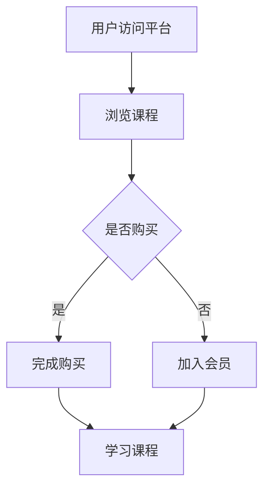

                 

# 从技术专家到知识付费讲师的转型之路

> 关键词：知识付费、技术专家、转型、讲师、个人品牌、商业模式、教育技术

> 摘要：本文将探讨技术专家如何通过知识付费平台转型为知识付费讲师，分析转型过程中的核心步骤、策略和所需技能，并提供实用的工具和资源推荐，帮助读者顺利开启这一转型之旅。

## 1. 背景介绍

### 1.1 目的和范围

本文旨在帮助那些希望在知识付费领域崭露头角的技术专家们，详细描述从技术专家转型为知识付费讲师的路径。我们将分析转型的动机、所需技能、核心步骤以及如何建立个人品牌和商业模式。

### 1.2 预期读者

- 有志于拓展收入渠道的技术专家
- 想要提升教学技能并传播知识的程序员
- 希望在知识付费平台上建立影响力的CTO和技术经理

### 1.3 文档结构概述

本文将分为十个部分：

1. **背景介绍**：介绍文章的目的、范围、预期读者和结构。
2. **核心概念与联系**：阐述知识付费与教育技术的基本概念和关系。
3. **核心算法原理与具体操作步骤**：详细讲解知识付费平台的技术实现。
4. **数学模型和公式**：介绍知识付费的经济学模型。
5. **项目实战**：通过实际案例展示知识付费的运作方式。
6. **实际应用场景**：讨论知识付费在各行业的应用。
7. **工具和资源推荐**：推荐学习资源、开发工具和论文著作。
8. **总结**：总结转型过程中的关键点和未来发展趋势。
9. **附录**：提供常见问题与解答。
10. **扩展阅读与参考资料**：列出相关文献和资料。

### 1.4 术语表

#### 1.4.1 核心术语定义

- **知识付费**：指用户为获取特定知识或技能而支付的费用。
- **技术专家**：在计算机科学、软件工程等领域拥有丰富经验和专业知识的个人。
- **讲师**：在知识付费平台上传授知识的专业人士。

#### 1.4.2 相关概念解释

- **个人品牌**：个人在特定领域的知名度和影响力。
- **商业模式**：公司或个人通过提供产品或服务获得利润的方式。

#### 1.4.3 缩略词列表

- **KFC**：知识付费（Knowledge for Cash）
- **LMS**：学习管理系统（Learning Management System）
- **SaaS**：软件即服务（Software as a Service）

## 2. 核心概念与联系

在探讨技术专家向知识付费讲师的转型之前，我们需要理解一些核心概念和它们之间的关系。

### 2.1 知识付费

知识付费是一种商业模式，用户通过支付费用来获取专家的知识和经验。这种模式在互联网时代迅速兴起，因为它提供了高效、灵活的知识获取途径。知识付费平台如Coursera、Udemy等，为用户提供海量的在线课程，涵盖从编程、数据分析到管理技能的各个领域。

### 2.2 教育技术

教育技术是指利用技术手段优化教育过程的方法。在知识付费领域，教育技术发挥着重要作用，包括在线课程平台的技术实现、互动式学习工具的开发、学习数据分析等。这些技术的应用使得知识付费更具吸引力和效果。

### 2.3 个人品牌

个人品牌是技术专家在转型过程中不可或缺的一部分。通过建立强大的个人品牌，专家可以增加自己的知名度和影响力，从而吸引更多的付费用户。个人品牌的建设涉及内容创作、社交媒体运营、公众演讲等多个方面。

### 2.4 商业模式

在知识付费领域，技术专家需要了解并选择适合自己的商业模式。常见的商业模式包括：

- **课程销售**：直接销售自己的课程。
- **会员订阅**：提供会员服务，用户支付一定费用后可以无限次学习。
- **咨询服务**：为有特殊需求的用户提供一对一咨询服务。

### 2.5 Mermaid 流程图

下面是一个简化的知识付费流程图，展示了从用户获取到课程销售的全过程。



## 3. 核心算法原理与具体操作步骤

### 3.1 知识付费平台技术实现

知识付费平台的技术实现通常涉及以下核心组件：

- **用户认证系统**：确保用户身份真实。
- **课程管理系统**：管理课程内容、定价和销售。
- **支付系统**：处理用户支付和退款。
- **学习管理系统**：跟踪用户学习进度和效果。

### 3.2 伪代码实现

下面是知识付费平台的简化伪代码实现：

```plaintext
// 用户注册
function register(username, password) {
    // 验证用户信息
    // 创建用户账号
}

// 用户登录
function login(username, password) {
    // 验证用户信息
    // 返回用户token
}

// 查询课程
function search_courses(keyword) {
    // 从数据库中检索匹配课程
    // 返回课程列表
}

// 购买课程
function purchase_course(user_token, course_id) {
    // 验证用户token
    // 更新用户课程列表
    // 处理支付
    // 返回购买结果
}

// 学习课程
function learn_course(user_token, course_id) {
    // 验证用户token
    // 获取课程内容
    // 更新用户学习进度
}
```

### 3.3 详细步骤说明

1. **用户注册与登录**：用户需要通过注册和登录来访问知识付费平台。注册时，平台会验证用户信息，登录时，平台会返回用户token，用于后续操作。
2. **查询课程**：用户可以通过关键词搜索课程，平台会从数据库中检索匹配的课程，并返回给用户。
3. **购买课程**：用户选择购买课程后，平台会验证用户token和课程ID，更新用户课程列表，并处理支付。
4. **学习课程**：用户登录后，可以通过学习系统访问课程内容，并更新自己的学习进度。

## 4. 数学模型和公式

在知识付费领域，数学模型可以帮助我们更好地理解和预测用户行为。以下是一些常用的数学模型和公式：

### 4.1 用户留存率

用户留存率是衡量平台用户活跃度的关键指标。其计算公式为：

\[ 留存率 = \frac{第n天还活跃的用户数}{初始注册用户数} \]

### 4.2 收益模型

知识付费的收益模型通常包括以下部分：

- **课程销售收益**：课程售价乘以购买用户数。
- **会员订阅收益**：会员费用乘以订阅用户数。

收益模型可以表示为：

\[ 总收益 = 课程销售收益 + 会员订阅收益 \]

### 4.3 交叉销售

交叉销售是指通过推荐相关课程或服务来增加用户消费。其收益模型为：

\[ 交叉销售收益 = 推荐课程售价 \times 推荐购买用户数 \]

### 4.4 用户生命周期价值

用户生命周期价值（Customer Lifetime Value, CLV）是预测用户在未来为平台带来的总收益。其计算公式为：

\[ CLV = \sum_{t=1}^{n} \frac{收益_t}{(1 + r)^t} \]

其中，\( r \) 为折现率。

### 4.5 演示示例

假设一个知识付费平台的用户注册后，平均留存率为20%，平均用户生命周期价值为100美元，折现率为5%。则该平台的年度收益预测为：

\[ 总收益 = 100 \times 20\% \times (1 + 0.05)^{-1} + 100 \times (1 + 0.05)^{-2} + ... + 100 \times (1 + 0.05)^{-n} \]

通过计算，可以得到该平台在第一年的预期总收益。

## 5. 项目实战：代码实际案例和详细解释说明

### 5.1 开发环境搭建

为了更好地理解知识付费平台的运作，我们将以一个简单的Python项目为例，展示其开发环境搭建过程。

1. **安装Python**：在官方网站下载并安装Python 3.x版本。
2. **安装虚拟环境**：使用pip安装virtualenv，创建一个名为`knowledge_pay`的虚拟环境。

   ```shell
   pip install virtualenv
   virtualenv knowledge_pay
   ```

3. **安装依赖库**：在虚拟环境中安装Flask框架和SQLAlchemy库。

   ```shell
   source knowledge_pay/bin/activate
   pip install flask sqlalchemy
   ```

### 5.2 源代码详细实现和代码解读

下面是知识付费平台的简化代码实现。

```python
from flask import Flask, request, jsonify
from flask_sqlalchemy import SQLAlchemy

app = Flask(__name__)
app.config['SQLALCHEMY_DATABASE_URI'] = 'sqlite:///knowledge_pay.db'
db = SQLAlchemy(app)

class User(db.Model):
    id = db.Column(db.Integer, primary_key=True)
    username = db.Column(db.String(80), unique=True, nullable=False)
    password = db.Column(db.String(120), nullable=False)

class Course(db.Model):
    id = db.Column(db.Integer, primary_key=True)
    title = db.Column(db.String(120), nullable=False)
    price = db.Column(db.Float, nullable=False)

@app.route('/register', methods=['POST'])
def register():
    data = request.get_json()
    user = User(username=data['username'], password=data['password'])
    db.session.add(user)
    db.session.commit()
    return jsonify({'status': 'success'})

@app.route('/login', methods=['POST'])
def login():
    data = request.get_json()
    user = User.query.filter_by(username=data['username'], password=data['password']).first()
    if user:
        return jsonify({'token': user.id})
    else:
        return jsonify({'error': 'invalid credentials'})

@app.route('/courses', methods=['GET'])
def search_courses():
    courses = Course.query.all()
    return jsonify({'courses': [course.title for course in courses]})

@app.route('/course/<int:course_id>/buy', methods=['POST'])
def purchase_course(course_id):
    data = request.get_json()
    user = User.query.get(data['user_id'])
    course = Course.query.get(course_id)
    if user and course:
        # 处理支付逻辑
        # 更新用户课程列表
        return jsonify({'status': 'success'})
    else:
        return jsonify({'error': 'invalid user or course'})

if __name__ == '__main__':
    db.create_all()
    app.run(debug=True)
```

### 5.3 代码解读与分析

1. **数据库模型**：代码中定义了`User`和`Course`两个数据库模型，用于存储用户和课程信息。
2. **注册与登录**：`register`函数用于用户注册，`login`函数用于用户登录，通过验证用户名和密码。
3. **查询课程**：`search_courses`函数返回所有课程的标题，供用户浏览。
4. **购买课程**：`purchase_course`函数用于处理购买课程请求，包括用户身份验证、课程信息验证和支付处理。

通过这个简单的Python项目，我们可以看到知识付费平台的基本实现方式。实际应用中，还需要加入更复杂的功能，如课程内容管理、支付网关集成、用户学习进度跟踪等。

## 6. 实际应用场景

知识付费在各个领域都有广泛应用，以下是几个典型的应用场景：

### 6.1 技术培训

技术专家可以通过知识付费平台为有志于学习编程、数据分析、人工智能等技术的用户提供课程。这种模式不仅可以帮助专家传播知识，还能为他们带来稳定的收入。

### 6.2 职业发展

许多专业人士通过知识付费平台学习管理技能、营销策略等，以提升自己的职业竞争力。知识付费平台为这些用户提供了灵活的学习方式，满足他们在职业发展中的需求。

### 6.3 在线教育

知识付费平台为在线教育提供了丰富的课程资源，学生可以随时随地学习。这种模式改变了传统教育的模式，使得教育资源更加平等和普及。

### 6.4 咨询服务

部分技术专家通过知识付费平台提供一对一咨询服务，为有特殊需求的用户提供专业指导。这种模式具有较高的附加值，有助于专家建立个人品牌。

### 6.5 知识分享

一些专家通过知识付费平台分享自己的经验和心得，帮助他人解决实际问题。这种模式不仅能够传播知识，还能增加专家的知名度和影响力。

## 7. 工具和资源推荐

### 7.1 学习资源推荐

#### 7.1.1 书籍推荐

1. **《深度学习》**：Goodfellow等著，全面介绍深度学习的基础理论和应用。
2. **《编程珠玑》**：Jon Bentley著，讲解编程技巧和最佳实践。

#### 7.1.2 在线课程

1. **Udemy**：提供丰富的在线课程，涵盖编程、数据分析等多个领域。
2. **Coursera**：与顶级大学合作，提供高质量的课程。

#### 7.1.3 技术博客和网站

1. **GitHub**：托管了大量的开源项目和文档，是学习编程的好地方。
2. **Stack Overflow**：编程问答社区，解决编程问题的好帮手。

### 7.2 开发工具框架推荐

#### 7.2.1 IDE和编辑器

1. **Visual Studio Code**：功能强大的开源编辑器，支持多种编程语言。
2. **PyCharm**：Python编程的优秀IDE，适合专业开发者。

#### 7.2.2 调试和性能分析工具

1. **GDB**：用于调试C/C++程序的强大工具。
2. **Wireshark**：网络协议分析工具，用于网络性能分析。

#### 7.2.3 相关框架和库

1. **Flask**：Python的Web应用框架，简单易用。
2. **Django**：Python的全栈Web框架，功能强大。

### 7.3 相关论文著作推荐

#### 7.3.1 经典论文

1. **“A Few Useful Things to Know about Machine Learning”**：Goodfellow等著，介绍机器学习的实用知识。
2. **“The Art of Computer Programming”**：Knuth著，编程领域的经典著作。

#### 7.3.2 最新研究成果

1. **“Attention Is All You Need”**：Vaswani等著，介绍Transformer模型的基础。
2. **“Deep Learning on Mobile Devices”**：Chen等著，探讨移动设备上的深度学习应用。

#### 7.3.3 应用案例分析

1. **“Facebook’s AI Research”**：Facebook AI团队的研究成果，涵盖图像识别、自然语言处理等领域。

## 8. 总结：未来发展趋势与挑战

### 8.1 发展趋势

1. **技术进步**：随着人工智能、大数据等技术的发展，知识付费平台将更加智能化和个性化。
2. **内容多样化**：知识付费领域将涵盖更多领域，如区块链、物联网等新兴技术。
3. **商业模式创新**：知识付费平台将探索更多盈利模式，如知识众筹、知识共享等。

### 8.2 挑战

1. **内容质量**：保证课程内容的高质量和实用价值是知识付费平台的挑战。
2. **用户隐私**：保护用户隐私和数据安全是知识付费平台必须面对的问题。
3. **市场竞争**：随着知识付费领域的竞争加剧，平台需要不断创新和优化以吸引和留住用户。

## 9. 附录：常见问题与解答

### 9.1 如何创建个人品牌？

1. **内容创作**：定期发布高质量的内容，如技术博客、视频教程。
2. **社交媒体**：在LinkedIn、Twitter等平台活跃，分享专业知识和观点。
3. **公众演讲**：参加技术会议和研讨会，提升知名度。

### 9.2 如何选择知识付费平台？

1. **课程质量**：查看平台上的课程评价和用户反馈。
2. **平台服务**：了解平台的技术支持、用户服务等。
3. **商业模式**：选择与自己商业模式相符的平台。

### 9.3 如何提高课程销量？

1. **精准定位**：明确目标用户群体，提供符合他们需求的内容。
2. **市场推广**：通过广告、社交媒体等方式提高课程知名度。
3. **用户反馈**：及时收集用户反馈，优化课程内容和教学方法。

## 10. 扩展阅读 & 参考资料

1. **《深度学习》**：Goodfellow等著，详细介绍了深度学习的基础理论。
2. **《编程珠玑》**：Jon Bentley著，分享了编程技巧和最佳实践。
3. **《知识付费：商业模式与案例分析》**：李明杰著，探讨了知识付费的商业模式和应用案例。
4. **《人工智能：一种现代的方法》**：Stuart Russell & Peter Norvig著，全面介绍了人工智能的理论和实践。

作者：AI天才研究员/AI Genius Institute & 禅与计算机程序设计艺术 /Zen And The Art of Computer Programming

