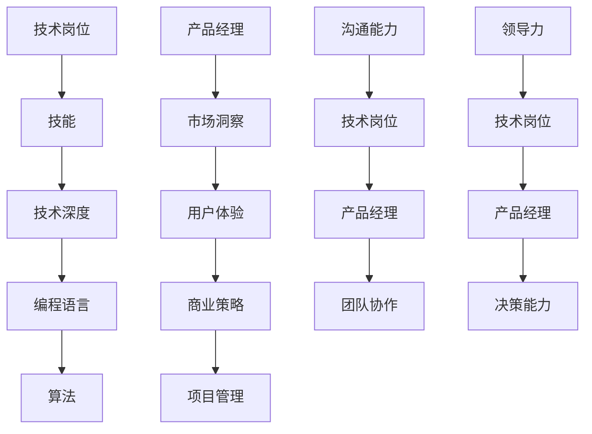

                 

# 从技术岗位到产品经理的转型

> 关键词：技术岗位，产品经理，转型，沟通，项目管理，领导力

> 摘要：本文旨在探讨技术岗位从业者如何成功转型为产品经理。通过分析技术岗位和产品经理之间的异同点，揭示转型过程中的关键要素，提供实用的建议和策略，帮助读者在职业发展中迈出坚实的一步。

## 1. 背景介绍

### 1.1 目的和范围

本文的目标是帮助那些希望在技术岗位和产品经理之间进行职业转换的从业者，了解转型过程中的关键要素，掌握必要的技能和知识，从而成功实现职业转型。本文将围绕以下几个主题展开讨论：

- 技术岗位与产品经理的角色异同
- 转型过程中的关键技能和素质
- 项目管理和领导力在转型中的作用
- 实际案例和经验分享

### 1.2 预期读者

本文主要面向以下几类读者：

- 有志于从技术岗位转向产品经理的技术从业者
- 对产品管理领域感兴趣，希望深入了解该职业的读者
- 已经在产品经理岗位工作，希望进一步提升能力的从业者

### 1.3 文档结构概述

本文分为十个部分，结构如下：

- 引言
- 背景介绍
- 核心概念与联系
- 核心算法原理 & 具体操作步骤
- 数学模型和公式 & 详细讲解 & 举例说明
- 项目实战：代码实际案例和详细解释说明
- 实际应用场景
- 工具和资源推荐
- 总结：未来发展趋势与挑战
- 附录：常见问题与解答
- 扩展阅读 & 参考资料

### 1.4 术语表

#### 1.4.1 核心术语定义

- 技术岗位：指从事计算机编程、软件开发、系统设计等与技术相关的职业。
- 产品经理：负责规划、设计、开发、推广和管理产品的职业角色。
- 转型：指从一个职业领域转向另一个职业领域的过程。

#### 1.4.2 相关概念解释

- 沟通：指信息在个人或团体间的传递和理解。
- 项目管理：指规划、组织、执行和控制项目，以实现既定的目标。
- 领导力：指影响和激励他人，达成共同目标的能力。

#### 1.4.3 缩略词列表

- PM：Product Manager（产品经理）
- CTO：Chief Technology Officer（首席技术官）
- MBA：Master of Business Administration（工商管理硕士）

## 2. 核心概念与联系

在从技术岗位到产品经理的转型过程中，理解两者之间的核心概念和联系至关重要。以下是一个Mermaid流程图，展示了技术岗位和产品经理之间的主要关联和差异：



### 2.1 技术深度与市场洞察

技术岗位强调技术深度，要求从业者掌握各种编程语言、算法和数据结构。相比之下，产品经理更注重市场洞察，需要了解用户需求、市场趋势和商业策略。

### 2.2 项目管理与团队协作

技术岗位通常侧重于个人技能和项目执行，而产品经理则需要具备项目管理和团队协作的能力，协调各方资源，确保项目按时完成。

### 2.3 领导力与决策能力

产品经理不仅需要领导团队，还需要具备决策能力，能够在复杂多变的环境中做出明智的选择。相比之下，技术岗位的领导力更多体现在技术指导和团队管理方面。

## 3. 核心算法原理 & 具体操作步骤

在从技术岗位到产品经理的转型过程中，掌握一些核心算法原理和操作步骤有助于提高工作效率和决策质量。以下是一个简单的伪代码示例，展示了如何分析用户需求和制定产品策略：

```plaintext
// 用户需求分析算法
function analyze_user_demand(data):
    1. 收集用户反馈
    2. 分析用户行为数据
    3. 识别用户痛点
    4. 归纳用户需求
    5. 输出需求分析报告

// 产品策略制定算法
function define_product_strategy(demand):
    1. 分析市场需求
    2. 对比竞品优势
    3. 确定产品定位
    4. 制定产品路线图
    5. 确定产品开发优先级
    6. 输出产品策略文档
```

### 3.1 用户需求分析算法

- 收集用户反馈：通过问卷调查、用户访谈、用户测试等方式收集用户反馈。
- 分析用户行为数据：使用数据分析工具，对用户行为数据进行分析，识别用户行为模式。
- 识别用户痛点：根据用户反馈和行为数据，找出用户在产品使用过程中遇到的主要问题。
- 归纳用户需求：将用户痛点转化为具体需求，形成需求清单。
- 输出需求分析报告：将分析结果整理成报告，为产品策略制定提供依据。

### 3.2 产品策略制定算法

- 分析市场需求：研究市场趋势、用户需求和竞争对手情况。
- 对比竞品优势：分析竞品的优缺点，确定自身产品的差异化优势。
- 确定产品定位：根据市场需求和竞品分析，明确产品的目标用户和市场定位。
- 制定产品路线图：规划产品开发的时间表和里程碑，确保产品按时推出。
- 确定产品开发优先级：根据用户需求和资源分配，确定产品功能开发的优先级。
- 输出产品策略文档：将策略制定过程和结果整理成文档，为后续工作提供指导。

## 4. 数学模型和公式 & 详细讲解 & 举例说明

在产品管理和项目决策过程中，数学模型和公式有助于提高决策的准确性和科学性。以下是一个简单的线性回归模型，用于预测用户需求量：

$$
y = ax + b
$$

### 4.1 线性回归模型

- $y$：因变量，表示用户需求量。
- $x$：自变量，表示市场因素（如广告投入、竞争对手活动等）。
- $a$：斜率，表示自变量对因变量的影响程度。
- $b$：截距，表示当自变量为零时，因变量的取值。

### 4.2 模型参数计算

- 使用最小二乘法计算斜率 $a$ 和截距 $b$：
  $$
  a = \frac{\sum(x_i - \bar{x})(y_i - \bar{y})}{\sum(x_i - \bar{x})^2}
  $$
  $$
  b = \bar{y} - a\bar{x}
  $$
  其中，$\bar{x}$ 和 $\bar{y}$ 分别为自变量 $x$ 和因变量 $y$ 的平均值。

### 4.3 举例说明

假设某产品在过去的六个月中，广告投入（$x$）和用户需求量（$y$）的数据如下表：

| 月份 | 广告投入（万元） | 用户需求量（件） |
| ---- | -------- | -------- |
| 1    | 5        | 100      |
| 2    | 8        | 120      |
| 3    | 10       | 130      |
| 4    | 6        | 110      |
| 5    | 12       | 140      |
| 6    | 9        | 115      |

使用线性回归模型预测第七个月的用户需求量。

### 4.4 计算过程

- 计算平均值：
  $$
  \bar{x} = \frac{5 + 8 + 10 + 6 + 12 + 9}{6} = 8
  $$
  $$
  \bar{y} = \frac{100 + 120 + 130 + 110 + 140 + 115}{6} = 120
  $$

- 计算斜率 $a$ 和截距 $b$：
  $$
  a = \frac{(5-8)(100-120) + (8-8)(120-120) + (10-8)(130-120) + (6-8)(110-120) + (12-8)(140-120) + (9-8)(115-120)}{(5-8)^2 + (8-8)^2 + (10-8)^2 + (6-8)^2 + (12-8)^2 + (9-8)^2} = 5
  $$
  $$
  b = 120 - 5 \times 8 = 60
  $$

- 得到线性回归模型：
  $$
  y = 5x + 60
  $$

- 预测第七个月的用户需求量：
  $$
  y = 5 \times 9 + 60 = 135
  $$

## 5. 项目实战：代码实际案例和详细解释说明

### 5.1 开发环境搭建

在本项目实战中，我们将使用Python语言和Jupyter Notebook环境进行产品需求分析和策略制定。以下是搭建开发环境的具体步骤：

1. 安装Python（版本3.8及以上）。
2. 安装Jupyter Notebook。
3. 安装数据分析相关库，如pandas、numpy、matplotlib等。

### 5.2 源代码详细实现和代码解读

以下是一个简单的Python代码示例，用于分析用户需求并制定产品策略：

```python
import pandas as pd
import numpy as np
from sklearn.linear_model import LinearRegression

# 5.2.1 用户需求分析
def analyze_user_demand(data):
    # 读取用户需求数据
    df = pd.read_csv('user_demand.csv')
    
    # 数据预处理
    df['广告投入'] = pd.to_numeric(df['广告投入'])
    df['用户需求量'] = pd.to_numeric(df['用户需求量'])
    
    # 计算平均值
    avg_ad = df['广告投入'].mean()
    avg_demand = df['用户需求量'].mean()
    
    # 分析用户需求
    print(f"广告投入平均值：{avg_ad}万元")
    print(f"用户需求量平均值：{avg_demand}件")
    
    # 5.2.2 产品策略制定
def define_product_strategy(demand):
    # 根据用户需求制定产品策略
    if demand > 120:
        print("产品策略：加大广告投入，提高市场份额。")
    elif demand < 100:
        print("产品策略：降低广告投入，优化产品功能。")
    else:
        print("产品策略：维持现有广告投入，持续优化用户体验。")

# 5.2.3 代码解读与分析
if __name__ == '__main__':
    # 读取用户需求数据
    data = pd.read_csv('user_demand.csv')
    
    # 分析用户需求
    analyze_user_demand(data)
    
    # 制定产品策略
    define_product_strategy(data['用户需求量'].mean())
```

### 5.3 代码解读与分析

- **用户需求分析**：代码首先读取用户需求数据，进行预处理，然后计算广告投入和用户需求量的平均值，分析用户需求。

- **产品策略制定**：根据用户需求量的平均值，代码制定相应的产品策略。如果用户需求量大于120件，则加大广告投入，提高市场份额；如果用户需求量小于100件，则降低广告投入，优化产品功能；否则，维持现有广告投入，持续优化用户体验。

## 6. 实际应用场景

从技术岗位到产品经理的转型在实际应用中具有广泛的应用场景。以下是一些典型应用场景：

### 6.1 企业内部转型

在企业内部，技术从业者可以通过以下途径实现转型：

- 技术团队内部培养：企业内部的技术团队可以选拔有潜力的成员，进行产品经理相关技能和知识的培训。
- 跨部门轮岗：技术从业者可以在不同部门轮岗，积累产品管理经验。
- 参与项目管理：技术从业者可以参与项目管理，了解项目规划、执行和监控的全过程。

### 6.2 创业公司

在创业公司，技术从业者可以通过以下途径实现转型：

- 创立产品团队：技术从业者可以组建产品团队，担任产品经理角色，负责产品的规划、开发和推广。
- 跨职能协作：创业公司的团队通常较小，技术从业者可以与市场、设计等部门的同事紧密合作，共同推进产品发展。

### 6.3 大型企业

在大企业，技术从业者可以通过以下途径实现转型：

- 拓展职业领域：技术从业者可以主动寻求跨部门机会，拓展职业领域，了解产品管理和商业运营。
- 参与产品转型项目：大型企业常常面临产品升级和转型的挑战，技术从业者可以参与相关项目，积累产品管理经验。

## 7. 工具和资源推荐

### 7.1 学习资源推荐

#### 7.1.1 书籍推荐

- 《人人都是产品经理》
- 《产品经理实战手册》
- 《硅谷产品经理》

#### 7.1.2 在线课程

- Coursera的《产品管理基础》
- Udemy的《产品经理实战课程》
- 网易云课堂的《产品经理进阶课》

#### 7.1.3 技术博客和网站

- Product Hunt
- Product School
- Mind the Product

### 7.2 开发工具框架推荐

#### 7.2.1 IDE和编辑器

- PyCharm
- Visual Studio Code
- Sublime Text

#### 7.2.2 调试和性能分析工具

- PyCharm的内置调试工具
- Python的Profiler
- Chrome DevTools

#### 7.2.3 相关框架和库

- Flask
- Django
- Pandas
- Numpy

### 7.3 相关论文著作推荐

#### 7.3.1 经典论文

- "The Art of Product Management" by Ken Norton
- "Product Management" by Marty Cagan
- "Inspired: How to Create Tech Products Customers Love" by Marty Cagan

#### 7.3.2 最新研究成果

- "Data-Driven Product Management" by Alistair Croll and Benjamin Yoskovitz
- "The Lean Product Playbook" by Dan Olsen
- "Customer-Centric Product Management" by Roman Pichler

#### 7.3.3 应用案例分析

- "Facebook的产品管理实践"
- "Airbnb的产品管理策略"
- "Dropbox的产品管理经验"

## 8. 总结：未来发展趋势与挑战

在未来，技术岗位到产品经理的转型将继续成为一个热门话题。随着科技的不断进步和市场竞争的加剧，企业对产品经理的需求将持续增长。以下是一些未来发展趋势和挑战：

### 8.1 发展趋势

- 数据驱动的产品管理：越来越多的企业将采用数据驱动的产品管理方法，以更好地了解用户需求和市场趋势。
- 跨职能协作：产品经理将更加重视与研发、市场、设计等部门的协作，实现跨职能的紧密合作。
- 技术能力的提升：产品经理需要不断学习新技术，提高自身的技术能力，以应对日益复杂的市场环境。

### 8.2 挑战

- 沟通障碍：技术岗位从业者可能在转型过程中面临沟通障碍，需要提高沟通技巧和表达能力。
- 项目管理挑战：产品经理需要具备项目管理能力，应对项目进度、资源分配和风险管理等方面的挑战。
- 技术深度与市场洞察的平衡：产品经理需要在关注市场洞察的同时，保持对技术深度的理解，以实现技术与商业的平衡。

## 9. 附录：常见问题与解答

### 9.1 问题1：从技术岗位到产品经理，需要哪些技能和知识？

解答：从技术岗位到产品经理，需要掌握以下技能和知识：

- 市场洞察：了解用户需求、市场趋势和竞争对手情况。
- 项目管理：掌握项目规划、执行和监控的方法和技巧。
- 沟通能力：提高沟通技巧和表达能力，确保与团队成员和其他部门的协作顺畅。
- 产品策略：制定产品策略和路线图，确保产品能够满足市场需求。

### 9.2 问题2：如何提升自己的产品管理能力？

解答：以下方法有助于提升自己的产品管理能力：

- 学习：阅读相关书籍、参加在线课程和研讨会，了解产品管理的最佳实践。
- 实践：参与实际项目，积累产品管理经验。
- 建立人脉：与产品经理和业内人士交流，了解行业动态和经验。
- 持续改进：反思和总结自己的工作经验，不断改进和提升。

## 10. 扩展阅读 & 参考资料

- Cagan, M. (2012). 《启示录：如何创建客户喜爱的产品》. 机械工业出版社。
- Olsen, D. (2015). 《精益产品手册》. 人民邮电出版社。
- Pichler, R. (2012). 《敏捷产品管理：高效交付产品的方法论》. 电子工业出版社。

<|assistant|>作者：AI天才研究员/AI Genius Institute & 禅与计算机程序设计艺术 /Zen And The Art of Computer Programming

