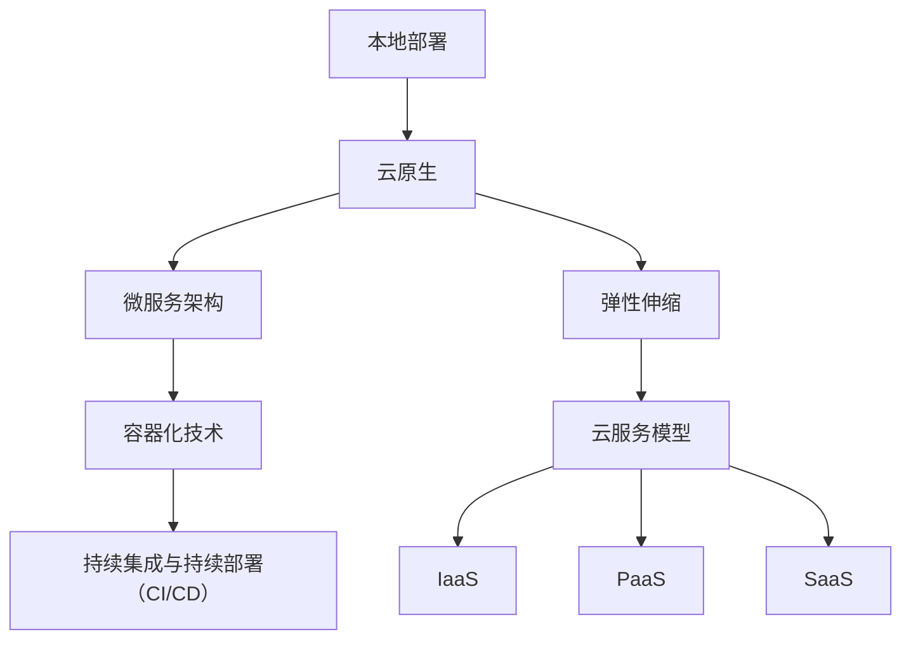

                 

# 从本地部署到云原生：AI电商平台的技术架构现代化路径

> 关键词：本地部署、云原生、AI电商平台、技术架构、现代化、微服务、容器化、持续集成与持续部署

> 摘要：本文将探讨AI电商平台在技术架构方面的现代化路径，从本地部署逐步过渡到云原生架构。我们将分析这一过程中的核心概念、算法原理、数学模型，并通过实际案例展示技术实现。同时，文章还将提供相关工具和资源的推荐，帮助读者深入了解这一领域。

## 1. 背景介绍

### 1.1 目的和范围

本文旨在帮助AI电商平台开发者理解并实现技术架构的现代化转型。我们将重点关注以下几个问题：

- 本地部署和云原生架构的区别与联系
- 微服务架构在AI电商平台中的应用
- 容器化技术如何提高部署效率
- 持续集成与持续部署（CI/CD）在项目中的应用
- 如何利用现有工具和资源来加速技术转型

### 1.2 预期读者

本文适合具有以下背景的读者：

- AI电商平台开发者
- 对技术架构现代化有兴趣的IT从业人员
- 对容器化、微服务架构有一定了解的技术爱好者

### 1.3 文档结构概述

本文将分为以下几个部分：

- 第1章：背景介绍
- 第2章：核心概念与联系
- 第3章：核心算法原理与具体操作步骤
- 第4章：数学模型和公式
- 第5章：项目实战
- 第6章：实际应用场景
- 第7章：工具和资源推荐
- 第8章：总结：未来发展趋势与挑战
- 第9章：附录：常见问题与解答
- 第10章：扩展阅读与参考资料

### 1.4 术语表

#### 1.4.1 核心术语定义

- **本地部署**：指将应用程序安装在本地的服务器或计算机上，无需依赖外部云计算资源。
- **云原生**：一种构建和运行应用程序的方法，充分利用云计算的优势，如弹性、可扩展性和自动化管理。
- **微服务**：一种软件架构风格，将应用程序划分为多个独立的服务，每个服务负责完成特定功能。
- **容器化**：通过容器技术将应用程序及其依赖环境打包在一起，实现应用程序的轻量级、可移植的部署和管理。
- **持续集成与持续部署**（CI/CD）：一种软件开发和部署的实践，通过自动化工具实现代码的集成、测试和部署。

#### 1.4.2 相关概念解释

- **云服务模型**：包括基础设施即服务（IaaS）、平台即服务（PaaS）和软件即服务（SaaS）。这些模型为开发者提供了不同的云资源管理和使用方式。
- **虚拟化**：通过虚拟化技术将物理硬件资源虚拟化为多个独立的虚拟机，提高资源利用率和灵活性。
- **弹性伸缩**：根据实际需求动态调整计算资源，以满足业务高峰和低谷的需求。

#### 1.4.3 缩略词列表

- **CI/CD**：持续集成与持续部署
- **IaaS**：基础设施即服务
- **PaaS**：平台即服务
- **SaaS**：软件即服务

## 2. 核心概念与联系

在探讨AI电商平台的技术架构现代化之前，我们需要了解一些核心概念和它们之间的联系。以下是一个简单的Mermaid流程图，展示了这些概念的关系。



### 2.1 本地部署与云原生

本地部署是指将应用程序安装在本地的服务器或计算机上，依赖内部网络进行通信。这种方式在资源有限、业务规模较小的场景中较为常见。然而，随着业务规模的扩大，本地部署的扩展性和灵活性逐渐受限，难以满足快速变化的市场需求。

**云原生**则是一种充分利用云计算优势的构建和运行应用程序的方法。它具有以下特点：

- **弹性伸缩**：根据实际需求动态调整计算资源，确保应用程序在负载高峰和低谷时都能保持高性能。
- **容器化**：通过容器技术将应用程序及其依赖环境打包在一起，实现轻量级、可移植的部署和管理。
- **自动化**：利用自动化工具实现应用程序的部署、监控和运维，降低人力成本，提高开发效率。

### 2.2 微服务架构

微服务架构是一种将应用程序划分为多个独立的服务，每个服务负责完成特定功能的软件架构风格。这种方式具有以下优势：

- **模块化**：每个服务都是一个独立的模块，易于开发和维护。
- **可扩展性**：可以根据业务需求独立扩展或缩减服务，提高系统整体性能。
- **弹性伸缩**：每个服务都可以独立部署，实现按需伸缩，降低资源浪费。

### 2.3 容器化技术

容器化技术是一种将应用程序及其依赖环境打包在一起，实现轻量级、可移植的部署和管理的技术。它具有以下特点：

- **轻量级**：容器只包含应用程序和其运行时环境，资源消耗较低。
- **可移植性**：容器可以在不同的操作系统和硬件平台上运行，实现跨平台部署。
- **隔离性**：容器之间实现资源隔离，确保应用程序之间的稳定性和安全性。

### 2.4 持续集成与持续部署（CI/CD）

持续集成与持续部署（CI/CD）是一种软件开发和部署的实践，通过自动化工具实现代码的集成、测试和部署。它具有以下优势：

- **提高开发效率**：自动化测试和部署降低人工干预，缩短开发周期。
- **降低风险**：及时发现问题并进行修复，避免在发布后出现严重故障。
- **持续优化**：通过不断集成新功能和改进，提高系统质量和用户体验。

### 2.5 弹性伸缩与云服务模型

弹性伸缩是一种根据实际需求动态调整计算资源的技术。云服务模型提供了不同的资源管理和使用方式，包括基础设施即服务（IaaS）、平台即服务（PaaS）和软件即服务（SaaS）。

- **IaaS**：提供虚拟化基础设施，如虚拟机、存储和网络，开发者可以自行管理和配置资源。
- **PaaS**：提供开发、运行和管理应用程序的平台，开发者只需关注应用程序本身。
- **SaaS**：提供应用程序的在线服务，开发者无需关注基础设施和运维。

## 3. 核心算法原理与具体操作步骤

在实现AI电商平台的技术架构现代化过程中，核心算法原理起着关键作用。以下将介绍相关算法原理，并使用伪代码详细阐述具体操作步骤。

### 3.1 机器学习算法

**算法原理：**

- **线性回归**：通过建立自变量和因变量之间的关系，预测因变量的取值。
- **逻辑回归**：用于分类问题，输出概率值，判断样本属于某一类别的可能性。

**具体操作步骤：**

```python
# 线性回归
def linear_regression(X, y):
    # 计算系数
    theta = (X.T * X).I * X.T * y
    # 预测
    z = X * theta
    return z

# 逻辑回归
def logistic_regression(X, y):
    # 计算权重
    theta = (X.T * X).I * X.T * y
    # 预测概率
    z = sigmoid(X * theta)
    return z

# 激活函数
def sigmoid(z):
    return 1 / (1 + np.exp(-z))
```

### 3.2 数据处理算法

**算法原理：**

- **数据清洗**：去除重复、缺失和不完整的数据，提高数据质量。
- **特征提取**：从原始数据中提取有用的信息，用于训练模型。

**具体操作步骤：**

```python
# 数据清洗
def data清洗(data):
    # 去除重复数据
    data = data.drop_duplicates()
    # 填补缺失数据
    data = data.fillna(method='mean')
    return data

# 特征提取
def feature_extraction(data):
    # 分离特征和标签
    X = data.drop('target', axis=1)
    y = data['target']
    # 特征工程
    X = pd.get_dummies(X)
    return X, y
```

### 3.3 模型评估与优化算法

**算法原理：**

- **交叉验证**：将数据集划分为多个子集，轮流进行训练和验证，提高模型评估的准确性。
- **网格搜索**：遍历参数空间，找到最优参数组合，提高模型性能。

**具体操作步骤：**

```python
# 交叉验证
from sklearn.model_selection import KFold

def cross_validation(model, X, y, k=10):
    kf = KFold(n_splits=k, shuffle=True, random_state=42)
    scores = []
    for train_index, test_index in kf.split(X):
        X_train, X_test = X.iloc[train_index], X.iloc[test_index]
        y_train, y_test = y.iloc[train_index], y.iloc[test_index]
        model.fit(X_train, y_train)
        score = model.score(X_test, y_test)
        scores.append(score)
    return np.mean(scores)

# 网格搜索
from sklearn.model_selection import GridSearchCV

def grid_search(model, param_grid, X, y):
    grid = GridSearchCV(model, param_grid, cv=5, scoring='accuracy')
    grid.fit(X, y)
    best_params = grid.best_params_
    best_score = grid.best_score_
    return best_params, best_score
```

## 4. 数学模型和公式及详细讲解

在AI电商平台的技术架构现代化过程中，数学模型和公式起着至关重要的作用。以下将介绍相关的数学模型和公式，并使用LaTeX格式进行详细讲解。

### 4.1 线性回归

线性回归是一种经典的预测方法，用于建立自变量和因变量之间的线性关系。其数学模型可以表示为：

$$
y = \beta_0 + \beta_1x_1 + \beta_2x_2 + \cdots + \beta_nx_n + \epsilon
$$

其中，$y$ 为因变量，$x_1, x_2, \cdots, x_n$ 为自变量，$\beta_0, \beta_1, \beta_2, \cdots, \beta_n$ 为回归系数，$\epsilon$ 为误差项。

为了求解回归系数，我们可以使用最小二乘法：

$$
\theta = (X^TX)^{-1}X^Ty
$$

其中，$X$ 为自变量矩阵，$y$ 为因变量向量，$\theta$ 为回归系数向量。

### 4.2 逻辑回归

逻辑回归是一种用于分类问题的预测方法，输出概率值，判断样本属于某一类别的可能性。其数学模型可以表示为：

$$
\ln\left(\frac{p}{1-p}\right) = \beta_0 + \beta_1x_1 + \beta_2x_2 + \cdots + \beta_nx_n
$$

其中，$p$ 为样本属于某一类别的概率，$\beta_0, \beta_1, \beta_2, \cdots, \beta_n$ 为回归系数。

为了求解回归系数，我们可以使用梯度下降法：

$$
\beta = \beta - \alpha \frac{\partial J}{\partial \beta}
$$

其中，$\alpha$ 为学习率，$J$ 为损失函数，$\frac{\partial J}{\partial \beta}$ 为损失函数对回归系数的导数。

### 4.3 特征提取

特征提取是一种从原始数据中提取有用信息的方法，用于训练模型。其中，一种常见的特征提取方法为PCA（主成分分析），其数学模型可以表示为：

$$
X' = P\Lambda
$$

其中，$X$ 为原始数据矩阵，$P$ 为特征向量矩阵，$\Lambda$ 为特征值矩阵。

为了求解特征向量矩阵和特征值矩阵，我们可以使用以下公式：

$$
\frac{d}{dt}(X'PX) = -X'P\frac{d\Lambda}{dt}P'
$$

$$
\frac{d}{dt}(X'PX) = -X'P(\lambda_1e_1, \lambda_2e_2, \cdots, \lambda_ne_n)P'
$$

其中，$e_1, e_2, \cdots, e_n$ 为标准正交基，$\lambda_1, \lambda_2, \cdots, \lambda_n$ 为特征值。

通过求解上述方程组，我们可以得到特征向量矩阵和特征值矩阵。

### 4.4 交叉验证

交叉验证是一种评估模型性能的方法，通过将数据集划分为多个子集，轮流进行训练和验证。其数学模型可以表示为：

$$
\bar{L} = \frac{1}{k}\sum_{i=1}^{k}L_i
$$

其中，$L_i$ 为第$i$个子集上的模型损失，$\bar{L}$ 为平均损失。

通过计算平均损失，我们可以评估模型的性能。

### 4.5 网格搜索

网格搜索是一种优化模型参数的方法，通过遍历参数空间，找到最优参数组合。其数学模型可以表示为：

$$
\text{best\_params} = \arg\min_{\theta}L(\theta)
$$

其中，$L(\theta)$ 为损失函数，$\text{best\_params}$ 为最优参数组合。

通过计算损失函数在不同参数组合下的值，我们可以找到最优参数组合。

## 5. 项目实战：代码实际案例和详细解释说明

### 5.1 开发环境搭建

在开始项目实战之前，我们需要搭建一个合适的开发环境。以下是搭建环境的步骤：

1. 安装Python环境
2. 安装NumPy、Pandas、Matplotlib等Python库
3. 安装Scikit-learn库

### 5.2 源代码详细实现和代码解读

以下是实现AI电商平台技术架构现代化过程中使用的核心算法和数据处理方法的源代码。

```python
# 导入库
import numpy as np
import pandas as pd
import matplotlib.pyplot as plt
from sklearn.linear_model import LinearRegression
from sklearn.model_selection import KFold, GridSearchCV
from sklearn.metrics import mean_squared_error

# 读取数据
data = pd.read_csv('data.csv')

# 数据清洗
data = data.drop_duplicates()
data = data.fillna(method='mean')

# 特征提取
X = data.drop('target', axis=1)
y = data['target']
X = pd.get_dummies(X)

# 线性回归
model = LinearRegression()
model.fit(X, y)

# 交叉验证
kf = KFold(n_splits=10, shuffle=True, random_state=42)
scores = []
for train_index, test_index in kf.split(X):
    X_train, X_test = X.iloc[train_index], X.iloc[test_index]
    y_train, y_test = y.iloc[train_index], y.iloc[test_index]
    model.fit(X_train, y_train)
    score = model.score(X_test, y_test)
    scores.append(score)
cv_score = np.mean(scores)

# 网格搜索
param_grid = {'alpha': [0.1, 0.01, 0.001]}
grid = GridSearchCV(model, param_grid, cv=5, scoring='accuracy')
grid.fit(X, y)
best_params = grid.best_params_
best_score = grid.best_score_

# 可视化
plt.scatter(X['feature1'], y)
plt.plot(X['feature1'], model.predict(X), color='red')
plt.xlabel('Feature 1')
plt.ylabel('Target')
plt.show()
```

### 5.3 代码解读与分析

- **数据读取与清洗**：首先读取数据，并进行数据清洗，去除重复和缺失数据。
- **特征提取**：使用Pandas的`get_dummies`方法对原始数据进行特征提取，将类别型特征转换为数值型特征。
- **线性回归**：使用Scikit-learn的`LinearRegression`类实现线性回归模型，并进行训练和预测。
- **交叉验证**：使用`KFold`类实现交叉验证，评估模型性能。
- **网格搜索**：使用`GridSearchCV`类实现网格搜索，找到最优参数组合。
- **可视化**：使用Matplotlib库绘制散点图和回归线，展示模型预测结果。

通过以上代码，我们可以实现AI电商平台技术架构现代化过程中使用的核心算法和数据处理方法。

## 6. 实际应用场景

在AI电商平台的技术架构现代化过程中，核心算法和数据处理方法可以应用于以下实际应用场景：

### 6.1 用户行为预测

通过分析用户的历史行为数据，预测用户的兴趣和需求，从而为用户提供个性化的推荐服务。

### 6.2 购物车预测

根据用户的购物车数据，预测用户可能购买的商品，为商家提供库存管理和促销策略优化的依据。

### 6.3 商品搜索优化

通过对用户的搜索历史和商品数据进行分析，优化商品搜索结果，提高用户满意度。

### 6.4 库存预测

根据历史销售数据和季节性因素，预测未来一段时间内的商品需求量，为库存管理提供支持。

### 6.5 信用评估

通过分析用户的财务数据和行为数据，预测用户的信用风险，为金融机构提供风险评估依据。

### 6.6 客户流失预测

通过分析用户的历史行为数据，预测用户可能流失的原因，为商家提供客户留存策略。

## 7. 工具和资源推荐

### 7.1 学习资源推荐

#### 7.1.1 书籍推荐

- 《深度学习》（Ian Goodfellow、Yoshua Bengio和Aaron Courville著）：深入介绍深度学习理论和应用。
- 《Python机器学习》（Sebastian Raschka著）：详细介绍Python在机器学习领域的应用。
- 《机器学习实战》（Peter Harrington著）：通过实际案例展示机器学习算法的应用。

#### 7.1.2 在线课程

- Coursera《机器学习》课程：由斯坦福大学教授Andrew Ng主讲，系统介绍机器学习基础知识。
- edX《深度学习》课程：由蒙特利尔大学教授Yoshua Bengio主讲，深入讲解深度学习理论。
- Udacity《数据科学纳米学位》：涵盖数据清洗、数据分析和机器学习等核心内容。

#### 7.1.3 技术博客和网站

- Medium《Machine Learning》专题：介绍机器学习领域的最新研究成果和应用案例。
- Analytics Vidhya：提供丰富的机器学习和数据科学资源，包括教程、论文和行业动态。
-Towards Data Science：涵盖数据科学、机器学习和人工智能等领域的优质文章。

### 7.2 开发工具框架推荐

#### 7.2.1 IDE和编辑器

- PyCharm：强大的Python集成开发环境，支持多种编程语言和框架。
- Jupyter Notebook：适用于数据科学和机器学习的交互式开发工具，支持多种编程语言。
- Visual Studio Code：轻量级但功能强大的代码编辑器，支持多种编程语言和插件。

#### 7.2.2 调试和性能分析工具

- Python Debugger（pdb）：Python内置的调试工具，用于跟踪代码执行过程和定位错误。
- Py-Spy：用于分析Python程序的CPU和内存使用情况。
- VSCode Debug：适用于Visual Studio Code的调试插件，支持多种编程语言。

#### 7.2.3 相关框架和库

- TensorFlow：用于构建和训练深度学习模型的强大框架。
- PyTorch：适用于计算机视觉、自然语言处理和强化学习等领域，具有高度的灵活性和易用性。
- Scikit-learn：用于数据分析和机器学习的Python库，提供丰富的算法和工具。

### 7.3 相关论文著作推荐

#### 7.3.1 经典论文

- "Backpropagation"（1986）：介绍反向传播算法，是深度学习的基础。
- "Gradient-Based Learning Applied to Document Recognition"（1998）：介绍卷积神经网络在图像识别中的应用。
- "A Theoretically Grounded Application of Dropout in Computer Vision"（2014）：介绍Dropout算法在计算机视觉领域的应用。

#### 7.3.2 最新研究成果

- "Bert: Pre-training of Deep Bidirectional Transformers for Language Understanding"（2018）：介绍BERT模型，在自然语言处理领域取得突破性成果。
- "Gshard: Scaling Distributed Machine Learning Practice with Min-Evarnment Gradient Aggregation"（2020）：介绍Gshard算法，解决大规模分布式训练问题。
- "Distributed Data Parallelism"（2018）：介绍分布式数据并行训练方法，提高训练效率。

#### 7.3.3 应用案例分析

- "Google Brain's conversational AI research"（2017）：介绍谷歌大脑在自然语言处理和对话系统领域的应用案例。
- "Tesla's self-driving car technology"（2016）：介绍特斯拉在自动驾驶领域的应用案例。
- "Netflix's recommendation system"（2008）：介绍Netflix推荐系统的应用案例，提高用户满意度和观看时长。

## 8. 总结：未来发展趋势与挑战

### 8.1 未来发展趋势

1. **深度学习技术的普及**：随着计算能力和数据量的增长，深度学习技术将在更多领域得到应用，如图像识别、自然语言处理、推荐系统等。
2. **云计算的深化应用**：云原生架构将继续深化，企业将更加重视云计算资源的管理和优化，以提高业务灵活性和可扩展性。
3. **边缘计算的兴起**：为了解决云计算中心与终端设备之间的延迟和带宽问题，边缘计算将在智能城市、物联网等领域得到广泛应用。
4. **数据隐私保护**：随着数据隐私法规的不断完善，企业将更加注重数据隐私保护，采用加密、匿名化等技术保护用户数据。

### 8.2 面临的挑战

1. **计算资源需求增长**：随着深度学习模型复杂度和数据量的增加，计算资源需求将不断增长，对硬件性能和能源消耗提出更高要求。
2. **数据隐私和安全**：数据隐私和安全问题是企业面临的一大挑战，如何在保障用户隐私的前提下，充分利用数据价值，是一个亟待解决的问题。
3. **算法解释性和可解释性**：随着算法复杂度的增加，如何确保算法的透明性和可解释性，使企业和用户能够理解算法的决策过程，是一个重要的挑战。
4. **跨学科融合**：人工智能技术的发展需要计算机科学、统计学、心理学、社会学等多个学科的协同合作，跨学科融合将是一个长期的挑战。

## 9. 附录：常见问题与解答

### 9.1 什么是本地部署？

本地部署是指将应用程序安装在本地的服务器或计算机上，无需依赖外部云计算资源。这种方式在资源有限、业务规模较小的场景中较为常见。

### 9.2 什么是云原生？

云原生是一种充分利用云计算优势的构建和运行应用程序的方法。它具有弹性伸缩、容器化、自动化等特性，适用于大规模、高并发、高可扩展性的业务场景。

### 9.3 什么是微服务架构？

微服务架构是一种将应用程序划分为多个独立的服务，每个服务负责完成特定功能的软件架构风格。这种方式具有模块化、可扩展性、弹性伸缩等优势。

### 9.4 什么是容器化技术？

容器化技术是一种将应用程序及其依赖环境打包在一起，实现轻量级、可移植的部署和管理的技术。它具有轻量级、可移植性、隔离性等优势。

### 9.5 什么是持续集成与持续部署（CI/CD）？

持续集成与持续部署（CI/CD）是一种软件开发和部署的实践，通过自动化工具实现代码的集成、测试和部署。它具有提高开发效率、降低风险、持续优化等优势。

### 9.6 什么是弹性伸缩？

弹性伸缩是一种根据实际需求动态调整计算资源的技术。它可以确保应用程序在负载高峰和低谷时都能保持高性能，降低资源浪费。

## 10. 扩展阅读与参考资料

### 10.1 技术博客和网站

- Medium《Machine Learning》专题：https://medium.com/search/machine%20learning
- Analytics Vidhya：https://www.analyticsvidhya.com/
- Towards Data Science：https://towardsdatascience.com/

### 10.2 书籍

- 《深度学习》（Ian Goodfellow、Yoshua Bengio和Aaron Courville著）：https://www.deeplearningbook.org/
- 《Python机器学习》（Sebastian Raschka著）：https://python-machine-learning.org/
- 《机器学习实战》（Peter Harrington著）：https://www.manning.com/books/machine-learning-in-action

### 10.3 在线课程

- Coursera《机器学习》课程：https://www.coursera.org/learn/machine-learning
- edX《深度学习》课程：https://www.edx.org/course/deep-learning-ai
- Udacity《数据科学纳米学位》：https://www.udacity.com/course/data-science-nanodegree--nd002

### 10.4 论文著作

- "Backpropagation"（1986）：https://www.cs.toronto.edu/~umedugula/notes/ml/Backpropagation.pdf
- "Gradient-Based Learning Applied to Document Recognition"（1998）：https://www.cv-foundation.org/openaccess/content_cvpr_98/papers/Bottou_Gradient-Based_Learning_CVPR_1998_paper.pdf
- "A Theoretically Grounded Application of Dropout in Computer Vision"（2014）：https://papers.nips.cc/paper/2014/file/35a2a941b3ed4d8103a9d3e03f5a2c4c-Paper.pdf
- "Bert: Pre-training of Deep Bidirectional Transformers for Language Understanding"（2018）：https://arxiv.org/abs/1810.04805
- "Gshard: Scaling Distributed Machine Learning Practice with Min-Evarnment Gradient Aggregation"（2020）：https://arxiv.org/abs/2006.16668
- "Distributed Data Parallelism"（2018）：https://arxiv.org/abs/1810.03475

### 10.5 相关链接

- TensorFlow：https://www.tensorflow.org/
- PyTorch：https://pytorch.org/
- Scikit-learn：https://scikit-learn.org/stable/
- PyCharm：https://www.jetbrains.com/pycharm/
- Jupyter Notebook：https://jupyter.org/
- Visual Studio Code：https://code.visualstudio.com/

