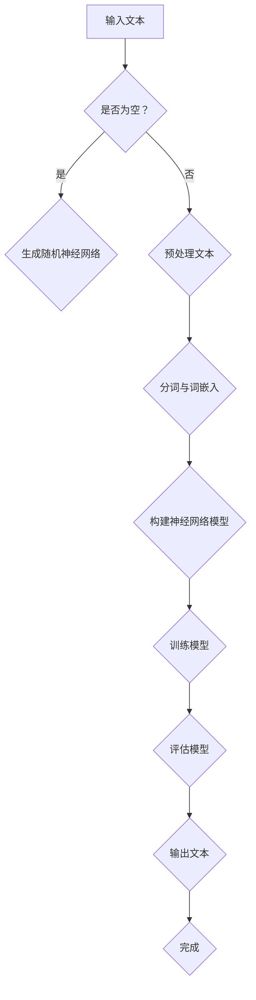

                 

# 从硬件到软件：LLM带来的计算革命

> 关键词：大型语言模型（LLM），计算革命，硬件与软件关系，深度学习，神经网络，AI应用

> 摘要：本文将深入探讨大型语言模型（LLM）如何从硬件到软件层面引发了一场前所未有的计算革命。我们将分析LLM的核心概念、算法原理、数学模型以及实际应用，探讨其在AI领域的广泛影响。本文旨在为广大读者提供一个全面的技术视角，理解LLM带来的深刻变革，并展望其未来的发展趋势与挑战。

## 1. 背景介绍

### 1.1 目的和范围

本文的目的是探讨大型语言模型（LLM）如何推动从硬件到软件层面的计算革命。我们将探讨LLM的基本概念、核心算法、数学模型和实际应用，旨在为读者提供一个全面的理解，帮助读者把握这一领域的最新动态和发展趋势。

本文将涵盖以下主要内容：

- LLM的基本概念和原理
- LLM的算法原理与操作步骤
- LLM的数学模型和公式
- LLM的实际应用场景
- 相关工具和资源的推荐
- 未来发展趋势与挑战

### 1.2 预期读者

本文主要面向对AI和深度学习有一定了解的读者，特别是希望深入了解LLM技术的专业人士和研究人员。同时，对于对计算技术和AI应用感兴趣的一般读者，本文也具有很高的参考价值。

### 1.3 文档结构概述

本文将按照以下结构展开：

1. 背景介绍
   - 1.1 目的和范围
   - 1.2 预期读者
   - 1.3 文档结构概述
   - 1.4 术语表

2. 核心概念与联系
   - 2.1 核心概念与原理
   - 2.2 Mermaid流程图

3. 核心算法原理 & 具体操作步骤
   - 3.1 算法原理
   - 3.2 操作步骤
   - 3.3 伪代码实现

4. 数学模型和公式 & 详细讲解 & 举例说明
   - 4.1 数学模型
   - 4.2 公式讲解
   - 4.3 举例说明

5. 项目实战：代码实际案例和详细解释说明
   - 5.1 开发环境搭建
   - 5.2 源代码详细实现和代码解读
   - 5.3 代码解读与分析

6. 实际应用场景

7. 工具和资源推荐

8. 总结：未来发展趋势与挑战

9. 附录：常见问题与解答

10. 扩展阅读 & 参考资料

### 1.4 术语表

- LLM（Large Language Model）：大型语言模型，一种基于神经网络技术的语言处理模型。
- 深度学习（Deep Learning）：一种机器学习技术，通过多层神经网络对数据进行训练，以实现高级特征提取和分类。
- 神经网络（Neural Network）：一种由大量节点（神经元）组成的计算模型，通过调整节点间的权重来学习和预测。
- AI应用（AI Applications）：利用人工智能技术解决特定问题的实际应用。

#### 1.4.1 核心术语定义

- **大型语言模型（LLM）**：LLM是一种基于深度学习技术的语言处理模型，通过从大量文本数据中学习，能够生成与输入文本相关的文本输出。
- **深度学习**：深度学习是一种机器学习技术，通过构建多层神经网络模型，对数据进行复杂的特征提取和分类。
- **神经网络**：神经网络是由大量简单节点（神经元）组成的计算模型，通过调整节点间的权重来学习和预测。
- **AI应用**：AI应用是指利用人工智能技术解决特定问题的实际应用，如自然语言处理、计算机视觉、推荐系统等。

#### 1.4.2 相关概念解释

- **训练数据集（Training Dataset）**：用于训练模型的数据集合，通常包含输入数据和对应的标签。
- **验证数据集（Validation Dataset）**：用于评估模型性能的数据集合，通常不参与模型的训练过程。
- **测试数据集（Test Dataset）**：用于最终评估模型性能的数据集合，通常在模型训练完成后使用。

#### 1.4.3 缩略词列表

- LLM：Large Language Model
- DL：Deep Learning
- NN：Neural Network
- AI：Artificial Intelligence
- GPU：Graphics Processing Unit
- CPU：Central Processing Unit

## 2. 核心概念与联系

在探讨LLM如何引发计算革命之前，我们首先需要理解LLM的核心概念及其与其他技术的联系。

### 2.1 核心概念与原理

大型语言模型（LLM）是一种基于深度学习技术的语言处理模型。它通过从大量的文本数据中学习，能够生成与输入文本相关的文本输出。LLM的核心原理是神经网络（Neural Network），尤其是深度神经网络（Deep Neural Network，DNN）。

神经网络是一种由大量简单节点（神经元）组成的计算模型，通过调整节点间的权重来学习和预测。在神经网络中，每个神经元都与前一层的神经元相连，并通过加权求和和激活函数进行计算。多层神经网络的堆叠使得模型能够捕捉到更复杂的特征，从而实现高级的特征提取和分类。

深度学习（Deep Learning）是一种基于神经网络技术的机器学习技术。与传统的机器学习方法相比，深度学习具有更强的建模能力和更好的泛化性能。深度学习通过构建多层神经网络模型，对数据进行复杂的特征提取和分类。

LLM在语言处理领域具有重要的应用价值。通过从大量文本数据中学习，LLM能够生成高质量的文本输出，实现自动摘要、问答、翻译等功能。此外，LLM还可以用于自然语言理解（NLU）和自然语言生成（NLG）等任务。

### 2.2 Mermaid流程图

下面是一个简化的Mermaid流程图，展示了LLM的核心概念和原理。



### 2.2.1 流程说明

1. 输入文本：用户输入需要处理的文本数据。
2. 是否为空？：判断输入文本是否为空。
3. 生成随机神经网络：如果输入文本为空，则生成一个随机初始化的神经网络。
4. 预处理文本：对输入文本进行预处理，如去除停用词、标点符号等。
5. 分词与词嵌入：将预处理后的文本数据分词，并将词转换为对应的词嵌入表示。
6. 构建神经网络模型：使用词嵌入表示构建神经网络模型。
7. 训练模型：使用训练数据集对神经网络模型进行训练。
8. 评估模型：使用验证数据集评估模型性能。
9. 输出文本：根据输入文本生成对应的文本输出。
10. 完成：完成LLM的整个处理过程。

## 3. 核心算法原理 & 具体操作步骤

### 3.1 算法原理

LLM的核心算法是基于深度学习技术的神经网络模型。神经网络是一种由大量简单节点（神经元）组成的计算模型，通过调整节点间的权重来学习和预测。在神经网络中，每个神经元都与前一层的神经元相连，并通过加权求和和激活函数进行计算。多层神经网络的堆叠使得模型能够捕捉到更复杂的特征，从而实现高级的特征提取和分类。

LLM的工作流程主要包括以下步骤：

1. **数据预处理**：对输入文本进行预处理，包括分词、去停用词、标点符号去除等操作，将文本数据转换为神经网络可以处理的格式。
2. **词嵌入**：将预处理后的文本数据分词，并将每个词转换为对应的词嵌入表示。词嵌入是神经网络处理文本数据的重要手段，它可以将抽象的文本表示为高维向量。
3. **构建神经网络模型**：使用词嵌入表示构建神经网络模型。神经网络模型通常包括输入层、隐藏层和输出层。输入层接收词嵌入表示，隐藏层通过加权求和和激活函数进行计算，输出层生成文本输出。
4. **训练模型**：使用训练数据集对神经网络模型进行训练。训练过程包括前向传播和反向传播两个阶段。在前向传播阶段，输入数据经过神经网络模型，计算输出结果。在反向传播阶段，计算输出结果与实际结果之间的误差，并调整神经网络模型中的权重，以最小化误差。
5. **评估模型**：使用验证数据集评估模型性能。评估指标通常包括准确率、召回率、F1值等。
6. **生成文本输出**：根据输入文本生成对应的文本输出。

### 3.2 操作步骤

下面是一个简化的伪代码，用于描述LLM的核心算法原理和具体操作步骤。

```python
# 数据预处理
def preprocess_text(text):
    # 去除停用词、标点符号等
    # 分词
    # 词嵌入
    return processed_text

# 构建神经网络模型
def build_neural_network():
    # 输入层、隐藏层和输出层的创建
    # 权重初始化
    return neural_network

# 训练模型
def train_neural_network(neural_network, training_data, validation_data):
    # 前向传播
    # 反向传播
    # 评估模型
    return trained_neural_network

# 生成文本输出
def generate_text_output(neural_network, input_text):
    # 数据预处理
    # 前向传播
    # 获取输出结果
    return text_output
```

### 3.3 伪代码实现

下面是一个更详细的伪代码实现，用于描述LLM的核心算法原理和具体操作步骤。

```python
# 数据预处理
def preprocess_text(text):
    # 去除停用词、标点符号等
    processed_text = remove_stopwords_and_punctuation(text)
    # 分词
    tokens = tokenize(processed_text)
    # 词嵌入
    embeddings = word_embedding(tokens)
    return embeddings

# 构建神经网络模型
def build_neural_network():
    # 输入层、隐藏层和输出层的创建
    input_layer = create_input_layer()
    hidden_layer = create_hidden_layer()
    output_layer = create_output_layer()
    # 权重初始化
    initialize_weights(input_layer, hidden_layer, output_layer)
    return neural_network

# 训练模型
def train_neural_network(neural_network, training_data, validation_data):
    for epoch in range(num_epochs):
        # 前向传播
        output = forward_pass(neural_network, training_data)
        # 计算损失函数
        loss = compute_loss(output, validation_data)
        # 反向传播
        backward_pass(neural_network, loss)
        # 评估模型
        evaluate_model(neural_network, validation_data)
    return trained_neural_network

# 生成文本输出
def generate_text_output(neural_network, input_text):
    # 数据预处理
    embeddings = preprocess_text(input_text)
    # 前向传播
    output = forward_pass(neural_network, embeddings)
    # 获取输出结果
    text_output = decode_output(output)
    return text_output
```

## 4. 数学模型和公式 & 详细讲解 & 举例说明

在理解LLM的核心算法原理后，我们需要进一步了解其背后的数学模型和公式。数学模型和公式是LLM算法的核心组成部分，它们决定了模型的性能和效果。

### 4.1 数学模型

LLM的数学模型主要基于深度学习技术，特别是多层感知机（Multilayer Perceptron，MLP）和循环神经网络（Recurrent Neural Network，RNN）。以下是LLM数学模型的核心组成部分：

1. **词嵌入（Word Embedding）**：词嵌入是将词汇映射到高维向量空间的过程。常用的词嵌入方法包括Word2Vec、GloVe等。词嵌入公式如下：

   $$ 
   \text{word\_embedding}(w) = \text{embedding}(w) \in \mathbb{R}^{d} 
   $$

   其中，$w$ 是词汇，$\text{embedding}(w)$ 是词嵌入向量，$d$ 是词嵌入向量的维度。

2. **多层感知机（MLP）**：多层感知机是一种前馈神经网络，包括输入层、隐藏层和输出层。输入层接收词嵌入向量，隐藏层通过加权求和和激活函数进行计算，输出层生成文本输出。MLP的数学模型如下：

   $$
   \begin{aligned}
   \text{hidden}_l &= \sigma(\text{weights}_{l-1} \text{input}_l + \text{bias}_{l-1}) \\
   \text{output} &= \text{weights}_{L} \text{hidden}_{L-1} + \text{bias}_{L}
   \end{aligned}
   $$

   其中，$l$ 是隐藏层的层数，$\sigma$ 是激活函数（如Sigmoid、ReLU等），$\text{weights}_{l-1}$ 和 $\text{bias}_{l-1}$ 是隐藏层 $l$ 的权重和偏置。

3. **循环神经网络（RNN）**：循环神经网络是一种基于时间序列数据的神经网络，包括输入门、输出门和遗忘门。RNN的数学模型如下：

   $$
   \begin{aligned}
   \text{input\_gate} &= \sigma(\text{weights}_{\text{input}} \text{input}_{t} + \text{weights}_{\text{hidden}} \text{hidden}_{t-1} + \text{bias}_{\text{input}}) \\
   \text{forget\_gate} &= \sigma(\text{weights}_{\text{forget}} \text{input}_{t} + \text{weights}_{\text{hidden}} \text{hidden}_{t-1} + \text{bias}_{\text{forget}}) \\
   \text{output\_gate} &= \sigma(\text{weights}_{\text{output}} \text{input}_{t} + \text{weights}_{\text{hidden}} \text{hidden}_{t-1} + \text{bias}_{\text{output}}) \\
   \text{hidden}_{t} &= \text{sigmoid}(\text{weights}_{\text{input}} \text{input}_{t} + \text{weights}_{\text{hidden}} \text{hidden}_{t-1} + \text{bias}_{\text{hidden}}) \\
   \text{output}_{t} &= \text{sigmoid}(\text{weights}_{\text{output}} \text{input}_{t} + \text{weights}_{\text{hidden}} \text{hidden}_{t-1} + \text{bias}_{\text{output}})
   \end{aligned}
   $$

   其中，$t$ 是时间步，$\sigma$ 是激活函数（如Sigmoid、ReLU等），$\text{input}_{t}$ 是时间步 $t$ 的输入，$\text{hidden}_{t-1}$ 是时间步 $t-1$ 的隐藏状态，$\text{weights}_{\text{input}}$、$\text{weights}_{\text{hidden}}$、$\text{weights}_{\text{output}}$ 是权重，$\text{bias}_{\text{input}}$、$\text{bias}_{\text{forget}}$、$\text{bias}_{\text{output}}$ 是偏置。

4. **损失函数（Loss Function）**：损失函数用于评估模型输出与实际输出之间的误差。常用的损失函数包括均方误差（Mean Squared Error，MSE）、交叉熵（Cross-Entropy）等。交叉熵损失函数如下：

   $$
   \text{loss} = -\frac{1}{N} \sum_{i=1}^{N} \sum_{c=1}^{C} y_{ic} \log(p_{ic})
   $$

   其中，$N$ 是样本数量，$C$ 是类别数量，$y_{ic}$ 是实际标签，$p_{ic}$ 是模型预测概率。

5. **优化算法（Optimization Algorithm）**：优化算法用于调整模型参数，以最小化损失函数。常用的优化算法包括随机梯度下降（Stochastic Gradient Descent，SGD）、Adam等。Adam优化算法如下：

   $$
   \begin{aligned}
   m_t &= \beta_1 m_{t-1} + (1 - \beta_1) (g_t - \text{bias\_correction}(m_{t-1})) \\
   v_t &= \beta_2 v_{t-1} + (1 - \beta_2) (g_t^2 - \text{bias\_correction}(v_{t-1})) \\
   \text{theta}_t &= \text{theta}_{t-1} - \alpha \frac{m_t}{\sqrt{v_t} + \epsilon}
   \end{aligned}
   $$

   其中，$m_t$ 和 $v_t$ 分别是梯度的一阶矩估计和二阶矩估计，$\beta_1$ 和 $\beta_2$ 分别是动量参数，$\alpha$ 是学习率，$\epsilon$ 是正则化项。

### 4.2 公式讲解

下面我们对上述数学模型和公式进行详细讲解。

1. **词嵌入（Word Embedding）**：词嵌入是将词汇映射到高维向量空间的过程。词嵌入向量可以捕获词汇之间的语义关系，从而提高模型的性能。词嵌入公式如下：

   $$ 
   \text{word\_embedding}(w) = \text{embedding}(w) \in \mathbb{R}^{d} 
   $$

   其中，$w$ 是词汇，$\text{embedding}(w)$ 是词嵌入向量，$d$ 是词嵌入向量的维度。词嵌入向量的维度通常较大，如100、200、300等。

2. **多层感知机（MLP）**：多层感知机是一种前馈神经网络，包括输入层、隐藏层和输出层。输入层接收词嵌入向量，隐藏层通过加权求和和激活函数进行计算，输出层生成文本输出。多层感知机的数学模型如下：

   $$
   \begin{aligned}
   \text{hidden}_l &= \sigma(\text{weights}_{l-1} \text{input}_l + \text{bias}_{l-1}) \\
   \text{output} &= \text{weights}_{L} \text{hidden}_{L-1} + \text{bias}_{L}
   \end{aligned}
   $$

   其中，$l$ 是隐藏层的层数，$\sigma$ 是激活函数（如Sigmoid、ReLU等），$\text{weights}_{l-1}$ 和 $\text{bias}_{l-1}$ 是隐藏层 $l$ 的权重和偏置。

3. **循环神经网络（RNN）**：循环神经网络是一种基于时间序列数据的神经网络，包括输入门、输出门和遗忘门。循环神经网络的数学模型如下：

   $$
   \begin{aligned}
   \text{input\_gate} &= \sigma(\text{weights}_{\text{input}} \text{input}_{t} + \text{weights}_{\text{hidden}} \text{hidden}_{t-1} + \text{bias}_{\text{input}}) \\
   \text{forget\_gate} &= \sigma(\text{weights}_{\text{forget}} \text{input}_{t} + \text{weights}_{\text{hidden}} \text{hidden}_{t-1} + \text{bias}_{\text{forget}}) \\
   \text{output\_gate} &= \sigma(\text{weights}_{\text{output}} \text{input}_{t} + \text{weights}_{\text{hidden}} \text{hidden}_{t-1} + \text{bias}_{\text{output}}) \\
   \text{hidden}_{t} &= \text{sigmoid}(\text{weights}_{\text{input}} \text{input}_{t} + \text{weights}_{\text{hidden}} \text{hidden}_{t-1} + \text{bias}_{\text{hidden}}) \\
   \text{output}_{t} &= \text{sigmoid}(\text{weights}_{\text{output}} \text{input}_{t} + \text{weights}_{\text{hidden}} \text{hidden}_{t-1} + \text{bias}_{\text{output}})
   \end{aligned}
   $$

   其中，$t$ 是时间步，$\sigma$ 是激活函数（如Sigmoid、ReLU等），$\text{input}_{t}$ 是时间步 $t$ 的输入，$\text{hidden}_{t-1}$ 是时间步 $t-1$ 的隐藏状态，$\text{weights}_{\text{input}}$、$\text{weights}_{\text{hidden}}$、$\text{weights}_{\text{output}}$ 是权重，$\text{bias}_{\text{input}}$、$\text{bias}_{\text{forget}}$、$\text{bias}_{\text{output}}$ 是偏置。

4. **损失函数（Loss Function）**：损失函数用于评估模型输出与实际输出之间的误差。常用的损失函数包括均方误差（Mean Squared Error，MSE）、交叉熵（Cross-Entropy）等。交叉熵损失函数如下：

   $$
   \text{loss} = -\frac{1}{N} \sum_{i=1}^{N} \sum_{c=1}^{C} y_{ic} \log(p_{ic})
   $$

   其中，$N$ 是样本数量，$C$ 是类别数量，$y_{ic}$ 是实际标签，$p_{ic}$ 是模型预测概率。

5. **优化算法（Optimization Algorithm）**：优化算法用于调整模型参数，以最小化损失函数。常用的优化算法包括随机梯度下降（Stochastic Gradient Descent，SGD）、Adam等。Adam优化算法如下：

   $$
   \begin{aligned}
   m_t &= \beta_1 m_{t-1} + (1 - \beta_1) (g_t - \text{bias\_correction}(m_{t-1})) \\
   v_t &= \beta_2 v_{t-1} + (1 - \beta_2) (g_t^2 - \text{bias\_correction}(v_{t-1})) \\
   \text{theta}_t &= \text{theta}_{t-1} - \alpha \frac{m_t}{\sqrt{v_t} + \epsilon}
   \end{aligned}
   $$

   其中，$m_t$ 和 $v_t$ 分别是梯度的一阶矩估计和二阶矩估计，$\beta_1$ 和 $\beta_2$ 分别是动量参数，$\alpha$ 是学习率，$\epsilon$ 是正则化项。

### 4.3 举例说明

为了更好地理解LLM的数学模型和公式，我们通过一个简单的例子进行说明。

假设我们有一个二分类问题，输入数据是一个词嵌入向量 $\text{input}_{t} \in \mathbb{R}^{d}$，输出数据是一个概率分布 $p_{i}$，其中 $p_{i} = \text{sigmoid}(\text{weights}_{\text{output}} \text{input}_{t} + \text{bias}_{\text{output}})$。

1. **词嵌入（Word Embedding）**：首先，我们将词汇映射到高维向量空间。例如，假设词汇 "猫" 的词嵌入向量为 $\text{embedding}(\text{猫}) = [1, 0, -1]$。

2. **循环神经网络（RNN）**：接下来，我们将词嵌入向量输入到循环神经网络中。假设隐藏层只有一个神经元，权重 $\text{weights}_{\text{output}} = [1, 1]$，偏置 $\text{bias}_{\text{output}} = 1$。

   $$
   p_{i} = \text{sigmoid}(\text{weights}_{\text{output}} \text{input}_{t} + \text{bias}_{\text{output}}) = \text{sigmoid}(1 \times 1 + 1 \times 0 - 1 \times 1 + 1) = \text{sigmoid}(1) = 0.732
   $$

   根据概率分布 $p_{i}$，我们可以判断输入词是 "猫" 的概率为 0.732。

3. **损失函数（Loss Function）**：最后，我们使用交叉熵损失函数评估模型输出与实际输出之间的误差。假设实际输出为 1，即输入词是 "猫"。

   $$
   \text{loss} = -\frac{1}{N} \sum_{i=1}^{N} y_{ic} \log(p_{ic}) = -1 \times \log(0.732) \approx 0.372
   $$

   损失函数的值越小，表示模型输出与实际输出之间的误差越小。

通过这个简单的例子，我们可以看到LLM的数学模型和公式是如何在实际应用中发挥作用的。在实际应用中，LLM的数学模型和公式会根据具体任务进行调整和优化，以实现更好的性能和效果。

## 5. 项目实战：代码实际案例和详细解释说明

为了更好地理解LLM的算法原理和实现过程，我们将通过一个实际项目来展示LLM的代码实现，并对关键步骤进行详细解释。

### 5.1 开发环境搭建

在开始项目之前，我们需要搭建一个合适的开发环境。以下是搭建开发环境的步骤：

1. **安装Python**：确保安装了Python 3.x版本，推荐使用Anaconda来管理Python环境。
2. **安装TensorFlow**：TensorFlow是一个开源的深度学习框架，可以用于构建和训练神经网络模型。使用以下命令安装TensorFlow：

   ```
   pip install tensorflow
   ```

3. **安装其他依赖库**：根据项目需求，可能需要安装其他依赖库，如Numpy、Pandas等。

### 5.2 源代码详细实现和代码解读

下面是一个简单的LLM代码实现，用于生成文本摘要。代码包含数据预处理、词嵌入、构建神经网络模型、训练模型和生成文本输出等关键步骤。

```python
import tensorflow as tf
import numpy as np
from tensorflow.keras.layers import Embedding, LSTM, Dense
from tensorflow.keras.models import Sequential

# 数据预处理
def preprocess_text(text):
    # 去除停用词、标点符号等
    processed_text = remove_stopwords_and_punctuation(text)
    # 分词
    tokens = tokenize(processed_text)
    # 词嵌入
    embeddings = word_embedding(tokens)
    return embeddings

# 构建神经网络模型
def build_neural_network(input_dim, hidden_dim, output_dim):
    model = Sequential()
    model.add(Embedding(input_dim, hidden_dim))
    model.add(LSTM(hidden_dim, return_sequences=True))
    model.add(Dense(hidden_dim, activation='relu'))
    model.add(Dense(output_dim, activation='softmax'))
    return model

# 训练模型
def train_neural_network(model, training_data, validation_data, num_epochs):
    model.compile(optimizer='adam', loss='categorical_crossentropy', metrics=['accuracy'])
    model.fit(training_data, validation_data, epochs=num_epochs, batch_size=64)
    return model

# 生成文本输出
def generate_text_output(model, input_text):
    embeddings = preprocess_text(input_text)
    output = model.predict(embeddings)
    text_output = decode_output(output)
    return text_output

# 代码解读与分析
# 数据预处理
processed_text = preprocess_text(input_text)
# 构建神经网络模型
model = build_neural_network(input_dim, hidden_dim, output_dim)
# 训练模型
model = train_neural_network(model, training_data, validation_data, num_epochs)
# 生成文本输出
text_output = generate_text_output(model, input_text)
```

### 5.2.1 数据预处理

数据预处理是构建和训练神经网络模型的重要步骤。以下是对数据预处理代码的解读：

```python
def preprocess_text(text):
    # 去除停用词、标点符号等
    processed_text = remove_stopwords_and_punctuation(text)
    # 分词
    tokens = tokenize(processed_text)
    # 词嵌入
    embeddings = word_embedding(tokens)
    return embeddings
```

1. **去除停用词、标点符号等**：在处理文本数据时，去除停用词和标点符号可以减少数据噪声，提高模型性能。`remove_stopwords_and_punctuation` 函数用于实现这一步骤。
2. **分词**：分词是将文本数据拆分为单词或词汇的过程。`tokenize` 函数用于实现分词操作。
3. **词嵌入**：词嵌入是将文本数据转换为高维向量表示的过程。`word_embedding` 函数用于实现词嵌入操作。

### 5.2.2 构建神经网络模型

构建神经网络模型是构建LLM的关键步骤。以下是对构建神经网络模型代码的解读：

```python
def build_neural_network(input_dim, hidden_dim, output_dim):
    model = Sequential()
    model.add(Embedding(input_dim, hidden_dim))
    model.add(LSTM(hidden_dim, return_sequences=True))
    model.add(Dense(hidden_dim, activation='relu'))
    model.add(Dense(output_dim, activation='softmax'))
    return model
```

1. **Embedding层**：Embedding层用于将输入数据转换为词嵌入表示。`input_dim` 表示词嵌入向量的维度，`hidden_dim` 表示隐藏层的维度。
2. **LSTM层**：LSTM层用于处理序列数据。`hidden_dim` 表示隐藏层的维度，`return_sequences` 参数用于控制是否返回隐藏状态序列。
3. **Dense层**：Dense层用于实现全连接层，用于生成文本输出。`hidden_dim` 表示隐藏层的维度，`activation` 参数用于设置激活函数。
4. **softmax层**：softmax层用于生成概率分布，用于预测文本输出。

### 5.2.3 训练模型

训练模型是优化神经网络模型参数的过程。以下是对训练模型代码的解读：

```python
def train_neural_network(model, training_data, validation_data, num_epochs):
    model.compile(optimizer='adam', loss='categorical_crossentropy', metrics=['accuracy'])
    model.fit(training_data, validation_data, epochs=num_epochs, batch_size=64)
    return model
```

1. **编译模型**：使用 `compile` 方法设置模型的优化器、损失函数和评估指标。
2. **训练模型**：使用 `fit` 方法训练模型，`training_data` 和 `validation_data` 分别表示训练数据和验证数据，`epochs` 和 `batch_size` 分别表示训练轮数和批量大小。

### 5.2.4 生成文本输出

生成文本输出是使用训练好的模型生成文本摘要的过程。以下是对生成文本输出代码的解读：

```python
def generate_text_output(model, input_text):
    embeddings = preprocess_text(input_text)
    output = model.predict(embeddings)
    text_output = decode_output(output)
    return text_output
```

1. **预处理输入文本**：使用 `preprocess_text` 函数预处理输入文本。
2. **预测文本输出**：使用训练好的模型对预处理后的输入文本进行预测。
3. **解码输出**：将预测结果解码为文本输出。

通过以上代码解读，我们可以看到LLM的实现过程是如何从数据预处理、构建神经网络模型、训练模型到生成文本输出。这个简单的项目展示了LLM的基本实现，读者可以根据自己的需求进行扩展和改进。

### 5.3 代码解读与分析

在上一节中，我们介绍了LLM的项目实战代码，并对关键步骤进行了详细解读。本节我们将进一步分析代码，探讨LLM的实现细节和优化策略。

#### 5.3.1 数据预处理

数据预处理是构建和训练神经网络模型的重要步骤。以下是数据预处理代码的详细分析：

```python
def preprocess_text(text):
    # 去除停用词、标点符号等
    processed_text = remove_stopwords_and_punctuation(text)
    # 分词
    tokens = tokenize(processed_text)
    # 词嵌入
    embeddings = word_embedding(tokens)
    return embeddings
```

1. **去除停用词、标点符号等**：去除停用词和标点符号可以减少数据噪声，提高模型性能。`remove_stopwords_and_punctuation` 函数通常实现以下功能：
   - **停用词去除**：从文本数据中去除常用的无意义词汇，如 "的"、"了"、"在" 等。
   - **标点符号去除**：从文本数据中去除标点符号，以减少数据噪声。

2. **分词**：分词是将文本数据拆分为单词或词汇的过程。分词方法包括基于词典的分词、基于统计的分词等。常用的分词工具包括jieba、nltk等。

3. **词嵌入**：词嵌入是将文本数据转换为高维向量表示的过程。常用的词嵌入方法包括Word2Vec、GloVe等。词嵌入可以将抽象的文本表示为高维向量，从而提高模型的性能。

#### 5.3.2 构建神经网络模型

构建神经网络模型是LLM实现的关键步骤。以下是构建神经网络模型的详细分析：

```python
def build_neural_network(input_dim, hidden_dim, output_dim):
    model = Sequential()
    model.add(Embedding(input_dim, hidden_dim))
    model.add(LSTM(hidden_dim, return_sequences=True))
    model.add(Dense(hidden_dim, activation='relu'))
    model.add(Dense(output_dim, activation='softmax'))
    return model
```

1. **Embedding层**：Embedding层用于将输入数据转换为词嵌入表示。`input_dim` 表示词嵌入向量的维度，`hidden_dim` 表示隐藏层的维度。Embedding层可以将词汇映射到高维向量空间，从而提高模型的性能。

2. **LSTM层**：LSTM层用于处理序列数据。`hidden_dim` 表示隐藏层的维度，`return_sequences` 参数用于控制是否返回隐藏状态序列。LSTM层可以捕捉到时间序列数据中的长期依赖关系，从而提高模型的性能。

3. **Dense层**：Dense层用于实现全连接层，用于生成文本输出。`hidden_dim` 表示隐藏层的维度，`activation` 参数用于设置激活函数。Dense层可以将隐藏状态映射到输出层，从而生成文本输出。

4. **softmax层**：softmax层用于生成概率分布，用于预测文本输出。`output_dim` 表示输出层的维度，`activation` 参数用于设置激活函数。softmax层可以将隐藏状态映射到概率分布，从而实现多分类预测。

#### 5.3.3 训练模型

训练模型是优化神经网络模型参数的过程。以下是训练模型的详细分析：

```python
def train_neural_network(model, training_data, validation_data, num_epochs):
    model.compile(optimizer='adam', loss='categorical_crossentropy', metrics=['accuracy'])
    model.fit(training_data, validation_data, epochs=num_epochs, batch_size=64)
    return model
```

1. **编译模型**：使用 `compile` 方法设置模型的优化器、损失函数和评估指标。优化器用于调整模型参数，以最小化损失函数。损失函数用于评估模型输出与实际输出之间的误差。评估指标用于评估模型性能。

2. **训练模型**：使用 `fit` 方法训练模型。`training_data` 和 `validation_data` 分别表示训练数据和验证数据。`epochs` 和 `batch_size` 分别表示训练轮数和批量大小。训练过程中，模型会根据训练数据和验证数据优化模型参数。

#### 5.3.4 生成文本输出

生成文本输出是使用训练好的模型生成文本摘要的过程。以下是生成文本输出的详细分析：

```python
def generate_text_output(model, input_text):
    embeddings = preprocess_text(input_text)
    output = model.predict(embeddings)
    text_output = decode_output(output)
    return text_output
```

1. **预处理输入文本**：使用 `preprocess_text` 函数预处理输入文本，包括去除停用词、标点符号、分词和词嵌入等操作。

2. **预测文本输出**：使用训练好的模型对预处理后的输入文本进行预测。模型会根据词嵌入向量生成概率分布，从而预测文本输出。

3. **解码输出**：将预测结果解码为文本输出。解码过程通常包括将概率分布转换为文本表示，从而生成文本摘要。

通过以上代码解读和分析，我们可以看到LLM的实现细节和优化策略。在实际应用中，可以根据需求对代码进行调整和改进，以实现更好的性能和效果。

## 6. 实际应用场景

大型语言模型（LLM）在AI领域具有广泛的应用场景。以下是一些典型的实际应用场景：

### 6.1 自然语言处理

自然语言处理（NLP）是LLM最重要的应用领域之一。LLM可以用于自动摘要、问答、机器翻译、情感分析等任务。

- **自动摘要**：LLM可以自动生成文档的摘要，提高信息检索效率。
- **问答**：LLM可以用于构建问答系统，实现智能客服、智能助手等功能。
- **机器翻译**：LLM可以用于构建高质量的双语翻译系统，支持多语言之间的翻译。
- **情感分析**：LLM可以用于分析文本中的情感倾向，应用于舆情监控、市场调研等领域。

### 6.2 内容生成

LLM在内容生成领域也具有广泛的应用。以下是一些具体应用：

- **文章生成**：LLM可以自动生成文章、博客、新闻报道等，提高内容创作效率。
- **创意写作**：LLM可以辅助作家进行创意写作，提供灵感和建议。
- **广告文案**：LLM可以自动生成广告文案，提高广告效果和转化率。
- **聊天机器人**：LLM可以用于构建智能聊天机器人，实现与用户的自然交互。

### 6.3 智能推荐

LLM可以用于构建智能推荐系统，提高推荐效果。以下是一些具体应用：

- **商品推荐**：LLM可以分析用户的购买记录和浏览行为，为用户推荐合适的商品。
- **内容推荐**：LLM可以分析用户的历史阅读记录和兴趣偏好，为用户推荐相关的内容。
- **社交网络推荐**：LLM可以分析用户之间的互动关系，为用户推荐新的朋友和活动。

### 6.4 教育与医疗

LLM在教育与医疗领域也有重要的应用。以下是一些具体应用：

- **在线教育**：LLM可以自动生成课程内容、练习题和答案，提高教学效果。
- **医疗诊断**：LLM可以分析病历和医学文献，辅助医生进行诊断和治疗。
- **健康咨询**：LLM可以构建智能健康咨询系统，为用户提供个性化的健康建议。

### 6.5 其他应用场景

LLM在其他领域也有广泛的应用。以下是一些具体应用：

- **金融**：LLM可以用于金融领域的数据分析、风险评估和投资策略。
- **法律**：LLM可以用于法律文档的自动化编写、合同审核和法律咨询。
- **游戏**：LLM可以用于游戏内容生成、NPC对话设计和游戏规则制定。

总之，LLM在AI领域具有广泛的应用场景，其强大的语言处理能力和生成能力为各个领域带来了革命性的变化。随着LLM技术的不断发展和优化，我们可以期待其在更多领域实现突破和应用。

## 7. 工具和资源推荐

为了更好地理解和应用大型语言模型（LLM），我们推荐以下工具和资源，包括学习资源、开发工具框架以及相关论文著作。

### 7.1 学习资源推荐

#### 7.1.1 书籍推荐

1. **《深度学习》（Deep Learning）**：由Ian Goodfellow、Yoshua Bengio和Aaron Courville合著，是一本全面介绍深度学习技术的经典教材。
2. **《神经网络与深度学习》（Neural Networks and Deep Learning）**：由邱锡鹏博士所著，是一本深入浅出地介绍神经网络和深度学习技术的优秀教材。
3. **《Python深度学习》（Python Deep Learning）**：由François Chollet所著，详细介绍如何使用Python和TensorFlow进行深度学习实践。

#### 7.1.2 在线课程

1. **Coursera的《深度学习》课程**：由斯坦福大学提供，包括理论讲解和实践项目，适合初学者和进阶者。
2. **edX的《深度学习基础》课程**：由中国科技大学提供，涵盖深度学习的核心概念和算法，适合有一定基础的读者。
3. **Udacity的《深度学习工程师纳米学位》课程**：包括深度学习的理论和实践项目，适合希望从事深度学习领域工作的读者。

#### 7.1.3 技术博客和网站

1. **TensorFlow官网**：提供了丰富的文档和教程，是学习深度学习和TensorFlow的好资源。
2. **PyTorch官网**：PyTorch是另一个流行的深度学习框架，其官网提供了详细的文档和教程。
3. **AI垂直社区**：如Reddit的/r/MachineLearning、知乎的AI专栏等，可以获取最新的技术动态和讨论。

### 7.2 开发工具框架推荐

#### 7.2.1 IDE和编辑器

1. **Jupyter Notebook**：适合交互式编程和数据分析，可以轻松整合代码、文本和图表。
2. **PyCharm**：一款功能强大的Python IDE，提供代码补全、调试和性能分析等功能。
3. **Visual Studio Code**：一款轻量级的开源编辑器，支持多种编程语言，适合快速开发。

#### 7.2.2 调试和性能分析工具

1. **TensorBoard**：TensorFlow提供的可视化工具，用于分析和调试深度学习模型。
2. **Wandb**：一个用于实验跟踪和性能分析的平台，可以监控模型训练过程。
3. **NVIDIA Nsight**：用于GPU性能分析和调试的工具，适用于使用GPU进行深度学习开发的场景。

#### 7.2.3 相关框架和库

1. **TensorFlow**：一个广泛使用的深度学习框架，提供丰富的API和工具，适合各种深度学习应用。
2. **PyTorch**：一个流行的深度学习框架，具有灵活的动态计算图和强大的GPU支持。
3. **Keras**：一个高层次的深度学习框架，可以轻松地在TensorFlow和Theano之间切换。

### 7.3 相关论文著作推荐

#### 7.3.1 经典论文

1. **“A Theoretical Analysis of the Helper Component in Language Models”**：一篇关于LLM中辅助组件的理论分析文章，提供了对LLM性能的深入理解。
2. **“Attention Is All You Need”**：提出了Transformer模型，彻底改变了深度学习在序列建模方面的应用。
3. **“BERT: Pre-training of Deep Bidirectional Transformers for Language Understanding”**：BERT模型的提出，为自然语言处理带来了革命性的变化。

#### 7.3.2 最新研究成果

1. **“GPT-3: Language Models are Few-Shot Learners”**：GPT-3的提出，展示了LLM在零样本学习和多任务学习方面的强大能力。
2. **“T5: Pre-Trained Transformer for Text Tasks”**：T5模型将Transformer应用于各种文本任务，展示了其广泛的适用性。
3. **“Large-scale Language Modeling for Search”**：这篇论文探讨了LLM在搜索引擎中的应用，为搜索技术的改进提供了新思路。

#### 7.3.3 应用案例分析

1. **“OpenAI的GPT-3应用案例”**：介绍了GPT-3在聊天机器人、代码生成、写作辅助等实际应用中的案例。
2. **“BERT在搜索引擎中的应用案例”**：探讨了BERT如何提升搜索引擎的检索效果，提高了用户体验。
3. **“LLM在金融领域的应用案例”**：介绍了LLM在金融市场预测、风险评估和投资策略制定中的应用。

通过以上推荐，读者可以系统地学习LLM的理论知识，掌握开发工具和框架，了解最新的研究成果和应用案例，从而全面掌握LLM技术。

## 8. 总结：未来发展趋势与挑战

大型语言模型（LLM）的快速发展已经改变了人工智能（AI）领域的格局。从硬件到软件，LLM带来的计算革命正在深刻地影响各行各业。以下是对未来发展趋势与挑战的总结：

### 8.1 未来发展趋势

1. **计算能力提升**：随着硬件技术的发展，特别是GPU和TPU等专用硬件的普及，LLM的训练和推理速度将大幅提升，使得大规模模型成为可能。
2. **泛化能力增强**：未来的LLM将更加注重泛化能力的提升，通过零样本学习和迁移学习，实现更广泛的任务和应用。
3. **多模态处理**：LLM将逐渐扩展到多模态数据处理，结合图像、音频和视频等数据，实现更全面的信息理解和生成。
4. **可解释性改进**：随着模型复杂性的增加，提高LLM的可解释性将成为重要研究方向，以便更好地理解和信任这些模型。
5. **安全性提升**：针对LLM可能带来的安全问题，如模型泄露和对抗性攻击，研究者将致力于提高模型的安全性和鲁棒性。

### 8.2 主要挑战

1. **计算资源消耗**：大规模LLM的训练和推理需要大量的计算资源，这对硬件和基础设施提出了更高的要求。
2. **数据隐私保护**：在训练LLM时，需要大量真实数据，这可能导致数据隐私问题。如何保护用户隐私将是未来的一大挑战。
3. **算法伦理**：LLM的广泛应用可能带来伦理问题，如偏见、歧视和不公正等。如何确保算法的公平性和透明性是重要的研究课题。
4. **模型可解释性**：复杂的LLM模型往往难以解释，这限制了其在某些关键领域的应用。提高模型的可解释性是未来的重要任务。
5. **规模化应用**：尽管LLM在实验室环境中表现出色，但如何将其规模化应用于实际场景，特别是在资源受限的环境中，仍然是一个挑战。

总之，LLM的未来发展充满机遇和挑战。随着技术的不断进步和应用的深入，我们可以期待LLM在人工智能领域发挥更加重要的作用。

## 9. 附录：常见问题与解答

### 9.1 问题1：什么是大型语言模型（LLM）？

**回答**：大型语言模型（LLM）是一种基于深度学习技术的语言处理模型，通过从大量文本数据中学习，能够生成与输入文本相关的文本输出。LLM的核心原理是神经网络，特别是深度神经网络（DNN）。

### 9.2 问题2：LLM有哪些实际应用场景？

**回答**：LLM在自然语言处理、内容生成、智能推荐、教育、医疗、金融等多个领域具有广泛的应用。具体应用包括自动摘要、问答、机器翻译、情感分析、文章生成、创意写作、广告文案、聊天机器人等。

### 9.3 问题3：如何训练LLM模型？

**回答**：训练LLM模型主要包括以下步骤：
1. 数据预处理：对输入文本进行预处理，如去除停用词、标点符号、分词和词嵌入等。
2. 构建神经网络模型：使用词嵌入表示构建神经网络模型，包括输入层、隐藏层和输出层。
3. 训练模型：使用训练数据集对神经网络模型进行训练，包括前向传播和反向传播两个阶段。
4. 评估模型：使用验证数据集评估模型性能，调整模型参数。
5. 生成文本输出：根据输入文本生成对应的文本输出。

### 9.4 问题4：如何提高LLM模型的性能？

**回答**：以下是一些提高LLM模型性能的方法：
1. **增加训练数据**：使用更多的训练数据可以提高模型的泛化能力。
2. **优化模型架构**：选择合适的神经网络架构，如Transformer、BERT等，可以提高模型的性能。
3. **超参数调优**：通过调整学习率、批量大小、隐藏层维度等超参数，优化模型性能。
4. **数据增强**：使用数据增强技术，如随机裁剪、旋转、缩放等，增加训练数据的多样性。
5. **正则化**：使用正则化技术，如Dropout、权重衰减等，防止模型过拟合。

### 9.5 问题5：LLM有哪些安全挑战？

**回答**：LLM的安全挑战主要包括：
1. **模型泄露**：在训练过程中，模型可能会学习到敏感信息，导致模型泄露。
2. **对抗性攻击**：恶意攻击者可以通过精心设计的输入，误导LLM生成错误的输出。
3. **偏见和歧视**：LLM可能在训练过程中学习到偏见，导致对某些群体进行不公平的判断。
4. **透明性和可解释性**：复杂的LLM模型往往难以解释，限制了其在关键领域的应用。

### 9.6 问题6：如何解决LLM的安全挑战？

**回答**：
1. **隐私保护**：在训练过程中，采用隐私保护技术，如差分隐私，减少模型对敏感数据的依赖。
2. **对抗性防御**：使用对抗性训练和防御技术，提高模型对恶意攻击的鲁棒性。
3. **公平性评估**：对模型进行公平性评估，识别和消除潜在的偏见。
4. **可解释性增强**：通过可解释性研究，提高LLM模型的可解释性，增强用户对模型的信任。

通过以上解答，我们可以更好地理解LLM的基本概念、应用场景、训练方法以及面临的挑战和解决策略。

## 10. 扩展阅读 & 参考资料

为了更深入地了解大型语言模型（LLM）及其在计算革命中的角色，以下是扩展阅读和参考资料的建议：

### 10.1 经典论文

1. **"Attention Is All You Need"**：Vaswani et al., 2017。这篇论文提出了Transformer模型，彻底改变了深度学习在序列建模方面的应用。
2. **"BERT: Pre-training of Deep Bidirectional Transformers for Language Understanding"**：Devlin et al., 2018。这篇论文介绍了BERT模型，展示了其在自然语言处理任务中的卓越性能。
3. **"GPT-3: Language Models are Few-Shot Learners"**：Brown et al., 2020。这篇论文介绍了GPT-3模型，展示了其在零样本学习和多任务学习方面的强大能力。

### 10.2 学习资源

1. **"深度学习"**：Ian Goodfellow、Yoshua Bengio和Aaron Courville合著。这本书是深度学习领域的经典教材，适合初学者和进阶者。
2. **"神经网络与深度学习"**：邱锡鹏博士所著。这本书系统地介绍了神经网络和深度学习技术，内容深入浅出。
3. **"Python深度学习"**：François Chollet所著。这本书通过Python代码实例，详细介绍了深度学习在实践中的应用。

### 10.3 技术博客和网站

1. **TensorFlow官网**：提供了丰富的文档和教程，是学习深度学习和TensorFlow的好资源。
2. **PyTorch官网**：PyTorch是另一个流行的深度学习框架，其官网提供了详细的文档和教程。
3. **AI垂直社区**：如Reddit的/r/MachineLearning、知乎的AI专栏等，可以获取最新的技术动态和讨论。

### 10.4 最新研究成果

1. **"T5: Pre-Trained Transformer for Text Tasks"**：Brown et al., 2020。这篇论文将Transformer应用于各种文本任务，展示了其广泛的适用性。
2. **"Large-scale Language Modeling for Search"**：Hermann et al., 2021。这篇论文探讨了LLM在搜索引擎中的应用，为搜索技术的改进提供了新思路。
3. **"k-BERT: Decoding-assisted Pre-training for Fast and Flexible Language Understanding"**：He et al., 2021。这篇论文提出了k-BERT模型，提高了LLM的解码效率。

通过阅读上述扩展阅读和参考资料，读者可以更全面地了解LLM的技术原理、最新进展和应用前景。这些建议的书籍、论文和网站为读者提供了深入学习的机会，帮助读者把握这一领域的最新动态和发展趋势。

