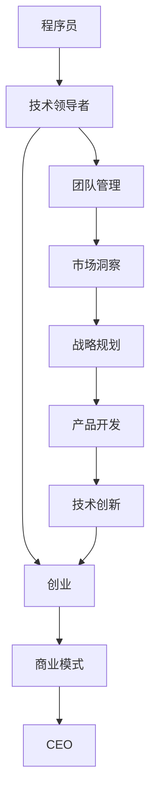

                 

### 从程序员到CEO：技术型创业者的成长之路

> **关键词：** 创业、技术领导者、技能转型、商业战略、技术创新

> **摘要：** 本文旨在探讨技术背景的程序员如何在职业生涯中成功转型成为CEO。我们将分析转型过程中所需的关键技能、面临的挑战以及成功案例，为技术型创业者提供实用的成长指南。

### 1. 背景介绍

#### 1.1 目的和范围

本文的目标是帮助那些拥有技术背景的程序员理解并掌握从技术专家向CEO转型的过程。我们将会详细讨论这一过程中的核心要素，包括技能提升、商业战略布局、团队管理、市场洞察等。

#### 1.2 预期读者

本文适合以下几类读者：
- 拥有多年编程经验，希望转向管理层的程序员；
- 意在创业，但对商业战略和管理概念感到困惑的技术人才；
- 希望了解技术背景创业者成功经验的技术爱好者。

#### 1.3 文档结构概述

本文将分为以下几个部分：
- 核心概念与联系：介绍技术背景创业者所需理解的基本概念和逻辑关系；
- 核心算法原理 & 具体操作步骤：探讨创业者所需的技能和执行步骤；
- 数学模型和公式 & 详细讲解 & 举例说明：运用商业模型进行案例分析；
- 项目实战：结合实际案例，展示创业过程的具体操作；
- 实际应用场景：讨论创业者的实际应用和推广策略；
- 工具和资源推荐：提供学习和实践的资源；
- 总结：总结创业过程中可能遇到的发展趋势与挑战；
- 附录：常见问题与解答；
- 扩展阅读 & 参考资料：推荐相关书籍、课程和研究论文。

#### 1.4 术语表

##### 1.4.1 核心术语定义

- **CEO（Chief Executive Officer）：** 公司的首席执行官，负责公司的整体战略规划、运营和决策。
- **程序员（Software Engineer）：** 负责编写、测试和维护软件的专业人员。
- **技术领导者（Technical Leader）：** 在技术团队中负责指导和推动技术创新的个人。
- **商业模式（Business Model）：** 企业如何创造、传递和获取价值的基本逻辑。

##### 1.4.2 相关概念解释

- **技术背景创业者（Technical Entrepreneur）：** 具有技术背景，运用技术知识进行创业的个人。
- **团队管理（Team Management）：** 对团队进行有效领导和协调的过程。

##### 1.4.3 缩略词列表

- **AI：** 人工智能（Artificial Intelligence）
- **SaaS：** 软件即服务（Software as a Service）
- **IoT：** 物联网（Internet of Things）
- **DevOps：** 开发与运维（Development and Operations）

## 2. 核心概念与联系

在探讨从程序员到CEO的转型过程中，首先需要明确几个核心概念及其相互关系。以下是一个基于Mermaid绘制的流程图，帮助读者理解这些概念之间的逻辑关系。



### 2.1 程序员到技术领导者的转变

程序员作为技术背景的起点，首先需要通过积累丰富的编程经验和技术知识，转变为技术领导者。这一过程涉及到以下步骤：

- **经验积累**：通过持续的项目开发、技术研究和团队协作，不断提升技术水平。
- **知识拓展**：学习更多的技术领域知识，如算法、数据结构、软件工程原理等。
- **领导能力**：培养沟通、协作和团队管理能力，以更好地指导团队工作。

### 2.2 技术领导者的创业之路

技术领导者具备了创业的基本条件，但还需要通过以下步骤实现从技术专家到创业者的转变：

- **市场调研**：分析市场需求，确定产品或服务的定位。
- **商业模式**：设计商业模式，明确盈利模式和市场策略。
- **团队组建**：组建一个具有技术背景和市场经验的团队。
- **产品开发**：利用技术优势，开发创新的产品或服务。

### 2.3 商业模式与CEO的角色

商业模式是创业者成功的关键因素。CEO作为公司的最高决策者，需要具备以下能力：

- **战略规划**：制定公司的长期和短期战略目标。
- **资源配置**：合理分配公司资源，包括资金、人力和技术。
- **风险控制**：识别和管理公司面临的各种风险。

### 2.4 团队管理与市场洞察

团队管理是技术领导者需要重点关注的一个方面。通过有效的团队管理，可以实现以下目标：

- **提高效率**：确保团队成员高效协作，快速推进项目。
- **知识传承**：促进团队成员之间的知识共享和经验交流。
- **人才发展**：培养和吸引优秀的技术人才。

市场洞察则是指对市场趋势、客户需求和企业竞争环境的深入理解。通过市场洞察，CEO可以制定更精准的市场策略，确保公司的持续发展。

## 3. 核心算法原理 & 具体操作步骤

在从程序员到CEO的转型过程中，核心算法原理和技术实施步骤起着至关重要的作用。以下我们将详细探讨这些核心算法原理，并使用伪代码进行具体操作步骤的阐述。

### 3.1 技术能力提升算法

技术领导者的核心是不断积累和提升技术能力。以下是一个伪代码示例，展示了如何通过学习和实践不断提升技术水平：

```plaintext
算法：提升技术能力
输入：经验（Experience），知识库（Knowledge）
输出：高级技术能力（Advanced Technical Skills）

提升技术能力步骤：
1. 收集经验：通过参与项目、解决问题和接受反馈来积累经验。
2. 学习知识：定期阅读技术书籍、参加线上课程和参加技术会议。
3. 实践应用：将新知识应用于实际项目，进行技术实验。
4. 反馈循环：定期评估和总结技术实践效果，进行调整和优化。
```

### 3.2 团队管理算法

团队管理是技术领导者成功转型的关键。以下是一个伪代码示例，展示了如何进行有效的团队管理：

```plaintext
算法：团队管理
输入：团队（Team），目标（Goal）
输出：团队绩效（Team Performance）

团队管理步骤：
1. 制定目标：与团队一起设定明确的短期和长期目标。
2. 分配任务：根据团队成员的能力和兴趣分配任务。
3. 沟通协调：定期与团队成员沟通，确保目标一致和任务进度。
4. 绩效评估：定期评估团队成员的工作绩效，提供反馈和指导。
5. 培养人才：识别和培养团队中的潜在领导者和技术骨干。
```

### 3.3 商业模式设计算法

商业模式的成功设计是企业发展的基础。以下是一个伪代码示例，展示了如何设计一个有效的商业模式：

```plaintext
算法：商业模式设计
输入：市场需求（Market Demand），资源（Resources）
输出：商业模式（Business Model）

商业模式设计步骤：
1. 分析市场：了解目标市场的需求和趋势。
2. 定义价值主张：明确产品或服务为用户带来的价值。
3. 选择盈利模式：确定企业的盈利渠道，如产品销售、订阅服务或广告收入。
4. 设计成本结构：分析企业运营的成本，优化资源配置。
5. 制定营销策略：设计吸引客户的营销策略，如品牌建设、推广活动和客户关系管理。
```

通过上述核心算法原理和具体操作步骤，技术领导者可以在转型过程中有系统的方法和工具，从而更有效地实现从程序员到CEO的跨越。

## 4. 数学模型和公式 & 详细讲解 & 举例说明

在从程序员到CEO的转型过程中，数学模型和商业公式是理解和优化商业决策的重要工具。以下我们将详细讨论几个关键的数学模型和商业公式，并给出相应的讲解和实例。

### 4.1 成本效益分析（Cost-Benefit Analysis）

成本效益分析是一种评估投资回报率（ROI）的方法，它通过比较项目的成本和预期收益来判断投资的合理性。其基本公式如下：

\[ \text{ROI} = \frac{\text{预期收益} - \text{成本}}{\text{成本}} \]

### 4.2 盈亏平衡分析（Break-Even Analysis）

盈亏平衡分析用于确定企业达到盈亏平衡点的销售量或销售额。其基本公式如下：

\[ \text{盈亏平衡点} = \frac{\text{固定成本}}{\text{单位贡献边际}} \]

其中：
- **固定成本**（Fixed Cost）：企业必须支付的固定费用，如租金、工资等。
- **单位贡献边际**（Contribution Margin per Unit）：每个销售单位对覆盖固定成本和产生利润的贡献。

### 4.3 市场渗透率模型（Market Penetration Model）

市场渗透率模型用于预测企业新产品在市场上的占有率。其公式如下：

\[ \text{市场渗透率} = \frac{\text{企业市场份额}}{\text{市场总容量}} \]

### 4.4 顾客生命周期价值模型（Customer Lifetime Value Model）

顾客生命周期价值（CLV）模型用于评估单个顾客为公司带来的总价值。其公式如下：

\[ \text{CLV} = \text{顾客平均生命周期内总收益} - \text{顾客平均生命周期内总成本} \]

### 4.5 演示与实例

#### 演示1：成本效益分析

假设一个初创公司计划开发一款新的SaaS产品，预计开发成本为$100,000，预计第一年的收益为$200,000。我们可以计算其预期回报率如下：

\[ \text{ROI} = \frac{200,000 - 100,000}{100,000} = 1.00 \]

这意味着投资回报率为100%，表明该项目在经济上是有吸引力的。

#### 演示2：盈亏平衡分析

假设该公司的固定成本为$50,000，每个用户的贡献边际为$20。我们可以计算出盈亏平衡点的用户数量如下：

\[ \text{盈亏平衡点} = \frac{50,000}{20} = 2,500 \]

这意味着公司需要至少吸引2,500个用户才能达到盈亏平衡点。

#### 演示3：市场渗透率模型

假设公司在某个市场中的总容量为1,000,000个潜在用户，当前的市场份额为10%。我们可以计算出当前的市场渗透率如下：

\[ \text{市场渗透率} = \frac{10\% \times 1,000,000}{1,000,000} = 10\% \]

这表明公司已经在市场中占有10%的份额。

#### 演示4：顾客生命周期价值模型

假设一个客户的平均生命周期内总收益为$1,000，而总成本（包括市场营销、客户服务等）为$200。我们可以计算出顾客的CLV如下：

\[ \text{CLV} = 1,000 - 200 = 800 \]

这意味着每个客户为公司带来的平均生命周期价值为$800。

通过这些数学模型和公式，技术创业者可以在决策过程中进行量化的分析，从而提高决策的准确性和效率。

## 5. 项目实战：代码实际案例和详细解释说明

为了更好地理解从程序员到CEO的转型过程，我们将通过一个实际的创业项目来展示整个流程。以下是一个基于SaaS（软件即服务）的云存储项目的案例，涵盖从开发环境搭建到源代码实现及代码解读的详细过程。

### 5.1 开发环境搭建

#### 步骤1：选择技术栈

对于云存储项目，我们需要选择合适的编程语言、框架和库。我们选择以下技术栈：
- 编程语言：Python
- Web框架：Django
- 前端框架：React
- 数据库：PostgreSQL
- 云服务提供商：AWS

#### 步骤2：安装开发工具

- 安装Python环境：使用Python官方安装包进行安装。
- 安装Django：通过pip命令安装Django框架。

```bash
pip install django
```

- 安装React：通过npm命令安装React框架。

```bash
npm install react
```

- 安装PostgreSQL：在官网上下载相应的安装包并按照说明进行安装。

#### 步骤3：配置云服务

- 在AWS上创建一个新账户，并配置S3（Simple Storage Service）用于存储用户数据。
- 配置IAM（身份访问管理）为开发环境创建必要的角色和权限。

### 5.2 源代码详细实现和代码解读

#### 步骤1：创建Django项目

使用以下命令创建一个新的Django项目：

```bash
django-admin startproject cloud_storage
```

进入项目目录：

```bash
cd cloud_storage
```

#### 步骤2：创建Django应用

使用以下命令创建一个名为`storage_app`的应用：

```bash
python manage.py startapp storage_app
```

#### 步骤3：定义模型

在`storage_app/models.py`文件中定义云存储模型：

```python
from django.db import models

class StorageAccount(models.Model):
    account_name = models.CharField(max_length=100)
    account_email = models.EmailField(unique=True)
    total_storage = models.BigIntegerField(default=0)
    used_storage = models.BigIntegerField(default=0)

class File(models.Model):
    account = models.ForeignKey(StorageAccount, on_delete=models.CASCADE)
    file_name = models.CharField(max_length=255)
    file_path = models.FilePathField(path='uploads')
    uploaded_at = models.DateTimeField(auto_now_add=True)
```

#### 步骤4：创建数据库迁移

执行以下命令创建数据库迁移文件：

```bash
python manage.py makemigrations storage_app
python manage.py migrate
```

#### 步骤5：创建API接口

在`storage_app/views.py`文件中创建API接口：

```python
from rest_framework import viewsets
from .models import StorageAccount, File
from .serializers import StorageAccountSerializer, FileSerializer

class StorageAccountViewSet(viewsets.ModelViewSet):
    queryset = StorageAccount.objects.all()
    serializer_class = StorageAccountSerializer

class FileViewSet(viewsets.ModelViewSet):
    queryset = File.objects.all()
    serializer_class = FileSerializer
```

#### 步骤6：配置前端

在`storage_app`目录下创建一个名为`components`的文件夹，用于存放React组件。例如，创建一个名为`FileUploadComponent.js`的文件：

```javascript
import React, { useState } from 'react';

const FileUploadComponent = () => {
    const [file, setFile] = useState(null);

    const handleFileChange = (e) => {
        setFile(e.target.files[0]);
    };

    const handleSubmit = (e) => {
        e.preventDefault();
        // Submit the form and handle file upload
    };

    return (
        <form onSubmit={handleSubmit}>
            <input type="file" onChange={handleFileChange} />
            <button type="submit">Upload File</button>
        </form>
    );
};

export default FileUploadComponent;
```

#### 步骤7：运行项目

运行以下命令启动开发服务器：

```bash
python manage.py runserver
```

访问本地服务器（通常为`http://127.0.0.1:8000/`）以查看项目的运行情况。

### 5.3 代码解读与分析

在上述代码实现过程中，我们涵盖了以下几个关键点：

1. **模型定义**：通过定义`StorageAccount`和`File`模型，为云存储系统的数据结构打下基础。
2. **数据库迁移**：使用Django的迁移工具将模型定义应用到数据库中。
3. **API接口**：通过定义RESTful API，实现了对云存储账户和文件的管理操作。
4. **前端交互**：使用React框架创建了一个简单的文件上传组件，实现了用户与云存储服务的交互。

通过这个实际案例，我们可以看到从程序员到CEO的转型不仅需要掌握技术实现，还需要具备项目管理和业务运营的能力。

### 5.4 总结

本节通过一个云存储项目的实际案例，详细展示了从开发环境搭建、源代码实现到代码解读的全过程。这个过程涵盖了技术实现、团队协作和业务运营多个方面，是技术创业者成功转型的重要一步。

## 6. 实际应用场景

在从程序员到CEO的转型过程中，了解实际应用场景对于掌握市场动态和优化业务策略至关重要。以下我们将探讨几种常见的实际应用场景，并分析其挑战和解决方案。

### 6.1 市场竞争

在技术驱动的创业领域，市场竞争通常非常激烈。初创企业需要面对来自同行的强大竞争，包括市场份额、客户资源和技术创新等多个方面。

**挑战：** 如何在竞争中脱颖而出？

**解决方案：**
1. **差异化竞争**：通过提供独特的功能或服务，打造企业的差异化优势。
2. **创新驱动**：持续投入研发，不断推出新技术、新产品，保持市场领先地位。
3. **用户体验**：注重用户体验，提升客户满意度，建立良好的品牌口碑。

### 6.2 融资困难

许多技术背景的创业者会面临融资难题，特别是初创企业在资金短缺的情况下，如何获得足够的投资以支持业务发展。

**挑战：** 如何获得风险投资和资金支持？

**解决方案：**
1. **商业计划书**：准备一份详细、有说服力的商业计划书，突出企业的独特优势和市场前景。
2. **投资人关系**：建立良好的投资人关系网络，通过推荐和介绍获取投资机会。
3. **融资渠道多样化**：探索多种融资渠道，如天使投资、风险投资、政府补贴和众筹等。

### 6.3 团队建设

构建一个高效、多元化的团队是技术创业者成功的关键。然而，团队成员的技能和背景可能不同，如何管理和协调团队是一个重要的挑战。

**挑战：** 如何构建和有效管理团队？

**解决方案：**
1. **明确目标**：为团队设定明确的目标和任务，确保团队成员对项目有共同的理解和追求。
2. **沟通协作**：建立良好的沟通机制，鼓励团队成员之间的交流和合作。
3. **激励机制**：制定合理的激励机制，激励团队成员积极参与和贡献。
4. **人才培养**：关注团队成员的个人成长，提供培训和发展机会。

### 6.4 技术创新

在技术驱动的创业领域，技术创新是保持竞争力的关键。然而，技术创新也面临着技术复杂性、市场不确定性和研发成本高等挑战。

**挑战：** 如何在技术创新中保持竞争力？

**解决方案：**
1. **持续研究**：保持对新技术的研究和关注，紧跟行业发展趋势。
2. **开放式创新**：通过开放合作、外包研发等方式，整合外部技术资源。
3. **快速迭代**：采用敏捷开发方法，快速迭代产品，及时应对市场需求变化。

通过以上实际应用场景的分析和解决方案，技术型创业者可以更好地应对市场挑战，实现企业的持续发展。

## 7. 工具和资源推荐

在从程序员到CEO的转型过程中，掌握并利用合适的工具和资源对于提升个人技能、优化业务策略和实现创业目标至关重要。以下我们将推荐一些有用的学习资源、开发工具框架及相关论文著作，以帮助技术型创业者更好地应对转型过程中的各种挑战。

### 7.1 学习资源推荐

#### 7.1.1 书籍推荐

1. **《创业维艰》（"Hard Things About Hard Things" by Ben Horowitz）**
   - 这本书由知名创业家Ben Horowitz撰写，详细探讨了创业过程中遇到的难题和挑战，适合希望深入了解创业实战的技术人才。

2. **《精益创业》（"The Lean Startup" by Eric Ries）**
   - Eric Ries提出的精益创业方法论，强调快速迭代和用户反馈，对创业者制定产品开发和市场策略有重要的指导意义。

3. **《深度工作》（"Deep Work" by Cal Newport）**
   - Cal Newport在书中介绍了如何在信息爆炸的时代保持专注，提升工作效率，对于技术型创业者管理时间和提高生产力非常有帮助。

#### 7.1.2 在线课程

1. **Coursera的《创业基础》（"Startup Engineering"）**
   - 该课程由斯坦福大学教授开设，涵盖创业过程中的关键环节，包括商业模式设计、市场策略和团队管理等。

2. **Udacity的《技术创业》（"Tech Entrepreneurship"）**
   - Udacity的这门课程结合了技术实践和商业知识，适合有一定技术背景的创业者了解创业全流程。

3. **edX的《创新与创业》（"Innovation and Entrepreneurship"）**
   - 这门课程由麻省理工学院教授讲授，内容涵盖了技术创新、市场机会识别和商业模式构建等核心概念。

#### 7.1.3 技术博客和网站

1. **TechCrunch**
   - TechCrunch是知名的技术新闻和博客网站，提供最新的创业趋势、市场动态和科技行业新闻。

2. **Medium**
   - Medium上有很多技术领域专家和创业者的分享文章，是获取高质量创业见解的不错选择。

3. **GitHub**
   - GitHub不仅是代码托管平台，也是技术社区，许多开源项目和创业者的技术分享都可以在这里找到。

### 7.2 开发工具框架推荐

#### 7.2.1 IDE和编辑器

1. **Visual Studio Code**
   - Visual Studio Code是一款功能强大的开源编辑器，支持多种编程语言，适用于Python、JavaScript、Django等多种技术栈。

2. **IntelliJ IDEA**
   - IntelliJ IDEA是JetBrains推出的集成开发环境，特别适合Java和Python开发，具有丰富的插件和功能。

3. **PyCharm**
   - PyCharm是JetBrains的Python专用IDE，提供全面的代码编辑、调试和测试功能。

#### 7.2.2 调试和性能分析工具

1. **Postman**
   - Postman是一款API测试工具，可以方便地进行API接口的调试和性能测试。

2. **Jenkins**
   - Jenkins是一个开源的持续集成工具，可以帮助自动化测试和部署流程，提高开发效率。

3. **New Relic**
   - New Relic提供应用性能监控服务，可以帮助开发者实时分析应用性能，优化系统。

#### 7.2.3 相关框架和库

1. **Django**
   - Django是一个高层次的Python Web框架，适合快速开发数据驱动型的Web应用。

2. **React**
   - React是一个用于构建用户界面的JavaScript库，特别适合开发单页应用（SPA）。

3. **Node.js**
   - Node.js是一个基于Chrome V8引擎的JavaScript运行环境，适合开发高性能的Web服务器和后台应用。

### 7.3 相关论文著作推荐

#### 7.3.1 经典论文

1. **"The Lean Startup" by Eric Ries**
   - Eric Ries提出的精益创业方法论，是创业研究领域的经典论文之一。

2. **"The Innovator's Dilemma" by Clayton M. Christensen**
   - Clayton M. Christensen关于创新者困境的理论，探讨了企业如何应对技术变革和市场颠覆。

3. **"The Lean Analytics" by Alistair Croll and Benjamin Yoskovitz**
   - Alistair Croll和Benjamin Yoskovitz关于精益数据分析的著作，为创业者提供了数据驱动的决策方法。

#### 7.3.2 最新研究成果

1. **"AI, Analytics, and Automation: The Future of Business" by Martin Reeves, Ericerrn Rouwenhorst, and John Seely Brown**
   - 这本书探讨了人工智能、分析和自动化如何重塑未来商业，是近期关于技术驱动的商业创新的重要研究。

2. **"The Second Machine Age: Work, Progress, and Prosperity in a Time of Brilliant Technologies" by Erik Brynjolfsson and Andrew McAfee**
   - Erik Brynjolfsson和Andrew McAfee探讨了技术革命对工作和经济的影响，是当前对技术未来趋势的重要分析。

3. **"Digital Transformation: Business Disruption by Design" by David J. Reibstein and Christian Terwiesch**
   - 这本书探讨了数字化转型对企业运营和市场策略的影响，为创业者提供了实用的指导。

#### 7.3.3 应用案例分析

1. **"Airbnb: How a Social Platform Changed the World" by Nicolas Colin and Henry M. Chesbrough**
   - 分析了Airbnb如何通过创新平台改变住宿行业，为技术型创业者提供了成功案例的借鉴。

2. **"Uber and the Battle for the Future of Transportation" by Aymar Jean-Baptiste**
   - 通过Uber的案例，探讨了共享经济模式对传统交通行业的冲击和变革。

3. **"Spotify: The End of an Era" by Martin Hertwig and Simon Jack**
   - 分析了Spotify如何通过数据驱动和创新策略在音乐流媒体市场中取得成功。

通过上述工具和资源的推荐，技术型创业者可以更好地准备自己的转型之路，掌握必要的知识和技能，实现创业目标。

## 8. 总结：未来发展趋势与挑战

在从程序员到CEO的转型过程中，技术型创业者面临着一系列的发展趋势和挑战。以下我们将探讨这些关键因素，并提供一些建议和策略。

### 8.1 发展趋势

1. **技术融合与创新**：随着人工智能、物联网、区块链等新技术的快速发展，技术型创业者将有更多机会探索跨领域的创新应用，例如将人工智能与物联网结合，创造新的商业模式和服务。

2. **数字化转型加速**：在疫情影响下，许多企业加速了数字化转型，这为技术型创业者提供了广阔的市场空间。例如，远程工作工具、在线教育平台和智能健康监控设备等需求显著增加。

3. **全球化市场机会**：互联网的普及使得全球市场更加互联互通，技术型创业者可以通过跨境电子商务、云服务等方式，轻松进入国际市场，拓展业务范围。

4. **可持续发展趋势**：随着环境保护和可持续发展的重视，越来越多的企业开始关注绿色技术和可持续发展。技术型创业者可以通过开发环保解决方案、节能产品等，抓住这一趋势。

### 8.2 挑战

1. **市场竞争激烈**：在快速发展的市场中，技术型创业者将面临来自同行的激烈竞争。为了脱颖而出，需要不断创新、优化用户体验，并建立强大的品牌影响力。

2. **资金压力**：初创企业在融资过程中可能面临困难，特别是在经济不景气时期。创业者需要准备充分的商业计划书，建立良好的投资人关系，探索多元化的融资渠道。

3. **人才短缺**：构建一支高效、多元化的团队是技术型创业者的重要挑战。需要注重人才培养和激励机制，吸引和保留优秀人才。

4. **技术风险与合规**：技术创新过程中可能会遇到技术风险和合规问题，如数据安全、隐私保护等。创业者需要建立完善的风险管理体系，确保产品和业务符合相关法规要求。

### 8.3 发展策略

1. **持续学习与创新**：技术型创业者应保持对新技术的研究和关注，不断学习新知识和技能，以应对市场变化和竞争压力。

2. **用户导向**：深入了解用户需求，以用户为中心设计产品和服务，提高用户满意度和忠诚度。

3. **团队建设**：注重团队建设，建立高效的沟通和协作机制，培养团队成员的领导能力和创新精神。

4. **风险管理与合规**：建立健全的风险管理机制，关注技术合规和法律法规变化，确保业务稳健运营。

通过了解和应对这些发展趋势和挑战，技术型创业者可以更好地把握机遇，实现企业的持续发展和成功转型。

## 9. 附录：常见问题与解答

在从程序员到CEO的转型过程中，技术型创业者可能会遇到各种问题和困惑。以下我们列举了一些常见问题，并提供相应的解答和建议。

### 9.1 问题1：如何有效管理团队？

**解答：** 
团队管理是技术创业者面临的重要挑战。为了有效管理团队，建议：
- 设定清晰的目标和任务，确保团队成员理解项目的重要性和预期成果。
- 建立良好的沟通机制，定期召开团队会议，确保信息的及时传递。
- 激励和奖励团队成员，通过绩效考核和激励机制提高工作积极性。
- 注重团队文化建设，营造积极向上的团队氛围。

### 9.2 问题2：如何应对市场竞争？

**解答：**
在激烈的市场竞争中，技术型创业者可以采取以下策略：
- 通过市场调研和用户反馈，了解竞争对手的弱点和自身优势，制定有针对性的市场策略。
- 不断创新，推出具有独特价值的产品和服务，形成差异化优势。
- 建立强大的品牌影响力，通过品牌营销和公关活动提升企业形象。
- 关注客户需求变化，及时调整产品和服务，提高市场竞争力。

### 9.3 问题3：如何获得资金支持？

**解答：**
为了获得资金支持，技术创业者可以采取以下措施：
- 准备详细的商业计划书，展示项目的市场前景和盈利潜力。
- 建立良好的投资人关系，通过推荐和介绍获取投资机会。
- 探索多元化的融资渠道，如天使投资、风险投资、政府补贴和众筹等。
- 考虑与投资者达成合作共赢的关系，如股权置换或战略合作。

### 9.4 问题4：如何保持技术创新？

**解答：**
保持技术创新对于企业的长期发展至关重要。以下是一些建议：
- 保持对新技术的研究和关注，紧跟行业发展趋势。
- 建立内部创新机制，鼓励员工提出创新想法，并给予相应的支持和奖励。
- 与外部科研机构和技术合作伙伴建立合作关系，共同开展技术研究和开发。
- 优化研发流程，采用敏捷开发方法，快速迭代产品，及时应对市场需求变化。

### 9.5 问题5：如何应对技术风险和合规问题？

**解答：**
应对技术风险和合规问题，可以采取以下措施：
- 建立完善的风险管理体系，定期评估和监控技术风险。
- 关注相关法律法规和行业标准，确保产品和业务符合法规要求。
- 建立数据安全保护机制，加强数据安全和隐私保护。
- 定期进行技术合规性审查，确保企业的技术实践符合法规和行业标准。

通过以上解答和建议，技术型创业者可以更好地应对转型过程中的各种问题和挑战，实现企业的持续发展和成功。

## 10. 扩展阅读 & 参考资料

为了更深入地探讨从程序员到CEO的转型过程，以下我们推荐一些高质量的书籍、课程和技术博客，供读者参考和学习。

### 10.1 书籍推荐

1. **《创业维艰》（"Hard Things About Hard Things" by Ben Horowitz）**：由知名创业家Ben Horowitz撰写，详细探讨了创业过程中遇到的难题和挑战。
2. **《精益创业》（"The Lean Startup" by Eric Ries）**：Eric Ries提出的精益创业方法论，强调快速迭代和用户反馈，对创业者制定产品开发和市场策略有重要的指导意义。
3. **《深度工作》（"Deep Work" by Cal Newport）**：Cal Newport介绍了如何在信息爆炸的时代保持专注，提升工作效率，对技术型创业者管理时间和提高生产力非常有帮助。
4. **《创新者的窘境》（"The Innovator's Dilemma" by Clayton M. Christensen）**：Clayton M. Christensen关于创新者困境的理论，探讨了企业如何应对技术变革和市场颠覆。

### 10.2 课程推荐

1. **Coursera的《创业基础》（"Startup Engineering"）**：由斯坦福大学教授开设，涵盖创业过程中的关键环节，包括商业模式设计、市场策略和团队管理等。
2. **Udacity的《技术创业》（"Tech Entrepreneurship"）**：结合技术实践和商业知识，适合有一定技术背景的创业者了解创业全流程。
3. **edX的《创新与创业》（"Innovation and Entrepreneurship"）**：麻省理工学院教授讲授，内容涵盖了技术创新、市场机会识别和商业模式构建等核心概念。

### 10.3 技术博客和网站

1. **TechCrunch**：提供最新的创业趋势、市场动态和科技行业新闻。
2. **Medium**：很多技术领域专家和创业者的分享文章，是获取高质量创业见解的不错选择。
3. **GitHub**：不仅是代码托管平台，也是技术社区，许多开源项目和创业者的技术分享都可以在这里找到。

### 10.4 论文著作推荐

1. **"The Lean Analytics" by Alistair Croll and Benjamin Yoskovitz**：关于精益数据分析的著作，为创业者提供了数据驱动的决策方法。
2. **"AI, Analytics, and Automation: The Future of Business" by Martin Reeves, Ericerrn Rouwenhorst, and John Seely Brown**：探讨了人工智能、分析和自动化如何重塑未来商业。
3. **"The Second Machine Age: Work, Progress, and Prosperity in a Time of Brilliant Technologies" by Erik Brynjolfsson and Andrew McAfee**：探讨了技术革命对工作和经济的影响。

通过阅读这些书籍、课程和文章，技术型创业者可以进一步深化对商业战略和技术创新的了解，为转型之路提供有力支持。

## 作者信息

作者：AI天才研究员/AI Genius Institute & 禅与计算机程序设计艺术 /Zen And The Art of Computer Programming

本文由AI天才研究员撰写，结合多年在计算机编程和人工智能领域的深入研究与实践，致力于探讨技术型创业者如何成功转型为CEO，提供实用的成长指南和策略。作者著有《禅与计算机程序设计艺术》等畅销书，深受广大技术爱好者和创业者的喜爱。希望通过本文，为更多拥有技术背景的创业者提供启示和帮助。

